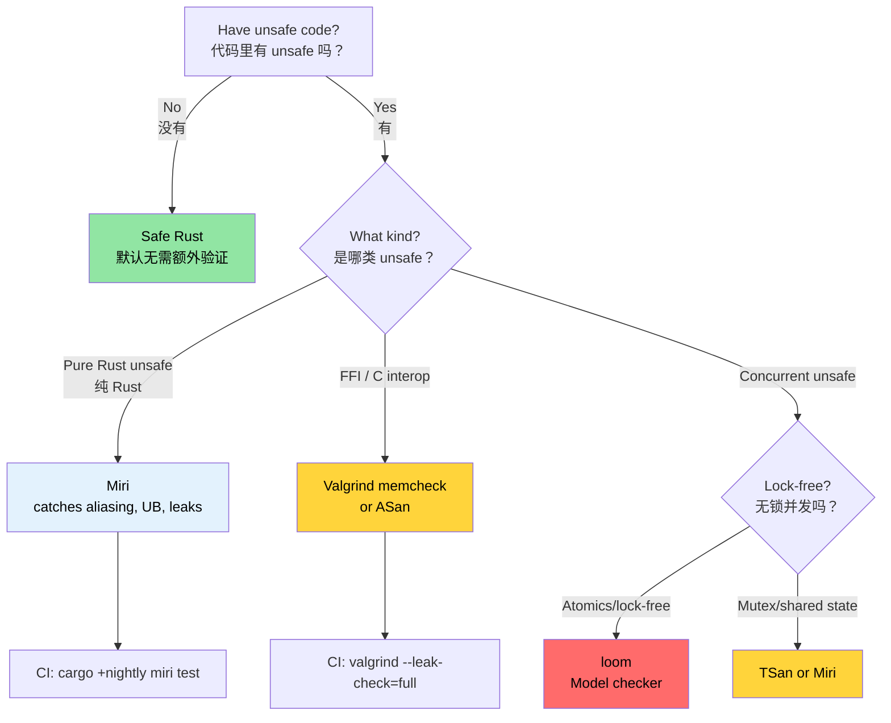

# Miri, Valgrind, and Sanitizers — Verifying Unsafe Code 🔴<br><span class="zh-inline">Miri、Valgrind 与 Sanitizer：验证 unsafe 代码 🔴</span>

> **What you'll learn:**<br><span class="zh-inline">**本章将学到什么：**</span>
> - Miri as a MIR interpreter — what it catches and what it cannot<br><span class="zh-inline">把 Miri 当成 MIR 解释器来理解：它能抓什么，抓不到什么</span>
> - Valgrind memcheck, Helgrind, Callgrind, and Massif<br><span class="zh-inline">Valgrind 家族工具：memcheck、Helgrind、Callgrind、Massif</span>
> - LLVM sanitizers: ASan, MSan, TSan, LSan with nightly `-Zbuild-std`<br><span class="zh-inline">LLVM Sanitizer：ASan、MSan、TSan、LSan，以及 nightly 下的 `-Zbuild-std`</span>
> - `cargo-fuzz` for crash discovery and `loom` for concurrency model checking<br><span class="zh-inline">如何用 `cargo-fuzz` 找崩溃，以及用 `loom` 做并发模型检查</span>
> - A decision tree for choosing the right verification tool<br><span class="zh-inline">如何选择合适验证工具的决策树</span>
>
> **Cross-references:** [Code Coverage](ch04-code-coverage-seeing-what-tests-miss.md) — coverage finds untested paths, Miri verifies the tested ones · [`no_std` & Features](ch09-no-std-and-feature-verification.md) — `no_std` code often requires `unsafe` that Miri can verify · [CI/CD Pipeline](ch11-putting-it-all-together-a-production-cic.md) — Miri job in the pipeline<br><span class="zh-inline">**交叉阅读：** [代码覆盖率](ch04-code-coverage-seeing-what-tests-miss.md) 负责找没测到的路径；Miri 则负责验证已经测到的路径里有没有未定义行为。[`no_std` 与 feature](ch09-no-std-and-feature-verification.md) 讲的很多 `unsafe` 场景也适合拿 Miri 来校验。[CI/CD 流水线](ch11-putting-it-all-together-a-production-cic.md) 则会把 Miri 接进流水线。</span>

Safe Rust guarantees memory safety and data-race freedom at compile time. But the moment you write `unsafe` for FFI、手写数据结构或者性能技巧，这些保证就变成了开发者自己的责任。本章讨论的，就是怎么证明这些 `unsafe` 真配得上它嘴里的安全契约。<br><span class="zh-inline">Safe Rust 会在编译期保证内存安全和无数据竞争。但只要写下 `unsafe`，无论是为了 FFI、手写数据结构还是性能技巧，这些保证就得自己扛。本章讲的就是：拿什么工具去验证这些 `unsafe` 代码，真的没有在胡来。</span>

### Miri — An Interpreter for Unsafe Rust<br><span class="zh-inline">Miri：unsafe Rust 的解释器</span>

[Miri](https://github.com/rust-lang/miri) is an interpreter for Rust MIR. Instead of producing machine code, it executes your program step by step and checks every operation for undefined behavior.<br><span class="zh-inline">[Miri](https://github.com/rust-lang/miri) 是 Rust MIR 的解释器。它不生成机器码，而是一步一步执行程序，同时在每个操作点上检查有没有未定义行为。</span>

```bash
# Install Miri (nightly-only component)
rustup +nightly component add miri

# Run your test suite under Miri
cargo +nightly miri test

# Run a specific binary under Miri
cargo +nightly miri run

# Run a specific test
cargo +nightly miri test -- test_name
```

**How Miri works:**<br><span class="zh-inline">**Miri 大概是这么工作的：**</span>

```text
Source → rustc → MIR → Miri interprets MIR
                        │
                        ├─ Tracks every pointer's provenance
                        ├─ Validates every memory access
                        ├─ Checks alignment at every deref
                        ├─ Detects use-after-free
                        ├─ Detects data races (with threads)
                        └─ Enforces Stacked Borrows / Tree Borrows rules
```

```text
源码 → rustc → MIR → Miri 解释执行 MIR
                    │
                    ├─ 跟踪每个指针的 provenance
                    ├─ 校验每一次内存访问
                    ├─ 检查解引用时的对齐
                    ├─ 抓 use-after-free
                    ├─ 检测线程间数据竞争
                    └─ 执行 Stacked Borrows / Tree Borrows 规则
```

### What Miri Catches (and What It Cannot)<br><span class="zh-inline">Miri 能抓什么，抓不到什么</span>

**Miri detects:**<br><span class="zh-inline">**Miri 能抓到的典型问题：**</span>

| Category<br><span class="zh-inline">类别</span> | Example<br><span class="zh-inline">例子</span> | Would Crash at Runtime?<br><span class="zh-inline">运行时一定会崩吗</span> |
|----------|---------|------------------------|
| Out-of-bounds access<br><span class="zh-inline">越界访问</span> | `ptr.add(100).read()` | Sometimes<br><span class="zh-inline">不一定</span> |
| Use after free<br><span class="zh-inline">释放后继续用</span> | Reading a dropped `Box` | Sometimes |
| Double free<br><span class="zh-inline">重复释放</span> | `drop_in_place` twice | Usually |
| Unaligned access<br><span class="zh-inline">未对齐访问</span> | `(ptr as *const u32).read()` on odd address | On some architectures |
| Invalid values<br><span class="zh-inline">非法值</span> | `transmute::<u8, bool>(2)` | Often silent |
| Dangling references<br><span class="zh-inline">悬垂引用</span> | `&*ptr` where ptr is freed | Often silent |
| Data races<br><span class="zh-inline">数据竞争</span> | Two threads, unsynchronized writes | Hard to reproduce |
| Stacked Borrows violation<br><span class="zh-inline">借用规则违例</span> | aliasing `&mut` | Often silent |

**Miri does NOT detect:**<br><span class="zh-inline">**Miri 抓不到的东西：**</span>

| Limitation<br><span class="zh-inline">限制</span> | Why<br><span class="zh-inline">原因</span> |
|-----------|-----|
| Logic bugs<br><span class="zh-inline">业务逻辑错误</span> | Miri checks safety, not correctness<br><span class="zh-inline">它查安全，不查业务含义。</span> |
| Deadlocks and livelocks<br><span class="zh-inline">死锁与活锁</span> | It is not a full concurrency model checker<br><span class="zh-inline">它不是完整并发模型检查器。</span> |
| Performance problems<br><span class="zh-inline">性能问题</span> | It is an interpreter, not a profiler<br><span class="zh-inline">它是解释器，不是性能分析器。</span> |
| OS/hardware interaction<br><span class="zh-inline">系统调用和硬件交互</span> | It cannot emulate devices and most syscalls<br><span class="zh-inline">它没法模拟真实外设和大量系统调用。</span> |
| All FFI calls<br><span class="zh-inline">所有 FFI 调用</span> | It cannot interpret C code<br><span class="zh-inline">它解释不了 C 代码。</span> |
| Paths your tests never reach<br><span class="zh-inline">测试没走到的路径</span> | It only checks executed code paths<br><span class="zh-inline">没执行到的路径它也看不到。</span> |

**A concrete example:**<br><span class="zh-inline">**一个实际例子：**</span>

```rust
#[cfg(test)]
mod tests {
    #[test]
    fn test_miri_catches_ub() {
        let mut v = vec![1, 2, 3];
        let ptr = v.as_ptr();

        v.push(4);

        // ❌ UB: ptr may be dangling after reallocation
        // let _val = unsafe { *ptr };

        // ✅ Correct: get a fresh pointer after mutation
        let ptr = v.as_ptr();
        let val = unsafe { *ptr };
        assert_eq!(val, 1);
    }
}
```

### Running Miri on a Real Crate<br><span class="zh-inline">在真实 crate 上跑 Miri</span>

```bash
# Step 1: Run all tests under Miri
cargo +nightly miri test 2>&1 | tee miri_output.txt

# Step 2: If Miri reports errors, isolate them
cargo +nightly miri test -- failing_test_name

# Step 3: Use Miri's backtrace for diagnosis
MIRIFLAGS="-Zmiri-backtrace=full" cargo +nightly miri test

# Step 4: Choose a borrow model
cargo +nightly miri test
MIRIFLAGS="-Zmiri-tree-borrows" cargo +nightly miri test
```

**Useful Miri flags:**<br><span class="zh-inline">**常用的 Miri 参数：**</span>

```bash
MIRIFLAGS="-Zmiri-disable-isolation" cargo +nightly miri test
MIRIFLAGS="-Zmiri-seed=42" cargo +nightly miri test
MIRIFLAGS="-Zmiri-strict-provenance" cargo +nightly miri test
MIRIFLAGS="-Zmiri-disable-isolation -Zmiri-backtrace=full -Zmiri-strict-provenance" \
    cargo +nightly miri test
```

**Miri in CI:**<br><span class="zh-inline">**CI 里的 Miri：**</span>

```yaml
name: Miri
on: [push, pull_request]

jobs:
  miri:
    runs-on: ubuntu-latest
    steps:
      - uses: actions/checkout@v4
      - uses: dtolnay/rust-toolchain@nightly
        with:
          components: miri

      - name: Run Miri
        run: cargo miri test --workspace
        env:
          MIRIFLAGS: "-Zmiri-backtrace=full"
```

> **Performance note**: Miri is often 10-100× slower than native execution. In CI, it is better to focus on crates or tests that actually contain `unsafe` code.<br><span class="zh-inline">**性能提醒**：Miri 经常比原生执行慢 10 到 100 倍，所以在 CI 里最好只挑那些真的带 `unsafe` 的 crate 或测试来跑。</span>

### Valgrind and Its Rust Integration<br><span class="zh-inline">Valgrind 以及它在 Rust 里的用法</span>

[Valgrind](https://valgrind.org/) is the classic native memory checker from the C/C++ world, but it can also inspect compiled Rust binaries because它看的是最终机器码。<br><span class="zh-inline">[Valgrind](https://valgrind.org/) 是 C/C++ 世界里非常经典的内存检查工具。它同样能检查 Rust 编译后的二进制，因为它盯的是最终生成的机器码。</span>

```bash
# Install Valgrind
sudo apt install valgrind

# Build with debug info
cargo build --tests

# Run a specific test binary under Valgrind
valgrind --tool=memcheck \
    --leak-check=full \
    --show-leak-kinds=all \
    --track-origins=yes \
    ./target/debug/deps/my_crate-abc123 --test-threads=1

# Run the main binary
valgrind --tool=memcheck \
    --leak-check=full \
    --error-exitcode=1 \
    ./target/debug/diag_tool --run-diagnostics
```

**Valgrind tools beyond memcheck:**<br><span class="zh-inline">**除了 memcheck，Valgrind 还有这些工具：**</span>

| Tool | Command | What It Detects<br><span class="zh-inline">作用</span> |
|------|---------|----------------|
| **Memcheck** | `--tool=memcheck` | Memory leaks, use-after-free, buffer overflows<br><span class="zh-inline">内存泄漏、释放后访问、越界</span> |
| **Helgrind** | `--tool=helgrind` | Data races and lock-order violations<br><span class="zh-inline">数据竞争和锁顺序问题</span> |
| **DRD** | `--tool=drd` | Data races with another algorithm<br><span class="zh-inline">另一套数据竞争检测算法</span> |
| **Callgrind** | `--tool=callgrind` | Instruction-level profiling<br><span class="zh-inline">指令级性能分析</span> |
| **Massif** | `--tool=massif` | Heap memory profile over time<br><span class="zh-inline">堆内存变化曲线</span> |
| **Cachegrind** | `--tool=cachegrind` | Cache miss analysis<br><span class="zh-inline">缓存命中分析</span> |

**Using Callgrind:**<br><span class="zh-inline">**Callgrind 的典型用法：**</span>

```bash
valgrind --tool=callgrind \
    --callgrind-out-file=callgrind.out \
    ./target/release/diag_tool --run-diagnostics

kcachegrind callgrind.out
callgrind_annotate callgrind.out | head -100
```

**Miri vs Valgrind:**<br><span class="zh-inline">**Miri 和 Valgrind 怎么选：**</span>

| Aspect<br><span class="zh-inline">方面</span> | Miri | Valgrind |
|--------|------|----------|
| Rust-specific UB<br><span class="zh-inline">Rust 专属 UB</span> | ✅ | ❌ |
| FFI / C code<br><span class="zh-inline">FFI 与 C 代码</span> | ❌ | ✅ |
| Needs nightly<br><span class="zh-inline">需要 nightly</span> | ✅ | ❌ |
| Speed<br><span class="zh-inline">速度</span> | 10-100× slower | 10-50× slower |
| Leak detection<br><span class="zh-inline">泄漏检测</span> | ✅ | ✅ |
| Data race detection<br><span class="zh-inline">数据竞争</span> | ✅ | ✅（借助 Helgrind/DRD） |

**Use both**:<br><span class="zh-inline">**最务实的做法是两者配合：**</span>

- **Miri** for pure Rust `unsafe` code<br><span class="zh-inline">纯 Rust `unsafe` 先交给 Miri。</span>
- **Valgrind** for FFI-heavy code and whole-program leak checks<br><span class="zh-inline">FFI 重的路径和整程序泄漏分析交给 Valgrind。</span>

### AddressSanitizer, MemorySanitizer, ThreadSanitizer<br><span class="zh-inline">ASan、MSan、TSan 与 LSan</span>

LLVM sanitizers are compile-time instrumentation passes with runtime checks. They are typically much faster than Valgrind and catch a different slice of bugs.<br><span class="zh-inline">LLVM sanitizer 是编译期插桩、运行期检查的一类工具。它们通常比 Valgrind 快很多，而且能抓到另一类问题。</span>

```bash
rustup component add rust-src --toolchain nightly

RUSTFLAGS="-Zsanitizer=address" \
    cargo +nightly test -Zbuild-std --target x86_64-unknown-linux-gnu

RUSTFLAGS="-Zsanitizer=memory" \
    cargo +nightly test -Zbuild-std --target x86_64-unknown-linux-gnu

RUSTFLAGS="-Zsanitizer=thread" \
    cargo +nightly test -Zbuild-std --target x86_64-unknown-linux-gnu

RUSTFLAGS="-Zsanitizer=leak" \
    cargo +nightly test --target x86_64-unknown-linux-gnu
```

> **Note**: ASan、MSan、TSan 一般都需要 `-Zbuild-std`，因为标准库也得跟着插桩；LSan 相对特殊一些。<br><span class="zh-inline">**注意**：ASan、MSan、TSan 通常都需要 `-Zbuild-std`，因为标准库本身也要重新插桩。LSan 则相对特殊一些。</span>

**Sanitizer comparison:**<br><span class="zh-inline">**几种 sanitizer 的对比：**</span>

| Sanitizer | Overhead<br><span class="zh-inline">开销</span> | Catches<br><span class="zh-inline">抓什么</span> |
|-----------|----------|---------|
| **ASan** | about 2× | Buffer overflow, use-after-free, stack overflow<br><span class="zh-inline">越界、释放后访问、栈溢出</span> |
| **MSan** | about 3× | Uninitialized reads<br><span class="zh-inline">未初始化内存读取</span> |
| **TSan** | 5× and above | Data races<br><span class="zh-inline">数据竞争</span> |
| **LSan** | Minimal | Memory leaks<br><span class="zh-inline">内存泄漏</span> |

**A race example:**<br><span class="zh-inline">**一个数据竞争例子：**</span>

```rust
use std::sync::Arc;
use std::thread;

fn racy_counter() -> u64 {
    let data = Arc::new(std::cell::UnsafeCell::new(0u64));
    let mut handles = vec![];

    for _ in 0..4 {
        let data = Arc::clone(&data);
        handles.push(thread::spawn(move || {
            for _ in 0..1000 {
                unsafe {
                    *data.get() += 1;
                }
            }
        }));
    }

    for h in handles {
        h.join().unwrap();
    }

    unsafe { *data.get() }
}
```

Both Miri and TSan can complain about this, and the fix is to use `AtomicU64` or `Mutex<u64>`.<br><span class="zh-inline">这类代码 Miri 和 TSan 都会骂，而且它们骂得没毛病。修法通常就是回到 `AtomicU64` 或 `Mutex<u64>`。</span>

### Related Tools: Fuzzing and Concurrency Verification<br><span class="zh-inline">相关工具：fuzz 与并发验证</span>

**`cargo-fuzz` — Coverage-Guided Fuzzing**:<br><span class="zh-inline">**`cargo-fuzz`：覆盖率引导的模糊测试。**</span>

```bash
cargo install cargo-fuzz
cargo fuzz init
cargo fuzz add parse_gpu_csv
```

```rust
#![no_main]
use libfuzzer_sys::fuzz_target;

fuzz_target!(|data: &[u8]| {
    if let Ok(s) = std::str::from_utf8(data) {
        let _ = diag_tool::parse_gpu_csv(s);
    }
});
```

```bash
cargo +nightly fuzz run parse_gpu_csv -- -max_total_time=300
cargo +nightly fuzz tmin parse_gpu_csv artifacts/parse_gpu_csv/crash-...
```

**When to fuzz:** parsers、配置读取器、协议解码器、JSON/CSV 处理器，这些都很适合被 fuzz。<br><span class="zh-inline">**什么时候该 fuzz**：只要函数会吃不可信或半可信输入，例如传感器输出、配置文件、网络数据、JSON/CSV，基本都值得 fuzz 一把。</span>

**`loom` — Concurrency Model Checker**:<br><span class="zh-inline">**`loom`：并发模型检查器。**</span>

```toml
[dev-dependencies]
loom = "0.7"
```

```rust
#[cfg(loom)]
mod tests {
    use loom::sync::atomic::{AtomicUsize, Ordering};
    use loom::thread;

    #[test]
    fn test_counter_is_atomic() {
        loom::model(|| {
            let counter = loom::sync::Arc::new(AtomicUsize::new(0));
            let c1 = counter.clone();
            let c2 = counter.clone();

            let t1 = thread::spawn(move || { c1.fetch_add(1, Ordering::SeqCst); });
            let t2 = thread::spawn(move || { c2.fetch_add(1, Ordering::SeqCst); });

            t1.join().unwrap();
            t2.join().unwrap();

            assert_eq!(counter.load(Ordering::SeqCst), 2);
        });
    }
}
```

> **When to use `loom`**: custom lock-free structures, atomics-heavy state machines, or handmade synchronization. For ordinary `Mutex`/`RwLock` code, it is usually unnecessary.<br><span class="zh-inline">**什么时候该用 `loom`**：自定义无锁结构、原子变量很多的状态机、手写同步原语，这些都适合。普通 `Mutex`/`RwLock` 场景一般用不上它。</span>

### When to Use Which Tool<br><span class="zh-inline">到底该用哪个工具</span>

```text
Decision tree for unsafe verification:

Is the code pure Rust (no FFI)?
├─ Yes → Use Miri
│        Also run ASan in CI for extra defense
└─ No
   ├─ Memory safety concerns?
   │  └─ Yes → Use Valgrind memcheck AND ASan
   ├─ Concurrency concerns?
   │  └─ Yes → Use TSan or Helgrind
   └─ Leak concerns?
      └─ Yes → Use Valgrind --leak-check=full
```

```text
unsafe 验证的粗略决策树：

代码是不是纯 Rust，没有 FFI？
├─ 是 → 先上 Miri
│      CI 里再补一层 ASan
└─ 不是
   ├─ 担心内存安全？
   │  └─ 上 Valgrind memcheck + ASan
   ├─ 担心并发问题？
   │  └─ 上 TSan 或 Helgrind
   └─ 担心泄漏？
      └─ 上 Valgrind --leak-check=full
```

**Recommended CI matrix:**<br><span class="zh-inline">**建议的 CI 组合：**</span>

```yaml
jobs:
  miri:
    runs-on: ubuntu-latest
    steps:
      - uses: dtolnay/rust-toolchain@nightly
        with: { components: miri }
      - run: cargo miri test --workspace

  asan:
    runs-on: ubuntu-latest
    steps:
      - uses: dtolnay/rust-toolchain@nightly
      - run: |
          RUSTFLAGS="-Zsanitizer=address" \
          cargo test -Zbuild-std --target x86_64-unknown-linux-gnu

  valgrind:
    runs-on: ubuntu-latest
    steps:
      - run: sudo apt-get install -y valgrind
      - uses: dtolnay/rust-toolchain@stable
      - run: cargo build --tests
```

### Application: Zero Unsafe — and When You'll Need It<br><span class="zh-inline">应用场景：当前零 unsafe，以及将来什么时候会需要它</span>

The project currently contains zero `unsafe` blocks, which is an excellent sign for a systems-style Rust codebase. That already covers IPMI subprocess调用、GPU 查询、PCIe 拓扑解析、SEL 管理和 JSON 报告生成。<br><span class="zh-inline">当前工程里几乎没有 `unsafe`，这对一个偏系统工具的 Rust 代码库来说，其实非常漂亮。像 IPMI 子进程调用、GPU 查询、PCIe 拓扑解析、SEL 管理和 JSON 报告生成，都已经靠 safe Rust 搞定了。</span>

**When `unsafe` is likely to appear:**<br><span class="zh-inline">**未来最可能引入 `unsafe` 的场景：**</span>

| Scenario<br><span class="zh-inline">场景</span> | Why `unsafe`<br><span class="zh-inline">为什么会需要 `unsafe`</span> | Recommended Verification<br><span class="zh-inline">建议验证方式</span> |
|----------|-------------|-------------------------|
| Direct ioctl-based IPMI<br><span class="zh-inline">直接 ioctl 调 IPMI</span> | Need raw syscalls<br><span class="zh-inline">需要原始系统调用</span> | Miri + Valgrind |
| Direct GPU driver queries<br><span class="zh-inline">直接调 GPU 驱动</span> | FFI to native SDK<br><span class="zh-inline">原生 SDK FFI</span> | Valgrind |
| Memory-mapped PCIe config<br><span class="zh-inline">内存映射 PCIe 配置空间</span> | Raw pointer arithmetic<br><span class="zh-inline">裸指针访问</span> | ASan + Valgrind |
| Lock-free SEL buffer<br><span class="zh-inline">无锁 SEL 缓冲区</span> | Atomics and pointer juggling<br><span class="zh-inline">原子和指针配合</span> | Miri + TSan |
| Embedded/no_std variant<br><span class="zh-inline">嵌入式 `no_std` 版本</span> | Bare-metal pointer manipulation<br><span class="zh-inline">裸机下的指针操作</span> | Miri |

**Preparation pattern:**<br><span class="zh-inline">**一个很稳的准备方式：**</span>

```toml
[features]
default = []
direct-ipmi = []
direct-accel-api = []
```

```rust
#[cfg(feature = "direct-ipmi")]
mod direct {
    //! Direct IPMI device access via /dev/ipmi0 ioctl.
}

#[cfg(not(feature = "direct-ipmi"))]
mod subprocess {
    //! Safe subprocess-based fallback.
}
```

> **Key insight**: put `unsafe` paths behind feature flags so they can be verified independently in CI.<br><span class="zh-inline">**关键思路**：把 `unsafe` 路径放进 feature flag 后面。这样在 CI 里就能单独验证这些高风险分支，而默认安全构建也不会被影响。</span>

### `cargo-careful` — Extra UB Checks on Stable<br><span class="zh-inline">`cargo-careful`：额外的 UB 检查</span>

[`cargo-careful`](https://github.com/RalfJung/cargo-careful) runs your code with extra checks enabled. It is not as thorough as Miri, but the overhead is far lower.<br><span class="zh-inline">[`cargo-careful`](https://github.com/RalfJung/cargo-careful) 会在运行时打开更多检查。它没有 Miri 那么彻底，但开销小得多。</span>

```bash
cargo install cargo-careful

cargo +nightly careful test
cargo +nightly careful run -- --run-diagnostics
```

**What it catches:**<br><span class="zh-inline">**它比较擅长抓这些问题：**</span>

- uninitialized memory reads<br><span class="zh-inline">未初始化内存读取</span>
- invalid `bool` / `char` / enum values<br><span class="zh-inline">非法布尔值、字符或枚举值</span>
- unaligned pointer reads/writes<br><span class="zh-inline">未对齐读写</span>
- overlapping `copy_nonoverlapping` ranges<br><span class="zh-inline">本不该重叠的内存复制区间却重叠了</span>

```text
Least overhead                                          Most thorough
├─ cargo test ──► cargo careful test ──► Miri ──► ASan ──► Valgrind ─┤
```

```text
开销最低                                               检查最重
├─ cargo test ──► cargo careful test ──► Miri ──► ASan ──► Valgrind ─┤
```

### Troubleshooting Miri and Sanitizers<br><span class="zh-inline">Miri 与 Sanitizer 排障</span>

| Symptom<br><span class="zh-inline">现象</span> | Cause<br><span class="zh-inline">原因</span> | Fix<br><span class="zh-inline">处理方式</span> |
|---------|-------|-----|
| `Miri does not support FFI` | Miri cannot execute C code<br><span class="zh-inline">Miri 跑不了 C</span> | Use Valgrind or ASan<br><span class="zh-inline">改用 Valgrind 或 ASan。</span> |
| `can't call foreign function` | Miri hit `extern "C"`<br><span class="zh-inline">撞上外部函数了</span> | Mock FFI or gate with `#[cfg(miri)]`<br><span class="zh-inline">mock 掉 FFI，或者单独分支。</span> |
| `Stacked Borrows violation` | Aliasing violation<br><span class="zh-inline">借用规则被破坏</span> | Refactor ownership and aliasing<br><span class="zh-inline">回头整理借用关系。</span> |
| Sanitizer says `DEADLYSIGNAL` | ASan caught memory corruption<br><span class="zh-inline">说明真有内存问题</span> | Check indexing and pointer arithmetic<br><span class="zh-inline">查索引、切片和指针运算。</span> |
| `LeakSanitizer: detected memory leaks` | Leak exists or leak is intentional<br><span class="zh-inline">有泄漏，或者故意泄漏</span> | Suppress intentional leaks, fix accidental ones<br><span class="zh-inline">该抑制的抑制，该修的修。</span> |
| Miri is extremely slow | Interpretation overhead<br><span class="zh-inline">解释执行本来就慢</span> | Narrow test scope<br><span class="zh-inline">缩小测试范围。</span> |
| `TSan` false positive | Atomic ordering interpretation gap<br><span class="zh-inline">对原子模型理解有限</span> | Add suppressions cautiously<br><span class="zh-inline">必要时加抑制规则。</span> |

### Try It Yourself<br><span class="zh-inline">动手试一试</span>

1. **Trigger a Miri UB detection**: Write an `unsafe` function that creates two mutable references to the same `i32`, run `cargo +nightly miri test`, then fix it with `UnsafeCell` or separate allocations.<br><span class="zh-inline">1. **触发一次 Miri 的 UB 报警**：写一个 `unsafe` 函数，让同一个 `i32` 同时出现两个 `&mut`，然后跑 `cargo +nightly miri test`，最后用 `UnsafeCell` 或分离分配来修它。</span>

2. **Run ASan on a deliberate bug**: Write an out-of-bounds access, then用 `RUSTFLAGS="-Zsanitizer=address"` 跑测试，看看 ASan 指到哪一行。<br><span class="zh-inline">2. **故意让 ASan 报一次错**：写一个越界访问，再用 `RUSTFLAGS="-Zsanitizer=address"` 跑测试，观察它如何精确指出问题位置。</span>

3. **Benchmark Miri overhead**: Compare `cargo test --lib` with `cargo +nightly miri test --lib` and measure the slowdown factor.<br><span class="zh-inline">3. **测一下 Miri 的开销**：对比 `cargo test --lib` 和 `cargo +nightly miri test --lib`，算出慢了多少倍。</span>

### Safety Verification Decision Tree<br><span class="zh-inline">安全验证决策树</span>



### 🏋️ Exercises<br><span class="zh-inline">🏋️ 练习</span>

#### 🟡 Exercise 1: Trigger a Miri UB Detection<br><span class="zh-inline">🟡 练习 1：触发一次 Miri 的 UB 检测</span>

Write an `unsafe` function that creates two `&mut` references to the same `i32`, run `cargo +nightly miri test`, observe the error, and fix it.<br><span class="zh-inline">写一个 `unsafe` 函数，让同一个 `i32` 同时出现两个 `&mut`，跑 `cargo +nightly miri test`，观察错误，再把它修掉。</span>

<details>
<summary>Solution <span class="zh-inline">参考答案</span></summary>

```rust
#[cfg(test)]
mod tests {
    #[test]
    fn aliasing_ub() {
        let mut x: i32 = 42;
        let ptr = &mut x as *mut i32;
        unsafe {
            let _a = &mut *ptr;
            let _b = &mut *ptr;
        }
    }
}
```

```rust
use std::cell::UnsafeCell;

#[test]
fn no_aliasing_ub() {
    let x = UnsafeCell::new(42);
    unsafe {
        let a = &mut *x.get();
        *a = 100;
    }
}
```
</details>

#### 🔴 Exercise 2: ASan Out-of-Bounds Detection<br><span class="zh-inline">🔴 练习 2：ASan 越界检测</span>

Create a test with out-of-bounds array access and run it under ASan.<br><span class="zh-inline">写一个数组越界测试，再在 ASan 下运行它。</span>

<details>
<summary>Solution <span class="zh-inline">参考答案</span></summary>

```rust
#[test]
fn oob_access() {
    let arr = [1u8, 2, 3, 4, 5];
    let ptr = arr.as_ptr();
    unsafe {
        let _val = *ptr.add(10);
    }
}
```

```bash
RUSTFLAGS="-Zsanitizer=address" cargo +nightly test -Zbuild-std \
  --target x86_64-unknown-linux-gnu -- oob_access
```
</details>

### Key Takeaways<br><span class="zh-inline">本章要点</span>

- **Miri** is the first-choice tool for pure-Rust `unsafe`<br><span class="zh-inline">**Miri** 是纯 Rust `unsafe` 的优先工具。</span>
- **Valgrind** is valuable for FFI-heavy code and leak analysis<br><span class="zh-inline">**Valgrind** 特别适合 FFI 较重的路径和泄漏检查。</span>
- **Sanitizers** run faster than Valgrind and are ideal for larger test suites<br><span class="zh-inline">**Sanitizer** 通常比 Valgrind 快，更适合较大的测试集。</span>
- **`loom`** is for lock-free and atomic-heavy concurrency verification<br><span class="zh-inline">**`loom`** 适合无锁结构和原子并发验证。</span>
- Run Miri continuously and schedule heavier checks on a slower cadence<br><span class="zh-inline">Miri 可以持续跑，更重的检查则适合按较慢节奏定时运行。</span>

---
