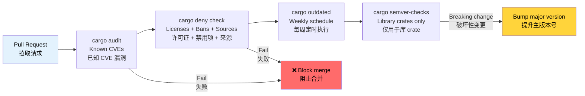

# Dependency Management and Supply Chain Security 🟢<br><span class="zh-inline">依赖管理与供应链安全 🟢</span>

> **What you'll learn:**<br><span class="zh-inline">**本章将学到什么：**</span>
> - Scanning for known vulnerabilities with `cargo-audit`<br><span class="zh-inline">如何用 `cargo-audit` 扫描已知漏洞</span>
> - Enforcing license, advisory, and source policies with `cargo-deny`<br><span class="zh-inline">如何用 `cargo-deny` 约束许可证、公告与来源策略</span>
> - Supply chain trust verification with Mozilla's `cargo-vet`<br><span class="zh-inline">如何借助 Mozilla 的 `cargo-vet` 校验供应链信任</span>
> - Tracking outdated dependencies and detecting breaking API changes<br><span class="zh-inline">如何跟踪过期依赖并识别破坏性 API 变化</span>
> - Visualizing and deduplicating your dependency tree<br><span class="zh-inline">如何可视化并去重依赖树</span>
>
> **Cross-references:** [Release Profiles](ch07-release-profiles-and-binary-size.md) — `cargo-udeps` trims unused dependencies found here · [CI/CD Pipeline](ch11-putting-it-all-together-a-production-cic.md) — audit and deny jobs in the pipeline · [Build Scripts](ch01-build-scripts-buildrs-in-depth.md) — `build-dependencies` are part of your supply chain too<br><span class="zh-inline">**交叉阅读：** [发布配置](ch07-release-profiles-and-binary-size.md) 一章里的 `cargo-udeps` 可以继续修掉这里发现的无用依赖；[CI/CD 流水线](ch11-putting-it-all-together-a-production-cic.md) 会把 audit 和 deny 任务接进流水线；[构建脚本](ch01-build-scripts-buildrs-in-depth.md) 一章也提醒了一点：`build-dependencies` 同样属于供应链的一部分。</span>

A Rust binary doesn't just contain your code — it contains every transitive dependency in your `Cargo.lock`. A vulnerability, license violation, or malicious crate anywhere in that tree becomes *your* problem. This chapter covers the tools that make dependency management auditable and automated.<br><span class="zh-inline">一个 Rust 二进制里装着的可不只是自家代码，还包括 `Cargo.lock` 里全部传递依赖。只要这棵树上任何一个位置出现漏洞、许可证冲突或者恶意 crate，最后都得由项目来承担后果。本章讨论的就是那些能把依赖管理做成“可审计、可自动化”这件事的工具。</span>

### cargo-audit — Known Vulnerability Scanning<br><span class="zh-inline">cargo-audit：已知漏洞扫描</span>

[`cargo-audit`](https://github.com/rustsec/rustsec/tree/main/cargo-audit) checks your `Cargo.lock` against the [RustSec Advisory Database](https://rustsec.org/), which tracks known vulnerabilities in published crates.<br><span class="zh-inline">[`cargo-audit`](https://github.com/rustsec/rustsec/tree/main/cargo-audit) 会把 `Cargo.lock` 和 [RustSec Advisory Database](https://rustsec.org/) 对照检查，这个数据库专门记录已经发布 crate 的已知安全公告与漏洞信息。</span>

```bash
# Install
cargo install cargo-audit

# Scan for known vulnerabilities
cargo audit

# Output:
# Crate:     chrono
# Version:   0.4.19
# Title:     Potential segfault in localtime_r invocations
# Date:      2020-11-10
# ID:        RUSTSEC-2020-0159
# URL:       https://rustsec.org/advisories/RUSTSEC-2020-0159
# Solution:  Upgrade to >= 0.4.20

# Check and fail CI if vulnerabilities exist
cargo audit --deny warnings

# Generate JSON output for automated processing
cargo audit --json

# Fix vulnerabilities by updating Cargo.lock
cargo audit fix
```

**CI integration:**<br><span class="zh-inline">**CI 集成方式：**</span>

```yaml
# .github/workflows/audit.yml
name: Security Audit
on:
  schedule:
    - cron: '0 0 * * *'  # Daily check — advisories appear continuously
  push:
    paths: ['Cargo.lock']

jobs:
  audit:
    runs-on: ubuntu-latest
    steps:
      - uses: actions/checkout@v4
      - uses: rustsec/audit-check@v2
        with:
          token: ${{ secrets.GITHUB_TOKEN }}
```

### cargo-deny — Comprehensive Policy Enforcement<br><span class="zh-inline">cargo-deny：全方位策略约束</span>

[`cargo-deny`](https://github.com/EmbarkStudios/cargo-deny) goes far beyond vulnerability scanning. It enforces policies across four dimensions:<br><span class="zh-inline">[`cargo-deny`](https://github.com/EmbarkStudios/cargo-deny) 干的事情远不止漏洞扫描。它能从四个维度对依赖策略进行约束：</span>

1. **Advisories** — known vulnerabilities (like cargo-audit)<br><span class="zh-inline">1. **Advisories**：已知漏洞，和 `cargo-audit` 类似。</span>
2. **Licenses** — allowed/denied license list<br><span class="zh-inline">2. **Licenses**：允许与禁止的许可证列表。</span>
3. **Bans** — forbidden crates or duplicate versions<br><span class="zh-inline">3. **Bans**：禁用特定 crate，或者检查重复版本。</span>
4. **Sources** — allowed registries and git sources<br><span class="zh-inline">4. **Sources**：允许使用哪些 registry 和 git 来源。</span>

```bash
# Install
cargo install cargo-deny

# Initialize configuration
cargo deny init
# Creates deny.toml with documented defaults

# Run all checks
cargo deny check

# Run specific checks
cargo deny check advisories
cargo deny check licenses
cargo deny check bans
cargo deny check sources
```

**Example `deny.toml`:**<br><span class="zh-inline">**示例 `deny.toml`：**</span>

```toml
# deny.toml

[advisories]
vulnerability = "deny"        # Fail on known vulnerabilities
unmaintained = "warn"         # Warn on unmaintained crates
yanked = "deny"               # Fail on yanked crates
notice = "warn"               # Warn on informational advisories

[licenses]
unlicensed = "deny"           # All crates must have a license
allow = [
    "MIT",
    "Apache-2.0",
    "BSD-2-Clause",
    "BSD-3-Clause",
    "ISC",
    "Unicode-DFS-2016",
]
copyleft = "deny"             # No GPL/LGPL/AGPL in this project
default = "deny"              # Deny anything not explicitly allowed

[bans]
multiple-versions = "warn"    # Warn if same crate appears at 2 versions
wildcards = "deny"            # No path = "*" in dependencies
highlight = "all"             # Show all duplicates, not just first

# Ban specific problematic crates
deny = [
    # openssl-sys pulls in C OpenSSL — prefer rustls
    { name = "openssl-sys", wrappers = ["native-tls"] },
]

# Allow specific duplicate versions (when unavoidable)
[[bans.skip]]
name = "syn"
version = "1.0"               # syn 1.x and 2.x often coexist

[sources]
unknown-registry = "deny"     # Only allow crates.io
unknown-git = "deny"          # No random git dependencies
allow-registry = ["https://github.com/rust-lang/crates.io-index"]
```

**License enforcement** is particularly valuable for commercial projects:<br><span class="zh-inline">**许可证约束** 对商业项目尤其有价值，因为法务问题从来不是小事：</span>

```bash
# Check which licenses are in your dependency tree
cargo deny list

# Output:
# MIT          — 127 crates
# Apache-2.0   — 89 crates
# BSD-3-Clause — 12 crates
# MPL-2.0      — 3 crates   ← might need legal review
# Unicode-DFS  — 1 crate
```

### cargo-vet — Supply Chain Trust Verification<br><span class="zh-inline">cargo-vet：供应链信任校验</span>

[`cargo-vet`](https://github.com/mozilla/cargo-vet) (from Mozilla) addresses a different question: not "does this crate have known bugs?" but "has a trusted human actually reviewed this code?"<br><span class="zh-inline">[`cargo-vet`](https://github.com/mozilla/cargo-vet) 这玩意儿回答的是另一类问题。它问的不是“这个 crate 有没有已知漏洞”，而是“有没有值得信任的人类真的审过这份代码”。</span>

```bash
# Install
cargo install cargo-vet

# Initialize (creates supply-chain/ directory)
cargo vet init

# Check which crates need review
cargo vet

# After reviewing a crate, certify it:
cargo vet certify serde 1.0.203
# Records that you've audited serde 1.0.203 for your criteria

# Import audits from trusted organizations
cargo vet import mozilla
cargo vet import google
cargo vet import bytecode-alliance
```

**How it works:**<br><span class="zh-inline">**它的工作方式：**</span>

```text
supply-chain/
├── audits.toml       ← Your team's audit certifications
├── config.toml       ← Trust configuration and criteria
└── imports.lock      ← Pinned imports from other organizations
```

`cargo-vet` is most valuable for organizations with strict supply-chain requirements (government, finance, infrastructure). For most teams, `cargo-deny` provides sufficient protection.<br><span class="zh-inline">`cargo-vet` 最适合供应链要求很严的组织，例如政府、金融、基础设施一类场景。对大多数团队来说，`cargo-deny` 已经足够扛住日常治理需求。</span>

### cargo-outdated and cargo-semver-checks<br><span class="zh-inline">cargo-outdated 与 cargo-semver-checks</span>

**`cargo-outdated`** — find dependencies that have newer versions:<br><span class="zh-inline">**`cargo-outdated`** 用来找出已经有新版本可用的依赖：</span>

```bash
cargo install cargo-outdated

cargo outdated --workspace
# Output:
# Name        Project  Compat  Latest   Kind
# serde       1.0.193  1.0.203 1.0.203  Normal
# regex       1.9.6    1.10.4  1.10.4   Normal
# thiserror   1.0.50   1.0.61  2.0.3    Normal  ← major version available
```

**`cargo-semver-checks`** — detect breaking API changes before publishing. Essential for library crates:<br><span class="zh-inline">**`cargo-semver-checks`** 用来在发布前识别破坏性 API 变更。对于库项目，这东西基本属于必备品：</span>

```bash
cargo install cargo-semver-checks

# Check if your changes are semver-compatible
cargo semver-checks

# Output:
# ✗ Function `parse_gpu_csv` is now private (was public)
#   → This is a BREAKING change. Bump MAJOR version.
#
# ✗ Struct `GpuInfo` has a new required field `power_limit_w`
#   → This is a BREAKING change. Bump MAJOR version.
#
# ✓ Function `parse_gpu_csv_v2` was added (non-breaking)
```

### cargo-tree — Dependency Visualization and Deduplication<br><span class="zh-inline">cargo-tree：依赖可视化与去重</span>

`cargo tree` is built into Cargo (no installation needed) and is invaluable for understanding your dependency graph:<br><span class="zh-inline">`cargo tree` 是 Cargo 自带的工具，不需要额外安装。要看清依赖图长什么样，它特别有用：</span>

```bash
# Full dependency tree
cargo tree

# Find why a specific crate is included
cargo tree --invert --package openssl-sys
# Shows all paths from your crate to openssl-sys

# Find duplicate versions
cargo tree --duplicates
# Output:
# syn v1.0.109
# └── serde_derive v1.0.193
#
# syn v2.0.48
# ├── thiserror-impl v1.0.56
# └── tokio-macros v2.2.0

# Show only direct dependencies
cargo tree --depth 1

# Show dependency features
cargo tree --format "{p} {f}"

# Count total dependencies
cargo tree | wc -l
```

**Deduplication strategy**: When `cargo tree --duplicates` shows the same crate at two major versions, check if you can update the dependency chain to unify them. Each duplicate adds compile time and binary size.<br><span class="zh-inline">**去重思路** 也很朴素：一旦 `cargo tree --duplicates` 发现同一个 crate 以两个大版本同时出现，就去看依赖链能不能升级合并。每多一个重复版本，编译时间和二进制体积都会跟着涨。</span>

### Application: Multi-Crate Dependency Hygiene<br><span class="zh-inline">应用场景：多 crate 工程的依赖卫生</span>

The the workspace uses `[workspace.dependencies]` for centralized version management — an excellent practice. Combined with [`cargo tree --duplicates`](ch07-release-profiles-and-binary-size.md) for size analysis, this prevents version drift and reduces binary bloat:<br><span class="zh-inline">这个 workspace 用 `[workspace.dependencies]` 做集中式版本管理，这习惯非常好。再配合 [`cargo tree --duplicates`](ch07-release-profiles-and-binary-size.md) 这种体积分析手段，既能防止版本漂移，也能压住二进制膨胀。</span>

```toml
# Root Cargo.toml — all versions pinned in one place
[workspace.dependencies]
serde = { version = "1.0", features = ["derive"] }
serde_json = { version = "1.0", features = ["preserve_order"] }
regex = "1.10"
thiserror = "1.0"
anyhow = "1.0"
rayon = "1.8"
```

**Recommended additions for the project:**<br><span class="zh-inline">**建议给项目补上的内容：**</span>

```bash
# Add to CI pipeline:
cargo deny init              # One-time setup
cargo deny check             # Every PR — licenses, advisories, bans
cargo audit --deny warnings  # Every push — vulnerability scanning
cargo outdated --workspace   # Weekly — track available updates
```

**Recommended `deny.toml` for the project:**<br><span class="zh-inline">**建议给项目准备的 `deny.toml`：**</span>

```toml
[advisories]
vulnerability = "deny"
yanked = "deny"

[licenses]
allow = ["MIT", "Apache-2.0", "BSD-2-Clause", "BSD-3-Clause", "ISC", "Unicode-DFS-2016"]
copyleft = "deny"     # Hardware diagnostics tool — no copyleft

[bans]
multiple-versions = "warn"   # Track duplicates, don't block yet
wildcards = "deny"

[sources]
unknown-registry = "deny"
unknown-git = "deny"
```

### Supply Chain Audit Pipeline<br><span class="zh-inline">供应链审计流水线</span>



### 🏋️ Exercises<br><span class="zh-inline">🏋️ 练习</span>

#### 🟢 Exercise 1: Audit Your Dependencies<br><span class="zh-inline">🟢 练习 1：审计现有依赖</span>

Run `cargo audit` and `cargo deny init && cargo deny check` on any Rust project. How many advisories are found? How many license categories are in your tree?<br><span class="zh-inline">对任意一个 Rust 项目运行 `cargo audit` 以及 `cargo deny init && cargo deny check`。看看一共发现了多少公告，又有多少种许可证类型出现在依赖树里。</span>

<details>
<summary>Solution <span class="zh-inline">参考答案</span></summary>

```bash
cargo audit
# Note any advisories — often chrono, time, or older crates

cargo deny init
cargo deny list
# Shows license breakdown: MIT (N), Apache-2.0 (N), etc.

cargo deny check
# Shows full audit across all four dimensions
```
</details>

#### 🟡 Exercise 2: Find and Eliminate Duplicate Dependencies<br><span class="zh-inline">🟡 练习 2：找出并消除重复依赖</span>

Run `cargo tree --duplicates` on a workspace. Find a crate that appears at two versions. Can you update `Cargo.toml` to unify them? Measure the compile-time and binary-size impact.<br><span class="zh-inline">在一个 workspace 上执行 `cargo tree --duplicates`，找出那个同时出现了两个版本的 crate。看看能不能通过调整 `Cargo.toml` 把它们统一起来，再测一测对编译时间和二进制体积的影响。</span>

<details>
<summary>Solution <span class="zh-inline">参考答案</span></summary>

```bash
cargo tree --duplicates
# Typical: syn 1.x and syn 2.x

# Find who pulls in the old version:
cargo tree --invert --package syn@1.0.109
# Output: serde_derive 1.0.xxx -> syn 1.0.109

# Check if a newer serde_derive uses syn 2.x:
cargo update -p serde_derive
cargo tree --duplicates
# If syn 1.x is gone, you've eliminated a duplicate

# Measure impact:
time cargo build --release  # Before and after
cargo bloat --release --crates | head -20
```
</details>

### Key Takeaways<br><span class="zh-inline">本章要点</span>

- `cargo audit` catches known CVEs — run it on every push and on a daily schedule<br><span class="zh-inline">`cargo audit` 负责拦截已知 CVE，既适合每次推送触发，也适合每日定时巡检。</span>
- `cargo deny` enforces four policy dimensions: advisories, licenses, bans, and sources<br><span class="zh-inline">`cargo deny` 会同时检查公告、许可证、禁用项和依赖来源这四个维度。</span>
- Use `[workspace.dependencies]` to centralize version management across a multi-crate workspace<br><span class="zh-inline">多 crate 工程里用 `[workspace.dependencies]` 做集中版本管理，能省下很多后患。</span>
- `cargo tree --duplicates` reveals bloat; each duplicate adds compile time and binary size<br><span class="zh-inline">`cargo tree --duplicates` 能把依赖膨胀点揪出来，每一个重复版本都会拖慢编译并增大产物。</span>
- `cargo-vet` is for high-security environments; `cargo-deny` is sufficient for most teams<br><span class="zh-inline">`cargo-vet` 更适合高安全要求环境；普通团队多数情况下用 `cargo-deny` 就已经够用了。</span>

---
