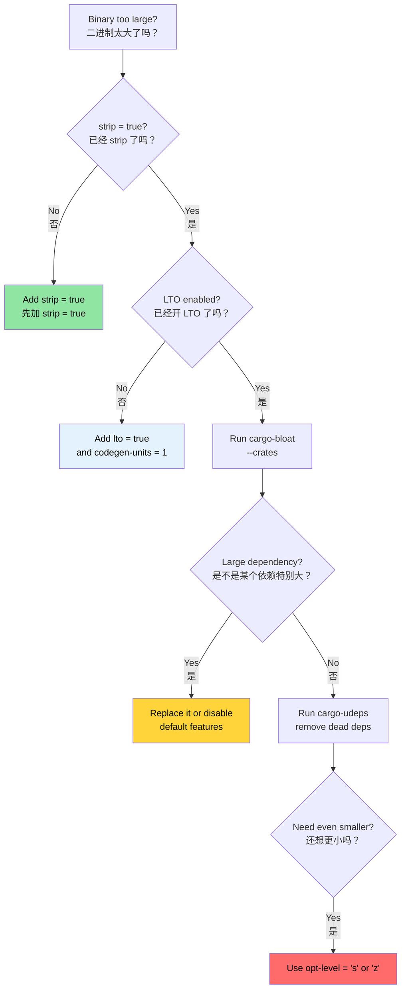

# Release Profiles and Binary Size 🟡<br><span class="zh-inline">发布配置与二进制体积 🟡</span>

> **What you'll learn:**<br><span class="zh-inline">**本章将学到什么：**</span>
> - Release profile anatomy: LTO, `codegen-units`, panic strategy, `strip`, `opt-level`<br><span class="zh-inline">发布配置的关键旋钮：LTO、`codegen-units`、panic 策略、`strip`、`opt-level`</span>
> - Thin vs Fat vs Cross-Language LTO trade-offs<br><span class="zh-inline">Thin、Fat 与跨语言 LTO 的取舍</span>
> - Binary size analysis with `cargo-bloat`<br><span class="zh-inline">如何用 `cargo-bloat` 分析二进制体积</span>
> - Dependency trimming with `cargo-udeps` and `cargo-machete`<br><span class="zh-inline">如何用 `cargo-udeps` 和 `cargo-machete` 修剪依赖</span>
>
> **Cross-references:** [Compile-Time Tools](ch08-compile-time-and-developer-tools.md), [Benchmarking](ch03-benchmarking-measuring-what-matters.md), and [Dependencies](ch06-dependency-management-and-supply-chain-s.md).<br><span class="zh-inline">**交叉阅读：** [编译期工具](ch08-compile-time-and-developer-tools.md)、[基准测试](ch03-benchmarking-measuring-what-matters.md) 以及 [依赖管理](ch06-dependency-management-and-supply-chain-s.md)。</span>

The default `cargo build --release` is already decent. But in production deployment, especially for single-binary tools shipped to thousands of machines, there is a large distance between “decent” and “fully optimized”. This chapter focuses on the knobs and measurement tools that close that gap.<br><span class="zh-inline">默认的 `cargo build --release` 已经不算差了。但真到了生产部署，尤其是那种要把单个二进制工具铺到成千上万台机器上的场景，“够用”和“真正优化过”之间差得还很远。这一章就是把这些关键旋钮和度量工具掰开说明白。</span>

### Release Profile Anatomy<br><span class="zh-inline">发布配置的基本结构</span>

Cargo profile 决定了 `rustc` 如何编译代码。默认值偏保守，更看重广泛兼容，而不是极限性能和极限体积：<br><span class="zh-inline">Cargo profile 控制的是 `rustc` 的编译行为。默认配置比较保守，重心在广泛兼容，不是在性能和体积上狠狠干到头。</span>

```toml
# Cargo.toml — Cargo's built-in defaults

[profile.release]
opt-level = 3        # Optimization level
lto = false          # Link-time optimization OFF
codegen-units = 16   # Parallel codegen units
panic = "unwind"     # Stack unwinding on panic
strip = "none"       # Keep symbols and debug info
overflow-checks = false
debug = false
```

**Production-optimized profile**:<br><span class="zh-inline">**更偏生产部署的配置**：</span>

```toml
[profile.release]
lto = true
codegen-units = 1
panic = "abort"
strip = true
```

**The impact of each setting:**<br><span class="zh-inline">**每个选项大致会带来什么影响：**</span>

| Setting | Default -> Optimized | Binary Size<br><span class="zh-inline">体积</span> | Runtime Speed<br><span class="zh-inline">运行速度</span> | Compile Time<br><span class="zh-inline">编译时间</span> |
|---------|---------------------|-------------|---------------|--------------|
| `lto = false -> true` | — | -10% 到 -20%<br><span class="zh-inline">缩小 10% 到 20%</span> | +5% 到 +20%<br><span class="zh-inline">提升 5% 到 20%</span> | 变慢 2 到 5 倍 |
| `codegen-units = 16 -> 1` | — | -5% 到 -10% | +5% 到 +10% | 变慢 1.5 到 2 倍 |
| `panic = "unwind" -> "abort"` | — | -5% 到 -10% | 几乎没有变化 | 几乎没有变化 |
| `strip = "none" -> true` | — | -50% 到 -70% | 没影响 | 没影响 |
| `opt-level = 3 -> "s"` | — | -10% 到 -30% | -5% 到 -10% | 接近不变 |
| `opt-level = 3 -> "z"` | — | -15% 到 -40% | -10% 到 -20% | 接近不变 |

**Additional profile tweaks:**<br><span class="zh-inline">**还可以继续加的配置项：**</span>

```toml
[profile.release]
overflow-checks = true      # Keep overflow checks in release
debug = "line-tables-only"  # Minimal debug info for backtraces
rpath = false
incremental = false

# For size-optimized builds:
# opt-level = "z"
# strip = "symbols"
```

**Per-crate profile overrides** let hot crates and cold crates take different strategies:<br><span class="zh-inline">**按 crate 单独覆盖 profile** 可以让热点 crate 和非热点 crate 用不同策略：</span>

```toml
[profile.dev.package."*"]
opt-level = 2

[profile.release.package.serde_json]
opt-level = 3
codegen-units = 1

[profile.test]
opt-level = 1
```

### LTO in Depth — Thin vs Fat vs Cross-Language<br><span class="zh-inline">LTO 深入看：Thin、Fat 与跨语言 LTO</span>

Link-Time Optimization allows LLVM to optimize across crate boundaries. Without LTO, every crate is basically its own optimization island.<br><span class="zh-inline">Link-Time Optimization 能让 LLVM 跨 crate 做优化。不开 LTO 的话，每个 crate 基本就像一个彼此隔离的优化孤岛。</span>

```toml
[profile.release]
# Option 1: Fat LTO
lto = true

# Option 2: Thin LTO
# lto = "thin"

# Option 3: No LTO
# lto = false

# Option 4: Explicit off
# lto = "off"
```

**Fat LTO vs Thin LTO:**<br><span class="zh-inline">**Fat LTO 和 Thin LTO 的差别：**</span>

| Aspect<br><span class="zh-inline">方面</span> | Fat LTO (`true`) | Thin LTO (`"thin"`) |
|--------|-------------------|----------------------|
| Optimization quality<br><span class="zh-inline">优化质量</span> | Best<br><span class="zh-inline">最好</span> | About 95% of fat<br><span class="zh-inline">接近 Fat 的 95%</span> |
| Compile time<br><span class="zh-inline">编译时间</span> | Slow<br><span class="zh-inline">更慢</span> | Moderate<br><span class="zh-inline">中等</span> |
| Memory usage<br><span class="zh-inline">内存占用</span> | High<br><span class="zh-inline">更高</span> | Lower<br><span class="zh-inline">更低</span> |
| Parallelism<br><span class="zh-inline">并行性</span> | None or very low<br><span class="zh-inline">很低</span> | Good<br><span class="zh-inline">较好</span> |
| Recommended for<br><span class="zh-inline">适用场景</span> | Final release builds<br><span class="zh-inline">最终发布构建</span> | CI and everyday builds<br><span class="zh-inline">CI 与日常构建</span> |

**Cross-language LTO** means optimizing Rust and C code together across the FFI boundary:<br><span class="zh-inline">**跨语言 LTO** 指的是把 Rust 和 C 代码一起优化，连 FFI 边界也不放过：</span>

```toml
[profile.release]
lto = true

[build-dependencies]
cc = "1.0"
```

```rust
// build.rs
fn main() {
    cc::Build::new()
        .file("csrc/fast_parser.c")
        .flag("-flto=thin")
        .opt_level(2)
        .compile("fast_parser");
}
```

```bash
RUSTFLAGS="-Clinker-plugin-lto -Clinker=clang -Clink-arg=-fuse-ld=lld" \
    cargo build --release
```

This matters most when small C helpers are called frequently from Rust, because inlining across the boundary can finally become possible.<br><span class="zh-inline">这种做法在 FFI 很重的场景下最值钱，尤其是那种 Rust 频繁调用小型 C 辅助函数的地方，因为跨边界内联终于有机会发生了。</span>

### Binary Size Analysis with `cargo-bloat`<br><span class="zh-inline">用 `cargo-bloat` 分析二进制体积</span>

[`cargo-bloat`](https://github.com/RazrFalcon/cargo-bloat) answers a brutally practical question: “Which functions and which crates are把二进制撑胖了？”<br><span class="zh-inline">[`cargo-bloat`](https://github.com/RazrFalcon/cargo-bloat) 解决的是一个非常现实的问题：到底是哪些函数、哪些 crate 把二进制撑胖了？</span>

```bash
# Install
cargo install cargo-bloat

# Show largest functions
cargo bloat --release -n 20

# Show by crate
cargo bloat --release --crates

# Compare before and after
cargo bloat --release --crates > before.txt
# ... make changes ...
cargo bloat --release --crates > after.txt
diff before.txt after.txt
```

**Common bloat sources and fixes:**<br><span class="zh-inline">**常见膨胀来源与处理方式：**</span>

| Bloat Source<br><span class="zh-inline">膨胀来源</span> | Typical Size<br><span class="zh-inline">典型体积</span> | Fix<br><span class="zh-inline">处理方式</span> |
|-------------|-------------|-----|
| `regex` | 200 到 400 KB | Use `regex-lite` if Unicode support is unnecessary<br><span class="zh-inline">如果不需要完整 Unicode 支持，可以换 `regex-lite`</span> |
| `serde_json` | 200 到 350 KB | Consider lighter or faster alternatives<br><span class="zh-inline">按场景考虑更轻或更快的替代库</span> |
| Generics monomorphization | Varies | Use `dyn Trait` at API boundaries<br><span class="zh-inline">在 API 边界适度引入 `dyn Trait`</span> |
| Formatting machinery | 50 到 150 KB | Avoid over-deriving or overly rich formatting paths<br><span class="zh-inline">别无脑派生太多调试格式能力</span> |
| Panic message strings | 20 到 80 KB | Use `panic = "abort"` and `strip`<br><span class="zh-inline">用 `panic = "abort"` 和 `strip` 收缩</span> |
| Unused features | Varies | Disable default features<br><span class="zh-inline">关闭不需要的默认 feature</span> |

### Trimming Dependencies with `cargo-udeps`<br><span class="zh-inline">用 `cargo-udeps` 修剪依赖</span>

[`cargo-udeps`](https://github.com/est31/cargo-udeps) finds dependencies declared in `Cargo.toml` that the code no longer uses.<br><span class="zh-inline">[`cargo-udeps`](https://github.com/est31/cargo-udeps) 可以找出那些已经写进 `Cargo.toml`，但代码实际上早就不再使用的依赖。</span>

```bash
# Install (requires nightly)
cargo install cargo-udeps

# Find unused dependencies
cargo +nightly udeps --workspace
```

Every unused dependency brings four kinds of tax:<br><span class="zh-inline">每一个没用的依赖都会额外带来四层负担：</span>

1. More compile time<br><span class="zh-inline">1. 编译更慢。</span>
2. Larger binaries<br><span class="zh-inline">2. 二进制更大。</span>
3. More supply-chain risk<br><span class="zh-inline">3. 供应链风险更高。</span>
4. More licensing complexity<br><span class="zh-inline">4. 许可证问题更复杂。</span>

**Alternative: `cargo-machete`** offers a faster heuristic approach, though it may report false positives.<br><span class="zh-inline">**替代方案：`cargo-machete`** 走的是更快的启发式路线，不过误报概率也更高一些。</span>

```bash
cargo install cargo-machete
cargo machete
```

**Alternative: `cargo-shear`** — sweet spot between `cargo-udeps` and `cargo-machete`:<br><span class="zh-inline">**另一种选择：`cargo-shear`**，速度和准确率通常处在 `cargo-udeps` 与 `cargo-machete` 中间，挺适合日常巡检。</span>

```bash
cargo install cargo-shear
cargo shear --fix
# Slower than cargo-machete but much faster than cargo-udeps
# Much less false positives than cargo-machete
```

### Size Optimization Decision Tree<br><span class="zh-inline">体积优化决策树</span>



### 🏋️ Exercises<br><span class="zh-inline">🏋️ 练习</span>

#### 🟢 Exercise 1: Measure LTO Impact<br><span class="zh-inline">🟢 练习 1：测量 LTO 的影响</span>

Build once with the default release settings, then build again with `lto = true`、`codegen-units = 1`、`strip = true`. Compare binary size and compile time.<br><span class="zh-inline">先用默认 release 配置构建一次，再用 `lto = true`、`codegen-units = 1`、`strip = true` 重构建一次，对比二进制大小和编译时间。</span>

<details>
<summary>Solution <span class="zh-inline">参考答案</span></summary>

```bash
# Default release
cargo build --release
ls -lh target/release/my-binary
time cargo build --release

# Optimized release — add to Cargo.toml:
# [profile.release]
# lto = true
# codegen-units = 1
# strip = true
# panic = "abort"

cargo clean
cargo build --release
ls -lh target/release/my-binary
time cargo build --release
```

</details>

#### 🟡 Exercise 2: Find Your Biggest Crate<br><span class="zh-inline">🟡 练习 2：找出最胖的 crate</span>

Run `cargo bloat --release --crates` on a project. Identify the largest dependency and see whether it can be slimmed down via feature trimming or a lighter replacement.<br><span class="zh-inline">对一个项目执行 `cargo bloat --release --crates`，找出体积最大的依赖，再看看能不能通过裁剪 feature 或替换更轻的库把它压下去。</span>

<details>
<summary>Solution <span class="zh-inline">参考答案</span></summary>

```bash
cargo install cargo-bloat
cargo bloat --release --crates

# Example:
# regex-lite = "0.1"
# serde = { version = "1", default-features = false, features = ["derive"] }

cargo bloat --release --crates
```

</details>

### Key Takeaways<br><span class="zh-inline">本章要点</span>

- `lto = true`、`codegen-units = 1`、`strip = true`、`panic = "abort"` 是一套很常见的生产发布配置。<br><span class="zh-inline">这是一套非常常见的生产级发布组合。</span>
- Thin LTO 通常能拿到大部分优化收益，但编译成本比 Fat LTO 小得多。<br><span class="zh-inline">对大多数项目来说，它往往是更平衡的选择。</span>
- `cargo-bloat --crates` 能把“到底谁在吃空间”这件事讲明白。<br><span class="zh-inline">别靠猜，直接测。</span>
- `cargo-udeps`、`cargo-machete` 和 `cargo-shear` 都可以清理掉那些白白拖慢构建、增大体积的死依赖。<br><span class="zh-inline">依赖瘦身往往同时改善编译时间、二进制大小和供应链质量。</span>
- 按 crate 单独覆写 profile，可以让热点路径得到强化，又不至于把整个工程的编译速度都拖死。<br><span class="zh-inline">细粒度 profile 是个很值钱的中间路线。</span>

---
