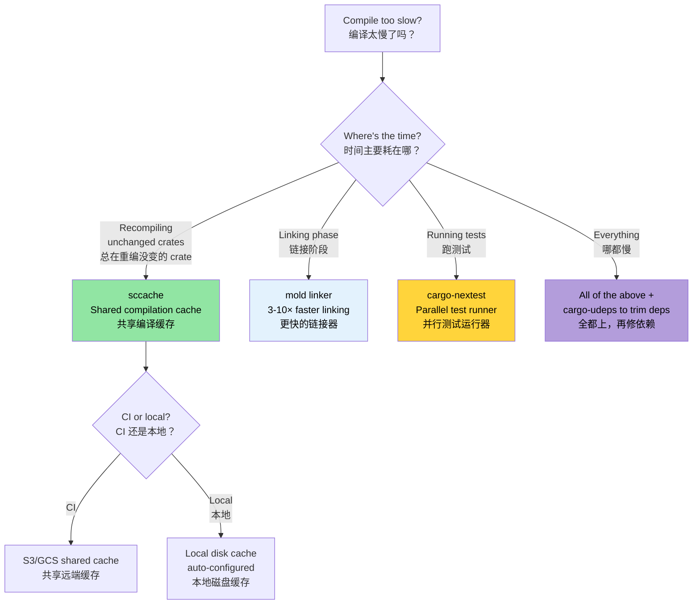

# Compile-Time and Developer Tools 🟡<br><span class="zh-inline">编译期与开发者工具 🟡</span>

> **What you'll learn:**<br><span class="zh-inline">**本章将学到什么：**</span>
> - Compilation caching with `sccache` for local and CI builds<br><span class="zh-inline">如何用 `sccache` 给本地和 CI 构建做编译缓存</span>
> - Faster linking with `mold` (3-10× faster than the default linker)<br><span class="zh-inline">如何用 `mold` 加速链接，速度通常比默认链接器快 3 到 10 倍</span>
> - `cargo-nextest`: a faster, more informative test runner<br><span class="zh-inline">`cargo-nextest`：更快、信息量也更足的测试运行器</span>
> - Developer visibility tools: `cargo-expand`, `cargo-geiger`, `cargo-watch`<br><span class="zh-inline">提升可见性的开发者工具：`cargo-expand`、`cargo-geiger`、`cargo-watch`</span>
> - Workspace lints, MSRV policy, and documentation-as-CI<br><span class="zh-inline">workspace 级 lint、MSRV 策略，以及把文档检查纳入 CI</span>
>
> **Cross-references:** [Release Profiles](ch07-release-profiles-and-binary-size.md) — LTO and binary size optimization · [CI/CD Pipeline](ch11-putting-it-all-together-a-production-cic.md) — these tools integrate into your pipeline · [Dependencies](ch06-dependency-management-and-supply-chain-s.md) — fewer deps = faster compiles<br><span class="zh-inline">**交叉阅读：** [发布配置](ch07-release-profiles-and-binary-size.md) 继续讲 LTO 和二进制体积优化；[CI/CD 流水线](ch11-putting-it-all-together-a-production-cic.md) 会把这些工具接进流水线；[依赖管理](ch06-dependency-management-and-supply-chain-s.md) 说明了一个朴素事实：依赖越少，编译越快。</span>

### Compile-Time Optimization: sccache, mold, cargo-nextest<br><span class="zh-inline">编译期优化：`sccache`、`mold`、`cargo-nextest`</span>

Long compile times are the #1 developer pain point in Rust. These tools collectively can cut iteration time by 50-80%:<br><span class="zh-inline">Rust 开发里最烦人的事情之一就是编译慢。这几样工具配合起来，往往能把迭代时间砍掉 50% 到 80%。</span>

**`sccache` — Shared compilation cache:**<br><span class="zh-inline">**`sccache`：共享编译缓存。**</span>

```bash
# Install
cargo install sccache

# Configure as the Rust wrapper
export RUSTC_WRAPPER=sccache

# Or set permanently in .cargo/config.toml:
# [build]
# rustc-wrapper = "sccache"

# First build: normal speed (populates cache)
cargo build --release  # 3 minutes

# Clean + rebuild: cache hits for unchanged crates
cargo clean && cargo build --release  # 45 seconds

# Check cache statistics
sccache --show-stats
# Compile requests        1,234
# Cache hits               987 (80%)
# Cache misses             247
```

`sccache` supports shared caches (S3, GCS, Azure Blob) for team-wide and CI cache sharing.<br><span class="zh-inline">`sccache` 还能接 S3、GCS、Azure Blob 这类共享后端，所以不只是本机受益，团队和 CI 也能一起吃缓存红利。</span>

**`mold` — A faster linker:**<br><span class="zh-inline">**`mold`：更快的链接器。**</span>

Linking is often the slowest phase. `mold` is 3-5× faster than `lld` and 10-20× faster than the default GNU `ld`:<br><span class="zh-inline">链接阶段经常是最慢的那一下。`mold` 往往比 `lld` 快 3 到 5 倍，比 GNU 默认的 `ld` 快 10 到 20 倍。</span>

```bash
# Install
sudo apt install mold  # Ubuntu 22.04+
# Note: mold is for ELF targets (Linux). macOS uses Mach-O, not ELF.
# The macOS linker (ld64) is already quite fast; if you need faster:
# brew install sold     # sold = mold for Mach-O (experimental, less mature)
# In practice, macOS link times are rarely a bottleneck.

# Use mold for linking
# .cargo/config.toml
[target.x86_64-unknown-linux-gnu]
rustflags = ["-C", "link-arg=-fuse-ld=mold"]

# Verify mold is being used
cargo build -v 2>&1 | grep mold
```

**`cargo-nextest` — A faster test runner:**<br><span class="zh-inline">**`cargo-nextest`：更快的测试运行器。**</span>

```bash
# Install
cargo install cargo-nextest

# Run tests (parallel by default, per-test timeout, retry)
cargo nextest run

# Key advantages over cargo test:
# - Each test runs in its own process → better isolation
# - Parallel execution with smart scheduling
# - Per-test timeouts (no more hanging CI)
# - JUnit XML output for CI
# - Retry failed tests

# Configuration
cargo nextest run --retries 2 --fail-fast

# Archive test binaries (useful for CI: build once, test on multiple machines)
cargo nextest archive --archive-file tests.tar.zst
cargo nextest run --archive-file tests.tar.zst
```

```toml
# .config/nextest.toml
[profile.default]
retries = 0
slow-timeout = { period = "60s", terminate-after = 3 }
fail-fast = true

[profile.ci]
retries = 2
fail-fast = false
junit = { path = "test-results.xml" }
```

**Combined dev configuration:**<br><span class="zh-inline">**组合起来的一套开发配置：**</span>

```toml
# .cargo/config.toml — optimize the development inner loop
[build]
rustc-wrapper = "sccache"       # Cache compilation artifacts

[target.x86_64-unknown-linux-gnu]
rustflags = ["-C", "link-arg=-fuse-ld=mold"]  # Faster linking

# Dev profile: optimize deps but not your code
# (put in Cargo.toml)
# [profile.dev.package."*"]
# opt-level = 2
```

### cargo-expand and cargo-geiger — Visibility Tools<br><span class="zh-inline">`cargo-expand` 与 `cargo-geiger`：把细节摊开看</span>

**`cargo-expand`** — see what macros generate:<br><span class="zh-inline">**`cargo-expand`** 用来看宏到底展开成了什么。</span>

```bash
cargo install cargo-expand

# Expand all macros in a specific module
cargo expand --lib accel_diag::vendor

# Expand a specific derive
# Given: #[derive(Debug, Serialize, Deserialize)]
# cargo expand shows the generated impl blocks
cargo expand --lib --tests
```

Invaluable for debugging `#[derive]` macro output, `macro_rules!` expansions, and understanding what `serde` generates for your types.<br><span class="zh-inline">调试 `#[derive]` 宏输出、`macro_rules!` 展开结果，或者想看 `serde` 给类型生成了什么代码时，这工具非常管用。</span>

**`cargo-geiger`** — count `unsafe` usage across your dependency tree:<br><span class="zh-inline">**`cargo-geiger`** 用来统计依赖树里到底有多少 `unsafe`。</span>

```bash
cargo install cargo-geiger

cargo geiger
# Output:
# Metric output format: x/y
#   x = unsafe code used by the build
#   y = total unsafe code found in the crate
#
# Functions  Expressions  Impls  Traits  Methods
# 0/0        0/0          0/0    0/0     0/0      ✅ my_crate
# 0/5        0/23         0/2    0/0     0/3      ✅ serde
# 3/3        14/14        0/0    0/0     2/2      ❗ libc
# 15/15      142/142      4/4    0/0     12/12    ☢️ ring

# The symbols:
# ✅ = no unsafe used
# ❗ = some unsafe used
# ☢️ = heavily unsafe
```

For the project's zero-unsafe policy, `cargo geiger` verifies that no dependency introduces unsafe code into the call graph that your code actually exercises.<br><span class="zh-inline">如果工程目标是零 `unsafe` 策略，`cargo geiger` 就能帮忙确认：依赖有没有把 `unsafe` 带进当前实际会走到的调用图。</span>

### Workspace Lints — `[workspace.lints]`<br><span class="zh-inline">Workspace 级 lint：`[workspace.lints]`</span>

Since Rust 1.74, you can configure Clippy and compiler lints centrally in `Cargo.toml` — no more `#![deny(...)]` at the top of every crate:<br><span class="zh-inline">从 Rust 1.74 开始，可以在根 `Cargo.toml` 里集中配置 Clippy 和编译器 lint，用不着在每个 crate 顶部都堆一串 `#![deny(...)]` 了。</span>

```toml
# Root Cargo.toml — lint configuration for all crates
[workspace.lints.clippy]
unwrap_used = "warn"         # Prefer ? or expect("reason")
dbg_macro = "deny"           # No dbg!() in committed code
todo = "warn"                # Track incomplete implementations
large_enum_variant = "warn"  # Catch accidental size bloat

[workspace.lints.rust]
unsafe_code = "deny"         # Enforce zero-unsafe policy
missing_docs = "warn"        # Encourage documentation
```

```toml
# Each crate's Cargo.toml — opt into workspace lints
[lints]
workspace = true
```

This replaces scattered `#![deny(clippy::unwrap_used)]` attributes and ensures consistent policy across the entire workspace.<br><span class="zh-inline">这样可以把分散在各 crate 里的 lint 策略收拢到一起，整套 workspace 的规则也更一致。</span>

**Auto-fixing Clippy warnings:**<br><span class="zh-inline">**自动修掉一部分 Clippy 警告：**</span>

```bash
# Let Clippy automatically fix machine-applicable suggestions
cargo clippy --fix --workspace --all-targets --allow-dirty

# Fix and also apply suggestions that may change behavior (review carefully!)
cargo clippy --fix --workspace --all-targets --allow-dirty -- -W clippy::pedantic
```

> **Tip**: Run `cargo clippy --fix` before committing. It handles trivial issues (unused imports, redundant clones, type simplifications) that are tedious to fix by hand.<br><span class="zh-inline">**建议**：提交前先跑一遍 `cargo clippy --fix`。一些又碎又烦的小问题，比如没用的 import、多余的 clone、类型写法啰嗦，它能顺手就给收拾掉。</span>

### MSRV Policy and rust-version<br><span class="zh-inline">MSRV 策略与 `rust-version`</span>

Minimum Supported Rust Version (MSRV) ensures your crate compiles on older toolchains. This matters when deploying to systems with frozen Rust versions.<br><span class="zh-inline">MSRV，也就是最低支持 Rust 版本，用来保证 crate 在较老工具链上也能编译。这在目标环境 Rust 版本被冻结时尤其关键。</span>

```toml
# Cargo.toml
[package]
name = "diag_tool"
version = "0.1.0"
rust-version = "1.75"    # Minimum Rust version required
```

```bash
# Verify MSRV compliance
cargo +1.75.0 check --workspace

# Automated MSRV discovery
cargo install cargo-msrv
cargo msrv find
# Output: Minimum Supported Rust Version is 1.75.0

# Verify in CI
cargo msrv verify
```

**MSRV in CI:**<br><span class="zh-inline">**CI 里的 MSRV 检查：**</span>

```yaml
jobs:
  msrv:
    name: Check MSRV
    runs-on: ubuntu-latest
    steps:
      - uses: actions/checkout@v4
      - uses: dtolnay/rust-toolchain@master
        with:
          toolchain: "1.75.0"    # Match rust-version in Cargo.toml
      - run: cargo check --workspace
```

**MSRV strategy:**<br><span class="zh-inline">**MSRV 应该怎么定：**</span>

- **Binary applications** (like a large project): Use latest stable. No MSRV needed.<br><span class="zh-inline">二进制应用，如果是内部大项目，通常直接跟最新稳定版就行，未必需要硬性 MSRV。</span>
- **Library crates** (published to crates.io): Set MSRV to oldest Rust version that supports all features you use. Commonly `N-2` (two versions behind current).<br><span class="zh-inline">库 crate，尤其要发到 crates.io 时，应该给出明确 MSRV，常见做法是跟当前稳定版保持两版左右的距离。</span>
- **Enterprise deployments**: Set MSRV to match the oldest Rust version installed on your fleet.<br><span class="zh-inline">企业部署场景，MSRV 最好和环境里最老的 Rust 版本保持一致。</span>

### Application: Production Binary Profile<br><span class="zh-inline">应用场景：生产级二进制配置</span>

The project already has an excellent [release profile](ch07-release-profiles-and-binary-size.md):<br><span class="zh-inline">当前工程的 [release profile](ch07-release-profiles-and-binary-size.md) 其实已经相当不错了。</span>

```toml
# Current workspace Cargo.toml
[profile.release]
lto = true           # ✅ Full cross-crate optimization
codegen-units = 1    # ✅ Maximum optimization
panic = "abort"      # ✅ No unwinding overhead
strip = true         # ✅ Remove symbols for deployment

[profile.dev]
opt-level = 0        # ✅ Fast compilation
debug = true         # ✅ Full debug info
```

**Recommended additions:**<br><span class="zh-inline">**建议再补上的部分：**</span>

```toml
# Optimize dependencies in dev mode (faster test execution)
[profile.dev.package."*"]
opt-level = 2

# Test profile: some optimization to prevent timeout in slow tests
[profile.test]
opt-level = 1

# Keep overflow checks in release (safety)
[profile.release]
lto = true
codegen-units = 1
panic = "abort"
strip = true
overflow-checks = true    # ← add this: catch integer overflows
debug = "line-tables-only" # ← add this: backtraces without full DWARF
```

**Recommended developer tooling:**<br><span class="zh-inline">**建议的开发工具配置：**</span>

```toml
# .cargo/config.toml (proposed)
[build]
rustc-wrapper = "sccache"  # 80%+ cache hit after first build

[target.x86_64-unknown-linux-gnu]
rustflags = ["-C", "link-arg=-fuse-ld=mold"]  # 3-5× faster linking
```

**Expected impact on the project:**<br><span class="zh-inline">**对工程预期会产生的影响：**</span>

| Metric<br><span class="zh-inline">指标</span> | Current<br><span class="zh-inline">当前</span> | With Additions<br><span class="zh-inline">补完后</span> |
|--------|---------|----------------|
| Release binary<br><span class="zh-inline">发布产物</span> | ~10 MB (stripped, LTO)<br><span class="zh-inline">约 10 MB</span> | Same<br><span class="zh-inline">基本不变</span> |
| Dev build time<br><span class="zh-inline">开发构建时间</span> | ~45s | ~25s (sccache + mold)<br><span class="zh-inline">约 25 秒</span> |
| Rebuild (1 file change)<br><span class="zh-inline">改单文件后的重编译</span> | ~15s | ~5s (sccache + mold)<br><span class="zh-inline">约 5 秒</span> |
| Test execution<br><span class="zh-inline">测试执行</span> | `cargo test` | `cargo nextest` — 2× faster<br><span class="zh-inline">`cargo nextest`，大约两倍</span> |
| Dep vulnerability scanning<br><span class="zh-inline">依赖漏洞扫描</span> | None<br><span class="zh-inline">没有</span> | `cargo audit` in CI<br><span class="zh-inline">放进 CI</span> |
| License compliance<br><span class="zh-inline">许可证合规</span> | Manual<br><span class="zh-inline">手工处理</span> | `cargo deny` automated<br><span class="zh-inline">自动化</span> |
| Unused dependency detection<br><span class="zh-inline">无用依赖检测</span> | Manual<br><span class="zh-inline">手工处理</span> | `cargo udeps` in CI<br><span class="zh-inline">放进 CI</span> |

### `cargo-watch` — Auto-Rebuild on File Changes<br><span class="zh-inline">`cargo-watch`：文件一改就自动重跑</span>

[`cargo-watch`](https://github.com/watchexec/cargo-watch) re-runs a command every time a source file changes — essential for tight feedback loops:<br><span class="zh-inline">[`cargo-watch`](https://github.com/watchexec/cargo-watch) 会在源码变化时自动重跑命令。想把反馈回路压短，这工具很好使。</span>

```bash
# Install
cargo install cargo-watch

# Re-check on every save (instant feedback)
cargo watch -x check

# Run clippy + tests on change
cargo watch -x 'clippy --workspace --all-targets' -x 'test --workspace --lib'

# Watch only specific crates (faster for large workspaces)
cargo watch -w accel_diag/src -x 'test -p accel_diag'

# Clear screen between runs
cargo watch -c -x check
```

> **Tip**: Combine with `mold` + `sccache` from above for sub-second re-check times on incremental changes.<br><span class="zh-inline">**建议**：把它和前面的 `mold`、`sccache` 组合起来，很多增量修改就能做到接近秒回。</span>

### `cargo doc` and Workspace Documentation<br><span class="zh-inline">`cargo doc` 与 workspace 文档</span>

For a large workspace, generated documentation is essential for discoverability. `cargo doc` uses rustdoc to produce HTML docs from doc-comments and type signatures:<br><span class="zh-inline">对于大型 workspace，自动生成的文档非常重要。`cargo doc` 会基于注释和类型签名生成 HTML 文档，这对新人理解 API 特别有帮助。</span>

```bash
# Generate docs for all workspace crates (opens in browser)
cargo doc --workspace --no-deps --open

# Include private items (useful during development)
cargo doc --workspace --no-deps --document-private-items

# Check doc-links without generating HTML (fast CI check)
cargo doc --workspace --no-deps 2>&1 | grep -E 'warning|error'
```

**Intra-doc links** — link between types across crates without URLs:<br><span class="zh-inline">**文档内链接** 可以跨 crate 指向类型，不需要手写 URL。</span>

```rust
/// Runs GPU diagnostics using [`GpuConfig`] settings.
///
/// See [`crate::accel_diag::run_diagnostics`] for the implementation.
/// Returns [`DiagResult`] which can be serialized to the
/// [`DerReport`](crate::core_lib::DerReport) format.
pub fn run_accel_diag(config: &GpuConfig) -> DiagResult {
    // ...
}
```

**Show platform-specific APIs in docs:**<br><span class="zh-inline">**在文档里标明平台专属 API：**</span>

```rust
// Cargo.toml: [package.metadata.docs.rs]
// all-features = true
// rustdoc-args = ["--cfg", "docsrs"]

/// Windows-only: read battery status via Win32 API.
///
/// Only available on `cfg(windows)` builds.
#[cfg(windows)]
#[doc(cfg(windows))]  // Shows "Available on Windows only" badge in docs
pub fn get_battery_status() -> Option<u8> {
    // ...
}
```

**CI documentation check:**<br><span class="zh-inline">**CI 里的文档检查：**</span>

```yaml
# Add to CI workflow
- name: Check documentation
  run: RUSTDOCFLAGS="-D warnings" cargo doc --workspace --no-deps
  # Treats broken intra-doc links as errors
```

> **For the project**: With many crates, `cargo doc --workspace` is the best way for new team members to discover the API surface. Add `RUSTDOCFLAGS="-D warnings"` to CI to catch broken doc-links before merge.<br><span class="zh-inline">**对这个工程来说**，crate 一多，`cargo doc --workspace` 就是最快的 API 导航方式。CI 里再补上 `RUSTDOCFLAGS="-D warnings"`，坏掉的文档链接在合并前就能被抓出来。</span>

### Compile-Time Decision Tree<br><span class="zh-inline">编译期优化决策树</span>



### 🏋️ Exercises<br><span class="zh-inline">🏋️ 练习</span>

#### 🟢 Exercise 1: Set Up sccache + mold<br><span class="zh-inline">🟢 练习 1：配置 `sccache` 和 `mold`</span>

Install `sccache` and `mold`, configure them in `.cargo/config.toml`, then measure the compile time improvement on a clean rebuild.<br><span class="zh-inline">安装 `sccache` 和 `mold`，在 `.cargo/config.toml` 里配置好，然后测一遍干净重编译前后的时间变化。</span>

<details>
<summary>Solution <span class="zh-inline">参考答案</span></summary>

```bash
# Install
cargo install sccache
sudo apt install mold  # Ubuntu 22.04+

# Configure .cargo/config.toml:
cat > .cargo/config.toml << 'EOF'
[build]
rustc-wrapper = "sccache"

[target.x86_64-unknown-linux-gnu]
linker = "clang"
rustflags = ["-C", "link-arg=-fuse-ld=mold"]
EOF

# First build (populates cache)
time cargo build --release  # e.g., 180s

# Clean + rebuild (cache hits)
cargo clean
time cargo build --release  # e.g., 45s

sccache --show-stats
# Cache hits should be 60-80%+
```
</details>

#### 🟡 Exercise 2: Switch to cargo-nextest<br><span class="zh-inline">🟡 练习 2：切到 `cargo-nextest`</span>

Install `cargo-nextest` and run your test suite. Compare wall-clock time with `cargo test`. What's the speedup?<br><span class="zh-inline">安装 `cargo-nextest` 并执行测试，对比它和 `cargo test` 的总耗时，看看加速比能有多少。</span>

<details>
<summary>Solution <span class="zh-inline">参考答案</span></summary>

```bash
cargo install cargo-nextest

# Standard test runner
time cargo test --workspace 2>&1 | tail -5

# nextest (parallel per-test-binary execution)
time cargo nextest run --workspace 2>&1 | tail -5

# Typical speedup: 2-5× for large workspaces
# nextest also provides:
# - Per-test timing
# - Retries for flaky tests
# - JUnit XML output for CI
cargo nextest run --workspace --retries 2
```
</details>

### Key Takeaways<br><span class="zh-inline">本章要点</span>

- `sccache` with S3/GCS backend shares compilation cache across team and CI<br><span class="zh-inline">`sccache` 接上 S3 或 GCS 后，可以让团队和 CI 共享编译缓存。</span>
- `mold` is the fastest ELF linker — link times drop from seconds to milliseconds<br><span class="zh-inline">`mold` 是当前非常猛的 ELF 链接器，链接时间经常能从秒级掉到毫秒级。</span>
- `cargo-nextest` runs tests in parallel per-binary with better output and retry support<br><span class="zh-inline">`cargo-nextest` 会按测试二进制并行执行，还带更好的输出和失败重试能力。</span>
- `cargo-geiger` counts `unsafe` usage — run it before accepting new dependencies<br><span class="zh-inline">`cargo-geiger` 能统计 `unsafe` 使用量，引入新依赖前跑一遍很有必要。</span>
- `[workspace.lints]` centralizes Clippy and rustc lint configuration across a multi-crate workspace<br><span class="zh-inline">`[workspace.lints]` 可以把多 crate 工程里的 Clippy 与 rustc lint 规则统一收拢。</span>

---
