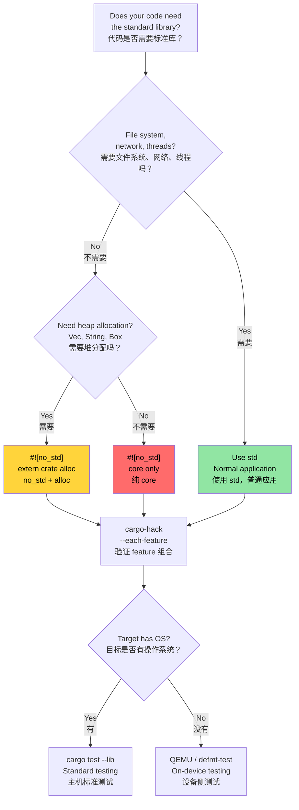

# `no_std` and Feature Verification 🔴<br><span class="zh-inline">`no_std` 与特性验证 🔴</span>

> **What you'll learn:**<br><span class="zh-inline">**本章将学到什么：**</span>
> - Verifying feature combinations systematically with `cargo-hack`<br><span class="zh-inline">如何系统化地用 `cargo-hack` 验证 feature 组合</span>
> - The three layers of Rust: `core` vs `alloc` vs `std` and when to use each<br><span class="zh-inline">Rust 的三层能力：`core`、`alloc`、`std` 分别是什么，以及该在什么场景使用</span>
> - Building `no_std` crates with custom panic handlers and allocators<br><span class="zh-inline">如何为 `no_std` crate 编写自定义 panic handler 和分配器</span>
> - Testing `no_std` code on host and with QEMU<br><span class="zh-inline">如何在主机环境和 QEMU 里测试 `no_std` 代码</span>
>
> **Cross-references:** [Windows & Conditional Compilation](ch10-windows-and-conditional-compilation.md) — the platform half of this topic · [Cross-Compilation](ch02-cross-compilation-one-source-many-target.md) — cross-compiling to ARM and embedded targets · [Miri and Sanitizers](ch05-miri-valgrind-and-sanitizers-verifying-u.md) — verifying `unsafe` code in `no_std` environments · [Build Scripts](ch01-build-scripts-buildrs-in-depth.md) — `cfg` flags emitted by `build.rs`<br><span class="zh-inline">**交叉阅读：** [Windows 与条件编译](ch10-windows-and-conditional-compilation.md) 负责这个主题里的平台维度；[交叉编译](ch02-cross-compilation-one-source-many-target.md) 会继续讲 ARM 和嵌入式目标；[Miri 与 Sanitizer](ch05-miri-valgrind-and-sanitizers-verifying-u.md) 讲的是如何在 `no_std` 环境里继续验证 `unsafe` 代码；[构建脚本](ch01-build-scripts-buildrs-in-depth.md) 则补上 `build.rs` 产生的 `cfg` 标志。</span>

Rust runs everywhere from 8-bit microcontrollers to cloud servers. This chapter covers the foundation: stripping the standard library with `#![no_std]` and verifying that your feature combinations actually compile.<br><span class="zh-inline">Rust 能从 8 位单片机一路跑到云服务器。本章先讲最基础也最容易踩坑的两件事：怎么用 `#![no_std]` 去掉标准库，以及怎么确认 feature 组合真的都能编过。</span>

### Verifying Feature Combinations with `cargo-hack`<br><span class="zh-inline">用 `cargo-hack` 验证 feature 组合</span>

[`cargo-hack`](https://github.com/taiki-e/cargo-hack) tests all feature combinations systematically — essential for crates with `#[cfg(...)]` code:<br><span class="zh-inline">[`cargo-hack`](https://github.com/taiki-e/cargo-hack) 会系统化地把 feature 组合全测一遍。只要 crate 里写了 `#[cfg(...)]`，这工具就非常有必要。</span>

```bash
# Install
cargo install cargo-hack

# Check that every feature compiles individually
cargo hack check --each-feature --workspace

# The nuclear option: test ALL feature combinations (exponential!)
# Only practical for crates with <8 features.
cargo hack check --feature-powerset --workspace

# Practical compromise: test each feature alone + all features + no features
cargo hack check --each-feature --workspace --no-dev-deps
cargo check --workspace --all-features
cargo check --workspace --no-default-features
```

**Why this matters for the project:**<br><span class="zh-inline">**这件事为什么对工程很重要：**</span>

If you add platform features (`linux`, `windows`, `direct-ipmi`, `direct-accel-api`), `cargo-hack` catches combinations that break:<br><span class="zh-inline">只要项目开始引入平台 feature，例如 `linux`、`windows`、`direct-ipmi`、`direct-accel-api`，`cargo-hack` 就能帮忙抓出那些一开就炸的组合。</span>

```toml
# Example: features that gate platform code
[features]
default = ["linux"]
linux = []                          # Linux-specific hardware access
windows = ["dep:windows-sys"]       # Windows-specific APIs
direct-ipmi = []                    # unsafe IPMI ioctl (ch05)
direct-accel-api = []               # unsafe accel-mgmt FFI (ch05)
```

```bash
# Verify all features compile in isolation AND together
cargo hack check --each-feature -p diag_tool
# Catches: "feature 'windows' doesn't compile without 'direct-ipmi'"
# Catches: "#[cfg(feature = \"linux\")] has a typo — it's 'lnux'"
```

**CI integration:**<br><span class="zh-inline">**CI 集成方式：**</span>

```yaml
# Add to CI pipeline (fast — just compilation checks)
- name: Feature matrix check
  run: cargo hack check --each-feature --workspace --no-dev-deps
```

> **Rule of thumb**: Run `cargo hack check --each-feature` in CI for any crate with 2+ features. Run `--feature-powerset` only for core library crates with <8 features — it's exponential ($2^n$ combinations).<br><span class="zh-inline">**经验法则**：只要 crate 有两个以上 feature，就应该把 `cargo hack check --each-feature` 塞进 CI。至于 `--feature-powerset`，只建议给核心库、且 feature 少于 8 个的场景用，因为它的组合数量是指数增长的。</span>

### `no_std` — When and Why<br><span class="zh-inline">`no_std`：什么时候需要，为什么需要</span>

`#![no_std]` tells the compiler: "don't link the standard library." Your crate can only use `core` and optionally `alloc`. Why would you want this?<br><span class="zh-inline">`#![no_std]` 的意思很直接：告诉编译器别链接标准库。这样 crate 默认只能使用 `core`，如果有分配器的话再加上 `alloc`。问题来了，为什么要这么折腾？</span>

| Scenario<br><span class="zh-inline">场景</span> | Why `no_std`<br><span class="zh-inline">为什么用 `no_std`</span> |
|----------|-------------|
| Embedded firmware (ARM Cortex-M, RISC-V)<br><span class="zh-inline">嵌入式固件，例如 ARM Cortex-M、RISC-V</span> | No OS, no heap, no file system<br><span class="zh-inline">没有操作系统、通常也没有标准堆和文件系统。</span> |
| UEFI diagnostics tool<br><span class="zh-inline">UEFI 诊断工具</span> | Pre-boot environment, no OS APIs<br><span class="zh-inline">运行在开机前环境，没有 OS API 可用。</span> |
| Kernel modules<br><span class="zh-inline">内核模块</span> | Kernel space can't use userspace `std`<br><span class="zh-inline">内核态用不了用户态标准库。</span> |
| WebAssembly (WASM)<br><span class="zh-inline">WebAssembly</span> | Minimize binary size, no OS dependencies<br><span class="zh-inline">为了压缩体积，也为了减少系统依赖。</span> |
| Bootloaders<br><span class="zh-inline">引导加载器</span> | Run before any OS exists<br><span class="zh-inline">系统都还没起来，自然没有标准库运行条件。</span> |
| Shared library with C interface<br><span class="zh-inline">面向 C 接口的共享库</span> | Avoid Rust runtime in callers<br><span class="zh-inline">避免把 Rust 运行时要求强加给调用方。</span> |

**For hardware diagnostics**, `no_std` becomes relevant when building:<br><span class="zh-inline">**对硬件诊断类项目来说**，下面这些场景就会开始需要认真考虑 `no_std`：</span>

- UEFI-based pre-boot diagnostic tools (before the OS loads)<br><span class="zh-inline">基于 UEFI 的开机前诊断工具，在操作系统加载前运行。</span>
- BMC firmware diagnostics (resource-constrained ARM SoCs)<br><span class="zh-inline">BMC 固件诊断，通常跑在资源紧张的 ARM SoC 上。</span>
- Kernel-level PCIe diagnostics (kernel module or eBPF probe)<br><span class="zh-inline">内核级 PCIe 诊断，例如内核模块或 eBPF 探针。</span>

### `core` vs `alloc` vs `std` — The Three Layers<br><span class="zh-inline">`core`、`alloc`、`std`：三层能力结构</span>

```text
┌─────────────────────────────────────────────────────────────┐
│ std / 标准库                                               │
│  Everything in core + alloc, PLUS:                         │
│  包含 core 与 alloc 的全部能力，并额外提供：               │
│  • File I/O (std::fs, std::io) / 文件读写                  │
│  • Networking (std::net) / 网络                            │
│  • Threads (std::thread) / 线程                            │
│  • Time (std::time) / 时间                                 │
│  • Environment (std::env) / 环境变量                       │
│  • Process (std::process) / 进程                           │
│  • OS-specific (std::os::unix, std::os::windows) / 平台接口│
├─────────────────────────────────────────────────────────────┤
│ alloc / 分配层（#![no_std] + extern crate alloc）          │
│  available only when a global allocator exists             │
│  只有在存在全局分配器时才能使用：                          │
│  • String, Vec, Box, Rc, Arc                               │
│  • BTreeMap, BTreeSet                                      │
│  • format!() macro                                         │
│  • Collections and smart pointers that need heap           │
│    需要堆分配的集合与智能指针                               │
├─────────────────────────────────────────────────────────────┤
│ core / 核心层（#![no_std] 下始终可用）                     │
│  • Primitive types (u8, bool, char, etc.) / 基本类型       │
│  • Option, Result                                          │
│  • Iterator, slice, array, str / 迭代器、切片、数组、str   │
│  • Traits: Clone, Copy, Debug, Display, From, Into         │
│  • Atomics (core::sync::atomic) / 原子类型                 │
│  • Cell, RefCell, Pin                                      │
│  • core::fmt (formatting without allocation) / 无分配格式化│
│  • core::mem, core::ptr / 底层内存操作                     │
│  • Math: core::num, basic arithmetic / 基础数值与运算      │
└─────────────────────────────────────────────────────────────┘
```

**What you lose without `std`:**<br><span class="zh-inline">**去掉 `std` 之后，少掉的东西主要是这些：**</span>

- No `HashMap` (requires a hasher — use `BTreeMap` from `alloc`, or `hashbrown`)<br><span class="zh-inline">没有 `HashMap`，因为它依赖哈希器。可以改用 `alloc` 里的 `BTreeMap`，或者 `hashbrown`。</span>
- No `println!()` (requires stdout — use `core::fmt::Write` to a buffer)<br><span class="zh-inline">没有 `println!()`，因为没有标准输出。通常改成写入缓冲区，再交给平台层输出。</span>
- No `std::error::Error` (stabilized in `core` since Rust 1.81, but many ecosystems haven't migrated)<br><span class="zh-inline">`std::error::Error` 体系也会受限。虽然 Rust 1.81 之后 `core` 侧有改进，但大量生态还没跟上。</span>
- No file I/O, no networking, no threads (unless provided by a platform HAL)<br><span class="zh-inline">没有文件 IO、没有网络、没有线程，除非平台 HAL 额外提供。</span>
- No `Mutex` (use `spin::Mutex` or platform-specific locks)<br><span class="zh-inline">也没有常规 `Mutex`，通常要换成 `spin::Mutex` 或平台专用锁。</span>

### Building a `no_std` Crate<br><span class="zh-inline">构建一个 `no_std` crate</span>

```rust
// src/lib.rs — a no_std library crate
#![no_std]

// Optionally use heap allocation
extern crate alloc;
use alloc::string::String;
use alloc::vec::Vec;
use core::fmt;

/// Temperature reading from a thermal sensor.
/// This struct works in any environment — bare metal to Linux.
#[derive(Clone, Copy, Debug)]
pub struct Temperature {
    /// Raw sensor value (0.0625°C per LSB for typical I2C sensors)
    raw: u16,
}

impl Temperature {
    pub const fn from_raw(raw: u16) -> Self {
        Self { raw }
    }

    /// Convert to degrees Celsius (fixed-point, no FPU required)
    pub const fn millidegrees_c(&self) -> i32 {
        (self.raw as i32) * 625 / 10 // 0.0625°C resolution
    }

    pub fn degrees_c(&self) -> f32 {
        self.raw as f32 * 0.0625
    }
}

impl fmt::Display for Temperature {
    fn fmt(&self, f: &mut fmt::Formatter<'_>) -> fmt::Result {
        let md = self.millidegrees_c();
        // Handle sign correctly for values between -0.999°C and -0.001°C
        // where md / 1000 == 0 but the value is negative.
        if md < 0 && md > -1000 {
            write!(f, "-0.{:03}°C", (-md) % 1000)
        } else {
            write!(f, "{}.{:03}°C", md / 1000, (md % 1000).abs())
        }
    }
}

/// Parse space-separated temperature values.
/// Uses alloc — requires a global allocator.
pub fn parse_temperatures(input: &str) -> Vec<Temperature> {
    input
        .split_whitespace()
        .filter_map(|s| s.parse::<u16>().ok())
        .map(Temperature::from_raw)
        .collect()
}

/// Format without allocation — writes directly to a buffer.
/// Works in `core`-only environments (no alloc, no heap).
pub fn format_temp_into(temp: &Temperature, buf: &mut [u8]) -> usize {
    use core::fmt::Write;
    struct SliceWriter<'a> {
        buf: &'a mut [u8],
        pos: usize,
    }
    impl<'a> Write for SliceWriter<'a> {
        fn write_str(&mut self, s: &str) -> fmt::Result {
            let bytes = s.as_bytes();
            let remaining = self.buf.len() - self.pos;
            if bytes.len() > remaining {
                // Buffer full — signal the error instead of silently truncating.
                // Callers can check the returned pos for partial writes.
                return Err(fmt::Error);
            }
            self.buf[self.pos..self.pos + bytes.len()].copy_from_slice(bytes);
            self.pos += bytes.len();
            Ok(())
        }
    }
    let mut w = SliceWriter { buf, pos: 0 };
    let _ = write!(w, "{}", temp);
    w.pos
}
```

```toml
# Cargo.toml for a no_std crate
[package]
name = "thermal-sensor"
version = "0.1.0"
edition = "2021"

[features]
default = ["alloc"]
alloc = []    # Enable Vec, String, etc.
std = []      # Enable full std (implies alloc)

[dependencies]
# Use no_std-compatible crates
serde = { version = "1.0", default-features = false, features = ["derive"] }
# ↑ default-features = false drops std dependency!
```

> **Key crate pattern**: Many popular crates (serde, log, rand, embedded-hal) support `no_std` via `default-features = false`. Always check whether a dependency requires `std` before using it in a `no_std` context. Note that some crates (e.g., `regex`) require at least `alloc` and don't work in `core`-only environments.<br><span class="zh-inline">**常见 crate 适配套路**：很多流行库，例如 `serde`、`log`、`rand`、`embedded-hal`，都能通过 `default-features = false` 切到 `no_std` 模式。真正要留神的是依赖到底需要 `std`，还是只需要 `alloc`。像 `regex` 这种库，至少就得有 `alloc`，纯 `core` 环境里用不了。</span>

### Custom Panic Handlers and Allocators<br><span class="zh-inline">自定义 panic handler 与分配器</span>

In `#![no_std]` binaries (not libraries), you must provide a panic handler and optionally a global allocator:<br><span class="zh-inline">在 `#![no_std]` 的二进制程序里，不是库，是可执行产物，必须自己提供 panic handler；如果用了堆分配，还得自己给出全局分配器。</span>

```rust
// src/main.rs — a no_std binary (e.g., UEFI diagnostic)
#![no_std]
#![no_main]

extern crate alloc;

use core::panic::PanicInfo;

// Required: what to do on panic (no stack unwinding available)
#[panic_handler]
fn panic(info: &PanicInfo) -> ! {
    // In embedded: blink an LED, write to UART, hang
    // In UEFI: write to console, halt
    // Minimal: just loop forever
    loop {
        core::hint::spin_loop();
    }
}

// Required if using alloc: provide a global allocator
use alloc::alloc::{GlobalAlloc, Layout};

struct BumpAllocator {
    // Simple bump allocator for embedded/UEFI
    // In practice, use a crate like `linked_list_allocator` or `embedded-alloc`
}

// WARNING: This is a non-functional placeholder! Calling alloc() will return
// null, causing immediate UB (the global allocator contract requires non-null
// returns for non-zero-sized allocations). In real code, use an established
// allocator crate:
//   - embedded-alloc (embedded targets)
//   - linked_list_allocator (UEFI / OS kernels)
//   - talc (general-purpose no_std)
unsafe impl GlobalAlloc for BumpAllocator {
    unsafe fn alloc(&self, _layout: Layout) -> *mut u8 {
        // PLACEHOLDER — will crash! Replace with real allocation logic.
        core::ptr::null_mut()
    }
    unsafe fn dealloc(&self, _ptr: *mut u8, _layout: Layout) {
        // No-op for bump allocator
    }
}

#[global_allocator]
static ALLOCATOR: BumpAllocator = BumpAllocator {};

// Entry point (platform-specific, not fn main)
// For UEFI: #[entry] or efi_main
// For embedded: #[cortex_m_rt::entry]
```

### Testing `no_std` Code<br><span class="zh-inline">测试 `no_std` 代码</span>

Tests run on the host machine, which has `std`. The trick: your library is `no_std`, but your test harness uses `std`:<br><span class="zh-inline">测试一般还是跑在主机环境里，而主机是有 `std` 的。关键点在于：库本身可以是 `no_std`，但测试 harness 仍然能使用 `std`。</span>

```rust
// Your crate: #![no_std] in src/lib.rs
// But tests run under std automatically:

#[cfg(test)]
mod tests {
    use super::*;
    // std is available here — println!, assert!, Vec all work

    #[test]
    fn test_temperature_conversion() {
        let temp = Temperature::from_raw(800); // 50.0°C
        assert_eq!(temp.millidegrees_c(), 50000);
        assert!((temp.degrees_c() - 50.0).abs() < 0.01);
    }

    #[test]
    fn test_format_into_buffer() {
        let temp = Temperature::from_raw(800);
        let mut buf = [0u8; 32];
        let len = format_temp_into(&temp, &mut buf);
        let s = core::str::from_utf8(&buf[..len]).unwrap();
        assert_eq!(s, "50.000°C");
    }
}
```

**Testing on the actual target** (when `std` isn't available at all):<br><span class="zh-inline">**如果目标环境根本没有 `std`**，那就需要换真正的目标侧测试手段。</span>

```bash
# Use defmt-test for on-device testing (embedded ARM)
# Use uefi-test-runner for UEFI targets
# Use QEMU for cross-architecture tests without hardware

# Run no_std library tests on host (always works):
cargo test --lib

# Verify no_std compilation against a no_std target:
cargo check --target thumbv7em-none-eabihf  # ARM Cortex-M
cargo check --target riscv32imac-unknown-none-elf  # RISC-V
```

### `no_std` Decision Tree<br><span class="zh-inline">`no_std` 决策树</span>



### 🏋️ Exercises<br><span class="zh-inline">🏋️ 练习</span>

#### 🟡 Exercise 1: Feature Combination Verification<br><span class="zh-inline">🟡 练习 1：验证 feature 组合</span>

Install `cargo-hack` and run `cargo hack check --each-feature --workspace` on a project with multiple features. Does it find any broken combinations?<br><span class="zh-inline">安装 `cargo-hack`，然后在一个带多个 feature 的项目上执行 `cargo hack check --each-feature --workspace`。看看它能不能抓出有问题的 feature 组合。</span>

<details>
<summary>Solution <span class="zh-inline">参考答案</span></summary>

```bash
cargo install cargo-hack

# Check each feature individually
cargo hack check --each-feature --workspace --no-dev-deps

# If a feature combination fails:
# error[E0433]: failed to resolve: use of undeclared crate or module `std`
# → This means a feature gate is missing a #[cfg] guard

# Check all features + no features + each individually:
cargo hack check --each-feature --workspace
cargo check --workspace --all-features
cargo check --workspace --no-default-features
```
</details>

#### 🔴 Exercise 2: Build a `no_std` Library<br><span class="zh-inline">🔴 练习 2：构建一个 `no_std` 库</span>

Create a library crate that compiles with `#![no_std]`. Implement a simple stack-allocated ring buffer. Verify it compiles for `thumbv7em-none-eabihf` (ARM Cortex-M).<br><span class="zh-inline">创建一个能在 `#![no_std]` 下编译的库 crate，实现一个简单的栈上环形缓冲区，并验证它可以为 `thumbv7em-none-eabihf` 目标编译通过。</span>

<details>
<summary>Solution <span class="zh-inline">参考答案</span></summary>

```rust
// lib.rs
#![no_std]

pub struct RingBuffer<const N: usize> {
    data: [u8; N],
    head: usize,
    len: usize,
}

impl<const N: usize> RingBuffer<N> {
    pub const fn new() -> Self {
        Self { data: [0; N], head: 0, len: 0 }
    }

    pub fn push(&mut self, byte: u8) -> bool {
        if self.len == N { return false; }
        let idx = (self.head + self.len) % N;
        self.data[idx] = byte;
        self.len += 1;
        true
    }

    pub fn pop(&mut self) -> Option<u8> {
        if self.len == 0 { return None; }
        let byte = self.data[self.head];
        self.head = (self.head + 1) % N;
        self.len -= 1;
        Some(byte)
    }
}

#[cfg(test)]
mod tests {
    use super::*;

    #[test]
    fn push_pop() {
        let mut rb = RingBuffer::<4>::new();
        assert!(rb.push(1));
        assert!(rb.push(2));
        assert_eq!(rb.pop(), Some(1));
        assert_eq!(rb.pop(), Some(2));
        assert_eq!(rb.pop(), None);
    }
}
```

```bash
rustup target add thumbv7em-none-eabihf
cargo check --target thumbv7em-none-eabihf
# ✅ Compiles for bare-metal ARM
```
</details>

### Key Takeaways<br><span class="zh-inline">本章要点</span>

- `cargo-hack --each-feature` is essential for any crate with conditional compilation — run it in CI<br><span class="zh-inline">凡是用了条件编译的 crate，`cargo-hack --each-feature` 都很值得放进 CI。</span>
- `core` → `alloc` → `std` are layered: each adds capabilities but requires more runtime support<br><span class="zh-inline">`core`、`alloc`、`std` 是层层叠上去的，每多一层能力，也就多一层运行时要求。</span>
- Custom panic handlers and allocators are required for bare-metal `no_std` binaries<br><span class="zh-inline">裸机 `no_std` 二进制必须自己处理 panic，也往往得自己提供分配器。</span>
- Test `no_std` libraries on the host with `cargo test --lib` — no hardware needed<br><span class="zh-inline">`no_std` 库完全可以先在主机上用 `cargo test --lib` 测起来，不需要一上来就摸硬件。</span>
- Run `--feature-powerset` only for core libraries with <8 features — it's $2^n$ combinations<br><span class="zh-inline">`--feature-powerset` 只适合 feature 很少的核心库，否则组合数量会指数爆炸。</span>

---
