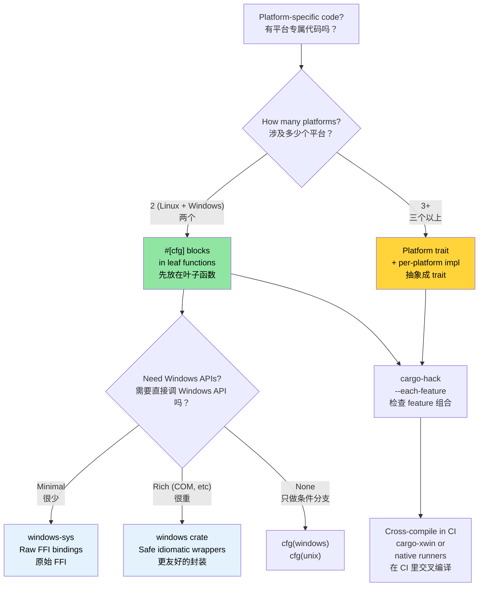

# Windows and Conditional Compilation 🟡<br><span class="zh-inline">Windows 与条件编译 🟡</span>

> **What you'll learn:**<br><span class="zh-inline">**本章将学到什么：**</span>
> - Windows support patterns: `windows-sys`/`windows` crates, `cargo-xwin`<br><span class="zh-inline">Windows 支持的常见模式：`windows-sys`、`windows` crate，以及 `cargo-xwin`</span>
> - Conditional compilation with `#[cfg]` — checked by the compiler, not the preprocessor<br><span class="zh-inline">如何使用 `#[cfg]` 做条件编译，它由编译器检查，而不是靠预处理器瞎猜</span>
> - Platform abstraction architecture: when `#[cfg]` blocks suffice vs when to use traits<br><span class="zh-inline">平台抽象架构怎么选：什么时候只用 `#[cfg]` 就够了，什么时候该上 trait</span>
> - Cross-compiling for Windows from Linux<br><span class="zh-inline">如何从 Linux 交叉编译到 Windows</span>
>
> **Cross-references:** [`no_std` & Features](ch09-no-std-and-feature-verification.md) — `cargo-hack` and feature verification · [Cross-Compilation](ch02-cross-compilation-one-source-many-target.md) — general cross-build setup · [Build Scripts](ch01-build-scripts-buildrs-in-depth.md) — `cfg` flags emitted by `build.rs`<br><span class="zh-inline">**交叉阅读：** [`no_std` 与 feature](ch09-no-std-and-feature-verification.md) 负责 `cargo-hack` 和 feature 验证；[交叉编译](ch02-cross-compilation-one-source-many-target.md) 讲通用构建准备；[构建脚本](ch01-build-scripts-buildrs-in-depth.md) 继续补充 `build.rs` 产生的 `cfg` 标志。</span>

### Windows Support — Platform Abstractions<br><span class="zh-inline">Windows 支持：平台抽象</span>

Rust's `#[cfg()]` attributes and Cargo features allow a single codebase to target both Linux and Windows cleanly. The project already demonstrates this pattern in `platform::run_command`:<br><span class="zh-inline">Rust 的 `#[cfg()]` 属性和 Cargo feature 可以让同一套代码同时服务 Linux 和 Windows，而且结构还能保持干净。当前项目在 `platform::run_command` 里其实已经体现了这种写法。</span>

```rust
// Real pattern from the project — platform-specific shell invocation
pub fn exec_cmd(cmd: &str, timeout_secs: Option<u64>) -> Result<CommandResult, CommandError> {
    #[cfg(windows)]
    let mut child = Command::new("cmd")
        .args(["/C", cmd])
        .stdout(Stdio::piped())
        .stderr(Stdio::piped())
        .spawn()?;

    #[cfg(not(windows))]
    let mut child = Command::new("sh")
        .args(["-c", cmd])
        .stdout(Stdio::piped())
        .stderr(Stdio::piped())
        .spawn()?;

    // ... rest is platform-independent ...
}
```

**Available `cfg` predicates:**<br><span class="zh-inline">**常见的 `cfg` 谓词：**</span>

```rust
// Operating system
#[cfg(target_os = "linux")]         // Linux specifically
#[cfg(target_os = "windows")]       // Windows
#[cfg(target_os = "macos")]         // macOS
#[cfg(unix)]                        // Linux, macOS, BSDs, etc.
#[cfg(windows)]                     // Windows (shorthand)

// Architecture
#[cfg(target_arch = "x86_64")]      // x86 64-bit
#[cfg(target_arch = "aarch64")]     // ARM 64-bit
#[cfg(target_arch = "x86")]         // x86 32-bit

// Pointer width (portable alternative to arch)
#[cfg(target_pointer_width = "64")] // Any 64-bit platform
#[cfg(target_pointer_width = "32")] // Any 32-bit platform

// Environment / C library
#[cfg(target_env = "gnu")]          // glibc
#[cfg(target_env = "musl")]         // musl libc
#[cfg(target_env = "msvc")]         // MSVC on Windows

// Endianness
#[cfg(target_endian = "little")]
#[cfg(target_endian = "big")]

// Combinations with any(), all(), not()
#[cfg(all(target_os = "linux", target_arch = "x86_64"))]
#[cfg(any(target_os = "linux", target_os = "macos"))]
#[cfg(not(windows))]
```

### The `windows-sys` and `windows` Crates<br><span class="zh-inline">`windows-sys` 与 `windows` crate</span>

For calling Windows APIs directly:<br><span class="zh-inline">如果需要直接调用 Windows API，通常就会在这两个 crate 之间选一个。</span>

```toml
# Cargo.toml — use windows-sys for raw FFI (lighter, no abstraction)
[target.'cfg(windows)'.dependencies]
windows-sys = { version = "0.59", features = [
    "Win32_Foundation",
    "Win32_System_Services",
    "Win32_System_Registry",
    "Win32_System_Power",
] }
# NOTE: windows-sys uses semver-incompatible releases (0.48 → 0.52 → 0.59).
# Pin to a single minor version — each release may remove or rename API bindings.
# Check https://github.com/microsoft/windows-rs for the latest version
# before starting a new project.

# Or use the windows crate for safe wrappers (heavier, more ergonomic)
# windows = { version = "0.59", features = [...] }
```

```rust
// src/platform/windows.rs
#[cfg(windows)]
mod win {
    use windows_sys::Win32::System::Power::{
        GetSystemPowerStatus, SYSTEM_POWER_STATUS,
    };

    pub fn get_battery_status() -> Option<u8> {
        let mut status = SYSTEM_POWER_STATUS::default();
        // SAFETY: GetSystemPowerStatus writes to the provided buffer.
        // The buffer is correctly sized and aligned.
        let ok = unsafe { GetSystemPowerStatus(&mut status) };
        if ok != 0 {
            Some(status.BatteryLifePercent)
        } else {
            None
        }
    }
}
```

**`windows-sys` vs `windows` crate:**<br><span class="zh-inline">**`windows-sys` 和 `windows` 的差别：**</span>

| Aspect<br><span class="zh-inline">方面</span> | `windows-sys` | `windows` |
|--------|---------------|----------|
| API style<br><span class="zh-inline">API 风格</span> | Raw FFI (`unsafe` calls)<br><span class="zh-inline">原始 FFI，需要自己处理 `unsafe`</span> | Safe Rust wrappers<br><span class="zh-inline">更安全、更贴近 Rust 风格的包装</span> |
| Binary size<br><span class="zh-inline">二进制体积</span> | Minimal (just extern declarations)<br><span class="zh-inline">更小，主要只是 extern 声明</span> | Larger (wrapper code)<br><span class="zh-inline">更大，因为有包装层</span> |
| Compile time<br><span class="zh-inline">编译时间</span> | Fast<br><span class="zh-inline">更快</span> | Slower<br><span class="zh-inline">更慢</span> |
| Ergonomics<br><span class="zh-inline">易用性</span> | C-style, manual safety<br><span class="zh-inline">偏 C 风格，安全性手动兜底</span> | Rust-idiomatic<br><span class="zh-inline">更符合 Rust 写法</span> |
| Error handling<br><span class="zh-inline">错误处理</span> | Raw `BOOL` / `HRESULT`<br><span class="zh-inline">原始返回码</span> | `Result<T, windows::core::Error>`<br><span class="zh-inline">更自然的 `Result` 形式</span> |
| Use when<br><span class="zh-inline">适用场景</span> | Performance-critical, thin wrapper<br><span class="zh-inline">极薄封装、性能敏感场景</span> | Application code, ease of use<br><span class="zh-inline">应用层代码，图省心的时候</span> |

### Cross-Compiling for Windows from Linux<br><span class="zh-inline">从 Linux 交叉编译到 Windows</span>

```bash
# Option 1: MinGW (GNU ABI)
rustup target add x86_64-pc-windows-gnu
sudo apt install gcc-mingw-w64-x86-64
cargo build --target x86_64-pc-windows-gnu
# Produces a .exe — runs on Windows, links against msvcrt

# Option 2: MSVC ABI via xwin (for full MSVC compatibility)
cargo install cargo-xwin
cargo xwin build --target x86_64-pc-windows-msvc
# Uses Microsoft's CRT and SDK headers downloaded automatically

# Option 3: Zig-based cross-compilation
cargo zigbuild --target x86_64-pc-windows-gnu
```

**GNU vs MSVC ABI on Windows:**<br><span class="zh-inline">**Windows 下 GNU ABI 和 MSVC ABI 的对比：**</span>

| Aspect<br><span class="zh-inline">方面</span> | `x86_64-pc-windows-gnu` | `x86_64-pc-windows-msvc` |
|--------|-------------------------|---------------------------|
| Linker<br><span class="zh-inline">链接器</span> | MinGW `ld` | MSVC `link.exe` or `lld-link` |
| C runtime<br><span class="zh-inline">C 运行时</span> | `msvcrt.dll` (universal)<br><span class="zh-inline">通用但老</span> | `ucrtbase.dll` (modern)<br><span class="zh-inline">更新、更主流</span> |
| C++ interop<br><span class="zh-inline">C++ 互操作</span> | GCC ABI | MSVC ABI |
| Cross-compile from Linux<br><span class="zh-inline">从 Linux 交叉编译</span> | Easy (MinGW)<br><span class="zh-inline">更简单</span> | Possible (`cargo-xwin`)<br><span class="zh-inline">可行，但要依赖 `cargo-xwin`</span> |
| Windows API support<br><span class="zh-inline">Windows API 支持</span> | Full<br><span class="zh-inline">完整</span> | Full<br><span class="zh-inline">完整</span> |
| Debug info format<br><span class="zh-inline">调试信息格式</span> | DWARF | PDB |
| Recommended for<br><span class="zh-inline">更适合</span> | Simple tools, CI builds<br><span class="zh-inline">简单工具、CI 构建</span> | Full Windows integration<br><span class="zh-inline">完整 Windows 集成</span> |

### Conditional Compilation Patterns<br><span class="zh-inline">条件编译模式</span>

**Pattern 1: Platform module selection**<br><span class="zh-inline">**模式 1：按平台选择模块。**</span>

```rust
// src/platform/mod.rs — compile different modules per OS
#[cfg(target_os = "linux")]
mod linux;
#[cfg(target_os = "linux")]
pub use linux::*;

#[cfg(target_os = "windows")]
mod windows;
#[cfg(target_os = "windows")]
pub use windows::*;

// Both modules implement the same public API:
// pub fn get_cpu_temperature() -> Result<f64, PlatformError>
// pub fn list_pci_devices() -> Result<Vec<PciDevice>, PlatformError>
```

**Pattern 2: Feature-gated platform support**<br><span class="zh-inline">**模式 2：用 feature 控制平台支持。**</span>

```toml
# Cargo.toml
[features]
default = ["linux"]
linux = []              # Linux-specific hardware access
windows = ["dep:windows-sys"]  # Windows-specific APIs

[target.'cfg(windows)'.dependencies]
windows-sys = { version = "0.59", features = [...], optional = true }
```

```rust
// Compile error if someone tries to build for Windows without the feature:
#[cfg(all(target_os = "windows", not(feature = "windows")))]
compile_error!("Enable the 'windows' feature to build for Windows");
```

**Pattern 3: Trait-based platform abstraction**<br><span class="zh-inline">**模式 3：基于 trait 的平台抽象。**</span>

```rust
/// Platform-independent interface for hardware access.
pub trait HardwareAccess {
    type Error: std::error::Error;

    fn read_cpu_temperature(&self) -> Result<f64, Self::Error>;
    fn read_gpu_temperature(&self, gpu_index: u32) -> Result<f64, Self::Error>;
    fn list_pci_devices(&self) -> Result<Vec<PciDevice>, Self::Error>;
    fn send_ipmi_command(&self, cmd: &IpmiCmd) -> Result<IpmiResponse, Self::Error>;
}

#[cfg(target_os = "linux")]
pub struct LinuxHardware;

#[cfg(target_os = "linux")]
impl HardwareAccess for LinuxHardware {
    type Error = LinuxHwError;

    fn read_cpu_temperature(&self) -> Result<f64, Self::Error> {
        // Read from /sys/class/thermal/thermal_zone0/temp
        let raw = std::fs::read_to_string("/sys/class/thermal/thermal_zone0/temp")?;
        Ok(raw.trim().parse::<f64>()? / 1000.0)
    }
    // ...
}

#[cfg(target_os = "windows")]
pub struct WindowsHardware;

#[cfg(target_os = "windows")]
impl HardwareAccess for WindowsHardware {
    type Error = WindowsHwError;

    fn read_cpu_temperature(&self) -> Result<f64, Self::Error> {
        // Read via WMI (Win32_TemperatureProbe) or Open Hardware Monitor
        todo!("WMI temperature query")
    }
    // ...
}

/// Create the platform-appropriate implementation
pub fn create_hardware() -> impl HardwareAccess {
    #[cfg(target_os = "linux")]
    { LinuxHardware }
    #[cfg(target_os = "windows")]
    { WindowsHardware }
}
```

### Platform Abstraction Architecture<br><span class="zh-inline">平台抽象架构</span>

For a project that targets multiple platforms, organize code into three layers:<br><span class="zh-inline">面向多平台的项目，代码结构最好拆成三层。</span>

```text
┌──────────────────────────────────────────────────┐
│ Application Logic / 应用逻辑层                   │
│  diag_tool, accel_diag, network_diag, event_log │
│  Uses only the platform abstraction trait        │
│  只依赖平台抽象 trait                            │
├──────────────────────────────────────────────────┤
│ Platform Abstraction Layer / 平台抽象层          │
│  trait HardwareAccess { ... }                    │
│  trait CommandRunner { ... }                     │
│  trait FileSystem { ... }                        │
├──────────────────────────────────────────────────┤
│ Platform Implementations / 平台实现层            │
│  ┌──────────────┐  ┌──────────────┐              │
│  │ Linux impl   │  │ Windows impl │              │
│  │ /sys, /proc  │  │ WMI, Registry│              │
│  │ ipmitool     │  │ ipmiutil     │              │
│  │ lspci        │  │ devcon       │              │
│  └──────────────┘  └──────────────┘              │
└──────────────────────────────────────────────────┘
```

**Testing the abstraction**: Mock the platform trait for unit tests:<br><span class="zh-inline">**怎么测抽象层**：单元测试里直接给平台 trait 做 mock。</span>

```rust
#[cfg(test)]
mod tests {
    use super::*;

    struct MockHardware {
        cpu_temp: f64,
        gpu_temps: Vec<f64>,
    }

    impl HardwareAccess for MockHardware {
        type Error = std::io::Error;

        fn read_cpu_temperature(&self) -> Result<f64, Self::Error> {
            Ok(self.cpu_temp)
        }

        fn read_gpu_temperature(&self, index: u32) -> Result<f64, Self::Error> {
            self.gpu_temps.get(index as usize)
                .copied()
                .ok_or_else(|| std::io::Error::new(
                    std::io::ErrorKind::NotFound,
                    format!("GPU {index} not found")
                ))
        }

        fn list_pci_devices(&self) -> Result<Vec<PciDevice>, Self::Error> {
            Ok(vec![]) // Mock returns empty
        }

        fn send_ipmi_command(&self, _cmd: &IpmiCmd) -> Result<IpmiResponse, Self::Error> {
            Ok(IpmiResponse::default())
        }
    }

    #[test]
    fn test_thermal_check_with_mock() {
        let hw = MockHardware {
            cpu_temp: 75.0,
            gpu_temps: vec![82.0, 84.0],
        };
        let result = run_thermal_diagnostic(&hw);
        assert!(result.is_ok());
    }
}
```

### Application: Linux-First, Windows-Ready<br><span class="zh-inline">应用场景：Linux 优先，但为 Windows 预留好位置</span>

The project is already partially Windows-ready. Use [`cargo-hack`](ch09-no-std-and-feature-verification.md) to verify all feature combinations, and [cross-compile](ch02-cross-compilation-one-source-many-target.md) to test on Windows from Linux:<br><span class="zh-inline">当前项目其实已经具备一部分 Windows 准备度了。继续往前推进时，可以用 [`cargo-hack`](ch09-no-std-and-feature-verification.md) 验证 feature 组合，再配合 [交叉编译](ch02-cross-compilation-one-source-many-target.md) 从 Linux 侧做 Windows 构建检查。</span>

**Already done:**<br><span class="zh-inline">**已经具备的基础：**</span>

- `platform::run_command` uses `#[cfg(windows)]` for shell selection<br><span class="zh-inline">`platform::run_command` 已经通过 `#[cfg(windows)]` 切换命令外壳。</span>
- Tests use `#[cfg(windows)]` / `#[cfg(not(windows))]` for platform-appropriate test commands<br><span class="zh-inline">测试代码已经用 `#[cfg(windows)]` 和 `#[cfg(not(windows))]` 选择不同平台的命令。</span>

**Recommended evolution path for Windows support:**<br><span class="zh-inline">**Windows 支持的演进路线建议：**</span>

```text
Phase 1: Extract platform abstraction trait (current → 2 weeks)
  ├─ Define HardwareAccess trait in core_lib
  ├─ Wrap current Linux code behind LinuxHardware impl
  └─ All diagnostic modules depend on trait, not Linux specifics

Phase 2: Add Windows stubs (2 weeks)
  ├─ Implement WindowsHardware with TODO stubs
  ├─ CI builds for x86_64-pc-windows-msvc (compile check only)
  └─ Tests pass with MockHardware on all platforms

Phase 3: Windows implementation (ongoing)
  ├─ IPMI via ipmiutil.exe or OpenIPMI Windows driver
  ├─ GPU via accel-mgmt (accel-api.dll) — same API as Linux
  ├─ PCIe via Windows Setup API (SetupDiEnumDeviceInfo)
  └─ NIC via WMI (Win32_NetworkAdapter)
```

```text
阶段 1：抽出平台抽象 trait（当前状态到两周内）
  ├─ 在 core_lib 里定义 HardwareAccess
  ├─ 把现有 Linux 逻辑包进 LinuxHardware
  └─ 诊断模块全部依赖 trait，而不是直接依赖 Linux 细节

阶段 2：补 Windows 骨架（约两周）
  ├─ 先实现带 TODO 的 WindowsHardware
  ├─ CI 增加 x86_64-pc-windows-msvc 编译检查
  └─ 所有平台都先通过 MockHardware 维持测试稳定

阶段 3：逐步补齐 Windows 实现（持续进行）
  ├─ IPMI 通过 ipmiutil.exe 或 OpenIPMI Windows 驱动
  ├─ GPU 通过 accel-mgmt（accel-api.dll），接口尽量和 Linux 保持一致
  ├─ PCIe 通过 Windows Setup API
  └─ 网卡信息通过 WMI
```

**Cross-platform CI addition:**<br><span class="zh-inline">**CI 里建议补上的跨平台矩阵项：**</span>

```yaml
# Add to CI matrix
- target: x86_64-pc-windows-msvc
  os: windows-latest
  name: windows-x86_64
```

This ensures the codebase compiles on Windows even before full Windows implementation is complete — catching `cfg` mistakes early.<br><span class="zh-inline">这样做的价值在于：哪怕 Windows 实现还没做完，也能先保证代码库在 Windows 上能编过，把 `cfg` 相关的低级错误尽早揪出来。</span>

> **Key insight**: The abstraction doesn't need to be perfect on day one. Start with `#[cfg]` blocks in leaf functions (like `exec_cmd` already does), then refactor to traits when you have two or more platform implementations. Premature abstraction is worse than `#[cfg]` blocks.<br><span class="zh-inline">**关键思路**：第一天就把抽象做成教科书模样，往往纯属自找麻烦。先在叶子函数上用 `#[cfg]` 解决问题，等平台实现真的开始分叉，再收敛到 trait 抽象，通常更稳。</span>

### Conditional Compilation Decision Tree<br><span class="zh-inline">条件编译决策树</span>



### 🏋️ Exercises<br><span class="zh-inline">🏋️ 练习</span>

#### 🟢 Exercise 1: Platform-Conditional Module<br><span class="zh-inline">🟢 练习 1：平台条件模块</span>

Create a module with `#[cfg(unix)]` and `#[cfg(windows)]` implementations of a `get_hostname()` function. Verify both compile with `cargo check` and `cargo check --target x86_64-pc-windows-msvc`.<br><span class="zh-inline">写一个模块，用 `#[cfg(unix)]` 和 `#[cfg(windows)]` 分别实现 `get_hostname()`，再用 `cargo check` 和 `cargo check --target x86_64-pc-windows-msvc` 验证两边都能编过。</span>

<details>
<summary>Solution <span class="zh-inline">参考答案</span></summary>

```rust
// src/hostname.rs
#[cfg(unix)]
pub fn get_hostname() -> String {
    use std::fs;
    fs::read_to_string("/etc/hostname")
        .unwrap_or_else(|_| "unknown".to_string())
        .trim()
        .to_string()
}

#[cfg(windows)]
pub fn get_hostname() -> String {
    use std::env;
    env::var("COMPUTERNAME").unwrap_or_else(|_| "unknown".to_string())
}

#[cfg(test)]
mod tests {
    use super::*;

    #[test]
    fn hostname_is_not_empty() {
        let name = get_hostname();
        assert!(!name.is_empty());
    }
}
```

```bash
# Verify Linux compilation
cargo check

# Verify Windows compilation (cross-check)
rustup target add x86_64-pc-windows-msvc
cargo check --target x86_64-pc-windows-msvc
```
</details>

#### 🟡 Exercise 2: Cross-Compile for Windows with cargo-xwin<br><span class="zh-inline">🟡 练习 2：用 cargo-xwin 交叉编译 Windows</span>

Install `cargo-xwin` and build a simple binary for `x86_64-pc-windows-msvc` from Linux. Verify the output is a `.exe`.<br><span class="zh-inline">安装 `cargo-xwin`，从 Linux 侧为 `x86_64-pc-windows-msvc` 目标构建一个简单二进制，并确认输出是 `.exe` 文件。</span>

<details>
<summary>Solution <span class="zh-inline">参考答案</span></summary>

```bash
cargo install cargo-xwin
rustup target add x86_64-pc-windows-msvc

cargo xwin build --release --target x86_64-pc-windows-msvc
# Downloads Windows SDK headers/libs automatically

file target/x86_64-pc-windows-msvc/release/my-binary.exe
# Output: PE32+ executable (console) x86-64, for MS Windows

# You can also test with Wine:
wine target/x86_64-pc-windows-msvc/release/my-binary.exe
```
</details>

### Key Takeaways<br><span class="zh-inline">本章要点</span>

- Start with `#[cfg]` blocks in leaf functions; refactor to traits only when three or more platforms diverge<br><span class="zh-inline">先在叶子函数里用 `#[cfg]` 解决平台差异，平台分叉足够多了再抽象成 trait。</span>
- `windows-sys` is for raw FFI; the `windows` crate provides safe, idiomatic wrappers<br><span class="zh-inline">`windows-sys` 适合原始 FFI；`windows` crate 更适合图省事、想要 Rust 风格封装的场景。</span>
- `cargo-xwin` cross-compiles to Windows MSVC ABI from Linux — no Windows machine needed<br><span class="zh-inline">`cargo-xwin` 能从 Linux 直接编到 Windows 的 MSVC ABI，很多时候并不需要单独起一台 Windows 机器。</span>
- Always check `--target x86_64-pc-windows-msvc` in CI even if you only ship on Linux<br><span class="zh-inline">就算主要只发 Linux，也建议在 CI 里持续检查 `x86_64-pc-windows-msvc`。</span>
- Combine `#[cfg]` with Cargo features for optional platform support (e.g., `feature = "windows"`)<br><span class="zh-inline">把 `#[cfg]` 和 Cargo feature 结合起来，用来管理可选平台支持，会更灵活。</span>

---
