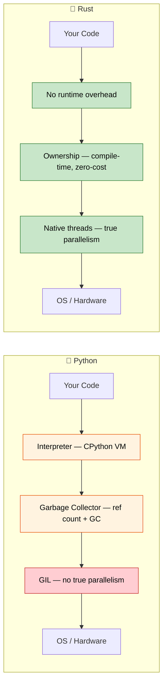

## Speaker Intro and General Approach

- Speaker intro
    - Principal Firmware Architect in Microsoft SCHIE (Silicon and Cloud Hardware Infrastructure Engineering) team
    - Industry veteran with expertise in security, systems programming (firmware, operating systems, hypervisors), CPU and platform architecture, and C++ systems
    - Started programming in Rust in 2017 (@AWS EC2), and have been in love with the language ever since
- This course is intended to be as interactive as possible
    - Assumption: You know Python and its ecosystem
    - Examples deliberately map Python concepts to Rust equivalents
    - **Please feel free to ask clarifying questions at any point of time**

---

## The Case for Rust for Python Developers

> **What you'll learn:** Why Python developers are adopting Rust, real-world performance wins (Dropbox, Discord, Pydantic),
> when Rust is the right choice vs staying with Python, and the core philosophical differences between the two languages.
>
> **Difficulty:** 🟢 Beginner

### Performance: From Minutes to Milliseconds

Python is famously slow for CPU-bound work. Rust provides C-level performance
with a high-level feel.

```python
# Python — ~2 seconds for 10 million calls
import time

def fibonacci(n: int) -> int:
    if n <= 1:
        return n
    a, b = 0, 1
    for _ in range(2, n + 1):
        a, b = b, a + b
    return b

start = time.perf_counter()
results = [fibonacci(n % 30) for n in range(10_000_000)]
elapsed = time.perf_counter() - start
print(f"Elapsed: {elapsed:.2f}s")  # ~2s on typical hardware
```

```rust
// Rust — ~0.07 seconds for the same 10 million calls
use std::time::Instant;

fn fibonacci(n: u64) -> u64 {
    if n <= 1 {
        return n;
    }
    let (mut a, mut b) = (0u64, 1u64);
    for _ in 2..=n {
        let temp = b;
        b = a + b;
        a = temp;
    }
    b
}

fn main() {
    let start = Instant::now();
    let results: Vec<u64> = (0..10_000_000).map(|n| fibonacci(n % 30)).collect();
    println!("Elapsed: {:.2?}", start.elapsed());  // ~0.07s
}
```
> Note: Rust should be run in release mode (`cargo run --release`) for a fair performance comparison.
> **Why the difference?** Python dispatches every `+` through a dictionary lookup,
> unboxes integers from heap objects, and checks types at every operation. Rust compiles
> `fibonacci` directly to a handful of x86 `add`/`mov` instructions — the same code a
> C compiler would produce.

### Memory Safety Without a Garbage Collector

Python's reference-counting GC has known issues: circular references, unpredictable
`__del__` timing, and memory fragmentation. Rust eliminates these at compile time.

```python
# Python — circular reference that CPython's ref counter can't free
class Node:
    def __init__(self, value):
        self.value = value
        self.parent = None
        self.children = []

    def add_child(self, child):
        self.children.append(child)
        child.parent = self  # Circular reference!

# These two nodes reference each other — ref count never reaches 0.
# CPython's cycle detector will *eventually* clean them up,
# but you can't control when, and it adds GC pause overhead.
root = Node("root")
child = Node("child")
root.add_child(child)
```

```rust
// Rust — ownership prevents circular references by design
struct Node {
    value: String,
    children: Vec<Node>,  // Children are OWNED — no cycles possible
}

impl Node {
    fn new(value: &str) -> Self {
        Node {
            value: value.to_string(),
            children: Vec::new(),
        }
    }

    fn add_child(&mut self, child: Node) {
        self.children.push(child);  // Ownership transfers here
    }
}

fn main() {
    let mut root = Node::new("root");
    let child = Node::new("child");
    root.add_child(child);
    // When root is dropped, all children are dropped too.
    // Deterministic, zero overhead, no GC.
}
```

> **Key insight**: In Rust, the child doesn't hold a reference back to the parent.
> If you truly need cross-references (like a graph), you use explicit mechanisms
> like `Rc<RefCell<T>>` or indices — making the complexity visible and intentional.

***

## Common Python Pain Points That Rust Addresses

### 1. Runtime Type Errors

The most common Python production bug: passing the wrong type to a function.
Type hints help, but they aren't enforced.

```python
# Python — type hints are suggestions, not rules
def process_user(user_id: int, name: str) -> dict:
    return {"id": user_id, "name": name.upper()}

# These all "work" at the call site — fail at runtime
process_user("not-a-number", 42)        # TypeError at .upper()
process_user(None, "Alice")             # Works until you use user_id as int

# Even with mypy, you can still bypass types:
data = json.loads('{"id": "oops"}')     # Always returns Any
process_user(data["id"], data["name"])  # mypy can't catch this
```

```rust
// Rust — the compiler catches all of these before the program runs
fn process_user(user_id: i64, name: &str) -> User {
    User {
        id: user_id,
        name: name.to_uppercase(),
    }
}

// process_user("not-a-number", 42);     // ❌ Compile error: expected i64, found &str
// process_user(None, "Alice");           // ❌ Compile error: expected i64, found Option
// Extra arguments are always a compile error.

// Deserializing JSON is type-safe too:
#[derive(Deserialize)]
struct UserInput {
    id: i64,     // Must be a number in the JSON
    name: String, // Must be a string in the JSON
}
let input: UserInput = serde_json::from_str(json_str)?; // Returns Err if types mismatch
process_user(input.id, &input.name); // ✅ Guaranteed correct types
```

### 2. None: The Billion Dollar Mistake (Python Edition)

`None` can appear anywhere a value is expected. Python has no compile-time way
to prevent `AttributeError: 'NoneType' object has no attribute ...`.

```python
# Python — None sneaks in everywhere
def find_user(user_id: int) -> dict | None:
    users = {1: {"name": "Alice"}, 2: {"name": "Bob"}}
    return users.get(user_id)

user = find_user(999)         # Returns None
print(user["name"])           # 💥 TypeError: 'NoneType' object is not subscriptable

# Even with Optional type hint, nothing enforces the check:
from typing import Optional
def get_name(user_id: int) -> Optional[str]:
    return None

name: Optional[str] = get_name(1)
print(name.upper())          # 💥 AttributeError — mypy warns, runtime doesn't care
```

```rust
// Rust — None is impossible unless explicitly handled
fn find_user(user_id: i64) -> Option<User> {
    let users = HashMap::from([
        (1, User { name: "Alice".into() }),
        (2, User { name: "Bob".into() }),
    ]);
    users.get(&user_id).cloned()
}

let user = find_user(999);  // Returns None variant of Option<User>
// println!("{}", user.name);  // ❌ Compile error: Option<User> has no field `name`

// You MUST handle the None case:
match find_user(999) {
    Some(user) => println!("{}", user.name),
    None => println!("User not found"),
}

// Or use combinators:
let name = find_user(999)
    .map(|u| u.name)
    .unwrap_or_else(|| "Unknown".to_string());
```

### 3. The GIL: Python's Concurrency Ceiling

Python's Global Interpreter Lock means threads don't run Python code in parallel.
`threading` is only useful for I/O-bound work; CPU-bound work requires `multiprocessing`
(with its serialization overhead) or C extensions.

```python
# Python — threads DON'T speed up CPU work because of the GIL
import threading
import time

def cpu_work(n):
    total = 0
    for i in range(n):
        total += i * i
    return total

start = time.perf_counter()
threads = [threading.Thread(target=cpu_work, args=(10_000_000,)) for _ in range(4)]
for t in threads:
    t.start()
for t in threads:
    t.join()
elapsed = time.perf_counter() - start
print(f"4 threads: {elapsed:.2f}s")  # About the SAME as 1 thread! GIL prevents parallelism.

# multiprocessing "works" but serializes data between processes:
from multiprocessing import Pool
with Pool(4) as p:
    results = p.map(cpu_work, [10_000_000] * 4)  # ~4x faster, but pickle overhead
```

```rust
// Rust — true parallelism, no GIL, no serialization overhead
use std::thread;

fn cpu_work(n: u64) -> u64 {
    (0..n).map(|i| i * i).sum()
}

fn main() {
    let start = std::time::Instant::now();
    let handles: Vec<_> = (0..4)
        .map(|_| thread::spawn(|| cpu_work(10_000_000)))
        .collect();

    let results: Vec<u64> = handles.into_iter()
        .map(|h| h.join().unwrap())
        .collect();

    println!("4 threads: {:.2?}", start.elapsed());  // ~4x faster than single thread
}
```

> **With Rayon** (Rust's parallel iterator library), parallelism is even simpler:
> ```rust
> use rayon::prelude::*;
> let results: Vec<u64> = inputs.par_iter().map(|&n| cpu_work(n)).collect();
> ```

### 4. Deployment and Distribution Pain

Python deployment is notoriously difficult: venvs, system Python conflicts,
`pip install` failures, C extension wheels, Docker images with full Python runtime.

```python
# Python deployment checklist:
# 1. Which Python version? 3.9? 3.10? 3.11? 3.12?
# 2. Virtual environment: venv, conda, poetry, pipenv?
# 3. C extensions: need compiler? manylinux wheels?
# 4. System dependencies: libssl, libffi, etc.?
# 5. Docker: full python:3.12 image is 1.0 GB
# 6. Startup time: 200-500ms for import-heavy apps

# Docker image: ~1 GB
# FROM python:3.12-slim
# COPY requirements.txt .
# RUN pip install -r requirements.txt
# COPY . .
# CMD ["python", "app.py"]
```

```rust
// Rust deployment: single static binary, no runtime needed
// cargo build --release → one binary, ~5-20 MB
// Copy it anywhere — no Python, no venv, no dependencies

// Docker image: ~5 MB (from scratch or distroless)
// FROM scratch
// COPY target/release/my_app /my_app
// CMD ["/my_app"]

// Startup time: <1ms
// Cross-compile: cargo build --target x86_64-unknown-linux-musl
```

***

## When to Choose Rust Over Python

### Choose Rust When:
- **Performance is critical**: Data pipelines, real-time processing, compute-heavy services
- **Correctness matters**: Financial systems, safety-critical code, protocol implementations
- **Deployment simplicity**: Single binary, no runtime dependencies
- **Low-level control**: Hardware interaction, OS integration, embedded systems
- **True concurrency**: CPU-bound parallelism without GIL workarounds
- **Memory efficiency**: Reduce cloud costs for memory-intensive services
- **Long-running services**: Where predictable latency matters (no GC pauses)

### Stay with Python When:
- **Rapid prototyping**: Exploratory data analysis, scripts, one-off tools
- **ML/AI workflows**: PyTorch, TensorFlow, scikit-learn ecosystem
- **Glue code**: Connecting APIs, data transformation scripts
- **Team expertise**: When Rust learning curve doesn't justify benefits
- **Time to market**: When development speed trumps execution speed
- **Interactive work**: Jupyter notebooks, REPL-driven development
- **Scripting**: Automation, sys-admin tasks, quick utilities

### Consider Both (Hybrid Approach with PyO3):
- **Compute-heavy code in Rust**: Called from Python via PyO3/maturin
- **Business logic and orchestration in Python**: Familiar, productive
- **Gradual migration**: Identify hotspots, replace with Rust extensions
- **Best of both**: Python's ecosystem + Rust's performance

***

## Real-World Impact: Why Companies Choose Rust

### Dropbox: Storage Infrastructure
- **Before (Python)**: High CPU usage, memory overhead in sync engine
- **After (Rust)**: 10x performance improvement, 50% memory reduction
- **Result**: Millions saved in infrastructure costs

### Discord: Voice/Video Backend
- **Before (Python → Go)**: GC pauses causing audio drops
- **After (Rust)**: Consistent low-latency performance
- **Result**: Better user experience, reduced server costs

### Cloudflare: Edge Workers
- **Why Rust**: WebAssembly compilation, predictable performance at edge
- **Result**: Workers run with microsecond cold starts

### Pydantic V2
- **Before**: Pure Python validation — slow for large payloads
- **After**: Rust core (via PyO3) — **5–50x faster** validation
- **Result**: Same Python API, dramatically faster execution

### Why This Matters for Python Developers:
1. **Complementary skills**: Rust and Python solve different problems
2. **PyO3 bridge**: Write Rust extensions callable from Python
3. **Performance understanding**: Learn why Python is slow and how to fix hotspots
4. **Career growth**: Systems programming expertise increasingly valuable
5. **Cloud costs**: 10x faster code = significantly lower infrastructure spend

***

## Language Philosophy Comparison

### Python Philosophy
- **Readability counts**: Clean syntax, "one obvious way to do it"
- **Batteries included**: Extensive standard library, rapid prototyping
- **Duck typing**: "If it walks like a duck and quacks like a duck..."
- **Developer velocity**: Optimize for writing speed, not execution speed
- **Dynamic everything**: Modify classes at runtime, monkey-patching, metaclasses

### Rust Philosophy
- **Performance without sacrifice**: Zero-cost abstractions, no runtime overhead
- **Correctness first**: If it compiles, entire categories of bugs are impossible
- **Explicit over implicit**: No hidden behavior, no implicit conversions
- **Ownership**: Resources have exactly one owner — memory, files, sockets
- **Fearless concurrency**: The type system prevents data races at compile time



***

## Quick Reference: Rust vs Python

| **Concept** | **Python** | **Rust** | **Key Difference** |
|-------------|-----------|----------|-------------------|
| Typing | Dynamic (`duck typing`) | Static (compile-time) | Errors caught before runtime |
| Memory | Garbage collected (ref counting + cycle GC) | Ownership system | Zero-cost, deterministic cleanup |
| None/null | `None` anywhere | `Option<T>` | Compile-time None safety |
| Error handling | `raise`/`try`/`except` | `Result<T, E>` | Explicit, no hidden control flow |
| Mutability | Everything mutable | Immutable by default | Opt-in to mutation |
| Speed | Interpreted (~10–100x slower) | Compiled (C/C++ speed) | Orders of magnitude faster |
| Concurrency | GIL limits threads | No GIL, `Send`/`Sync` traits | True parallelism by default |
| Dependencies | `pip install` / `poetry add` | `cargo add` | Built-in dependency management |
| Build system | setuptools/poetry/hatch | Cargo | Single unified tool |
| Packaging | `pyproject.toml` | `Cargo.toml` | Similar declarative config |
| REPL | `python` interactive | No REPL (use tests/`cargo run`) | Compile-first workflow |
| Type hints | Optional, not enforced | Required, compiler-enforced | Types are not decorative |

---

## Exercises

<details>
<summary><strong>🏋️ Exercise: Mental Model Check</strong> (click to expand)</summary>

**Challenge**: For each Python snippet, predict what Rust would require differently. Don't write code — just describe the constraint.

1. `x = [1, 2, 3]; y = x; x.append(4)` — What happens in Rust?
2. `data = None; print(data.upper())` — How does Rust prevent this?
3. `import threading; shared = []; threading.Thread(target=shared.append, args=(1,)).start()` — What does Rust demand?

<details>
<summary>🔑 Solution</summary>

1. **Ownership move**: `let y = x;` moves `x` — `x.push(4)` is a compile error. You'd need `let y = x.clone();` or borrow with `let y = &x;`.
2. **No null**: `data` can't be `None` unless it's `Option<String>`. You must `match` or use `.unwrap()` / `if let` — no surprise `NoneType` errors.
3. **Send + Sync**: The compiler requires `shared` to be wrapped in `Arc<Mutex<Vec<i32>>>`. Forgetting the lock = compile error, not a race condition.

**Key takeaway**: Rust shifts runtime failures to compile-time errors. The "friction" you feel is the compiler catching real bugs.

</details>
</details>

***


