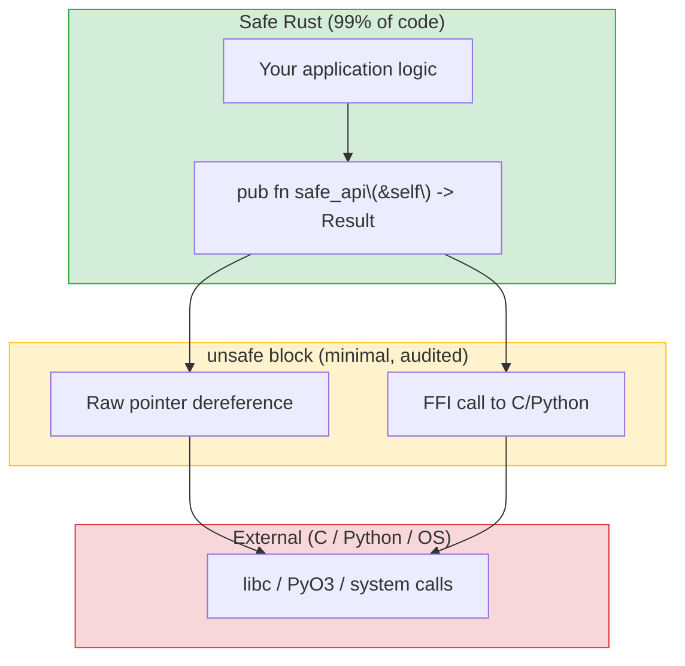

## When and Why to Use Unsafe

> **What you'll learn:** What `unsafe` permits and why it exists, writing Python extensions with PyO3 (the killer feature for Python devs),
> Rust's testing framework vs pytest, mocking with mockall, and benchmarking.
>
> **Difficulty:** 🔴 Advanced

`unsafe` in Rust is an escape hatch — it tells the compiler "I'm doing something
you can't verify, but I promise it's correct." Python has no equivalent because
Python never gives you direct memory access.



> **The pattern**: Safe API wraps a small `unsafe` block. Callers never see `unsafe`. Python's `ctypes` has no such boundary — every FFI call is implicitly unsafe.
>
> 📌 **See also**: [Ch. 13 — Concurrency](ch13-concurrency.md) covers `Send`/`Sync` traits which are `unsafe` auto-traits that the compiler checks for thread safety.

### What unsafe Allows
```rust
// unsafe lets you do FIVE things that safe Rust forbids:
// 1. Dereference raw pointers
// 2. Call unsafe functions/methods
// 3. Access mutable static variables
// 4. Implement unsafe traits
// 5. Access union fields

// Example: calling a C function
extern "C" {
    fn abs(input: i32) -> i32;
}

fn main() {
    // SAFETY: abs() is a well-defined C standard library function.
    let result = unsafe { abs(-42) };  // Safe Rust can't verify C code
    println!("{result}");               // 42
}
```

### When to Use unsafe
```rust
// 1. FFI — calling C libraries (most common reason)
// 2. Performance-critical inner loops (rare)
// 3. Data structures the borrow checker can't express (rare)

// As a Python developer, you'll mostly encounter unsafe in:
// - PyO3 internals (Python ↔ Rust bridge)
// - C library bindings
// - Low-level system calls

// Rule of thumb: if you're writing application code (not library code),
// you should almost never need unsafe. If you think you do, ask in the
// Rust community first — there's usually a safe alternative.
```

***

## PyO3: Rust Extensions for Python

PyO3 is the bridge between Python and Rust. It lets you write Rust functions and
classes that are callable from Python — perfect for replacing slow Python hotspots.

### Creating a Python Extension in Rust
```bash
# Setup
pip install maturin    # Build tool for Rust Python extensions
maturin init           # Creates project structure

# Project structure:
# my_extension/
# ├── Cargo.toml
# ├── pyproject.toml
# └── src/
#     └── lib.rs
```

```toml
# Cargo.toml
[package]
name = "my_extension"
version = "0.1.0"
edition = "2021"

[lib]
crate-type = ["cdylib"]    # Shared library for Python

[dependencies]
pyo3 = { version = "0.22", features = ["extension-module"] }
```

```rust
// src/lib.rs — Rust functions callable from Python
use pyo3::prelude::*;

/// A fast Fibonacci function written in Rust.
#[pyfunction]
fn fibonacci(n: u64) -> u64 {
    let (mut a, mut b) = (0u64, 1u64);
    for _ in 0..n {
        let temp = b;
        b = a.wrapping_add(b);
        a = temp;
    }
    a
}

/// Find all prime numbers up to n (Sieve of Eratosthenes).
#[pyfunction]
fn primes_up_to(n: usize) -> Vec<usize> {
    let mut is_prime = vec![true; n + 1];
    is_prime[0] = false;
    if n > 0 { is_prime[1] = false; }
    for i in 2..=((n as f64).sqrt() as usize) {
        if is_prime[i] {
            for j in (i * i..=n).step_by(i) {
                is_prime[j] = false;
            }
        }
    }
    (2..=n).filter(|&i| is_prime[i]).collect()
}

/// A Rust class usable from Python.
#[pyclass]
struct Counter {
    value: i64,
}

#[pymethods]
impl Counter {
    #[new]
    fn new(start: i64) -> Self {
        Counter { value: start }
    }

    fn increment(&mut self) {
        self.value += 1;
    }

    fn get_value(&self) -> i64 {
        self.value
    }

    fn __repr__(&self) -> String {
        format!("Counter(value={})", self.value)
    }
}

/// The Python module definition.
#[pymodule]
fn my_extension(m: &Bound<'_, PyModule>) -> PyResult<()> {
    m.add_function(wrap_pyfunction!(fibonacci, m)?)?;
    m.add_function(wrap_pyfunction!(primes_up_to, m)?)?;
    m.add_class::<Counter>()?;
    Ok(())
}
```

### Using from Python
```bash
# Build and install:
maturin develop --release   # Builds and installs into current venv
```

```python
# Python — use the Rust extension like any Python module
import my_extension

# Call Rust function
result = my_extension.fibonacci(50)
print(result)  # 12586269025 — computed in microseconds

# Use Rust class
counter = my_extension.Counter(0)
counter.increment()
counter.increment()
print(counter.get_value())  # 2
print(counter)              # Counter(value=2)

# Performance comparison:
import time

# Python version
def py_primes(n):
    sieve = [True] * (n + 1)
    for i in range(2, int(n**0.5) + 1):
        if sieve[i]:
            for j in range(i*i, n+1, i):
                sieve[j] = False
    return [i for i in range(2, n+1) if sieve[i]]

start = time.perf_counter()
py_result = py_primes(10_000_000)
py_time = time.perf_counter() - start

start = time.perf_counter()
rs_result = my_extension.primes_up_to(10_000_000)
rs_time = time.perf_counter() - start

print(f"Python: {py_time:.3f}s")    # ~3.5s
print(f"Rust:   {rs_time:.3f}s")    # ~0.05s — 70x faster!
print(f"Same results: {py_result == rs_result}")  # True
```

### PyO3 Quick Reference

| Python Concept | PyO3 Attribute | Notes |
|---------------|----------------|-------|
| Function | `#[pyfunction]` | Exposed to Python |
| Class | `#[pyclass]` | Python-visible class |
| Method | `#[pymethods]` | Methods on a pyclass |
| `__init__` | `#[new]` | Constructor |
| `__repr__` | `fn __repr__()` | String representation |
| `__str__` | `fn __str__()` | Display string |
| `__len__` | `fn __len__()` | Length |
| `__getitem__` | `fn __getitem__()` | Indexing |
| Property | `#[getter]` / `#[setter]` | Attribute access |
| Static method | `#[staticmethod]` | No self |
| Class method | `#[classmethod]` | Takes cls |

### FFI Safety Patterns

When exposing Rust to Python (via PyO3 or raw C FFI), these rules prevent the most common bugs:

1. **Never let a panic cross the FFI boundary** — a Rust panic unwinding into Python (or C) is **undefined behavior**. PyO3 handles this automatically for `#[pyfunction]`, but raw `extern "C"` functions need explicit protection:
    ```rust
    #[no_mangle]
    pub extern "C" fn raw_ffi_function() -> i32 {
        match std::panic::catch_unwind(|| {
            // actual logic
            42
        }) {
            Ok(result) => result,
            Err(_) => -1,  // Return error code instead of panicking into C/Python
        }
    }
    ```

2. **`#[repr(C)]` for shared structs** — if Python/C reads struct fields directly, you **must** use `#[repr(C)]` to guarantee C-compatible layout. If you're passing opaque pointers (which PyO3 does for `#[pyclass]`), it's not needed.

3. **`extern "C"`** — required for raw FFI functions so the calling convention matches what C/Python expects. PyO3's `#[pyfunction]` handles this for you.

> **PyO3 advantage**: PyO3 wraps most of these safety concerns for you — panic catching, type conversion, GIL management. Prefer PyO3 over raw FFI unless you have a specific reason not to.

***


<!-- ch14a: Testing -->
## Unit Tests vs pytest

### Python Testing with pytest
```python
# test_calculator.py
import pytest
from calculator import add, divide

def test_add():
    assert add(2, 3) == 5

def test_add_negative():
    assert add(-1, 1) == 0

def test_divide():
    assert divide(10, 2) == 5.0

def test_divide_by_zero():
    with pytest.raises(ZeroDivisionError):
        divide(1, 0)

# Parameterized tests
@pytest.mark.parametrize("a,b,expected", [
    (1, 2, 3),
    (0, 0, 0),
    (-1, -1, -2),
    (100, 200, 300),
])
def test_add_parametrized(a, b, expected):
    assert add(a, b) == expected

# Fixtures
@pytest.fixture
def sample_data():
    return [1, 2, 3, 4, 5]

def test_sum(sample_data):
    assert sum(sample_data) == 15
```

```bash
# Running tests
pytest                      # Run all tests
pytest test_calculator.py   # Run one file
pytest -k "test_add"        # Run matching tests
pytest -v                   # Verbose output
pytest --tb=short           # Short tracebacks
```

### Rust Built-in Testing
```rust
// src/calculator.rs — tests live in the SAME file!
fn add(a: i32, b: i32) -> i32 {
    a + b
}

fn divide(a: f64, b: f64) -> Result<f64, String> {
    if b == 0.0 {
        Err("Division by zero".to_string())
    } else {
        Ok(a / b)
    }
}

// Tests go in a #[cfg(test)] module — only compiled during `cargo test`
#[cfg(test)]
mod tests {
    use super::*;  // Import everything from parent module

    #[test]
    fn test_add() {
        assert_eq!(add(2, 3), 5);
    }

    #[test]
    fn test_add_negative() {
        assert_eq!(add(-1, 1), 0);
    }

    #[test]
    fn test_divide() {
        assert_eq!(divide(10.0, 2.0), Ok(5.0));
    }

    #[test]
    fn test_divide_by_zero() {
        assert!(divide(1.0, 0.0).is_err());
    }

    // Test that something panics (like pytest.raises)
    #[test]
    #[should_panic(expected = "out of bounds")]
    fn test_out_of_bounds() {
        let v = vec![1, 2, 3];
        let _ = v[99];  // Panics
    }
}
```

```bash
# Running tests
cargo test                         # Run all tests
cargo test test_add                # Run matching tests
cargo test -- --nocapture          # Show println! output
cargo test -p my_crate             # Test one crate in workspace
cargo test -- --test-threads=1     # Sequential (for tests with side effects)
```

### Testing Quick Reference

| pytest | Rust | Notes |
|--------|------|-------|
| `assert x == y` | `assert_eq!(x, y)` | Equality |
| `assert x != y` | `assert_ne!(x, y)` | Inequality |
| `assert condition` | `assert!(condition)` | Boolean |
| `assert condition, "msg"` | `assert!(condition, "msg")` | With message |
| `pytest.raises(E)` | `#[should_panic]` | Expect panic |
| `@pytest.fixture` | Setup in test or helper fn | No built-in fixtures |
| `@pytest.mark.parametrize` | `rstest` crate | Parameterized tests |
| `conftest.py` | `tests/common/mod.rs` | Shared test helpers |
| `pytest.skip()` | `#[ignore]` | Skip a test |
| `tmp_path` fixture | `tempfile` crate | Temporary directories |

***

## Parameterized Tests with rstest
```rust
// Cargo.toml: rstest = "0.23"

use rstest::rstest;

// Like @pytest.mark.parametrize
#[rstest]
#[case(1, 2, 3)]
#[case(0, 0, 0)]
#[case(-1, -1, -2)]
#[case(100, 200, 300)]
fn test_add(#[case] a: i32, #[case] b: i32, #[case] expected: i32) {
    assert_eq!(add(a, b), expected);
}

// Like @pytest.fixture
use rstest::fixture;

#[fixture]
fn sample_data() -> Vec<i32> {
    vec![1, 2, 3, 4, 5]
}

#[rstest]
fn test_sum(sample_data: Vec<i32>) {
    assert_eq!(sample_data.iter().sum::<i32>(), 15);
}
```

***

## Mocking with mockall
```python
# Python — mocking with unittest.mock
from unittest.mock import Mock, patch

def test_fetch_user():
    mock_db = Mock()
    mock_db.get_user.return_value = {"name": "Alice"}

    result = fetch_user_name(mock_db, 1)
    assert result == "Alice"
    mock_db.get_user.assert_called_once_with(1)
```

```rust
// Rust — mocking with mockall crate
// Cargo.toml: mockall = "0.13"

use mockall::{automock, predicate::*};

#[automock]                          // Generates MockDatabase automatically
trait Database {
    fn get_user(&self, id: i64) -> Option<User>;
}

fn fetch_user_name(db: &dyn Database, id: i64) -> Option<String> {
    db.get_user(id).map(|u| u.name)
}

#[test]
fn test_fetch_user() {
    let mut mock = MockDatabase::new();
    mock.expect_get_user()
        .with(eq(1))                   // assert_called_with(1)
        .times(1)                      // assert_called_once
        .returning(|_| Some(User { name: "Alice".into() }));

    let result = fetch_user_name(&mock, 1);
    assert_eq!(result, Some("Alice".to_string()));
}
```

---

## Exercises

<details>
<summary><strong>🏋️ Exercise: Safe Wrapper Around Unsafe</strong> (click to expand)</summary>

**Challenge**: Write a safe function `split_at_mid` that takes a `&mut [i32]` and returns two mutable slices `(&mut [i32], &mut [i32])` split at the midpoint. Internally, use `unsafe` with raw pointers (simulating what `split_at_mut` does). Then wrap it in a safe API.

<details>
<summary>🔑 Solution</summary>

```rust
fn split_at_mid(slice: &mut [i32]) -> (&mut [i32], &mut [i32]) {
    let mid = slice.len() / 2;
    let ptr = slice.as_mut_ptr();
    let len = slice.len();

    assert!(mid <= len); // Safety check before unsafe

    // SAFETY: mid <= len (asserted above), and ptr comes from a valid &mut slice,
    // so both sub-slices are within bounds and non-overlapping.
    unsafe {
        (
            std::slice::from_raw_parts_mut(ptr, mid),
            std::slice::from_raw_parts_mut(ptr.add(mid), len - mid),
        )
    }
}

fn main() {
    let mut data = vec![1, 2, 3, 4, 5, 6];
    let (left, right) = split_at_mid(&mut data);
    left[0] = 99;
    right[0] = 88;
    println!("left: {left:?}, right: {right:?}");
    // left: [99, 2, 3], right: [88, 5, 6]
}
```

**Key takeaway**: The `unsafe` block is small and guarded by the `assert!`. The public API is fully safe — callers never see `unsafe`. This is the Rust pattern: unsafe internals, safe interfaces. Python's `ctypes` gives you no such guarantees.

</details>
</details>

***


