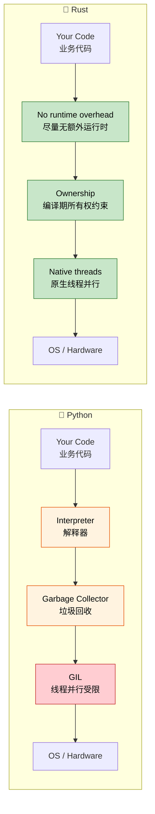

## Speaker Intro and General Approach<br><span class="zh-inline">讲者背景与整体方式</span>

- Speaker intro<br><span class="zh-inline">讲者背景</span>
  <br><span class="zh-inline">微软 SCHIE 团队的 Principal Firmware Architect，长期做安全、系统编程、固件、操作系统、虚拟化和 CPU / 平台架构相关工作。</span>
- Industry veteran with expertise in security, systems programming, CPU and platform architecture, and C++ systems<br><span class="zh-inline">在安全、系统编程、底层平台与 C++ 系统方向积累很深。</span>
- Started programming in Rust in 2017 and has loved it ever since<br><span class="zh-inline">从 2017 年开始使用 Rust，并长期投入其中。</span>
- This course is intended to be interactive<br><span class="zh-inline">这门课希望尽量保持互动式学习。</span>
- Assumption: you already know Python and its ecosystem<br><span class="zh-inline">默认前提是：已经熟悉 Python 及其生态。</span>
- Examples deliberately map Python concepts to Rust equivalents<br><span class="zh-inline">所有示例都会尽量把 Python 概念映射到 Rust 的对应物。</span>
- Clarifying questions are encouraged at any time<br><span class="zh-inline">遇到不清楚的地方，随时打断提问完全没问题。</span>

---

## The Case for Rust for Python Developers<br><span class="zh-inline">为什么 Python 开发者值得学 Rust</span>

> **What you'll learn:** Why Python developers are adopting Rust, where the real-world performance gains come from, when Rust is the right choice and when Python remains the better tool, and the philosophical differences between the two languages.<br><span class="zh-inline">**本章将学习：** 为什么越来越多 Python 开发者开始接触 Rust，真实世界里的性能收益来自哪里，什么时候该选 Rust、什么时候继续用 Python 更合适，以及这两门语言在设计哲学上的差异。</span>
>
> **Difficulty:** 🟢 Beginner<br><span class="zh-inline">**难度：** 🟢 入门</span>

### Performance: From Minutes to Milliseconds<br><span class="zh-inline">性能：从分钟级到毫秒级</span>

Python is famous for developer speed, not CPU efficiency. For CPU-bound tasks, Rust often lands orders of magnitude faster while still keeping relatively high-level syntax.<br><span class="zh-inline">Python 出名的是开发速度，不是 CPU 执行效率。对 CPU 密集任务来说，Rust 往往能快出数量级，同时语法层面又没有低到让人完全失去抽象。</span>

```python
# Python — ~45 seconds for 10 million iterations
import time

def fibonacci(n: int) -> int:
    if n <= 1:
        return n
    a, b = 0, 1
    for _ in range(2, n + 1):
        a, b = b, a + b
    return b

start = time.perf_counter()
results = [fibonacci(i) for i in range(10_000_000)]
elapsed = time.perf_counter() - start
print(f"Elapsed: {elapsed:.2f}s")
```

```rust
// Rust — ~0.3 seconds for the same 10 million iterations
use std::time::Instant;

fn fibonacci(n: u64) -> u64 {
    if n <= 1 {
        return n;
    }
    let (mut a, mut b) = (0u64, 1u64);
    for _ in 2..=n {
        let temp = b;
        b = a.wrapping_add(b);
        a = temp;
    }
    b
}

fn main() {
    let start = Instant::now();
    let results: Vec<u64> = (0..10_000_000).map(fibonacci).collect();
    println!("Elapsed: {:.2?}", start.elapsed());
}
```

> **Why the difference?** Python dispatches arithmetic through runtime object machinery, dictionary lookups, heap-allocated integers, and dynamic type checks. Rust compiles the same logic down to simple machine instructions.<br><span class="zh-inline">**为什么差距会这么大？** 因为 Python 的算术操作要经过运行时对象系统、字典查找、堆对象拆装以及动态类型检查；Rust 则会把同样的逻辑直接编译成很朴素的机器指令。</span>

### Memory Safety Without a Garbage Collector<br><span class="zh-inline">没有垃圾回收器的内存安全</span>

Python's reference-counting GC is convenient, but it also brings circular references, `__del__` timing uncertainty, and memory fragmentation issues. Rust chooses a different route: ownership and compile-time guarantees.<br><span class="zh-inline">Python 的引用计数加垃圾回收确实省心，但它也会带来循环引用、`__del__` 时机不稳定、内存碎片等问题。Rust 走的是另一条路：所有权加编译期约束。</span>

```python
# Python — circular reference
class Node:
    def __init__(self, value):
        self.value = value
        self.parent = None
        self.children = []

    def add_child(self, child):
        self.children.append(child)
        child.parent = self

root = Node("root")
child = Node("child")
root.add_child(child)
```

```rust
// Rust — ownership prevents cycles by default
struct Node {
    value: String,
    children: Vec<Node>,
}

impl Node {
    fn new(value: &str) -> Self {
        Node {
            value: value.to_string(),
            children: Vec::new(),
        }
    }

    fn add_child(&mut self, child: Node) {
        self.children.push(child);
    }
}

fn main() {
    let mut root = Node::new("root");
    let child = Node::new("child");
    root.add_child(child);
}
```

> **Key insight**: Rust defaults to tree-like ownership. If a graph or shared back-reference is truly needed, the code must opt in explicitly with `Rc`、`RefCell`、`Weak` or similar tools.<br><span class="zh-inline">**关键理解：** Rust 默认偏向树形所有权结构。如果真的需要图结构、共享回指之类复杂关系，就必须显式引入 `Rc`、`RefCell`、`Weak` 这些工具，把复杂度摆到台面上来。</span>

***

## Common Python Pain Points That Rust Addresses<br><span class="zh-inline">Rust 正面解决的几类 Python 常见痛点</span>

### 1. Runtime Type Errors<br><span class="zh-inline">1. 运行时类型错误</span>

```python
def process_user(user_id: int, name: str) -> dict:
    return {"id": user_id, "name": name.upper()}

process_user("not-a-number", 42)
process_user(None, "Alice")
process_user(1, "Alice", extra="oops")
```

```rust
fn process_user(user_id: i64, name: &str) -> User {
    User {
        id: user_id,
        name: name.to_uppercase(),
    }
}

// process_user("not-a-number", 42);     // ❌ Compile error
// process_user(None, "Alice");           // ❌ Compile error

#[derive(Deserialize)]
struct UserInput {
    id: i64,
    name: String,
}

let input: UserInput = serde_json::from_str(json_str)?;
process_user(input.id, &input.name);
```

Rust's approach is to make bad combinations literally unrepresentable in ordinary code. The compiler catches the mismatch before the process even starts.<br><span class="zh-inline">Rust 的思路是：让错误组合在普通代码里根本写不通。类型一旦对不上，程序甚至连启动机会都没有。</span>

### 2. None: The Billion Dollar Mistake<br><span class="zh-inline">2. `None`：价值连城的历史大坑</span>

```python
def find_user(user_id: int) -> dict | None:
    users = {1: {"name": "Alice"}, 2: {"name": "Bob"}}
    return users.get(user_id)

user = find_user(999)
print(user["name"])  # 💥
```

```rust
fn find_user(user_id: i64) -> Option<User> {
    let users = HashMap::from([
        (1, User { name: "Alice".into() }),
        (2, User { name: "Bob".into() }),
    ]);
    users.get(&user_id).cloned()
}

match find_user(999) {
    Some(user) => println!("{}", user.name),
    None => println!("User not found"),
}

let name = find_user(999)
    .map(|u| u.name)
    .unwrap_or_else(|| "Unknown".to_string());
```

Rust does allow absence, but only through `Option<T>`, which forces the possibility into the type. That small shift removes an enormous class of “surprise None” failures.<br><span class="zh-inline">Rust 当然允许“值可能不存在”，但必须通过 `Option&lt;T&gt;` 把这种可能性写进类型系统。这个小改动，实际上直接消掉了非常大一类“突然冒出 None” 的运行时事故。</span>

### 3. The GIL: Python's Concurrency Ceiling<br><span class="zh-inline">3. GIL：Python 并发的天花板</span>

```python
import threading
import time

def cpu_work(n):
    total = 0
    for i in range(n):
        total += i * i
    return total

start = time.perf_counter()
threads = [threading.Thread(target=cpu_work, args=(10_000_000,)) for _ in range(4)]
for t in threads:
    t.start()
for t in threads:
    t.join()
elapsed = time.perf_counter() - start
print(f"4 threads: {elapsed:.2f}s")
```

```rust
use std::thread;

fn cpu_work(n: u64) -> u64 {
    (0..n).map(|i| i * i).sum()
}

fn main() {
    let start = std::time::Instant::now();
    let handles: Vec<_> = (0..4)
        .map(|_| thread::spawn(|| cpu_work(10_000_000)))
        .collect();

    let results: Vec<u64> = handles.into_iter()
        .map(|h| h.join().unwrap())
        .collect();

    println!("4 threads: {:.2?}", start.elapsed());
}
```

> **With Rayon**: parallelism can become even simpler with `par_iter()`, which often feels like the “why doesn't Python just let me do this?” moment for many learners.<br><span class="zh-inline">**如果用 Rayon**：并行会变得更简单，很多人第一次看到 `par_iter()` 时，都会有一种“这事在 Python 里怎么就这么费劲”的直观冲击。</span>

### 4. Deployment and Distribution Pain<br><span class="zh-inline">4. 部署与分发的痛点</span>

Python deployment often means juggling Python versions, virtual environments, wheels, system libraries, and runtime startup cost. Rust usually means shipping one binary.<br><span class="zh-inline">Python 部署经常伴随版本、虚拟环境、wheel、系统库和运行时启动成本这些问题；Rust 的常见答案则是：交付一个二进制文件。</span>

```python
# Python deployment checklist:
# 1. Which Python version?
# 2. Virtual environment?
# 3. C extensions and wheels?
# 4. System dependencies?
# 5. Large Docker images?
# 6. Import-heavy startup time?
```

```rust
// Rust deployment:
// cargo build --release -> one binary
// copy it anywhere, no runtime required
```

***

## When to Choose Rust Over Python<br><span class="zh-inline">什么时候该选 Rust</span>

### Choose Rust When:<br><span class="zh-inline">更适合选 Rust 的场景</span>

- **Performance is critical**<br><span class="zh-inline">性能是刚性要求</span>
- **Correctness matters deeply**<br><span class="zh-inline">正确性要求非常高</span>
- **Deployment simplicity matters**<br><span class="zh-inline">部署链路越简单越好</span>
- **Low-level control is required**<br><span class="zh-inline">需要更底层的控制能力</span>
- **True parallelism is valuable**<br><span class="zh-inline">真正的 CPU 并行有价值</span>
- **Memory efficiency affects cost**<br><span class="zh-inline">内存效率直接影响成本</span>
- **Latency predictability matters**<br><span class="zh-inline">对延迟稳定性有要求</span>

### Stay with Python When:<br><span class="zh-inline">继续留在 Python 更划算的场景</span>

- **Rapid prototyping dominates**<br><span class="zh-inline">原型速度最重要</span>
- **ML / AI ecosystem is the core value**<br><span class="zh-inline">核心价值在 ML / AI 生态</span>
- **The code is mostly glue and orchestration**<br><span class="zh-inline">代码主要是胶水与编排</span>
- **Team learning cost outweighs the gain**<br><span class="zh-inline">学习成本明显高于收益</span>
- **Time to market beats runtime speed**<br><span class="zh-inline">上线速度比执行速度更重要</span>
- **Interactive workflows dominate**<br><span class="zh-inline">Jupyter、REPL、交互分析是主工作流</span>

### Consider Both (Hybrid with PyO3):<br><span class="zh-inline">两者结合的场景（PyO3 混合方案）</span>

- **Compute-heavy code in Rust**<br><span class="zh-inline">计算热点用 Rust</span>
- **Business orchestration in Python**<br><span class="zh-inline">业务编排继续留给 Python</span>
- **Incremental migration of hotspots**<br><span class="zh-inline">从热点模块开始渐进迁移</span>
- **Keep Python's ecosystem, add Rust's performance**<br><span class="zh-inline">保留 Python 生态，同时引入 Rust 性能</span>

***

## Real-World Impact: Why Companies Choose Rust<br><span class="zh-inline">真实世界里的价值：为什么公司会选 Rust</span>

### Dropbox: Storage Infrastructure<br><span class="zh-inline">Dropbox：存储基础设施</span>
- Python 版本 CPU 占用和内存开销更高<br><span class="zh-inline">原先 Python 方案 CPU 和内存压力都比较大</span>
- Rust 版本带来明显性能提升和内存下降<br><span class="zh-inline">Rust 版本显著改善性能和内存使用</span>

### Discord: Voice / Video Backend<br><span class="zh-inline">Discord：语音视频后端</span>
- Earlier stacks suffered from pause-related latency problems<br><span class="zh-inline">早期方案在暂停与抖动上有明显问题</span>
- Rust gave more stable low-latency behavior<br><span class="zh-inline">Rust 带来了更稳定的低延迟表现</span>

### Cloudflare: Edge Workers<br><span class="zh-inline">Cloudflare：边缘计算</span>
- Rust works well with WebAssembly and predictable edge execution<br><span class="zh-inline">Rust 很适合 WebAssembly 和边缘执行场景</span>

### Pydantic V2<br><span class="zh-inline">Pydantic V2</span>
- The public Python API stayed familiar<br><span class="zh-inline">对外 Python API 基本保持不变</span>
- The Rust core delivered dramatic validation speedups<br><span class="zh-inline">底层 Rust 核心把校验性能拉上去了</span>

### Why This Matters for Python Developers:<br><span class="zh-inline">这对 Python 开发者意味着什么</span>

1. **The skills are complementary**<br><span class="zh-inline">1. 两门语言的能力是互补关系</span>
2. **PyO3 makes bridging practical**<br><span class="zh-inline">2. PyO3 让桥接落地变得现实</span>
3. **Learning Rust clarifies where Python pays overhead**<br><span class="zh-inline">3. 学 Rust 会反过来帮助理解 Python 的性能成本到底花在哪</span>
4. **Systems knowledge broadens career options**<br><span class="zh-inline">4. 系统编程能力会显著扩展技术边界</span>
5. **Better performance often means lower infrastructure cost**<br><span class="zh-inline">5. 性能提升通常还会带来实打实的基础设施成本下降</span>

***

## Language Philosophy Comparison<br><span class="zh-inline">语言哲学对照</span>

### Python Philosophy<br><span class="zh-inline">Python 的哲学</span>

- **Readability counts**<br><span class="zh-inline">可读性优先</span>
- **Batteries included**<br><span class="zh-inline">标准库与生态都很完整</span>
- **Duck typing**<br><span class="zh-inline">鸭子类型</span>
- **Developer velocity first**<br><span class="zh-inline">优先优化开发速度</span>
- **Dynamic everything**<br><span class="zh-inline">动态性很强</span>

### Rust Philosophy<br><span class="zh-inline">Rust 的哲学</span>

- **Performance without sacrifice**<br><span class="zh-inline">不牺牲性能</span>
- **Correctness first**<br><span class="zh-inline">正确性优先</span>
- **Explicit over implicit**<br><span class="zh-inline">显式优于隐式</span>
- **Ownership everywhere**<br><span class="zh-inline">资源由所有权统一管理</span>
- **Fearless concurrency**<br><span class="zh-inline">并发安全尽量前移到编译期</span>



***

## Quick Reference: Rust vs Python<br><span class="zh-inline">速查表：Rust vs Python</span>

| **Concept**<br><span class="zh-inline">概念</span> | **Python** | **Rust** | **Key Difference**<br><span class="zh-inline">核心差异</span> |
|-------------|-----------|----------|-------------------|
| Typing | Dynamic | Static | Errors move earlier<br><span class="zh-inline">错误更早暴露</span> |
| Memory | GC + refcount | Ownership | Deterministic cleanup<br><span class="zh-inline">确定性清理</span> |
| None/null | `None` anywhere | `Option<T>` | Absence is explicit<br><span class="zh-inline">空值显式建模</span> |
| Error handling | `raise` / `try` / `except` | `Result<T, E>` | Explicit control flow<br><span class="zh-inline">控制流更显式</span> |
| Mutability | Everything mutable | Immutable by default | Mutation is opt-in<br><span class="zh-inline">修改需要显式声明</span> |
| Speed | Interpreted | Compiled | Much faster execution<br><span class="zh-inline">执行速度通常快很多</span> |
| Concurrency | GIL-limited | No GIL | True parallelism<br><span class="zh-inline">真并行</span> |
| Dependencies | `pip` / Poetry | Cargo | Unified tooling<br><span class="zh-inline">工具链更统一</span> |
| Build system | Multiple tools | Cargo | Single main workflow<br><span class="zh-inline">主流程更统一</span> |
| Packaging | `pyproject.toml` | `Cargo.toml` | Both declarative |
| REPL | Native REPL | No main REPL | Compile-first workflow |
| Type hints | Optional | Enforced | Types are executable constraints<br><span class="zh-inline">类型是强制约束</span> |

---

## Exercises<br><span class="zh-inline">练习</span>

<details>
<summary><strong>🏋️ Exercise: Mental Model Check</strong><br><span class="zh-inline"><strong>🏋️ 练习：心智模型检查</strong></span></summary>

**Challenge**: For each Python snippet below, describe what Rust would require differently. No need to write full code; just explain the constraint.<br><span class="zh-inline">**挑战**：针对下面每段 Python 代码，描述 Rust 会提出什么不同要求。这里不用写完整代码，只要说清楚约束就行。</span>

1. `x = [1, 2, 3]; y = x; x.append(4)`<br><span class="zh-inline">1. `x = [1, 2, 3]; y = x; x.append(4)`</span>
2. `data = None; print(data.upper())`<br><span class="zh-inline">2. `data = None; print(data.upper())`</span>
3. `import threading; shared = []; threading.Thread(target=shared.append, args=(1,)).start()`<br><span class="zh-inline">3. `import threading; shared = []; threading.Thread(target=shared.append, args=(1,)).start()`</span>

<details>
<summary>🔑 Solution<br><span class="zh-inline">🔑 参考答案</span></summary>

1. **Ownership move**: `let y = x;` would move ownership, so trying to mutate `x` afterward would fail to compile unless the design uses borrowing or cloning.<br><span class="zh-inline">1. **所有权移动**：如果写成 `let y = x;`，所有权会转移给 `y`，之后再改 `x` 会直接编译失败，除非改成借用或显式克隆。</span>
2. **No implicit nulls**: `data` would have to be `Option<String>` and the `None` case must be handled before calling string methods.<br><span class="zh-inline">2. **没有隐式空值**：`data` 必须被写成 `Option<String>`，并且在调用字符串方法前先把 `None` 分支处理掉。</span>
3. **Thread-safety markers**: shared mutable state across threads must be wrapped in something like `Arc<Mutex<Vec<i32>>>`, and the compiler checks the access pattern.<br><span class="zh-inline">3. **线程安全约束**：跨线程共享可变状态通常要包进 `Arc<Mutex<Vec<i32>>>` 之类结构，而且访问方式会被编译器严格检查。</span>

**Key takeaway**: Rust shifts a lot of “this might explode later” uncertainty into “this does not compile until the ownership and safety story is coherent.”<br><span class="zh-inline">**核心收获**：Rust 会把大量“以后可能炸”的不确定性，前移成“在所有权和安全逻辑说通之前根本编不过”。</span>

</details>
</details>

***
