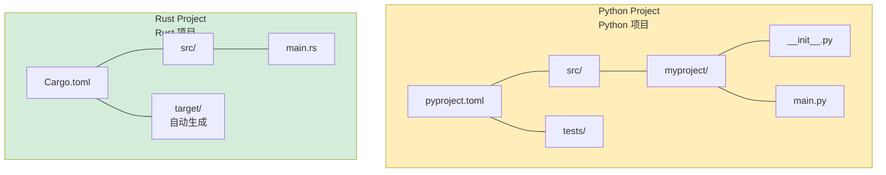

## Installation and Setup<br><span class="zh-inline">安装与环境准备</span>

> **What you'll learn:** How to install Rust and its toolchain, how Cargo compares with pip and Poetry, how to set up an IDE, how the first `Hello, world!` program differs from Python, and which core Rust keywords map to familiar Python ideas.<br><span class="zh-inline">**本章将学习：** 如何安装 Rust 及其工具链，Cargo 和 pip、Poetry 的对应关系，如何配置 IDE，第一段 `Hello, world!` 程序和 Python 有什么差异，以及哪些 Rust 关键字可以映射到熟悉的 Python 概念。</span>
>
> **Difficulty:** 🟢 Beginner<br><span class="zh-inline">**难度：** 🟢 入门</span>

### Installing Rust<br><span class="zh-inline">安装 Rust</span>

```bash
# Install Rust via rustup (Linux/macOS/WSL)
curl --proto '=https' --tlsv1.2 -sSf https://sh.rustup.rs | sh

# Verify installation
rustc --version
cargo --version

# Update Rust
rustup update
```

Rust installation is intentionally simple: `rustup` manages the compiler, standard library, Cargo, and toolchain updates in one place.<br><span class="zh-inline">Rust 的安装流程相对统一，`rustup` 会同时管理编译器、标准库、Cargo 和后续工具链更新，省掉了不少来回折腾环境的麻烦。</span>

### Rust Tools vs Python Tools<br><span class="zh-inline">Rust 工具链与 Python 工具链对照</span>

| Purpose<br><span class="zh-inline">用途</span> | Python | Rust |
|---------|--------|------|
| Language runtime<br><span class="zh-inline">语言运行核心</span> | `python` interpreter | `rustc` compiler |
| Package manager<br><span class="zh-inline">包管理</span> | `pip` / `poetry` / `uv` | `cargo` |
| Project config<br><span class="zh-inline">项目配置</span> | `pyproject.toml` | `Cargo.toml` |
| Lock file<br><span class="zh-inline">锁文件</span> | `poetry.lock` / `requirements.txt` | `Cargo.lock` |
| Virtual env<br><span class="zh-inline">虚拟环境</span> | `venv` / `conda` | Not needed<br><span class="zh-inline">通常不需要</span> |
| Formatter<br><span class="zh-inline">格式化</span> | `black` / `ruff format` | `rustfmt` / `cargo fmt` |
| Linter<br><span class="zh-inline">静态检查</span> | `ruff` / `flake8` / `pylint` | `clippy` / `cargo clippy` |
| Type checker<br><span class="zh-inline">类型检查</span> | `mypy` / `pyright` | Built into compiler<br><span class="zh-inline">编译器内建</span> |
| Test runner<br><span class="zh-inline">测试</span> | `pytest` | `cargo test` |
| Docs<br><span class="zh-inline">文档</span> | `sphinx` / `mkdocs` | `cargo doc` |
| REPL<br><span class="zh-inline">交互式环境</span> | `python` / `ipython` | None<br><span class="zh-inline">没有内建 REPL</span> |

### IDE Setup<br><span class="zh-inline">IDE 配置</span>

**VS Code** (recommended):<br><span class="zh-inline">**VS Code**（推荐入门使用）：</span>

```text
Extensions to install:
- rust-analyzer
- Even Better TOML
- CodeLLDB

# Python equivalent mapping:
# rust-analyzer ≈ Pylance
# cargo clippy  ≈ ruff
```

<span class="zh-inline">
建议安装的扩展：<br>
- `rust-analyzer`：核心中的核心，负责补全、跳转、类型信息等 IDE 能力<br>
- `Even Better TOML`：让 `Cargo.toml` 这类文件的编辑体验正常起来<br>
- `CodeLLDB`：调试支持
<br><br>
如果非要类比：<br>
- `rust-analyzer` 的定位有点像 Python 世界里的 Pylance<br>
- `cargo clippy` 的角色有点像 `ruff`，但它还会兼顾更多正确性检查
</span>

***

## Your First Rust Program<br><span class="zh-inline">第一段 Rust 程序</span>

### Python Hello World<br><span class="zh-inline">Python 版 Hello World</span>

```python
# hello.py — just run it
print("Hello, World!")

# Run:
# python hello.py
```

### Rust Hello World<br><span class="zh-inline">Rust 版 Hello World</span>

```rust
// src/main.rs — must be compiled first
fn main() {
    println!("Hello, World!");   // println! is a macro
}

// Build and run:
// cargo run
```

### Key Differences for Python Developers<br><span class="zh-inline">Python 开发者最先要适应的差别</span>

```text
Python:                              Rust:
─────────                            ─────
- No main() needed                   - fn main() is the entry point
- Indentation = blocks               - Curly braces {} = blocks
- print() is a function              - println!() is a macro
- No semicolons                      - Semicolons end statements
- No type declarations               - Types inferred but always known
- Interpreted (run directly)         - Compiled first
- Errors at runtime                  - Most errors at compile time
```

<span class="zh-inline">
最直观的区别有这几条：<br>
- Python 不要求 `main()`，Rust 由 `fn main()` 作为入口<br>
- Python 用缩进表示代码块，Rust 用花括号<br>
- `print()` 在 Python 里是函数，`println!()` 在 Rust 里是宏，后面的 `!` 很关键<br>
- Python 基本看不到分号，Rust 里分号会结束语句<br>
- Rust 常常能做类型推导，但类型始终是明确存在的<br>
- Python 通常边解释边运行，Rust 先编译再执行<br>
- 很多 Python 运行时问题，会被 Rust 提前到编译期
</span>

### Creating Your First Project<br><span class="zh-inline">创建第一个项目</span>

```bash
# Python                              # Rust
mkdir myproject                        cargo new myproject
cd myproject                           cd myproject
python -m venv .venv                   # No virtual env needed
source .venv/bin/activate              # No activation needed
# Create files manually               # src/main.rs already created
```

```text
# Python project structure:            Rust project structure:
# myproject/                           myproject/
# ├── pyproject.toml                   ├── Cargo.toml
# ├── src/                             ├── src/
# │   └── myproject/                   │   └── main.rs
# │       ├── __init__.py              └── (no __init__.py needed)
# │       └── main.py
# └── tests/
#     └── test_main.py
```



> **Key difference**: Rust project layout is usually simpler. There is no `__init__.py`, no virtual environment activation step, and no split between several competing packaging tools.<br><span class="zh-inline">**关键差异：** Rust 项目结构通常更简单，没有 `__init__.py`，没有虚拟环境激活这一步，也没有多套打包工具并存带来的混乱。</span>

***

## Cargo vs pip/Poetry<br><span class="zh-inline">Cargo 与 pip / Poetry 的对应关系</span>

### Project Configuration<br><span class="zh-inline">项目配置</span>

```toml
# Python — pyproject.toml
[project]
name = "myproject"
version = "0.1.0"
requires-python = ">=3.10"
dependencies = [
    "requests>=2.28",
    "pydantic>=2.0",
]

[project.optional-dependencies]
dev = ["pytest", "ruff", "mypy"]
```

```toml
# Rust — Cargo.toml
[package]
name = "myproject"
version = "0.1.0"
edition = "2021"

[dependencies]
reqwest = "0.12"
serde = { version = "1.0", features = ["derive"] }

[dev-dependencies]
# Test dependencies — only compiled for `cargo test`
```

### Common Cargo Commands<br><span class="zh-inline">常用 Cargo 命令</span>

```bash
# Python equivalent                # Rust
pip install requests               cargo add reqwest
pip install -r requirements.txt    cargo build
pip install -e .                   cargo build
python -m pytest                   cargo test
python -m mypy .                   # Built into compiler
ruff check .                       cargo clippy
ruff format .                      cargo fmt
python main.py                     cargo run
python -c "..."                    # No equivalent

# Rust-specific:
cargo new myproject
cargo build --release
cargo doc --open
cargo update
```

Cargo combines package management, dependency resolution, building, testing, formatting entry points, and documentation into one consistent interface. That unified experience is one of Rust's strongest ergonomic advantages.<br><span class="zh-inline">Cargo 把包管理、依赖解析、构建、测试、格式化入口和文档生成统一到了一个接口里。这种一致性，本身就是 Rust 工具链很大的优势。</span>

***

## Essential Rust Keywords for Python Developers<br><span class="zh-inline">Python 开发者需要先认识的 Rust 关键字</span>

### Variable and Mutability Keywords<br><span class="zh-inline">变量与可变性</span>

```rust
let name = "Alice";
// name = "Bob";             // ❌ immutable by default

let mut count = 0;
count += 1;

const MAX_SIZE: usize = 1024;

static VERSION: &str = "1.0";
```

`let` declares a variable, but it is immutable by default. `mut` is an explicit opt-in to changeability. That single design choice already separates Rust sharply from Python's default-all-mutable feel.<br><span class="zh-inline">`let` 用来声明变量，但默认不可变。`mut` 则是显式打开可变性。这一个设计决定，就已经让 Rust 和 Python “默认都能改”的感觉拉开了很大距离。</span>

### Ownership and Borrowing Keywords<br><span class="zh-inline">所有权与借用</span>

```rust
fn print_name(name: &str) { }

fn append(list: &mut Vec<i32>) { }

let s1 = String::from("hello");
let s2 = s1;
// println!("{}", s1);  // ❌ value moved
```

These concepts have no direct Python equivalent. `&` means borrowing, `&mut` means mutable borrowing, and assignment may move ownership rather than copy a reference.<br><span class="zh-inline">这几样东西在 Python 里都没有完全对应物。`&` 表示借用，`&mut` 表示可变借用，而赋值在 Rust 里可能发生的是所有权转移，不只是“多了一个引用名”。</span>

### Type Definition Keywords<br><span class="zh-inline">类型定义相关关键字</span>

```rust
struct Point {
    x: f64,
    y: f64,
}

enum Shape {
    Circle(f64),
    Rectangle(f64, f64),
}

impl Point {
    fn distance(&self) -> f64 {
        (self.x.powi(2) + self.y.powi(2)).sqrt()
    }
}

trait Drawable {
    fn draw(&self);
}

type UserId = i64;
```

### Control Flow Keywords<br><span class="zh-inline">控制流关键字</span>

```rust
match value {
    1 => println!("one"),
    2 | 3 => println!("two or three"),
    _ => println!("other"),
}

if let Some(x) = optional_value {
    println!("{}", x);
}

loop {
    break;
}

for item in collection.iter() {
    println!("{}", item);
}

while let Some(item) = stack.pop() {
    process(item);
}
```

`match` and `if let` deserve special attention. They make destructuring and branch selection much more central than in everyday Python code.<br><span class="zh-inline">`match` 和 `if let` 尤其值得重点适应。它们让模式匹配和结构拆解在日常代码里出现得远比 Python 更频繁。</span>

### Visibility Keywords<br><span class="zh-inline">可见性关键字</span>

```rust
pub fn greet() { }

pub(crate) fn internal() { }

fn private_helper() { }
```

Python's privacy is mostly by convention. Rust's privacy is enforced by the compiler, and that tends to make module boundaries far more explicit.<br><span class="zh-inline">Python 的“私有”大多靠约定，Rust 的可见性则由编译器强制执行，因此模块边界通常会清楚得多。</span>

---

## Exercises<br><span class="zh-inline">练习</span>

<details>
<summary><strong>🏋️ Exercise: First Rust Program</strong><br><span class="zh-inline"><strong>🏋️ 练习：第一段 Rust 程序</strong></span></summary>

**Challenge**: Create a new Rust project and write a program that declares a name, counts from 1 to 5, prints greeting messages, and then reports whether the final count is even or odd with `match`.<br><span class="zh-inline">**挑战**：新建一个 Rust 项目，声明一个名字变量，用循环把计数加到 5，每次打印问候语，最后再用 `match` 判断计数结果是奇数还是偶数。</span>

<details>
<summary>🔑 Solution<br><span class="zh-inline">🔑 参考答案</span></summary>

```bash
cargo new hello_rust && cd hello_rust
```

```rust
fn main() {
    let name = "Pythonista";
    let mut count = 0u32;

    for _ in 1..=5 {
        count += 1;
        println!("Hello, {name}! (count: {count})");
    }

    let parity = match count % 2 {
        0 => "even",
        _ => "odd",
    };
    println!("Final count {count} is {parity}");
}
```

**Key takeaways**:<br><span class="zh-inline">**核心收获：**</span>
- `let` is immutable by default.<br><span class="zh-inline">`let` 默认不可变。</span>
- `1..=5` is an inclusive range, similar to Python's `range(1, 6)`.<br><span class="zh-inline">`1..=5` 是包含末尾的区间，类似 Python 的 `range(1, 6)`。</span>
- `match` is an expression and can return a value.<br><span class="zh-inline">`match` 是表达式，可以直接产出值。</span>
- There is no `if __name__ == "__main__"` ceremony; `fn main()` is enough.<br><span class="zh-inline">这里没有 `if __name__ == "__main__"` 这层样板，写 `fn main()` 就够了。</span>

</details>
</details>

***
