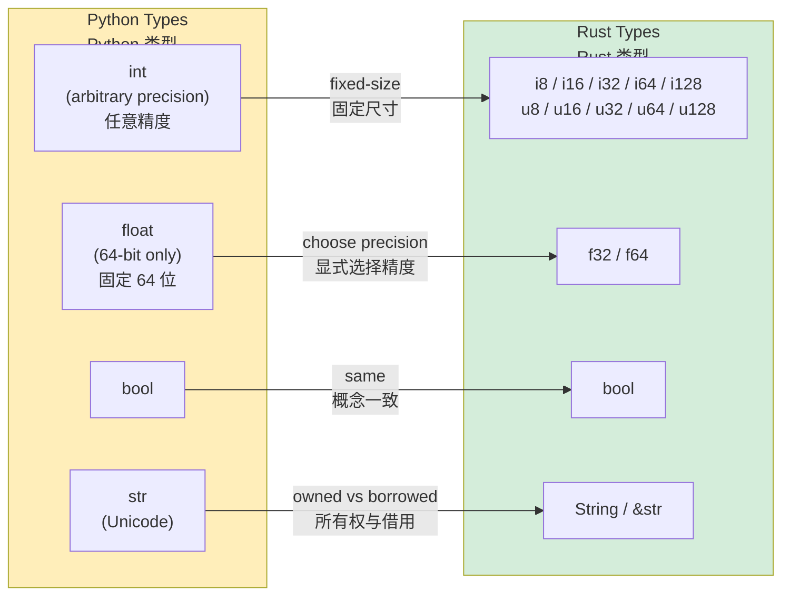

## Variables and Mutability<br><span class="zh-inline">变量与可变性</span>

> **What you'll learn:** Immutable-by-default bindings, explicit `mut`, Rust's primitive numeric types versus Python's arbitrary-precision `int`, the difference between `String` and `&str`, formatting, and when type annotations are required.<br><span class="zh-inline">**本章将学习：** 默认不可变绑定、显式 `mut`、Rust 原生数值类型和 Python 任意精度 `int` 的差异、`String` 与 `&str` 的区别、格式化输出，以及什么时候必须写类型标注。</span>
>
> **Difficulty:** 🟢 Beginner<br><span class="zh-inline">**难度：** 🟢 入门</span>

### Python Variable Declaration<br><span class="zh-inline">Python 的变量声明</span>

```python
# Python — everything is mutable, dynamically typed
count = 0          # Mutable, type inferred as int
count = 5          # ✅ Works
count = "hello"    # ✅ Works — type can change! (dynamic typing)

# "Constants" are just convention:
MAX_SIZE = 1024    # Nothing prevents MAX_SIZE = 999 later
```

### Rust Variable Declaration<br><span class="zh-inline">Rust 的变量声明</span>

```rust
// Rust — immutable by default, statically typed
let count = 0;           // Immutable, type inferred as i32
// count = 5;            // ❌ Compile error: cannot assign twice to immutable variable
// count = "hello";      // ❌ Compile error: expected integer, found &str

let mut count = 0;       // Explicitly mutable
count = 5;               // ✅ Works
// count = "hello";      // ❌ Still can't change type

const MAX_SIZE: usize = 1024; // True constant — enforced by compiler
```

### Key Mental Shift for Python Developers<br><span class="zh-inline">Python 开发者最需要切换的心智</span>

```rust
// Python: variables are labels that point to objects
// Rust: variables are named storage locations that OWN their values

// Variable shadowing — unique to Rust, very useful
let input = "42";              // &str
let input = input.parse::<i32>().unwrap();  // Now it's i32 — new variable, same name
let input = input * 2;         // Now it's 84 — another new variable

// In Python, you'd just reassign and lose the old type:
# input = "42"
# input = int(input)
# But in Rust, each `let` creates a genuinely new binding. The old one is gone.
```

Rust variable shadowing looks a bit like reassignment at first glance, but it is actually a new binding each time. That difference becomes very useful when transforming values step by step without reaching for awkward variable names.<br><span class="zh-inline">Rust 的 shadowing 表面看像重新赋值，其实每次 `let` 都是在创建一个新绑定。这一点在逐步转换数据时特别顺手，不用为了中间态硬造一堆别扭变量名。</span>

### Practical Example: Counter<br><span class="zh-inline">实用例子：计数器</span>

```python
# Python version
class Counter:
    def __init__(self):
        self.value = 0

    def increment(self):
        self.value += 1

    def get_value(self):
        return self.value

c = Counter()
c.increment()
print(c.get_value())  # 1
```

```rust
// Rust version
struct Counter {
    value: i64,
}

impl Counter {
    fn new() -> Self {
        Counter { value: 0 }
    }

    fn increment(&mut self) {     // &mut self = I will modify this
        self.value += 1;
    }

    fn get_value(&self) -> i64 {  // &self = I only read this
        self.value
    }
}

fn main() {
    let mut c = Counter::new();   // Must be `mut` to call increment()
    c.increment();
    println!("{}", c.get_value()); // 1
}
```

> **Key difference**: In Rust, `&mut self` tells both the reader and the compiler that a method mutates state. In Python, a method may mutate almost anything, and whether it does so is only visible after reading the implementation.<br><span class="zh-inline">**关键差异：** Rust 里 `&mut self` 会明确告诉读代码的人和编译器“这个方法会修改状态”。Python 里方法能改什么，很多时候只能靠看具体实现才知道。</span>

***

## Primitive Types Comparison<br><span class="zh-inline">原始类型对照</span>



### Numeric Types<br><span class="zh-inline">数值类型</span>

| Python | Rust | Notes<br><span class="zh-inline">说明</span> |
|--------|------|-------|
| `int` (arbitrary precision) | `i8`、`i16`、`i32`、`i64`、`i128`、`isize` | Fixed-size signed integers<br><span class="zh-inline">固定大小的有符号整数</span> |
| `int` (no unsigned variant) | `u8`、`u16`、`u32`、`u64`、`u128`、`usize` | Explicit unsigned integers<br><span class="zh-inline">显式无符号整数</span> |
| `float` (64-bit IEEE 754) | `f32`、`f64` | Rust can choose precision<br><span class="zh-inline">Rust 可以显式选精度</span> |
| `bool` | `bool` | Same concept<br><span class="zh-inline">概念基本一致</span> |
| `complex` | No built-in<br><span class="zh-inline">标准库无内建</span> | Use `num` crate if needed<br><span class="zh-inline">需要时用 `num` crate</span> |

```python
# Python — one integer type, arbitrary precision
x = 42
big = 2 ** 1000
y = 3.14
```

```rust
// Rust — explicit sizes, overflow is a compile/runtime error
let x: i32 = 42;
let y: f64 = 3.14;
let big: i128 = 2_i128.pow(100); // No arbitrary precision
// For arbitrary precision: use the `num-bigint` crate

let million = 1_000_000;   // Same underscore syntax as Python

let a = 42u8;
let b = 3.14f32;
```

### Size Types (Important!)<br><span class="zh-inline">尺寸相关类型（非常重要）</span>

```rust
// usize and isize — pointer-sized integers, used for indexing
let length: usize = vec![1, 2, 3].len();
let index: usize = 0;

let i: i32 = 5;
// let item = vec[i];    // ❌ Error: expected usize, found i32
let item = vec[i as usize];
```

Python lets `len()` and indexing both live in plain `int`. Rust separates “generic integer math” from “memory-size / indexing” integers much more explicitly.<br><span class="zh-inline">Python 里 `len()` 和下标都统一落在 `int` 上。Rust 则把“普通整数运算”和“跟内存尺寸、索引有关的整数”区分得更明确，所以 `usize` 和 `isize` 这两个类型一定得尽早看顺眼。</span>

### Type Inference<br><span class="zh-inline">类型推导</span>

```rust
let x = 42;          // i32 by default
let y = 3.14;        // f64 by default
let s = "hello";     // &str
let v = vec![1, 2];  // Vec<i32>

let x: i64 = 42;
let y: f32 = 3.14;

let x = 42;
// x = "hello";      // ❌ Type can never change
```

Rust does infer types aggressively, but once inferred the type is fixed for that binding. Inference saves keystrokes; it does not make the language dynamic.<br><span class="zh-inline">Rust 的类型推导很积极，但推导完以后类型就固定了。推导只是省手，不是把语言变成动态类型。</span>

***

## String Types: `String` vs `&str`<br><span class="zh-inline">字符串类型：`String` 与 `&str`</span>

For Python developers, this is usually the first really confusing string-related concept: Python has one dominant string type, Rust has two primary string forms used side by side.<br><span class="zh-inline">对 Python 开发者来说，这往往是最早让人发懵的字符串概念。Python 基本只有一个主力字符串类型，Rust 则并排使用两种核心字符串形态。</span>

### Python String Handling<br><span class="zh-inline">Python 的字符串处理</span>

```python
# Python — one string type, immutable, reference counted
name = "Alice"
greeting = f"Hello, {name}!"
chars = list(name)
upper = name.upper()
```

### Rust String Types<br><span class="zh-inline">Rust 的两种字符串类型</span>

```rust
// Rust has TWO string types:

// 1. &str (string slice) — borrowed, immutable
let name: &str = "Alice";

// 2. String (owned string) — heap-allocated, growable, owned
let mut greeting = String::from("Hello, ");
greeting.push_str(name);
greeting.push('!');
```

### When to Use Which?<br><span class="zh-inline">什么时候用哪一种</span>

```rust
// &str  = borrowed read-only string view
// String = owned growable string

fn greet(name: &str) -> String {
    format!("Hello, {}!", name)
}

let s1 = "world";
let s2 = String::from("Rust");

greet(s1);
greet(&s2);
```

### Practical Examples<br><span class="zh-inline">实际操作对照</span>

```python
name = "alice"
upper = name.upper()
contains = "lic" in name
parts = "a,b,c".split(",")
joined = "-".join(["a", "b", "c"])
stripped = "  hello  ".strip()
replaced = name.replace("a", "A")
```

```rust
let name = "alice";
let upper = name.to_uppercase();           // String — new allocation
let contains = name.contains("lic");       // bool
let parts: Vec<&str> = "a,b,c".split(',').collect();
let joined = ["a", "b", "c"].join("-");
let stripped = "  hello  ".trim();         // &str — no allocation
let replaced = name.replace("a", "A");     // String
```

### Python Developers: Think of it This Way<br><span class="zh-inline">给 Python 开发者的记忆法</span>

```text
Python str     ≈ Rust &str     (read-only view most of the time)
Python str     ≈ Rust String   (when ownership or mutation matters)

Rule of thumb:
- Function parameters → use &str
- Struct fields       → use String
- Return values       → use String
- String literals     → are &str
```

That rule of thumb will get you surprisingly far. It is not mathematically complete, but it is the right default instinct while learning.<br><span class="zh-inline">这套口诀在入门阶段非常够用。它当然不是把所有细节都讲完了，但作为默认直觉基本是对的。</span>

***

## Printing and String Formatting<br><span class="zh-inline">打印与字符串格式化</span>

### Basic Output<br><span class="zh-inline">基础输出</span>

```python
print("Hello, World!")
print("Name:", name, "Age:", age)
print(f"Name: {name}, Age: {age}")
```

```rust
println!("Hello, World!");
println!("Name: {} Age: {}", name, age);
println!("Name: {name}, Age: {age}");
```

### Format Specifiers<br><span class="zh-inline">格式说明符</span>

```python
print(f"{3.14159:.2f}")
print(f"{42:05d}")
print(f"{255:#x}")
print(f"{42:>10}")
print(f"{'left':<10}|")
```

```rust
println!("{:.2}", 3.14159);
println!("{:05}", 42);
println!("{:#x}", 255);
println!("{:>10}", 42);
println!("{:<10}|", "left");
```

### Debug Printing<br><span class="zh-inline">调试输出</span>

```python
print(repr([1, 2, 3]))
from pprint import pprint
pprint({"key": [1, 2, 3]})
```

```rust
println!("{:?}", vec![1, 2, 3]);
println!("{:#?}", vec![1, 2, 3]);

#[derive(Debug)]
struct Point { x: f64, y: f64 }

let p = Point { x: 1.0, y: 2.0 };
println!("{:?}", p);
println!("{p:?}");
```

### Quick Reference<br><span class="zh-inline">速查表</span>

| Python | Rust | Notes<br><span class="zh-inline">说明</span> |
|--------|------|-------|
| `print(x)` | `println!("{}", x)` or `println!("{x}")` | Display format<br><span class="zh-inline">默认展示格式</span> |
| `print(repr(x))` | `println!("{:?}", x)` | Debug format<br><span class="zh-inline">调试格式</span> |
| `f"Hello {name}"` | `format!("Hello {name}")` | Returns `String`<br><span class="zh-inline">返回 `String`</span> |
| `print(x, end="")` | `print!("{x}")` | No newline<br><span class="zh-inline">不换行</span> |
| `print(x, file=sys.stderr)` | `eprintln!("{x}")` | Print to stderr<br><span class="zh-inline">输出到标准错误</span> |
| `sys.stdout.write(s)` | `print!("{s}")` | No newline<br><span class="zh-inline">不自动加换行</span> |

***

## Type Annotations: Optional vs Required<br><span class="zh-inline">类型标注：可选与必须</span>

### Python Type Hints<br><span class="zh-inline">Python 类型提示</span>

```python
def add(a: int, b: int) -> int:
    return a + b

add(1, 2)
add("a", "b")
add(1, "2")

def find(key: str) -> int | None:
    ...

def first(items: list[int]) -> int | None:
    return items[0] if items else None

UserId = int
Mapping = dict[str, list[int]]
```

### Rust Type Declarations<br><span class="zh-inline">Rust 类型声明</span>

```rust
fn add(a: i32, b: i32) -> i32 {
    a + b
}

add(1, 2);
// add("a", "b");  // ❌ Compile error

fn find(key: &str) -> Option<i32> {
    Some(42)
}

fn first(items: &[i32]) -> Option<i32> {
    items.first().copied()
}

type UserId = i64;
type Mapping = HashMap<String, Vec<i32>>;
```

> **Key insight**: In Python, type hints mainly help tools such as IDEs and mypy. In Rust, types are part of the executable contract of the program itself, and the compiler enforces them all the time.<br><span class="zh-inline">**关键理解：** Python 的类型提示主要是给 IDE 和 mypy 之类工具看的；Rust 的类型则是程序契约本身，编译器会一直强制执行。</span>
>
> 📌 **See also**: [Ch. 6 — Enums and Pattern Matching](ch06-enums-and-pattern-matching.md) for how Rust replaces Python's `Union` and many `isinstance()`-style checks.<br><span class="zh-inline">📌 **延伸阅读：** [第 6 章——枚举与模式匹配](ch06-enums-and-pattern-matching.md) 会继续展示 Rust 如何取代 Python 的 `Union` 和许多 `isinstance()` 式分支判断。</span>

---

## Exercises<br><span class="zh-inline">练习</span>

<details>
<summary><strong>🏋️ Exercise: Temperature Converter</strong><br><span class="zh-inline"><strong>🏋️ 练习：温度转换器</strong></span></summary>

**Challenge**: Write a function `celsius_to_fahrenheit(c: f64) -> f64` and a classifier `classify(temp_f: f64) -> &'static str` that returns `"cold"`、`"mild"`、`"hot"` based on thresholds. Then print the results for 0、20、35 degrees Celsius using formatted output.<br><span class="zh-inline">**挑战**：写一个函数 `celsius_to_fahrenheit(c: f64) -> f64`，再写一个分类函数 `classify(temp_f: f64) -> &'static str`，按阈值返回 `"cold"`、`"mild"`、`"hot"`。最后把 0、20、35 摄氏度对应的结果格式化打印出来。</span>

<details>
<summary>🔑 Solution<br><span class="zh-inline">🔑 参考答案</span></summary>

```rust
fn celsius_to_fahrenheit(c: f64) -> f64 {
    c * 9.0 / 5.0 + 32.0
}

fn classify(temp_f: f64) -> &'static str {
    if temp_f < 50.0 { "cold" }
    else if temp_f < 77.0 { "mild" }
    else { "hot" }
}

fn main() {
    for c in [0.0, 20.0, 35.0] {
        let f = celsius_to_fahrenheit(c);
        println!("{c:.1}°C = {f:.1}°F — {}", classify(f));
    }
}
```

**Key takeaway**: Rust requires explicit `f64`, does not do implicit int-to-float conversion for you, iterates arrays directly with `for`, and treats `if/else` as expressions that can return values.<br><span class="zh-inline">**核心收获：** Rust 需要显式 `f64`，不会偷偷替着做整数到浮点数的隐式转换；`for` 可以直接遍历数组；而 `if/else` 本身也是能返回值的表达式。</span>

</details>
</details>

***
