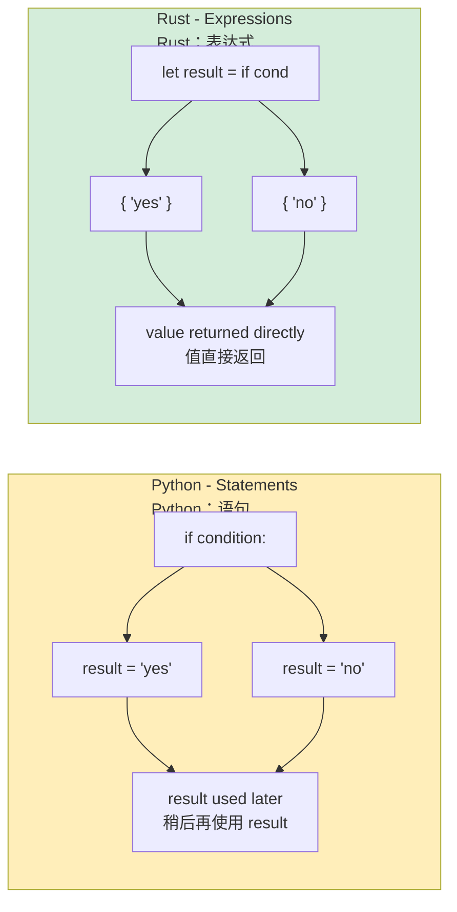

## Conditional Statements<br><span class="zh-inline">条件语句</span>

> **What you'll learn:** `if` / `else` without parentheses but with braces, `loop` / `while` / `for` compared with Python's iteration model, expression blocks where everything can return a value, and function signatures with mandatory return types.<br><span class="zh-inline">**本章将学到什么：** Rust 里的 `if` / `else` 不用括号但必须带花括号，`loop` / `while` / `for` 和 Python 迭代模型的差别，什么叫表达式代码块，以及为什么函数签名里的返回类型必须写清楚。</span>
>
> **Difficulty:** 🟢 Beginner<br><span class="zh-inline">**难度：** 🟢 入门</span>

### if/else<br><span class="zh-inline">`if` / `else`</span>

```python
# Python
if temperature > 100:
    print("Too hot!")
elif temperature < 0:
    print("Too cold!")
else:
    print("Just right")

# Ternary
status = "hot" if temperature > 100 else "ok"
```

```rust
// Rust — braces required, no colons, `else if` not `elif`
if temperature > 100 {
    println!("Too hot!");
} else if temperature < 0 {
    println!("Too cold!");
} else {
    println!("Just right");
}

// if is an EXPRESSION — returns a value
let status = if temperature > 100 { "hot" } else { "ok" };
```

### Important Differences<br><span class="zh-inline">几个重要差别</span>

```rust
// 1. Condition must be a bool — no truthy/falsy
let x = 42;
// if x { }          // Error: expected bool, found integer
if x != 0 { }        // Explicit comparison required

// In Python, these are all truthy/falsy:
// if []:      -> False    (empty list)
// if "":      -> False    (empty string)
// if 0:       -> False    (zero)
// if None:    -> False

// In Rust, ONLY bool works in conditions:
let items: Vec<i32> = vec![];
// if items { }            // Error
if !items.is_empty() { }   // Explicit check

let name = "";
// if name { }              // Error
if !name.is_empty() { }     // Explicit check
```

Rust refuses to guess whether a value should count as “truthy”. That feels stricter at first, but it also kills a whole class of accidental logic bugs.<br><span class="zh-inline">Rust 不会替代码猜“这个值看起来算不算真”。刚开始会觉得它管得真宽，但反过来看，这也顺手消灭了一大类由隐式真值规则引起的逻辑 bug。</span>

***

## Loops and Iteration<br><span class="zh-inline">循环与迭代</span>

### for Loops<br><span class="zh-inline">`for` 循环</span>

```python
# Python
for i in range(5):
    print(i)

for item in ["a", "b", "c"]:
    print(item)

for i, item in enumerate(["a", "b", "c"]):
    print(f"{i}: {item}")

for key, value in {"x": 1, "y": 2}.items():
    print(f"{key} = {value}")
```

```rust
// Rust
for i in 0..5 {                           // range(5) -> 0..5
    println!("{}", i);
}

for item in ["a", "b", "c"] {             // direct iteration
    println!("{}", item);
}

for (i, item) in ["a", "b", "c"].iter().enumerate() {  // enumerate()
    println!("{}: {}", i, item);
}

// HashMap iteration
use std::collections::HashMap;
let map = HashMap::from([("x", 1), ("y", 2)]);
for (key, value) in &map {                // & borrows the map
    println!("{} = {}", key, value);
}
```

### Range Syntax<br><span class="zh-inline">区间语法</span>

| Python | Rust | Notes<br><span class="zh-inline">说明</span> |
|---|---|---|
| `range(5)` | `0..5` | Half-open (excludes end)<br><span class="zh-inline">左闭右开，不包含结束值</span> |
| `range(1, 10)` | `1..10` | Half-open<br><span class="zh-inline">左闭右开</span> |
| `range(1, 11)` | `1..=10` | Inclusive (includes end)<br><span class="zh-inline">闭区间，包含结束值</span> |
| `range(0, 10, 2)` | `(0..10).step_by(2)` | Step is a method, not syntax<br><span class="zh-inline">步长是方法，不是语法关键字</span> |

### while Loops<br><span class="zh-inline">`while` 循环</span>

```python
# Python
count = 0
while count < 5:
    print(count)
    count += 1

# Infinite loop
while True:
    data = get_input()
    if data == "quit":
        break
```

```rust
// Rust
let mut count = 0;
while count < 5 {
    println!("{}", count);
    count += 1;
}

// Infinite loop — use `loop`, not `while true`
loop {
    let data = get_input();
    if data == "quit" {
        break;
    }
}

// loop can return a value
let result = loop {
    let input = get_input();
    if let Ok(num) = input.parse::<i32>() {
        break num;  // break with a value
    }
    println!("Not a number, try again");
};
```

### List Comprehensions vs Iterator Chains<br><span class="zh-inline">列表推导式与迭代器链</span>

```python
# Python — list comprehensions
squares = [x ** 2 for x in range(10)]
evens = [x for x in range(20) if x % 2 == 0]
pairs = [(x, y) for x in range(3) for y in range(3)]
```

```rust
// Rust — iterator chains (.map, .filter, .collect)
let squares: Vec<i32> = (0..10).map(|x| x * x).collect();
let evens: Vec<i32> = (0..20).filter(|x| x % 2 == 0).collect();
let pairs: Vec<(i32, i32)> = (0..3)
    .flat_map(|x| (0..3).map(move |y| (x, y)))
    .collect();

// These are LAZY — nothing runs until .collect()
// Python comprehensions are eager
// Rust iterators can be more efficient on large data
```

Python's comprehension syntax is concise and eager. Rust's iterator chains are more explicit, but the laziness means the optimizer has much more room to fuse operations and avoid temporary allocations.<br><span class="zh-inline">Python 的推导式写起来很紧凑，而且默认是立即执行的。Rust 的迭代器链会显得更啰嗦一些，但它的惰性求值给了优化器更大空间，很多操作可以被融合起来，临时分配也更容易省掉。</span>

***

## Expression Blocks<br><span class="zh-inline">表达式代码块</span>

Everything in Rust is an expression, or at least very close to one. That is a big shift from Python, where `if` and `for` are mostly statements.<br><span class="zh-inline">Rust 最大的语感差别之一，就是几乎什么都想做成表达式。和 Python 里 `if`、`for` 主要还是语句不同，这一套一开始挺容易把人绕晕。</span>

```python
# Python — if is a statement (except ternary)
if condition:
    result = "yes"
else:
    result = "no"

# Or ternary (limited to one expression)
result = "yes" if condition else "no"
```

```rust
// Rust — if is an expression (returns a value)
let result = if condition { "yes" } else { "no" };

// Blocks are expressions — the last line without semicolon is the value
let value = {
    let x = 5;
    let y = 10;
    x + y    // No semicolon -> value of the block
};

// match is an expression too
let description = match temperature {
    t if t > 100 => "boiling",
    t if t > 50 => "hot",
    t if t > 20 => "warm",
    _ => "cold",
};
```

The following diagram shows the conceptual difference between Python's statement-based control flow and Rust's expression-based style:<br><span class="zh-inline">下面这张图把 Python 的“语句式控制流”和 Rust 的“表达式式控制流”对比了一下：</span>



> **The semicolon rule:** In Rust, the last expression in a block without a semicolon becomes the block's return value. Once a semicolon is added, it becomes a statement and the block yields `()`. This trips up Python developers constantly at the beginning.<br><span class="zh-inline">**分号规则：** 在 Rust 里，代码块最后一个没有分号的表达式会成为整个代码块的返回值；一旦补上分号，它就变成语句，整个块返回 `()`。这条规则刚开始特别容易绊 Python 开发者一脚。</span>

***

## Functions and Type Signatures<br><span class="zh-inline">函数与类型签名</span>

### Python Functions<br><span class="zh-inline">Python 函数</span>

```python
# Python — types optional, dynamic dispatch
def greet(name: str, greeting: str = "Hello") -> str:
    return f"{greeting}, {name}!"

# Default args, *args, **kwargs
def flexible(*args, **kwargs):
    pass

# First-class functions
def apply(f, x):
    return f(x)

result = apply(lambda x: x * 2, 5)  # 10
```

### Rust Functions<br><span class="zh-inline">Rust 函数</span>

```rust
// Rust — types REQUIRED on function signatures, no defaults
fn greet(name: &str, greeting: &str) -> String {
    format!("{}, {}!", greeting, name)
}

// No default arguments — use builder pattern or Option
fn greet_with_default(name: &str, greeting: Option<&str>) -> String {
    let greeting = greeting.unwrap_or("Hello");
    format!("{}, {}!", greeting, name)
}

// No *args/**kwargs — use slices or structs
fn sum_all(numbers: &[i32]) -> i32 {
    numbers.iter().sum()
}

// First-class functions and closures
fn apply(f: fn(i32) -> i32, x: i32) -> i32 {
    f(x)
}

let result = apply(|x| x * 2, 5);  // 10
```

### Return Values<br><span class="zh-inline">返回值</span>

```python
# Python — return is explicit, None is implicit
def divide(a, b):
    if b == 0:
        return None  # Or raise an exception
    return a / b
```

```rust
// Rust — last expression is the return value
fn divide(a: f64, b: f64) -> Option<f64> {
    if b == 0.0 {
        None
    } else {
        Some(a / b)
    }
}
```

### Multiple Return Values<br><span class="zh-inline">多个返回值</span>

```python
# Python — return a tuple
def min_max(numbers):
    return min(numbers), max(numbers)

lo, hi = min_max([3, 1, 4, 1, 5])
```

```rust
// Rust — return a tuple too
fn min_max(numbers: &[i32]) -> (i32, i32) {
    let min = *numbers.iter().min().unwrap();
    let max = *numbers.iter().max().unwrap();
    (min, max)
}

let (lo, hi) = min_max(&[3, 1, 4, 1, 5]);
```

### Methods: `self` vs `&self` vs `&mut self`<br><span class="zh-inline">方法接收者：`self`、`&self` 与 `&mut self`</span>

```rust
// In Python, `self` is always a mutable reference to the object.
// In Rust, you choose the ownership mode explicitly.

impl MyStruct {
    fn new() -> Self { ... }                // no self — "static method"
    fn read_only(&self) { ... }             // &self — immutable borrow
    fn modify(&mut self) { ... }            // &mut self — mutable borrow
    fn consume(self) { ... }                // self — takes ownership
}

// Python equivalent:
// class MyStruct:
//     @classmethod
//     def new(cls): ...
//     def read_only(self): ...
//     def modify(self): ...
//     def consume(self): ...
```

Rust forces the method signature to declare whether the method only reads, mutates, or consumes the instance. Python keeps all of that implicit, which is more flexible but also much easier to misuse.<br><span class="zh-inline">Rust 会在方法签名里明确写出这个方法到底只是读取、会修改，还是会直接吃掉对象本身。Python 把这些都放在隐式约定里，灵活是灵活，但也更容易把对象状态玩坏。</span>

---

## Exercises<br><span class="zh-inline">练习</span>

<details>
<summary><strong>🏋️ Exercise: FizzBuzz with Expressions</strong> <span class="zh-inline">🏋️ 练习：用表达式写 FizzBuzz</span></summary>

**Challenge**: Write FizzBuzz for `1..=30` using Rust's expression-based `match`. Each number should print `"Fizz"`、`"Buzz"`、`"FizzBuzz"` or the number itself. Use `match (n % 3, n % 5)` as the controlling expression.<br><span class="zh-inline">**挑战题：** 用 Rust 的表达式式 `match` 为 `1..=30` 写一个 FizzBuzz。每个数字要输出 `"Fizz"`、`"Buzz"`、`"FizzBuzz"` 或数字本身。要求用 `match (n % 3, n % 5)` 作为匹配表达式。</span>

<details>
<summary>🔑 Solution <span class="zh-inline">🔑 参考答案</span></summary>

```rust
fn main() {
    for n in 1..=30 {
        let result = match (n % 3, n % 5) {
            (0, 0) => String::from("FizzBuzz"),
            (0, _) => String::from("Fizz"),
            (_, 0) => String::from("Buzz"),
            _ => n.to_string(),
        };
        println!("{result}");
    }
}
```

**Key takeaway**: `match` is an expression that returns a value, so there is no need to write a long `if` / `elif` / `else` chain. The `_` wildcard plays the role of Python's default branch.<br><span class="zh-inline">**要点：** `match` 本身就是返回值的表达式，所以根本不需要拖一长串 `if` / `elif` / `else`。其中 `_` 通配符就相当于 Python 里的默认分支。</span>

</details>
</details>

***
