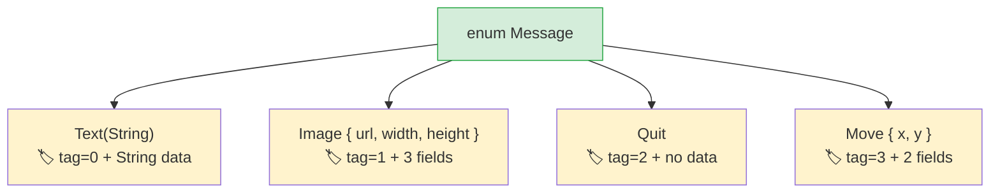

## Algebraic Data Types vs Union Types<br><span class="zh-inline">代数数据类型与 Union 类型</span>

> **What you'll learn:** Rust enums with data vs Python `Union` types, exhaustive `match` vs `match/case`, `Option<T>` as a compile-time replacement for `None`, and guard patterns.<br><span class="zh-inline">**本章将学到什么：** Rust 里携带数据的 enum 和 Python `Union` 类型的差别，穷尽式 `match` 和 Python `match/case` 的区别，`Option<T>` 如何在编译期替代 `None`，以及 guard 模式的写法。</span>
>
> **Difficulty:** 🟡 Intermediate<br><span class="zh-inline">**难度：** 🟡 进阶</span>

Python 3.10 introduced `match` statements and type unions. Rust's enums go further — each variant can carry different data, and the compiler ensures you handle every case.<br><span class="zh-inline">Python 3.10 引入了 `match` 语句和类型联合。Rust 的 enum 走得更远，每个变体都能携带不同数据，而且编译器会强制确保每一种情况都被处理到。</span>

### Python Union Types and Match<br><span class="zh-inline">Python 的 Union 类型与 Match</span>

```python
# Python 3.10+ — structural pattern matching
from typing import Union
from dataclasses import dataclass

@dataclass
class Circle:
    radius: float

@dataclass
class Rectangle:
    width: float
    height: float

@dataclass
class Triangle:
    base: float
    height: float

Shape = Union[Circle, Rectangle, Triangle]  # Type alias

def area(shape: Shape) -> float:
    match shape:
        case Circle(radius=r):
            return 3.14159 * r * r
        case Rectangle(width=w, height=h):
            return w * h
        case Triangle(base=b, height=h):
            return 0.5 * b * h
        # No compiler warning if you miss a case!
        # Adding a new shape? grep the codebase and hope you find all match blocks.
```

### Rust Enums — Data-Carrying Variants<br><span class="zh-inline">Rust 的枚举：携带数据的变体</span>

```rust
// Rust — enum variants carry data, compiler enforces exhaustive matching
enum Shape {
    Circle(f64),                // Circle carries radius
    Rectangle(f64, f64),        // Rectangle carries width, height
    Triangle { base: f64, height: f64 }, // Named fields also work
}

fn area(shape: &Shape) -> f64 {
    match shape {
        Shape::Circle(r) => std::f64::consts::PI * r * r,
        Shape::Rectangle(w, h) => w * h,
        Shape::Triangle { base, height } => 0.5 * base * height,
        // ❌ If you add Shape::Pentagon and forget to handle it here,
        //    the compiler refuses to build. No grep needed.
    }
}
```

> **Key insight**: Rust's `match` is **exhaustive** — the compiler verifies you handle every variant. Add a new variant to an enum and the compiler tells you exactly which `match` blocks need updating. Python's `match` has no such guarantee.<br><span class="zh-inline">**关键认识**：Rust 的 `match` 是 **穷尽式** 的，编译器会验证每个变体都被处理到。给枚举新增一个变体之后，编译器会准确指出哪些 `match` 代码块要补。Python 的 `match` 没有这层保证。</span>

### Enums Replace Multiple Python Patterns<br><span class="zh-inline">Enum 可以替代好几种 Python 写法</span>

```python
# Python — several patterns that Rust enums replace:

# 1. String constants
STATUS_PENDING = "pending"
STATUS_ACTIVE = "active"
STATUS_CLOSED = "closed"

# 2. Python Enum (no data)
from enum import Enum
class Status(Enum):
    PENDING = "pending"
    ACTIVE = "active"
    CLOSED = "closed"

# 3. Tagged unions (class + type field)
class Message:
    def __init__(self, kind, **data):
        self.kind = kind
        self.data = data
# Message(kind="text", content="hello")
# Message(kind="image", url="...", width=100)
```

```rust
// Rust — one enum does all three and more

// 1. Simple enum (like Python's Enum)
enum Status {
    Pending,
    Active,
    Closed,
}

// 2. Data-carrying enum (tagged union — type-safe!)
enum Message {
    Text(String),
    Image { url: String, width: u32, height: u32 },
    Quit,                    // No data
    Move { x: i32, y: i32 },
}
```



> **Memory insight**: Rust enums are "tagged unions" — the compiler stores a discriminant tag + enough space for the largest variant. Python's equivalent (`Union[str, dict, None]`) has no compact representation.<br><span class="zh-inline">**内存层面的认识**：Rust 的 enum 本质上是“带标签的联合体”，编译器会保存一个判别标签，再加上足够容纳最大变体的数据空间。Python 那种 `Union[str, dict, None]` 并没有这种紧凑的底层表示。</span>
>
> 📌 **See also**: [Ch. 9 — Error Handling](ch09-error-handling.md) uses enums extensively — `Result<T, E>` and `Option<T>` are just enums with `match`.<br><span class="zh-inline">📌 **延伸阅读**：[第 9 章：错误处理](ch09-error-handling.md) 会大量用到 enum，因为 `Result<T, E>` 和 `Option<T>` 本质上也只是可以被 `match` 的枚举。</span>

```rust
fn process(msg: &Message) {
    match msg {
        Message::Text(content) => println!("Text: {content}"),
        Message::Image { url, width, height } => {
            println!("Image: {url} ({width}x{height})")
        }
        Message::Quit => println!("Quitting"),
        Message::Move { x, y } => println!("Moving to ({x}, {y})"),
    }
}
```

***

## Exhaustive Pattern Matching<br><span class="zh-inline">穷尽式模式匹配</span>

### Python's match — Not Exhaustive<br><span class="zh-inline">Python 的 match：不是穷尽式的</span>

```python
# Python — the wildcard case is optional, no compiler help
def describe(value):
    match value:
        case 0:
            return "zero"
        case 1:
            return "one"
        # If you forget the default, Python returns None silently.
        # No warning, no error.

describe(42)  # Returns None — a silent bug
```

### Rust's match — Compiler-Enforced<br><span class="zh-inline">Rust 的 match：由编译器强制检查</span>

```rust
// Rust — MUST handle every possible case
fn describe(value: i32) -> &'static str {
    match value {
        0 => "zero",
        1 => "one",
        // ❌ Compile error: non-exhaustive patterns: `i32::MIN..=-1_i32`
        //    and `2_i32..=i32::MAX` not covered
        _ => "other",   // _ = catch-all (required for open-ended types)
    }
}

// For enums, NO catch-all needed — compiler knows all variants:
enum Color { Red, Green, Blue }

fn color_hex(c: Color) -> &'static str {
    match c {
        Color::Red => "#ff0000",
        Color::Green => "#00ff00",
        Color::Blue => "#0000ff",
        // No _ needed — all variants covered
        // Add Color::Yellow later → compiler error HERE
    }
}
```

### Pattern Matching Features<br><span class="zh-inline">模式匹配的常用能力</span>

```rust
// Multiple values (like Python's case 1 | 2 | 3:)
match value {
    1 | 2 | 3 => println!("small"),
    4..=9 => println!("medium"),    // Range patterns
    _ => println!("large"),
}

// Guards (like Python's case x if x > 0:)
match temperature {
    t if t > 100 => println!("boiling"),
    t if t < 0 => println!("freezing"),
    t => println!("normal: {t}°"),
}

// Nested destructuring
let point = (3, (4, 5));
match point {
    (0, _) => println!("on y-axis"),
    (_, (0, _)) => println!("y=0"),
    (x, (y, z)) => println!("x={x}, y={y}, z={z}"),
}
```

***

## Option for None Safety<br><span class="zh-inline">用 Option 取代 None 带来的不确定性</span>

`Option<T>` is the most important Rust enum for Python developers. It replaces `None` with a type-safe alternative.<br><span class="zh-inline">对 Python 开发者来说，`Option<T>` 是最重要的 Rust 枚举之一。它用一种类型安全的方式替代了 `None`。</span>

### Python None<br><span class="zh-inline">Python 里的 None</span>

```python
# Python — None is a value that can appear anywhere
def find_user(user_id: int) -> dict | None:
    users = {1: {"name": "Alice"}}
    return users.get(user_id)

user = find_user(999)
# user is None — but nothing forces you to check!
print(user["name"])  # 💥 TypeError at runtime
```

### Rust Option<br><span class="zh-inline">Rust 里的 Option</span>

```rust
// Rust — Option<T> forces you to handle the None case
fn find_user(user_id: i64) -> Option<User> {
    let users = HashMap::from([(1, User { name: "Alice".into() })]);
    users.get(&user_id).cloned()
}

let user = find_user(999);
// user is Option<User> — you CANNOT use it without handling None

// Method 1: match
match find_user(999) {
    Some(user) => println!("Found: {}", user.name),
    None => println!("Not found"),
}

// Method 2: if let (like Python's if (x := expr) is not None)
if let Some(user) = find_user(1) {
    println!("Found: {}", user.name);
}

// Method 3: unwrap_or
let name = find_user(999)
    .map(|u| u.name)
    .unwrap_or_else(|| "Unknown".to_string());

// Method 4: ? operator (in functions that return Option)
fn get_user_name(id: i64) -> Option<String> {
    let user = find_user(id)?;     // Returns None early if not found
    Some(user.name)
}
```

### Option Methods — Python Equivalents<br><span class="zh-inline">Option 常用方法与 Python 写法对照</span>

| Pattern | Python | Rust |
|---------|--------|------|
| Check if exists<br><span class="zh-inline">判断值是否存在</span> | `if x is not None:`<br><span class="zh-inline">`if x is not None:`</span> | `if let Some(x) = opt {`<br><span class="zh-inline">`if let Some(x) = opt {`</span> |
| Default value<br><span class="zh-inline">默认值</span> | `x or default`<br><span class="zh-inline">`x or default`</span> | `opt.unwrap_or(default)`<br><span class="zh-inline">`opt.unwrap_or(default)`</span> |
| Default factory<br><span class="zh-inline">默认值工厂</span> | `x or compute()`<br><span class="zh-inline">`x or compute()`</span> | `opt.unwrap_or_else(\|\| compute())`<br><span class="zh-inline">`opt.unwrap_or_else(\|\| compute())`</span> |
| Transform if exists<br><span class="zh-inline">存在时再变换</span> | `f(x) if x else None`<br><span class="zh-inline">`f(x) if x else None`</span> | `opt.map(f)`<br><span class="zh-inline">`opt.map(f)`</span> |
| Chain lookups<br><span class="zh-inline">链式查找</span> | `x and x.attr and x.attr.method()`<br><span class="zh-inline">`x and x.attr and x.attr.method()`</span> | `opt.and_then(\|x\| x.method())`<br><span class="zh-inline">`opt.and_then(\|x\| x.method())`</span> |
| Crash if None<br><span class="zh-inline">遇到空值直接崩</span> | Not possible to prevent<br><span class="zh-inline">语言层面没法阻止</span> | `opt.unwrap()` (panic) or `opt.expect("msg")`<br><span class="zh-inline">`opt.unwrap()` 或 `opt.expect("msg")`</span> |
| Get or raise<br><span class="zh-inline">取值，否则报错</span> | `x if x else raise`<br><span class="zh-inline">`x if x else raise`</span> | `opt.ok_or(Error)?`<br><span class="zh-inline">`opt.ok_or(Error)?`</span> |

---

## Exercises<br><span class="zh-inline">练习</span>

<details>
<summary><strong>🏋️ Exercise: Shape Area Calculator</strong> <span class="zh-inline">🏋️ 练习：图形面积计算器</span></summary>

**Challenge**: Define an enum `Shape` with variants `Circle(f64)` (radius), `Rectangle(f64, f64)` (width, height), and `Triangle(f64, f64)` (base, height). Implement a method `fn area(&self) -> f64` using `match`. Create one of each and print the area.<br><span class="zh-inline">**挑战题**：定义一个枚举 `Shape`，它包含 `Circle(f64)` 表示半径、`Rectangle(f64, f64)` 表示宽高、以及 `Triangle(f64, f64)` 表示底和高。用 `match` 实现 `fn area(&self) -> f64`，然后分别创建三种图形并打印面积。</span>

<details>
<summary>🔑 Solution <span class="zh-inline">🔑 参考答案</span></summary>

```rust
use std::f64::consts::PI;

enum Shape {
    Circle(f64),
    Rectangle(f64, f64),
    Triangle(f64, f64),
}

impl Shape {
    fn area(&self) -> f64 {
        match self {
            Shape::Circle(r) => PI * r * r,
            Shape::Rectangle(w, h) => w * h,
            Shape::Triangle(b, h) => 0.5 * b * h,
        }
    }
}

fn main() {
    let shapes = [
        Shape::Circle(5.0),
        Shape::Rectangle(4.0, 6.0),
        Shape::Triangle(3.0, 8.0),
    ];
    for shape in &shapes {
        println!("Area: {:.2}", shape.area());
    }
}
```

**Key takeaway**: Rust enums replace Python's `Union[Circle, Rectangle, Triangle]` + `isinstance()` checks. The compiler ensures you handle every variant — adding a new shape without updating `area()` is a compile error.<br><span class="zh-inline">**关键结论**：Rust 的 enum 可以直接替代 Python 里 `Union[Circle, Rectangle, Triangle]` 加上 `isinstance()` 判断的组合。编译器会确保每个变体都被处理到，如果新增了一种图形却没更新 `area()`，会直接编译失败。</span>

</details>
</details>

***
