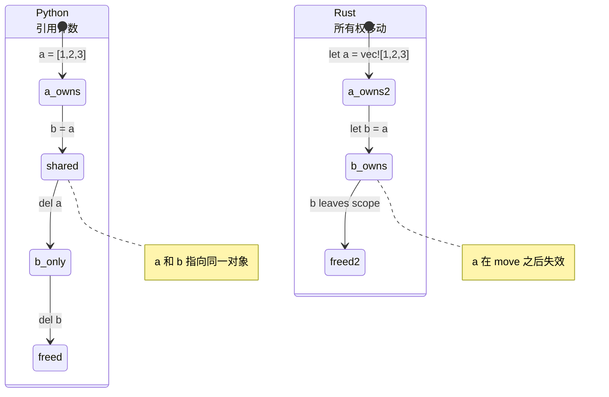
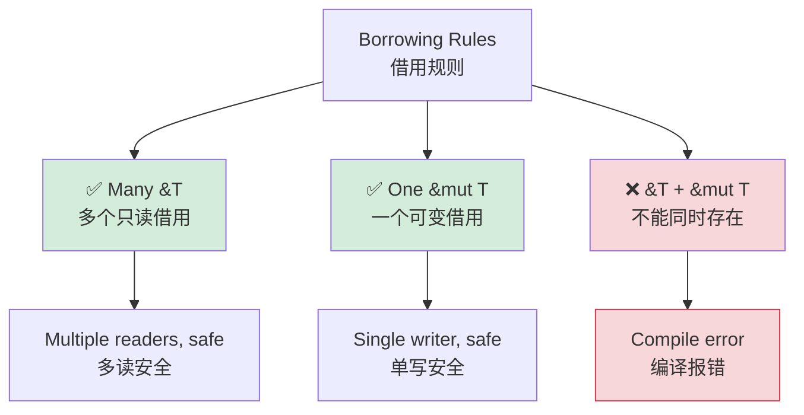

## Understanding Ownership<br><span class="zh-inline">理解所有权</span>

> **What you'll learn:** Why Rust has ownership, how move semantics differ from Python's reference counting, how borrowing with `&` and `&mut` works, the basics of lifetimes, and when smart pointers such as `Box`、`Rc`、`Arc` become useful.<br><span class="zh-inline">**本章将学习：** Rust 为什么需要所有权，移动语义和 Python 引用计数有什么根本区别，`&` 与 `&mut` 的借用规则，生命周期基础，以及 `Box`、`Rc`、`Arc` 等智能指针在什么场景下有用。</span>
>
> **Difficulty:** 🟡 Intermediate<br><span class="zh-inline">**难度：** 🟡 进阶</span>

This is often the hardest concept for Python developers. Python developers rarely think about who owns a value because the runtime and garbage collector handle cleanup. Rust gives each value exactly one owner and checks that ownership statically at compile time.<br><span class="zh-inline">这通常是 Python 开发者最难迈过去的一道坎。Python 里几乎不用思考“这份数据到底归谁管”，因为运行时和垃圾回收会兜底；Rust 则要求每个值始终有且只有一个所有者，并且在编译期把这件事检查清楚。</span>

### Python: Shared References Everywhere<br><span class="zh-inline">Python：到处都是共享引用</span>

```python
# Python — everything is a reference, gc cleans up
a = [1, 2, 3]
b = a
b.append(4)
print(a)            # [1, 2, 3, 4] — surprise! a changed too
```

Both `a` and `b` point to the same list. Python's runtime keeps a reference count and eventually frees the object when no references remain. Most of the time, that behavior feels convenient, but aliasing bugs can slip in quietly.<br><span class="zh-inline">这里 `a` 和 `b` 指向的是同一份列表对象。Python 运行时会维护引用计数，等引用都没了再回收对象。日常写脚本时这种体验很省心，但别名共享带来的副作用 bug 也很容易悄悄混进来。</span>

### Rust: Single Ownership<br><span class="zh-inline">Rust：单一所有权</span>

```rust
let a = vec![1, 2, 3];
let b = a;
// println!("{:?}", a); // ❌ value used after move

println!("{:?}", b);
```

After `let b = a;`, ownership moves from `a` to `b`. The old binding becomes invalid. When `b` leaves scope, the vector is destroyed deterministically without a garbage collector.<br><span class="zh-inline">执行 `let b = a;` 之后，所有权从 `a` 移动到 `b`，旧绑定立刻失效。等 `b` 离开作用域，这个向量就会被确定性地释放，不需要垃圾回收参与。</span>

### The Three Ownership Rules<br><span class="zh-inline">所有权三条基本规则</span>

```text
1. Each value has exactly one owner.
2. When the owner goes out of scope, the value is dropped.
3. Ownership can move, but it does not duplicate automatically.
```

<span class="zh-inline">
1. 每个值在同一时刻只有一个所有者。<br>
2. 所有者离开作用域时，值就会被释放。<br>
3. 所有权可以转移，但不会自动复制。
</span>

### Move Semantics — The Biggest Python Shock<br><span class="zh-inline">移动语义：最容易把 Python 思维撞碎的地方</span>

```python
def process(data):
    data.append(42)

my_list = [1, 2, 3]
process(my_list)
print(my_list)       # [1, 2, 3, 42]
```

```rust
fn process(mut data: Vec<i32>) -> Vec<i32> {
    data.push(42);
    data
}

let my_vec = vec![1, 2, 3];
let my_vec = process(my_vec);
println!("{:?}", my_vec);

fn process_borrowed(data: &mut Vec<i32>) {
    data.push(42);
}

let mut my_vec = vec![1, 2, 3];
process_borrowed(&mut my_vec);
println!("{:?}", my_vec);
```

Passing a `Vec<i32>` by value transfers ownership. Passing `&mut Vec<i32>` lends temporary mutable access instead. That distinction is the core of Rust API design.<br><span class="zh-inline">按值传入 `Vec&lt;i32&gt;` 会把所有权一起交出去；传 `&mut Vec&lt;i32&gt;` 则只是暂时借出可变访问权。Rust 的 API 设计很多时候就是围着这个区别展开的。</span>

### Ownership Visualized<br><span class="zh-inline">把所有权画出来看</span>

```text
Python:                              Rust:

  a ──────┐                           a ──→ [1, 2, 3]
           ├──→ [1, 2, 3]
  b ──────┘                           After: let b = a;

  (a and b share one object)          a  (invalid, moved)
  (refcount = 2)                      b ──→ [1, 2, 3]
                                      (only b owns the data)

  del a → refcount = 1                drop(b) → data freed
  del b → refcount = 0 → freed        (deterministic, no GC)
```



***

## Move Semantics vs Reference Counting<br><span class="zh-inline">移动语义与引用计数</span>

### Copy vs Move<br><span class="zh-inline">Copy 与 Move</span>

```rust
let x = 42;
let y = x;
println!("{x} {y}");

let s1 = String::from("hello");
let s2 = s1;
// println!("{s1}");  // ❌ moved

let s1 = String::from("hello");
let s2 = s1.clone();
println!("{s1} {s2}");
```

Primitive scalar types are usually `Copy`; heap-owning types such as `String` and `Vec` are moved. If a deep copy is truly wanted, it must be requested explicitly with `.clone()`.<br><span class="zh-inline">标量基础类型通常实现了 `Copy`；像 `String`、`Vec` 这类拥有堆数据的类型则默认发生 move。如果确实想要深拷贝，就得显式写出 `.clone()`。</span>

### Python Developer's Mental Model<br><span class="zh-inline">给 Python 开发者的心智对照</span>

```text
Python:                    Rust:
─────────                  ─────
int, float, bool           Copy types
list, dict, str            Move types with ownership
shared references          explicit borrowing
gc cleanup                 deterministic drop
deepcopy / list(x)         clone()
```

### When Python's Sharing Model Causes Bugs<br><span class="zh-inline">Python 共享模型什么时候容易埋雷</span>

```python
def remove_duplicates(items):
    seen = set()
    result = []
    for item in items:
        if item not in seen:
            seen.add(item)
            result.append(item)
    return result

original = [1, 2, 2, 3, 3, 3]
alias = original
unique = remove_duplicates(alias)
```

```rust
use std::collections::HashSet;

fn remove_duplicates(items: &[i32]) -> Vec<i32> {
    let mut seen = HashSet::new();
    items.iter()
        .filter(|&&item| seen.insert(item))
        .copied()
        .collect()
}

let original = vec![1, 2, 2, 3, 3, 3];
let unique = remove_duplicates(&original);
```

Borrowing the slice `&[i32]` guarantees the function cannot mutate the input collection. That sort of guarantee is usually only informal in Python code review, but in Rust it is enforced by the type signature itself.<br><span class="zh-inline">函数参数写成 `&[i32]` 之后，就已经保证了函数体不能修改原始集合。这个保证在 Python 里往往只是“代码审查时大家心里有数”，而在 Rust 里是函数签名本身强制表达出来的。</span>

***

## Borrowing and Lifetimes<br><span class="zh-inline">借用与生命周期</span>

### Borrowing = Lending a Book<br><span class="zh-inline">把借用想成借书</span>

```text
Python:  Everyone has a photocopy
Rust:    One person owns the book.
         - &book     = many people can read
         - &mut book = one person can edit
         - book      = hand ownership away
```

Borrowing lets a value stay owned by one place while other code temporarily accesses it. This is how Rust avoids both constant cloning and accidental aliasing bugs.<br><span class="zh-inline">借用的意义在于：值仍然由一个地方持有，但其他代码可以临时访问它。这样既避免了处处克隆，又挡住了共享别名带来的副作用问题。</span>

### Borrowing Rules<br><span class="zh-inline">借用规则</span>



```rust
let mut data = vec![1, 2, 3];

let a = &data;
let b = &data;
println!("{:?} {:?}", a, b);

let c = &mut data;
c.push(4);
// println!("{:?}", a);  // ❌ immutable borrow still alive
```

Rust allows many immutable borrows or one mutable borrow, but never both at the same time. That rule eliminates data races and “modify while iterating” bugs before the program ever runs.<br><span class="zh-inline">Rust 允许同时存在很多个不可变借用，或者存在一个可变借用，但绝不会让两种情况重叠。正是这条规则，让数据竞争和“遍历时修改集合”这类问题直接死在编译期。</span>

### Lifetimes — A Brief Introduction<br><span class="zh-inline">生命周期：先抓住最小概念</span>

```rust
fn first_word(s: &str) -> &str {
    s.split_whitespace().next().unwrap_or("")
}

fn longest<'a>(a: &'a str, b: &'a str) -> &'a str {
    if a.len() > b.len() { a } else { b }
}
```

Lifetimes answer one question: how long is a reference guaranteed to stay valid? Most of the time the compiler infers the answer automatically. Explicit lifetime annotations only appear when the relationships become ambiguous.<br><span class="zh-inline">生命周期本质上只在回答一个问题：这个引用到底能保证活多久。大多数情况下编译器会自动推导，只有当引用之间的关系变复杂、推导不出来时，才需要手写生命周期标注。</span>

> **For Python developers**: do not get hung up on lifetimes too early. Start by understanding ownership and borrowing. Once that foundation is solid, lifetime annotations stop looking mystical.<br><span class="zh-inline">**给 Python 开发者的提醒：** 别太早被生命周期吓住。先把所有权和借用真正吃透，生命周期标注后面自然就没那么玄了。</span>

***

## Smart Pointers<br><span class="zh-inline">智能指针</span>

Sometimes single ownership is too restrictive. Rust then offers explicit smart pointers that reintroduce shared ownership or interior mutability in controlled ways.<br><span class="zh-inline">有些场景里，单一所有权确实会显得太紧。这时 Rust 会提供显式的智能指针，让共享所有权或内部可变性在受控条件下重新出现。</span>

```rust
let boxed = Box::new(42);

use std::rc::Rc;
let shared = Rc::new(vec![1, 2, 3]);
let clone1 = Rc::clone(&shared);
let clone2 = Rc::clone(&shared);

use std::sync::Arc;
let thread_safe = Arc::new(vec![1, 2, 3]);

use std::cell::RefCell;
let cell = RefCell::new(42);
*cell.borrow_mut() = 99;
```

### When to Use Each<br><span class="zh-inline">各自适用场景</span>

| Smart Pointer<br><span class="zh-inline">智能指针</span> | Python Analogy<br><span class="zh-inline">类比</span> | Use Case<br><span class="zh-inline">使用场景</span> |
|---------------|----------------|----------|
| `Box<T>` | Normal allocation<br><span class="zh-inline">普通拥有型堆分配</span> | Large data, recursive types, trait objects<br><span class="zh-inline">大对象、递归类型、trait object</span> |
| `Rc<T>` | Python-style refcount<br><span class="zh-inline">类似 Python 引用计数</span> | Shared ownership, single-threaded<br><span class="zh-inline">单线程共享所有权</span> |
| `Arc<T>` | Thread-safe refcount<br><span class="zh-inline">线程安全引用计数</span> | Shared ownership, multi-threaded<br><span class="zh-inline">多线程共享所有权</span> |
| `RefCell<T>` | Runtime mutability escape hatch<br><span class="zh-inline">运行时借用检查的逃生舱</span> | Interior mutability<br><span class="zh-inline">内部可变性</span> |
| `Rc<RefCell<T>>` | Python-like object graph<br><span class="zh-inline">接近 Python 对象图模型</span> | Shared + mutable graph structures<br><span class="zh-inline">共享且可变的图结构</span> |

> **Key insight**: `Rc<RefCell<T>>` can get close to Python-style semantics, but it is never the default. Rust makes shared mutable state an explicit design choice because it carries cost and complexity.<br><span class="zh-inline">**关键理解：** `Rc&lt;RefCell&lt;T&gt;&gt;` 能把语义拉回接近 Python 的共享可变模型，但它永远不是默认选项。Rust 把共享可变状态变成显式设计选择，就是因为它确实有成本，也确实更复杂。</span>
>
> 📌 **See also**: [Ch. 13 — Concurrency](ch13-concurrency.md) for `Arc<Mutex<T>>` and multi-threaded shared state.<br><span class="zh-inline">📌 **延伸阅读：** [第 13 章——并发](ch13-concurrency.md) 会继续介绍 `Arc&lt;Mutex&lt;T&gt;&gt;` 这类多线程共享状态写法。</span>

---

## Exercises<br><span class="zh-inline">练习</span>

<details>
<summary><strong>🏋️ Exercise: Spot the Borrow Checker Error</strong><br><span class="zh-inline"><strong>🏋️ 练习：找出借用检查器错误</strong></span></summary>

**Challenge**: The following code contains three borrow-checker-related problems. Identify them and fix the code without using `.clone()`.<br><span class="zh-inline">**挑战**：下面这段代码里有 3 个和借用检查器相关的问题。把它们找出来，并且在不使用 `.clone()` 的前提下修好。</span>

```rust
fn main() {
    let mut names = vec!["Alice".to_string(), "Bob".to_string()];
    let first = &names[0];
    names.push("Charlie".to_string());
    println!("First: {first}");

    let greeting = make_greeting(names[0]);
    println!("{greeting}");
}

fn make_greeting(name: String) -> String {
    format!("Hello, {name}!")
}
```

<details>
<summary>🔑 Solution<br><span class="zh-inline">🔑 参考答案</span></summary>

```rust
fn main() {
    let mut names = vec!["Alice".to_string(), "Bob".to_string()];
    let first = &names[0];
    println!("First: {first}");
    names.push("Charlie".to_string());

    let greeting = make_greeting(&names[0]);
    println!("{greeting}");
}

fn make_greeting(name: &str) -> String {
    format!("Hello, {name}!")
}
```

**Errors fixed**:<br><span class="zh-inline">**修掉的问题：**</span>
1. **Immutable borrow + mutation**: `first` is still borrowing `names` when `push` may reallocate the vector.<br><span class="zh-inline">1. **不可变借用与修改冲突**：`first` 还在借用 `names` 时，`push` 可能触发重新分配。</span>
2. **Move out of Vec**: `names[0]` tries to move a `String` out of the vector.<br><span class="zh-inline">2. **试图从 `Vec` 中搬出元素**：`names[0]` 会尝试把 `String` 从向量里移走。</span>
3. **Function takes ownership unnecessarily**: `make_greeting` only needs to read the name, so `&str` is enough.<br><span class="zh-inline">3. **函数不该拿走所有权**：`make_greeting` 只是读取名字，参数写成 `&str` 就够了。</span>

</details>
</details>

***
