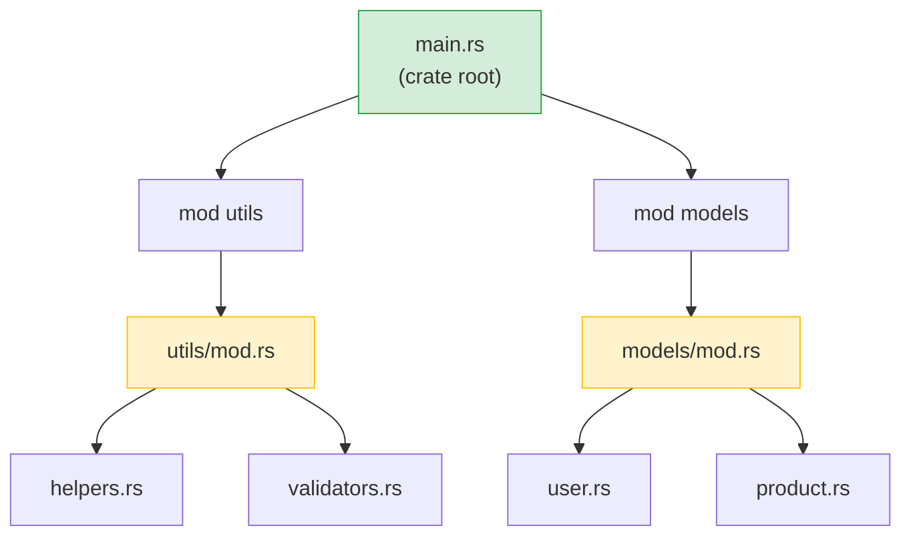

## Rust Modules vs Python Packages<br><span class="zh-inline">Rust 模块系统与 Python 包系统对照</span>

> **What you'll learn:** `mod` and `use` vs `import`, visibility (`pub`) vs Python's convention-based privacy, Cargo.toml vs pyproject.toml, crates.io vs PyPI, and workspaces vs monorepos.<br><span class="zh-inline">**本章将学到什么：** `mod` 和 `use` 与 Python `import` 的对应关系，`pub` 可见性与 Python 约定式私有的差别，`Cargo.toml` 与 `pyproject.toml` 的角色对照，`crates.io` 与 PyPI 的区别，以及 Rust workspace 和 Python monorepo 的不同。</span>
>
> **Difficulty:** 🟢 Beginner<br><span class="zh-inline">**难度：** 🟢 入门</span>

### Python Module System<br><span class="zh-inline">Python 的模块系统</span>

```python
# Python — files are modules, directories with __init__.py are packages

# myproject/
# ├── __init__.py          # Makes it a package
# ├── main.py
# ├── utils/
# │   ├── __init__.py      # Makes utils a sub-package
# │   ├── helpers.py
# │   └── validators.py
# └── models/
#     ├── __init__.py
#     ├── user.py
#     └── product.py

# Importing:
from myproject.utils.helpers import format_name
from myproject.models.user import User
import myproject.utils.validators as validators
```

Python 这套东西的特点是“默认能跑，靠约定成形”。文件天然就是模块，目录里有 `__init__.py` 就成了包。学起来轻松，结构也灵活。<br><span class="zh-inline">但灵活的另一面就是边界偏松，公开不公开、应该从哪里导入、哪些名字只给内部用，很多时候都靠团队自觉。</span>

### Rust Module System<br><span class="zh-inline">Rust 的模块系统</span>

```rust
// Rust — mod declarations create the module tree, files provide content

// src/
// ├── main.rs             # Crate root — declares modules
// ├── utils/
// │   ├── mod.rs           # Module declaration (like __init__.py)
// │   ├── helpers.rs
// │   └── validators.rs
// └── models/
//     ├── mod.rs
//     ├── user.rs
//     └── product.rs

// In src/main.rs:
mod utils;       // Tells Rust to look for src/utils/mod.rs
mod models;      // Tells Rust to look for src/models/mod.rs

use utils::helpers::format_name;
use models::user::User;

// In src/utils/mod.rs:
pub mod helpers;      // Declares and re-exports helpers.rs
pub mod validators;   // Declares and re-exports validators.rs
```



> **Python equivalent**: Think of `mod.rs` as `__init__.py` — it declares what the module exports. The crate root (`main.rs` / `lib.rs`) is like your top-level package `__init__.py`.<br><span class="zh-inline">**和 Python 的类比：** 可以把 `mod.rs` 看成 `__init__.py`，负责声明模块要暴露什么。crate 根，也就是 `main.rs` 或 `lib.rs`，则类似顶层包的 `__init__.py`。</span>

Rust 的模块系统更明确，也更啰嗦一点。模块树不是靠目录结构自动脑补出来的，而是要用 `mod` 明明白白声明。<br><span class="zh-inline">这套设计刚上手时会觉得有点拧巴，但好处是边界更稳定，导出关系更清楚，工程越大越有味道。</span>

### Key Differences<br><span class="zh-inline">核心差异</span>

| Concept<br><span class="zh-inline">概念</span> | Python | Rust |
|---------|--------|------|
| Module = file<br><span class="zh-inline">文件即模块</span> | ✅ Automatic<br><span class="zh-inline">✅ 自动成立</span> | Must declare with `mod`<br><span class="zh-inline">需要显式 `mod` 声明</span> |
| Package = directory<br><span class="zh-inline">目录即包</span> | `__init__.py` | `mod.rs` |
| Public by default<br><span class="zh-inline">默认公开</span> | ✅ Everything<br><span class="zh-inline">✅ 基本都能拿到</span> | ❌ Private by default<br><span class="zh-inline">❌ 默认私有</span> |
| Make public<br><span class="zh-inline">如何公开</span> | `_prefix` convention<br><span class="zh-inline">靠命名约定</span> | `pub` keyword<br><span class="zh-inline">靠 `pub` 关键字</span> |
| Import syntax<br><span class="zh-inline">导入语法</span> | `from x import y` | `use x::y;` |
| Wildcard import<br><span class="zh-inline">通配导入</span> | `from x import *` | `use x::*;` (discouraged)<br><span class="zh-inline">`use x::*;`，但一般不鼓励</span> |
| Relative imports<br><span class="zh-inline">相对导入</span> | `from . import sibling` | `use super::sibling;` |
| Re-export<br><span class="zh-inline">重新导出</span> | `__all__` or explicit<br><span class="zh-inline">`__all__` 或手工导出</span> | `pub use inner::Thing;` |

### Visibility — Private by Default<br><span class="zh-inline">可见性：默认私有</span>

```python
# Python — "we're all adults here"
class User:
    def __init__(self):
        self.name = "Alice"       # Public (by convention)
        self._age = 30            # "Private" (convention: single underscore)
        self.__secret = "shhh"    # Name-mangled (not truly private)

# Nothing stops you from accessing _age or even __secret
print(user._age)                  # Works fine
print(user._User__secret)        # Works too (name mangling)
```

```rust
// Rust — private is enforced by the compiler
pub struct User {
    pub name: String,      // Public — anyone can access
    age: i32,              // Private — only this module can access
}

impl User {
    pub fn new(name: &str, age: i32) -> Self {
        User { name: name.to_string(), age }
    }

    pub fn age(&self) -> i32 {   // Public getter
        self.age
    }

    fn validate(&self) -> bool { // Private method
        self.age > 0
    }
}

// Outside the module:
let user = User::new("Alice", 30);
println!("{}", user.name);        // ✅ Public
// println!("{}", user.age);      // ❌ Compile error: field is private
println!("{}", user.age());       // ✅ Public method (getter)
```

这就是 Python 和 Rust 在“边界感”上的经典差别。Python 更像是在说：大家都是成年人，别乱碰。Rust 则直接说：哪些能碰，哪些不能碰，编译器提前写死。<br><span class="zh-inline">写小脚本时前者很轻巧，写大工程时后者通常更省心，因为模块接口和内部实现分得更干净。</span>

***

## Crates vs PyPI Packages<br><span class="zh-inline">crate 与 PyPI 包</span>

### Python Packages (PyPI)<br><span class="zh-inline">Python 包与 PyPI</span>

```bash
# Python
pip install requests           # Install from PyPI
pip install "requests>=2.28"   # Version constraint
pip freeze > requirements.txt  # Lock versions
pip install -r requirements.txt # Reproduce environment
```

### Rust Crates (crates.io)<br><span class="zh-inline">Rust crate 与 crates.io</span>

```bash
# Rust
cargo add reqwest              # Install from crates.io (adds to Cargo.toml)
cargo add reqwest@0.12         # Version constraint
# Cargo.lock is auto-generated — no manual step
cargo build                    # Downloads and compiles dependencies
```

Python 的依赖管理历史包袱比较重，`requirements.txt`、`setup.py`、`pyproject.toml`、poetry、uv 各有各的玩法。Rust 这边基本统一交给 Cargo，体验就利索很多。<br><span class="zh-inline">至少在“声明依赖、锁版本、复现环境”这件事上，Cargo 默认就把主流程打通了。</span>

### Cargo.toml vs pyproject.toml<br><span class="zh-inline">`Cargo.toml` 与 `pyproject.toml` 对照</span>

```toml
# Rust — Cargo.toml
[package]
name = "my-project"
version = "0.1.0"
edition = "2021"

[dependencies]
serde = { version = "1.0", features = ["derive"] }  # With feature flags
reqwest = { version = "0.12", features = ["json"] }
tokio = { version = "1", features = ["full"] }
log = "0.4"

[dev-dependencies]
mockall = "0.13"
```

`pyproject.toml` 更像 Python 世界逐步统一后的汇总入口，而 `Cargo.toml` 则从一开始就是 Rust 项目管理的中心。包信息、依赖、特性开关、构建入口，几乎都围着它转。<br><span class="zh-inline">所以很多 Python 开发者第一次用 Cargo 时会有种感觉：这玩意怎么什么都给安排好了。</span>

### Essential Crates for Python Developers<br><span class="zh-inline">Python 开发者常见库在 Rust 里的对应物</span>

| Python Library<br><span class="zh-inline">Python 库</span> | Rust Crate<br><span class="zh-inline">Rust crate</span> | Purpose<br><span class="zh-inline">用途</span> |
|---------------|------------|---------|
| `requests` | `reqwest` | HTTP client<br><span class="zh-inline">HTTP 客户端</span> |
| `json` (stdlib)<br><span class="zh-inline">`json` 标准库</span> | `serde_json` | JSON parsing<br><span class="zh-inline">JSON 解析</span> |
| `pydantic` | `serde` | Serialization/validation<br><span class="zh-inline">序列化与部分校验</span> |
| `pathlib` | `std::path` (stdlib)<br><span class="zh-inline">`std::path` 标准库</span> | Path handling<br><span class="zh-inline">路径处理</span> |
| `os` / `shutil` | `std::fs` (stdlib)<br><span class="zh-inline">`std::fs` 标准库</span> | File operations<br><span class="zh-inline">文件操作</span> |
| `re` | `regex` | Regular expressions<br><span class="zh-inline">正则表达式</span> |
| `logging` | `tracing` / `log` | Logging<br><span class="zh-inline">日志</span> |
| `click` / `argparse` | `clap` | CLI argument parsing<br><span class="zh-inline">命令行参数解析</span> |
| `asyncio` | `tokio` | Async runtime<br><span class="zh-inline">异步运行时</span> |
| `datetime` | `chrono` | Date and time<br><span class="zh-inline">日期时间</span> |
| `pytest` | Built-in + `rstest`<br><span class="zh-inline">内置测试 + `rstest`</span> | Testing<br><span class="zh-inline">测试</span> |
| `dataclasses` | `#[derive(...)]` | Data structures<br><span class="zh-inline">数据结构派生</span> |
| `typing.Protocol` | Traits | Structural typing<br><span class="zh-inline">结构化抽象</span> |
| `subprocess` | `std::process` (stdlib)<br><span class="zh-inline">`std::process` 标准库</span> | Run external commands<br><span class="zh-inline">执行外部命令</span> |
| `sqlite3` | `rusqlite` | SQLite |
| `sqlalchemy` | `diesel` / `sqlx` | ORM / SQL toolkit<br><span class="zh-inline">ORM / SQL 工具链</span> |
| `fastapi` | `axum` / `actix-web` | Web framework<br><span class="zh-inline">Web 框架</span> |

这张表并不是说“Python 库 A 完全等于 Rust 库 B”，而是帮忙建立迁移时的直觉地图。<br><span class="zh-inline">很多时候 Rust 生态的抽象方式和 Python 不完全一样，但先知道该从哪块地找，效率会高很多。</span>

***

## Workspaces vs Monorepos<br><span class="zh-inline">workspace 与 monorepo</span>

### Python Monorepo (typical)<br><span class="zh-inline">典型的 Python monorepo</span>

```text
# Python monorepo (various approaches, no standard)
myproject/
├── pyproject.toml           # Root project
├── packages/
│   ├── core/
│   │   ├── pyproject.toml   # Each package has its own config
│   │   └── src/core/...
│   ├── api/
│   │   ├── pyproject.toml
│   │   └── src/api/...
│   └── cli/
│       ├── pyproject.toml
│       └── src/cli/...
# Tools: poetry workspaces, pip -e ., uv workspaces — no standard
```

### Rust Workspace<br><span class="zh-inline">Rust workspace</span>

```toml
# Rust — Cargo.toml at root
[workspace]
members = [
    "core",
    "api",
    "cli",
]

# Shared dependencies across workspace
[workspace.dependencies]
serde = { version = "1.0", features = ["derive"] }
tokio = { version = "1", features = ["full"] }
```

```text
# Rust workspace structure — standardized, built into Cargo
myproject/
├── Cargo.toml               # Workspace root
├── Cargo.lock               # Single lock file for all crates
├── core/
│   ├── Cargo.toml            # [dependencies] serde.workspace = true
│   └── src/lib.rs
├── api/
│   ├── Cargo.toml
│   └── src/lib.rs
└── cli/
    ├── Cargo.toml
    └── src/main.rs
```

```bash
# Workspace commands
cargo build                  # Build everything
cargo test                   # Test everything
cargo build -p core          # Build just the core crate
cargo test -p api            # Test just the api crate
cargo clippy --all           # Lint everything
```

> **Key insight**: Rust workspaces are first-class, built into Cargo. Python monorepos require third-party tools (poetry, uv, pants) with varying levels of support. In a Rust workspace, all crates share a single `Cargo.lock`, ensuring consistent dependency versions across the project.<br><span class="zh-inline">**关键理解：** Rust workspace 是 Cargo 原生支持的一等能力。Python monorepo 往往需要额外工具来拼装，而且不同方案支持程度差异不小。Rust workspace 下所有 crate 共用一个 `Cargo.lock`，依赖版本一致性更容易维持。</span>

如果已经习惯 Python 大仓库那种“一堆工具互相套娃”的日常，第一次用 Rust workspace 时通常会有点舒服过头。因为它本来就是官方设计的一部分，不用再自己东拼西凑。<br><span class="zh-inline">这也是 Rust 工程化体验比较整齐的一个重要原因。</span>

---

## Exercises<br><span class="zh-inline">练习</span>

<details>
<summary><strong>🏋️ Exercise: Module Visibility</strong> <span class="zh-inline">🏋️ 练习：模块可见性判断</span></summary>

**Challenge**: Given this module structure, predict which lines compile and which don't:<br><span class="zh-inline">**挑战题：** 给定下面这个模块结构，判断哪些行可以编译通过，哪些不行：</span>

```rust
mod kitchen {
    fn secret_recipe() -> &'static str { "42 spices" }
    pub fn menu() -> &'static str { "Today's special" }

    pub mod staff {
        pub fn cook() -> String {
            format!("Cooking with {}", super::secret_recipe())
        }
    }
}

fn main() {
    println!("{}", kitchen::menu());             // Line A
    println!("{}", kitchen::secret_recipe());     // Line B
    println!("{}", kitchen::staff::cook());       // Line C
}
```

<details>
<summary>🔑 Solution <span class="zh-inline">🔑 参考答案</span></summary>

- **Line A**: ✅ Compiles — `menu()` is `pub`<br><span class="zh-inline">**A 行**：✅ 可以编译，因为 `menu()` 是 `pub`。</span>
- **Line B**: ❌ Compile error — `secret_recipe()` is private to `kitchen`<br><span class="zh-inline">**B 行**：❌ 编译错误，因为 `secret_recipe()` 对 `kitchen` 外部是私有的。</span>
- **Line C**: ✅ Compiles — `staff::cook()` is `pub`, and `cook()` can access `secret_recipe()` via `super::` (child modules can access parent's private items)<br><span class="zh-inline">**C 行**：✅ 可以编译，因为 `staff::cook()` 是 `pub`，而且子模块可以通过 `super::` 访问父模块的私有项。</span>

**Key takeaway**: In Rust, child modules can see parent's privates (like Python's `_private` convention, but enforced). Outsiders cannot. This is the opposite of Python where `_private` is just a hint.<br><span class="zh-inline">**关键点：** Rust 里子模块可以看到父模块的私有项，但外部模块不行。和 Python 里 `_private` 只是个提示不同，Rust 这里是编译器真管。</span>

</details>
</details>

***
