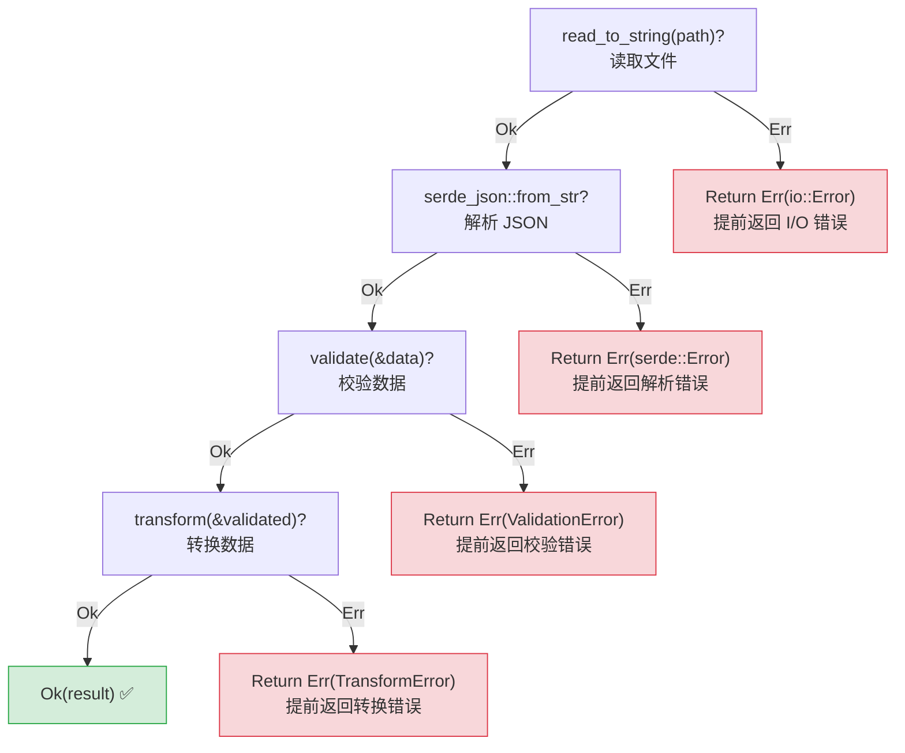
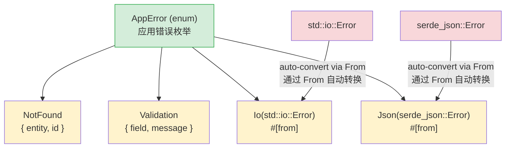

## Exceptions vs Result<br><span class="zh-inline">异常与 Result 的对照</span>

> **What you'll learn:** `Result<T, E>` versus `try` / `except`, the `?` operator for concise error propagation, custom error types with `thiserror`, `anyhow` for applications, and why explicit errors avoid hidden bugs.<br><span class="zh-inline">**本章将学习：** `Result&lt;T, E&gt;` 和 `try` / `except` 的根本差异，`?` 如何简洁地传播错误，怎样用 `thiserror` 写自定义错误，为什么应用层常配合 `anyhow`，以及显式错误为什么能挡住隐藏 bug。</span>
>
> **Difficulty:** 🟡 Intermediate<br><span class="zh-inline">**难度：** 🟡 进阶</span>

This is one of the biggest mindset shifts for Python developers. Python throws exceptions from almost anywhere and catches them somewhere else if needed. Rust treats errors as values through `Result<T, E>`, and that means the call sites must face them explicitly.<br><span class="zh-inline">这大概是 Python 开发者切换到 Rust 时最需要重新建立的一套思维。Python 可以在几乎任意位置抛异常，再在别的地方接住；Rust 则把错误当成值，通过 `Result&lt;T, E&gt;` 传递，调用方必须显式面对它。</span>

### Python Exception Handling<br><span class="zh-inline">Python 的异常处理</span>

```python
# Python — exceptions can be thrown from anywhere
import json

def load_config(path: str) -> dict:
    try:
        with open(path) as f:
            data = json.load(f)     # Can raise JSONDecodeError
            if "version" not in data:
                raise ValueError("Missing version field")
            return data
    except FileNotFoundError:
        print(f"Config file not found: {path}")
        return {}
    except json.JSONDecodeError as e:
        print(f"Invalid JSON: {e}")
        return {}
    # What other exceptions can this throw?
    # IOError? PermissionError? UnicodeDecodeError?
    # You can't tell from the function signature!
```

### Rust Result-Based Error Handling<br><span class="zh-inline">Rust 基于 Result 的错误处理</span>

```rust
// Rust — errors are return values, visible in the function signature
use std::fs;
use serde_json::Value;

fn load_config(path: &str) -> Result<Value, ConfigError> {
    let contents = fs::read_to_string(path)
        .map_err(|e| ConfigError::FileError(e.to_string()))?;

    let data: Value = serde_json::from_str(&contents)
        .map_err(|e| ConfigError::ParseError(e.to_string()))?;

    if data.get("version").is_none() {
        return Err(ConfigError::MissingField("version".to_string()));
    }

    Ok(data)
}

#[derive(Debug)]
enum ConfigError {
    FileError(String),
    ParseError(String),
    MissingField(String),
}
```

### Key Differences<br><span class="zh-inline">核心差异</span>

```text
Python:                                 Rust:
─────────                               ─────
- Errors are exceptions (thrown)        - Errors are values (returned)
- Hidden control flow (stack unwinding) - Explicit control flow (? operator)
- Can't tell what errors from signature - MUST see errors in return type
- Uncaught exceptions crash at runtime  - Unhandled Results are compile warnings
- try/except is optional                - Handling Result is required
- Broad except catches everything       - match arms are exhaustive
```

<span class="zh-inline">
Python：<br>
- 错误通常以异常形式抛出<br>
- 控制流经常是隐藏的，得顺着运行栈猜<br>
- 从函数签名里通常看不出会抛什么<br>
- 没接住的异常会在运行时炸出来<br>
- `try/except` 是可选的<br>
- 宽泛的 `except` 很容易把各种问题一锅端
<br><br>
Rust：<br>
- 错误通常作为返回值传出<br>
- 控制流显式写在代码里，`?` 一眼能看见<br>
- 函数返回类型必须把错误面暴露出来<br>
- 没处理的 `Result` 会收到编译期提醒<br>
- 调用方必须决定怎么处理 `Result`<br>
- `match` 分支需要覆盖完整情况
</span>

### The Two Result Variants<br><span class="zh-inline">Result 的两个分支</span>

```rust
enum Result<T, E> {
    Ok(T),    // Success — contains the value
    Err(E),   // Failure — contains the error
}

fn divide(a: f64, b: f64) -> Result<f64, String> {
    if b == 0.0 {
        Err("Division by zero".to_string())
    } else {
        Ok(a / b)
    }
}

match divide(10.0, 0.0) {
    Ok(result) => println!("Result: {result}"),
    Err(msg) => println!("Error: {msg}"),
}
```

`Ok(T)` represents the success path. `Err(E)` carries the failure path as data. In Python those two flows often share one function body and split invisibly at runtime; in Rust they are encoded in the type itself.<br><span class="zh-inline">`Ok(T)` 代表成功分支，`Err(E)` 把失败分支也装进数据里。Python 往往让这两条路在运行时偷偷分岔，Rust 则把分岔点直接编码进类型本身。</span>

***

## The ? Operator<br><span class="zh-inline">`?` 运算符</span>

The `?` operator is Rust's explicit form of “propagate this error upward”. It serves a similar practical purpose to exception bubbling, but it is written directly in the code.<br><span class="zh-inline">`?` 运算符可以理解成“把这个错误继续往上交”的显式写法。它在效果上有点像异常继续冒泡，但和异常不同，它是明明白白写在代码里的。</span>

### Python — Implicit Propagation<br><span class="zh-inline">Python：隐式传播</span>

```python
def read_username() -> str:
    with open("config.txt") as f:
        return f.readline().strip()

def greet():
    name = read_username()
    print(f"Hello, {name}!")
```

Errors can escape from `open` or `readline`, but that fact is not visible in the function signature.<br><span class="zh-inline">`open` 和 `readline` 都可能抛错，但从函数签名本身完全看不出来。</span>

### Rust — Explicit Propagation with ?<br><span class="zh-inline">Rust：用 `?` 显式传播</span>

```rust
use std::fs;
use std::io;

fn read_username() -> Result<String, io::Error> {
    let contents = fs::read_to_string("config.txt")?;
    Ok(contents.lines().next().unwrap_or("").to_string())
}

fn greet() -> Result<(), io::Error> {
    let name = read_username()?;
    println!("Hello, {name}!");
    Ok(())
}
```

### Chaining with ?<br><span class="zh-inline">用 `?` 串联多步操作</span>

```python
def process_file(path: str) -> dict:
    with open(path) as f:
        text = f.read()
    data = json.loads(text)
    validate(data)
    return transform(data)
```

```rust
fn process_file(path: &str) -> Result<Data, AppError> {
    let text = fs::read_to_string(path)?;
    let data: Value = serde_json::from_str(&text)?;
    let validated = validate(&data)?;
    let result = transform(&validated)?;
    Ok(result)
}
```



> Each `?` is a visible exit point. Unlike a Python `try` block, Rust makes early-return locations obvious without reading external docs.<br><span class="zh-inline">每个 `?` 都是可见的退出点。和 Python 的 `try` 块不同，Rust 不需要翻文档就能看见哪些地方会提前返回。</span>
>
> 📌 **See also**: [Ch. 15 — Migration Patterns](ch15-migration-patterns.md) discusses how Python `try` / `except` patterns map into Rust in larger codebases.<br><span class="zh-inline">📌 **延伸阅读：** [第 15 章——迁移模式](ch15-migration-patterns.md) 会继续讨论 Python 的 `try` / `except` 在真实 Rust 项目里该怎么迁移。</span>

***

## Custom Error Types with thiserror<br><span class="zh-inline">用 thiserror 定义自定义错误类型</span>



> The `#[from]` attribute generates `impl From<io::Error> for AppError`, so `?` can convert library errors into application errors automatically.<br><span class="zh-inline">`#[from]` 会自动生成类似 `impl From&lt;io::Error&gt; for AppError` 的实现，因此 `?` 可以把库层错误自动提升成应用层错误。</span>

### Python Custom Exceptions<br><span class="zh-inline">Python 的自定义异常</span>

```python
class AppError(Exception):
    pass

class NotFoundError(AppError):
    def __init__(self, entity: str, id: int):
        self.entity = entity
        self.id = id
        super().__init__(f"{entity} with id {id} not found")

class ValidationError(AppError):
    def __init__(self, field: str, message: str):
        self.field = field
        super().__init__(f"Validation error on {field}: {message}")

def find_user(user_id: int) -> dict:
    if user_id not in users:
        raise NotFoundError("User", user_id)
    return users[user_id]
```

### Rust Custom Errors with thiserror<br><span class="zh-inline">Rust 里用 thiserror 写自定义错误</span>

```rust
use thiserror::Error;

#[derive(Debug, Error)]
enum AppError {
    #[error("{entity} with id {id} not found")]
    NotFound { entity: String, id: i64 },

    #[error("Validation error on {field}: {message}")]
    Validation { field: String, message: String },

    #[error("IO error: {0}")]
    Io(#[from] std::io::Error),

    #[error("JSON error: {0}")]
    Json(#[from] serde_json::Error),
}

fn find_user(user_id: i64) -> Result<User, AppError> {
    users.get(&user_id)
        .cloned()
        .ok_or(AppError::NotFound {
            entity: "User".to_string(),
            id: user_id,
        })
}

fn load_users(path: &str) -> Result<Vec<User>, AppError> {
    let data = fs::read_to_string(path)?;
    let users: Vec<User> = serde_json::from_str(&data)?;
    Ok(users)
}
```

### Error Handling Quick Reference<br><span class="zh-inline">错误处理速查表</span>

| Python | Rust | Notes<br><span class="zh-inline">说明</span> |
|--------|------|-------|
| `raise ValueError("msg")` | `return Err(AppError::Validation { ... })` | Explicit return<br><span class="zh-inline">显式返回错误</span> |
| `try: ... except:` | `match result { Ok(v) => ..., Err(e) => ... }` | Exhaustive<br><span class="zh-inline">分支完整</span> |
| `except ValueError as e:` | `Err(AppError::Validation { .. }) =>` | Pattern match<br><span class="zh-inline">模式匹配</span> |
| `raise ... from e` | `#[from]` or `.map_err()` | Error chaining<br><span class="zh-inline">错误链式转换</span> |
| `finally:` | `Drop` trait | Deterministic cleanup<br><span class="zh-inline">确定性清理</span> |
| `with open(...):` | Scope-based drop | RAII pattern<br><span class="zh-inline">作用域自动释放</span> |
| Exception propagates silently | `?` propagates visibly | Always in return type<br><span class="zh-inline">总会体现在返回类型里</span> |
| `isinstance(e, ValueError)` | `matches!(e, AppError::Validation {..})` | Type checking<br><span class="zh-inline">基于类型匹配</span> |

---

## Exercises<br><span class="zh-inline">练习</span>

<details>
<summary><strong>🏋️ Exercise: Parse Config Value</strong><br><span class="zh-inline"><strong>🏋️ 练习：解析配置端口</strong></span></summary>

**Challenge**: Write a function `parse_port(s: &str) -> Result<u16, String>` that rejects empty input, maps parsing failures into custom messages, and rejects privileged ports below 1024.<br><span class="zh-inline">**挑战**：写一个 `parse_port(s: &str) -> Result&lt;u16, String&gt;`，要求拒绝空字符串，把解析错误改写成自定义消息，并拒绝 1024 以下的特权端口。</span>

Call it with `""`、`"hello"`、`"80"`、`"8080"` and print the results.<br><span class="zh-inline">分别用 `""`、`"hello"`、`"80"`、`"8080"` 调用它，并打印结果。</span>

<details>
<summary>🔑 Solution<br><span class="zh-inline">🔑 参考答案</span></summary>

```rust
fn parse_port(s: &str) -> Result<u16, String> {
    if s.is_empty() {
        return Err("empty input".to_string());
    }
    let port: u16 = s.parse().map_err(|e| format!("invalid number: {e}"))?;
    if port < 1024 {
        return Err(format!("port {port} is privileged"));
    }
    Ok(port)
}

fn main() {
    for input in ["", "hello", "80", "8080"] {
        match parse_port(input) {
            Ok(port) => println!("✅ {input} → {port}"),
            Err(e) => println!("❌ {input:?} → {e}"),
        }
    }
}
```

**Key takeaway**: `?` plus `.map_err()` is the Rust replacement for “catch an exception, wrap it, and raise again”. Every error path stays visible in the function signature.<br><span class="zh-inline">**核心收获**：`?` 配合 `.map_err()`，基本就是 Rust 对“接住异常、包装一下、再往外抛”的替代方案。区别在于，所有错误路径都会老老实实写进函数签名里。</span>

</details>
</details>

***
