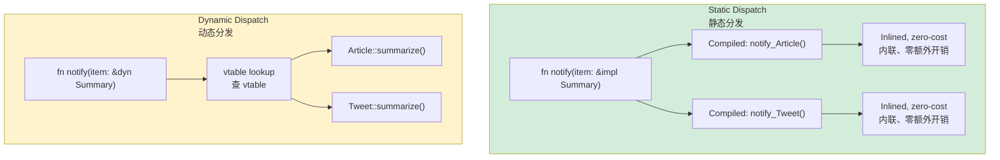

## Traits vs Duck Typing<br><span class="zh-inline">Trait 与鸭子类型的对照</span>

> **What you'll learn:** Traits as explicit contracts, how `Protocol` (PEP 544) relates to traits, generic bounds with `where`, trait objects versus static dispatch, and the most important standard-library traits.<br><span class="zh-inline">**本章将学习：** trait 如何把行为契约显式写出来，`Protocol`（PEP 544）和 trait 的关系，`where` 子句里的泛型约束，trait object 与静态分发的差异，以及标准库里最重要的一批 trait。</span>
>
> **Difficulty:** 🟡 Intermediate<br><span class="zh-inline">**难度：** 🟡 进阶</span>

This is one of the places where Rust's type system starts to feel genuinely powerful to Python developers. Python says “if it quacks like a duck, use it.” Rust says “tell me exactly which duck behaviors are required, and I will verify them before the program runs.”<br><span class="zh-inline">这一章往往是 Python 开发者第一次真正感受到 Rust 类型系统威力的地方。Python 的思路是“像鸭子就拿来用”；Rust 的思路是“把需要的鸭子行为写清楚，然后在程序运行前全部验证完”。</span>

### Python Duck Typing<br><span class="zh-inline">Python 的鸭子类型</span>

```python
# Python — duck typing: anything with the right methods works
def total_area(shapes):
    """Works with anything that has an .area() method."""
    return sum(shape.area() for shape in shapes)

class Circle:
    def __init__(self, radius): self.radius = radius
    def area(self): return 3.14159 * self.radius ** 2

class Rectangle:
    def __init__(self, w, h): self.w, self.h = w, h
    def area(self): return self.w * self.h

# Works at runtime — no inheritance needed!
shapes = [Circle(5), Rectangle(3, 4)]
print(total_area(shapes))  # 90.54

class Dog:
    def bark(self): return "Woof!"

total_area([Dog()])  # 💥 AttributeError
```

### Rust Traits — Explicit Duck Typing<br><span class="zh-inline">Rust trait：显式版鸭子类型</span>

```rust
trait HasArea {
    fn area(&self) -> f64;
}

struct Circle { radius: f64 }
struct Rectangle { width: f64, height: f64 }

impl HasArea for Circle {
    fn area(&self) -> f64 {
        std::f64::consts::PI * self.radius * self.radius
    }
}

impl HasArea for Rectangle {
    fn area(&self) -> f64 {
        self.width * self.height
    }
}

fn total_area(shapes: &[&dyn HasArea]) -> f64 {
    shapes.iter().map(|s| s.area()).sum()
}

let shapes: Vec<&dyn HasArea> = vec![&Circle { radius: 5.0 }, &Rectangle { width: 3.0, height: 4.0 }];
println!("{}", total_area(&shapes));

// struct Dog;
// total_area(&[&Dog {}]);  // ❌ Compile error
```

> **Key insight**: Python's duck typing gives flexibility by postponing checks to runtime. Rust keeps much of that flexibility, but moves the verification to compile time.<br><span class="zh-inline">**关键理解：** Python 的鸭子类型是把灵活性建立在“运行时再检查”之上；Rust 则试图保留这份灵活性，但把校验提前到编译期。</span>

***

## Protocols (PEP 544) vs Traits<br><span class="zh-inline">`Protocol`（PEP 544）与 trait</span>

Python's `Protocol` is probably the closest built-in concept to Rust traits. The biggest difference is enforcement: Python mostly relies on tooling, while Rust makes the compiler负责到底。<br><span class="zh-inline">Python 的 `Protocol` 大概是最接近 Rust trait 的概念。最大的差别还是执行力度：Python 主要依赖工具链提醒，Rust 则让编译器亲自负责到底。</span>

### Python Protocol<br><span class="zh-inline">Python 的 Protocol</span>

```python
from typing import Protocol, runtime_checkable

@runtime_checkable
class Printable(Protocol):
    def to_string(self) -> str: ...

class User:
    def __init__(self, name: str):
        self.name = name
    def to_string(self) -> str:
        return f"User({self.name})"

class Product:
    def __init__(self, name: str, price: float):
        self.name = name
        self.price = price
    def to_string(self) -> str:
        return f"Product({self.name}, ${self.price:.2f})"

def print_all(items: list[Printable]) -> None:
    for item in items:
        print(item.to_string())
```

### Rust Trait<br><span class="zh-inline">Rust 的 trait</span>

```rust
trait Printable {
    fn to_string(&self) -> String;
}

struct User { name: String }
struct Product { name: String, price: f64 }

impl Printable for User {
    fn to_string(&self) -> String {
        format!("User({})", self.name)
    }
}

impl Printable for Product {
    fn to_string(&self) -> String {
        format!("Product({}, ${:.2})", self.name, self.price)
    }
}

fn print_all(items: &[&dyn Printable]) {
    for item in items {
        println!("{}", item.to_string());
    }
}

// print_all(&[&42i32]);  // ❌ Compile error
```

### Comparison Table<br><span class="zh-inline">对照表</span>

| Feature<br><span class="zh-inline">特性</span> | Python Protocol | Rust Trait |
|---------|-----------------|------------|
| Structural typing<br><span class="zh-inline">结构化类型</span> | ✅ Implicit<br><span class="zh-inline">隐式</span> | ❌ Explicit `impl`<br><span class="zh-inline">必须显式实现</span> |
| Checked at<br><span class="zh-inline">检查时机</span> | Runtime or mypy<br><span class="zh-inline">运行时或静态工具</span> | Compile time<br><span class="zh-inline">编译期</span> |
| Default implementations<br><span class="zh-inline">默认实现</span> | ❌ | ✅ |
| Can add to foreign types<br><span class="zh-inline">能否扩展外部类型</span> | ❌ | ✅ Within orphan rules<br><span class="zh-inline">在孤儿规则约束内可以</span> |
| Multiple protocols / traits<br><span class="zh-inline">多协议 / 多 trait</span> | ✅ | ✅ |
| Associated types<br><span class="zh-inline">关联类型</span> | ❌ | ✅ |
| Generic constraints<br><span class="zh-inline">泛型约束</span> | ✅ | ✅ |

***

## Generic Constraints<br><span class="zh-inline">泛型约束</span>

### Python Generics<br><span class="zh-inline">Python 泛型</span>

```python
from typing import TypeVar, Sequence

T = TypeVar('T')

def first(items: Sequence[T]) -> T | None:
    return items[0] if items else None

from typing import SupportsFloat
T = TypeVar('T', bound=SupportsFloat)

def average(items: Sequence[T]) -> float:
    return sum(float(x) for x in items) / len(items)
```

### Rust Generics with Trait Bounds<br><span class="zh-inline">Rust：带 trait bound 的泛型</span>

```rust
fn first<T>(items: &[T]) -> Option<&T> {
    items.first()
}

fn average<T>(items: &[T]) -> f64
where
    T: Into<f64> + Copy,
{
    let sum: f64 = items.iter().map(|&x| x.into()).sum();
    sum / items.len() as f64
}

fn log_and_clone<T: std::fmt::Display + std::fmt::Debug + Clone>(item: &T) -> T {
    println!("Display: {}", item);
    println!("Debug: {:?}", item);
    item.clone()
}

fn print_it(item: &impl std::fmt::Display) {
    println!("{}", item);
}
```

### Generics Quick Reference<br><span class="zh-inline">泛型速查表</span>

| Python | Rust | Notes<br><span class="zh-inline">说明</span> |
|--------|------|-------|
| `TypeVar('T')` | `<T>` | Unbounded generic<br><span class="zh-inline">无约束泛型</span> |
| `TypeVar('T', bound=X)` | `<T: X>` | Bounded generic<br><span class="zh-inline">有约束泛型</span> |
| `Union[int, str]` | `enum` or trait object | No direct union type<br><span class="zh-inline">没有直接等价的联合类型</span> |
| `Sequence[T]` | `&[T]` | Borrowed sequence<br><span class="zh-inline">借用切片</span> |
| `Callable[[A], R]` | `Fn(A) -> R` | Function trait<br><span class="zh-inline">函数 trait</span> |
| `Optional[T]` | `Option<T>` | Built into the language<br><span class="zh-inline">语言内建</span> |

***

## Common Standard Library Traits<br><span class="zh-inline">常见标准库 trait</span>

These are the Rust equivalents of many familiar Python magic methods. They describe how a type prints, compares, clones, iterates, and overloads operators.<br><span class="zh-inline">这一组 trait 基本可以看成 Rust 世界里对很多 Python 魔术方法的对应抽象。类型怎么打印、怎么比较、怎么克隆、怎么迭代、怎么做运算符重载，基本都落在这里。</span>

### `Display` and `Debug`<br><span class="zh-inline">`Display` 与 `Debug`</span>

```rust
use std::fmt;

#[derive(Debug)]
struct Point { x: f64, y: f64 }

impl fmt::Display for Point {
    fn fmt(&self, f: &mut fmt::Formatter<'_>) -> fmt::Result {
        write!(f, "({}, {})", self.x, self.y)
    }
}
```

### Comparison Traits<br><span class="zh-inline">比较相关 trait</span>

```rust
#[derive(Debug, PartialEq, Eq, PartialOrd, Ord, Hash, Clone)]
struct Student {
    name: String,
    grade: i32,
}

let mut students = vec![
    Student { name: "Charlie".into(), grade: 85 },
    Student { name: "Alice".into(), grade: 92 },
];
students.sort();
```

### Iterator Trait<br><span class="zh-inline">`Iterator` trait</span>

```rust
struct Countdown { value: i32 }

impl Iterator for Countdown {
    type Item = i32;

    fn next(&mut self) -> Option<Self::Item> {
        if self.value > 0 {
            self.value -= 1;
            Some(self.value + 1)
        } else {
            None
        }
    }
}

for n in (Countdown { value: 5 }) {
    println!("{n}");
}
```

### Common Traits at a Glance<br><span class="zh-inline">常见 trait 一览</span>

| Rust Trait | Python Equivalent | Purpose<br><span class="zh-inline">用途</span> |
|-----------|-------------------|---------|
| `Display` | `__str__` | Human-readable string<br><span class="zh-inline">面向人类的显示字符串</span> |
| `Debug` | `__repr__` | Debug string<br><span class="zh-inline">调试输出</span> |
| `Clone` | `copy.deepcopy` | Deep copy<br><span class="zh-inline">显式深拷贝</span> |
| `Copy` | Implicit scalar copy<br><span class="zh-inline">标量自动复制</span> | Cheap implicit copy |
| `PartialEq` / `Eq` | `__eq__` | Equality comparison<br><span class="zh-inline">相等性比较</span> |
| `PartialOrd` / `Ord` | `__lt__` etc. | Ordering<br><span class="zh-inline">排序比较</span> |
| `Hash` | `__hash__` | Hash support<br><span class="zh-inline">可哈希</span> |
| `Default` | Default constructor pattern<br><span class="zh-inline">默认值模式</span> | Default initialization |
| `From` / `Into` | Conversion constructors<br><span class="zh-inline">转换构造</span> | Type conversion |
| `Iterator` | `__iter__` / `__next__` | Iteration |
| `Drop` | `__del__` / context cleanup<br><span class="zh-inline">析构或清理</span> | Cleanup |
| `Add`, `Sub`, `Mul` | `__add__` etc. | Operator overloading<br><span class="zh-inline">运算符重载</span> |
| `Index` | `__getitem__` | `[]` indexing |
| `Deref` | No close equivalent<br><span class="zh-inline">无直接对应物</span> | Smart-pointer deref |
| `Send` / `Sync` | No Python equivalent<br><span class="zh-inline">Python 无对应概念</span> | Thread-safety markers |



> **Python equivalent**: Python always uses dynamic dispatch at runtime. Rust defaults to static dispatch, where the compiler specializes code for each concrete type. `dyn Trait` is the opt-in form when runtime polymorphism is actually needed.<br><span class="zh-inline">**和 Python 的对照**：Python 基本一直在做运行时动态分发；Rust 默认走静态分发，也就是编译器针对每个具体类型生成专门代码。只有确实需要运行时多态时，才主动使用 `dyn Trait`。</span>
>
> 📌 **See also**: [Ch. 11 — From/Into Traits](ch11-from-and-into-traits.md) for the conversion traits in more depth.<br><span class="zh-inline">📌 **延伸阅读：** [第 11 章——From/Into Traits](ch11-from-and-into-traits.md) 会继续展开转换类 trait。</span>

### Associated Types<br><span class="zh-inline">关联类型</span>

Rust traits can declare associated types, which each implementor fills in with a concrete type. Python has no equally strong built-in mechanism for this.<br><span class="zh-inline">Rust 的 trait 可以声明关联类型，由每个实现者填入具体类型。Python 没有一个同等强度、由语言层统一约束的对应机制。</span>

```rust
trait Iterator {
    type Item;
    fn next(&mut self) -> Option<Self::Item>;
}

struct Countdown { remaining: u32 }

impl Iterator for Countdown {
    type Item = u32;
    fn next(&mut self) -> Option<u32> {
        if self.remaining > 0 {
            self.remaining -= 1;
            Some(self.remaining)
        } else {
            None
        }
    }
}
```

### Operator Overloading: `__add__` → `impl Add`<br><span class="zh-inline">运算符重载：`__add__` → `impl Add`</span>

```python
class Vec2:
    def __init__(self, x, y):
        self.x, self.y = x, y
    def __add__(self, other):
        return Vec2(self.x + other.x, self.y + other.y)
```

```rust
use std::ops::Add;

#[derive(Debug, Clone, Copy)]
struct Vec2 { x: f64, y: f64 }

impl Add for Vec2 {
    type Output = Vec2;
    fn add(self, rhs: Vec2) -> Vec2 {
        Vec2 { x: self.x + rhs.x, y: self.y + rhs.y }
    }
}

let a = Vec2 { x: 1.0, y: 2.0 };
let b = Vec2 { x: 3.0, y: 4.0 };
let c = a + b;
```

The big difference is type checking. Python's `__add__` accepts whatever gets passed in and then may fail at runtime. Rust's `Add` implementation fixes the operand types up front unless additional overloads are explicitly written.<br><span class="zh-inline">最大的差别还是类型检查。Python 的 `__add__` 先收下参数再说，类型不合适时运行时炸；Rust 的 `Add` 在实现时就把操作数类型钉死了，除非额外显式写更多重载。</span>

---

## Exercises<br><span class="zh-inline">练习</span>

<details>
<summary><strong>🏋️ Exercise: Generic Summary Trait</strong><br><span class="zh-inline"><strong>🏋️ 练习：通用 Summary trait</strong></span></summary>

**Challenge**: Define a trait `Summary` with `fn summarize(&self) -> String`, implement it for `Article` and `Tweet`, and then write `fn notify(item: &impl Summary)` to print the summary.<br><span class="zh-inline">**挑战**：定义一个 `Summary` trait，要求包含 `fn summarize(&self) -> String`；为 `Article` 和 `Tweet` 实现它；然后再写一个 `fn notify(item: &impl Summary)` 用来打印摘要。</span>

<details>
<summary>🔑 Solution<br><span class="zh-inline">🔑 参考答案</span></summary>

```rust
trait Summary {
    fn summarize(&self) -> String;
}

struct Article { title: String, body: String }
struct Tweet { username: String, content: String }

impl Summary for Article {
    fn summarize(&self) -> String {
        format!("{} — {}...", self.title, &self.body[..20.min(self.body.len())])
    }
}

impl Summary for Tweet {
    fn summarize(&self) -> String {
        format!("@{}: {}", self.username, self.content)
    }
}

fn notify(item: &impl Summary) {
    println!("📢 {}", item.summarize());
}

fn main() {
    let article = Article {
        title: "Rust is great".into(),
        body: "Here is why Rust beats Python for systems...".into(),
    };
    let tweet = Tweet {
        username: "rustacean".into(),
        content: "Just shipped my first crate!".into(),
    };
    notify(&article);
    notify(&tweet);
}
```

**Key takeaway**: `&impl Summary` is close in spirit to saying “anything that satisfies this protocol”, but Rust turns that promise into a compile-time guarantee rather than a runtime gamble.<br><span class="zh-inline">**核心收获：** `&impl Summary` 的精神很接近“任何满足这个协议的东西都行”，但 Rust 会把这个承诺变成编译期保证，而不是留到运行时碰碰运气。</span>

</details>
</details>

***
