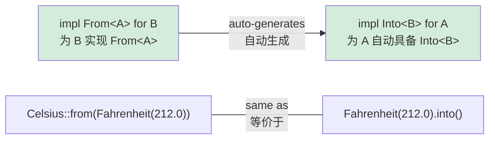

## Type Conversions in Rust<br><span class="zh-inline">Rust 中的类型转换</span>

> **What you'll learn:** `From` and `Into` for zero-cost conversions, `TryFrom` for fallible conversions, how `impl From<A> for B` automatically enables `Into<B> for A`, and common string conversion patterns.<br><span class="zh-inline">**本章将学习：** `From` 和 `Into` 如何表达零成本类型转换，`TryFrom` 如何处理可能失败的转换，为什么实现 `impl From&lt;A&gt; for B` 会自动得到 `Into&lt;B&gt; for A`，以及常见的字符串转换写法。</span>
>
> **Difficulty:** 🟡 Intermediate<br><span class="zh-inline">**难度：** 🟡 进阶</span>

Python usually handles conversion through constructors such as `int("42")`、`str(42)`、`float("3.14")`。Rust 则把类型转换抽象成 `From` 和 `Into` trait，用类型系统把可转换关系表达清楚。<br><span class="zh-inline">Python 习惯通过构造函数完成转换，例如 `int("42")`、`str(42)`、`float("3.14")`。Rust 则把转换能力放进 `From` 和 `Into` trait 里，让可转换关系成为类型系统的一部分。</span>

### Python Type Conversion<br><span class="zh-inline">Python 的类型转换</span>

```python
# Python — explicit constructors for conversion
x = int("42")           # str → int (can raise ValueError)
s = str(42)             # int → str
f = float("3.14")       # str → float
lst = list((1, 2, 3))   # tuple → list

# Custom conversion via __init__ or class methods
class Celsius:
    def __init__(self, temp: float):
        self.temp = temp

    @classmethod
    def from_fahrenheit(cls, f: float) -> "Celsius":
        return cls((f - 32.0) * 5.0 / 9.0)

c = Celsius.from_fahrenheit(212.0)  # 100.0°C
```

### Rust From/Into<br><span class="zh-inline">Rust 的 From / Into</span>

```rust
// Rust — From trait defines conversions
// Implementing From<T> gives you Into<U> automatically!

struct Celsius(f64);
struct Fahrenheit(f64);

impl From<Fahrenheit> for Celsius {
    fn from(f: Fahrenheit) -> Self {
        Celsius((f.0 - 32.0) * 5.0 / 9.0)
    }
}

// Now both work:
let c1 = Celsius::from(Fahrenheit(212.0));    // Explicit From
let c2: Celsius = Fahrenheit(212.0).into();   // Into (automatically derived)

// String conversions:
let s: String = String::from("hello");         // &str → String
let s: String = "hello".to_string();           // Same thing
let s: String = "hello".into();                // Also works (From is implemented)

let num: i64 = 42i32.into();                   // i32 → i64 (lossless, so From exists)
// let small: i32 = 42i64.into();              // ❌ i64 → i32 might lose data — no From

// For fallible conversions, use TryFrom:
let n: Result<i32, _> = "42".parse();          // str → i32 (might fail)
let n: i32 = "42".parse().unwrap();            // Panic if not a number
let n: i32 = "42".parse()?;                    // Propagate error with ?
```

`From` is where conversion logic lives. `Into` is the caller-facing convenience that appears automatically once `From` is implemented.<br><span class="zh-inline">真正承载转换逻辑的是 `From`。而 `Into` 更像调用侧的便捷接口，只要 `From` 实现好了，它通常就会自动跟着出现。</span>

### The From/Into Relationship<br><span class="zh-inline">From 和 Into 的关系</span>



> **Rule of thumb**: implement `From`, not `Into`. Once `From<A> for B` exists, callers automatically get `Into<B> for A`.<br><span class="zh-inline">**经验法则：** 优先实现 `From`，几乎不要手写 `Into`。只要有了 `From&lt;A&gt; for B`，调用方自然就拥有 `Into&lt;B&gt; for A`。</span>

***

### When to Use From/Into<br><span class="zh-inline">什么时候适合用 From / Into</span>

```rust
// Implement From<T> for your types to enable ergonomic API design:

#[derive(Debug)]
struct UserId(i64);

impl From<i64> for UserId {
    fn from(id: i64) -> Self {
        UserId(id)
    }
}

// Now functions can accept anything convertible to UserId:
fn find_user(id: impl Into<UserId>) -> Option<String> {
    let user_id = id.into();
    // ... lookup logic
    Some(format!("User #{:?}", user_id))
}

find_user(42i64);              // ✅ i64 auto-converts to UserId
find_user(UserId(42));         // ✅ UserId stays as-is
```

This pattern makes APIs flexible without losing type safety. The function asks for “anything that can become `UserId`”, not for one concrete source type.<br><span class="zh-inline">这种写法能在保持类型安全的前提下，把 API 做得更顺手。函数要的不是某一种死板的输入，而是“任何能转换成 `UserId` 的东西”。</span>

***

## TryFrom — Fallible Conversions<br><span class="zh-inline">TryFrom：可能失败的转换</span>

Not every conversion can succeed. Python typically raises exceptions in these cases. Rust uses `TryFrom`, which returns `Result`.<br><span class="zh-inline">并不是所有转换都能保证成功。Python 通常在失败时抛异常，Rust 则用 `TryFrom` 把这件事建模成返回 `Result`。</span>

```python
# Python — fallible conversions raise exceptions
try:
    port = int("not_a_number")   # ValueError
except ValueError as e:
    print(f"Invalid: {e}")

# Custom validation in __init__
class Port:
    def __init__(self, value: int):
        if not (1 <= value <= 65535):
            raise ValueError(f"Invalid port: {value}")
        self.value = value

try:
    p = Port(99999)  # ValueError at runtime
except ValueError:
    pass
```

```rust
use std::num::ParseIntError;

// TryFrom for built-in types
let n: Result<i32, ParseIntError> = "42".try_into();   // Ok(42)
let n: Result<i32, ParseIntError> = "bad".try_into();  // Err(...)

// Custom TryFrom for validation
#[derive(Debug)]
struct Port(u16);

#[derive(Debug)]
enum PortError {
    OutOfRange(u16),
    Zero,
}

impl TryFrom<u16> for Port {
    type Error = PortError;

    fn try_from(value: u16) -> Result<Self, Self::Error> {
        match value {
            0 => Err(PortError::Zero),
            1..=65535 => Ok(Port(value)),
            // Note: u16 max is 65535, so this covers all cases
        }
    }
}

impl std::fmt::Display for PortError {
    fn fmt(&self, f: &mut std::fmt::Formatter<'_>) -> std::fmt::Result {
        match self {
            PortError::Zero => write!(f, "port cannot be zero"),
            PortError::OutOfRange(v) => write!(f, "port {v} out of range"),
        }
    }
}

// Usage:
let p: Result<Port, _> = 8080u16.try_into();   // Ok(Port(8080))
let p: Result<Port, _> = 0u16.try_into();       // Err(PortError::Zero)
```

> **Python → Rust mental model**: `TryFrom` is similar to a validating constructor, but instead of throwing an exception it returns `Result`, so callers must deal with the failure case explicitly.<br><span class="zh-inline">**Python → Rust 的思维转换：** `TryFrom` 很像“带校验的构造函数”，只是它不会抛异常，而是返回 `Result`，于是调用方必须显式处理失败分支。</span>

***

## String Conversion Patterns<br><span class="zh-inline">字符串转换模式</span>

Strings are one of the most common conversion pain points for Python developers moving to Rust.<br><span class="zh-inline">对从 Python 转到 Rust 的人来说，字符串转换往往是最容易绕晕的一块。</span>

```rust
// String → &str (borrowing, free)
let s = String::from("hello");
let r: &str = &s;              // Automatic Deref coercion
let r: &str = s.as_str();     // Explicit

// &str → String (allocating, costs memory)
let r: &str = "hello";
let s1 = String::from(r);     // From trait
let s2 = r.to_string();       // ToString trait (via Display)
let s3: String = r.into();    // Into trait

// Number → String
let s = 42.to_string();       // "42" — like Python's str(42)
let s = format!("{:.2}", 3.14); // "3.14" — like Python's f"{3.14:.2f}"

// String → Number
let n: i32 = "42".parse().unwrap();       // like Python's int("42")
let f: f64 = "3.14".parse().unwrap();     // like Python's float("3.14")

// Custom types → String (implement Display)
use std::fmt;

struct Point { x: f64, y: f64 }

impl fmt::Display for Point {
    fn fmt(&self, f: &mut fmt::Formatter<'_>) -> fmt::Result {
        write!(f, "({}, {})", self.x, self.y)
    }
}

let p = Point { x: 1.0, y: 2.0 };
println!("{p}");                // (1, 2) — like Python's __str__
let s = p.to_string();         // Also works! Display gives you ToString for free.
```

### Conversion Quick Reference<br><span class="zh-inline">转换速查表</span>

| Python | Rust | Notes<br><span class="zh-inline">说明</span> |
|--------|------|-------|
| `str(x)` | `x.to_string()` | Requires `Display` impl<br><span class="zh-inline">需要实现 `Display`</span> |
| `int("42")` | `"42".parse::<i32>()` | Returns `Result`<br><span class="zh-inline">返回 `Result`</span> |
| `float("3.14")` | `"3.14".parse::<f64>()` | Returns `Result`<br><span class="zh-inline">返回 `Result`</span> |
| `list(iter)` | `iter.collect::<Vec<_>>()` | Type annotation needed<br><span class="zh-inline">通常需要类型标注</span> |
| `dict(pairs)` | `pairs.collect::<HashMap<_,_>>()` | Type annotation needed<br><span class="zh-inline">通常需要类型标注</span> |
| `bool(x)` | No direct equivalent<br><span class="zh-inline">没有完全对应物</span> | Use explicit checks<br><span class="zh-inline">改成显式判断</span> |
| `MyClass(x)` | `MyClass::from(x)` | Implement `From<T>`<br><span class="zh-inline">实现 `From&lt;T&gt;`</span> |
| `MyClass(x)` (validates) | `MyClass::try_from(x)?` | Implement `TryFrom<T>`<br><span class="zh-inline">实现 `TryFrom&lt;T&gt;`</span> |

***

## Conversion Chains and Error Handling<br><span class="zh-inline">转换链与错误处理</span>

Real applications often chain several conversions together. The contrast with Python becomes very obvious at that point.<br><span class="zh-inline">真实代码往往会把多次转换串起来写，这时候 Rust 和 Python 的差别会一下子变得特别明显。</span>

```python
# Python — chain of conversions with try/except
def parse_config(raw: str) -> tuple[str, int]:
    try:
        host, port_str = raw.split(":")
        port = int(port_str)
        if not (1 <= port <= 65535):
            raise ValueError(f"Bad port: {port}")
        return (host, port)
    except (ValueError, AttributeError) as e:
        raise ConfigError(f"Invalid config: {e}") from e
```

```rust
fn parse_config(raw: &str) -> Result<(String, u16), String> {
    let (host, port_str) = raw
        .split_once(':')
        .ok_or_else(|| "missing ':' separator".to_string())?;

    let port: u16 = port_str
        .parse()
        .map_err(|e| format!("invalid port: {e}"))?;

    if port == 0 {
        return Err("port cannot be zero".to_string());
    }

    Ok((host.to_string(), port))
}

fn main() {
    match parse_config("localhost:8080") {
        Ok((host, port)) => println!("Connecting to {host}:{port}"),
        Err(e) => eprintln!("Config error: {e}"),
    }
}
```

> **Key insight**: every `?` is a visible exit point. In Python, any line inside `try` may throw; in Rust, only lines ending with `?` can short-circuit in that way.<br><span class="zh-inline">**关键理解：** 每一个 `?` 都是一个肉眼可见的退出点。Python 的 `try` 块里几乎每一行都可能抛异常，而 Rust 会把这些可能提前返回的位置明确写在代码表面。</span>
>
> 📌 **See also**: [Ch. 9 — Error Handling](ch09-error-handling.md) covers `Result`、`?` 和自定义错误类型的更多细节。<br><span class="zh-inline">📌 **延伸阅读：** [第 9 章——错误处理](ch09-error-handling.md) 会继续深入 `Result`、`?` 与自定义错误类型。</span>

---

## Exercises<br><span class="zh-inline">练习</span>

<details>
<summary><strong>🏋️ Exercise: Temperature Conversion Library</strong><br><span class="zh-inline"><strong>🏋️ 练习：温度转换库</strong></span></summary>

**Challenge**: Build a small temperature conversion library.<br><span class="zh-inline">**挑战**：做一个小型温度转换库。</span>

1. Define `Celsius(f64)`、`Fahrenheit(f64)`、`Kelvin(f64)` structs.<br><span class="zh-inline">1. 定义 `Celsius(f64)`、`Fahrenheit(f64)`、`Kelvin(f64)` 这三个结构体。</span>
2. Implement `From<Celsius> for Fahrenheit` and `From<Celsius> for Kelvin`.<br><span class="zh-inline">2. 实现 `From&lt;Celsius&gt; for Fahrenheit` 和 `From&lt;Celsius&gt; for Kelvin`。</span>
3. Implement `TryFrom<f64> for Kelvin` and reject values below absolute zero.<br><span class="zh-inline">3. 实现 `TryFrom&lt;f64&gt; for Kelvin`，拒绝低于绝对零度的值。</span>
4. Implement `Display` for all three types, such as `"100.00°C"`.<br><span class="zh-inline">4. 为三个类型都实现 `Display`，输出像 `"100.00°C"` 这样的格式。</span>

<details>
<summary>🔑 Solution<br><span class="zh-inline">🔑 参考答案</span></summary>

```rust
use std::fmt;

struct Celsius(f64);
struct Fahrenheit(f64);
struct Kelvin(f64);

impl From<Celsius> for Fahrenheit {
    fn from(c: Celsius) -> Self {
        Fahrenheit(c.0 * 9.0 / 5.0 + 32.0)
    }
}

impl From<Celsius> for Kelvin {
    fn from(c: Celsius) -> Self {
        Kelvin(c.0 + 273.15)
    }
}

#[derive(Debug)]
struct BelowAbsoluteZero;

impl fmt::Display for BelowAbsoluteZero {
    fn fmt(&self, f: &mut fmt::Formatter<'_>) -> fmt::Result {
        write!(f, "temperature below absolute zero")
    }
}

impl TryFrom<f64> for Kelvin {
    type Error = BelowAbsoluteZero;

    fn try_from(value: f64) -> Result<Self, Self::Error> {
        if value < 0.0 {
            Err(BelowAbsoluteZero)
        } else {
            Ok(Kelvin(value))
        }
    }
}

impl fmt::Display for Celsius    { fn fmt(&self, f: &mut fmt::Formatter<'_>) -> fmt::Result { write!(f, "{:.2}°C", self.0) } }
impl fmt::Display for Fahrenheit { fn fmt(&self, f: &mut fmt::Formatter<'_>) -> fmt::Result { write!(f, "{:.2}°F", self.0) } }
impl fmt::Display for Kelvin     { fn fmt(&self, f: &mut fmt::Formatter<'_>) -> fmt::Result { write!(f, "{:.2}K",  self.0) } }

fn main() {
    let boiling = Celsius(100.0);
    let f: Fahrenheit = Celsius(100.0).into();
    let k: Kelvin = Celsius(100.0).into();
    println!("{boiling} = {f} = {k}");

    match Kelvin::try_from(-10.0) {
        Ok(k) => println!("{k}"),
        Err(e) => println!("Error: {e}"),
    }
}
```

**Key takeaway**: `From` handles infallible conversions, while `TryFrom` handles the ones that may fail. Python often folds both into `__init__`, but Rust makes the distinction explicit in the type system.<br><span class="zh-inline">**核心收获**：`From` 负责一定成功的转换，`TryFrom` 负责可能失败的转换。Python 常把这两类事情都塞进 `__init__`，Rust 则明确把它们区分进类型系统。</span>

</details>
</details>

***
