```mermaid
gantt
    title CPU-bound Work: Python GIL vs Rust Threads
    dateFormat X
    axisFormat %s
    section Python (GIL)
        Thread 1 :a1, 0, 4
        Thread 2 :a2, 4, 8
        Thread 3 :a3, 8, 12
        Thread 4 :a4, 12, 16
    section Rust (no GIL)
        Thread 1 :b1, 0, 4
        Thread 2 :b2, 0, 4
        Thread 3 :b3, 0, 4
        Thread 4 :b4, 0, 4
```

## No GIL: True Parallelism<br><span class="zh-inline">没有 GIL：真正的并行</span>

> **What you'll learn:** Why the GIL limits Python concurrency, Rust's `Send`/`Sync` traits for compile-time thread safety, `Arc<Mutex<T>>` vs Python `threading.Lock`, channels vs `queue.Queue`, and async/await differences.<br><span class="zh-inline">**本章将学习：** GIL 为什么会限制 Python 并发，Rust 如何用 `Send`/`Sync` 在编译期保证线程安全，`Arc<Mutex<T>>` 与 Python `threading.Lock` 的对应关系，通道与 `queue.Queue` 的区别，以及两门语言中 async/await 的差异。</span>
>
> **Difficulty:** 🔴 Advanced<br><span class="zh-inline">**难度：** 🔴 高级</span>

The GIL is Python's biggest limitation for CPU-bound work. Rust has no GIL, so threads can run truly in parallel, and the type system prevents data races at compile time.<br><span class="zh-inline">对于 CPU 密集任务来说，GIL 基本就是 Python 最大的天花板。Rust 没有这一层限制，线程可以真并行，而数据竞争则由类型系统在编译期拦下来。</span>



> **Key insight**: Python threads run sequentially for CPU work because the GIL serializes them. Rust threads run truly in parallel, so four threads can approach a four-times speedup on the right workload.<br><span class="zh-inline">**关键理解：** Python 线程在 CPU 任务上往往还是串着跑，因为 GIL 会把执行权串行化；Rust 线程则能真正并行，在合适负载下四个线程就有机会逼近四倍吞吐。</span>
>
> 📌 **Prerequisite**: Be comfortable with [Ch. 7 — Ownership and Borrowing](ch07-ownership-and-borrowing.md) before this chapter. `Arc`、`Mutex`、`move` 闭包这些东西，底层全都踩在所有权模型上。<br><span class="zh-inline">📌 **前置建议：** 在读这一章前，最好已经吃透 [第 7 章——所有权与借用](ch07-ownership-and-borrowing.md)。`Arc`、`Mutex`、`move` 闭包这些概念，底层都建立在所有权模型之上。</span>

### Python's GIL Problem<br><span class="zh-inline">Python 的 GIL 问题</span>

```python
# Python — threads don't help for CPU-bound work
import threading
import time

counter = 0

def increment(n):
    global counter
    for _ in range(n):
        counter += 1  # NOT thread-safe! But GIL "protects" simple operations

threads = [threading.Thread(target=increment, args=(1_000_000,)) for _ in range(4)]
start = time.perf_counter()
for t in threads:
    t.start()
for t in threads:
    t.join()
elapsed = time.perf_counter() - start

print(f"Counter: {counter}")    # Might not be 4,000,000!
print(f"Time: {elapsed:.2f}s")  # About the SAME as single-threaded (GIL)

# For true parallelism, Python requires multiprocessing:
from multiprocessing import Pool
with Pool(4) as pool:
    results = pool.map(cpu_work, data)  # Separate processes, pickle overhead
```

### Rust — True Parallelism, Compile-Time Safety<br><span class="zh-inline">Rust：真正的并行与编译期安全</span>

```rust
use std::sync::atomic::{AtomicI64, Ordering};
use std::sync::Arc;
use std::thread;

fn main() {
    let counter = Arc::new(AtomicI64::new(0));

    let handles: Vec<_> = (0..4).map(|_| {
        let counter = Arc::clone(&counter);
        thread::spawn(move || {
            for _ in 0..1_000_000 {
                counter.fetch_add(1, Ordering::Relaxed);
            }
        })
    }).collect();

    for h in handles {
        h.join().unwrap();
    }

    println!("Counter: {}", counter.load(Ordering::Relaxed)); // Always 4,000,000
    // Runs on ALL cores — true parallelism, no GIL
}
```

***

## Thread Safety: Type System Guarantees<br><span class="zh-inline">线程安全：类型系统给出的保证</span>

### Python — Runtime Errors<br><span class="zh-inline">Python：很多问题要到运行时才暴露</span>

```python
# Python — data races caught at runtime (or not at all)
import threading

shared_list = []

def append_items(items):
    for item in items:
        shared_list.append(item)  # "Thread-safe" due to GIL for append
        # But complex operations are NOT safe:
        # if item not in shared_list:
        #     shared_list.append(item)  # RACE CONDITION!

# Using Lock for safety:
lock = threading.Lock()
def safe_append(items):
    for item in items:
        with lock:
            if item not in shared_list:
                shared_list.append(item)
# Forgetting the lock? No compiler warning. Bug discovered in production.
```

### Rust — Compile-Time Errors<br><span class="zh-inline">Rust：很多错误编译不过去</span>

```rust
use std::sync::{Arc, Mutex};
use std::thread;

fn main() {
    // Trying to share a Vec across threads without protection:
    // let shared = vec![];
    // thread::spawn(move || shared.push(1));
    // ❌ Compile error: Vec is not Send/Sync without protection

    // With Mutex (Rust's equivalent of threading.Lock):
    let shared = Arc::new(Mutex::new(Vec::new()));

    let handles: Vec<_> = (0..4).map(|i| {
        let shared = Arc::clone(&shared);
        thread::spawn(move || {
            let mut data = shared.lock().unwrap(); // Lock is REQUIRED to access
            data.push(i);
            // Lock is automatically released when `data` goes out of scope
            // No "forgetting to unlock" — RAII guarantees it
        })
    }).collect();

    for h in handles {
        h.join().unwrap();
    }

    println!("{:?}", shared.lock().unwrap()); // [0, 1, 2, 3] (order may vary)
}
```

### Send and Sync Traits<br><span class="zh-inline">`Send` 与 `Sync` trait</span>

```rust
// Rust uses two marker traits to enforce thread safety:

// Send — "this type can be transferred to another thread"
// Most types are Send. Rc<T> is NOT (use Arc<T> for threads).

// Sync — "this type can be referenced from multiple threads"
// Most types are Sync. Cell<T>/RefCell<T> are NOT (use Mutex<T>).

// The compiler checks these automatically:
// thread::spawn(move || { ... })
//   ↑ The closure's captures must be Send
//   ↑ Shared references must be Sync
//   ↑ If they're not → compile error

// Python has no equivalent. Thread safety bugs are discovered at runtime.
// Rust catches them at compile time. This is "fearless concurrency."
```

`Send` 和 `Sync` 这俩名字第一次看挺抽象，实际上说的就是“能不能在线程之间移动”和“能不能在线程之间共享引用”。理解成这两句人话，基本就顺了。<br><span class="zh-inline">`Send` and `Sync` sound abstract at first, but they simply answer two questions: can this value move across threads, and can references to it be shared across threads?</span>

### Concurrency Primitives Comparison<br><span class="zh-inline">并发原语对照</span>

| Python | Rust | Purpose<br><span class="zh-inline">用途</span> |
|--------|------|---------|
| `threading.Lock()` | `Mutex<T>` | Mutual exclusion<br><span class="zh-inline">互斥访问</span> |
| `threading.RLock()` | `Mutex<T>` | Reentrant lock in Python; Rust usually models ownership differently<br><span class="zh-inline">Python 是可重入锁；Rust 通常换一种设计来避免这种需求</span> |
| `threading.RWLock` (N/A) | `RwLock<T>` | Multiple readers or one writer<br><span class="zh-inline">多读单写</span> |
| `threading.Event()` | `Condvar` | Condition variable<br><span class="zh-inline">条件变量</span> |
| `queue.Queue()` | `mpsc::channel()` | Thread-safe message channel<br><span class="zh-inline">线程安全消息通道</span> |
| `multiprocessing.Pool` | `rayon::ThreadPool` | Thread pool<br><span class="zh-inline">线程池</span> |
| `concurrent.futures` | `rayon` / `tokio::spawn` | Task-based parallelism<br><span class="zh-inline">基于任务的并行</span> |
| `threading.local()` | `thread_local!` | Thread-local storage<br><span class="zh-inline">线程局部存储</span> |
| N/A | `Atomic*` types | Lock-free counters and flags<br><span class="zh-inline">无锁原子计数器与标志位</span> |

### Mutex Poisoning<br><span class="zh-inline">`Mutex` 中毒</span>

If a thread panics while holding a `Mutex`, the lock becomes poisoned. Python has no direct equivalent. If a thread crashes while holding `threading.Lock()`, the program just gets stuck in a much uglier way.<br><span class="zh-inline">如果某个线程在持有 `Mutex` 时 panic，这把锁就会进入 poisoned 状态。Python 没有这一层明确机制，线程拿着锁崩掉时，剩下的线程往往只会用更别扭的方式卡死在那里。</span>

```rust
use std::sync::{Arc, Mutex};
use std::thread;

let data = Arc::new(Mutex::new(vec![1, 2, 3]));
let data2 = Arc::clone(&data);

let _ = thread::spawn(move || {
    let mut guard = data2.lock().unwrap();
    guard.push(4);
    panic!("oops!");  // Lock is now poisoned
}).join();

// Subsequent lock attempts return Err(PoisonError)
match data.lock() {
    Ok(guard) => println!("Data: {guard:?}"),
    Err(poisoned) => {
        println!("Lock was poisoned! Recovering...");
        let guard = poisoned.into_inner();
        println!("Recovered: {guard:?}");  // [1, 2, 3, 4]
    }
}
```

### Atomic Ordering<br><span class="zh-inline">原子操作中的内存序</span>

The `Ordering` parameter on atomic operations controls memory visibility guarantees.<br><span class="zh-inline">原子操作里的 `Ordering` 参数，控制的是内存可见性和执行顺序保证。</span>

| Ordering | When to use<br><span class="zh-inline">什么时候用</span> |
|----------|-------------|
| `Relaxed` | Simple counters where ordering does not matter<br><span class="zh-inline">只关心计数值、不关心先后关系时</span> |
| `Acquire`/`Release` | Producer-consumer handoff<br><span class="zh-inline">生产者消费者交接数据时</span> |
| `SeqCst` | When in doubt; strongest and easiest to reason about<br><span class="zh-inline">拿不准就先用它，语义最强也最好理解</span> |

Python 的 `threading` 基本把这些细节都藏在 GIL 后面了。Rust 让人自己选，权力大，责任也大，所以拿不准时先用 `SeqCst` 往往比较稳。<br><span class="zh-inline">Python largely hides these memory-ordering details behind the GIL. Rust exposes the choice, which is powerful but also demands care, so `SeqCst` is a good default when correctness matters more than micro-optimization.</span>

***

## async/await Comparison<br><span class="zh-inline">async/await 对照</span>

Python and Rust both use `async`/`await` syntax, but the runtimes and performance model underneath are very different.<br><span class="zh-inline">Python 和 Rust 都有 `async`/`await` 语法，但底下的运行时模型和性能边界差别很大。</span>

### Python async/await<br><span class="zh-inline">Python 的 async/await</span>

```python
# Python — asyncio for concurrent I/O
import asyncio
import aiohttp

async def fetch_url(session, url):
    async with session.get(url) as resp:
        return await resp.text()

async def main():
    urls = ["https://example.com", "https://httpbin.org/get"]

    async with aiohttp.ClientSession() as session:
        tasks = [fetch_url(session, url) for url in urls]
        results = await asyncio.gather(*tasks)

    for url, result in zip(urls, results):
        print(f"{url}: {len(result)} bytes")

asyncio.run(main())

# Python async is single-threaded (still GIL)!
# It only helps with I/O-bound work (waiting for network/disk).
# CPU-bound work in async still blocks the event loop.
```

### Rust async/await<br><span class="zh-inline">Rust 的 async/await</span>

```rust
// Rust — tokio for concurrent I/O (and CPU parallelism!)
use reqwest;
use tokio;

async fn fetch_url(url: &str) -> Result<String, reqwest::Error> {
    reqwest::get(url).await?.text().await
}

#[tokio::main]
async fn main() -> Result<(), Box<dyn std::error::Error>> {
    let urls = vec!["https://example.com", "https://httpbin.org/get"];

    let tasks: Vec<_> = urls.iter()
        .map(|url| tokio::spawn(fetch_url(url)))  // No GIL limitation
        .collect();                                 // Can use all CPU cores

    let results = futures::future::join_all(tasks).await;

    for (url, result) in urls.iter().zip(results) {
        match result {
            Ok(Ok(body)) => println!("{url}: {} bytes", body.len()),
            Ok(Err(e)) => println!("{url}: error {e}"),
            Err(e) => println!("{url}: task failed {e}"),
        }
    }

    Ok(())
}
```

### Key Differences<br><span class="zh-inline">关键差异</span>

| Aspect | Python asyncio | Rust tokio |
|--------|---------------|------------|
| GIL | Still applies<br><span class="zh-inline">仍然存在</span> | No GIL<br><span class="zh-inline">没有 GIL</span> |
| CPU parallelism | ❌ Single-threaded<br><span class="zh-inline">通常单线程</span> | ✅ Multi-threaded<br><span class="zh-inline">可多线程并行</span> |
| Runtime | Built-in<br><span class="zh-inline">内建</span> | External crate<br><span class="zh-inline">外部 crate</span> |
| Ecosystem | `aiohttp`, `asyncpg` | `reqwest`, `sqlx` |
| Performance | Good for I/O<br><span class="zh-inline">适合 I/O</span> | Excellent for I/O and capable around CPU orchestration<br><span class="zh-inline">I/O 很强，也更容易和并行任务结合</span> |
| Error handling | Exceptions<br><span class="zh-inline">异常</span> | `Result<T, E>` |
| Cancellation | `task.cancel()` | Drop the future<br><span class="zh-inline">丢弃 future</span> |
| Color problem | Exists | Also exists |

### Simple Parallelism with Rayon<br><span class="zh-inline">用 Rayon 做简单并行</span>

```python
# Python — multiprocessing for CPU parallelism
from multiprocessing import Pool

def process_item(item):
    return heavy_computation(item)

with Pool(8) as pool:
    results = pool.map(process_item, items)
```

```rust
// Rust — rayon for effortless CPU parallelism (one line change!)
use rayon::prelude::*;

// Sequential:
let results: Vec<_> = items.iter().map(|item| heavy_computation(item)).collect();

// Parallel (change .iter() to .par_iter() — that's it!):
let results: Vec<_> = items.par_iter().map(|item| heavy_computation(item)).collect();

// No pickle, no process overhead, no serialization.
// Rayon automatically distributes work across cores.
```

---

## Case Study: Parallel Image Processing Pipeline<br><span class="zh-inline">案例：并行图像处理流水线</span>

A data science team processes 50,000 satellite images nightly. Their Python pipeline uses `multiprocessing.Pool`.<br><span class="zh-inline">某数据团队每晚要处理 5 万张卫星图像，原来的 Python 流水线靠 `multiprocessing.Pool` 顶着跑。</span>

```python
# Python — multiprocessing for CPU-bound image work
import multiprocessing
from PIL import Image
import numpy as np

def process_image(path: str) -> dict:
    img = np.array(Image.open(path))
    # CPU-intensive: histogram equalization, edge detection, classification
    histogram = np.histogram(img, bins=256)[0]
    edges = detect_edges(img)       # ~200ms per image
    label = classify(edges)          # ~100ms per image
    return {"path": path, "label": label, "edge_count": len(edges)}

# Problem: each subprocess copies the full Python interpreter
# Memory: 50MB per worker × 16 workers = 800MB overhead
# Startup: 2-3 seconds to fork and pickle arguments
with multiprocessing.Pool(16) as pool:
    results = pool.map(process_image, image_paths)  # ~4.5 hours for 50k images
```

**Pain points**: 800MB memory overhead from forking, pickle serialization of arguments and results, the GIL forcing process-based workarounds, and ugly debugging when workers fail.<br><span class="zh-inline">**主要痛点：** 进程分叉带来 800MB 额外内存，参数和结果都要 pickle，GIL 逼着人走多进程，worker 出错时还特别难排查。</span>

```rust
use rayon::prelude::*;
use image::GenericImageView;

struct ImageResult {
    path: String,
    label: String,
    edge_count: usize,
}

fn process_image(path: &str) -> Result<ImageResult, image::ImageError> {
    let img = image::open(path)?;
    let histogram = compute_histogram(&img);       // ~50ms (no numpy overhead)
    let edges = detect_edges(&img);                // ~40ms (SIMD-optimized)
    let label = classify(&edges);                  // ~20ms
    Ok(ImageResult {
        path: path.to_string(),
        label,
        edge_count: edges.len(),
    })
}

fn main() -> Result<(), Box<dyn std::error::Error>> {
    let paths: Vec<String> = load_image_paths()?;

    // Rayon automatically uses all CPU cores — no forking, no pickle, no GIL
    let results: Vec<ImageResult> = paths
        .par_iter()                                // Parallel iterator
        .filter_map(|p| process_image(p).ok())     // Skip errors gracefully
        .collect();                                // Collect in parallel

    println!("Processed {} images", results.len());
    Ok(())
}
// 50k images in ~35 minutes (vs 4.5 hours in Python)
// Memory: ~50MB total (shared threads, no forking)
```

**Results**:<br><span class="zh-inline">**结果：**</span>

| Metric | Python | Rust |
|--------|--------|------|
| Time for 50k images<br><span class="zh-inline">5 万张耗时</span> | ~4.5 hours | ~35 minutes |
| Memory overhead<br><span class="zh-inline">额外内存</span> | 800MB | ~50MB |
| Error handling<br><span class="zh-inline">错误处理</span> | Opaque worker exceptions<br><span class="zh-inline">异常难查</span> | `Result<T, E>` everywhere<br><span class="zh-inline">每一步都有明确结果类型</span> |
| Startup cost<br><span class="zh-inline">启动成本</span> | 2–3s | Near zero<br><span class="zh-inline">几乎没有</span> |

> **Key lesson**: For CPU-heavy parallel workloads, Rust threads plus Rayon avoid Python's serialization overhead while keeping memory shared and correctness checked at compile time.<br><span class="zh-inline">**核心结论：** 在 CPU 密集并行场景里，Rust 线程配合 Rayon 能把 Python 多进程那套序列化与内存开销省掉，同时还保留编译期正确性检查。</span>

---

## Exercises<br><span class="zh-inline">练习</span>

<details>
<summary><strong>🏋️ Exercise: Thread-Safe Counter</strong><br><span class="zh-inline"><strong>🏋️ 练习：线程安全计数器</strong></span></summary>

**Challenge**: In Python, a shared counter would often use `threading.Lock`. Translate that idea into Rust: spawn 10 threads, have each one increment the same counter 1000 times, and print the final value. Use `Arc<Mutex<u64>>`.<br><span class="zh-inline">**挑战**：在 Python 里，这类共享计数器通常会配 `threading.Lock`。把它翻译成 Rust：启动 10 个线程，每个线程把同一个计数器加 1000 次，最后打印结果。要求使用 `Arc<Mutex<u64>>`。</span>

<details>
<summary>🔑 Solution<br><span class="zh-inline">🔑 参考答案</span></summary>

```rust
use std::sync::{Arc, Mutex};
use std::thread;

fn main() {
    let counter = Arc::new(Mutex::new(0u64));
    let mut handles = vec![];

    for _ in 0..10 {
        let counter = Arc::clone(&counter);
        handles.push(thread::spawn(move || {
            for _ in 0..1000 {
                let mut num = counter.lock().unwrap();
                *num += 1;
            }
        }));
    }

    for handle in handles {
        handle.join().unwrap();
    }

    println!("Final count: {}", *counter.lock().unwrap());
}
```

**Key takeaway**: `Arc<Mutex<T>>` is Rust's equivalent of a shared value plus a lock, but the compiler forces the synchronization pattern into the type itself. That means fewer “forgot the lock” bugs escaping into production.<br><span class="zh-inline">**核心收获：** `Arc<Mutex<T>>` 基本就是 Rust 里“共享数据 + 锁”的组合写法，但 Rust 会把同步要求直接编码进类型里，所以那种“锁忘了加，结果线上炸锅”的低级事故会少很多。</span>

</details>
</details>

***
