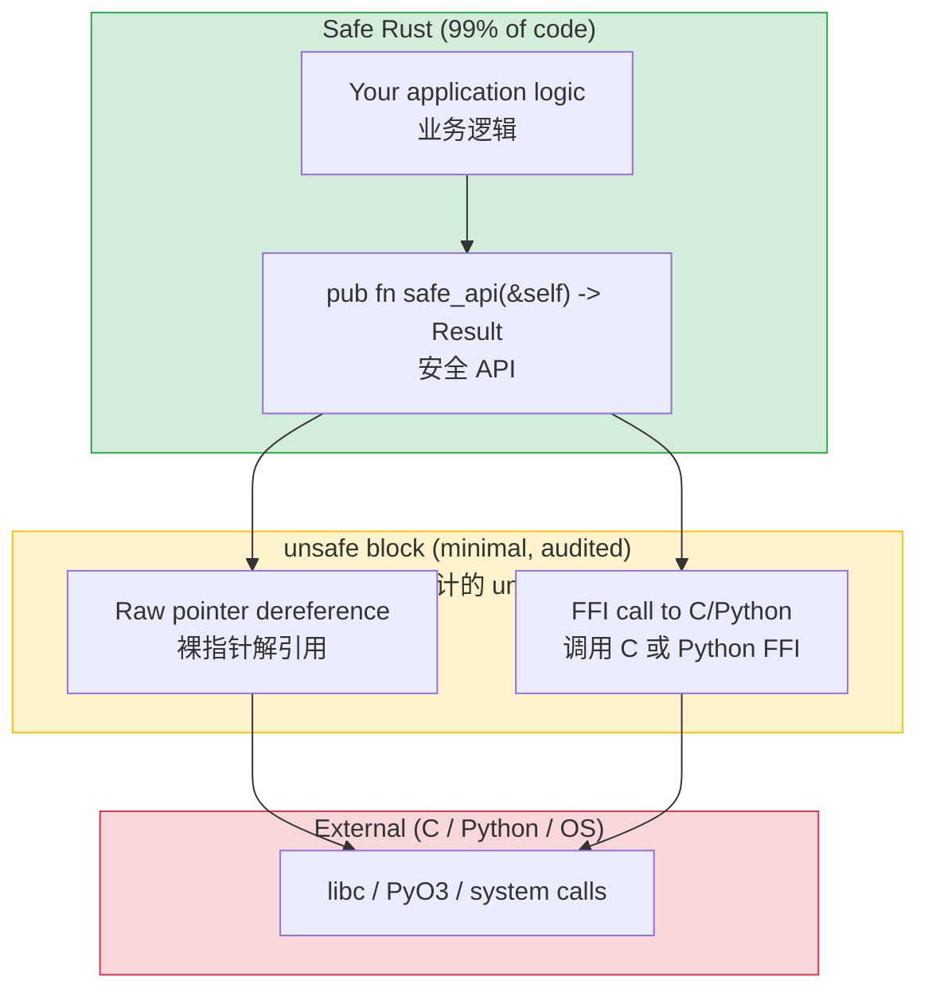

## When and Why to Use Unsafe<br><span class="zh-inline">什么时候该用 `unsafe`，为什么会需要它</span>

> **What you'll learn:** What `unsafe` permits and why it exists, writing Python extensions with PyO3, Rust's testing framework vs pytest, mocking with mockall, and benchmarking basics.<br><span class="zh-inline">**本章将学习：** `unsafe` 允许做什么、它存在的原因、如何用 PyO3 编写 Python 扩展、Rust 测试框架与 pytest 的对应关系、如何用 mockall 做 mock，以及基准测试的基础思路。</span>
>
> **Difficulty:** 🔴 Advanced<br><span class="zh-inline">**难度：** 🔴 高级</span>

`unsafe` in Rust is an escape hatch. It tells the compiler: “This part cannot be fully verified automatically, but the invariants are still my responsibility.” Python has no direct equivalent because Python never hands over raw memory access in the same way.<br><span class="zh-inline">Rust 里的 `unsafe` 本质上是一扇逃生门，意思是：“这一小段编译器没法完全替着验证，但相关不变量依然要由代码作者负责。”Python 没有完全对应的东西，因为它本来就很少把原始内存访问权直接交出来。</span>



> **The pattern**: a small `unsafe` block sits behind a safe API, and callers never have to touch `unsafe` themselves. Python's `ctypes` world is much blurrier; every boundary call is effectively risky by default.<br><span class="zh-inline">**典型模式：** 把一小段 `unsafe` 藏在安全 API 后面，调用方根本看不见 `unsafe`。相比之下，Python 的 `ctypes` 边界通常更模糊，每一次跨边界调用都默认带着风险。</span>
>
> 📌 **See also**: [Ch. 13 — Concurrency](ch13-concurrency.md) introduces `Send` and `Sync`, which are `unsafe` auto-traits checked by the compiler to keep threaded code sound.<br><span class="zh-inline">📌 **延伸阅读：** [第 13 章——并发](ch13-concurrency.md) 里提到的 `Send` 和 `Sync`，本质上也是和 `unsafe` 语义紧密相关的自动 trait，编译器会借它们保证并发代码的正确性。</span>

### What `unsafe` Allows<br><span class="zh-inline">`unsafe` 允许做什么</span>

```rust
// unsafe lets you do FIVE things that safe Rust forbids:
// 1. Dereference raw pointers
// 2. Call unsafe functions/methods
// 3. Access mutable static variables
// 4. Implement unsafe traits
// 5. Access union fields

// Example: calling a C function
extern "C" {
    fn abs(input: i32) -> i32;
}

fn main() {
    // SAFETY: abs() is a well-defined C standard library function.
    let result = unsafe { abs(-42) };  // Safe Rust can't verify C code
    println!("{result}");               // 42
}
```

### When to Use `unsafe`<br><span class="zh-inline">什么时候该用 `unsafe`</span>

```rust
// 1. FFI — calling C libraries (most common reason)
// 2. Performance-critical inner loops (rare)
// 3. Data structures the borrow checker can't express (rare)

// As a Python developer, you'll mostly encounter unsafe in:
// - PyO3 internals (Python ↔ Rust bridge)
// - C library bindings
// - Low-level system calls

// Rule of thumb: if you're writing application code (not library code),
// you should almost never need unsafe. If you think you do, ask in the
// Rust community first — there's usually a safe alternative.
```

日常应用代码里，`unsafe` 的出场率应该低得可怜。要是三天两头就想往里加 `unsafe`，多半是设计先跑偏了，不是编译器太严格。<br><span class="zh-inline">In day-to-day application code, `unsafe` should be rare. If it starts showing up everywhere, that is usually a sign that the design needs rethinking rather than that Rust is “being too strict.”</span>

***

## PyO3: Rust Extensions for Python<br><span class="zh-inline">PyO3：给 Python 写 Rust 扩展</span>

PyO3 is the main bridge between Python and Rust. It lets Rust functions and types appear as ordinary Python-callable modules, which is exactly what many Python developers need when speeding up hot paths.<br><span class="zh-inline">PyO3 是 Python 和 Rust 之间最常用的桥。它能让 Rust 函数和类型直接变成 Python 可调用模块，这对想给 Python 热点逻辑提速的人来说非常实用。</span>

### Creating a Python Extension in Rust<br><span class="zh-inline">用 Rust 创建 Python 扩展</span>

```bash
# Setup
pip install maturin    # Build tool for Rust Python extensions
maturin init           # Creates project structure

# Project structure:
# my_extension/
# ├── Cargo.toml
# ├── pyproject.toml
# └── src/
#     └── lib.rs
```

```toml
# Cargo.toml
[package]
name = "my_extension"
version = "0.1.0"
edition = "2021"

[lib]
crate-type = ["cdylib"]    # Shared library for Python

[dependencies]
pyo3 = { version = "0.22", features = ["extension-module"] }
```

```rust
// src/lib.rs — Rust functions callable from Python
use pyo3::prelude::*;

/// A fast Fibonacci function written in Rust.
#[pyfunction]
fn fibonacci(n: u64) -> u64 {
    let (mut a, mut b) = (0u64, 1u64);
    for _ in 0..n {
        let temp = b;
        b = a.wrapping_add(b);
        a = temp;
    }
    a
}

/// Find all prime numbers up to n (Sieve of Eratosthenes).
#[pyfunction]
fn primes_up_to(n: usize) -> Vec<usize> {
    let mut is_prime = vec![true; n + 1];
    is_prime[0] = false;
    if n > 0 { is_prime[1] = false; }
    for i in 2..=((n as f64).sqrt() as usize) {
        if is_prime[i] {
            for j in (i * i..=n).step_by(i) {
                is_prime[j] = false;
            }
        }
    }
    (2..=n).filter(|&i| is_prime[i]).collect()
}

/// A Rust class usable from Python.
#[pyclass]
struct Counter {
    value: i64,
}

#[pymethods]
impl Counter {
    #[new]
    fn new(start: i64) -> Self {
        Counter { value: start }
    }

    fn increment(&mut self) {
        self.value += 1;
    }

    fn get_value(&self) -> i64 {
        self.value
    }

    fn __repr__(&self) -> String {
        format!("Counter(value={})", self.value)
    }
}

/// The Python module definition.
#[pymodule]
fn my_extension(m: &Bound<'_, PyModule>) -> PyResult<()> {
    m.add_function(wrap_pyfunction!(fibonacci, m)?)?;
    m.add_function(wrap_pyfunction!(primes_up_to, m)?)?;
    m.add_class::<Counter>()?;
    Ok(())
}
```

### Using from Python<br><span class="zh-inline">在 Python 里使用</span>

```bash
# Build and install:
maturin develop --release   # Builds and installs into current venv
```

```python
# Python — use the Rust extension like any Python module
import my_extension

# Call Rust function
result = my_extension.fibonacci(50)
print(result)  # 12586269025 — computed in microseconds

# Use Rust class
counter = my_extension.Counter(0)
counter.increment()
counter.increment()
print(counter.get_value())  # 2
print(counter)              # Counter(value=2)

# Performance comparison:
import time

# Python version
def py_primes(n):
    sieve = [True] * (n + 1)
    for i in range(2, int(n**0.5) + 1):
        if sieve[i]:
            for j in range(i*i, n+1, i):
                sieve[j] = False
    return [i for i in range(2, n+1) if sieve[i]]

start = time.perf_counter()
py_result = py_primes(10_000_000)
py_time = time.perf_counter() - start

start = time.perf_counter()
rs_result = my_extension.primes_up_to(10_000_000)
rs_time = time.perf_counter() - start

print(f"Python: {py_time:.3f}s")    # ~3.5s
print(f"Rust:   {rs_time:.3f}s")    # ~0.05s — 70x faster!
print(f"Same results: {py_result == rs_result}")  # True
```

### PyO3 Quick Reference<br><span class="zh-inline">PyO3 速查表</span>

| Python Concept | PyO3 Attribute | Notes<br><span class="zh-inline">说明</span> |
|---------------|----------------|-------|
| Function | `#[pyfunction]` | Exposed to Python<br><span class="zh-inline">暴露给 Python</span> |
| Class | `#[pyclass]` | Python-visible class<br><span class="zh-inline">Python 可见类</span> |
| Method | `#[pymethods]` | Methods on a pyclass<br><span class="zh-inline">类方法集合</span> |
| `__init__` | `#[new]` | Constructor<br><span class="zh-inline">构造函数</span> |
| `__repr__` | `fn __repr__()` | String representation<br><span class="zh-inline">调试字符串表示</span> |
| `__str__` | `fn __str__()` | Display string<br><span class="zh-inline">显示字符串</span> |
| `__len__` | `fn __len__()` | Length<br><span class="zh-inline">长度</span> |
| `__getitem__` | `fn __getitem__()` | Indexing<br><span class="zh-inline">下标访问</span> |
| Property | `#[getter]` / `#[setter]` | Attribute access<br><span class="zh-inline">属性访问</span> |
| Static method | `#[staticmethod]` | No self<br><span class="zh-inline">无 `self`</span> |
| Class method | `#[classmethod]` | Takes `cls`<br><span class="zh-inline">接收类对象</span> |

### FFI Safety Patterns<br><span class="zh-inline">FFI 安全模式</span>

When exposing Rust to Python or C, these rules avoid the most common disasters.<br><span class="zh-inline">当 Rust 要暴露给 Python 或 C 使用时，下面这些规则能挡住最常见的爆炸现场。</span>

1. **Never let a panic cross the FFI boundary**. PyO3 handles this for `#[pyfunction]`, but raw `extern "C"` functions must catch panics manually.

```rust
#[no_mangle]
pub extern "C" fn raw_ffi_function() -> i32 {
    match std::panic::catch_unwind(|| {
        // actual logic
        42
    }) {
        Ok(result) => result,
        Err(_) => -1,  // Return error code instead of panicking into C/Python
    }
}
```

<span class="zh-inline">1. **绝对别让 panic 穿过 FFI 边界。** `#[pyfunction]` 这类接口 PyO3 会帮着兜住，但裸写 `extern "C"` 时，必须手动 `catch_unwind`。</span>

2. **Use `#[repr(C)]` for shared structs** when another language reads the fields directly. Otherwise the内存布局就没有稳定保证。

<span class="zh-inline">2. **跨语言共享字段布局时，一定加 `#[repr(C)]`。** 如果对方语言要直接按字段读结构体，没这个注解就别指望布局稳定。</span>

3. **Use `extern "C"` for raw FFI functions** so the calling convention matches. PyO3 hides this for Python-facing functions.

<span class="zh-inline">3. **原始 FFI 函数要用 `extern "C"`。** 这样调用约定才一致。PyO3 对面向 Python 的函数会把这些底层细节包起来。</span>

> **PyO3 advantage**: PyO3 automatically handles panic conversion, type marshalling, and much of the GIL interaction. Unless there is a very specific low-level requirement, it is far better than hand-rolled raw FFI.<br><span class="zh-inline">**PyO3 的优势：** 它会替着处理 panic 转换、类型转换和大量 GIL 相关细节。除非真有非常底层的特殊要求，否则一般都比手搓裸 FFI 舒服得多。</span>

***

## Unit Tests vs pytest<br><span class="zh-inline">单元测试与 pytest 对照</span>

### Python Testing with pytest<br><span class="zh-inline">Python 里用 pytest</span>

```python
# test_calculator.py
import pytest
from calculator import add, divide

def test_add():
    assert add(2, 3) == 5

def test_add_negative():
    assert add(-1, 1) == 0

def test_divide():
    assert divide(10, 2) == 5.0

def test_divide_by_zero():
    with pytest.raises(ZeroDivisionError):
        divide(1, 0)

# Parameterized tests
@pytest.mark.parametrize("a,b,expected", [
    (1, 2, 3),
    (0, 0, 0),
    (-1, -1, -2),
    (100, 200, 300),
])
def test_add_parametrized(a, b, expected):
    assert add(a, b) == expected

# Fixtures
@pytest.fixture
def sample_data():
    return [1, 2, 3, 4, 5]

def test_sum(sample_data):
    assert sum(sample_data) == 15
```

```bash
# Running tests
pytest                      # Run all tests
pytest test_calculator.py   # Run one file
pytest -k "test_add"        # Run matching tests
pytest -v                   # Verbose output
pytest --tb=short           # Short tracebacks
```

### Rust Built-in Testing<br><span class="zh-inline">Rust 内建测试框架</span>

```rust
// src/calculator.rs — tests live in the SAME file!
fn add(a: i32, b: i32) -> i32 {
    a + b
}

fn divide(a: f64, b: f64) -> Result<f64, String> {
    if b == 0.0 {
        Err("Division by zero".to_string())
    } else {
        Ok(a / b)
    }
}

// Tests go in a #[cfg(test)] module — only compiled during `cargo test`
#[cfg(test)]
mod tests {
    use super::*;  // Import everything from parent module

    #[test]
    fn test_add() {
        assert_eq!(add(2, 3), 5);
    }

    #[test]
    fn test_add_negative() {
        assert_eq!(add(-1, 1), 0);
    }

    #[test]
    fn test_divide() {
        assert_eq!(divide(10.0, 2.0), Ok(5.0));
    }

    #[test]
    fn test_divide_by_zero() {
        assert!(divide(1.0, 0.0).is_err());
    }

    // Test that something panics (like pytest.raises)
    #[test]
    #[should_panic(expected = "out of bounds")]
    fn test_out_of_bounds() {
        let v = vec![1, 2, 3];
        let _ = v[99];  // Panics
    }
}
```

```bash
# Running tests
cargo test                         # Run all tests
cargo test test_add                # Run matching tests
cargo test -- --nocapture          # Show println! output
cargo test -p my_crate             # Test one crate in workspace
cargo test -- --test-threads=1     # Sequential (for tests with side effects)
```

### Testing Quick Reference<br><span class="zh-inline">测试速查表</span>

| pytest | Rust | Notes<br><span class="zh-inline">说明</span> |
|--------|------|-------|
| `assert x == y` | `assert_eq!(x, y)` | Equality<br><span class="zh-inline">相等断言</span> |
| `assert x != y` | `assert_ne!(x, y)` | Inequality<br><span class="zh-inline">不相等断言</span> |
| `assert condition` | `assert!(condition)` | Boolean check<br><span class="zh-inline">布尔条件断言</span> |
| `assert condition, "msg"` | `assert!(condition, "msg")` | With message<br><span class="zh-inline">带消息</span> |
| `pytest.raises(E)` | `#[should_panic]` | Expect panic<br><span class="zh-inline">预期 panic</span> |
| `@pytest.fixture` | Helper setup code | No built-in fixture system<br><span class="zh-inline">标准库没有完全对等的 fixture 机制</span> |
| `@pytest.mark.parametrize` | `rstest` crate | Parameterized tests<br><span class="zh-inline">参数化测试</span> |
| `conftest.py` | `tests/common/mod.rs` | Shared helpers<br><span class="zh-inline">共享测试辅助</span> |
| `pytest.skip()` | `#[ignore]` | Skip a test<br><span class="zh-inline">跳过测试</span> |
| `tmp_path` fixture | `tempfile` crate | Temporary directories<br><span class="zh-inline">临时目录</span> |

***

## Parameterized Tests with rstest<br><span class="zh-inline">用 `rstest` 写参数化测试</span>

```rust
// Cargo.toml: rstest = "0.23"

use rstest::rstest;

// Like @pytest.mark.parametrize
#[rstest]
#[case(1, 2, 3)]
#[case(0, 0, 0)]
#[case(-1, -1, -2)]
#[case(100, 200, 300)]
fn test_add(#[case] a: i32, #[case] b: i32, #[case] expected: i32) {
    assert_eq!(add(a, b), expected);
}

// Like @pytest.fixture
use rstest::fixture;

#[fixture]
fn sample_data() -> Vec<i32> {
    vec![1, 2, 3, 4, 5]
}

#[rstest]
fn test_sum(sample_data: Vec<i32>) {
    assert_eq!(sample_data.iter().sum::<i32>(), 15);
}
```

***

## Mocking with mockall<br><span class="zh-inline">用 mockall 做 mock</span>

```python
# Python — mocking with unittest.mock
from unittest.mock import Mock, patch

def test_fetch_user():
    mock_db = Mock()
    mock_db.get_user.return_value = {"name": "Alice"}

    result = fetch_user_name(mock_db, 1)
    assert result == "Alice"
    mock_db.get_user.assert_called_once_with(1)
```

```rust
// Rust — mocking with mockall crate
// Cargo.toml: mockall = "0.13"

use mockall::{automock, predicate::*};

#[automock]                          // Generates MockDatabase automatically
trait Database {
    fn get_user(&self, id: i64) -> Option<User>;
}

fn fetch_user_name(db: &dyn Database, id: i64) -> Option<String> {
    db.get_user(id).map(|u| u.name)
}

#[test]
fn test_fetch_user() {
    let mut mock = MockDatabase::new();
    mock.expect_get_user()
        .with(eq(1))                   // assert_called_with(1)
        .times(1)                      // assert_called_once
        .returning(|_| Some(User { name: "Alice".into() }));

    let result = fetch_user_name(&mock, 1);
    assert_eq!(result, Some("Alice".to_string()));
}
```

mockall 和 Python 的 `unittest.mock` 不同，它不是到处临时打补丁，而是鼓励先把依赖抽象成 trait，再对 trait 生成 mock。麻烦一点，但结构更健康。<br><span class="zh-inline">mockall works differently from Python’s `unittest.mock`. Instead of patching symbols all over the place, it encourages modeling dependencies as traits and generating mocks from those interfaces, which is more explicit and usually healthier for the design.</span>

---

## Exercises<br><span class="zh-inline">练习</span>

<details>
<summary><strong>🏋️ Exercise: Safe Wrapper Around Unsafe</strong><br><span class="zh-inline"><strong>🏋️ 练习：给 `unsafe` 套一层安全包装</strong></span></summary>

**Challenge**: Write a safe function `split_at_mid` that takes a `&mut [i32]` and returns two mutable slices split at the midpoint. Internally, use raw pointers and `unsafe`, similar to how `split_at_mut` works, but present a safe API to callers.<br><span class="zh-inline">**挑战**：写一个安全函数 `split_at_mid`，接收 `&mut [i32]` 并在中点拆成两个可变切片返回。内部允许使用裸指针和 `unsafe`，模仿 `split_at_mut` 的实现思路，但对调用方暴露的接口必须是安全的。</span>

<details>
<summary>🔑 Solution<br><span class="zh-inline">🔑 参考答案</span></summary>

```rust
fn split_at_mid(slice: &mut [i32]) -> (&mut [i32], &mut [i32]) {
    let mid = slice.len() / 2;
    let ptr = slice.as_mut_ptr();
    let len = slice.len();

    assert!(mid <= len); // Safety check before unsafe

    unsafe {
        // SAFETY: mid <= len (asserted above), and ptr comes from a valid &mut slice,
        // so both sub-slices are within bounds and non-overlapping.
        (
            std::slice::from_raw_parts_mut(ptr, mid),
            std::slice::from_raw_parts_mut(ptr.add(mid), len - mid),
        )
    }
}

fn main() {
    let mut data = vec![1, 2, 3, 4, 5, 6];
    let (left, right) = split_at_mid(&mut data);
    left[0] = 99;
    right[0] = 88;
    println!("left: {left:?}, right: {right:?}");
    // left: [99, 2, 3], right: [88, 5, 6]
}
```

**Key takeaway**: Keep the `unsafe` block tiny, guard it with explicit checks, and expose only a safe interface outward. That is the standard Rust pattern: unsafe internals, safe public API.<br><span class="zh-inline">**核心收获：** `unsafe` 块要尽量小，前面要有明确校验，对外只暴露安全接口。这就是 Rust 处理不安全代码的标准套路：内部不安全，外部安全。</span>

</details>
</details>

***
