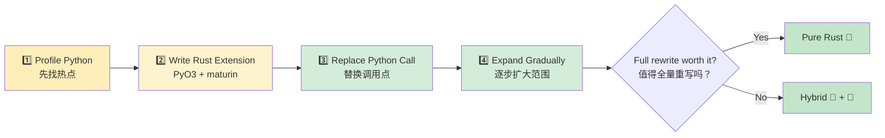

## Common Python Patterns in Rust<br><span class="zh-inline">Rust 中对应的常见 Python 模式</span>

> **What you'll learn:** How to translate `dict` into `struct`, `class` into `struct + impl`, list comprehensions into iterator chains, decorators into traits or wrappers, and context managers into `Drop` / RAII. Also included: essential crates and an incremental migration strategy.<br><span class="zh-inline">**本章将学习：** 如何把 `dict` 迁移成 `struct`，把 `class` 迁移成 `struct + impl`，把列表推导式迁移成迭代器链，把装饰器迁移成 trait 或包装函数，以及把上下文管理器迁移成 `Drop` / RAII。同时还会补充常用 crate 和渐进式迁移策略。</span>
>
> **Difficulty:** 🟡 Intermediate<br><span class="zh-inline">**难度：** 🟡 进阶</span>

### Dictionary → Struct<br><span class="zh-inline">字典 → 结构体</span>

```python
# Python — dict as data container (very common)
user = {
    "name": "Alice",
    "age": 30,
    "email": "alice@example.com",
    "active": True,
}
print(user["name"])
```

```rust
// Rust — struct with named fields
#[derive(Debug, Clone, serde::Serialize, serde::Deserialize)]
struct User {
    name: String,
    age: i32,
    email: String,
    active: bool,
}

let user = User {
    name: "Alice".into(),
    age: 30,
    email: "alice@example.com".into(),
    active: true,
};
println!("{}", user.name);
```

When Python code uses dictionaries as “free-form data bags”, Rust usually wants a named struct instead. That looks stricter, but it pays off in discoverability, tooling, and compile-time validation.<br><span class="zh-inline">当 Python 把字典当成“随手塞字段的数据袋”时，Rust 一般更倾向于用具名结构体来承载。这样确实更严格，但换来的是更强的可读性、工具支持和编译期校验。</span>

### Context Manager → RAII (`Drop`)<br><span class="zh-inline">上下文管理器 → RAII（`Drop`）</span>

```python
# Python — context manager for resource cleanup
class FileManager:
    def __init__(self, path):
        self.file = open(path, 'w')

    def __enter__(self):
        return self.file

    def __exit__(self, *args):
        self.file.close()

with FileManager("output.txt") as f:
    f.write("hello")
```

```rust
// Rust — RAII: Drop trait runs when value goes out of scope
use std::fs::File;
use std::io::Write;

fn write_file() -> std::io::Result<()> {
    let mut file = File::create("output.txt")?;
    file.write_all(b"hello")?;
    Ok(())
    // File closes automatically when `file` leaves scope
}
```

Rust relies on scope-based cleanup rather than explicit `with` syntax. Once ownership leaves scope, the resource is cleaned up deterministically.<br><span class="zh-inline">Rust 靠的是基于作用域的资源回收，而不是单独的 `with` 语法。所有者一旦离开作用域，资源就会按确定顺序被清理。</span>

### Decorator → Higher-Order Function or Macro<br><span class="zh-inline">装饰器 → 高阶函数或宏</span>

```python
# Python — decorator for timing
import functools, time

def timed(func):
    @functools.wraps(func)
    def wrapper(*args, **kwargs):
        start = time.perf_counter()
        result = func(*args, **kwargs)
        elapsed = time.perf_counter() - start
        print(f"{func.__name__} took {elapsed:.4f}s")
        return result
    return wrapper

@timed
def slow_function():
    time.sleep(1)
```

```rust
// Rust — no decorators, use wrapper functions or macros
use std::time::Instant;

fn timed<F, R>(name: &str, f: F) -> R
where
    F: FnOnce() -> R,
{
    let start = Instant::now();
    let result = f();
    println!("{} took {:.4?}", name, start.elapsed());
    result
}

let result = timed("slow_function", || {
    std::thread::sleep(std::time::Duration::from_secs(1));
    42
});
```

Rust has no direct decorator syntax, but wrapper functions, closures, traits, and macros usually cover the same design space in a more explicit way.<br><span class="zh-inline">Rust 没有和装饰器完全一模一样的语法，但包装函数、闭包、trait、宏这些组合起来，通常能覆盖同样的设计需求，只是写法更显式。</span>

### Iterator Pipeline (Data Processing)<br><span class="zh-inline">迭代器流水线（数据处理）</span>

```python
# Python — chain of transformations
import csv
from collections import Counter

def analyze_sales(filename):
    with open(filename) as f:
        reader = csv.DictReader(f)
        sales = [
            row for row in reader
            if float(row["amount"]) > 100
        ]
    by_region = Counter(sale["region"] for sale in sales)
    top_regions = by_region.most_common(5)
    return top_regions
```

```rust
// Rust — iterator chains with strong types
use std::collections::HashMap;

#[derive(Debug, serde::Deserialize)]
struct Sale {
    region: String,
    amount: f64,
}

fn analyze_sales(filename: &str) -> Vec<(String, usize)> {
    let data = std::fs::read_to_string(filename).unwrap();
    let mut reader = csv::Reader::from_reader(data.as_bytes());

    let mut by_region: HashMap<String, usize> = HashMap::new();
    for sale in reader.deserialize::<Sale>().flatten() {
        if sale.amount > 100.0 {
            *by_region.entry(sale.region).or_insert(0) += 1;
        }
    }

    let mut top: Vec<_> = by_region.into_iter().collect();
    top.sort_by(|a, b| b.1.cmp(&a.1));
    top.truncate(5);
    top
}
```

### Global Config / Singleton<br><span class="zh-inline">全局配置 / 单例</span>

```python
# Python — module-level singleton
import json

class Config:
    _instance = None

    def __new__(cls):
        if cls._instance is None:
            cls._instance = super().__new__(cls)
            with open("config.json") as f:
                cls._instance.data = json.load(f)
        return cls._instance

config = Config()
```

```rust
// Rust — OnceLock for lazy static initialization
use std::sync::OnceLock;
use serde_json::Value;

static CONFIG: OnceLock<Value> = OnceLock::new();

fn get_config() -> &'static Value {
    CONFIG.get_or_init(|| {
        let data = std::fs::read_to_string("config.json")
            .expect("Failed to read config");
        serde_json::from_str(&data)
            .expect("Failed to parse config")
    })
}

let db_host = get_config()["database"]["host"].as_str().unwrap();
```

***

## Essential Crates for Python Developers<br><span class="zh-inline">适合 Python 开发者优先认识的 crate</span>

### Data Processing & Serialization<br><span class="zh-inline">数据处理与序列化</span>

| Task<br><span class="zh-inline">任务</span> | Python | Rust Crate | Notes<br><span class="zh-inline">说明</span> |
|------|--------|-----------|-------|
| JSON | `json` | `serde_json` | Type-safe serialization<br><span class="zh-inline">类型安全的序列化</span> |
| CSV | `csv`, `pandas` | `csv` | Streaming, low memory<br><span class="zh-inline">支持流式处理，内存占用低</span> |
| YAML | `pyyaml` | `serde_yaml` | Config files |
| TOML | `tomllib` | `toml` | Config files |
| Data validation | `pydantic` | `serde` + custom | Compile-time + explicit validation<br><span class="zh-inline">编译期约束配合显式校验</span> |
| Date/time | `datetime` | `chrono` | Full timezone support |
| Regex | `re` | `regex` | Very fast |
| UUID | `uuid` | `uuid` | Same concept |

### Web & Network<br><span class="zh-inline">Web 与网络</span>

| Task<br><span class="zh-inline">任务</span> | Python | Rust Crate | Notes<br><span class="zh-inline">说明</span> |
|------|--------|-----------|-------|
| HTTP client | `requests` | `reqwest` | Async-first<br><span class="zh-inline">异步优先</span> |
| Web framework | `FastAPI` / `Flask` | `axum` / `actix-web` | Very fast |
| WebSocket | `websockets` | `tokio-tungstenite` | Async |
| gRPC | `grpcio` | `tonic` | Full support |
| Database (SQL) | `sqlalchemy` | `sqlx` / `diesel` | Compile-time checked SQL<br><span class="zh-inline">SQL 约束更强</span> |
| Redis | `redis-py` | `redis` | Async support |

### CLI & System<br><span class="zh-inline">命令行与系统工具</span>

| Task<br><span class="zh-inline">任务</span> | Python | Rust Crate | Notes<br><span class="zh-inline">说明</span> |
|------|--------|-----------|-------|
| CLI args | `argparse` / `click` | `clap` | Derive macros |
| Colored output | `colorama` | `colored` | Terminal colors |
| Progress bar | `tqdm` | `indicatif` | Similar UX |
| File watching | `watchdog` | `notify` | Cross-platform |
| Logging | `logging` | `tracing` | Structured and async-friendly |
| Env vars | `os.environ` | `std::env` + `dotenvy` | `.env` support |
| Subprocess | `subprocess` | `std::process::Command` | Built-in |
| Temp files | `tempfile` | `tempfile` | Same name |

### Testing<br><span class="zh-inline">测试</span>

| Task<br><span class="zh-inline">任务</span> | Python | Rust Crate | Notes<br><span class="zh-inline">说明</span> |
|------|--------|-----------|-------|
| Test framework | `pytest` | Built-in + `rstest` | `cargo test` |
| Mocking | `unittest.mock` | `mockall` | Trait-based |
| Property testing | `hypothesis` | `proptest` | Similar idea |
| Snapshot testing | `syrupy` | `insta` | Snapshot approval |
| Benchmarking | `pytest-benchmark` | `criterion` | Statistical approach |
| Code coverage | `coverage.py` | `cargo-tarpaulin` | LLVM-based |

***

## Incremental Adoption Strategy<br><span class="zh-inline">渐进式引入策略</span>



> 📌 **See also**: [Ch. 14 — Unsafe Rust and FFI](ch14-unsafe-rust-and-ffi.md) for the lower-level details behind PyO3 bindings.<br><span class="zh-inline">📌 **延伸阅读：** [第 14 章——Unsafe Rust 与 FFI](ch14-unsafe-rust-and-ffi.md) 会进一步讲 PyO3 绑定背后的底层细节。</span>

### Step 1: Identify Hotspots<br><span class="zh-inline">第一步：先找热点</span>

```python
import cProfile
cProfile.run('main()')

# Or use py-spy:
# py-spy top --pid <python-pid>
# py-spy record -o profile.svg -- python main.py
```

### Step 2: Write Rust Extension for the Hotspot<br><span class="zh-inline">第二步：给热点写 Rust 扩展</span>

```bash
cd my_python_project
maturin init --bindings pyo3
maturin develop --release
```

### Step 3: Replace the Python Call<br><span class="zh-inline">第三步：替换 Python 调用点</span>

```python
# Before:
result = python_hot_function(data)

# After:
import my_rust_extension
result = my_rust_extension.hot_function(data)
```

### Step 4: Expand Gradually<br><span class="zh-inline">第四步：逐步扩大范围</span>

```text
Week 1-2: Replace one CPU-bound function with Rust
Week 3-4: Replace data parsing/validation layer
Month 2:  Replace core data pipeline
Month 3+: Consider full Rust rewrite if benefits justify it

Key principle: keep Python for orchestration, use Rust for computation.
```

<span class="zh-inline">
第 1 到 2 周：先替换一个 CPU 密集函数<br>
第 3 到 4 周：再替换数据解析或校验层<br>
第 2 个月：开始替换核心数据流水线<br>
第 3 个月以后：如果收益足够大，再考虑完整重写
<br><br>
核心原则：Python 继续负责编排与胶水逻辑，Rust 专注高价值计算热点。
</span>

---

## 💼 Case Study: Accelerating a Data Pipeline with PyO3<br><span class="zh-inline">案例：用 PyO3 加速数据流水线</span>

A fintech startup processes 2GB of transaction CSV data every day. The slowest part is validation plus transformation.<br><span class="zh-inline">一个金融科技团队每天要处理 2GB 交易 CSV。最慢的部分是校验和转换逻辑。</span>

```python
# Python — the slow part (~12 minutes for 2GB)
import csv
from decimal import Decimal
from datetime import datetime

def validate_and_transform(filepath: str) -> list[dict]:
    results = []
    with open(filepath) as f:
        reader = csv.DictReader(f)
        for row in reader:
            amount = Decimal(row["amount"])
            if amount < 0:
                raise ValueError(f"Negative amount: {amount}")
            date = datetime.strptime(row["date"], "%Y-%m-%d")
            category = categorize(row["merchant"])

            results.append({
                "amount_cents": int(amount * 100),
                "date": date.isoformat(),
                "category": category,
                "merchant": row["merchant"].strip().lower(),
            })
    return results
```

**Step 1**: Profile first and confirm that CSV parsing, decimal conversion, and string matching dominate runtime.<br><span class="zh-inline">**第一步**：先 profile，确认耗时主要集中在 CSV 解析、金额转换和字符串匹配上。</span>

**Step 2**: Move the hotspot into a Rust extension.<br><span class="zh-inline">**第二步**：把热点逻辑搬进 Rust 扩展。</span>

```rust
// src/lib.rs — PyO3 extension
use pyo3::prelude::*;
use pyo3::types::PyList;
use std::fs::File;
use std::io::BufReader;

#[derive(Debug)]
struct Transaction {
    amount_cents: i64,
    date: String,
    category: String,
    merchant: String,
}

fn categorize(merchant: &str) -> &'static str {
    if merchant.contains("amazon") { "shopping" }
    else if merchant.contains("uber") || merchant.contains("lyft") { "transport" }
    else if merchant.contains("starbucks") { "food" }
    else { "other" }
}

#[pyfunction]
fn process_transactions(path: &str) -> PyResult<Vec<(i64, String, String, String)>> {
    let file = File::open(path).map_err(|e| pyo3::exceptions::PyIOError::new_err(e.to_string()))?;
    let mut reader = csv::Reader::from_reader(BufReader::new(file));

    let mut results = Vec::with_capacity(15_000_000);

    for record in reader.records() {
        let record = record.map_err(|e| pyo3::exceptions::PyValueError::new_err(e.to_string()))?;
        let amount_str = &record[0];
        let amount_cents = parse_amount_cents(amount_str)?;
        let date = &record[1];
        let merchant = record[2].trim().to_lowercase();
        let category = categorize(&merchant).to_string();

        results.push((amount_cents, date.to_string(), category, merchant));
    }
    Ok(results)
}

#[pymodule]
fn fast_pipeline(_py: Python, m: &PyModule) -> PyResult<()> {
    m.add_function(wrap_pyfunction!(process_transactions, m)?)?;
    Ok(())
}
```

**Step 3**: Replace one call in Python and keep everything else the same.<br><span class="zh-inline">**第三步**：只换掉 Python 里一个调用点，其余逻辑保持原样。</span>

```python
# Before:
results = validate_and_transform("transactions.csv")

# After:
import fast_pipeline
results = fast_pipeline.process_transactions("transactions.csv")
```

**Results**:<br><span class="zh-inline">**结果：**</span>

| Metric<br><span class="zh-inline">指标</span> | Python | Rust |
|--------|--------|------|
| Time (2GB / 15M rows)<br><span class="zh-inline">耗时</span> | 12 minutes | 45 seconds |
| Peak memory<br><span class="zh-inline">峰值内存</span> | 6GB / 2GB | 200MB |
| Lines changed in Python<br><span class="zh-inline">Python 改动行数</span> | — | 1 |
| Rust code written<br><span class="zh-inline">新增 Rust 代码</span> | — | ~60 lines |
| Tests passing<br><span class="zh-inline">测试通过</span> | 47/47 | 47/47 |

> **Key lesson**: Most teams do not need a full rewrite. Replacing the small fraction of code that consumes most of the runtime often captures most of the practical benefit.<br><span class="zh-inline">**关键教训**：大多数团队根本不需要全量重写。只替换那一小部分最耗时的代码，往往就已经吃到了绝大多数收益。</span>

---

## Exercises<br><span class="zh-inline">练习</span>

<details>
<summary><strong>🏋️ Exercise: Migration Decision Matrix</strong><br><span class="zh-inline"><strong>🏋️ 练习：迁移决策矩阵</strong></span></summary>

**Challenge**: For each component of a Python web application below, decide whether it should stay in Python, move to Rust, or be bridged through PyO3. Give a short reason.<br><span class="zh-inline">**挑战**：下面列出的是一个 Python Web 应用的不同组件。分别判断它们应该保留在 Python、重写成 Rust，还是通过 PyO3 桥接，并简要说明理由。</span>

1. Flask route handlers<br><span class="zh-inline">1. Flask 路由处理器</span>
2. Image thumbnail generation<br><span class="zh-inline">2. 图片缩略图生成</span>
3. SQLAlchemy ORM queries<br><span class="zh-inline">3. SQLAlchemy ORM 查询</span>
4. Nightly CSV parsing for 2GB financial files<br><span class="zh-inline">4. 每晚解析 2GB 金融 CSV</span>
5. Admin dashboard templates<br><span class="zh-inline">5. 管理后台模板页</span>

<details>
<summary>🔑 Solution<br><span class="zh-inline">🔑 参考答案</span></summary>

| Component<br><span class="zh-inline">组件</span> | Decision<br><span class="zh-inline">决策</span> | Rationale<br><span class="zh-inline">理由</span> |
|---|---|---|
| Flask route handlers | 🐍 Keep Python | I/O-bound, framework-heavy, low performance return<br><span class="zh-inline">偏 I/O、强框架绑定，迁移收益通常不高</span> |
| Image thumbnail generation | 🦀 PyO3 bridge | CPU-bound hotspot with clear boundary<br><span class="zh-inline">CPU 热点明确，边界清晰，很适合桥接</span> |
| Database ORM queries | 🐍 Keep Python | ORM 生态成熟，而且主要是 I/O 等待<br><span class="zh-inline">成熟 ORM 生态优势明显，且核心瓶颈通常不是 CPU</span> |
| CSV parser (2GB) | 🦀 PyO3 bridge or full Rust | CPU + memory sensitive, Rust parsing shines<br><span class="zh-inline">既吃 CPU 又吃内存，Rust 在这里非常强</span> |
| Admin dashboard | 🐍 Keep Python | Mostly UI and templates, little execution pressure<br><span class="zh-inline">主要是界面和模板逻辑，执行性能不是重点</span> |

**Key takeaway**: The best migration targets are usually CPU-heavy, performance-sensitive components with clean interfaces. Glue code and framework-heavy request handlers often stay more economical in Python.<br><span class="zh-inline">**核心收获**：最值得迁移的部分，通常是 CPU 密集、性能敏感、边界清晰的组件。至于胶水代码和强框架绑定的请求处理逻辑，继续留在 Python 往往更划算。</span>

</details>
</details>

***
