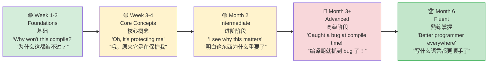

## Idiomatic Rust for Python Developers<br><span class="zh-inline">面向 Python 开发者的地道 Rust 写法</span>

> **What you'll learn:** Top 10 habits to build, common pitfalls with fixes, a structured 3-month learning path, the complete Python→Rust "Rosetta Stone" reference table, and recommended learning resources.<br><span class="zh-inline">**本章将学习：** 需要尽快养成的 10 个习惯、常见误区及修正方法、为期 3 个月的学习路线、完整的 Python→Rust 对照表，以及推荐学习资源。</span>
>
> **Difficulty:** 🟡 Intermediate<br><span class="zh-inline">**难度：** 🟡 中级</span>



### Top 10 Habits to Build<br><span class="zh-inline">最该尽快养成的 10 个习惯</span>

1. **Use `match` on enums instead of `if isinstance()`**<br><span class="zh-inline">**遇到枚举时优先用 `match`，别再沿用 `if isinstance()` 的脑回路。**</span>

   ```python
   # Python                              # Rust
   if isinstance(shape, Circle): ...     match shape { Shape::Circle(r) => ... }
   ```

2. **Let the compiler guide you** — Read error messages carefully. Rust's compiler is among the best available: it explains both the problem and the likely fix.<br><span class="zh-inline">**让编译器带路。** 认真读错误信息。Rust 编译器给出的信息质量极高，通常既指出问题，也提示修正方向。</span>

3. **Prefer `&str` over `String` in function parameters** — Accept the most general string view when ownership is unnecessary. `&str` covers both `String` and string literals.<br><span class="zh-inline">**函数参数能写 `&str` 就尽量别写 `String`。** 如果函数并不需要拿走所有权，就接收更通用的字符串视图。`&str` 同时兼容 `String` 和字符串字面量。</span>

4. **Use iterators instead of index loops** — Iterator chains are more idiomatic and often faster than `for i in 0..vec.len()`.<br><span class="zh-inline">**能用迭代器就别写索引循环。** 迭代器链更符合 Rust 风格，很多时候也比 `for i in 0..vec.len()` 更高效。</span>

5. **Embrace `Option` and `Result`** — Avoid `.unwrap()` everywhere. Reach for `?`, `map`, `and_then`, and `unwrap_or_else`.<br><span class="zh-inline">**接受 `Option` 和 `Result` 这套表达方式。** 别什么都 `.unwrap()`，多用 `?`、`map`、`and_then`、`unwrap_or_else`。</span>

6. **Derive traits liberally** — `#[derive(Debug, Clone, PartialEq)]` belongs on many structs. It costs little and helps debugging and testing.<br><span class="zh-inline">**常见 trait 该派生就派生。** 很多结构体都适合带上 `#[derive(Debug, Clone, PartialEq)]`，成本很低，对调试和测试很有帮助。</span>

7. **Use `cargo clippy` religiously** — Treat it like `ruff` for Rust. It catches a surprising number of style and correctness issues.<br><span class="zh-inline">**把 `cargo clippy` 当成日常动作。** 可以把它理解成 Rust 版的 `ruff`，能提前指出大量风格和正确性问题。</span>

8. **Don't fight the borrow checker** — If it keeps pushing back, the data layout or ownership flow likely needs refactoring.<br><span class="zh-inline">**别和借用检查器硬顶。** 如果它一直报错，通常说明数据组织方式或所有权流向还需要重新整理。</span>

9. **Use enums for state machines** — Replace string flags and scattered booleans with enums so the compiler can enforce all states.<br><span class="zh-inline">**状态机优先建模成枚举。** 用 `enum` 代替字符串标记和零散布尔值，让编译器帮忙覆盖所有状态。</span>

10. **Clone first, optimize later** — During the learning stage, using `.clone()` selectively can keep ownership complexity manageable. Optimize only when profiling proves it matters.<br><span class="zh-inline">**先学会，再抠性能。** 刚入门时适当使用 `.clone()` 没问题，先把所有权规则摸顺；只有在性能分析明确表明必要时，再回头压缩克隆次数。</span>

### Common Mistakes from Python Developers<br><span class="zh-inline">Python 开发者最常见的误区</span>

| Mistake<br><span class="zh-inline">误区</span> | Why<br><span class="zh-inline">原因</span> | Fix<br><span class="zh-inline">修正方式</span> |
|---------|-----|-----|
| `.unwrap()` everywhere<br><span class="zh-inline">到处乱用 `.unwrap()`</span> | Panics at runtime<br><span class="zh-inline">运行时可能直接 panic</span> | Use `?` or `match`<br><span class="zh-inline">改用 `?` 或 `match`</span> |
| `String` instead of `&str`<br><span class="zh-inline">参数一上来就写 `String`</span> | Unnecessary allocation<br><span class="zh-inline">引入额外分配</span> | Use `&str` for params<br><span class="zh-inline">参数优先写 `&str`</span> |
| `for i in 0..vec.len()`<br><span class="zh-inline">执着于下标循环</span> | Not idiomatic<br><span class="zh-inline">不符合 Rust 常用写法</span> | `for item in &vec`<br><span class="zh-inline">改成 `for item in &vec`</span> |
| Ignoring clippy warnings<br><span class="zh-inline">无视 clippy 警告</span> | Miss easy improvements<br><span class="zh-inline">错过很多明显改进点</span> | Run `cargo clippy`<br><span class="zh-inline">坚持跑 `cargo clippy`</span> |
| Too many `.clone()` calls<br><span class="zh-inline">`.clone()` 用太多</span> | Performance overhead<br><span class="zh-inline">带来性能负担</span> | Refactor ownership<br><span class="zh-inline">重构所有权设计</span> |
| Giant `main()` function<br><span class="zh-inline">`main()` 写成大杂烩</span> | Hard to test<br><span class="zh-inline">测试困难</span> | Extract into `lib.rs`<br><span class="zh-inline">把逻辑提到 `lib.rs`</span> |
| Not using `#[derive()]`<br><span class="zh-inline">重复造常见 trait 的轮子</span> | Re-inventing the wheel<br><span class="zh-inline">白白增加样板代码</span> | Derive common traits<br><span class="zh-inline">直接派生常见 trait</span> |
| Panicking on errors<br><span class="zh-inline">一出错就 panic</span> | Not recoverable<br><span class="zh-inline">调用方无法恢复</span> | Return `Result<T, E>`<br><span class="zh-inline">改为返回 `Result&lt;T, E&gt;`</span> |

***

## Performance Comparison<br><span class="zh-inline">性能对比</span>

### Benchmark: Common Operations<br><span class="zh-inline">基准测试：常见操作</span>

```text
Operation              Python 3.12    Rust (release)    Speedup
─────────────────────  ────────────   ──────────────    ─────────
Fibonacci(40)          ~25s           ~0.3s             ~80x
Sort 10M integers      ~5.2s          ~0.6s             ~9x
JSON parse 100MB       ~8.5s          ~0.4s             ~21x
Regex 1M matches       ~3.1s          ~0.3s             ~10x
HTTP server (req/s)    ~5,000         ~150,000          ~30x
SHA-256 1GB file       ~12s           ~1.2s             ~10x
CSV parse 1M rows      ~4.5s          ~0.2s             ~22x
String concatenation   ~2.1s          ~0.05s            ~42x
```

<span class="zh-inline">
操作                     Python 3.12      Rust（release）    提升倍数<br>
─────────────────────   ────────────     ──────────────     ────────<br>
Fibonacci(40)           约 25 秒          约 0.3 秒           约 80 倍<br>
排序 1000 万整数         约 5.2 秒         约 0.6 秒           约 9 倍<br>
解析 100MB JSON         约 8.5 秒         约 0.4 秒           约 21 倍<br>
正则匹配 100 万次        约 3.1 秒         约 0.3 秒           约 10 倍<br>
HTTP 服务器吞吐量        约 5,000 req/s   约 150,000 req/s   约 30 倍<br>
SHA-256 处理 1GB 文件    约 12 秒          约 1.2 秒           约 10 倍<br>
CSV 解析 100 万行        约 4.5 秒         约 0.2 秒           约 22 倍<br>
字符串拼接               约 2.1 秒         约 0.05 秒          约 42 倍
</span>

> **Note**: Python with C extensions such as NumPy can narrow the gap dramatically for numerical work. The table above compares pure Python against pure Rust.<br><span class="zh-inline">**说明**：如果 Python 侧使用 NumPy 这类 C 扩展，数值计算上的差距会被大幅缩小。这里的对比主要针对“纯 Python”和“纯 Rust”。</span>

### Memory Usage<br><span class="zh-inline">内存占用</span>

```text
Python:                                 Rust:
─────────                               ─────
- Object header: 28 bytes/object       - No object header
- int: 28 bytes (even for 0)           - i32: 4 bytes, i64: 8 bytes
- str "hello": 54 bytes                - &str "hello": 16 bytes (ptr + len)
- list of 1000 ints: ~36 KB            - Vec<i32>: ~4 KB
  (8 KB pointers + 28 KB int objects)
- dict of 100 items: ~5.5 KB           - HashMap of 100: ~2.4 KB

Total for typical application:
- Python: 50-200 MB baseline           - Rust: 1-5 MB baseline
```

<span class="zh-inline">
Python：<br>
- 每个对象通常带约 28 字节对象头<br>
- `int` 即使是 0，也常常要占约 28 字节<br>
- 字符串 `"hello"` 约 54 字节<br>
- 1000 个整数的列表约 36 KB，其中包含指针和对象本身开销<br>
- 100 项字典约 5.5 KB
<br><br>
Rust：<br>
- 没有统一对象头<br>
- `i32` 为 4 字节，`i64` 为 8 字节<br>
- `&str "hello"` 约 16 字节，存的是指针和长度<br>
- `Vec&lt;i32&gt;` 装 1000 个整数约 4 KB<br>
- 100 项 `HashMap` 约 2.4 KB
<br><br>
典型应用的基线内存：Python 常见在 50 到 200 MB，Rust 常见在 1 到 5 MB。
</span>

***

## Common Pitfalls and Solutions<br><span class="zh-inline">常见坑点与修正方式</span>

### Pitfall 1: "The Borrow Checker Won't Let Me"<br><span class="zh-inline">坑点 1：“借用检查器又不让过”</span>

```rust
// Problem: trying to iterate and modify
let mut items = vec![1, 2, 3, 4, 5];
// for item in &items {
//     if *item > 3 { items.push(*item * 2); }  // ❌ Can't borrow mut while borrowed
// }

// Solution 1: collect changes, apply after
let additions: Vec<i32> = items.iter()
    .filter(|&&x| x > 3)
    .map(|&x| x * 2)
    .collect();
items.extend(additions);

// Solution 2: use retain/extend
items.retain(|&x| x <= 3);
```

The issue is not that Rust is being difficult for no reason. The problem is simultaneous iteration and mutation of the same collection. Split the read phase from the write phase, and the ownership model becomes clear.<br><span class="zh-inline">这里的问题不是 Rust 故意刁难，而是同一个集合在遍历期间又被修改。把“读”和“写”拆开以后，所有权关系就清楚了。</span>

### Pitfall 2: "Too Many String Types"<br><span class="zh-inline">坑点 2：“字符串类型怎么这么多”</span>

```rust
// When in doubt:
// - &str for function parameters
// - String for struct fields and return values
// - &str literals ("hello") work everywhere &str is expected

fn process(input: &str) -> String {    // Accept &str, return String
    format!("Processed: {}", input)
}
```

When uncertain, remember this rule of thumb: use `&str` for input, use `String` for owned stored data and returned values.<br><span class="zh-inline">拿不准时记住这条朴素经验：输入参数优先 `&str`，需要持有的数据和返回值再用 `String`。</span>

### Pitfall 3: "I Miss Python's Simplicity"<br><span class="zh-inline">坑点 3：“还是 Python 一行推导式看着舒服”</span>

```rust
// Python one-liner:
// result = [x**2 for x in data if x > 0]

// Rust equivalent:
let result: Vec<i32> = data.iter()
    .filter(|&&x| x > 0)
    .map(|&x| x * x)
    .collect();

// It's more verbose, but:
// - Type-safe at compile time
// - 10-100x faster
// - No runtime type errors possible
// - Explicit about memory allocation (.collect())
```

Rust usually makes data flow and allocation sites more explicit. The syntax is longer, but that extra surface area buys safety and performance.<br><span class="zh-inline">Rust 往往会把数据流和分配时机写得更明确。语法是长了一些，但换来的正是类型安全和性能可预期性。</span>

### Pitfall 4: "Where's My REPL?"<br><span class="zh-inline">坑点 4：“交互式 REPL 跑哪去了？”</span>

```rust
// Rust has no REPL. Instead:
// 1. Use `cargo test` as your REPL — write small tests to try things
// 2. Use Rust Playground (play.rust-lang.org) for quick experiments
// 3. Use `dbg!()` macro for quick debug output
// 4. Use `cargo watch -x test` for auto-running tests on save

#[test]
fn playground() {
    // Use this as your "REPL" — run with `cargo test playground`
    let result = "hello world"
        .split_whitespace()
        .map(|w| w.to_uppercase())
        .collect::<Vec<_>>();
    dbg!(&result);  // Prints: [src/main.rs:5] &result = ["HELLO", "WORLD"]
}
```

Rust does not lean on a traditional REPL workflow. Small tests, the Playground, and quick debug macros are the practical substitutes.<br><span class="zh-inline">Rust 不是那种高度依赖传统 REPL 的语言。小测试、在线 Playground，以及 `dbg!()` 这类调试宏，基本就是日常试验手感的替代品。</span>

***

## Learning Path and Resources<br><span class="zh-inline">学习路线与资源</span>

### Week 1-2: Foundations<br><span class="zh-inline">第 1 到 2 周：打基础</span>

- [ ] Install Rust and configure VS Code with rust-analyzer.<br><span class="zh-inline">安装 Rust，并在 VS Code 中配置 rust-analyzer。</span>
- [ ] Complete chapters 1-4 of this guide, focusing on types and control flow.<br><span class="zh-inline">完成本指南第 1 到 4 章，重点熟悉类型和控制流。</span>
- [ ] Rewrite 5 small Python scripts in Rust.<br><span class="zh-inline">把 5 个小型 Python 脚本改写成 Rust。</span>
- [ ] Get comfortable with `cargo build`, `cargo test`, and `cargo clippy`.<br><span class="zh-inline">熟悉 `cargo build`、`cargo test` 和 `cargo clippy`。</span>

### Week 3-4: Core Concepts<br><span class="zh-inline">第 3 到 4 周：掌握核心概念</span>

- [ ] Complete chapters 5-8, covering structs, enums, ownership, and modules.<br><span class="zh-inline">完成第 5 到 8 章，掌握结构体、枚举、所有权和模块系统。</span>
- [ ] Rewrite a Python data processing script in Rust.<br><span class="zh-inline">选一个 Python 数据处理脚本，用 Rust 重写。</span>
- [ ] Practice `Option<T>` and `Result<T, E>` until they feel natural.<br><span class="zh-inline">反复练习 `Option&lt;T&gt;` 和 `Result&lt;T, E&gt;`，直到形成直觉。</span>
- [ ] Read compiler errors carefully; they are teaching material, not noise.<br><span class="zh-inline">认真阅读编译器报错，把它当成教学材料，而不是噪声。</span>

### Month 2: Intermediate<br><span class="zh-inline">第 2 个月：进入进阶阶段</span>

- [ ] Complete chapters 9-12 on error handling, traits, and iterators.<br><span class="zh-inline">完成第 9 到 12 章，重点是错误处理、trait 和迭代器。</span>
- [ ] Build a CLI tool with `clap` and `serde`.<br><span class="zh-inline">用 `clap` 和 `serde` 做一个命令行工具。</span>
- [ ] Write a PyO3 extension for a performance hotspot in an existing Python project.<br><span class="zh-inline">为现有 Python 项目的性能热点写一个 PyO3 扩展。</span>
- [ ] Practice iterator chains until they become as natural as comprehensions.<br><span class="zh-inline">反复写迭代器链，直到熟悉到接近 Python 推导式的程度。</span>

### Month 3: Advanced<br><span class="zh-inline">第 3 个月：高级主题</span>

- [ ] Complete chapters 13-16 on concurrency, unsafe code, and testing.<br><span class="zh-inline">完成第 13 到 16 章，重点啃并发、`unsafe` 和测试。</span>
- [ ] Build a web service with `axum` and `tokio`.<br><span class="zh-inline">用 `axum` 和 `tokio` 搭一个 Web 服务。</span>
- [ ] Contribute to an open-source Rust project.<br><span class="zh-inline">挑一个 Rust 开源项目开始贡献。</span>
- [ ] Read *Programming Rust* for deeper understanding.<br><span class="zh-inline">阅读 *Programming Rust*，把理解往深处压一层。</span>

### Recommended Resources<br><span class="zh-inline">推荐资源</span>

- **The Rust Book**: https://doc.rust-lang.org/book/ — the official handbook.<br><span class="zh-inline">**The Rust Book**：官方入门书，最稳的起点。</span>
- **Rust by Example**: https://doc.rust-lang.org/rust-by-example/ — learn through examples.<br><span class="zh-inline">**Rust by Example**：通过例子上手，适合边看边敲。</span>
- **Rustlings**: https://github.com/rust-lang/rustlings — small guided exercises.<br><span class="zh-inline">**Rustlings**：分解成小练习，特别适合强化基础。</span>
- **Rust Playground**: https://play.rust-lang.org/ — online compiler for quick experiments.<br><span class="zh-inline">**Rust Playground**：在线编译器，适合快速试验。</span>
- **This Week in Rust**: https://this-week-in-rust.org/ — ecosystem newsletter.<br><span class="zh-inline">**This Week in Rust**：跟踪生态动态的周刊。</span>
- **PyO3 Guide**: https://pyo3.rs/ — Python and Rust interop guide.<br><span class="zh-inline">**PyO3 Guide**：Python 与 Rust 互操作的主参考资料。</span>
- **Comprehensive Rust**: https://google.github.io/comprehensive-rust/ — structured course material.<br><span class="zh-inline">**Comprehensive Rust**：结构化课程资料，适合系统复习。</span>

### Python → Rust Rosetta Stone<br><span class="zh-inline">Python → Rust 对照表</span>

| Python | Rust | Chapter<br><span class="zh-inline">章节</span> |
|--------|------|---------|
| `list` | `Vec<T>` | 5 |
| `dict` | `HashMap<K,V>` | 5 |
| `set` | `HashSet<T>` | 5 |
| `tuple` | `(T1, T2, ...)` | 5 |
| `class` | `struct` + `impl` | 5 |
| `@dataclass` | `#[derive(...)]` | 5, 12a |
| `Enum` | `enum` | 6 |
| `None` | `Option<T>` | 6 |
| `raise`/`try`/`except` | `Result<T,E>` + `?` | 9 |
| `Protocol` (PEP 544) | `trait` | 10 |
| `TypeVar` | Generic parameters `<T>` | 10 |
| `__dunder__` methods | Traits (`Display`, `Add`, etc.)<br><span class="zh-inline">Trait，例如 `Display`、`Add`</span> | 10 |
| `lambda` | `\|args\| body` | 12 |
| generator `yield` | `impl Iterator` | 12 |
| list comprehension | `.map().filter().collect()` | 12 |
| `@decorator` | Higher-order function or macro<br><span class="zh-inline">高阶函数或宏</span> | 12a, 15 |
| `asyncio` | `tokio` | 13 |
| `threading` | `std::thread` | 13 |
| `multiprocessing` | `rayon` | 13 |
| `unittest.mock` | `mockall` | 14a |
| `pytest` | `cargo test` + `rstest` | 14a |
| `pip install` | `cargo add` | 8 |
| `requirements.txt` | `Cargo.lock` | 8 |
| `pyproject.toml` | `Cargo.toml` | 8 |
| `with` | Scope-based `Drop`<br><span class="zh-inline">基于作用域的 `Drop`</span> | 15 |
| `json.dumps/loads` | `serde_json` | 15 |

***

## Final Thoughts for Python Developers<br><span class="zh-inline">给 Python 开发者的最后几句提醒</span>

```text
What you'll miss from Python:
- REPL and interactive exploration
- Rapid prototyping speed
- Rich ML/AI ecosystem (PyTorch, etc.)
- "Just works" dynamic typing
- pip install and immediate use

What you'll gain from Rust:
- "If it compiles, it works" confidence
- 10-100x performance improvement
- No more runtime type errors
- No more None/null crashes
- True parallelism (no GIL!)
- Single binary deployment
- Predictable memory usage
- The best compiler error messages in any language

The journey:
Week 1:   "Why does the compiler hate me?"
Week 2:   "Oh, it's actually protecting me from bugs"
Month 1:  "I see why this matters"
Month 2:  "I caught a bug at compile time that would've been a production incident"
Month 3:  "I don't want to go back to untyped code"
Month 6:  "Rust has made me a better programmer in every language"
```

<span class="zh-inline">
从 Python 迁移时，最容易怀念的东西：<br>
- REPL 和交互式探索体验<br>
- 原型阶段极高的速度<br>
- 成熟的 ML、AI 生态，比如 PyTorch<br>
- “先写再说”的动态类型体验<br>
- `pip install` 之后马上就能用的轻快感
<br><br>
而 Rust 带来的收益通常更硬核：<br>
- “只要能编过，往往就更靠谱”的信心<br>
- 10 到 100 倍量级的性能提升空间<br>
- 少很多运行时类型错误<br>
- 少很多 `None` 或空值导致的崩溃<br>
- 真正的并行能力，没有 GIL 的天花板<br>
- 单一二进制部署更省心<br>
- 内存占用更可控、更可预测<br>
- 编译器错误信息质量极高
<br><br>
这条路的常见心理变化：<br>
第 1 周：“这编译器怎么谁都不放过？”<br>
第 2 周：“哦，原来它真在替我挡坑。”<br>
第 1 个月：“开始明白这套东西的价值了。”<br>
第 2 个月：“有些线上事故，居然在编译期就能拦住。”<br>
第 3 个月：“再回去写完全无类型约束的代码，会有点不适应。”<br>
第 6 个月：“Rust 反过来提升了写其他语言时的基本功。”
</span>

---

## Exercises<br><span class="zh-inline">练习</span>

<details>
<summary><strong>🏋️ Exercise: Code Review Checklist</strong><br><span class="zh-inline"><strong>🏋️ 练习：代码审查清单</strong></span></summary>

**Challenge**: Review the Rust code below, written by a Python developer, and identify five improvements that would make it more idiomatic.<br><span class="zh-inline">**挑战**：阅读下面这段由 Python 开发者写出的 Rust 代码，指出 5 个可以让它更符合 Rust 风格的改进点。</span>

```rust
fn get_name(names: Vec<String>, index: i32) -> String {
    if index >= 0 && (index as usize) < names.len() {
        return names[index as usize].clone();
    } else {
        return String::from("");
    }
}

fn main() {
    let mut result = String::from("");
    let names = vec!["Alice".to_string(), "Bob".to_string()];
    result = get_name(names.clone(), 0);
    println!("{}", result);
}
```

<details>
<summary>🔑 Solution<br><span class="zh-inline">🔑 参考答案</span></summary>

Five improvements:<br><span class="zh-inline">可以至少指出下面这 5 个改进点：</span>

```rust
// 1. Take &[String] not Vec<String> (don't take ownership of the whole vec)
// 2. Use usize for index (not i32 — indices are always non-negative)
// 3. Return Option<&str> instead of empty string (use the type system!)
// 4. Use .get() instead of bounds-checking manually
// 5. Don't clone() in main — pass a reference

fn get_name(names: &[String], index: usize) -> Option<&str> {
    names.get(index).map(|s| s.as_str())
}

fn main() {
    let names = vec!["Alice".to_string(), "Bob".to_string()];
    match get_name(&names, 0) {
        Some(name) => println!("{name}"),
        None => println!("Not found"),
    }
}
```

**Key takeaway**: The most damaging Python habits in Rust are cloning everything, using sentinel values such as `""`, taking ownership where borrowing is enough, and using signed integers for indexing.<br><span class="zh-inline">**核心收获**：在 Rust 里最伤的几种 Python 习惯，通常是到处克隆、用 `""` 这种哨兵值表达失败、能借用却硬拿所有权，以及用有符号整数做索引。</span>

</details>
</details>

***

*End of Rust for Python Programmers Training Guide*<br><span class="zh-inline">*Rust 面向 Python 程序员训练指南完*</span>
