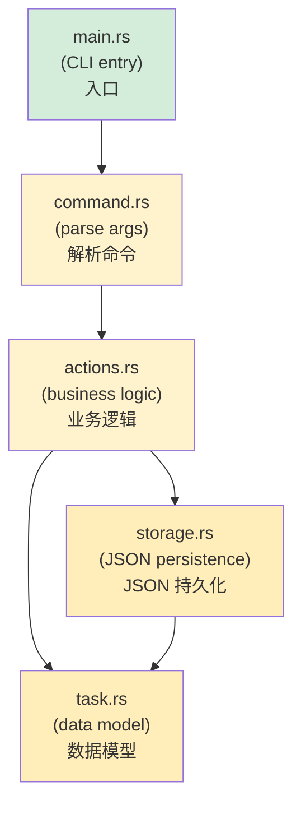

## Capstone Project: Build a CLI Task Manager<br><span class="zh-inline">综合项目：构建一个命令行任务管理器</span>

> **What you'll learn:** Tie together everything from the course by building a complete Rust CLI application that a Python developer might otherwise write with `argparse`、`json`、`pathlib` and a few helper classes.<br><span class="zh-inline">**本章将学习：** 通过实现一个完整的 Rust 命令行应用，把整本书的核心知识串起来。这个程序放在 Python 世界里，大概率会用 `argparse`、`json`、`pathlib` 再加几个辅助类来完成。</span>
>
> **Difficulty:** 🔴 Advanced<br><span class="zh-inline">**难度：** 🔴 高级</span>

This capstone exercises concepts from nearly every major chapter in the book.<br><span class="zh-inline">这个综合项目会把前面几乎所有重要章节都重新调动一遍。</span>

| Chapter | Concept |
|---------|---------|
| **Ch. 3** | Types and variables |
| **Ch. 5** | Collections |
| **Ch. 6** | Enums and pattern matching |
| **Ch. 7** | Ownership and borrowing |
| **Ch. 8** | Modules |
| **Ch. 9** | Error handling |
| **Ch. 10** | Traits |
| **Ch. 11** | Type conversions |
| **Ch. 12** | Iterators and closures |

| 章节 | 用到的概念 |
|------|------------|
| **第 3 章** | 类型与变量 |
| **第 5 章** | 集合 |
| **第 6 章** | 枚举与模式匹配 |
| **第 7 章** | 所有权与借用 |
| **第 8 章** | 模块 |
| **第 9 章** | 错误处理 |
| **第 10 章** | Trait |
| **第 11 章** | 类型转换 |
| **第 12 章** | 迭代器与闭包 |

***

## The Project: `rustdo`<br><span class="zh-inline">项目目标：`rustdo`</span>

A command-line task manager, similar in spirit to the `todo.txt` style tools Python developers often build, storing tasks in a JSON file.<br><span class="zh-inline">这是一个命令行任务管理器，思路上很像 Python 开发者常写的 `todo.txt` 风格小工具，任务数据保存在 JSON 文件里。</span>

### Python Equivalent<br><span class="zh-inline">对应的 Python 写法</span>

```python
#!/usr/bin/env python3
"""A simple CLI task manager — the Python version."""
import json
import sys
from pathlib import Path
from datetime import datetime
from enum import Enum

TASK_FILE = Path.home() / ".rustdo.json"

class Priority(Enum):
    LOW = "low"
    MEDIUM = "medium"
    HIGH = "high"

class Task:
    def __init__(self, id: int, title: str, priority: Priority, done: bool = False):
        self.id = id
        self.title = title
        self.priority = priority
        self.done = done
        self.created = datetime.now().isoformat()

def load_tasks() -> list[Task]:
    if not TASK_FILE.exists():
        return []
    data = json.loads(TASK_FILE.read_text())
    return [Task(**t) for t in data]

def save_tasks(tasks: list[Task]):
    TASK_FILE.write_text(json.dumps([t.__dict__ for t in tasks], indent=2))

# Commands: add, list, done, remove, stats
# ... (you know how this goes in Python)
```

### Your Rust Implementation<br><span class="zh-inline">对应的 Rust 实现</span>

Build this step by step. Each step deliberately maps back to ideas from earlier chapters.<br><span class="zh-inline">下面按步骤来做，每一步都故意对照前面章节讲过的概念。</span>

***

## Step 1: Define the Data Model<br><span class="zh-inline">步骤一：定义数据模型</span>

```rust
// src/task.rs
use std::fmt;
use std::str::FromStr;
use serde::{Deserialize, Serialize};
use chrono::Local;

/// Task priority — maps to Python's Priority(Enum)
#[derive(Debug, Clone, Copy, PartialEq, Eq, Serialize, Deserialize)]
#[serde(rename_all = "lowercase")]
pub enum Priority {
    Low,
    Medium,
    High,
}

// Display trait (Python's __str__)
impl fmt::Display for Priority {
    fn fmt(&self, f: &mut fmt::Formatter<'_>) -> fmt::Result {
        match self {
            Priority::Low => write!(f, "low"),
            Priority::Medium => write!(f, "medium"),
            Priority::High => write!(f, "high"),
        }
    }
}

// FromStr trait (parsing "high" → Priority::High)
impl FromStr for Priority {
    type Err = String;

    fn from_str(s: &str) -> Result<Self, Self::Err> {
        match s.to_lowercase().as_str() {
            "low" | "l" => Ok(Priority::Low),
            "medium" | "med" | "m" => Ok(Priority::Medium),
            "high" | "h" => Ok(Priority::High),
            other => Err(format!("unknown priority: '{other}' (use low/medium/high)")),
        }
    }
}

/// A single task — maps to Python's Task class
#[derive(Debug, Clone, Serialize, Deserialize)]
pub struct Task {
    pub id: u32,
    pub title: String,
    pub priority: Priority,
    pub done: bool,
    pub created: String,
}

impl Task {
    pub fn new(id: u32, title: String, priority: Priority) -> Self {
        Self {
            id,
            title,
            priority,
            done: false,
            created: Local::now().format("%Y-%m-%dT%H:%M:%S").to_string(),
        }
    }
}

impl fmt::Display for Task {
    fn fmt(&self, f: &mut fmt::Formatter<'_>) -> fmt::Result {
        let status = if self.done { "✅" } else { "⬜" };
        let priority_icon = match self.priority {
            Priority::Low => "🟢",
            Priority::Medium => "🟡",
            Priority::High => "🔴",
        };
        write!(f, "{} {} [{}] {} ({})", status, self.id, priority_icon, self.title, self.created)
    }
}
```

> **Python comparison**: Python would typically use `@dataclass` plus `Enum`. Rust gets similar expressiveness from `struct`、`enum` and `derive` macros, while keeping the serialization and parsing rules explicit.<br><span class="zh-inline">**和 Python 对照：** Python 往往会写成 `@dataclass` 加 `Enum`。Rust 则用 `struct`、`enum` 和派生宏拿到类似表达力，同时把序列化和解析规则写得更明确。</span>

***

## Step 2: Storage Layer<br><span class="zh-inline">步骤二：存储层</span>

```rust
// src/storage.rs
use std::fs;
use std::path::PathBuf;
use crate::task::Task;

/// Get the path to the task file (~/.rustdo.json)
fn task_file_path() -> PathBuf {
    let home = dirs::home_dir().expect("Could not determine home directory");
    home.join(".rustdo.json")
}

/// Load tasks from disk — returns empty Vec if file doesn't exist
pub fn load_tasks() -> Result<Vec<Task>, Box<dyn std::error::Error>> {
    let path = task_file_path();
    if !path.exists() {
        return Ok(Vec::new());
    }
    let content = fs::read_to_string(&path)?;  // ? propagates io::Error
    let tasks: Vec<Task> = serde_json::from_str(&content)?;  // ? propagates serde error
    Ok(tasks)
}

/// Save tasks to disk
pub fn save_tasks(tasks: &[Task]) -> Result<(), Box<dyn std::error::Error>> {
    let path = task_file_path();
    let json = serde_json::to_string_pretty(tasks)?;
    fs::write(&path, json)?;
    Ok(())
}
```

> **Python comparison**: Python would use `Path.read_text()` plus `json.loads()`. Rust does the same job through `fs::read_to_string()` and `serde_json::from_str()`, but every failure case travels through `Result` instead of being silently assumed away.<br><span class="zh-inline">**和 Python 对照：** Python 通常会用 `Path.read_text()` 配 `json.loads()`。Rust 则用 `fs::read_to_string()` 和 `serde_json::from_str()` 做同样的事，只是所有失败情况都明确走在 `Result` 里。</span>

***

## Step 3: Command Enum<br><span class="zh-inline">步骤三：命令枚举</span>

```rust
// src/command.rs
use crate::task::Priority;

/// All possible commands — one enum variant per action
pub enum Command {
    Add { title: String, priority: Priority },
    List { show_done: bool },
    Done { id: u32 },
    Remove { id: u32 },
    Stats,
    Help,
}

impl Command {
    /// Parse command-line arguments into a Command
    /// (In production, you'd use `clap` — this is educational)
    pub fn parse(args: &[String]) -> Result<Self, String> {
        match args.first().map(|s| s.as_str()) {
            Some("add") => {
                let title = args.get(1)
                    .ok_or("usage: rustdo add <title> [priority]")?
                    .clone();
                let priority = args.get(2)
                    .map(|p| p.parse::<Priority>())
                    .transpose()
                    .map_err(|e| e.to_string())?
                    .unwrap_or(Priority::Medium);
                Ok(Command::Add { title, priority })
            }
            Some("list") => {
                let show_done = args.get(1).map(|s| s == "--all").unwrap_or(false);
                Ok(Command::List { show_done })
            }
            Some("done") => {
                let id: u32 = args.get(1)
                    .ok_or("usage: rustdo done <id>")?
                    .parse()
                    .map_err(|_| "id must be a number")?;
                Ok(Command::Done { id })
            }
            Some("remove") => {
                let id: u32 = args.get(1)
                    .ok_or("usage: rustdo remove <id>")?
                    .parse()
                    .map_err(|_| "id must be a number")?;
                Ok(Command::Remove { id })
            }
            Some("stats") => Ok(Command::Stats),
            _ => Ok(Command::Help),
        }
    }
}
```

> **Python comparison**: In Python, this logic would usually live in `argparse` or `click`. Here it is written by hand to make the `match`-driven control flow obvious. In real projects, `clap` is the normal choice.<br><span class="zh-inline">**和 Python 对照：** Python 里这类解析通常会交给 `argparse` 或 `click`。这里手写出来，是为了把 `match` 这种分支风格看清楚。真做项目时，通常还是会直接上 `clap`。</span>

***

## Step 4: Business Logic<br><span class="zh-inline">步骤四：业务逻辑</span>

```rust
// src/actions.rs
use crate::task::{Task, Priority};
use crate::storage;

pub fn add_task(title: String, priority: Priority) -> Result<(), Box<dyn std::error::Error>> {
    let mut tasks = storage::load_tasks()?;
    let next_id = tasks.iter().map(|t| t.id).max().unwrap_or(0) + 1;
    let task = Task::new(next_id, title.clone(), priority);
    println!("Added: {task}");
    tasks.push(task);
    storage::save_tasks(&tasks)?;
    Ok(())
}

pub fn list_tasks(show_done: bool) -> Result<(), Box<dyn std::error::Error>> {
    let tasks = storage::load_tasks()?;
    let filtered: Vec<&Task> = tasks.iter()
        .filter(|t| show_done || !t.done)   // Iterator + closure (Ch. 12)
        .collect();

    if filtered.is_empty() {
        println!("No tasks! 🎉");
        return Ok(());
    }

    for task in &filtered {
        println!("  {task}");   // Uses Display trait (Ch. 10)
    }
    println!("\n{} task(s) shown", filtered.len());
    Ok(())
}

pub fn complete_task(id: u32) -> Result<(), Box<dyn std::error::Error>> {
    let mut tasks = storage::load_tasks()?;
    let task = tasks.iter_mut()
        .find(|t| t.id == id)                // Iterator::find (Ch. 12)
        .ok_or(format!("No task with id {id}"))?;
    task.done = true;
    println!("Completed: {task}");
    storage::save_tasks(&tasks)?;
    Ok(())
}

pub fn remove_task(id: u32) -> Result<(), Box<dyn std::error::Error>> {
    let mut tasks = storage::load_tasks()?;
    let len_before = tasks.len();
    tasks.retain(|t| t.id != id);            // Vec::retain (Ch. 5)
    if tasks.len() == len_before {
        return Err(format!("No task with id {id}").into());
    }
    println!("Removed task {id}");
    storage::save_tasks(&tasks)?;
    Ok(())
}

pub fn show_stats() -> Result<(), Box<dyn std::error::Error>> {
    let tasks = storage::load_tasks()?;
    let total = tasks.len();
    let done = tasks.iter().filter(|t| t.done).count();
    let pending = total - done;

    // Group by priority using iterators (Ch. 12)
    let high = tasks.iter().filter(|t| !t.done && t.priority == Priority::High).count();
    let medium = tasks.iter().filter(|t| !t.done && t.priority == Priority::Medium).count();
    let low = tasks.iter().filter(|t| !t.done && t.priority == Priority::Low).count();

    println!("📊 Task Statistics");
    println!("   Total:   {total}");
    println!("   Done:    {done} ✅");
    println!("   Pending: {pending}");
    println!("   🔴 High:   {high}");
    println!("   🟡 Medium: {medium}");
    println!("   🟢 Low:    {low}");
    Ok(())
}
```

> **Key Rust patterns used**: `iter().map().max()` for ID generation, `filter()` plus `collect()` for list views, `iter_mut().find()` for mutation, and `retain()` for deletion. These are the Rust equivalents of several familiar Python collection tricks.<br><span class="zh-inline">**这里练到的 Rust 模式：** 用 `iter().map().max()` 生成 ID，用 `filter()` 加 `collect()` 产出视图，用 `iter_mut().find()` 找并修改元素，用 `retain()` 删除元素。这些基本都能对上 Python 里常见的集合操作套路。</span>

***

## Step 5: Wire It Together<br><span class="zh-inline">步骤五：把模块接起来</span>

```rust
// src/main.rs
mod task;
mod storage;
mod command;
mod actions;

use command::Command;

fn main() {
    let args: Vec<String> = std::env::args().skip(1).collect();
    let command = match Command::parse(&args) {
        Ok(cmd) => cmd,
        Err(e) => {
            eprintln!("Error: {e}");
            std::process::exit(1);
        }
    };

    let result = match command {
        Command::Add { title, priority } => actions::add_task(title, priority),
        Command::List { show_done } => actions::list_tasks(show_done),
        Command::Done { id } => actions::complete_task(id),
        Command::Remove { id } => actions::remove_task(id),
        Command::Stats => actions::show_stats(),
        Command::Help => {
            print_help();
            Ok(())
        }
    };

    if let Err(e) = result {
        eprintln!("Error: {e}");
        std::process::exit(1);
    }
}

fn print_help() {
    println!("rustdo — a task manager for Pythonistas learning Rust\n");
    println!("USAGE:");
    println!("  rustdo add <title> [low|medium|high]   Add a task");
    println!("  rustdo list [--all]                    List pending tasks");
    println!("  rustdo done <id>                       Mark task complete");
    println!("  rustdo remove <id>                     Remove a task");
    println!("  rustdo stats                           Show statistics");
}
```



这一步其实就是把“模块划分”从嘴上说变成代码结构。入口只负责解析和分发，存储只负责落盘读盘，业务逻辑则集中在 actions 里，清清楚楚。<br><span class="zh-inline">This is the point where “good module boundaries” become real code instead of vague advice. The entry point parses and dispatches, storage persists data, and the business rules stay concentrated in one place.</span>

***

## Step 6: `Cargo.toml` Dependencies<br><span class="zh-inline">步骤六：`Cargo.toml` 依赖</span>

```toml
[package]
name = "rustdo"
version = "0.1.0"
edition = "2021"

[dependencies]
serde = { version = "1", features = ["derive"] }
serde_json = "1"
chrono = "0.4"
dirs = "5"
```

> **Python equivalent**: Think of this as the dependency section of `pyproject.toml`. `cargo add serde serde_json chrono dirs` fills the same role as installing packages and recording them for the project.<br><span class="zh-inline">**和 Python 对照：** 可以把它看成 `pyproject.toml` 里的依赖声明区域。`cargo add serde serde_json chrono dirs` 干的事情，和安装依赖并写回项目配置差不多。</span>

***

## Step 7: Tests<br><span class="zh-inline">步骤七：测试</span>

```rust
// src/task.rs — add at the bottom
#[cfg(test)]
mod tests {
    use super::*;

    #[test]
    fn parse_priority() {
        assert_eq!("high".parse::<Priority>().unwrap(), Priority::High);
        assert_eq!("H".parse::<Priority>().unwrap(), Priority::High);
        assert_eq!("med".parse::<Priority>().unwrap(), Priority::Medium);
        assert!("invalid".parse::<Priority>().is_err());
    }

    #[test]
    fn task_display() {
        let task = Task::new(1, "Write Rust".to_string(), Priority::High);
        let display = format!("{task}");
        assert!(display.contains("Write Rust"));
        assert!(display.contains("🔴"));
        assert!(display.contains("⬜")); // Not done yet
    }

    #[test]
    fn task_serialization_roundtrip() {
        let task = Task::new(1, "Test".to_string(), Priority::Low);
        let json = serde_json::to_string(&task).unwrap();
        let recovered: Task = serde_json::from_str(&json).unwrap();
        assert_eq!(recovered.title, "Test");
        assert_eq!(recovered.priority, Priority::Low);
    }
}
```

> **Python equivalent**: This is the Rust version of a small pytest suite. The difference is that the tests often live right beside the code they verify, and `cargo test` already knows how to discover them.<br><span class="zh-inline">**和 Python 对照：** 这就是 Rust 版的小型 pytest 套件。区别在于测试通常就贴着被测代码放，`cargo test` 也天然知道怎么把它们找出来。</span>

***

## Stretch Goals<br><span class="zh-inline">扩展方向</span>

Once the basic version works, these upgrades make it feel much more like a real tool.<br><span class="zh-inline">基础版跑通以后，再加下面这些改造，味道就更像真正的工程工具了。</span>

1. **Add `clap` for argument parsing**

```rust
#[derive(Parser)]
enum Command {
    Add { title: String, #[arg(default_value = "medium")] priority: Priority },
    List { #[arg(long)] all: bool },
    Done { id: u32 },
    Remove { id: u32 },
    Stats,
}
```

<span class="zh-inline">1. **接入 `clap` 做参数解析**。这样命令行体验、帮助文本、默认值和参数校验都会更省心。</span>

2. **Add colored output** with the `colored` crate.

<span class="zh-inline">2. **加彩色终端输出**，可以用 `colored` crate。</span>

3. **Add due dates** with `Option<NaiveDate>`.

<span class="zh-inline">3. **支持截止日期**，可以把字段做成 `Option<NaiveDate>`。</span>

4. **Add tags or categories** with `Vec<String>`.

<span class="zh-inline">4. **支持标签或分类**，可以用 `Vec<String>` 存。</span>

5. **Split into library + binary** so the logic becomes reusable.

<span class="zh-inline">5. **拆成库加可执行程序**，这样核心逻辑就能复用，不会死死绑在命令行入口里。</span>

***

## What You Practiced<br><span class="zh-inline">这一章到底练到了什么</span>

| Chapter | Concept | Where It Appeared |
|---------|---------|-------------------|
| Ch. 3 | Types and variables | `Task` struct fields, `u32`, `String`, `bool` |
| Ch. 5 | Collections | `Vec<Task>`, `retain()`, `push()` |
| Ch. 6 | Enums + match | `Priority`, `Command`, exhaustive matching |
| Ch. 7 | Ownership + borrowing | `&[Task]` vs `Vec<Task>`, `&mut` for completion |
| Ch. 8 | Modules | `mod task; mod storage; mod command; mod actions;` |
| Ch. 9 | Error handling | `Result<T, E>`, `?` operator, `.ok_or()` |
| Ch. 10 | Traits | `Display`, `FromStr`, `Serialize`, `Deserialize` |
| Ch. 11 | From/Into | `FromStr` for Priority, `.into()` for error conversion |
| Ch. 12 | Iterators | `filter`, `map`, `find`, `count`, `collect` |
| Ch. 14 | Testing | `#[test]`, `#[cfg(test)]`, assertion macros |

| 章节 | 概念 | 在哪里出现 |
|------|------|------------|
| 第 3 章 | 类型与变量 | `Task` 字段、`u32`、`String`、`bool` |
| 第 5 章 | 集合 | `Vec<Task>`、`retain()`、`push()` |
| 第 6 章 | 枚举与 `match` | `Priority`、`Command`、穷尽匹配 |
| 第 7 章 | 所有权与借用 | `&[Task]`、`Vec<Task>`、修改时的 `&mut` |
| 第 8 章 | 模块 | `mod task; mod storage; mod command; mod actions;` |
| 第 9 章 | 错误处理 | `Result<T, E>`、`?`、`.ok_or()` |
| 第 10 章 | Trait | `Display`、`FromStr`、`Serialize`、`Deserialize` |
| 第 11 章 | 类型转换 | `Priority` 的 `FromStr`、错误的 `.into()` 转换 |
| 第 12 章 | 迭代器 | `filter`、`map`、`find`、`count`、`collect` |
| 第 14 章 | 测试 | `#[test]`、`#[cfg(test)]`、断言宏 |

> **Congratulations**: Finishing this project means the material is no longer just chapter-by-chapter theory. At that point, the transition from “Python developer learning Rust” to “Rust developer who also knows Python” has basically already happened.<br><span class="zh-inline">**这章做完以后，前面的内容就已经不是零散知识点了。** 到这一步，身份基本已经从“会 Python、正在学 Rust”切换成了“会 Rust，同时也懂 Python 的开发者”。</span>

***
