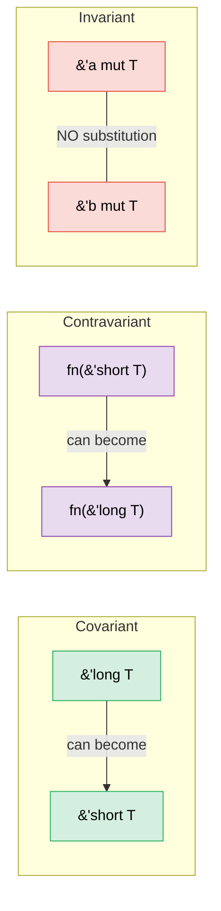

# 4. PhantomData — Types That Carry No Data 🔴

> **What you'll learn:**
> - Why `PhantomData<T>` exists and the three problems it solves
> - Lifetime branding for compile-time scope enforcement
> - The unit-of-measure pattern for dimension-safe arithmetic
> - Variance (covariant, contravariant, invariant) and how PhantomData controls it

## What PhantomData Solves

`PhantomData<T>` is a zero-sized type that tells the compiler "this struct is logically associated with `T`, even though it doesn't contain a `T`." It affects variance, drop checking, and auto-trait inference — without using any memory.

```rust
use std::marker::PhantomData;

// Without PhantomData:
struct Slice<'a, T> {
    ptr: *const T,
    len: usize,
    // Problem: compiler doesn't know this struct borrows from 'a
    // or that it's associated with T for drop-check purposes
}

// With PhantomData:
struct Slice<'a, T> {
    ptr: *const T,
    len: usize,
    _marker: PhantomData<&'a T>,
    // Now the compiler knows:
    // 1. This struct borrows data with lifetime 'a
    // 2. It's covariant over 'a (lifetimes can shrink)
    // 3. Drop check considers T
}
```

**The three jobs of PhantomData**:

| Job | Example | What It Does |
|-----|---------|-------------|
| **Lifetime binding** | `PhantomData<&'a T>` | Struct is treated as borrowing `'a` |
| **Ownership simulation** | `PhantomData<T>` | Drop check assumes struct owns a `T` |
| **Variance control** | `PhantomData<fn(T)>` | Makes struct contravariant over `T` |

### Lifetime Branding

Use `PhantomData` to prevent mixing values from different "sessions" or "contexts":

```rust
use std::marker::PhantomData;

/// A handle that's valid only within a specific arena's lifetime
struct ArenaHandle<'arena> {
    index: usize,
    _brand: PhantomData<&'arena ()>,
}

struct Arena {
    data: Vec<String>,
}

impl Arena {
    fn new() -> Self {
        Arena { data: Vec::new() }
    }

    /// Allocate a string and return a branded handle
    fn alloc<'a>(&'a mut self, value: String) -> ArenaHandle<'a> {
        let index = self.data.len();
        self.data.push(value);
        ArenaHandle { index, _brand: PhantomData }
    }

    /// Look up by handle — only accepts handles from THIS arena
    fn get<'a>(&'a self, handle: ArenaHandle<'a>) -> &'a str {
        &self.data[handle.index]
    }
}

fn main() {
    let mut arena1 = Arena::new();
    let handle1 = arena1.alloc("hello".to_string());

    // Can't use handle1 with a different arena — lifetimes won't match
    // let mut arena2 = Arena::new();
    // arena2.get(handle1); // ❌ Lifetime mismatch

    println!("{}", arena1.get(handle1)); // ✅
}
```

### Unit-of-Measure Pattern

Prevent mixing incompatible units at compile time, with zero runtime cost:

```rust
use std::marker::PhantomData;
use std::ops::{Add, Mul};

// Unit marker types (zero-sized)
struct Meters;
struct Seconds;
struct MetersPerSecond;

#[derive(Debug, Clone, Copy)]
struct Quantity<Unit> {
    value: f64,
    _unit: PhantomData<Unit>,
}

impl<U> Quantity<U> {
    fn new(value: f64) -> Self {
        Quantity { value, _unit: PhantomData }
    }
}

// Can only add same units:
impl<U> Add for Quantity<U> {
    type Output = Quantity<U>;
    fn add(self, rhs: Self) -> Self::Output {
        Quantity::new(self.value + rhs.value)
    }
}

// Meters / Seconds = MetersPerSecond (custom trait)
impl std::ops::Div<Quantity<Seconds>> for Quantity<Meters> {
    type Output = Quantity<MetersPerSecond>;
    fn div(self, rhs: Quantity<Seconds>) -> Quantity<MetersPerSecond> {
        Quantity::new(self.value / rhs.value)
    }
}

fn main() {
    let dist = Quantity::<Meters>::new(100.0);
    let time = Quantity::<Seconds>::new(9.58);
    let speed = dist / time; // Quantity<MetersPerSecond>
    println!("Speed: {:.2} m/s", speed.value); // 10.44 m/s

    // let nonsense = dist + time; // ❌ Compile error: can't add Meters + Seconds
}
```

> **This is pure type-system magic** — `PhantomData<Meters>` is zero-sized,
> so `Quantity<Meters>` has the same layout as `f64`. No wrapper overhead
> at runtime, but full unit safety at compile time.

### PhantomData and Drop Check

When the compiler checks whether a struct's destructor might access expired data, it uses `PhantomData` to decide:

```rust
use std::marker::PhantomData;

// PhantomData<T> — compiler assumes we MIGHT drop a T
// This means T must outlive our struct
struct OwningSemantic<T> {
    ptr: *const T,
    _marker: PhantomData<T>,  // "I logically own a T"
}

// PhantomData<*const T> — compiler assumes we DON'T own T
// More permissive — T doesn't need to outlive us
struct NonOwningSemantic<T> {
    ptr: *const T,
    _marker: PhantomData<*const T>,  // "I just point to T"
}
```

**Practical rule**: When wrapping raw pointers, choose PhantomData carefully:
- Writing a container that owns its data? → `PhantomData<T>`
- Writing a view/reference type? → `PhantomData<&'a T>` or `PhantomData<*const T>`

### Variance — Why PhantomData's Type Parameter Matters

**Variance** determines whether a generic type can be substituted with a sub- or
super-type (in Rust, "subtype" means "has a longer lifetime"). Getting variance
wrong causes either rejected-good-code or unsound-accepted-code.



#### The Three Variances

| Variance | Meaning | "Can I substitute…" | Rust example |
|----------|---------|---------------------|--------------|
| **Covariant** | Subtype flows through | `'long` where `'short` expected ✅ | `&'a T`, `Vec<T>`, `Box<T>` |
| **Contravariant** | Subtype flows *against* | `'short` where `'long` expected ✅ | `fn(T)` (in parameter position) |
| **Invariant** | No substitution allowed | Neither direction ✅ | `&mut T`, `Cell<T>`, `UnsafeCell<T>` |

#### Why `&'a T` is Covariant Over `'a`

```rust
fn print_str(s: &str) {
    println!("{s}");
}

fn main() {
    let owned = String::from("hello");
    // owned lives for the entire function ('long)
    // print_str expects &'_ str ('short — just for the call)
    print_str(&owned); // ✅ Covariance: 'long → 'short is safe
    // A longer-lived reference can always be used where a shorter one is needed.
}
```

#### Why `&mut T` is Invariant Over `T`

```rust
// If &mut T were covariant over T, this would compile:
fn evil(s: &mut &'static str) {
    // We could write a shorter-lived &str into a &'static str slot!
    let local = String::from("temporary");
    // *s = &local; // ← Would create a dangling &'static str
}

// Invariance prevents this: &'static str ≠ &'a str when mutating.
// The compiler rejects the substitution entirely.
```

#### How PhantomData Controls Variance

`PhantomData<X>` gives your struct the **same variance as `X`**:

```rust
use std::marker::PhantomData;

// Covariant over 'a — a Ref<'long> can be used as Ref<'short>
struct Ref<'a, T> {
    ptr: *const T,
    _marker: PhantomData<&'a T>,  // Covariant over 'a, covariant over T
}

// Invariant over T — prevents unsound lifetime shortening of T
struct MutRef<'a, T> {
    ptr: *mut T,
    _marker: PhantomData<&'a mut T>,  // Covariant over 'a, INVARIANT over T
}

// Contravariant over T — useful for callback containers
struct CallbackSlot<T> {
    _marker: PhantomData<fn(T)>,  // Contravariant over T
}
```

**PhantomData variance cheat sheet**:

| PhantomData type | Variance over `T` | Variance over `'a` | Use when |
|------------------|--------------------|--------------------|-----------|
| `PhantomData<T>` | Covariant | — | You logically own a `T` |
| `PhantomData<&'a T>` | Covariant | Covariant | You borrow a `T` with lifetime `'a` |
| `PhantomData<&'a mut T>` | **Invariant** | Covariant | You mutably borrow `T` |
| `PhantomData<*const T>` | Covariant | — | Non-owning pointer to `T` |
| `PhantomData<*mut T>` | **Invariant** | — | Non-owning mutable pointer |
| `PhantomData<fn(T)>` | **Contravariant** | — | `T` appears in argument position |
| `PhantomData<fn() -> T>` | Covariant | — | `T` appears in return position |
| `PhantomData<fn(T) -> T>` | **Invariant** | — | `T` in both positions cancels out |

#### Worked Example: Why This Matters in Practice

```rust
use std::marker::PhantomData;

// A token that brands values with a session lifetime.
// MUST be covariant over 'a — otherwise callers can't shorten
// the lifetime when passing to functions that need a shorter borrow.
struct SessionToken<'a> {
    id: u64,
    _brand: PhantomData<&'a ()>,  // ✅ Covariant — callers can shorten 'a
    // _brand: PhantomData<fn(&'a ())>,  // ❌ Contravariant — breaks ergonomics
    // _brand: PhantomData<&'a mut ()>;  // Still covariant over 'a (invariant over T, but T is fixed as ())
}

fn use_token(token: &SessionToken<'_>) {
    println!("Using token {}", token.id);
}

fn main() {
    let token = SessionToken { id: 42, _brand: PhantomData };
    use_token(&token); // ✅ Works because SessionToken is covariant over 'a
}
```

> **Decision rule**: Start with `PhantomData<&'a T>` (covariant). Switch to
> `PhantomData<&'a mut T>` (invariant) only if your abstraction hands out
> mutable access to `T`. Use `PhantomData<fn(T)>` (contravariant) almost
> never — it's only correct for callback-storage scenarios.

> **Key Takeaways — PhantomData**
> - `PhantomData<T>` carries type/lifetime information without runtime cost
> - Use it for lifetime branding, variance control, and unit-of-measure patterns
> - Drop check: `PhantomData<T>` tells the compiler your type logically owns a `T`

> **See also:** [Ch 3 — Newtype & Type-State](ch03-the-newtype-and-type-state-patterns.md) for type-state patterns that use PhantomData. [Ch 11 — Unsafe Rust](ch11-unsafe-rust-controlled-danger.md) for how PhantomData interacts with raw pointers.

---

### Exercise: Unit-of-Measure with PhantomData ★★ (~30 min)

Extend the unit-of-measure pattern to support:
- `Meters`, `Seconds`, `Kilograms`
- Addition of same units
- Multiplication: `Meters * Meters = SquareMeters`
- Division: `Meters / Seconds = MetersPerSecond`

<details>
<summary>🔑 Solution</summary>

```rust
use std::marker::PhantomData;
use std::ops::{Add, Mul, Div};

#[derive(Clone, Copy)]
struct Meters;
#[derive(Clone, Copy)]
struct Seconds;
#[derive(Clone, Copy)]
struct Kilograms;
#[derive(Clone, Copy)]
struct SquareMeters;
#[derive(Clone, Copy)]
struct MetersPerSecond;

#[derive(Debug, Clone, Copy)]
struct Qty<U> {
    value: f64,
    _unit: PhantomData<U>,
}

impl<U> Qty<U> {
    fn new(v: f64) -> Self { Qty { value: v, _unit: PhantomData } }
}

impl<U> Add for Qty<U> {
    type Output = Qty<U>;
    fn add(self, rhs: Self) -> Self::Output { Qty::new(self.value + rhs.value) }
}

impl Mul<Qty<Meters>> for Qty<Meters> {
    type Output = Qty<SquareMeters>;
    fn mul(self, rhs: Qty<Meters>) -> Qty<SquareMeters> {
        Qty::new(self.value * rhs.value)
    }
}

impl Div<Qty<Seconds>> for Qty<Meters> {
    type Output = Qty<MetersPerSecond>;
    fn div(self, rhs: Qty<Seconds>) -> Qty<MetersPerSecond> {
        Qty::new(self.value / rhs.value)
    }
}

fn main() {
    let width = Qty::<Meters>::new(5.0);
    let height = Qty::<Meters>::new(3.0);
    let area = width * height; // Qty<SquareMeters>
    println!("Area: {:.1} m²", area.value);

    let dist = Qty::<Meters>::new(100.0);
    let time = Qty::<Seconds>::new(9.58);
    let speed = dist / time;
    println!("Speed: {:.2} m/s", speed.value);

    let sum = width + height; // Same unit ✅
    println!("Sum: {:.1} m", sum.value);

    // let bad = width + time; // ❌ Compile error: can't add Meters + Seconds
}
```

</details>

***

