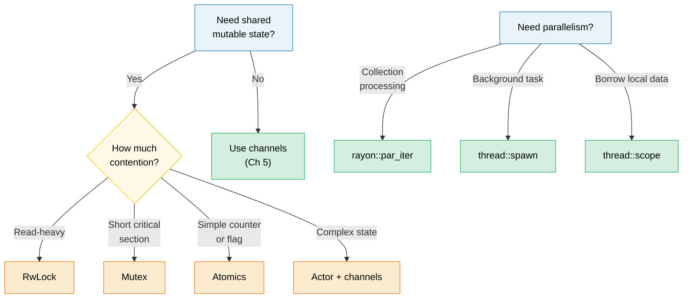

# 6. Concurrency vs Parallelism vs Threads 🟡

> **What you'll learn:**
> - The precise distinction between concurrency and parallelism
> - OS threads, scoped threads, and rayon for data parallelism
> - Shared state primitives: Arc, Mutex, RwLock, Atomics, Condvar
> - Lazy initialization with OnceLock/LazyLock and lock-free patterns

## Terminology: Concurrency ≠ Parallelism

These terms are often confused. Here is the precise distinction:

| | Concurrency | Parallelism |
|---|---|---|
| **Definition** | Managing multiple tasks that can make progress | Executing multiple tasks simultaneously |
| **Hardware requirement** | One core is enough | Requires multiple cores |
| **Analogy** | One cook, multiple dishes (switching between them) | Multiple cooks, each working on a dish |
| **Rust tools** | `async/await`, channels, `select!` | `rayon`, `thread::spawn`, `par_iter()` |

```text
Concurrency (single core):           Parallelism (multi-core):
                                      
Task A: ██░░██░░██                   Task A: ██████████
Task B: ░░██░░██░░                   Task B: ██████████
─────────────────→ time              ─────────────────→ time
(interleaved on one core)           (simultaneous on two cores)
```

### std::thread — OS Threads

Rust threads map 1:1 to OS threads. Each gets its own stack (typically 2-8 MB):

```rust
use std::thread;
use std::time::Duration;

fn main() {
    // Spawn a thread — takes a closure
    let handle = thread::spawn(|| {
        for i in 0..5 {
            println!("spawned thread: {i}");
            thread::sleep(Duration::from_millis(100));
        }
        42 // Return value
    });

    // Do work on the main thread simultaneously
    for i in 0..3 {
        println!("main thread: {i}");
        thread::sleep(Duration::from_millis(150));
    }

    // Wait for the thread to finish and get its return value
    let result = handle.join().unwrap(); // unwrap panics if thread panicked
    println!("Thread returned: {result}");
}
```

**Thread::spawn type requirements**:

```rust
// The closure must be:
// 1. Send — can be transferred to another thread
// 2. 'static — can't borrow from the calling scope
// 3. FnOnce — takes ownership of captured variables

let data = vec![1, 2, 3];

// ❌ Borrows data — not 'static
// thread::spawn(|| println!("{data:?}"));

// ✅ Move ownership into the thread
thread::spawn(move || println!("{data:?}"));
// data is no longer accessible here
```

### Scoped Threads (std::thread::scope)

Since Rust 1.63, scoped threads solve the `'static` requirement — threads can borrow from the parent scope:

```rust
use std::thread;

fn main() {
    let mut data = vec![1, 2, 3, 4, 5];

    thread::scope(|s| {
        // Thread 1: borrow shared reference
        s.spawn(|| {
            let sum: i32 = data.iter().sum();
            println!("Sum: {sum}");
        });

        // Thread 2: also borrow shared reference (multiple readers OK)
        s.spawn(|| {
            let max = data.iter().max().unwrap();
            println!("Max: {max}");
        });

        // ❌ Can't mutably borrow while shared borrows exist:
        // s.spawn(|| data.push(6));
    });
    // ALL scoped threads joined here — guaranteed before scope returns

    // Now safe to mutate — all threads have finished
    data.push(6);
    println!("Updated: {data:?}");
}
```

> **This is huge**: Before scoped threads, you had to `Arc::clone()` everything
> to share with threads. Now you can borrow directly, and the compiler proves
> all threads finish before the data goes out of scope.

### rayon — Data Parallelism

`rayon` provides parallel iterators that distribute work across a thread pool automatically:

```rust,ignore
// Cargo.toml: rayon = "1"
use rayon::prelude::*;

fn main() {
    let data: Vec<u64> = (0..1_000_000).collect();

    // Sequential:
    let sum_seq: u64 = data.iter().map(|x| x * x).sum();

    // Parallel — just change .iter() to .par_iter():
    let sum_par: u64 = data.par_iter().map(|x| x * x).sum();

    assert_eq!(sum_seq, sum_par);

    // Parallel sort:
    let mut numbers = vec![5, 2, 8, 1, 9, 3];
    numbers.par_sort();

    // Parallel processing with map/filter/collect:
    let results: Vec<_> = data
        .par_iter()
        .filter(|&&x| x % 2 == 0)
        .map(|&x| expensive_computation(x))
        .collect();
}

fn expensive_computation(x: u64) -> u64 {
    // Simulate CPU-heavy work
    (0..1000).fold(x, |acc, _| acc.wrapping_mul(7).wrapping_add(13))
}
```

**When to use rayon vs threads**:

| Use | When |
|-----|------|
| `rayon::par_iter()` | Processing collections in parallel (map, filter, reduce) |
| `thread::spawn` | Long-running background tasks, I/O workers |
| `thread::scope` | Short-lived parallel tasks that borrow local data |
| `async` + `tokio` | I/O-bound concurrency (networking, file I/O) |

### Shared State: Arc, Mutex, RwLock, Atomics

When threads need shared mutable state, Rust provides safe abstractions:

> **Note:** `.unwrap()` on `.lock()`, `.read()`, and `.write()` is used for brevity
> throughout these examples. These calls fail only if another thread panicked while
> holding the lock ("poisoning"). Production code should decide whether to recover
> from poisoned locks or propagate the error.

```rust
use std::sync::{Arc, Mutex, RwLock};
use std::sync::atomic::{AtomicU64, Ordering};
use std::thread;

// --- Arc<Mutex<T>>: Shared + Exclusive access ---
fn mutex_example() {
    let counter = Arc::new(Mutex::new(0u64));
    let mut handles = vec![];

    for _ in 0..10 {
        let counter = Arc::clone(&counter);
        handles.push(thread::spawn(move || {
            for _ in 0..1000 {
                let mut guard = counter.lock().unwrap();
                *guard += 1;
            } // Guard dropped → lock released
        }));
    }

    for h in handles { h.join().unwrap(); }
    println!("Counter: {}", counter.lock().unwrap()); // 10000
}

// --- Arc<RwLock<T>>: Multiple readers OR one writer ---
fn rwlock_example() {
    let config = Arc::new(RwLock::new(String::from("initial")));

    // Many readers — don't block each other
    let readers: Vec<_> = (0..5).map(|id| {
        let config = Arc::clone(&config);
        thread::spawn(move || {
            let guard = config.read().unwrap();
            println!("Reader {id}: {guard}");
        })
    }).collect();

    // Writer — blocks and waits for all readers to finish
    {
        let mut guard = config.write().unwrap();
        *guard = "updated".to_string();
    }

    for r in readers { r.join().unwrap(); }
}

// --- Atomics: Lock-free for simple values ---
fn atomic_example() {
    let counter = Arc::new(AtomicU64::new(0));
    let mut handles = vec![];

    for _ in 0..10 {
        let counter = Arc::clone(&counter);
        handles.push(thread::spawn(move || {
            for _ in 0..1000 {
                counter.fetch_add(1, Ordering::Relaxed);
                // No lock, no mutex — hardware atomic instruction
            }
        }));
    }

    for h in handles { h.join().unwrap(); }
    println!("Atomic counter: {}", counter.load(Ordering::Relaxed)); // 10000
}
```

### Quick Comparison

| Primitive | Use Case | Cost | Contention |
|-----------|----------|------|------------|
| `Mutex<T>` | Short critical sections | Lock + unlock | Threads wait in line |
| `RwLock<T>` | Read-heavy, rare writes | Reader-writer lock | Readers concurrent, writer exclusive |
| `AtomicU64` etc. | Counters, flags | Hardware CAS | Lock-free — no waiting |
| Channels | Message passing | Queue ops | Producer/consumer decouple |

### Condition Variables (`Condvar`)

A `Condvar` lets a thread **wait** until another thread signals that a condition is
true, without busy-looping. It is always paired with a `Mutex`:

```rust
use std::sync::{Arc, Mutex, Condvar};
use std::thread;

let pair = Arc::new((Mutex::new(false), Condvar::new()));
let pair2 = Arc::clone(&pair);

// Spawned thread: wait until ready == true
let handle = thread::spawn(move || {
    let (lock, cvar) = &*pair2;
    let mut ready = lock.lock().unwrap();
    while !*ready {
        ready = cvar.wait(ready).unwrap(); // atomically unlocks + sleeps
    }
    println!("Worker: condition met, proceeding");
});

// Main thread: set ready = true, then signal
{
    let (lock, cvar) = &*pair;
    let mut ready = lock.lock().unwrap();
    *ready = true;
    cvar.notify_one(); // wake one waiting thread (use notify_all for many)
}
handle.join().unwrap();
```

> **Pattern**: Always re-check the condition in a `while` loop after `wait()` returns
> — spurious wakeups are allowed by the OS.

### Lazy Initialization: OnceLock and LazyLock

Before Rust 1.80, initializing a global static that requires runtime computation
(e.g., parsing a config, compiling a regex) needed the `lazy_static!` macro or the
`once_cell` crate. The standard library now provides two types that cover these
use cases natively:

```rust
use std::sync::{OnceLock, LazyLock};
use std::collections::HashMap;

// OnceLock — initialize on first use via `get_or_init`.
// Useful when the init value depends on runtime arguments.
static CONFIG: OnceLock<HashMap<String, String>> = OnceLock::new();

fn get_config() -> &'static HashMap<String, String> {
    CONFIG.get_or_init(|| {
        // Expensive: read & parse config file — happens exactly once.
        let mut m = HashMap::new();
        m.insert("log_level".into(), "info".into());
        m
    })
}

// LazyLock — initialize on first access, closure provided at definition site.
// Equivalent to lazy_static! but without a macro.
static REGEX: LazyLock<regex::Regex> = LazyLock::new(|| {
    regex::Regex::new(r"^[a-zA-Z0-9_]+$").unwrap()
});

fn is_valid_identifier(s: &str) -> bool {
    REGEX.is_match(s) // First call compiles the regex; subsequent calls reuse it.
}
```

| Type | Stabilized | Init Timing | Use When |
|------|-----------|-------------|----------|
| `OnceLock<T>` | Rust 1.70 | Call-site (`get_or_init`) | Init depends on runtime args |
| `LazyLock<T>` | Rust 1.80 | Definition-site (closure) | Init is self-contained |
| `lazy_static!` | — | Definition-site (macro) | Pre-1.80 codebases (migrate away) |
| `const fn` + `static` | Always | Compile-time | Value is computable at compile time |

> **Migration tip**: Replace `lazy_static! { static ref X: T = expr; }` with
> `static X: LazyLock<T> = LazyLock::new(|| expr);` — same semantics, no macro,
> no external dependency.

### Lock-Free Patterns

For high-performance code, avoid locks entirely:

```rust
use std::sync::atomic::{AtomicBool, AtomicUsize, Ordering};
use std::sync::Arc;

// Pattern 1: Spin lock (educational — prefer std::sync::Mutex)
// ⚠️ WARNING: This is a teaching example only. Real spinlocks need:
//   - A RAII guard (so a panic while holding doesn't deadlock forever)
//   - Fairness guarantees (this starves under contention)
//   - Backoff strategies (exponential backoff, yield to OS)
// Use std::sync::Mutex or parking_lot::Mutex in production.
struct SpinLock {
    locked: AtomicBool,
}

impl SpinLock {
    fn new() -> Self { SpinLock { locked: AtomicBool::new(false) } }

    fn lock(&self) {
        while self.locked
            .compare_exchange_weak(false, true, Ordering::Acquire, Ordering::Relaxed)
            .is_err()
        {
            std::hint::spin_loop(); // CPU hint: we're spinning
        }
    }

    fn unlock(&self) {
        self.locked.store(false, Ordering::Release);
    }
}

// Pattern 2: Lock-free SPSC (single producer, single consumer)
// Use crossbeam::queue::ArrayQueue or similar in production
// roll-your-own only for learning.

// Pattern 3: Sequence counter for wait-free reads
// ⚠️ Best for single-machine-word types (u64, f64); wider T may tear on read.
struct SeqLock<T: Copy> {
    seq: AtomicUsize,
    data: std::cell::UnsafeCell<T>,
}

unsafe impl<T: Copy + Send> Sync for SeqLock<T> {}

impl<T: Copy> SeqLock<T> {
    fn new(val: T) -> Self {
        SeqLock {
            seq: AtomicUsize::new(0),
            data: std::cell::UnsafeCell::new(val),
        }
    }

    fn read(&self) -> T {
        loop {
            let s1 = self.seq.load(Ordering::Acquire);
            if s1 & 1 != 0 { continue; } // Writer in progress, retry

            // SAFETY: We use ptr::read_volatile to prevent the compiler from
            // reordering or caching the read. The SeqLock protocol (checking
            // s1 == s2 after reading) ensures we retry if a writer was active.
            // This mirrors the C SeqLock pattern where the data read must use
            // volatile/relaxed semantics to avoid tearing under concurrency.
            let value = unsafe { core::ptr::read_volatile(self.data.get() as *const T) };

            // Acquire fence: ensures the data read above is ordered before
            // we re-check the sequence counter.
            std::sync::atomic::fence(Ordering::Acquire);
            let s2 = self.seq.load(Ordering::Relaxed);

            if s1 == s2 { return value; } // No writer intervened
            // else retry
        }
    }

    /// # Safety contract
    /// Only ONE thread may call `write()` at a time. If multiple writers
    /// are needed, wrap the `write()` call in an external `Mutex`.
    fn write(&self, val: T) {
        // Increment to odd (signals write in progress).
        // AcqRel: the Acquire side prevents the subsequent data write
        // from being reordered before this increment (readers must see
        // odd before they could observe a partial write). The Release
        // side is technically unnecessary for a single writer but
        // harmless and consistent.
        self.seq.fetch_add(1, Ordering::AcqRel);
        // SAFETY: Single-writer invariant upheld by caller (see doc above).
        // UnsafeCell allows interior mutation; seq counter protects readers.
        unsafe { *self.data.get() = val; }
        // Increment to even (signals write complete).
        // Release: ensure the data write is visible before readers see the even seq.
        self.seq.fetch_add(1, Ordering::Release);
    }
}
```

> **⚠️ Rust memory model caveat**: The non-atomic write through `UnsafeCell` in
> `write()` concurrent with the non-atomic `ptr::read_volatile` in `read()` is
> technically a data race under the Rust abstract machine — even though the
> SeqLock protocol ensures readers always retry on stale data. This mirrors the
> C kernel SeqLock pattern and is sound in practice on all modern hardware for
> types `T` that fit in a single machine word (e.g., `u64`). For wider types,
> consider using `AtomicU64` for the data field or wrapping access in a `Mutex`.
> See [the Rust unsafe code guidelines](https://rust-lang.github.io/unsafe-code-guidelines/)
> for the evolving story on `UnsafeCell` concurrency.

> **Practical advice**: Lock-free code is hard to get right. Use `Mutex` or
> `RwLock` unless profiling shows lock contention is your bottleneck. When you
> do need lock-free, reach for proven crates (`crossbeam`, `arc-swap`, `dashmap`)
> rather than rolling your own.

> **Key Takeaways — Concurrency**
> - Scoped threads (`thread::scope`) let you borrow stack data without `Arc`
> - `rayon::par_iter()` parallelizes iterators with one method call
> - Use `OnceLock`/`LazyLock` instead of `lazy_static!`; use `Mutex` before reaching for atomics
> - Lock-free code is hard — prefer proven crates over hand-rolled implementations

> **See also:** [Ch 5 — Channels](ch05-channels-and-message-passing.md) for message-passing concurrency. [Ch 8 — Smart Pointers](ch08-smart-pointers-and-interior-mutability.md) for Arc/Rc details.



---

### Exercise: Parallel Map with Scoped Threads ★★ (~25 min)

Write a function `parallel_map<T, R>(data: &[T], f: fn(&T) -> R, num_threads: usize) -> Vec<R>` that splits `data` into `num_threads` chunks and processes each in a scoped thread. Do not use `rayon` — use `std::thread::scope`.

<details>
<summary>🔑 Solution</summary>

```rust
fn parallel_map<T: Sync, R: Send>(data: &[T], f: fn(&T) -> R, num_threads: usize) -> Vec<R> {
    let chunk_size = (data.len() + num_threads - 1) / num_threads;
    let mut results = Vec::with_capacity(data.len());

    std::thread::scope(|s| {
        let mut handles = Vec::new();
        for chunk in data.chunks(chunk_size) {
            handles.push(s.spawn(move || {
                chunk.iter().map(f).collect::<Vec<_>>()
            }));
        }
        for h in handles {
            results.extend(h.join().unwrap());
        }
    });

    results
}

fn main() {
    let data: Vec<u64> = (1..=20).collect();
    let squares = parallel_map(&data, |x| x * x, 4);
    assert_eq!(squares, (1..=20).map(|x: u64| x * x).collect::<Vec<_>>());
    println!("Parallel squares: {squares:?}");
}
```

</details>

***

