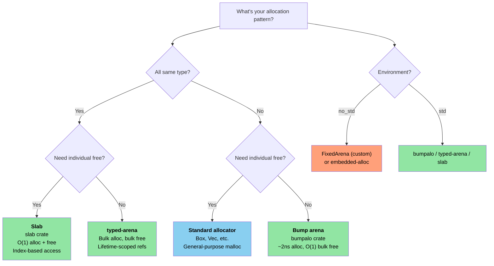

# 11. Unsafe Rust — Controlled Danger 🔴

> **What you'll learn:**
> - The five unsafe superpowers and when each is needed
> - Writing sound abstractions: safe API, unsafe internals
> - FFI patterns for calling C from Rust (and back)
> - Common UB pitfalls and arena/slab allocator patterns

## The Five Unsafe Superpowers

`unsafe` unlocks five operations that the compiler can't verify:

```rust
// SAFETY: each operation is explained inline below.
unsafe {
    // 1. Dereference a raw pointer
    let ptr: *const i32 = &42;
    let value = *ptr; // Could be a dangling/null pointer

    // 2. Call an unsafe function
    let layout = std::alloc::Layout::new::<u64>();
    let mem = std::alloc::alloc(layout);

    // 3. Access a mutable static variable
    static mut COUNTER: u32 = 0;
    COUNTER += 1; // Data race if multiple threads access

    // 4. Implement an unsafe trait
    // unsafe impl Send for MyType {}

    // 5. Access fields of a union
    // union IntOrFloat { i: i32, f: f32 }
    // let u = IntOrFloat { i: 42 };
    // let f = u.f; // Reinterpret bits — could be garbage
}
```

> **Key principle**: `unsafe` doesn't turn off the borrow checker or type system.
> It only unlocks these five specific capabilities. All other Rust rules still apply.

### Writing Sound Abstractions

The purpose of `unsafe` is to build **safe abstractions** around unsafe operations:

```rust
/// A fixed-capacity stack-allocated buffer.
/// All public methods are safe — the unsafe is encapsulated.
pub struct StackBuf<T, const N: usize> {
    data: [std::mem::MaybeUninit<T>; N],
    len: usize,
}

impl<T, const N: usize> StackBuf<T, N> {
    pub fn new() -> Self {
        StackBuf {
            // Each element is individually MaybeUninit — no unsafe needed.
            // `const { ... }` blocks (Rust 1.79+) let us repeat a non-Copy
            // const expression N times.
            data: [const { std::mem::MaybeUninit::uninit() }; N],
            len: 0,
        }
    }

    pub fn push(&mut self, value: T) -> Result<(), T> {
        if self.len >= N {
            return Err(value); // Buffer full — return value to caller
        }
        // SAFETY: len < N, so data[len] is within bounds.
        // We write a valid T into the MaybeUninit slot.
        self.data[self.len] = std::mem::MaybeUninit::new(value);
        self.len += 1;
        Ok(())
    }

    pub fn get(&self, index: usize) -> Option<&T> {
        if index < self.len {
            // SAFETY: index < len, and data[0..len] are all initialized.
            Some(unsafe { self.data[index].assume_init_ref() })
        } else {
            None
        }
    }
}

impl<T, const N: usize> Drop for StackBuf<T, N> {
    fn drop(&mut self) {
        // SAFETY: data[0..len] are initialized — drop them properly.
        for i in 0..self.len {
            unsafe { self.data[i].assume_init_drop(); }
        }
    }
}
```

**The three rules of sound unsafe code**:
1. **Document invariants** — every `// SAFETY:` comment explains why the operation is valid
2. **Encapsulate** — the unsafe is inside a safe API; users can't trigger UB
3. **Minimize** — only the smallest possible block is `unsafe`

### FFI Patterns: Calling C from Rust

```rust
// Declare the C function signature:
extern "C" {
    fn strlen(s: *const std::ffi::c_char) -> usize;
    fn printf(format: *const std::ffi::c_char, ...) -> std::ffi::c_int;
}

// Safe wrapper:
fn safe_strlen(s: &str) -> usize {
    let c_string = std::ffi::CString::new(s).expect("string contains null byte");
    // SAFETY: c_string is a valid null-terminated string, alive for the call.
    unsafe { strlen(c_string.as_ptr()) }
}

// Calling Rust from C (export a function):
#[no_mangle]
pub extern "C" fn rust_add(a: i32, b: i32) -> i32 {
    a + b
}
```

**Common FFI types**:

| Rust | C | Notes |
|------|---|-------|
| `i32` / `u32` | `int32_t` / `uint32_t` | Fixed-width, safe |
| `*const T` / `*mut T` | `const T*` / `T*` | Raw pointers |
| `std::ffi::CStr` | `const char*` (borrowed) | Null-terminated, borrowed |
| `std::ffi::CString` | `char*` (owned) | Null-terminated, owned |
| `std::ffi::c_void` | `void` | Opaque pointer target |
| `Option<fn(...)>` | Nullable function pointer | `None` = NULL |

### Common UB Pitfalls

| Pitfall | Example | Why It's UB |
|---------|---------|------------|
| Null dereference | `*std::ptr::null::<i32>()` | Dereferencing null is always UB |
| Dangling pointer | Dereference after `drop()` | Memory may be reused |
| Data race | Two threads write to `static mut` | Unsynchronized concurrent writes |
| Wrong `assume_init` | `MaybeUninit::<String>::uninit().assume_init()` | Reading uninitialized memory. **Note**: `[const { MaybeUninit::uninit() }; N]` (Rust 1.79+) is the safe way to create an array of `MaybeUninit` — no `unsafe` or `assume_init` needed (see `StackBuf::new()` above). |
| Aliasing violation | Creating two `&mut` to same data | Violates Rust's aliasing model |
| Invalid enum value | `std::mem::transmute::<u8, bool>(2)` | `bool` can only be 0 or 1 |

> **When to use `unsafe` in production**:
> - FFI boundaries (calling C/C++ code)
> - Performance-critical inner loops (avoid bounds checks)
> - Building primitives (`Vec`, `HashMap` — these use unsafe internally)
> - Never in application logic if you can avoid it

### Custom Allocators — Arena and Slab Patterns

In C, you'd write custom `malloc()` replacements for specific allocation patterns —
arena allocators that free everything at once, slab allocators for fixed-size objects,
or pool allocators for high-throughput systems. Rust provides the same power through
the `GlobalAlloc` trait and allocator crates, with the added benefit of lifetime-scoped
arenas that **prevent use-after-free at compile time**.

#### Arena Allocators — Bulk Allocation, Bulk Free

An arena allocates by bumping a pointer forward. Individual items can't be freed —
the entire arena is freed at once. This is perfect for request-scoped or
frame-scoped allocations:

```rust
use bumpalo::Bump;

fn process_sensor_frame(raw_data: &[u8]) {
    // Create an arena for this frame's allocations
    let arena = Bump::new();

    // Allocate objects in the arena — ~2ns each (just a pointer bump)
    let header = arena.alloc(parse_header(raw_data));
    let readings: &mut [f32] = arena.alloc_slice_fill_default(header.sensor_count);

    for (i, chunk) in raw_data[header.payload_offset..].chunks(4).enumerate() {
        if i < readings.len() {
            readings[i] = f32::from_le_bytes(chunk.try_into().unwrap());
        }
    }

    // Use readings...
    let avg = readings.iter().sum::<f32>() / readings.len() as f32;
    println!("Frame avg: {avg:.2}");

    // `arena` drops here — ALL allocations freed at once in O(1)
    // No per-object destructor overhead, no fragmentation
}
# fn parse_header(_: &[u8]) -> Header { Header { sensor_count: 4, payload_offset: 8 } }
# struct Header { sensor_count: usize, payload_offset: usize }
```

**Arena vs standard allocator**:

| Aspect | `Vec::new()` / `Box::new()` | `Bump` arena |
|--------|---------------------------|--------------|
| Alloc speed | ~25ns (malloc) | ~2ns (pointer bump) |
| Free speed | Per-object destructor | O(1) bulk free |
| Fragmentation | Yes (long-lived processes) | None within arena |
| Lifetime safety | Heap — freed on `Drop` | Arena reference — compile-time scoped |
| Use case | General purpose | Request/frame/batch processing |

#### `typed-arena` — Type-Safe Arena

When all arena objects are the same type, `typed-arena` provides a simpler API
that returns references with the arena's lifetime:

```rust
use typed_arena::Arena;

struct AstNode<'a> {
    value: i32,
    children: Vec<&'a AstNode<'a>>,
}

fn build_tree() {
    let arena: Arena<AstNode<'_>> = Arena::new();

    // Allocate nodes — returns &AstNode tied to arena's lifetime
    let root = arena.alloc(AstNode { value: 1, children: vec![] });
    let left = arena.alloc(AstNode { value: 2, children: vec![] });
    let right = arena.alloc(AstNode { value: 3, children: vec![] });

    // Build the tree — all references valid as long as `arena` lives
    // (Mutable access requires interior mutability for truly mutable trees)

    println!("Root: {}, Left: {}, Right: {}", root.value, left.value, right.value);

    // `arena` drops here — all nodes freed at once
}
```

#### Slab Allocators — Fixed-Size Object Pools

A slab allocator pre-allocates a pool of fixed-size slots. Objects are allocated
and returned individually, but all slots are the same size — eliminating
fragmentation and enabling O(1) alloc/free:

```rust
use slab::Slab;

struct Connection {
    id: u64,
    buffer: [u8; 1024],
    active: bool,
}

fn connection_pool_example() {
    // Pre-allocate a slab for connections
    let mut connections: Slab<Connection> = Slab::with_capacity(256);

    // Insert returns a key (usize index) — O(1)
    let key1 = connections.insert(Connection {
        id: 1001,
        buffer: [0; 1024],
        active: true,
    });

    let key2 = connections.insert(Connection {
        id: 1002,
        buffer: [0; 1024],
        active: true,
    });

    // Access by key — O(1)
    if let Some(conn) = connections.get_mut(key1) {
        conn.buffer[0..5].copy_from_slice(b"hello");
    }

    // Remove returns the value — O(1), slot is reused for next insert
    let removed = connections.remove(key2);
    assert_eq!(removed.id, 1002);

    // Next insert reuses the freed slot — no fragmentation
    let key3 = connections.insert(Connection {
        id: 1003,
        buffer: [0; 1024],
        active: true,
    });
    assert_eq!(key3, key2); // Same slot reused!
}
```

#### Implementing a Minimal Arena (for `no_std`)

For bare-metal environments where you can't pull in `bumpalo`, here's a
minimal arena built on `unsafe`:

```rust
#![cfg_attr(not(test), no_std)]

use core::alloc::Layout;
use core::cell::{Cell, UnsafeCell};

/// A simple bump allocator backed by a fixed-size byte array.
/// Not thread-safe — use per-core or with a lock for multi-threaded contexts.
///
/// **Important**: Like `bumpalo`, this arena does NOT call destructors on
/// allocated items when the arena is dropped. Types with `Drop` impls will
/// leak their resources (file handles, sockets, etc.). Only allocate types
/// without meaningful `Drop` impls, or manually drop them before the arena.
pub struct FixedArena<const N: usize> {
    // UnsafeCell is REQUIRED here: we mutate `buf` through `&self`.
    // Without UnsafeCell, casting &self.buf to *mut u8 would be UB
    // (violates Rust's aliasing model — shared ref implies immutable).
    buf: UnsafeCell<[u8; N]>,
    offset: Cell<usize>, // Interior mutability for &self allocation
}

impl<const N: usize> FixedArena<N> {
    pub const fn new() -> Self {
        FixedArena {
            buf: UnsafeCell::new([0; N]),
            offset: Cell::new(0),
        }
    }

    /// Allocate a `T` in the arena. Returns `None` if out of space.
    pub fn alloc<T>(&self, value: T) -> Option<&mut T> {
        let layout = Layout::new::<T>();
        let current = self.offset.get();

        // Align up
        let aligned = (current + layout.align() - 1) & !(layout.align() - 1);
        let new_offset = aligned + layout.size();

        if new_offset > N {
            return None; // Arena full
        }

        self.offset.set(new_offset);

        // SAFETY:
        // - `aligned` is within `buf` bounds (checked above)
        // - Alignment is correct (aligned to T's requirement)
        // - No aliasing: each alloc returns a unique, non-overlapping region
        // - UnsafeCell grants permission to mutate through &self
        // - The arena outlives the returned reference (caller must ensure)
        let ptr = unsafe {
            let base = (self.buf.get() as *mut u8).add(aligned);
            let typed = base as *mut T;
            typed.write(value);
            &mut *typed
        };

        Some(ptr)
    }

    /// Reset the arena — invalidates all previous allocations.
    ///
    /// # Safety
    /// Caller must ensure no references to arena-allocated data exist.
    pub unsafe fn reset(&self) {
        self.offset.set(0);
    }

    pub fn used(&self) -> usize {
        self.offset.get()
    }

    pub fn remaining(&self) -> usize {
        N - self.offset.get()
    }
}
```

#### Choosing an Allocator Strategy

> **Note**: The diagram below uses Mermaid syntax. It renders on GitHub and in
> tools that support Mermaid (mdBook with `mermaid` plugin, VS Code with
> Mermaid extension). In plain Markdown viewers, you'll see the raw source.



| C Pattern | Rust Equivalent | Key Advantage |
|-----------|----------------|---------------|
| Custom `malloc()` pool | `#[global_allocator]` impl | Type-safe, debuggable |
| `obstack` (GNU) | `bumpalo::Bump` | Lifetime-scoped, no use-after-free |
| Kernel slab (`kmem_cache`) | `slab::Slab<T>` | Type-safe, index-based |
| Stack-allocated temp buffer | `FixedArena<N>` (above) | No heap, `const` constructible |
| `alloca()` | `[T; N]` or `SmallVec` | Compile-time sized, no UB |

> **Cross-reference**: For bare-metal allocator setup (`#[global_allocator]` with
> `embedded-alloc`), see the *Rust Training for C Programmers*, Chapter 15.1
> "Global Allocator Setup" which covers the embedded-specific bootstrapping.

> **Key Takeaways — Unsafe Rust**
> - Document invariants (`SAFETY:` comments), encapsulate behind safe APIs, minimize unsafe scope
> - `[const { MaybeUninit::uninit() }; N]` (Rust 1.79+) replaces the old `assume_init` anti-pattern
> - FFI requires `extern "C"`, `#[repr(C)]`, and careful null/lifetime handling
> - Arena and slab allocators trade general-purpose flexibility for allocation speed

> **See also:** [Ch 4 — PhantomData](ch04-phantomdata-types-that-carry-no-data.md) for variance and drop-check interactions with unsafe code. [Ch 8 — Smart Pointers](ch08-smart-pointers-and-interior-mutability.md) for Pin and self-referential types.

---

### Exercise: Safe Wrapper around Unsafe ★★★ (~45 min)

Write a `FixedVec<T, const N: usize>` — a fixed-capacity, stack-allocated vector.
Requirements:
- `push(&mut self, value: T) -> Result<(), T>` returns `Err(value)` when full
- `pop(&mut self) -> Option<T>` returns and removes the last element
- `as_slice(&self) -> &[T]` borrows initialized elements
- All public methods must be safe; all unsafe must be encapsulated with `SAFETY:` comments
- `Drop` must clean up initialized elements

<details>
<summary>🔑 Solution</summary>

```rust
use std::mem::MaybeUninit;

pub struct FixedVec<T, const N: usize> {
    data: [MaybeUninit<T>; N],
    len: usize,
}

impl<T, const N: usize> FixedVec<T, N> {
    pub fn new() -> Self {
        FixedVec {
            data: [const { MaybeUninit::uninit() }; N],
            len: 0,
        }
    }

    pub fn push(&mut self, value: T) -> Result<(), T> {
        if self.len >= N { return Err(value); }
        // SAFETY: len < N, so data[len] is within bounds.
        self.data[self.len] = MaybeUninit::new(value);
        self.len += 1;
        Ok(())
    }

    pub fn pop(&mut self) -> Option<T> {
        if self.len == 0 { return None; }
        self.len -= 1;
        // SAFETY: data[len] was initialized (len was > 0 before decrement).
        Some(unsafe { self.data[self.len].assume_init_read() })
    }

    pub fn as_slice(&self) -> &[T] {
        // SAFETY: data[0..len] are all initialized, and MaybeUninit<T>
        // has the same layout as T.
        unsafe { std::slice::from_raw_parts(self.data.as_ptr() as *const T, self.len) }
    }

    pub fn len(&self) -> usize { self.len }
    pub fn is_empty(&self) -> bool { self.len == 0 }
}

impl<T, const N: usize> Drop for FixedVec<T, N> {
    fn drop(&mut self) {
        // SAFETY: data[0..len] are initialized — drop each one.
        for i in 0..self.len {
            unsafe { self.data[i].assume_init_drop(); }
        }
    }
}

fn main() {
    let mut v = FixedVec::<String, 4>::new();
    v.push("hello".into()).unwrap();
    v.push("world".into()).unwrap();
    assert_eq!(v.as_slice(), &["hello", "world"]);
    assert_eq!(v.pop(), Some("world".into()));
    assert_eq!(v.len(), 1);
}
```

</details>

***

