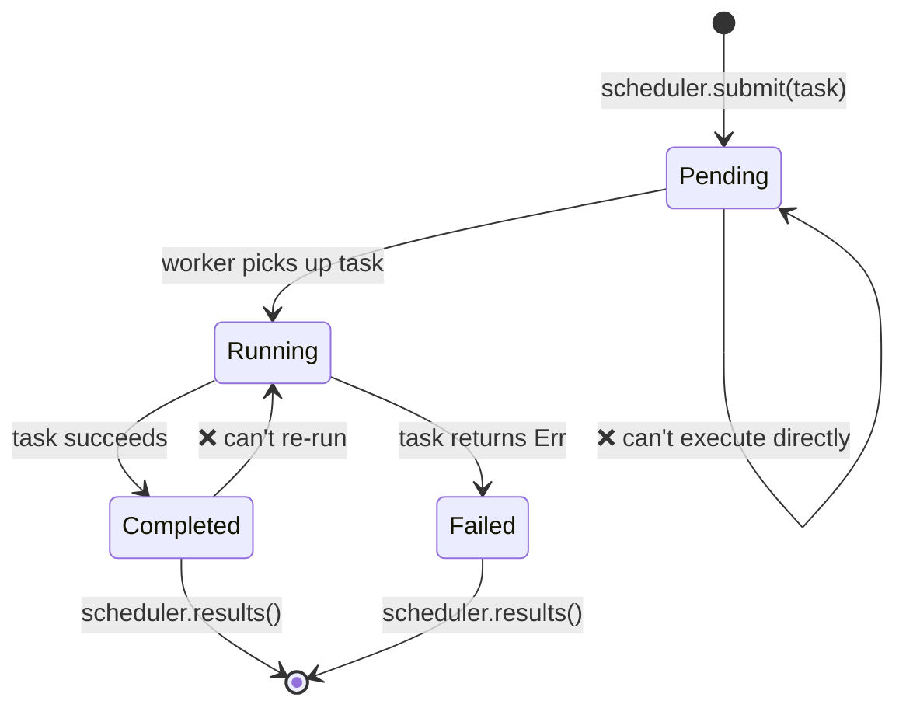

# Capstone Project: Type-Safe Task Scheduler

This project integrates patterns from across the book into a single, production-style system. You'll build a **type-safe, concurrent task scheduler** that uses generics, traits, typestate, channels, error handling, and testing.

**Estimated time**: 4–6 hours | **Difficulty**: ★★★

> **What you'll practice:**
> - Generics and trait bounds (Ch 1–2)
> - Typestate pattern for task lifecycle (Ch 3)
> - PhantomData for zero-cost state markers (Ch 4)
> - Channels for worker communication (Ch 5)
> - Concurrency with scoped threads (Ch 6)
> - Error handling with `thiserror` (Ch 9)
> - Testing with property-based tests (Ch 13)
> - API design with `TryFrom` and validated types (Ch 14)

## The Problem

Build a task scheduler where:

1. **Tasks** have a typed lifecycle: `Pending → Running → Completed` (or `Failed`)
2. **Workers** pull tasks from a channel, execute them, and report results
3. The **scheduler** manages task submission, worker coordination, and result collection
4. Invalid state transitions are **compile-time errors**



## Step 1: Define the Task Types

Start with the typestate markers and a generic `Task`:

```rust
use std::marker::PhantomData;

// --- State markers (zero-sized) ---
struct Pending;
struct Running;
struct Completed;
struct Failed;

// --- Task ID (newtype for type safety) ---
#[derive(Debug, Clone, Copy, PartialEq, Eq, Hash)]
struct TaskId(u64);

// --- The Task struct, parameterized by lifecycle state ---
struct Task<State, R> {
    id: TaskId,
    name: String,
    _state: PhantomData<State>,
    _result: PhantomData<R>,
}
```

**Your job**: Implement state transitions so that:
- `Task<Pending, R>` can transition to `Task<Running, R>` (via `start()`)
- `Task<Running, R>` can transition to `Task<Completed, R>` or `Task<Failed, R>`
- No other transitions compile

<details>
<summary>💡 Hint</summary>

Each transition method should consume `self` and return the new state:

```rust
impl<R> Task<Pending, R> {
    fn start(self) -> Task<Running, R> {
        Task {
            id: self.id,
            name: self.name,
            _state: PhantomData,
            _result: PhantomData,
        }
    }
}
```

</details>

## Step 2: Define the Work Function

Tasks need a function to execute. Use a boxed closure:

```rust
struct WorkItem<R: Send + 'static> {
    id: TaskId,
    name: String,
    work: Box<dyn FnOnce() -> Result<R, String> + Send>,
}
```

**Your job**: Implement `WorkItem::new()` that accepts a task name and closure.
Add a `TaskId` generator (simple atomic counter or mutex-protected counter).

## Step 3: Error Handling

Define the scheduler's error types using `thiserror`:

```rust,ignore
use thiserror::Error;

#[derive(Error, Debug)]
pub enum SchedulerError {
    #[error("scheduler is shut down")]
    ShutDown,

    #[error("task {0:?} failed: {1}")]
    TaskFailed(TaskId, String),

    #[error("channel send error")]
    ChannelError(#[from] std::sync::mpsc::SendError<()>),

    #[error("worker panicked")]
    WorkerPanic,
}
```

## Step 4: The Scheduler

Build the scheduler using channels (Ch 5) and scoped threads (Ch 6):

```rust
use std::sync::mpsc;

struct Scheduler<R: Send + 'static> {
    sender: Option<mpsc::Sender<WorkItem<R>>>,
    results: mpsc::Receiver<TaskResult<R>>,
    num_workers: usize,
}

struct TaskResult<R> {
    id: TaskId,
    name: String,
    outcome: Result<R, String>,
}
```

**Your job**: Implement:
- `Scheduler::new(num_workers: usize) -> Self` — creates channels and spawns workers
- `Scheduler::submit(&self, item: WorkItem<R>) -> Result<TaskId, SchedulerError>`
- `Scheduler::shutdown(self) -> Vec<TaskResult<R>>` — drops the sender, joins workers, collects results

<details>
<summary>💡 Hint — Worker loop</summary>

```rust
fn worker_loop<R: Send + 'static>(
    rx: std::sync::Arc<std::sync::Mutex<mpsc::Receiver<WorkItem<R>>>>,
    result_tx: mpsc::Sender<TaskResult<R>>,
    worker_id: usize,
) {
    loop {
        let item = {
            let rx = rx.lock().unwrap();
            rx.recv()
        };
        match item {
            Ok(work_item) => {
                let outcome = (work_item.work)();
                let _ = result_tx.send(TaskResult {
                    id: work_item.id,
                    name: work_item.name,
                    outcome,
                });
            }
            Err(_) => break, // Channel closed
        }
    }
}
```

</details>

## Step 5: Integration Test

Write tests that verify:

1. **Happy path**: Submit 10 tasks, shut down, verify all 10 results are `Ok`
2. **Error handling**: Submit tasks that fail, verify `TaskResult.outcome` is `Err`
3. **Empty scheduler**: Create and immediately shut down — no panics
4. **Property test** (bonus): Use `proptest` to verify that for any N tasks (1..100), the scheduler always returns exactly N results

```rust
#[cfg(test)]
mod tests {
    use super::*;

    #[test]
    fn happy_path() {
        let scheduler = Scheduler::<String>::new(4);

        for i in 0..10 {
            let item = WorkItem::new(
                format!("task-{i}"),
                move || Ok(format!("result-{i}")),
            );
            scheduler.submit(item).unwrap();
        }

        let results = scheduler.shutdown();
        assert_eq!(results.len(), 10);
        for r in &results {
            assert!(r.outcome.is_ok());
        }
    }

    #[test]
    fn handles_failures() {
        let scheduler = Scheduler::<String>::new(2);

        scheduler.submit(WorkItem::new("good", || Ok("ok".into()))).unwrap();
        scheduler.submit(WorkItem::new("bad", || Err("boom".into()))).unwrap();

        let results = scheduler.shutdown();
        assert_eq!(results.len(), 2);

        let failures: Vec<_> = results.iter()
            .filter(|r| r.outcome.is_err())
            .collect();
        assert_eq!(failures.len(), 1);
    }
}
```

## Step 6: Put It All Together

Here's the `main()` that demonstrates the full system:

```rust,ignore
fn main() {
    let scheduler = Scheduler::<String>::new(4);

    // Submit tasks with varying workloads
    for i in 0..20 {
        let item = WorkItem::new(
            format!("compute-{i}"),
            move || {
                // Simulate work
                std::thread::sleep(std::time::Duration::from_millis(10));
                if i % 7 == 0 {
                    Err(format!("task {i} hit a simulated error"))
                } else {
                    Ok(format!("task {i} completed with value {}", i * i))
                }
            },
        );
        // NOTE: .unwrap() is used for brevity — handle SendError in production.
        scheduler.submit(item).unwrap();
    }

    println!("All tasks submitted. Shutting down...");
    let results = scheduler.shutdown();

    let (ok, err): (Vec<_>, Vec<_>) = results.iter()
        .partition(|r| r.outcome.is_ok());

    println!("\n✅ Succeeded: {}", ok.len());
    for r in &ok {
        println!("  {} → {}", r.name, r.outcome.as_ref().unwrap());
    }

    println!("\n❌ Failed: {}", err.len());
    for r in &err {
        println!("  {} → {}", r.name, r.outcome.as_ref().unwrap_err());
    }
}
```

## Evaluation Criteria

| Criterion | Target |
|-----------|--------|
| Type safety | Invalid state transitions don't compile |
| Concurrency | Workers run in parallel, no data races |
| Error handling | All failures captured in `TaskResult`, no panics |
| Testing | At least 3 tests; bonus for proptest |
| Code organization | Clean module structure, public API uses validated types |
| Documentation | Key types have doc comments explaining invariants |

## Extension Ideas

Once the basic scheduler works, try these enhancements:

1. **Priority queue**: Add a `Priority` newtype (1–10) and process higher-priority tasks first
2. **Retry policy**: Failed tasks retry up to N times before being marked permanently failed
3. **Cancellation**: Add a `cancel(TaskId)` method that removes pending tasks
4. **Async version**: Port to `tokio::spawn` with `tokio::sync::mpsc` channels (Ch 15)
5. **Metrics**: Track per-worker task counts, average execution time, and failure rates

***
