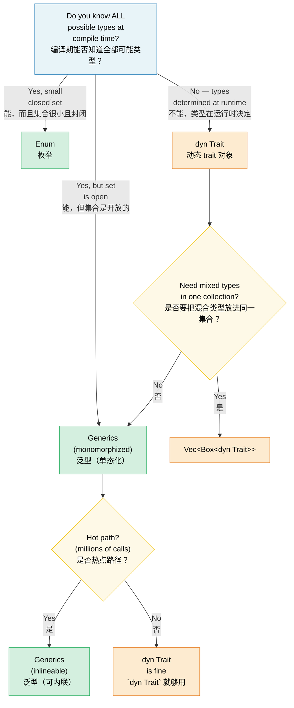

# 1. Generics — The Full Picture 🟢<br><span class="zh-inline"># 1. 泛型全景图 🟢</span>

> **What you'll learn:**<br><span class="zh-inline">**本章将学到什么：**</span>
> - How monomorphization gives zero-cost generics — and when it causes code bloat<br><span class="zh-inline">单态化怎样带来零成本泛型，以及它在什么情况下会导致代码膨胀</span>
> - The decision framework: generics vs enums vs trait objects<br><span class="zh-inline">做选择时的判断框架：泛型、枚举和 trait object 该怎么取舍</span>
> - Const generics for compile-time array sizes and `const fn` for compile-time evaluation<br><span class="zh-inline">如何用 const generics 表示编译期数组尺寸，以及如何用 `const fn` 做编译期求值</span>
> - When to trade static dispatch for dynamic dispatch on cold paths<br><span class="zh-inline">在冷路径上什么时候该从静态分发切换到动态分发</span>

## Monomorphization and Zero Cost<br><span class="zh-inline">单态化与零成本</span>

Generics in Rust are **monomorphized** — the compiler generates a specialized copy of each generic function for every concrete type it's used with. This is the opposite of Java/C# where generics are erased at runtime.<br><span class="zh-inline">Rust 里的泛型采用 **单态化**。编译器会为每一个实际使用到的具体类型，各自生成一份专门化的泛型函数副本。这和 Java、C# 运行时擦除泛型的思路正好相反。</span>

```rust
fn max_of<T: PartialOrd>(a: T, b: T) -> T {
    if a >= b { a } else { b }
}

fn main() {
    max_of(3_i32, 5_i32);     // Compiler generates max_of_i32
    max_of(2.0_f64, 7.0_f64); // Compiler generates max_of_f64
    max_of("a", "z");         // Compiler generates max_of_str
}
```

**What the compiler actually produces** (conceptually):<br><span class="zh-inline">**从概念上看，编译器真正生成的东西是：**</span>

```rust
// Three separate functions — no runtime dispatch, no vtable:
fn max_of_i32(a: i32, b: i32) -> i32 { if a >= b { a } else { b } }
fn max_of_f64(a: f64, b: f64) -> f64 { if a >= b { a } else { b } }
fn max_of_str<'a>(a: &'a str, b: &'a str) -> &'a str { if a >= b { a } else { b } }
```

> **Why does `max_of_str` need `<'a>` but `max_of_i32` doesn't?**  `i32` and `f64`
> are `Copy` types — the function returns an owned value. But `&str` is a reference,
> so the compiler must know the returned reference's lifetime. The `<'a>` annotation
> says "the returned `&str` lives at least as long as both inputs."<br><span class="zh-inline">**为什么 `max_of_str` 需要 `&lt;'a&gt;`，而 `max_of_i32` 不需要？** `i32` 和 `f64` 都是 `Copy` 类型，函数返回的是拥有所有权的值；但 `&str` 是引用，所以编译器必须知道返回引用的生命周期。`&lt;'a&gt;` 的意思就是：“返回的 `&str` 至少和两个输入一样长寿。”</span>

**Advantages**: Zero runtime cost — identical to hand-written specialized code. The optimizer can inline, vectorize, and specialize each copy independently.<br><span class="zh-inline">**优点**：运行时没有额外成本，效果和手写专门化代码基本一致。优化器还能分别对每一份副本做内联、向量化和专门优化。</span>

**Comparison with C++**: Rust generics work like C++ templates but with one crucial difference — **bounds checking happens at definition, not instantiation**. In C++, a template compiles only when used with a specific type, leading to cryptic error messages deep in library code. In Rust, `T: PartialOrd` is checked when you define the function, so errors are caught early and messages are clear.<br><span class="zh-inline">**和 C++ 的对比**：Rust 泛型和 C++ 模板很像，但有一个关键区别：**约束检查发生在定义阶段，而不是实例化阶段**。C++ 模板通常要等到某个具体类型真正套进去时才会报错，于是错误信息经常深埋在库代码里，读起来让人脑壳疼。Rust 在定义函数时就会检查 `T: PartialOrd` 这种约束，所以错误出现得更早，提示也更清楚。</span>

```rust
// Rust: error at definition site — "T doesn't implement Display"
fn broken<T>(val: T) {
    println!("{val}"); // ❌ Error: T doesn't implement Display
}

// Fix: add the bound
fn fixed<T: std::fmt::Display>(val: T) {
    println!("{val}"); // ✅
}
```

### When Generics Hurt: Code Bloat<br><span class="zh-inline">泛型的代价：代码膨胀</span>

Monomorphization has a cost — binary size. Each unique instantiation duplicates the function body:<br><span class="zh-inline">单态化也有代价，最典型的就是二进制体积。每出现一种新的实例化组合，函数体就会多复制一份。</span>

```rust
// This innocent function...
fn serialize<T: serde::Serialize>(value: &T) -> Vec<u8> {
    serde_json::to_vec(value).unwrap()
}

// ...used with 50 different types → 50 copies in the binary.
```

**Mitigation strategies**:<br><span class="zh-inline">**缓解办法：**</span>

```rust
// 1. Extract the non-generic core ("outline" pattern)
fn serialize<T: serde::Serialize>(value: &T) -> Result<Vec<u8>, serde_json::Error> {
    // Generic part: only the serialization call
    let json_value = serde_json::to_value(value)?;
    // Non-generic part: extracted into a separate function
    serialize_value(json_value)
}

fn serialize_value(value: serde_json::Value) -> Result<Vec<u8>, serde_json::Error> {
    // This function exists only ONCE in the binary
    serde_json::to_vec(&value)
}

// 2. Use trait objects (dynamic dispatch) when inlining isn't critical
fn log_item(item: &dyn std::fmt::Display) {
    // One copy — uses vtable for dispatch
    println!("[LOG] {item}");
}
```

> **Rule of thumb**: Use generics for hot paths where inlining matters.
> Use `dyn Trait` for cold paths (error handling, logging, configuration)
> where a vtable call is negligible.<br><span class="zh-inline">**经验法则**：热点路径上如果很在意内联收益，就优先用泛型；冷路径里，比如错误处理、日志、配置读取这种地方，vtable 调用的代价通常可以忽略，这时用 `dyn Trait` 更合适。</span>

### Generics vs Enums vs Trait Objects — Decision Guide<br><span class="zh-inline">泛型、枚举和 Trait Object 的取舍指南</span>

Three ways to handle "different types, same interface" in Rust:<br><span class="zh-inline">在 Rust 里处理“不同类型、相同接口”这件事，大体有三种路线：</span>

| Approach<br><span class="zh-inline">方案</span> | Dispatch<br><span class="zh-inline">分发方式</span> | Known at<br><span class="zh-inline">何时确定</span> | Extensible?<br><span class="zh-inline">可扩展吗</span> | Overhead<br><span class="zh-inline">额外成本</span> |
|----------|----------|----------|-------------|----------|
| **Generics** (`impl Trait` / `<T: Trait>`)<br><span class="zh-inline">**泛型**</span> | Static (monomorphized)<br><span class="zh-inline">静态分发（单态化）</span> | Compile time<br><span class="zh-inline">编译期</span> | ✅ (open set)<br><span class="zh-inline">✅ 开放集合</span> | Zero — inlined<br><span class="zh-inline">几乎为零，可内联</span> |
| **Enum**<br><span class="zh-inline">**枚举**</span> | Match arm<br><span class="zh-inline">`match` 分支</span> | Compile time<br><span class="zh-inline">编译期</span> | ❌ (closed set)<br><span class="zh-inline">❌ 封闭集合</span> | Zero — no vtable<br><span class="zh-inline">几乎为零，没有 vtable</span> |
| **Trait object** (`dyn Trait`)<br><span class="zh-inline">**Trait object**</span> | Dynamic (vtable)<br><span class="zh-inline">动态分发（vtable）</span> | Runtime<br><span class="zh-inline">运行时</span> | ✅ (open set)<br><span class="zh-inline">✅ 开放集合</span> | Vtable pointer + indirect call<br><span class="zh-inline">vtable 指针加一次间接调用</span> |

```rust
// --- GENERICS: Open set, zero cost, compile-time ---
fn process<H: Handler>(handler: H, request: Request) -> Response {
    handler.handle(request) // Monomorphized — one copy per H
}

// --- ENUM: Closed set, zero cost, exhaustive matching ---
enum Shape {
    Circle(f64),
    Rect(f64, f64),
    Triangle(f64, f64, f64),
}

impl Shape {
    fn area(&self) -> f64 {
        match self {
            Shape::Circle(r) => std::f64::consts::PI * r * r,
            Shape::Rect(w, h) => w * h,
            Shape::Triangle(a, b, c) => {
                let s = (a + b + c) / 2.0;
                (s * (s - a) * (s - b) * (s - c)).sqrt()
            }
        }
    }
}
// Adding a new variant forces updating ALL match arms — the compiler
// enforces exhaustiveness. Great for "I control all the variants."

// --- TRAIT OBJECT: Open set, runtime cost, extensible ---
fn log_all(items: &[Box<dyn std::fmt::Display>]) {
    for item in items {
        println!("{item}"); // vtable dispatch
    }
}
```

**Decision flowchart**:<br><span class="zh-inline">**判断流程图：**</span>



### Const Generics<br><span class="zh-inline">Const Generics</span>

Since Rust 1.51, you can parameterize types and functions over *constant values*, not just types:<br><span class="zh-inline">从 Rust 1.51 开始，类型和函数除了能按“类型”参数化，还能按“常量值”参数化。</span>

```rust
// Array wrapper parameterized over size
struct Matrix<const ROWS: usize, const COLS: usize> {
    data: [[f64; COLS]; ROWS],
}

impl<const ROWS: usize, const COLS: usize> Matrix<ROWS, COLS> {
    fn new() -> Self {
        Matrix { data: [[0.0; COLS]; ROWS] }
    }

    fn transpose(&self) -> Matrix<COLS, ROWS> {
        let mut result = Matrix::<COLS, ROWS>::new();
        for r in 0..ROWS {
            for c in 0..COLS {
                result.data[c][r] = self.data[r][c];
            }
        }
        result
    }
}

// The compiler enforces dimensional correctness:
fn multiply<const M: usize, const N: usize, const P: usize>(
    a: &Matrix<M, N>,
    b: &Matrix<N, P>, // N must match!
) -> Matrix<M, P> {
    let mut result = Matrix::<M, P>::new();
    for i in 0..M {
        for j in 0..P {
            for k in 0..N {
                result.data[i][j] += a.data[i][k] * b.data[k][j];
            }
        }
    }
    result
}

// Usage:
let a = Matrix::<2, 3>::new(); // 2×3
let b = Matrix::<3, 4>::new(); // 3×4
let c = multiply(&a, &b);      // 2×4 ✅

// let d = Matrix::<5, 5>::new();
// multiply(&a, &d); // ❌ Compile error: expected Matrix<3, _>, got Matrix<5, 5>
```

> **C++ comparison**: This is similar to `template<int N>` in C++, but Rust
> const generics are type-checked eagerly and don't suffer from SFINAE complexity.<br><span class="zh-inline">**和 C++ 的对比**：它很像 C++ 里的 `template&lt;int N&gt;`，但 Rust 的 const generics 会提前做类型检查，也不会掉进 SFINAE 那种复杂语义泥潭里。</span>

### Const Functions (const fn)<br><span class="zh-inline">Const 函数（`const fn`）</span>

`const fn` marks a function as evaluable at compile time — Rust's equivalent of C++ `constexpr`. The result can be used in `const` and `static` contexts:<br><span class="zh-inline">`const fn` 表示这个函数可以在编译期求值，可以把它理解成 Rust 版本的 C++ `constexpr`。函数结果可以直接用于 `const` 和 `static` 场景。</span>

```rust
// Basic const fn — evaluated at compile time when used in const context
const fn celsius_to_fahrenheit(c: f64) -> f64 {
    c * 9.0 / 5.0 + 32.0
}

const BOILING_F: f64 = celsius_to_fahrenheit(100.0); // Computed at compile time
const FREEZING_F: f64 = celsius_to_fahrenheit(0.0);  // 32.0

// Const constructors — create statics without lazy_static!
struct BitMask(u32);

impl BitMask {
    const fn new(bit: u32) -> Self {
        BitMask(1 << bit)
    }

    const fn or(self, other: BitMask) -> Self {
        BitMask(self.0 | other.0)
    }

    const fn contains(&self, bit: u32) -> bool {
        self.0 & (1 << bit) != 0
    }
}

// Static lookup table — no runtime cost, no lazy initialization
const GPIO_INPUT:  BitMask = BitMask::new(0);
const GPIO_OUTPUT: BitMask = BitMask::new(1);
const GPIO_IRQ:    BitMask = BitMask::new(2);
const GPIO_IO:     BitMask = GPIO_INPUT.or(GPIO_OUTPUT);

// Register maps as const arrays:
const SENSOR_THRESHOLDS: [u16; 4] = {
    let mut table = [0u16; 4];
    table[0] = 50;   // Warning
    table[1] = 70;   // High
    table[2] = 85;   // Critical
    table[3] = 100;  // Shutdown
    table
};
// The entire table exists in the binary — no heap, no runtime init.
```

**What you CAN do in `const fn`** (as of Rust 1.79+):<br><span class="zh-inline">**在 `const fn` 里可以做什么**（以 Rust 1.79+ 为准）：</span>
- Arithmetic, bit operations, comparisons<br><span class="zh-inline">算术、位运算和比较</span>
- `if`/`else`, `match`, `loop`, `while` (control flow)<br><span class="zh-inline">`if`/`else`、`match`、`loop`、`while` 这类控制流</span>
- Creating and modifying local variables (`let mut`)<br><span class="zh-inline">创建和修改局部变量，比如 `let mut`</span>
- Calling other `const fn`s<br><span class="zh-inline">调用其他 `const fn`</span>
- References (`&`, `&mut` — within the const context)<br><span class="zh-inline">使用引用，比如 `&`、`&mut`，前提是仍处于 const 上下文里</span>
- `panic!()` (becomes a compile error if reached at compile time)<br><span class="zh-inline">`panic!()`，如果在编译期真的走到这里，就会变成编译错误</span>

**What you CANNOT do** (yet):<br><span class="zh-inline">**暂时还做不了什么**：</span>
- Heap allocation (`Box`, `Vec`, `String`)<br><span class="zh-inline">堆分配，比如 `Box`、`Vec`、`String`</span>
- Trait method calls (only inherent methods)<br><span class="zh-inline">调用 trait 方法，目前通常只允许固有方法</span>
- Floating-point in some contexts (stabilized for basic ops)<br><span class="zh-inline">某些上下文里的浮点操作，虽然基础能力已经稳定，但限制仍然存在</span>
- I/O or side effects<br><span class="zh-inline">I/O 和副作用</span>

```rust
// const fn with panic — becomes a compile-time error:
const fn checked_div(a: u32, b: u32) -> u32 {
    if b == 0 {
        panic!("division by zero"); // Compile error if b is 0 at const time
    }
    a / b
}

const RESULT: u32 = checked_div(100, 4);  // ✅ 25
// const BAD: u32 = checked_div(100, 0);  // ❌ Compile error: "division by zero"
```

> **C++ comparison**: `const fn` is Rust's `constexpr`. The key difference:
> Rust's version is opt-in and the compiler rigorously verifies that only
> const-compatible operations are used. In C++, `constexpr` functions can
> silently fall back to runtime evaluation — in Rust, a `const` context
> *requires* compile-time evaluation or it's a hard error.<br><span class="zh-inline">**和 C++ 的对比**：`const fn` 基本就对应 Rust 里的 `constexpr`。关键区别在于 Rust 需要显式声明，而且编译器会严格检查其中是否只用了 const 兼容操作。C++ 里 `constexpr` 在某些情况下可以悄悄退回运行时求值；Rust 的 `const` 上下文则要求必须在编译期完成，否则就是硬错误。</span>

> **Practical advice**: Make constructors and simple utility functions `const fn`
> whenever possible — it costs nothing and enables callers to use them in const
> contexts. For hardware diagnostic code, `const fn` is ideal for register
> definitions, bitmask construction, and threshold tables.<br><span class="zh-inline">**实践建议**：只要条件允许，就把构造函数和简单工具函数写成 `const fn`。这基本没有额外成本，却能让调用方在 const 上下文里复用它们。对于硬件诊断代码，寄存器定义、位掩码构造、阈值表这些东西尤其适合 `const fn`。</span>

> **Key Takeaways — Generics**<br><span class="zh-inline">**本章要点回顾：泛型**</span>
> - Monomorphization gives zero-cost abstractions but can cause code bloat — use `dyn Trait` for cold paths<br><span class="zh-inline">单态化带来零成本抽象，但也可能让代码体积变大；冷路径上可以考虑 `dyn Trait`</span>
> - Const generics (`[T; N]`) replace C++ template tricks with compile-time–checked array sizes<br><span class="zh-inline">const generics（例如 `[T; N]`）可以替代很多 C++ 模板技巧，而且数组尺寸会在编译期接受检查</span>
> - `const fn` eliminates `lazy_static!` for compile-time–computable values<br><span class="zh-inline">对于能在编译期算出的值，`const fn` 往往可以取代 `lazy_static!`</span>

> **See also:** [Ch 2 — Traits In Depth](ch02-traits-in-depth.md) for trait bounds, associated types, and trait objects. [Ch 4 — PhantomData](ch04-phantomdata-types-that-carry-no-data.md) for zero-sized generic markers.<br><span class="zh-inline">**延伸阅读：** trait 约束、关联类型、trait object 这些内容见 [第 2 章](ch02-traits-in-depth.md)；零尺寸泛型标记相关内容见 [第 4 章](ch04-phantomdata-types-that-carry-no-data.md)。</span>

---

### Exercise: Generic Cache with Eviction ★★ (~30 min)<br><span class="zh-inline">练习：带淘汰机制的泛型缓存 ★★（约 30 分钟）</span>

Build a generic `Cache<K, V>` struct that stores key-value pairs with a configurable maximum capacity. When full, the oldest entry is evicted (FIFO). Requirements:<br><span class="zh-inline">实现一个泛型 `Cache&lt;K, V&gt;` 结构体，用来存储键值对，并支持可配置的最大容量。容量满了以后，最早进入的条目要被淘汰，也就是 FIFO。要求如下：</span>

- `fn new(capacity: usize) -> Self`<br><span class="zh-inline">实现 `fn new(capacity: usize) -> Self`</span>
- `fn insert(&mut self, key: K, value: V)` — evicts the oldest if at capacity<br><span class="zh-inline">实现 `fn insert(&mut self, key: K, value: V)`，容量满时淘汰最旧条目</span>
- `fn get(&self, key: &K) -> Option<&V>`<br><span class="zh-inline">实现 `fn get(&self, key: &K) -> Option<&V>`</span>
- `fn len(&self) -> usize`<br><span class="zh-inline">实现 `fn len(&self) -> usize`</span>
- Constrain `K: Eq + Hash + Clone`<br><span class="zh-inline">给 `K` 增加 `Eq + Hash + Clone` 约束</span>

<details>
<summary>🔑 Solution<br><span class="zh-inline">🔑 参考答案</span></summary>

```rust
use std::collections::{HashMap, VecDeque};
use std::hash::Hash;

struct Cache<K, V> {
    map: HashMap<K, V>,
    order: VecDeque<K>,
    capacity: usize,
}

impl<K: Eq + Hash + Clone, V> Cache<K, V> {
    fn new(capacity: usize) -> Self {
        Cache {
            map: HashMap::with_capacity(capacity),
            order: VecDeque::with_capacity(capacity),
            capacity,
        }
    }

    fn insert(&mut self, key: K, value: V) {
        if self.map.contains_key(&key) {
            self.map.insert(key, value);
            return;
        }
        if self.map.len() >= self.capacity {
            if let Some(oldest) = self.order.pop_front() {
                self.map.remove(&oldest);
            }
        }
        self.order.push_back(key.clone());
        self.map.insert(key, value);
    }

    fn get(&self, key: &K) -> Option<&V> {
        self.map.get(key)
    }

    fn len(&self) -> usize {
        self.map.len()
    }
}

fn main() {
    let mut cache = Cache::new(3);
    cache.insert("a", 1);
    cache.insert("b", 2);
    cache.insert("c", 3);
    assert_eq!(cache.len(), 3);

    cache.insert("d", 4); // Evicts "a"
    assert_eq!(cache.get(&"a"), None);
    assert_eq!(cache.get(&"d"), Some(&4));
    println!("Cache works! len = {}", cache.len());
}
```

</details>

***
