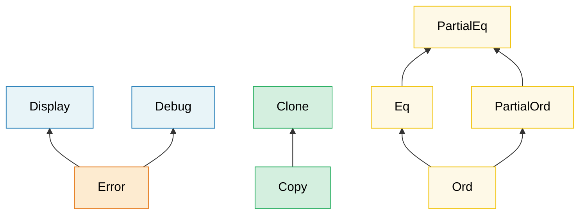

# 2. Traits In Depth 🟡<br><span class="zh-inline">2. 深入理解 Trait 🟡</span>

> **What you'll learn:**<br><span class="zh-inline">**本章将学到什么：**</span>
> - Associated types vs generic parameters — and when to use each<br><span class="zh-inline">关联类型和泛型参数的区别，以及各自适用场景</span>
> - GATs, blanket impls, marker traits, and trait object safety rules<br><span class="zh-inline">GAT、blanket impl、marker trait，以及 trait object 的安全规则</span>
> - How vtables and fat pointers work under the hood<br><span class="zh-inline">vtable 和胖指针在底层究竟怎么工作</span>
> - Extension traits, enum dispatch, and typed command patterns<br><span class="zh-inline">extension trait、enum dispatch，以及 typed command 模式</span>

## Associated Types vs Generic Parameters<br><span class="zh-inline">关联类型 vs 泛型参数</span>

Both let a trait work with different types, but they serve different purposes:<br><span class="zh-inline">它们都能让 trait 面向不同类型工作，但服务的目标其实不一样。</span>

```rust
// --- ASSOCIATED TYPE: One implementation per type ---
trait Iterator {
    type Item; // Each iterator produces exactly ONE kind of item

    fn next(&mut self) -> Option<Self::Item>;
}

// A custom iterator that always yields i32 — there's no choice
struct Counter { max: i32, current: i32 }

impl Iterator for Counter {
    type Item = i32; // Exactly one Item type per implementation
    fn next(&mut self) -> Option<i32> {
        if self.current < self.max {
            self.current += 1;
            Some(self.current)
        } else {
            None
        }
    }
}

// --- GENERIC PARAMETER: Multiple implementations per type ---
trait Convert<T> {
    fn convert(&self) -> T;
}

// A single type can implement Convert for MANY target types:
impl Convert<f64> for i32 {
    fn convert(&self) -> f64 { *self as f64 }
}
impl Convert<String> for i32 {
    fn convert(&self) -> String { self.to_string() }
}
```

**When to use which**:

| Use<br><span class="zh-inline">选择</span> | When<br><span class="zh-inline">适用情况</span> |
|-----|------|
| **Associated type**<br><span class="zh-inline">关联类型</span> | There's exactly ONE natural output/result per implementing type. `Iterator::Item`, `Deref::Target`, `Add::Output`<br><span class="zh-inline">每个实现类型天然只对应一种输出结果</span> |
| **Generic parameter**<br><span class="zh-inline">泛型参数</span> | A type can meaningfully implement the trait for MANY different types. `From<T>`, `AsRef<T>`, `PartialEq<Rhs>`<br><span class="zh-inline">同一个类型有意义地面向很多目标类型实现这个 trait</span> |

**Intuition**: If it makes sense to ask "what is the `Item` of this iterator?", use associated type. If it makes sense to ask "can this convert to `f64`? to `String`? to `bool`?", use a generic parameter.<br><span class="zh-inline">**直觉判断：** 如果问题像“这个迭代器的 `Item` 是什么”，就更像关联类型；如果问题像“它能不能转成 `f64`、`String`、`bool`”，那就更像泛型参数。</span>

```rust
// Real-world example: std::ops::Add
trait Add<Rhs = Self> {
    type Output; // Associated type — addition has ONE result type
    fn add(self, rhs: Rhs) -> Self::Output;
}

// Rhs is a generic parameter — you can add different types to Meters:
struct Meters(f64);
struct Centimeters(f64);

impl Add<Meters> for Meters {
    type Output = Meters;
    fn add(self, rhs: Meters) -> Meters { Meters(self.0 + rhs.0) }
}
impl Add<Centimeters> for Meters {
    type Output = Meters;
    fn add(self, rhs: Centimeters) -> Meters { Meters(self.0 + rhs.0 / 100.0) }
}
```

### Generic Associated Types (GATs)<br><span class="zh-inline">泛型关联类型</span>

Since Rust 1.65, associated types can have generic parameters of their own.
This enables **lending iterators** — iterators that return references tied to
the iterator rather than to the underlying collection:
<br><span class="zh-inline">从 Rust 1.65 开始，关联类型自己也能再带泛型参数。这让 **lending iterator** 这类模式正式可表达，也就是返回值借用自迭代器本身，而不只是借用底层集合。</span>

```rust
// Without GATs — impossible to express a lending iterator:
// trait LendingIterator {
//     type Item<'a>;  // ← This was rejected before 1.65
// }

// With GATs (Rust 1.65+):
trait LendingIterator {
    type Item<'a> where Self: 'a;

    fn next(&mut self) -> Option<Self::Item<'_>>;
}

// Example: an iterator that yields overlapping windows
struct WindowIter<'data> {
    data: &'data [u8],
    pos: usize,
    window_size: usize,
}

impl<'data> LendingIterator for WindowIter<'data> {
    type Item<'a> = &'a [u8] where Self: 'a;

    fn next(&mut self) -> Option<&[u8]> {
        if self.pos + self.window_size <= self.data.len() {
            let window = &self.data[self.pos..self.pos + self.window_size];
            self.pos += 1;
            Some(window)
        } else {
            None
        }
    }
}
```

> **When you need GATs**: Lending iterators, streaming parsers, or any trait
> where the associated type's lifetime depends on the `&self` borrow.
> For most code, plain associated types are sufficient.<br><span class="zh-inline">**什么时候需要 GAT：** lending iterator、流式解析器，或者任何“关联类型生命周期依赖于 `&self` 借用”的 trait。大多数普通代码里，普通关联类型已经够用了。</span>

### Supertraits and Trait Hierarchies<br><span class="zh-inline">Supertrait 与 Trait 层级</span>

Traits can require other traits as prerequisites, forming hierarchies:<br><span class="zh-inline">trait 完全可以把别的 trait 当作前置条件，从而形成层级结构。</span>



> Arrows point from subtrait to supertrait: implementing `Error` requires `Display` + `Debug`.<br><span class="zh-inline">箭头从子 trait 指向父 trait：实现 `Error` 的前提是先实现 `Display` 和 `Debug`。</span>

A trait can require that implementors also implement other traits:

```rust
use std::fmt;

// Display is a supertrait of Error
trait Error: fmt::Display + fmt::Debug {
    fn source(&self) -> Option<&(dyn Error + 'static)> { None }
}
// Any type implementing Error MUST also implement Display and Debug

// Build your own hierarchies:
trait Identifiable {
    fn id(&self) -> u64;
}

trait Timestamped {
    fn created_at(&self) -> chrono::DateTime<chrono::Utc>;
}

// Entity requires both:
trait Entity: Identifiable + Timestamped {
    fn is_active(&self) -> bool;
}

// Implementing Entity forces you to implement all three:
struct User { id: u64, name: String, created: chrono::DateTime<chrono::Utc> }

impl Identifiable for User {
    fn id(&self) -> u64 { self.id }
}
impl Timestamped for User {
    fn created_at(&self) -> chrono::DateTime<chrono::Utc> { self.created }
}
impl Entity for User {
    fn is_active(&self) -> bool { true }
}
```

### Blanket Implementations<br><span class="zh-inline">Blanket Implementation</span>

Implement a trait for ALL types that satisfy some bound:<br><span class="zh-inline">给所有满足某个约束的类型统一实现一个 trait。</span>

```rust
// std does this: any type that implements Display automatically gets ToString
impl<T: fmt::Display> ToString for T {
    fn to_string(&self) -> String {
        format!("{self}")
    }
}
// Now i32, &str, your custom types — anything with Display — gets to_string() for free.

// Your own blanket impl:
trait Loggable {
    fn log(&self);
}

// Every Debug type is automatically Loggable:
impl<T: std::fmt::Debug> Loggable for T {
    fn log(&self) {
        eprintln!("[LOG] {self:?}");
    }
}

// Now ANY Debug type has .log():
// 42.log();              // [LOG] 42
// "hello".log();         // [LOG] "hello"
// vec![1, 2, 3].log();   // [LOG] [1, 2, 3]
```

> **Caution**: Blanket impls are powerful but irreversible — you can't add a
> more specific impl for a type that's already covered by a blanket impl
> (orphan rules + coherence). Design them carefully.<br><span class="zh-inline">**提醒：** blanket impl 威力很大，但一旦铺开就很难回头。一个类型如果已经被 blanket impl 覆盖，后面基本没法再给它补更具体的实现，所以设计时要格外克制。</span>

### Marker Traits<br><span class="zh-inline">标记 Trait</span>

Traits with no methods — they mark a type as having some property:

```rust
// Standard library marker traits:
// Send    — safe to transfer between threads
// Sync    — safe to share (&T) between threads
// Unpin   — safe to move after pinning
// Sized   — has a known size at compile time
// Copy    — can be duplicated with memcpy

// Your own marker trait:
/// Marker: this sensor has been factory-calibrated
trait Calibrated {}

struct RawSensor { reading: f64 }
struct CalibratedSensor { reading: f64 }

impl Calibrated for CalibratedSensor {}

// Only calibrated sensors can be used in production:
fn record_measurement<S: Calibrated>(sensor: &S) {
    // ...
}
// record_measurement(&RawSensor { reading: 0.0 }); // ❌ Compile error
// record_measurement(&CalibratedSensor { reading: 0.0 }); // ✅
```

This connects directly to the **type-state pattern** in Chapter 3.

### Trait Object Safety Rules<br><span class="zh-inline">Trait Object 的安全规则</span>

Not every trait can be used as `dyn Trait`. A trait is **object-safe** only if:

1. **No `Self: Sized` bound** on the trait itself
2. **No generic type parameters** on methods
3. **No use of `Self` in return position** (except via indirection like `Box<Self>`)
4. **No associated functions** (methods must have `&self`, `&mut self`, or `self`)

```rust
// ✅ Object-safe — can be used as dyn Drawable
trait Drawable {
    fn draw(&self);
    fn bounding_box(&self) -> (f64, f64, f64, f64);
}

let shapes: Vec<Box<dyn Drawable>> = vec![/* ... */]; // ✅ Works

// ❌ NOT object-safe — uses Self in return position
trait Cloneable {
    fn clone_self(&self) -> Self;
    //                       ^^^^ Can't know the concrete size at runtime
}
// let items: Vec<Box<dyn Cloneable>> = ...; // ❌ Compile error

// ❌ NOT object-safe — generic method
trait Converter {
    fn convert<T>(&self) -> T;
    //        ^^^ The vtable can't contain infinite monomorphizations
}

// ❌ NOT object-safe — associated function (no self)
trait Factory {
    fn create() -> Self;
    // No &self — how would you call this through a trait object?
}
```

**Workarounds**:

```rust
// Add `where Self: Sized` to exclude a method from the vtable:
trait MyTrait {
    fn regular_method(&self); // Included in vtable

    fn generic_method<T>(&self) -> T
    where
        Self: Sized; // Excluded from vtable — can't be called via dyn MyTrait
}

// Now dyn MyTrait is valid, but generic_method can only be called
// when the concrete type is known.
```

> **Rule of thumb**: If you plan to use `dyn Trait`, keep methods simple —
> no generics, no `Self` in return types, no `Sized` bounds. When in doubt,
> try `let _: Box<dyn YourTrait>;` and let the compiler tell you.<br><span class="zh-inline">**经验法则：** 只要准备走 `dyn Trait`，方法就尽量简单点：别带泛型，别在返回位置暴露 `Self`，别强绑 `Sized`。拿不准时，直接写个 `let _: Box&lt;dyn YourTrait&gt;;` 让编译器开口说话。</span>

### Trait Objects Under the Hood — vtables and Fat Pointers<br><span class="zh-inline">Trait Object 底层：vtable 与胖指针</span>

A `&dyn Trait` (or `Box<dyn Trait>`) is a **fat pointer** — two machine words:

```text
┌──────────────────────────────────────────────────┐
│  &dyn Drawable (on 64-bit: 16 bytes total)       │
├──────────────┬───────────────────────────────────┤
│  data_ptr    │  vtable_ptr                       │
│  (8 bytes)   │  (8 bytes)                        │
│  ↓           │  ↓                                │
│  ┌─────────┐ │  ┌──────────────────────────────┐ │
│  │ Circle  │ │  │ vtable for <Circle as        │ │
│  │ {       │ │  │           Drawable>           │ │
│  │  r: 5.0 │ │  │                              │ │
│  │ }       │ │  │  drop_in_place: 0x7f...a0    │ │
│  └─────────┘ │  │  size:           8            │ │
│              │  │  align:          8            │ │
│              │  │  draw:          0x7f...b4     │ │
│              │  │  bounding_box:  0x7f...c8     │ │
│              │  └──────────────────────────────┘ │
└──────────────┴───────────────────────────────────┘
```

**How a vtable call works** (e.g., `shape.draw()`):

1. Load `vtable_ptr` from the fat pointer (second word)
2. Index into the vtable to find the `draw` function pointer
3. Call it, passing `data_ptr` as the `self` argument

This is similar to C++ virtual dispatch in cost (one pointer indirection
per call), but Rust stores the vtable pointer in the fat pointer rather
than inside the object — so a plain `Circle` on the stack carries no
vtable pointer at all.

```rust
trait Drawable {
    fn draw(&self);
    fn area(&self) -> f64;
}

struct Circle { radius: f64 }

impl Drawable for Circle {
    fn draw(&self) { println!("Drawing circle r={}", self.radius); }
    fn area(&self) -> f64 { std::f64::consts::PI * self.radius * self.radius }
}

struct Square { side: f64 }

impl Drawable for Square {
    fn draw(&self) { println!("Drawing square s={}", self.side); }
    fn area(&self) -> f64 { self.side * self.side }
}

fn main() {
    let shapes: Vec<Box<dyn Drawable>> = vec![
        Box::new(Circle { radius: 5.0 }),
        Box::new(Square { side: 3.0 }),
    ];

    // Each element is a fat pointer: (data_ptr, vtable_ptr)
    // The vtable for Circle and Square are DIFFERENT
    for shape in &shapes {
        shape.draw();  // vtable dispatch → Circle::draw or Square::draw
        println!("  area = {:.2}", shape.area());
    }

    // Size comparison:
    println!("size_of::<&Circle>()        = {}", std::mem::size_of::<&Circle>());
    // → 8 bytes (one pointer — the compiler knows the type)
    println!("size_of::<&dyn Drawable>()  = {}", std::mem::size_of::<&dyn Drawable>());
    // → 16 bytes (data_ptr + vtable_ptr)
}
```

**Performance cost model**:

| Aspect<br><span class="zh-inline">维度</span> | Static dispatch (`impl Trait` / generics)<br><span class="zh-inline">静态分发</span> | Dynamic dispatch (`dyn Trait`)<br><span class="zh-inline">动态分发</span> |
|--------|------------------------------------------|-------------------------------|
| Call overhead<br><span class="zh-inline">调用开销</span> | Zero — inlined by LLVM<br><span class="zh-inline">接近零，可被 LLVM 内联</span> | One pointer indirection per call<br><span class="zh-inline">每次调用多一次指针间接跳转</span> |
| Inlining<br><span class="zh-inline">内联能力</span> | ✅ Compiler can inline<br><span class="zh-inline">✅ 编译器能内联</span> | ❌ Opaque function pointer<br><span class="zh-inline">❌ 对编译器来说是黑盒函数指针</span> |
| Binary size<br><span class="zh-inline">二进制体积</span> | Larger (one copy per type)<br><span class="zh-inline">通常更大，每种类型一份实例化代码</span> | Smaller (one shared function)<br><span class="zh-inline">通常更小，共享同一套分发表</span> |
| Pointer size<br><span class="zh-inline">指针大小</span> | Thin (1 word)<br><span class="zh-inline">瘦指针，一字宽</span> | Fat (2 words)<br><span class="zh-inline">胖指针，两字宽</span> |
| Heterogeneous collections<br><span class="zh-inline">异构集合</span> | ❌ | ✅ `Vec<Box<dyn Trait>>` |

> **When vtable cost matters**: In tight loops calling a trait method millions
> of times, the indirection and inability to inline can be significant (2-10×
> slower). For cold paths, configuration, or plugin architectures, the
> flexibility of `dyn Trait` is worth the small cost.<br><span class="zh-inline">**什么时候 vtable 成本真的重要：** 如果 trait 方法处在高频热循环里，额外间接跳转和无法内联会很明显；但如果是冷路径、配置逻辑或者插件架构，这点代价通常完全值得。</span>

### Higher-Ranked Trait Bounds (HRTBs)<br><span class="zh-inline">高阶 Trait Bound</span>

Sometimes you need a function that works with references of *any* lifetime, not a specific one. This is where `for<'a>` syntax appears:

```rust
// Problem: this function needs a closure that can process
// references with ANY lifetime, not just one specific lifetime.

// ❌ This is too restrictive — 'a is fixed by the caller:
// fn apply<'a, F: Fn(&'a str) -> &'a str>(f: F, data: &'a str) -> &'a str

// ✅ HRTB: F must work for ALL possible lifetimes:
fn apply<F>(f: F, data: &str) -> &str
where
    F: for<'a> Fn(&'a str) -> &'a str,
{
    f(data)
}

fn main() {
    let result = apply(|s| s.trim(), "  hello  ");
    println!("{result}"); // "hello"
}
```

**When you encounter HRTBs**:
- `Fn(&T) -> &U` traits — the compiler infers `for<'a>` automatically in most cases
- Custom trait implementations that must work across different borrows
- Deserialization with `serde`: `for<'de> Deserialize<'de>`

```rust,ignore
// serde's DeserializeOwned is defined as:
// trait DeserializeOwned: for<'de> Deserialize<'de> {}
// Meaning: "can be deserialized from data with ANY lifetime"
// (i.e., the result doesn't borrow from the input)

use serde::de::DeserializeOwned;

fn parse_json<T: DeserializeOwned>(input: &str) -> T {
    serde_json::from_str(input).unwrap()
}
```

> **Practical advice**: You'll rarely write `for<'a>` yourself. It mostly appears
> in trait bounds on closure parameters, where the compiler handles it implicitly.
> But recognizing it in error messages ("expected a `for<'a> Fn(&'a ...)` bound")
> helps you understand what the compiler is asking for.<br><span class="zh-inline">**实用建议：** 平时很少需要亲手写 `for&lt;'a&gt;`。它更多出现在闭包参数的 trait bound 里，由编译器帮忙推导。真正重要的是，看到报错里冒出 `for&lt;'a&gt; Fn(&amp;'a ...)` 这类东西时，知道编译器到底在要求什么。</span>

### `impl Trait` — Argument Position vs Return Position<br><span class="zh-inline">`impl Trait`：参数位置 vs 返回位置</span>

`impl Trait` appears in two positions with **different semantics**:

```rust
// --- Argument-Position impl Trait (APIT) ---
// "Caller chooses the type" — syntactic sugar for a generic parameter
fn print_all(items: impl Iterator<Item = i32>) {
    for item in items { println!("{item}"); }
}
// Equivalent to:
fn print_all_verbose<I: Iterator<Item = i32>>(items: I) {
    for item in items { println!("{item}"); }
}
// Caller decides: print_all(vec![1,2,3].into_iter())
//                 print_all(0..10)

// --- Return-Position impl Trait (RPIT) ---
// "Callee chooses the type" — the function picks one concrete type
fn evens(limit: i32) -> impl Iterator<Item = i32> {
    (0..limit).filter(|x| x % 2 == 0)
    // The concrete type is Filter<Range<i32>, Closure>
    // but the caller only sees "some Iterator<Item = i32>"
}
```

**Key difference**:

| | APIT (`fn foo(x: impl T)`) | RPIT (`fn foo() -> impl T`) |
|---|---|---|
| Who picks the type?<br><span class="zh-inline">谁决定具体类型</span> | Caller<br><span class="zh-inline">调用方</span> | Callee (function body)<br><span class="zh-inline">被调函数自身</span> |
| Monomorphized?<br><span class="zh-inline">是否单态化</span> | Yes — one copy per type<br><span class="zh-inline">是，每种类型一份代码</span> | Yes — one concrete type<br><span class="zh-inline">是，但函数体只决定一个具体类型</span> |
| Turbofish?<br><span class="zh-inline">能否显式写 turbofish</span> | No (`foo::<X>()` not allowed)<br><span class="zh-inline">不能</span> | N/A |
| Equivalent to<br><span class="zh-inline">近似等价形式</span> | `fn foo<X: T>(x: X)` | Existential type<br><span class="zh-inline">存在类型语义</span> |

#### RPIT in Trait Definitions (RPITIT)<br><span class="zh-inline">Trait 定义中的 RPIT</span>

Since Rust 1.75, you can use `-> impl Trait` directly in trait definitions:

```rust
trait Container {
    fn items(&self) -> impl Iterator<Item = &str>;
    //                 ^^^^ Each implementor returns its own concrete type
}

struct CsvRow {
    fields: Vec<String>,
}

impl Container for CsvRow {
    fn items(&self) -> impl Iterator<Item = &str> {
        self.fields.iter().map(String::as_str)
    }
}

struct FixedFields;

impl Container for FixedFields {
    fn items(&self) -> impl Iterator<Item = &str> {
        ["host", "port", "timeout"].into_iter()
    }
}
```

> **Before Rust 1.75**, you had to use `Box<dyn Iterator>` or an associated
> type to achieve this in traits. RPITIT removes the allocation.<br><span class="zh-inline">**在 Rust 1.75 之前，** 如果想在 trait 里表达这种模式，通常只能退回 `Box&lt;dyn Iterator&gt;` 或关联类型。RPITIT 把这层额外分配省掉了。</span>

#### `impl Trait` vs `dyn Trait` — Decision Guide<br><span class="zh-inline">`impl Trait` 与 `dyn Trait` 选择指南</span>

```text
Do you know the concrete type at compile time?
├── YES → Use impl Trait or generics (zero cost, inlinable)
└── NO  → Do you need a heterogeneous collection?
     ├── YES → Use dyn Trait (Box<dyn T>, &dyn T)
     └── NO  → Do you need the SAME trait object across an API boundary?
          ├── YES → Use dyn Trait
          └── NO  → Use generics / impl Trait
```

| Feature<br><span class="zh-inline">特性</span> | `impl Trait` | `dyn Trait` |
|---------|-------------|------------|
| Dispatch<br><span class="zh-inline">分发方式</span> | Static (monomorphized)<br><span class="zh-inline">静态分发</span> | Dynamic (vtable)<br><span class="zh-inline">动态分发</span> |
| Performance<br><span class="zh-inline">性能</span> | Best — inlinable<br><span class="zh-inline">最好，可内联</span> | One indirection per call<br><span class="zh-inline">每次调用一次间接跳转</span> |
| Heterogeneous collections<br><span class="zh-inline">异构集合</span> | ❌ | ✅ |
| Binary size per type<br><span class="zh-inline">每种类型的代码体积</span> | One copy each<br><span class="zh-inline">每种类型各自一份</span> | Shared code<br><span class="zh-inline">共享代码</span> |
| Trait must be object-safe?<br><span class="zh-inline">trait 是否必须 object-safe</span> | No | Yes |
| Works in trait definitions<br><span class="zh-inline">能否直接写在 trait 定义里</span> | ✅ (Rust 1.75+)<br><span class="zh-inline">✅ Rust 1.75 及以后</span> | Always<br><span class="zh-inline">一直都能</span> |

***

## Type Erasure with `Any` and `TypeId`<br><span class="zh-inline">用 `Any` 和 `TypeId` 做类型擦除</span>

Sometimes you need to store values of *unknown* types and downcast them later — a pattern
familiar from `void*` in C or `object` in C#. Rust provides this through `std::any::Any`:

```rust
use std::any::Any;

// Store heterogeneous values:
fn log_value(value: &dyn Any) {
    if let Some(s) = value.downcast_ref::<String>() {
        println!("String: {s}");
    } else if let Some(n) = value.downcast_ref::<i32>() {
        println!("i32: {n}");
    } else {
        // TypeId lets you inspect the type at runtime:
        println!("Unknown type: {:?}", value.type_id());
    }
}

// Useful for plugin systems, event buses, or ECS-style architectures:
struct AnyMap(std::collections::HashMap<std::any::TypeId, Box<dyn Any + Send>>);

impl AnyMap {
    fn new() -> Self { AnyMap(std::collections::HashMap::new()) }

    fn insert<T: Any + Send + 'static>(&mut self, value: T) {
        self.0.insert(std::any::TypeId::of::<T>(), Box::new(value));
    }

    fn get<T: Any + Send + 'static>(&self) -> Option<&T> {
        self.0.get(&std::any::TypeId::of::<T>())?
            .downcast_ref()
    }
}

fn main() {
    let mut map = AnyMap::new();
    map.insert(42_i32);
    map.insert(String::from("hello"));

    assert_eq!(map.get::<i32>(), Some(&42));
    assert_eq!(map.get::<String>().map(|s| s.as_str()), Some("hello"));
    assert_eq!(map.get::<f64>(), None); // Never inserted
}
```

> **When to use `Any`**: Plugin/extension systems, type-indexed maps (`typemap`),
> error downcasting (`anyhow::Error::downcast_ref`). Prefer generics or trait
> objects when the set of types is known at compile time — `Any` is a last resort
> that trades compile-time safety for flexibility.<br><span class="zh-inline">**什么时候用 `Any`：** 插件系统、按类型索引的 map、错误下转型等场景都很常见。但只要类型集合在编译期是已知的，优先还是该选泛型或 trait object；`Any` 更像最后的逃生门，用灵活性换掉一部分编译期约束。</span>

***

## Extension Traits — Adding Methods to Types You Don't Own<br><span class="zh-inline">Extension Trait：给不归自己管的类型补方法</span>

Rust's orphan rule prevents you from implementing a foreign trait on a foreign type.
Extension traits are the standard workaround: define a **new trait** in your crate whose
methods have a blanket implementation for any type that meets a bound. The caller imports
the trait and the new methods appear on existing types.

This pattern is pervasive in the Rust ecosystem: `itertools::Itertools`, `futures::StreamExt`,
`tokio::io::AsyncReadExt`, `tower::ServiceExt`.

### The Problem<br><span class="zh-inline">问题</span>

```rust
// We want to add a .mean() method to all iterators that yield f64.
// But Iterator is defined in std and f64 is a primitive — orphan rule prevents:
//
// impl<I: Iterator<Item = f64>> I {   // ❌ Cannot add inherent methods to a foreign type
//     fn mean(self) -> f64 { ... }
// }
```

### The Solution: An Extension Trait<br><span class="zh-inline">解法：定义一个 Extension Trait</span>

```rust
/// Extension methods for iterators over numeric values.
pub trait IteratorExt: Iterator {
    /// Computes the arithmetic mean. Returns `None` for empty iterators.
    fn mean(self) -> Option<f64>
    where
        Self: Sized,
        Self::Item: Into<f64>;
}

// Blanket implementation — automatically applies to ALL iterators
impl<I: Iterator> IteratorExt for I {
    fn mean(self) -> Option<f64>
    where
        Self: Sized,
        Self::Item: Into<f64>,
    {
        let mut sum: f64 = 0.0;
        let mut count: u64 = 0;
        for item in self {
            sum += item.into();
            count += 1;
        }
        if count == 0 { None } else { Some(sum / count as f64) }
    }
}

// Usage — just import the trait:
use crate::IteratorExt;  // One import and the method appears on all iterators

fn analyze_temperatures(readings: &[f64]) -> Option<f64> {
    readings.iter().copied().mean()  // .mean() is now available!
}

fn analyze_sensor_data(data: &[i32]) -> Option<f64> {
    data.iter().copied().mean()  // Works on i32 too (i32: Into<f64>)
}
```

### Real-World Example: Diagnostic Result Extensions<br><span class="zh-inline">真实例子：诊断结果的扩展方法</span>

```rust
use std::collections::HashMap;

struct DiagResult {
    component: String,
    passed: bool,
    message: String,
}

/// Extension trait for Vec<DiagResult> — adds domain-specific analysis methods.
pub trait DiagResultsExt {
    fn passed_count(&self) -> usize;
    fn failed_count(&self) -> usize;
    fn overall_pass(&self) -> bool;
    fn failures_by_component(&self) -> HashMap<String, Vec<&DiagResult>>;
}

impl DiagResultsExt for Vec<DiagResult> {
    fn passed_count(&self) -> usize {
        self.iter().filter(|r| r.passed).count()
    }

    fn failed_count(&self) -> usize {
        self.iter().filter(|r| !r.passed).count()
    }

    fn overall_pass(&self) -> bool {
        self.iter().all(|r| r.passed)
    }

    fn failures_by_component(&self) -> HashMap<String, Vec<&DiagResult>> {
        let mut map = HashMap::new();
        for r in self.iter().filter(|r| !r.passed) {
            map.entry(r.component.clone()).or_default().push(r);
        }
        map
    }
}

// Now any Vec<DiagResult> has these methods:
fn report(results: Vec<DiagResult>) {
    if !results.overall_pass() {
        let failures = results.failures_by_component();
        for (component, fails) in &failures {
            eprintln!("{component}: {} failures", fails.len());
        }
    }
}
```

### Naming Convention<br><span class="zh-inline">命名约定</span>

The Rust ecosystem uses a consistent `Ext` suffix:

| Crate<br><span class="zh-inline">crate</span> | Extension Trait<br><span class="zh-inline">扩展 trait</span> | Extends<br><span class="zh-inline">扩展对象</span> |
|-------|----------------|---------|
| `itertools` | `Itertools` | `Iterator` |
| `futures` | `StreamExt`, `FutureExt` | `Stream`, `Future` |
| `tokio` | `AsyncReadExt`, `AsyncWriteExt` | `AsyncRead`, `AsyncWrite` |
| `tower` | `ServiceExt` | `Service` |
| `bytes` | `BufMut` (partial) | `&mut [u8]` |
| Your crate<br><span class="zh-inline">自家 crate</span> | `DiagResultsExt` | `Vec<DiagResult>` |

### When to Use<br><span class="zh-inline">什么时候该用</span>

| Situation<br><span class="zh-inline">场景</span> | Use Extension Trait?<br><span class="zh-inline">是否适合用 Extension Trait</span> |
|-----------|:---:|
| Adding convenience methods to a foreign type<br><span class="zh-inline">给外部类型补便捷方法</span> | ✅ |
| Grouping domain-specific logic on generic collections<br><span class="zh-inline">把领域逻辑挂到泛型集合上</span> | ✅ |
| The method needs access to private fields<br><span class="zh-inline">方法需要访问私有字段</span> | ❌ (use a wrapper/newtype)<br><span class="zh-inline">❌ 更适合包装类型或 newtype</span> |
| The method logically belongs on a new type you control<br><span class="zh-inline">方法本来就属于自己掌控的新类型</span> | ❌ (just add it to your type)<br><span class="zh-inline">❌ 直接加到自己的类型上就行</span> |
| You want the method available without any import<br><span class="zh-inline">希望调用方完全不用引入 trait</span> | ❌ (inherent methods only)<br><span class="zh-inline">❌ 这只能靠固有方法</span> |

***

## Enum Dispatch — Static Polymorphism Without `dyn`<br><span class="zh-inline">Enum Dispatch：不靠 `dyn` 的静态多态</span>

When you have a **closed set** of types implementing a trait, you can replace `dyn Trait`
with an enum whose variants hold the concrete types. This eliminates the vtable indirection
and heap allocation while preserving the same caller-facing interface.

### The Problem with `dyn Trait`<br><span class="zh-inline">`dyn Trait` 的问题</span>

```rust
trait Sensor {
    fn read(&self) -> f64;
    fn name(&self) -> &str;
}

struct Gps { lat: f64, lon: f64 }
struct Thermometer { temp_c: f64 }
struct Accelerometer { g_force: f64 }

impl Sensor for Gps {
    fn read(&self) -> f64 { self.lat }
    fn name(&self) -> &str { "GPS" }
}
impl Sensor for Thermometer {
    fn read(&self) -> f64 { self.temp_c }
    fn name(&self) -> &str { "Thermometer" }
}
impl Sensor for Accelerometer {
    fn read(&self) -> f64 { self.g_force }
    fn name(&self) -> &str { "Accelerometer" }
}

// Heterogeneous collection with dyn — works, but has costs:
fn read_all_dyn(sensors: &[Box<dyn Sensor>]) -> Vec<f64> {
    sensors.iter().map(|s| s.read()).collect()
    // Each .read() goes through a vtable indirection
    // Each Box allocates on the heap
}
```

### The Enum Dispatch Solution<br><span class="zh-inline">Enum Dispatch 解法</span>

```rust
// Replace the trait object with an enum:
enum AnySensor {
    Gps(Gps),
    Thermometer(Thermometer),
    Accelerometer(Accelerometer),
}

impl AnySensor {
    fn read(&self) -> f64 {
        match self {
            AnySensor::Gps(s) => s.read(),
            AnySensor::Thermometer(s) => s.read(),
            AnySensor::Accelerometer(s) => s.read(),
        }
    }

    fn name(&self) -> &str {
        match self {
            AnySensor::Gps(s) => s.name(),
            AnySensor::Thermometer(s) => s.name(),
            AnySensor::Accelerometer(s) => s.name(),
        }
    }
}

// Now: no heap allocation, no vtable, stored inline
fn read_all(sensors: &[AnySensor]) -> Vec<f64> {
    sensors.iter().map(|s| s.read()).collect()
    // Each .read() is a match branch — compiler can inline everything
}

fn main() {
    let sensors = vec![
        AnySensor::Gps(Gps { lat: 47.6, lon: -122.3 }),
        AnySensor::Thermometer(Thermometer { temp_c: 72.5 }),
        AnySensor::Accelerometer(Accelerometer { g_force: 1.02 }),
    ];

    for sensor in &sensors {
        println!("{}: {:.2}", sensor.name(), sensor.read());
    }
}
```

### Implement the Trait on the Enum<br><span class="zh-inline">在枚举上实现 Trait</span>

For interoperability, you can implement the original trait on the enum itself:

```rust
impl Sensor for AnySensor {
    fn read(&self) -> f64 {
        match self {
            AnySensor::Gps(s) => s.read(),
            AnySensor::Thermometer(s) => s.read(),
            AnySensor::Accelerometer(s) => s.read(),
        }
    }

    fn name(&self) -> &str {
        match self {
            AnySensor::Gps(s) => s.name(),
            AnySensor::Thermometer(s) => s.name(),
            AnySensor::Accelerometer(s) => s.name(),
        }
    }
}

// Now AnySensor works anywhere a Sensor is expected via generics:
fn report<S: Sensor>(s: &S) {
    println!("{}: {:.2}", s.name(), s.read());
}
```

### Reducing Boilerplate with a Macro<br><span class="zh-inline">用宏减少样板代码</span>

The match-arm delegation is repetitive. A macro eliminates it:

```rust
macro_rules! dispatch_sensor {
    ($self:expr, $method:ident $(, $arg:expr)*) => {
        match $self {
            AnySensor::Gps(s) => s.$method($($arg),*),
            AnySensor::Thermometer(s) => s.$method($($arg),*),
            AnySensor::Accelerometer(s) => s.$method($($arg),*),
        }
    };
}

impl Sensor for AnySensor {
    fn read(&self) -> f64     { dispatch_sensor!(self, read) }
    fn name(&self) -> &str    { dispatch_sensor!(self, name) }
}
```

For larger projects, the `enum_dispatch` crate automates this entirely:

```rust
use enum_dispatch::enum_dispatch;

#[enum_dispatch]
trait Sensor {
    fn read(&self) -> f64;
    fn name(&self) -> &str;
}

#[enum_dispatch(Sensor)]
enum AnySensor {
    Gps,
    Thermometer,
    Accelerometer,
}
// All delegation code is generated automatically.
```

### `dyn Trait` vs Enum Dispatch — Decision Guide<br><span class="zh-inline">`dyn Trait` 与 Enum Dispatch 选择指南</span>

```text
Is the set of types closed (known at compile time)?
├── YES → Prefer enum dispatch (faster, no heap allocation)
│         ├── Few variants (< ~20)?     → Manual enum
│         └── Many variants or growing? → enum_dispatch crate
└── NO  → Must use dyn Trait (plugins, user-provided types)
```

| Property<br><span class="zh-inline">属性</span> | `dyn Trait` | Enum Dispatch |
|----------|:-----------:|:-------------:|
| Dispatch cost<br><span class="zh-inline">分发成本</span> | Vtable indirection (~2ns)<br><span class="zh-inline">vtable 间接跳转</span> | Branch prediction (~0.3ns)<br><span class="zh-inline">分支预测开销</span> |
| Heap allocation<br><span class="zh-inline">堆分配</span> | Usually (Box)<br><span class="zh-inline">通常需要</span> | None (inline)<br><span class="zh-inline">通常不需要</span> |
| Cache-friendly<br><span class="zh-inline">缓存友好性</span> | No (pointer chasing)<br><span class="zh-inline">差，容易指针追逐</span> | Yes (contiguous)<br><span class="zh-inline">更好，布局连续</span> |
| Open to new types<br><span class="zh-inline">是否对新类型开放</span> | ✅ (anyone can impl) | ❌ (closed set) |
| Code size<br><span class="zh-inline">代码体积</span> | Shared<br><span class="zh-inline">共享</span> | One copy per variant<br><span class="zh-inline">每个变体一份</span> |
| Trait must be object-safe<br><span class="zh-inline">trait 是否必须 object-safe</span> | Yes | No |
| Adding a variant<br><span class="zh-inline">新增变体的代价</span> | No code changes<br><span class="zh-inline">通常不用改既有调用代码</span> | Update enum + match arms<br><span class="zh-inline">要同步更新枚举和匹配分支</span> |

### When to Use Enum Dispatch<br><span class="zh-inline">什么时候该用 Enum Dispatch</span>

| Scenario<br><span class="zh-inline">场景</span> | Recommendation<br><span class="zh-inline">建议</span> |
|----------|---------------|
| Diagnostic test types (CPU, GPU, NIC, Memory, ...)<br><span class="zh-inline">诊断测试类型这种封闭集合</span> | ✅ Enum dispatch — closed set, known at compile time<br><span class="zh-inline">✅ 适合 enum dispatch</span> |
| Bus protocols (SPI, I2C, UART, ...)<br><span class="zh-inline">总线协议</span> | ✅ Enum dispatch or Config trait<br><span class="zh-inline">✅ enum dispatch 或 Config trait 都行</span> |
| Plugin system (user loads .so at runtime)<br><span class="zh-inline">运行时插件系统</span> | ❌ Use `dyn Trait`<br><span class="zh-inline">❌ 更适合 `dyn Trait`</span> |
| 2-3 variants<br><span class="zh-inline">只有 2 到 3 个变体</span> | ✅ Manual enum dispatch<br><span class="zh-inline">✅ 手写枚举分发就够</span> |
| 10+ variants with many methods<br><span class="zh-inline">10 个以上变体且方法很多</span> | ✅ `enum_dispatch` crate |
| Performance-critical inner loop<br><span class="zh-inline">性能敏感的内循环</span> | ✅ Enum dispatch (eliminates vtable)<br><span class="zh-inline">✅ enum dispatch 更合适</span> |

***

## Capability Mixins — Associated Types as Zero-Cost Composition<br><span class="zh-inline">Capability Mixin：用关联类型做零成本组合</span>

Ruby developers compose behaviour with **mixins** — `include SomeModule` injects methods
into a class.  Rust traits with **associated types + default methods + blanket impls**
produce the same result, except:

* Everything resolves at **compile time** — no method-missing surprises
* Each associated type is a **knob** that changes what the default methods produce
* The compiler **monomorphises** each combination — zero vtable overhead

### The Problem: Cross-Cutting Bus Dependencies<br><span class="zh-inline">问题：横切式总线依赖</span>

Hardware diagnostic routines share common operations — read an IPMI sensor, toggle a
GPIO rail, sample a temperature over SPI — but different diagnostics need different
combinations.  Inheritance hierarchies don't exist in Rust.  Passing every bus handle
as a function argument creates unwieldy signatures.  We need a way to **mix in** bus
capabilities à la carte.

### Step 1 — Define "Ingredient" Traits<br><span class="zh-inline">第 1 步：定义 Ingredient Trait</span>

Each ingredient provides one hardware capability via an associated type:

```rust
use std::io;

// ── Bus abstractions (traits the hardware team provides) ──────────
pub trait SpiBus {
    fn spi_transfer(&self, tx: &[u8], rx: &mut [u8]) -> io::Result<()>;
}

pub trait I2cBus {
    fn i2c_read(&self, addr: u8, reg: u8, buf: &mut [u8]) -> io::Result<()>;
    fn i2c_write(&self, addr: u8, reg: u8, data: &[u8]) -> io::Result<()>;
}

pub trait GpioPin {
    fn set_high(&self) -> io::Result<()>;
    fn set_low(&self) -> io::Result<()>;
    fn read_level(&self) -> io::Result<bool>;
}

pub trait IpmiBmc {
    fn raw_command(&self, net_fn: u8, cmd: u8, data: &[u8]) -> io::Result<Vec<u8>>;
    fn read_sensor(&self, sensor_id: u8) -> io::Result<f64>;
}

// ── Ingredient traits — one per bus, carries an associated type ───
pub trait HasSpi {
    type Spi: SpiBus;
    fn spi(&self) -> &Self::Spi;
}

pub trait HasI2c {
    type I2c: I2cBus;
    fn i2c(&self) -> &Self::I2c;
}

pub trait HasGpio {
    type Gpio: GpioPin;
    fn gpio(&self) -> &Self::Gpio;
}

pub trait HasIpmi {
    type Ipmi: IpmiBmc;
    fn ipmi(&self) -> &Self::Ipmi;
}
```

Each ingredient is tiny, generic, and testable in isolation.

### Step 2 — Define "Mixin" Traits<br><span class="zh-inline">第 2 步：定义 Mixin Trait</span>

A mixin trait declares its required ingredients as supertraits, then provides all
its methods via **defaults** — implementors get them for free:

```rust
/// Mixin: fan diagnostics — needs I2C (tachometer) + GPIO (PWM enable)
pub trait FanDiagMixin: HasI2c + HasGpio {
    /// Read fan RPM from the tachometer IC over I2C.
    fn read_fan_rpm(&self, fan_id: u8) -> io::Result<u32> {
        let mut buf = [0u8; 2];
        self.i2c().i2c_read(0x48 + fan_id, 0x00, &mut buf)?;
        Ok(u16::from_be_bytes(buf) as u32 * 60) // tach counts → RPM
    }

    /// Enable or disable the fan PWM output via GPIO.
    fn set_fan_pwm(&self, enable: bool) -> io::Result<()> {
        if enable { self.gpio().set_high() }
        else      { self.gpio().set_low() }
    }

    /// Full fan health check — read RPM + verify within threshold.
    fn check_fan_health(&self, fan_id: u8, min_rpm: u32) -> io::Result<bool> {
        let rpm = self.read_fan_rpm(fan_id)?;
        Ok(rpm >= min_rpm)
    }
}

/// Mixin: temperature monitoring — needs SPI (thermocouple ADC) + IPMI (BMC sensors)
pub trait TempMonitorMixin: HasSpi + HasIpmi {
    /// Read a thermocouple via the SPI ADC (e.g. MAX31855).
    fn read_thermocouple(&self) -> io::Result<f64> {
        let mut rx = [0u8; 4];
        self.spi().spi_transfer(&[0x00; 4], &mut rx)?;
        let raw = i32::from_be_bytes(rx) >> 18; // 14-bit signed
        Ok(raw as f64 * 0.25)
    }

    /// Read a BMC-managed temperature sensor via IPMI.
    fn read_bmc_temp(&self, sensor_id: u8) -> io::Result<f64> {
        self.ipmi().read_sensor(sensor_id)
    }

    /// Cross-validate: thermocouple vs BMC must agree within delta.
    fn validate_temps(&self, sensor_id: u8, max_delta: f64) -> io::Result<bool> {
        let tc = self.read_thermocouple()?;
        let bmc = self.read_bmc_temp(sensor_id)?;
        Ok((tc - bmc).abs() <= max_delta)
    }
}

/// Mixin: power sequencing — needs GPIO (rail enable) + IPMI (event logging)
pub trait PowerSeqMixin: HasGpio + HasIpmi {
    /// Assert the power-good GPIO and verify via IPMI sensor.
    fn enable_power_rail(&self, sensor_id: u8) -> io::Result<bool> {
        self.gpio().set_high()?;
        std::thread::sleep(std::time::Duration::from_millis(50));
        let voltage = self.ipmi().read_sensor(sensor_id)?;
        Ok(voltage > 0.8) // above 80% nominal = good
    }

    /// De-assert power and log shutdown via IPMI OEM command.
    fn disable_power_rail(&self) -> io::Result<()> {
        self.gpio().set_low()?;
        // Log OEM "power rail disabled" event to BMC
        self.ipmi().raw_command(0x2E, 0x01, &[0x00, 0x01])?;
        Ok(())
    }
}
```

### Step 3 — Blanket Impls Make It Truly "Mixin"<br><span class="zh-inline">第 3 步：用 Blanket Impl 让它真正像 Mixin</span>

The magic line — provide the ingredients, get the methods:

```rust
impl<T: HasI2c + HasGpio>  FanDiagMixin    for T {}
impl<T: HasSpi  + HasIpmi>  TempMonitorMixin for T {}
impl<T: HasGpio + HasIpmi>  PowerSeqMixin   for T {}
```

Any struct that implements the right ingredient traits **automatically** gains every
mixin method — no boilerplate, no forwarding, no inheritance.

### Step 4 — Wire Up Production<br><span class="zh-inline">第 4 步：接到生产实现里</span>

```rust
// ── Concrete bus implementations (Linux platform) ────────────────
struct LinuxSpi  { dev: String }
struct LinuxI2c  { dev: String }
struct SysfsGpio { pin: u32 }
struct IpmiTool  { timeout_secs: u32 }

impl SpiBus for LinuxSpi {
    fn spi_transfer(&self, _tx: &[u8], _rx: &mut [u8]) -> io::Result<()> {
        // spidev ioctl — omitted for brevity
        Ok(())
    }
}
impl I2cBus for LinuxI2c {
    fn i2c_read(&self, _addr: u8, _reg: u8, _buf: &mut [u8]) -> io::Result<()> {
        // i2c-dev ioctl — omitted for brevity
        Ok(())
    }
    fn i2c_write(&self, _addr: u8, _reg: u8, _data: &[u8]) -> io::Result<()> { Ok(()) }
}
impl GpioPin for SysfsGpio {
    fn set_high(&self) -> io::Result<()>  { /* /sys/class/gpio */ Ok(()) }
    fn set_low(&self) -> io::Result<()>   { Ok(()) }
    fn read_level(&self) -> io::Result<bool> { Ok(true) }
}
impl IpmiBmc for IpmiTool {
    fn raw_command(&self, _nf: u8, _cmd: u8, _data: &[u8]) -> io::Result<Vec<u8>> {
        // shells out to ipmitool — omitted for brevity
        Ok(vec![])
    }
    fn read_sensor(&self, _id: u8) -> io::Result<f64> { Ok(25.0) }
}

// ── Production platform — all four buses ─────────────────────────
struct DiagPlatform {
    spi:  LinuxSpi,
    i2c:  LinuxI2c,
    gpio: SysfsGpio,
    ipmi: IpmiTool,
}

impl HasSpi  for DiagPlatform { type Spi  = LinuxSpi;  fn spi(&self)  -> &LinuxSpi  { &self.spi  } }
impl HasI2c  for DiagPlatform { type I2c  = LinuxI2c;  fn i2c(&self)  -> &LinuxI2c  { &self.i2c  } }
impl HasGpio for DiagPlatform { type Gpio = SysfsGpio; fn gpio(&self) -> &SysfsGpio { &self.gpio } }
impl HasIpmi for DiagPlatform { type Ipmi = IpmiTool;  fn ipmi(&self) -> &IpmiTool  { &self.ipmi } }

// DiagPlatform now has ALL mixin methods:
fn production_diagnostics(platform: &DiagPlatform) -> io::Result<()> {
    let rpm = platform.read_fan_rpm(0)?;       // from FanDiagMixin
    let tc  = platform.read_thermocouple()?;   // from TempMonitorMixin
    let ok  = platform.enable_power_rail(42)?;  // from PowerSeqMixin
    println!("Fan: {rpm} RPM, Temp: {tc}°C, Power: {ok}");
    Ok(())
}
```

### Step 5 — Test With Mocks (No Hardware Required)<br><span class="zh-inline">第 5 步：用 Mock 测试</span>

```rust
#[cfg(test)]
mod tests {
    use super::*;
    use std::cell::Cell;

    struct MockSpi  { temp: Cell<f64> }
    struct MockI2c  { rpm: Cell<u32> }
    struct MockGpio { level: Cell<bool> }
    struct MockIpmi { sensor_val: Cell<f64> }

    impl SpiBus for MockSpi {
        fn spi_transfer(&self, _tx: &[u8], rx: &mut [u8]) -> io::Result<()> {
            // Encode mock temp as MAX31855 format
            let raw = ((self.temp.get() / 0.25) as i32) << 18;
            rx.copy_from_slice(&raw.to_be_bytes());
            Ok(())
        }
    }
    impl I2cBus for MockI2c {
        fn i2c_read(&self, _addr: u8, _reg: u8, buf: &mut [u8]) -> io::Result<()> {
            let tach = (self.rpm.get() / 60) as u16;
            buf.copy_from_slice(&tach.to_be_bytes());
            Ok(())
        }
        fn i2c_write(&self, _: u8, _: u8, _: &[u8]) -> io::Result<()> { Ok(()) }
    }
    impl GpioPin for MockGpio {
        fn set_high(&self)  -> io::Result<()>   { self.level.set(true);  Ok(()) }
        fn set_low(&self)   -> io::Result<()>   { self.level.set(false); Ok(()) }
        fn read_level(&self) -> io::Result<bool> { Ok(self.level.get()) }
    }
    impl IpmiBmc for MockIpmi {
        fn raw_command(&self, _: u8, _: u8, _: &[u8]) -> io::Result<Vec<u8>> { Ok(vec![]) }
        fn read_sensor(&self, _: u8) -> io::Result<f64> { Ok(self.sensor_val.get()) }
    }

    // ── Partial platform: only fan-related buses ─────────────────
    struct FanTestRig {
        i2c:  MockI2c,
        gpio: MockGpio,
    }
    impl HasI2c  for FanTestRig { type I2c  = MockI2c;  fn i2c(&self)  -> &MockI2c  { &self.i2c  } }
    impl HasGpio for FanTestRig { type Gpio = MockGpio; fn gpio(&self) -> &MockGpio { &self.gpio } }
    // FanTestRig gets FanDiagMixin but NOT TempMonitorMixin or PowerSeqMixin

    #[test]
    fn fan_health_check_passes_above_threshold() {
        let rig = FanTestRig {
            i2c:  MockI2c  { rpm: Cell::new(6000) },
            gpio: MockGpio { level: Cell::new(false) },
        };
        assert!(rig.check_fan_health(0, 4000).unwrap());
    }

    #[test]
    fn fan_health_check_fails_below_threshold() {
        let rig = FanTestRig {
            i2c:  MockI2c  { rpm: Cell::new(2000) },
            gpio: MockGpio { level: Cell::new(false) },
        };
        assert!(!rig.check_fan_health(0, 4000).unwrap());
    }
}
```

Notice that `FanTestRig` only implements `HasI2c + HasGpio` — it gets `FanDiagMixin`
automatically, but the compiler **refuses** `rig.read_thermocouple()` because `HasSpi`
is not satisfied.  This is mixin scoping enforced at compile time.

### Conditional Methods — Beyond What Ruby Can Do<br><span class="zh-inline">条件方法：比 Ruby Mixin 还能多做一步</span>

Add `where` bounds to individual default methods.  The method only **exists** when
the associated type satisfies the extra bound:

```rust
/// Marker trait for DMA-capable SPI controllers
pub trait DmaCapable: SpiBus {
    fn dma_transfer(&self, tx: &[u8], rx: &mut [u8]) -> io::Result<()>;
}

/// Marker trait for interrupt-capable GPIO pins
pub trait InterruptCapable: GpioPin {
    fn wait_for_edge(&self, timeout_ms: u32) -> io::Result<bool>;
}

pub trait AdvancedDiagMixin: HasSpi + HasGpio {
    // Always available
    fn basic_probe(&self) -> io::Result<bool> {
        let mut rx = [0u8; 1];
        self.spi().spi_transfer(&[0xFF], &mut rx)?;
        Ok(rx[0] != 0x00)
    }

    // Only exists when the SPI controller supports DMA
    fn bulk_sensor_read(&self, buf: &mut [u8]) -> io::Result<()>
    where
        Self::Spi: DmaCapable,
    {
        self.spi().dma_transfer(&vec![0x00; buf.len()], buf)
    }

    // Only exists when the GPIO pin supports interrupts
    fn wait_for_fault_signal(&self, timeout_ms: u32) -> io::Result<bool>
    where
        Self::Gpio: InterruptCapable,
    {
        self.gpio().wait_for_edge(timeout_ms)
    }
}

impl<T: HasSpi + HasGpio> AdvancedDiagMixin for T {}
```

If your platform's SPI doesn't support DMA, calling `bulk_sensor_read()` is a
**compile error**, not a runtime crash.  Ruby's `respond_to?` check is the closest
equivalent — but it happens at deploy time, not compile time.

### Composability: Stacking Mixins<br><span class="zh-inline">可组合性：叠加多个 Mixin</span>

Multiple mixins can share the same ingredient — no diamond problem:

```text
┌─────────────┐    ┌───────────┐    ┌──────────────┐
│ FanDiagMixin│    │TempMonitor│    │ PowerSeqMixin│
│  (I2C+GPIO) │    │ (SPI+IPMI)│    │  (GPIO+IPMI) │
└──────┬──────┘    └─────┬─────┘    └──────┬───────┘
       │                 │                 │
       │   ┌─────────────┴─────────────┐   │
       └──►│      DiagPlatform         │◄──┘
           │ HasSpi+HasI2c+HasGpio     │
           │        +HasIpmi           │
           └───────────────────────────┘
```

`DiagPlatform` implements `HasGpio` **once**, and both `FanDiagMixin` and
`PowerSeqMixin` use the same `self.gpio()`.  In Ruby, this would be two modules
both calling `self.gpio_pin` — but if they expected different pin numbers, you'd
discover the conflict at runtime.  In Rust, you can disambiguate at the type level.

### Comparison: Ruby Mixins vs Rust Capability Mixins<br><span class="zh-inline">对比：Ruby Mixin 与 Rust Capability Mixin</span>

| Dimension<br><span class="zh-inline">维度</span> | Ruby Mixins | Rust Capability Mixins |
|-----------|-------------|------------------------|
| Dispatch<br><span class="zh-inline">分发时机</span> | Runtime (method table lookup)<br><span class="zh-inline">运行时</span> | Compile-time (monomorphised)<br><span class="zh-inline">编译期</span> |
| Safe composition<br><span class="zh-inline">安全组合</span> | MRO linearisation hides conflicts<br><span class="zh-inline">靠 MRO 线性化掩盖冲突</span> | Compiler rejects ambiguity<br><span class="zh-inline">编译器直接拒绝歧义</span> |
| Conditional methods<br><span class="zh-inline">条件方法</span> | `respond_to?` at runtime<br><span class="zh-inline">运行时判断</span> | `where` bounds at compile time<br><span class="zh-inline">编译期 `where` 约束</span> |
| Overhead<br><span class="zh-inline">额外成本</span> | Method dispatch + GC<br><span class="zh-inline">方法分发加 GC</span> | Zero-cost (inlined)<br><span class="zh-inline">零成本，可内联</span> |
| Testability<br><span class="zh-inline">可测试性</span> | Stub/mock via metaprogramming<br><span class="zh-inline">靠元编程打桩</span> | Generic over mock types<br><span class="zh-inline">直接面向 mock 类型泛型化</span> |
| Adding new buses<br><span class="zh-inline">增加新总线</span> | `include` at runtime<br><span class="zh-inline">运行时 include</span> | Add ingredient trait, recompile<br><span class="zh-inline">加 ingredient trait 后重编译</span> |
| Runtime flexibility<br><span class="zh-inline">运行时灵活度</span> | `extend`, `prepend`, open classes | None (fully static)<br><span class="zh-inline">没有运行时改结构那套东西</span> |

### When to Use Capability Mixins<br><span class="zh-inline">什么时候该用 Capability Mixin</span>

| Scenario<br><span class="zh-inline">场景</span> | Use Mixins?<br><span class="zh-inline">是否适合用 Mixin</span> |
|----------|:-----------:|
| Multiple diagnostics share bus-reading logic<br><span class="zh-inline">多个诊断流程共享总线读取逻辑</span> | ✅ |
| Test harness needs different bus subsets<br><span class="zh-inline">测试夹具需要不同的总线子集</span> | ✅ (partial ingredient structs)<br><span class="zh-inline">✅ 适合用局部 ingredient 结构体</span> |
| Methods only valid for certain bus capabilities (DMA, IRQ)<br><span class="zh-inline">某些方法只对特定总线能力有效</span> | ✅ (conditional `where` bounds)<br><span class="zh-inline">✅ 用条件 `where` 约束</span> |
| You need runtime module loading (plugins)<br><span class="zh-inline">需要运行时加载模块</span> | ❌ (use `dyn Trait` or enum dispatch)<br><span class="zh-inline">❌ 更适合 `dyn Trait` 或 enum dispatch</span> |
| Single struct with one bus — no sharing needed<br><span class="zh-inline">单结构体只管一条总线，也不共享逻辑</span> | ❌ (keep it simple)<br><span class="zh-inline">❌ 保持简单即可</span> |
| Cross-crate ingredients with coherence issues<br><span class="zh-inline">跨 crate 的 ingredient 有一致性问题</span> | ⚠️ (use newtype wrappers)<br><span class="zh-inline">⚠️ 考虑 newtype 包装</span> |

> **Key Takeaways — Capability Mixins**<br><span class="zh-inline">**要点总结：Capability Mixin**</span>
>
> 1. **Ingredient trait** = associated type + accessor method (e.g., `HasSpi`)
> 2. **Mixin trait** = supertrait bounds on ingredients + default method bodies
> 3. **Blanket impl** = `impl<T: HasX + HasY> Mixin for T {}` — auto-injects methods
> 4. **Conditional methods** = `where Self::Spi: DmaCapable` on individual defaults
> 5. **Partial platforms** = test structs that only impl the needed ingredients
> 6. **No runtime cost** — the compiler generates specialised code for each platform type

***

## Typed Commands — GADT-Style Return Type Safety<br><span class="zh-inline">Typed Command：GADT 风格的返回类型安全</span>

In Haskell, **Generalised Algebraic Data Types (GADTs)** let each constructor of a
data type refine the type parameter — so `Expr Int` and `Expr Bool` are enforced by
the type checker.  Rust has no direct GADT syntax, but **traits with associated types**
achieve the same guarantee: the command type **determines** the response type, and
mixing them up is a compile error.

This pattern is particularly powerful for hardware diagnostics, where IPMI commands,
register reads, and sensor queries each return different physical quantities that
should never be confused.

### The Problem: The Untyped `Vec<u8>` Swamp<br><span class="zh-inline">问题：无类型约束的 `Vec<u8>` 沼泽地</span>

Most C/C++ IPMI stacks — and naïve Rust ports — use raw bytes everywhere:

```rust
use std::io;

struct BmcConnectionUntyped { timeout_secs: u32 }

impl BmcConnectionUntyped {
    fn raw_command(&self, net_fn: u8, cmd: u8, data: &[u8]) -> io::Result<Vec<u8>> {
        // ... shells out to ipmitool ...
        Ok(vec![0x00, 0x19, 0x00]) // stub
    }
}

fn diagnose_thermal_untyped(bmc: &BmcConnectionUntyped) -> io::Result<()> {
    // Read CPU temperature — sensor ID 0x20
    let raw = bmc.raw_command(0x04, 0x2D, &[0x20])?;
    let cpu_temp = raw[0] as f64;  // 🤞 hope byte 0 is the reading

    // Read fan speed — sensor ID 0x30
    let raw = bmc.raw_command(0x04, 0x2D, &[0x30])?;
    let fan_rpm = raw[0] as u32;  // 🐛 BUG: fan speed is 2 bytes LE

    // Read inlet voltage — sensor ID 0x40
    let raw = bmc.raw_command(0x04, 0x2D, &[0x40])?;
    let voltage = raw[0] as f64;  // 🐛 BUG: need to divide by 1000

    // 🐛 Comparing °C to RPM — compiles, but nonsensical
    if cpu_temp > fan_rpm as f64 {
        println!("uh oh");
    }

    // 🐛 Passing Volts as temperature — compiles fine
    log_temp_untyped(voltage);
    log_volts_untyped(cpu_temp);

    Ok(())
}

fn log_temp_untyped(t: f64)  { println!("Temp: {t}°C"); }
fn log_volts_untyped(v: f64) { println!("Voltage: {v}V"); }
```

**Every reading is `f64`** — the compiler has no idea that one is a temperature, another
is RPM, another is voltage.  Four distinct bugs compile without warning:

| # | Bug<br><span class="zh-inline">bug</span> | Consequence<br><span class="zh-inline">后果</span> | Discovered<br><span class="zh-inline">何时暴露</span> |
|---|-----|-------------|------------|
| 1 | Fan RPM parsed as 1 byte instead of 2<br><span class="zh-inline">把 2 字节风扇 RPM 当成 1 字节解析</span> | Reads 25 RPM instead of 6400<br><span class="zh-inline">6400 RPM 被读成 25</span> | Production, 3 AM fan-failure flood<br><span class="zh-inline">线上，凌晨三点风扇故障告警刷屏时</span> |
| 2 | Voltage not divided by 1000<br><span class="zh-inline">电压忘了除以 1000</span> | 12000V instead of 12.0V<br><span class="zh-inline">12V 被算成 12000V</span> | Threshold check flags every PSU<br><span class="zh-inline">阈值检查把所有 PSU 都判坏</span> |
| 3 | Comparing °C to RPM<br><span class="zh-inline">拿温度和 RPM 比较</span> | Meaningless boolean<br><span class="zh-inline">得到毫无意义的布尔值</span> | Possibly never<br><span class="zh-inline">可能永远都没人发现</span> |
| 4 | Voltage passed to `log_temp_untyped()`<br><span class="zh-inline">把电压传给温度日志函数</span> | Silent data corruption in logs<br><span class="zh-inline">日志数据静默污染</span> | 6 months later, reading history<br><span class="zh-inline">半年后翻历史记录才发现</span> |

### The Solution: Typed Commands via Associated Types<br><span class="zh-inline">解法：用关联类型实现 Typed Command</span>

#### Step 1 — Domain newtypes<br><span class="zh-inline">第 1 步：领域 newtype</span>

```rust
#[derive(Debug, Clone, Copy, PartialEq, PartialOrd)]
struct Celsius(f64);

#[derive(Debug, Clone, Copy, PartialEq, PartialOrd)]
struct Rpm(u32);

#[derive(Debug, Clone, Copy, PartialEq, PartialOrd)]
struct Volts(f64);

#[derive(Debug, Clone, Copy, PartialEq, PartialOrd)]
struct Watts(f64);
```

#### Step 2 — The command trait (the GADT equivalent)<br><span class="zh-inline">第 2 步：命令 trait，相当于 GADT 的那层约束</span>

The associated type `Response` is the key — it binds each command to its return type:

```rust
trait IpmiCmd {
    /// The GADT "index" — determines what execute() returns.
    type Response;

    fn net_fn(&self) -> u8;
    fn cmd_byte(&self) -> u8;
    fn payload(&self) -> Vec<u8>;

    /// Parsing is encapsulated HERE — each command knows its own byte layout.
    fn parse_response(&self, raw: &[u8]) -> io::Result<Self::Response>;
}
```

#### Step 3 — One struct per command, parsing written once<br><span class="zh-inline">第 3 步：每个命令一个结构体，解析只写一次</span>

```rust
struct ReadTemp { sensor_id: u8 }
impl IpmiCmd for ReadTemp {
    type Response = Celsius;  // ← "this command returns a temperature"
    fn net_fn(&self) -> u8 { 0x04 }
    fn cmd_byte(&self) -> u8 { 0x2D }
    fn payload(&self) -> Vec<u8> { vec![self.sensor_id] }
    fn parse_response(&self, raw: &[u8]) -> io::Result<Celsius> {
        // Signed byte per IPMI SDR — written once, tested once
        Ok(Celsius(raw[0] as i8 as f64))
    }
}

struct ReadFanSpeed { fan_id: u8 }
impl IpmiCmd for ReadFanSpeed {
    type Response = Rpm;     // ← "this command returns RPM"
    fn net_fn(&self) -> u8 { 0x04 }
    fn cmd_byte(&self) -> u8 { 0x2D }
    fn payload(&self) -> Vec<u8> { vec![self.fan_id] }
    fn parse_response(&self, raw: &[u8]) -> io::Result<Rpm> {
        // 2-byte LE — the correct layout, encoded once
        Ok(Rpm(u16::from_le_bytes([raw[0], raw[1]]) as u32))
    }
}

struct ReadVoltage { rail: u8 }
impl IpmiCmd for ReadVoltage {
    type Response = Volts;   // ← "this command returns voltage"
    fn net_fn(&self) -> u8 { 0x04 }
    fn cmd_byte(&self) -> u8 { 0x2D }
    fn payload(&self) -> Vec<u8> { vec![self.rail] }
    fn parse_response(&self, raw: &[u8]) -> io::Result<Volts> {
        // Millivolts → Volts, always correct
        Ok(Volts(u16::from_le_bytes([raw[0], raw[1]]) as f64 / 1000.0))
    }
}

struct ReadFru { fru_id: u8 }
impl IpmiCmd for ReadFru {
    type Response = String;
    fn net_fn(&self) -> u8 { 0x0A }
    fn cmd_byte(&self) -> u8 { 0x11 }
    fn payload(&self) -> Vec<u8> { vec![self.fru_id, 0x00, 0x00, 0xFF] }
    fn parse_response(&self, raw: &[u8]) -> io::Result<String> {
        Ok(String::from_utf8_lossy(raw).to_string())
    }
}
```

#### Step 4 — The executor (zero `dyn`, monomorphised)<br><span class="zh-inline">第 4 步：执行器，零 `dyn`、单态化</span>

```rust
struct BmcConnection { timeout_secs: u32 }

impl BmcConnection {
    /// Generic over any command — compiler generates one version per command type.
    fn execute<C: IpmiCmd>(&self, cmd: &C) -> io::Result<C::Response> {
        let raw = self.raw_send(cmd.net_fn(), cmd.cmd_byte(), &cmd.payload())?;
        cmd.parse_response(&raw)
    }

    fn raw_send(&self, _nf: u8, _cmd: u8, _data: &[u8]) -> io::Result<Vec<u8>> {
        Ok(vec![0x19, 0x00]) // stub — real impl calls ipmitool
    }
}
```

#### Step 5 — Caller code: all four bugs become compile errors<br><span class="zh-inline">第 5 步：调用方代码里，四类 bug 全变编译错误</span>

```rust
fn diagnose_thermal(bmc: &BmcConnection) -> io::Result<()> {
    let cpu_temp: Celsius = bmc.execute(&ReadTemp { sensor_id: 0x20 })?;
    let fan_rpm:  Rpm     = bmc.execute(&ReadFanSpeed { fan_id: 0x30 })?;
    let voltage:  Volts   = bmc.execute(&ReadVoltage { rail: 0x40 })?;

    // Bug #1 — IMPOSSIBLE: parsing lives in ReadFanSpeed::parse_response
    // Bug #2 — IMPOSSIBLE: scaling lives in ReadVoltage::parse_response

    // Bug #3 — COMPILE ERROR:
    // if cpu_temp > fan_rpm { }
    //    ^^^^^^^^   ^^^^^^^
    //    Celsius    Rpm      → "mismatched types" ❌

    // Bug #4 — COMPILE ERROR:
    // log_temperature(voltage);
    //                 ^^^^^^^  Volts, expected Celsius ❌

    // Only correct comparisons compile:
    if cpu_temp > Celsius(85.0) {
        println!("CPU overheating: {:?}", cpu_temp);
    }
    if fan_rpm < Rpm(4000) {
        println!("Fan too slow: {:?}", fan_rpm);
    }

    Ok(())
}

fn log_temperature(t: Celsius) { println!("Temp: {:?}", t); }
fn log_voltage(v: Volts)       { println!("Voltage: {:?}", v); }
```

### Macro DSL for Diagnostic Scripts<br><span class="zh-inline">给诊断脚本准备的宏 DSL</span>

For large diagnostic routines that run many commands in sequence, a macro gives
concise declarative syntax while preserving full type safety:

```rust
/// Execute a series of typed IPMI commands, returning a tuple of results.
/// Each element of the tuple has the command's own Response type.
macro_rules! diag_script {
    ($bmc:expr; $($cmd:expr),+ $(,)?) => {{
        ( $( $bmc.execute(&$cmd)?, )+ )
    }};
}

fn full_pre_flight(bmc: &BmcConnection) -> io::Result<()> {
    // Expands to: (Celsius, Rpm, Volts, String) — every type tracked
    let (temp, rpm, volts, board_pn) = diag_script!(bmc;
        ReadTemp     { sensor_id: 0x20 },
        ReadFanSpeed { fan_id:    0x30 },
        ReadVoltage  { rail:      0x40 },
        ReadFru      { fru_id:    0x00 },
    );

    println!("Board: {:?}", board_pn);
    println!("CPU: {:?}, Fan: {:?}, 12V: {:?}", temp, rpm, volts);

    // Type-safe threshold checks:
    assert!(temp  < Celsius(95.0), "CPU too hot");
    assert!(rpm   > Rpm(3000),     "Fan too slow");
    assert!(volts > Volts(11.4),   "12V rail sagging");

    Ok(())
}
```

The macro is just syntactic sugar — the tuple type `(Celsius, Rpm, Volts, String)` is
fully inferred by the compiler.  Swap two commands and the destructuring breaks at
compile time, not at runtime.

### Enum Dispatch for Heterogeneous Command Lists<br><span class="zh-inline">异构命令列表上的 Enum Dispatch</span>

When you need a `Vec` of mixed commands (e.g., a configurable script loaded from JSON),
use enum dispatch to stay `dyn`-free:

```rust
enum AnyReading {
    Temp(Celsius),
    Rpm(Rpm),
    Volt(Volts),
    Text(String),
}

enum AnyCmd {
    Temp(ReadTemp),
    Fan(ReadFanSpeed),
    Voltage(ReadVoltage),
    Fru(ReadFru),
}

impl AnyCmd {
    fn execute(&self, bmc: &BmcConnection) -> io::Result<AnyReading> {
        match self {
            AnyCmd::Temp(c)    => Ok(AnyReading::Temp(bmc.execute(c)?)),
            AnyCmd::Fan(c)     => Ok(AnyReading::Rpm(bmc.execute(c)?)),
            AnyCmd::Voltage(c) => Ok(AnyReading::Volt(bmc.execute(c)?)),
            AnyCmd::Fru(c)     => Ok(AnyReading::Text(bmc.execute(c)?)),
        }
    }
}

/// Dynamic diagnostic script — commands loaded at runtime
fn run_script(bmc: &BmcConnection, script: &[AnyCmd]) -> io::Result<Vec<AnyReading>> {
    script.iter().map(|cmd| cmd.execute(bmc)).collect()
}
```

You lose per-element type tracking (everything is `AnyReading`), but you gain
runtime flexibility — and the parsing is still encapsulated in each `IpmiCmd` impl.

### Testing Typed Commands<br><span class="zh-inline">测试 Typed Command</span>

```rust
#[cfg(test)]
mod tests {
    use super::*;

    struct StubBmc {
        responses: std::collections::HashMap<u8, Vec<u8>>,
    }

    impl StubBmc {
        fn execute<C: IpmiCmd>(&self, cmd: &C) -> io::Result<C::Response> {
            let key = cmd.payload()[0]; // sensor ID as key
            let raw = self.responses.get(&key)
                .ok_or_else(|| io::Error::new(io::ErrorKind::NotFound, "no stub"))?;
            cmd.parse_response(raw)
        }
    }

    #[test]
    fn read_temp_parses_signed_byte() {
        let bmc = StubBmc {
            responses: [( 0x20, vec![0xE7] )].into() // -25 as i8 = 0xE7
        };
        let temp = bmc.execute(&ReadTemp { sensor_id: 0x20 }).unwrap();
        assert_eq!(temp, Celsius(-25.0));
    }

    #[test]
    fn read_fan_parses_two_byte_le() {
        let bmc = StubBmc {
            responses: [( 0x30, vec![0x00, 0x19] )].into() // 0x1900 = 6400
        };
        let rpm = bmc.execute(&ReadFanSpeed { fan_id: 0x30 }).unwrap();
        assert_eq!(rpm, Rpm(6400));
    }

    #[test]
    fn read_voltage_scales_millivolts() {
        let bmc = StubBmc {
            responses: [( 0x40, vec![0xE8, 0x2E] )].into() // 0x2EE8 = 12008 mV
        };
        let v = bmc.execute(&ReadVoltage { rail: 0x40 }).unwrap();
        assert!((v.0 - 12.008).abs() < 0.001);
    }
}
```

Each command's parsing is tested independently.  If `ReadFanSpeed` changes from 2-byte
LE to 4-byte BE in a new IPMI spec revision, you update **one** `parse_response` and
the test catches regressions.

### How This Maps to Haskell GADTs<br><span class="zh-inline">它和 Haskell GADT 的对应关系</span>

```text
Haskell GADT                         Rust Equivalent
────────────────                     ───────────────────────
data Cmd a where                     trait IpmiCmd {
  ReadTemp :: SensorId -> Cmd Temp       type Response;
  ReadFan  :: FanId    -> Cmd Rpm        ...
                                     }

eval :: Cmd a -> IO a                fn execute<C: IpmiCmd>(&self, cmd: &C)
                                         -> io::Result<C::Response>

Type refinement in case branches     Monomorphisation: compiler generates
                                     execute::<ReadTemp>() → returns Celsius
                                     execute::<ReadFanSpeed>() → returns Rpm
```

Both guarantee: **the command determines the return type**.  Rust achieves it through
generic monomorphisation instead of type-level case analysis — same safety, zero
runtime cost.

### Before vs After Summary<br><span class="zh-inline">改造前后对比</span>

| Dimension<br><span class="zh-inline">维度</span> | Untyped (`Vec<u8>`)<br><span class="zh-inline">无类型约束</span> | Typed Commands<br><span class="zh-inline">强类型命令</span> |
|-----------|:---:|:---:|
| Lines per sensor<br><span class="zh-inline">每个传感器要写多少行</span> | ~3 (duplicated at every call site)<br><span class="zh-inline">约 3 行，但到处重复</span> | ~15 (written and tested once)<br><span class="zh-inline">约 15 行，但只写一次、测一次</span> |
| Parsing errors possible<br><span class="zh-inline">解析错误可能出现在哪</span> | At every call site<br><span class="zh-inline">每个调用点</span> | In one `parse_response` impl<br><span class="zh-inline">集中在一个 `parse_response` 里</span> |
| Unit confusion bugs<br><span class="zh-inline">量纲混淆 bug</span> | Unlimited<br><span class="zh-inline">想出几个来几个</span> | Zero (compile error)<br><span class="zh-inline">零，直接编译错误</span> |
| Adding a new sensor<br><span class="zh-inline">新增传感器</span> | Touch N files, copy-paste parsing<br><span class="zh-inline">改 N 个文件，复制粘贴解析逻辑</span> | Add 1 struct + 1 impl<br><span class="zh-inline">加一个结构体和一个 impl</span> |
| Runtime cost<br><span class="zh-inline">运行时成本</span> | — | Identical (monomorphised)<br><span class="zh-inline">几乎一致，都是单态化后的代码</span> |
| IDE autocomplete<br><span class="zh-inline">IDE 提示效果</span> | `f64` everywhere<br><span class="zh-inline">满屏 `f64`</span> | `Celsius`, `Rpm`, `Volts` — self-documenting<br><span class="zh-inline">`Celsius`、`Rpm`、`Volts` 本身就能说明语义</span> |
| Code review burden<br><span class="zh-inline">代码审查负担</span> | Must verify every raw byte parse<br><span class="zh-inline">每个原始字节解析点都得盯</span> | Verify one `parse_response` per sensor<br><span class="zh-inline">每种传感器只用盯一个 `parse_response`</span> |
| Macro DSL<br><span class="zh-inline">宏 DSL</span> | N/A | `diag_script!(bmc; ReadTemp{..}, ReadFan{..})` → `(Celsius, Rpm)` |
| Dynamic scripts<br><span class="zh-inline">动态脚本</span> | Manual dispatch<br><span class="zh-inline">手写分发</span> | `AnyCmd` enum — still `dyn`-free<br><span class="zh-inline">`AnyCmd` 枚举，依旧不用 `dyn`</span> |

### When to Use Typed Commands<br><span class="zh-inline">什么时候该用 Typed Command</span>

| Scenario<br><span class="zh-inline">场景</span> | Recommendation<br><span class="zh-inline">建议</span> |
|----------|:--------------:|
| IPMI sensor reads with distinct physical units<br><span class="zh-inline">IPMI 传感器读数有明确物理单位</span> | ✅ Typed commands |
| Register map with different-width fields<br><span class="zh-inline">寄存器映射里字段宽度各不相同</span> | ✅ Typed commands |
| Network protocol messages (request → response)<br><span class="zh-inline">网络协议中的请求-响应消息</span> | ✅ Typed commands |
| Single command type with one return format<br><span class="zh-inline">只有一种命令且返回格式固定</span> | ❌ Overkill — just return the type directly<br><span class="zh-inline">❌ 有点杀鸡用牛刀</span> |
| Prototyping / exploring an unknown device<br><span class="zh-inline">探索未知设备、原型试错阶段</span> | ❌ Raw bytes first, type later<br><span class="zh-inline">❌ 先跑通原始字节，再慢慢上类型</span> |
| Plugin system where commands aren't known at compile time<br><span class="zh-inline">编译期不知道会出现哪些命令的插件系统</span> | ⚠️ Use `AnyCmd` enum dispatch<br><span class="zh-inline">⚠️ 考虑 `AnyCmd` 这类枚举分发</span> |

> **Key Takeaways — Traits**<br><span class="zh-inline">**Trait 这一章的要点总结**</span>
> - Associated types = one impl per type; generic parameters = many impls per type
> - GATs unlock lending iterators and async-in-traits patterns
> - Use enum dispatch for closed sets (fast); `dyn Trait` for open sets (flexible)
> - `Any` + `TypeId` is the escape hatch when compile-time types are unknown

> **See also:** [Ch 1 — Generics](ch01-generics-the-full-picture.md) for monomorphization and when generics cause code bloat. [Ch 3 — Newtype & Type-State](ch03-the-newtype-and-type-state-patterns.md) for using traits with the config trait pattern.<br><span class="zh-inline">**延伸阅读：** [第 1 章 Generics](ch01-generics-the-full-picture.md) 会继续讲单态化和泛型导致的体积膨胀问题；[第 3 章 Newtype &amp; Type-State](ch03-the-newtype-and-type-state-patterns.md) 则展示 trait 如何和配置 trait 模式结合使用。</span>

---

### Exercise: Repository with Associated Types ★★★ (~40 min)<br><span class="zh-inline">练习：带关联类型的 Repository</span>

Design a `Repository` trait with associated `Error`, `Id`, and `Item` types. Implement it for an in-memory store and demonstrate compile-time type safety.

<details>
<summary>🔑 Solution</summary>

```rust
use std::collections::HashMap;

trait Repository {
    type Item;
    type Id;
    type Error;

    fn get(&self, id: &Self::Id) -> Result<Option<&Self::Item>, Self::Error>;
    fn insert(&mut self, item: Self::Item) -> Result<Self::Id, Self::Error>;
    fn delete(&mut self, id: &Self::Id) -> Result<bool, Self::Error>;
}

#[derive(Debug, Clone)]
struct User {
    name: String,
    email: String,
}

struct InMemoryUserRepo {
    data: HashMap<u64, User>,
    next_id: u64,
}

impl InMemoryUserRepo {
    fn new() -> Self {
        InMemoryUserRepo { data: HashMap::new(), next_id: 1 }
    }
}

impl Repository for InMemoryUserRepo {
    type Item = User;
    type Id = u64;
    type Error = std::convert::Infallible;

    fn get(&self, id: &u64) -> Result<Option<&User>, Self::Error> {
        Ok(self.data.get(id))
    }

    fn insert(&mut self, item: User) -> Result<u64, Self::Error> {
        let id = self.next_id;
        self.next_id += 1;
        self.data.insert(id, item);
        Ok(id)
    }

    fn delete(&mut self, id: &u64) -> Result<bool, Self::Error> {
        Ok(self.data.remove(id).is_some())
    }
}

fn create_and_fetch<R: Repository>(repo: &mut R, item: R::Item) -> Result<(), R::Error>
where
    R::Item: std::fmt::Debug,
    R::Id: std::fmt::Debug,
{
    let id = repo.insert(item)?;
    println!("Inserted with id: {id:?}");
    let retrieved = repo.get(&id)?;
    println!("Retrieved: {retrieved:?}");
    Ok(())
}

fn main() {
    let mut repo = InMemoryUserRepo::new();
    create_and_fetch(&mut repo, User {
        name: "Alice".into(),
        email: "alice@example.com".into(),
    }).unwrap();
}
```

</details>

***

