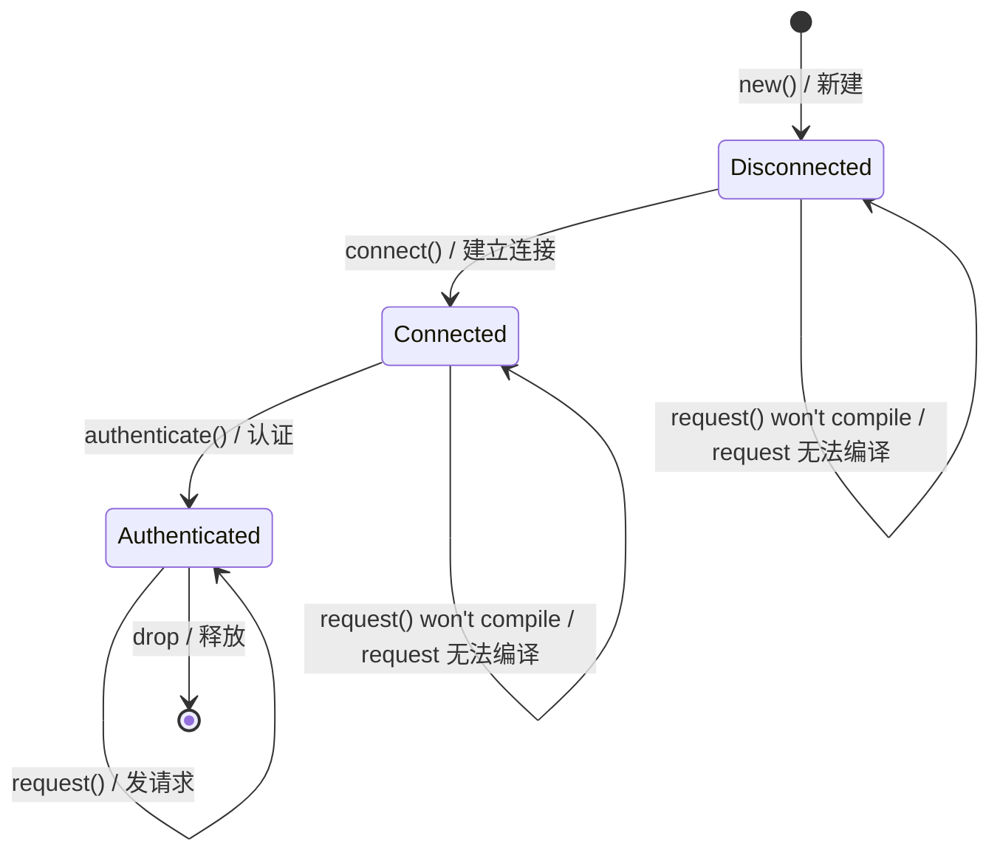
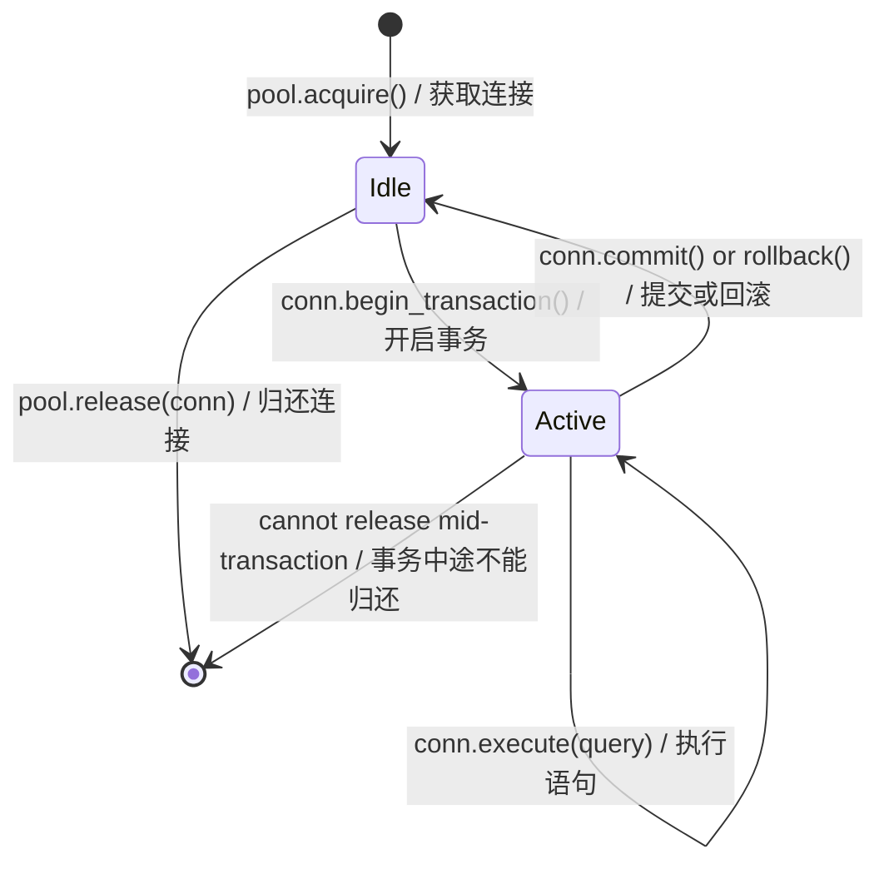
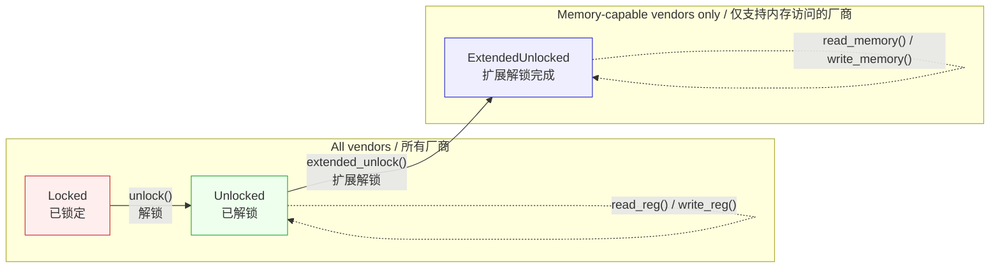
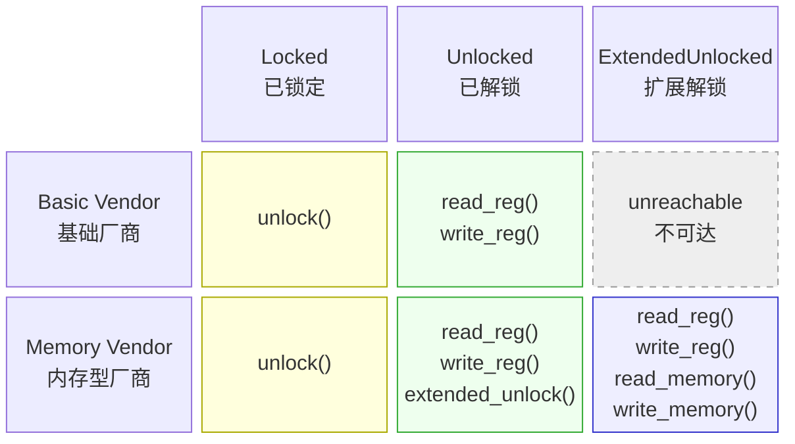

# 3. The Newtype and Type-State Patterns 🟡<br><span class="zh-inline"># 3. Newtype 与类型状态模式 🟡</span>

> **What you'll learn:**<br><span class="zh-inline">**本章将学到什么：**</span>
> - The newtype pattern for zero-cost compile-time type safety<br><span class="zh-inline">如何用 newtype 在零运行时成本下获得编译期类型安全</span>
> - Type-state pattern: making illegal state transitions unrepresentable<br><span class="zh-inline">什么是 type-state，以及怎样让非法状态切换在类型系统里根本表达不出来</span>
> - Builder pattern with type states for compile-time-enforced construction<br><span class="zh-inline">如何把 builder 和类型状态结合起来，在编译期强制保证构造顺序</span>
> - Config trait pattern for taming generic parameter explosion<br><span class="zh-inline">如何用 config trait 控制泛型参数爆炸</span>

## Newtype: Zero-Cost Type Safety<br><span class="zh-inline">Newtype：零成本类型安全</span>

The newtype pattern wraps an existing type in a single-field tuple struct to create a distinct type with zero runtime overhead:<br><span class="zh-inline">newtype 模式会把已有类型包进一个只有单字段的元组结构体里，借此创造出一个全新的类型，同时运行时开销仍然为零。</span>

```rust
// Without newtypes — easy to mix up:
fn create_user(name: String, email: String, age: u32, employee_id: u32) { }
// create_user(name, email, age, id);  — but what if we swap age and id?
// create_user(name, email, id, age);  — COMPILES FINE, BUG

// With newtypes — the compiler catches mistakes:
struct UserName(String);
struct Email(String);
struct Age(u32);
struct EmployeeId(u32);

fn create_user(name: UserName, email: Email, age: Age, id: EmployeeId) { }
// create_user(name, email, EmployeeId(42), Age(30));
// ❌ Compile error: expected Age, got EmployeeId
```

### `impl Deref` for Newtypes — Power and Pitfalls<br><span class="zh-inline">给 Newtype 实现 `Deref`：威力与陷阱</span>

Implementing `Deref` on a newtype lets it auto-coerce to the inner type's reference, giving you all of the inner type's methods "for free":<br><span class="zh-inline">如果给 newtype 实现 `Deref`，它就能自动解引用成内部类型的引用，于是内部类型的方法几乎都会“白送”过来。</span>

```rust
use std::ops::Deref;

struct Email(String);

impl Email {
    fn new(raw: &str) -> Result<Self, &'static str> {
        if raw.contains('@') {
            Ok(Email(raw.to_string()))
        } else {
            Err("invalid email: missing @")
        }
    }
}

impl Deref for Email {
    type Target = str;
    fn deref(&self) -> &str { &self.0 }
}

// Now Email auto-derefs to &str:
let email = Email::new("user@example.com").unwrap();
println!("Length: {}", email.len()); // Uses str::len via Deref
```

This is convenient — but it effectively **punches a hole** through your newtype's abstraction boundary because *every* method on the target type becomes callable on your wrapper.<br><span class="zh-inline">这种写法确实方便，但它实际上会在 newtype 的抽象边界上**打个洞**，因为目标类型上的几乎所有方法都能从包装类型上调用。</span>

#### When `Deref` IS appropriate<br><span class="zh-inline">什么情况下 `Deref` 合适</span>

| Scenario<br><span class="zh-inline">场景</span> | Example<br><span class="zh-inline">示例</span> | Why it's fine<br><span class="zh-inline">为什么合理</span> |
|----------|---------|---------------|
| Smart-pointer wrappers<br><span class="zh-inline">智能指针包装</span> | `Box<T>`, `Arc<T>`, `MutexGuard<T>` | The wrapper's whole purpose is to behave like `T`<br><span class="zh-inline">包装器本来就是为了表现得像 `T`</span> |
| Transparent "thin" wrappers<br><span class="zh-inline">透明薄包装</span> | `String` → `str`, `PathBuf` → `Path`, `Vec<T>` → `[T]` | The wrapper IS-A superset of the target<br><span class="zh-inline">包装类型本来就是目标类型语义上的超集</span> |
| Your newtype genuinely IS the inner type<br><span class="zh-inline">newtype 的语义本来就等同于内部类型</span> | `struct Hostname(String)` where you always want full string ops | Restricting the API would add no value<br><span class="zh-inline">刻意限制 API 并没有额外价值</span> |

#### When `Deref` is an anti-pattern<br><span class="zh-inline">什么情况下 `Deref` 是反模式</span>

| Scenario<br><span class="zh-inline">场景</span> | Problem<br><span class="zh-inline">问题</span> |
|----------|---------|
| **Domain types with invariants**<br><span class="zh-inline">**带不变量的领域类型**</span> | `Email` derefs to `&str`, so callers can call `.split_at()`, `.trim()`, etc. — none of which preserve the "must contain @" invariant. If someone stores the trimmed `&str` and reconstructs, the invariant is lost.<br><span class="zh-inline">`Email` 一旦解引用成 `&str`，调用方就能随意 `.split_at()`、`.trim()` 等等，但这些操作都不会替“必须包含 @”这种不变量兜底。如果后续拿处理后的 `&str` 重新构造对象，不变量就丢了。</span> |
| **Types where you want a restricted API**<br><span class="zh-inline">**本来就想限制对外 API 的类型**</span> | `struct Password(String)` with `Deref<Target = str>` leaks `.as_bytes()`, `.chars()`, `Debug` output — exactly what you're trying to hide.<br><span class="zh-inline">例如 `Password(String)` 如果实现了 `Deref<Target = str>`，那 `.as_bytes()`、`.chars()` 甚至调试输出这类能力都会漏出去，正好和封装目标对着干。</span> |
| **Fake inheritance**<br><span class="zh-inline">**拿它假装继承**</span> | Using `Deref` to make `ManagerWidget` auto-deref to `Widget` simulates OOP inheritance. This is explicitly discouraged — see the Rust API Guidelines (C-DEREF).<br><span class="zh-inline">如果试图让 `ManagerWidget` 自动解引用成 `Widget` 来模仿面向对象继承，那基本就是歪用。Rust API Guidelines 里明确不鼓励这么做。</span> |

> **Rule of thumb**: If your newtype exists to *add type safety* or *restrict the API*, don't implement `Deref`. If it exists to *add capabilities* while keeping the inner type's full surface, `Deref` is often appropriate.<br><span class="zh-inline">**经验法则**：如果 newtype 的目的是增强类型安全，或者限制外部可见 API，那就别实现 `Deref`。如果它的目的是在保留内部类型完整表面的前提下增加能力，那 `Deref` 往往才是合适选择。</span>

#### `DerefMut` — doubles the risk<br><span class="zh-inline">`DerefMut`：风险再翻一倍</span>

If you also implement `DerefMut`, callers can mutate the inner value directly, bypassing any validation in your constructors:<br><span class="zh-inline">如果连 `DerefMut` 也一起实现，调用方就能直接改写内部值，构造函数里做过的校验等于被从侧门绕过去了。</span>

```rust
use std::ops::{Deref, DerefMut};

struct PortNumber(u16);

impl Deref for PortNumber {
    type Target = u16;
    fn deref(&self) -> &u16 { &self.0 }
}

impl DerefMut for PortNumber {
    fn deref_mut(&mut self) -> &mut u16 { &mut self.0 }
}

let mut port = PortNumber(443);
*port = 0; // Bypasses any validation — now an invalid port
```

Only implement `DerefMut` when the inner type has no invariants to protect.<br><span class="zh-inline">只有在内部类型根本没有需要保护的不变量时，`DerefMut` 才算安全。</span>

#### Prefer explicit delegation instead<br><span class="zh-inline">更推荐显式委托</span>

When you want only *some* of the inner type's methods, delegate explicitly:<br><span class="zh-inline">如果只想暴露内部类型的一部分能力，那就老老实实做显式委托。</span>

```rust
struct Email(String);

impl Email {
    fn new(raw: &str) -> Result<Self, &'static str> {
        if raw.contains('@') { Ok(Email(raw.to_string())) }
        else { Err("missing @") }
    }

    // Expose only what makes sense:
    pub fn as_str(&self) -> &str { &self.0 }
    pub fn len(&self) -> usize { self.0.len() }
    pub fn domain(&self) -> &str {
        self.0.split('@').nth(1).unwrap_or("")
    }
    // .split_at(), .trim(), .replace() — NOT exposed
}
```

#### Clippy and the ecosystem<br><span class="zh-inline">Clippy 与生态里的共识</span>

- **`clippy::wrong_self_convention`** can fire when `Deref` coercion makes method resolution surprising.<br><span class="zh-inline">当 `Deref` 让方法解析结果变得反直觉时，**`clippy::wrong_self_convention`** 之类的检查就可能跳出来提醒。</span>
- The **Rust API Guidelines** (C-DEREF) state: *"only smart pointers should implement `Deref`."* Treat this as a strong default.<br><span class="zh-inline">**Rust API Guidelines** 里的 C-DEREF 明确建议：*“只有智能指针才应该实现 `Deref`。”* 这条建议很值得当成默认立场。</span>
- If you need trait compatibility, consider `AsRef<str>` and `Borrow<str>` instead.<br><span class="zh-inline">如果目的是做 trait 兼容，例如把 `Email` 传给期望 `&str` 的函数，那 `AsRef<str>`、`Borrow<str>` 往往更稳妥，也更显式。</span>

#### Decision matrix<br><span class="zh-inline">决策表</span>

```text
Do you want ALL methods of the inner type to be callable?
  ├─ YES → Does your type enforce invariants or restrict the API?
  │    ├─ NO  → impl Deref ✅  (smart-pointer / transparent wrapper)
  │    └─ YES → Don't impl Deref ❌ (invariant leaks)
  └─ NO  → Don't impl Deref ❌  (use AsRef / explicit delegation)
```

```text
是否希望内部类型的所有方法都能被调用？
  ├─ 是 → 这个类型是否承载不变量，或者是否想限制 API？
  │    ├─ 否 → 可以实现 Deref ✅（智能指针 / 透明包装）
  │    └─ 是 → 不要实现 Deref ❌（会泄漏不变量）
  └─ 否 → 不要实现 Deref ❌（改用 AsRef 或显式委托）
```

### Type-State: Compile-Time Protocol Enforcement<br><span class="zh-inline">Type-State：编译期协议约束</span>

The type-state pattern uses the type system to enforce that operations happen in the correct order. Invalid states become **unrepresentable**.<br><span class="zh-inline">type-state 模式利用类型系统强制规定操作顺序。非法状态不会等到运行时再报错，而是在类型层面直接无法表示。</span>



> Each transition *consumes* `self` and returns a new type — the compiler enforces valid ordering.<br><span class="zh-inline">每一次状态切换都会消费当前的 `self`，并返回一个新类型。顺序是否合法，交给编译器检查。</span>

```rust
// Problem: A network connection that must be:
// 1. Created
// 2. Connected
// 3. Authenticated
// 4. Then used for requests
// Calling request() before authenticate() should be a COMPILE error.

// --- Type-state markers (zero-sized types) ---
struct Disconnected;
struct Connected;
struct Authenticated;

// --- Connection parameterized by state ---
struct Connection<State> {
    address: String,
    _state: std::marker::PhantomData<State>,
}

// Only Disconnected connections can connect:
impl Connection<Disconnected> {
    fn new(address: &str) -> Self {
        Connection {
            address: address.to_string(),
            _state: std::marker::PhantomData,
        }
    }

    fn connect(self) -> Connection<Connected> {
        println!("Connecting to {}...", self.address);
        Connection {
            address: self.address,
            _state: std::marker::PhantomData,
        }
    }
}

// Only Connected connections can authenticate:
impl Connection<Connected> {
    fn authenticate(self, _token: &str) -> Connection<Authenticated> {
        println!("Authenticating...");
        Connection {
            address: self.address,
            _state: std::marker::PhantomData,
        }
    }
}

// Only Authenticated connections can make requests:
impl Connection<Authenticated> {
    fn request(&self, path: &str) -> String {
        format!("GET {} from {}", path, self.address)
    }
}

fn main() {
    let conn = Connection::new("api.example.com");
    // conn.request("/data"); // ❌ Compile error: no method `request` on Connection<Disconnected>

    let conn = conn.connect();
    // conn.request("/data"); // ❌ Compile error: no method `request` on Connection<Connected>

    let conn = conn.authenticate("secret-token");
    let response = conn.request("/data"); // ✅ Only works after authentication
    println!("{response}");
}
```

> **Key insight**: Each state transition consumes `self` and returns a new type. Zero runtime cost — `PhantomData` is zero-sized, and the markers disappear after compilation.<br><span class="zh-inline">**关键点**：每一次状态切换都会消耗旧值并返回新类型。运行时没有额外成本，`PhantomData` 本身是零尺寸的，状态标记在编译后也会被擦掉。</span>

**Comparison with C++/C#**: In C++ or C#, you'd usually do this with runtime checks such as `if (!authenticated) throw ...`. Rust's type-state pattern moves those checks to compile time.<br><span class="zh-inline">**和 C++、C# 的对比**：在 C++ 或 C# 里，这种约束通常靠运行时判断，比如 `if (!authenticated) throw ...`。Rust 的 type-state 把这一整类检查提前到了编译期。</span>

### Builder Pattern with Type States<br><span class="zh-inline">带类型状态的 Builder 模式</span>

A practical application — a builder that enforces required fields:<br><span class="zh-inline">最实用的落点之一，就是构造一个能强制填写必填字段的 builder。</span>

```rust
use std::marker::PhantomData;

// Marker types for required fields
struct NeedsName;
struct NeedsPort;
struct Ready;

struct ServerConfig<State> {
    name: Option<String>,
    port: Option<u16>,
    max_connections: usize, // Optional, has default
    _state: PhantomData<State>,
}

impl ServerConfig<NeedsName> {
    fn new() -> Self {
        ServerConfig {
            name: None,
            port: None,
            max_connections: 100,
            _state: PhantomData,
        }
    }

    fn name(self, name: &str) -> ServerConfig<NeedsPort> {
        ServerConfig {
            name: Some(name.to_string()),
            port: self.port,
            max_connections: self.max_connections,
            _state: PhantomData,
        }
    }
}

impl ServerConfig<NeedsPort> {
    fn port(self, port: u16) -> ServerConfig<Ready> {
        ServerConfig {
            name: self.name,
            port: Some(port),
            max_connections: self.max_connections,
            _state: PhantomData,
        }
    }
}

impl ServerConfig<Ready> {
    fn max_connections(mut self, n: usize) -> Self {
        self.max_connections = n;
        self
    }

    fn build(self) -> Server {
        Server {
            name: self.name.unwrap(),
            port: self.port.unwrap(),
            max_connections: self.max_connections,
        }
    }
}

struct Server {
    name: String,
    port: u16,
    max_connections: usize,
}

fn main() {
    // Must provide name, then port, then can build:
    let server = ServerConfig::new()
        .name("my-server")
        .port(8080)
        .max_connections(500)
        .build();

    // ServerConfig::new().port(8080); // ❌ Compile error: no method `port` on NeedsName
    // ServerConfig::new().name("x").build(); // ❌ Compile error: no method `build` on NeedsPort
}
```

This pattern is excellent when object construction has a natural order and "half-built" values should never exist in user code.<br><span class="zh-inline">当对象构造本身就有严格顺序，而且“半成品对象”不该出现在调用侧代码里时，这个模式特别值钱。</span>

***

## Case Study: Type-Safe Connection Pool<br><span class="zh-inline">案例：类型安全的连接池</span>

Real-world systems need connection pools where connections move through well-defined states. Here's how the typestate pattern enforces correctness in a production pool:<br><span class="zh-inline">真实系统里的连接池，连接通常会在若干明确状态之间流转。下面这个例子展示 typestate 模式怎样在生产风格的连接池里约束正确性。</span>



```rust
use std::marker::PhantomData;

// States
struct Idle;
struct InTransaction;

struct PooledConnection<State> {
    id: u32,
    _state: PhantomData<State>,
}

struct Pool {
    next_id: u32,
}

impl Pool {
    fn new() -> Self { Pool { next_id: 0 } }

    fn acquire(&mut self) -> PooledConnection<Idle> {
        self.next_id += 1;
        println!("[pool] Acquired connection #{}", self.next_id);
        PooledConnection { id: self.next_id, _state: PhantomData }
    }

    // Only idle connections can be released — prevents mid-transaction leaks
    fn release(&self, conn: PooledConnection<Idle>) {
        println!("[pool] Released connection #{}", conn.id);
    }
}

impl PooledConnection<Idle> {
    fn begin_transaction(self) -> PooledConnection<InTransaction> {
        println!("[conn #{}] BEGIN", self.id);
        PooledConnection { id: self.id, _state: PhantomData }
    }
}

impl PooledConnection<InTransaction> {
    fn execute(&self, query: &str) {
        println!("[conn #{}] EXEC: {}", self.id, query);
    }

    fn commit(self) -> PooledConnection<Idle> {
        println!("[conn #{}] COMMIT", self.id);
        PooledConnection { id: self.id, _state: PhantomData }
    }

    fn rollback(self) -> PooledConnection<Idle> {
        println!("[conn #{}] ROLLBACK", self.id);
        PooledConnection { id: self.id, _state: PhantomData }
    }
}

fn main() {
    let mut pool = Pool::new();

    let conn = pool.acquire();
    let conn = conn.begin_transaction();
    conn.execute("INSERT INTO users VALUES ('Alice')");
    conn.execute("INSERT INTO orders VALUES (1, 42)");
    let conn = conn.commit(); // Back to Idle
    pool.release(conn);       // ✅ Only works on Idle connections

    // pool.release(conn_active); // ❌ Compile error: can't release InTransaction
}
```

**Why this matters in production**: A connection leaked mid-transaction can hold locks indefinitely. Typestate makes that entire failure mode harder to express.<br><span class="zh-inline">**为什么这在生产里重要**：事务没结束就把连接弄丢，可能会把数据库锁长期占住。typestate 的价值就在于把这种失误尽量从代码表达层面就卡住。</span>

***

## Config Trait Pattern — Taming Generic Parameter Explosion<br><span class="zh-inline">Config Trait 模式：压住泛型参数爆炸</span>

### The Problem<br><span class="zh-inline">问题</span>

As a struct takes on more responsibilities, each backed by a trait-constrained generic, the type signature grows unwieldy:<br><span class="zh-inline">当一个结构体承担的职责越来越多，而每一部分又都由带 trait 约束的泛型支撑时，类型签名很快就会膨胀得越来越难看。</span>

```rust
trait SpiBus   { fn spi_transfer(&self, tx: &[u8], rx: &mut [u8]) -> Result<(), BusError>; }
trait ComPort  { fn com_send(&self, data: &[u8]) -> Result<usize, BusError>; }
trait I3cBus   { fn i3c_read(&self, addr: u8, buf: &mut [u8]) -> Result<(), BusError>; }
trait SmBus    { fn smbus_read_byte(&self, addr: u8, cmd: u8) -> Result<u8, BusError>; }
trait GpioBus  { fn gpio_set(&self, pin: u32, high: bool); }

// ❌ Every new bus trait adds another generic parameter
struct DiagController<S: SpiBus, C: ComPort, I: I3cBus, M: SmBus, G: GpioBus> {
    spi: S,
    com: C,
    i3c: I,
    smbus: M,
    gpio: G,
}
// impl blocks, function signatures, and callers all repeat the full list.
// Adding a 6th bus means editing every mention of DiagController<S, C, I, M, G>.
```

This is the classic generic-parameter explosion problem.<br><span class="zh-inline">这就是典型的泛型参数爆炸问题。每多一条总线、一个后端、一个能力，签名就更长一截，而且 `impl`、函数参数、调用方全都得跟着改。</span>

### The Solution: A Config Trait<br><span class="zh-inline">解法：引入一个 Config Trait</span>

Bundle all associated types into a single trait. Then the struct carries only one generic parameter no matter how many components it has:<br><span class="zh-inline">把所有关联组件的类型都塞进同一个 trait 里，结构体就只需要一个泛型参数。组件再多，参数个数也不会继续膨胀。</span>

```rust
#[derive(Debug)]
enum BusError {
    Timeout,
    NakReceived,
    HardwareFault(String),
}

// --- Bus traits (unchanged) ---
trait SpiBus {
    fn spi_transfer(&self, tx: &[u8], rx: &mut [u8]) -> Result<(), BusError>;
    fn spi_write(&self, data: &[u8]) -> Result<(), BusError>;
}

trait ComPort {
    fn com_send(&self, data: &[u8]) -> Result<usize, BusError>;
    fn com_recv(&self, buf: &mut [u8], timeout_ms: u32) -> Result<usize, BusError>;
}

trait I3cBus {
    fn i3c_read(&self, addr: u8, buf: &mut [u8]) -> Result<(), BusError>;
    fn i3c_write(&self, addr: u8, data: &[u8]) -> Result<(), BusError>;
}

// --- The Config trait: one associated type per component ---
trait BoardConfig {
    type Spi: SpiBus;
    type Com: ComPort;
    type I3c: I3cBus;
}

// --- DiagController has exactly ONE generic parameter ---
struct DiagController<Cfg: BoardConfig> {
    spi: Cfg::Spi,
    com: Cfg::Com,
    i3c: Cfg::I3c,
}
```

`DiagController<Cfg>` will never gain another generic parameter. Adding a fourth bus now means adding one associated type and one field, not rewriting every signature downstream.<br><span class="zh-inline">`DiagController<Cfg>` 以后都只有这一个泛型参数。将来如果要接第四条总线，只需要往 `BoardConfig` 里补一个关联类型，再往结构体里补一个字段，下游签名不用大面积重写。</span>

### Implementing the Controller<br><span class="zh-inline">实现控制器</span>

```rust
impl<Cfg: BoardConfig> DiagController<Cfg> {
    fn new(spi: Cfg::Spi, com: Cfg::Com, i3c: Cfg::I3c) -> Self {
        DiagController { spi, com, i3c }
    }

    fn read_flash_id(&self) -> Result<u32, BusError> {
        let cmd = [0x9F]; // JEDEC Read ID
        let mut id = [0u8; 4];
        self.spi.spi_transfer(&cmd, &mut id)?;
        Ok(u32::from_be_bytes(id))
    }

    fn send_bmc_command(&self, cmd: &[u8]) -> Result<Vec<u8>, BusError> {
        self.com.com_send(cmd)?;
        let mut resp = vec![0u8; 256];
        let n = self.com.com_recv(&mut resp, 1000)?;
        resp.truncate(n);
        Ok(resp)
    }

    fn read_sensor_temp(&self, sensor_addr: u8) -> Result<i16, BusError> {
        let mut buf = [0u8; 2];
        self.i3c.i3c_read(sensor_addr, &mut buf)?;
        Ok(i16::from_be_bytes(buf))
    }

    fn run_full_diag(&self) -> Result<DiagReport, BusError> {
        let flash_id = self.read_flash_id()?;
        let bmc_resp = self.send_bmc_command(b"VERSION\n")?;
        let cpu_temp = self.read_sensor_temp(0x48)?;
        let gpu_temp = self.read_sensor_temp(0x49)?;

        Ok(DiagReport {
            flash_id,
            bmc_version: String::from_utf8_lossy(&bmc_resp).to_string(),
            cpu_temp_c: cpu_temp,
            gpu_temp_c: gpu_temp,
        })
    }
}

#[derive(Debug)]
struct DiagReport {
    flash_id: u32,
    bmc_version: String,
    cpu_temp_c: i16,
    gpu_temp_c: i16,
}
```

### Production Wiring<br><span class="zh-inline">生产环境接线</span>

One `impl BoardConfig` selects the concrete hardware drivers:<br><span class="zh-inline">只要写一个 `impl BoardConfig`，具体硬件驱动就都定下来了。</span>

```rust
struct PlatformSpi  { dev: String, speed_hz: u32 }
struct UartCom      { dev: String, baud: u32 }
struct LinuxI3c     { dev: String }

impl SpiBus for PlatformSpi {
    fn spi_transfer(&self, tx: &[u8], rx: &mut [u8]) -> Result<(), BusError> {
        // ioctl(SPI_IOC_MESSAGE) in production
        rx[0..4].copy_from_slice(&[0xEF, 0x40, 0x18, 0x00]);
        Ok(())
    }
    fn spi_write(&self, _data: &[u8]) -> Result<(), BusError> { Ok(()) }
}

impl ComPort for UartCom {
    fn com_send(&self, _data: &[u8]) -> Result<usize, BusError> { Ok(0) }
    fn com_recv(&self, buf: &mut [u8], _timeout: u32) -> Result<usize, BusError> {
        let resp = b"BMC v2.4.1\n";
        buf[..resp.len()].copy_from_slice(resp);
        Ok(resp.len())
    }
}

impl I3cBus for LinuxI3c {
    fn i3c_read(&self, _addr: u8, buf: &mut [u8]) -> Result<(), BusError> {
        buf[0] = 0x00; buf[1] = 0x2D; // 45°C
        Ok(())
    }
    fn i3c_write(&self, _addr: u8, _data: &[u8]) -> Result<(), BusError> { Ok(()) }
}

// ✅ One struct, one impl — all concrete types resolved here
struct ProductionBoard;
impl BoardConfig for ProductionBoard {
    type Spi = PlatformSpi;
    type Com = UartCom;
    type I3c = LinuxI3c;
}

fn main() {
    let ctrl = DiagController::<ProductionBoard>::new(
        PlatformSpi { dev: "/dev/spidev0.0".into(), speed_hz: 10_000_000 },
        UartCom     { dev: "/dev/ttyS0".into(),     baud: 115200 },
        LinuxI3c    { dev: "/dev/i3c-0".into() },
    );
    let report = ctrl.run_full_diag().unwrap();
    println!("{report:#?}");
}
```

### Test Wiring with Mocks<br><span class="zh-inline">测试环境接线：替换成 Mock</span>

Swap the entire hardware layer by defining a different `BoardConfig`:<br><span class="zh-inline">想把整套硬件层换成测试替身，只需要再定义一个不同的 `BoardConfig`。</span>

```rust
struct MockSpi  { flash_id: [u8; 4] }
struct MockCom  { response: Vec<u8> }
struct MockI3c  { temps: std::collections::HashMap<u8, i16> }

impl SpiBus for MockSpi {
    fn spi_transfer(&self, _tx: &[u8], rx: &mut [u8]) -> Result<(), BusError> {
        rx[..4].copy_from_slice(&self.flash_id);
        Ok(())
    }
    fn spi_write(&self, _data: &[u8]) -> Result<(), BusError> { Ok(()) }
}

impl ComPort for MockCom {
    fn com_send(&self, _data: &[u8]) -> Result<usize, BusError> { Ok(0) }
    fn com_recv(&self, buf: &mut [u8], _timeout: u32) -> Result<usize, BusError> {
        let n = self.response.len().min(buf.len());
        buf[..n].copy_from_slice(&self.response[..n]);
        Ok(n)
    }
}

impl I3cBus for MockI3c {
    fn i3c_read(&self, addr: u8, buf: &mut [u8]) -> Result<(), BusError> {
        let temp = self.temps.get(&addr).copied().unwrap_or(0);
        buf[..2].copy_from_slice(&temp.to_be_bytes());
        Ok(())
    }
    fn i3c_write(&self, _addr: u8, _data: &[u8]) -> Result<(), BusError> { Ok(()) }
}

struct TestBoard;
impl BoardConfig for TestBoard {
    type Spi = MockSpi;
    type Com = MockCom;
    type I3c = MockI3c;
}

#[cfg(test)]
mod tests {
    use super::*;

    fn make_test_controller() -> DiagController<TestBoard> {
        let mut temps = std::collections::HashMap::new();
        temps.insert(0x48, 45i16);
        temps.insert(0x49, 72i16);

        DiagController::<TestBoard>::new(
            MockSpi  { flash_id: [0xEF, 0x40, 0x18, 0x00] },
            MockCom  { response: b"BMC v2.4.1\n".to_vec() },
            MockI3c  { temps },
        )
    }

    #[test]
    fn test_flash_id() {
        let ctrl = make_test_controller();
        assert_eq!(ctrl.read_flash_id().unwrap(), 0xEF401800);
    }

    #[test]
    fn test_sensor_temps() {
        let ctrl = make_test_controller();
        assert_eq!(ctrl.read_sensor_temp(0x48).unwrap(), 45);
        assert_eq!(ctrl.read_sensor_temp(0x49).unwrap(), 72);
    }

    #[test]
    fn test_full_diag() {
        let ctrl = make_test_controller();
        let report = ctrl.run_full_diag().unwrap();
        assert_eq!(report.flash_id, 0xEF401800);
        assert_eq!(report.cpu_temp_c, 45);
        assert_eq!(report.gpu_temp_c, 72);
        assert!(report.bmc_version.contains("2.4.1"));
    }
}
```

### Adding a New Bus Later<br><span class="zh-inline">以后再加一条总线怎么办</span>

When you need a fourth bus, only `BoardConfig` and `DiagController` change. Downstream signatures stay stable:<br><span class="zh-inline">将来要加第四条总线时，只需要动 `BoardConfig` 和 `DiagController` 本身，下游函数签名仍然稳定。</span>

```rust
trait SmBus {
    fn smbus_read_byte(&self, addr: u8, cmd: u8) -> Result<u8, BusError>;
}

// 1. Add one associated type:
trait BoardConfig {
    type Spi: SpiBus;
    type Com: ComPort;
    type I3c: I3cBus;
    type Smb: SmBus;     // ← new
}

// 2. Add one field:
struct DiagController<Cfg: BoardConfig> {
    spi: Cfg::Spi,
    com: Cfg::Com,
    i3c: Cfg::I3c,
    smb: Cfg::Smb,       // ← new
}

// 3. Provide the concrete type in each config impl:
impl BoardConfig for ProductionBoard {
    type Spi = PlatformSpi;
    type Com = UartCom;
    type I3c = LinuxI3c;
    type Smb = LinuxSmbus; // ← new
}
```

### When to Use This Pattern<br><span class="zh-inline">什么时候适合用这个模式</span>

| Situation<br><span class="zh-inline">情况</span> | Use Config Trait?<br><span class="zh-inline">是否适合</span> | Alternative<br><span class="zh-inline">替代方案</span> |
|-----------|:-:|---|
| 3+ trait-constrained generics on a struct<br><span class="zh-inline">结构体上已经挂了 3 个以上带约束的泛型</span> | ✅ Yes<br><span class="zh-inline">✅ 适合</span> | — |
| Need to swap entire hardware/platform layer<br><span class="zh-inline">要整体替换硬件层或平台层</span> | ✅ Yes<br><span class="zh-inline">✅ 适合</span> | — |
| Only 1-2 generics<br><span class="zh-inline">只有 1 到 2 个泛型</span> | ❌ Overkill<br><span class="zh-inline">❌ 有点过度设计</span> | Direct generics<br><span class="zh-inline">直接泛型</span> |
| Need runtime polymorphism<br><span class="zh-inline">需要运行时多态</span> | ❌ | `dyn Trait` objects<br><span class="zh-inline">`dyn Trait`</span> |
| Open-ended plugin system<br><span class="zh-inline">开放式插件系统</span> | ❌ | Type-map / `Any` |
| Component traits form a natural group<br><span class="zh-inline">这些组件天然就属于同一平台配置</span> | ✅ Yes<br><span class="zh-inline">✅ 适合</span> | — |

### Key Properties<br><span class="zh-inline">这个模式的几个关键性质</span>

- **One generic parameter forever** — `DiagController<Cfg>` doesn't keep growing extra type parameters.<br><span class="zh-inline">**泛型参数始终只有一个**：`DiagController<Cfg>` 不会没完没了长出新的类型参数。</span>
- **Fully static dispatch** — no vtables, no `dyn`, no heap allocation for trait objects.<br><span class="zh-inline">**完全静态分发**：没有 vtable，没有 `dyn`，也不用为了 trait object 去堆分配。</span>
- **Clean test swapping** — define a test config and reuse the same controller code.<br><span class="zh-inline">**测试替换很干净**：重新定义一个测试配置，就能复用同一套控制器逻辑。</span>
- **Compile-time safety** — forget an associated type and the compiler tells you immediately.<br><span class="zh-inline">**编译期安全**：少配一个关联类型，编译器立刻报出来。</span>
- **Battle-tested** — ecosystems like Substrate use this technique heavily.<br><span class="zh-inline">**经过实践检验**：像 Substrate 这一类项目就大量依赖这种写法管理复杂配置。</span>

> **Key Takeaways — Newtype & Type-State**<br><span class="zh-inline">**本章要点回顾：Newtype 与 Type-State**</span>
> - Newtypes give compile-time type safety at zero runtime cost<br><span class="zh-inline">newtype 可以在零运行时成本下提供编译期类型安全</span>
> - Type-state turns illegal state transitions into compile errors<br><span class="zh-inline">type-state 会把非法状态切换变成编译错误</span>
> - Config traits keep large generic systems readable and maintainable<br><span class="zh-inline">config trait 能让大型泛型系统继续保持可读和可维护</span>

> **See also:** [Ch 4 — PhantomData](ch04-phantomdata-types-that-carry-no-data.md) for the zero-sized markers that power type-state. [Ch 2 — Traits In Depth](ch02-traits-in-depth.md) for associated types used in the config trait pattern.<br><span class="zh-inline">**延伸阅读：** 支撑 type-state 的零尺寸标记见 [第 4 章](ch04-phantomdata-types-that-carry-no-data.md)；config trait 中大量使用的关联类型见 [第 2 章](ch02-traits-in-depth.md)。</span>

---

## Case Study: Dual-Axis Typestate — Vendor × Protocol State<br><span class="zh-inline">案例：双轴类型状态 —— 厂商 × 协议状态</span>

The patterns above each vary one axis at a time. Real systems often vary two at once: *which vendor sits underneath* and *which protocol state the handle is currently in*.<br><span class="zh-inline">前面的模式大多一次只处理一个维度。真实系统里经常同时变化两个维度：底下接的是哪家厂商的实现，以及当前句柄正处于哪个协议状态。</span>

This section shows the dual-axis conditional `impl` pattern, where available methods depend on both axes at compile time.<br><span class="zh-inline">这一节展示的就是双轴条件 `impl` 模式：某个方法能不能调用，由这两个维度在编译期共同决定。</span>

### The Two-Dimensional Problem<br><span class="zh-inline">二维问题</span>

Consider a debug probe interface such as JTAG or SWD. Every probe must be unlocked before registers become accessible. Some vendors additionally support direct memory reads, but only after an *extended unlock* that configures the memory access port:<br><span class="zh-inline">拿 JTAG 或 SWD 调试探针举例。所有探针都必须先解锁，寄存器才能访问；而且只有部分厂商的设备，在完成一次*扩展解锁*、把内存访问端口配置好以后，才支持直接读写内存。</span>



The capability matrix is therefore two-dimensional: methods depend on both `(vendor, state)`.<br><span class="zh-inline">于是能力矩阵天然就变成了二维：某个方法能否存在，不止取决于状态，也取决于厂商能力，也就是 `(vendor, state)` 这个组合。</span>



The challenge is to express this matrix entirely at compile time, with static dispatch and no runtime state checks.<br><span class="zh-inline">难点就在于：要把这张矩阵完全表达在编译期里，保持静态分发，而且运行时一行状态检查都不写。</span>

### The Solution: `Jtag<V, S>` with Marker Traits<br><span class="zh-inline">解法：带标记 trait 的 `Jtag&lt;V, S&gt;`</span>

**Step 1 — State tokens and capability markers:**<br><span class="zh-inline">**第一步：定义状态令牌和能力标记。**</span>

```rust,ignore
use std::marker::PhantomData;

// Zero-sized state tokens — no runtime cost
struct Locked;
struct Unlocked;
struct ExtendedUnlocked;

// Marker traits express which capabilities each state has
trait HasRegAccess {}
impl HasRegAccess for Unlocked {}
impl HasRegAccess for ExtendedUnlocked {}

trait HasMemAccess {}
impl HasMemAccess for ExtendedUnlocked {}
```

> **Why marker traits, not just concrete states?** Marker traits let later states reuse behavior automatically. Add a new state and implement `HasRegAccess` for it once, and every register API immediately works for that state.<br><span class="zh-inline">**为什么要用标记 trait，而不是直接把状态名写死？** 因为标记 trait 能把“具备某种能力的状态”抽象出来。以后如果再加一个新状态，只要给它实现一次 `HasRegAccess`，所有寄存器相关 API 就会自动适配过去。</span>

**Step 2 — Vendor traits (raw operations):**<br><span class="zh-inline">**第二步：定义厂商 trait，也就是底层原始操作。**</span>

```rust,ignore
// Every probe vendor implements these
trait JtagVendor {
    fn raw_unlock(&mut self);
    fn raw_read_reg(&self, addr: u32) -> u32;
    fn raw_write_reg(&mut self, addr: u32, val: u32);
}

// Vendors with memory access also implement this super-trait
trait JtagMemoryVendor: JtagVendor {
    fn raw_extended_unlock(&mut self);
    fn raw_read_memory(&self, addr: u64, buf: &mut [u8]);
    fn raw_write_memory(&mut self, addr: u64, data: &[u8]);
}
```

**Step 3 — The wrapper with conditional `impl` blocks:**<br><span class="zh-inline">**第三步：写包装类型，并通过条件 `impl` 表达整张矩阵。**</span>

```rust,ignore
struct Jtag<V, S = Locked> {
    vendor: V,
    _state: PhantomData<S>,
}

// Construction — always starts Locked
impl<V: JtagVendor> Jtag<V, Locked> {
    fn new(vendor: V) -> Self {
        Jtag { vendor, _state: PhantomData }
    }

    fn unlock(mut self) -> Jtag<V, Unlocked> {
        self.vendor.raw_unlock();
        Jtag { vendor: self.vendor, _state: PhantomData }
    }
}

// Register I/O — any vendor, any state with HasRegAccess
impl<V: JtagVendor, S: HasRegAccess> Jtag<V, S> {
    fn read_reg(&self, addr: u32) -> u32 {
        self.vendor.raw_read_reg(addr)
    }
    fn write_reg(&mut self, addr: u32, val: u32) {
        self.vendor.raw_write_reg(addr, val);
    }
}

// Extended unlock — only memory-capable vendors, only from Unlocked
impl<V: JtagMemoryVendor> Jtag<V, Unlocked> {
    fn extended_unlock(mut self) -> Jtag<V, ExtendedUnlocked> {
        self.vendor.raw_extended_unlock();
        Jtag { vendor: self.vendor, _state: PhantomData }
    }
}

// Memory I/O — only memory-capable vendors, only ExtendedUnlocked
impl<V: JtagMemoryVendor, S: HasMemAccess> Jtag<V, S> {
    fn read_memory(&self, addr: u64, buf: &mut [u8]) {
        self.vendor.raw_read_memory(addr, buf);
    }
    fn write_memory(&mut self, addr: u64, data: &[u8]) {
        self.vendor.raw_write_memory(addr, data);
    }
}
```

Each `impl` block corresponds to one row or one region in the capability matrix. The compiler becomes the gatekeeper.<br><span class="zh-inline">这些 `impl` 块本质上就在给能力矩阵逐行、逐区域上锁。方法是否存在，不是靠注释提醒，而是让编译器亲自把门。</span>

### Vendor Implementations<br><span class="zh-inline">厂商实现</span>

Adding a vendor means implementing the raw methods on one concrete struct:<br><span class="zh-inline">新增一个厂商时，只需要在一个具体结构体上补齐底层原始方法。</span>

```rust,ignore
// Vendor A: basic probe — register access only
struct BasicProbe { port: u16 }

impl JtagVendor for BasicProbe {
    fn raw_unlock(&mut self)                    { /* TAP reset sequence */ }
    fn raw_read_reg(&self, addr: u32) -> u32    { /* DR scan */  0 }
    fn raw_write_reg(&mut self, addr: u32, val: u32) { /* DR scan */ }
}
// BasicProbe does NOT impl JtagMemoryVendor.
// extended_unlock() will not compile on Jtag<BasicProbe, _>.

// Vendor B: full-featured probe — registers + memory
struct DapProbe { serial: String }

impl JtagVendor for DapProbe {
    fn raw_unlock(&mut self)                    { /* SWD switch, read DPIDR */ }
    fn raw_read_reg(&self, addr: u32) -> u32    { /* AP register read */ 0 }
    fn raw_write_reg(&mut self, addr: u32, val: u32) { /* AP register write */ }
}

impl JtagMemoryVendor for DapProbe {
    fn raw_extended_unlock(&mut self)           { /* select MEM-AP, power up */ }
    fn raw_read_memory(&self, addr: u64, buf: &mut [u8])  { /* MEM-AP read */ }
    fn raw_write_memory(&mut self, addr: u64, data: &[u8]) { /* MEM-AP write */ }
}
```

### What the Compiler Prevents<br><span class="zh-inline">编译器会拦住什么</span>

| Attempt<br><span class="zh-inline">错误尝试</span> | Error<br><span class="zh-inline">报错表现</span> | Why<br><span class="zh-inline">原因</span> |
|---------|-------|-----|
| `Jtag<_, Locked>::read_reg()` | no method `read_reg` | `Locked` doesn't impl `HasRegAccess`<br><span class="zh-inline">`Locked` 没实现 `HasRegAccess`</span> |
| `Jtag<BasicProbe, _>::extended_unlock()` | no method `extended_unlock` | `BasicProbe` doesn't impl `JtagMemoryVendor`<br><span class="zh-inline">`BasicProbe` 没实现 `JtagMemoryVendor`</span> |
| `Jtag<_, Unlocked>::read_memory()` | no method `read_memory` | `Unlocked` doesn't impl `HasMemAccess`<br><span class="zh-inline">`Unlocked` 没实现 `HasMemAccess`</span> |
| Calling `unlock()` twice<br><span class="zh-inline">连续调用两次 `unlock()`</span> | value used after move | `unlock()` consumes `self`<br><span class="zh-inline">`unlock()` 会消耗原值</span> |

All of those are compile-time failures, not runtime failures.<br><span class="zh-inline">这些全都是编译期失败，而不是运行时踩雷。</span>

### Writing Generic Functions<br><span class="zh-inline">写泛型函数时怎么利用它</span>

Functions only need to constrain the axes they actually care about:<br><span class="zh-inline">写通用函数时，只需要约束它真正关心的那几个维度就够了。</span>

```rust,ignore
/// Works with ANY vendor, ANY state that grants register access.
fn read_idcode<V: JtagVendor, S: HasRegAccess>(jtag: &Jtag<V, S>) -> u32 {
    jtag.read_reg(0x00)
}

/// Only compiles for memory-capable vendors in ExtendedUnlocked state.
fn dump_firmware<V: JtagMemoryVendor, S: HasMemAccess>(jtag: &Jtag<V, S>) {
    let mut buf = [0u8; 256];
    jtag.read_memory(0x0800_0000, &mut buf);
}
```

This is where marker traits pay off: the function signature talks about capabilities, not a hard-coded list of state names.<br><span class="zh-inline">这也是标记 trait 真正值钱的地方。函数签名约束的是“能力”，而不是把一串具体状态名硬塞进去。</span>

### Same Pattern, Different Domain: Storage Backends<br><span class="zh-inline">同一模式换个领域：存储后端</span>

The same dual-axis structure also fits storage APIs where only some backends support transactions:<br><span class="zh-inline">这个双轴结构并不只适合硬件场景。存储后端也很适用，例如只有部分后端支持事务。</span>

```rust,ignore
// States
struct Closed;
struct Open;
struct InTransaction;

trait HasReadWrite {}
impl HasReadWrite for Open {}
impl HasReadWrite for InTransaction {}

// Vendor traits
trait StorageBackend {
    fn raw_open(&mut self);
    fn raw_read(&self, key: &[u8]) -> Option<Vec<u8>>;
    fn raw_write(&mut self, key: &[u8], value: &[u8]);
}

trait TransactionalBackend: StorageBackend {
    fn raw_begin(&mut self);
    fn raw_commit(&mut self);
    fn raw_rollback(&mut self);
}

// Wrapper
struct Store<B, S = Closed> { backend: B, _s: PhantomData<S> }

impl<B: StorageBackend> Store<B, Closed> {
    fn open(mut self) -> Store<B, Open> { self.backend.raw_open(); /* ... */ todo!() }
}
impl<B: StorageBackend, S: HasReadWrite> Store<B, S> {
    fn read(&self, key: &[u8]) -> Option<Vec<u8>>  { self.backend.raw_read(key) }
    fn write(&mut self, key: &[u8], val: &[u8])    { self.backend.raw_write(key, val) }
}
impl<B: TransactionalBackend> Store<B, Open> {
    fn begin(mut self) -> Store<B, InTransaction>   { /* ... */ todo!() }
}
impl<B: TransactionalBackend> Store<B, InTransaction> {
    fn commit(mut self) -> Store<B, Open>           { /* ... */ todo!() }
    fn rollback(mut self) -> Store<B, Open>         { /* ... */ todo!() }
}
```

### When to Reach for This Pattern<br><span class="zh-inline">什么时候该上双轴模式</span>

| Signal<br><span class="zh-inline">信号</span> | Why dual-axis fits<br><span class="zh-inline">为什么适合双轴模式</span> |
|--------|--------------------|
| Two independent axes: provider and state<br><span class="zh-inline">同时存在“提供者”和“状态”两个独立维度</span> | The conditional `impl` matrix maps naturally to both<br><span class="zh-inline">条件 `impl` 的矩阵正好能把这两个维度一起表达出来</span> |
| Some providers have more capabilities than others<br><span class="zh-inline">不同提供者的能力不一致</span> | Super-traits plus conditional impls encode that cleanly<br><span class="zh-inline">super-trait 加条件 impl 能把这种差异写得很干净</span> |
| State misuse is a correctness or safety bug<br><span class="zh-inline">状态误用会带来正确性或安全问题</span> | Compile-time prevention is especially valuable<br><span class="zh-inline">这种场景特别值得在编译期就阻止</span> |
| You want static dispatch<br><span class="zh-inline">想保持静态分发</span> | Generics + `PhantomData` stay zero-cost<br><span class="zh-inline">泛型加 `PhantomData` 仍然保持零成本</span> |

| Signal<br><span class="zh-inline">信号</span> | Consider something simpler<br><span class="zh-inline">更简单的方案</span> |
|--------|---------------------------|
| Only one axis varies<br><span class="zh-inline">实际上只有一个维度在变化</span> | Single-axis typestate or plain trait objects<br><span class="zh-inline">单轴 typestate，或者直接 trait object</span> |
| Three or more axes vary<br><span class="zh-inline">变化维度达到三个以上</span> | Use the Config Trait Pattern to absorb some axes<br><span class="zh-inline">用 Config Trait 把其中几条轴收进去</span> |
| Runtime polymorphism is fine<br><span class="zh-inline">接受运行时多态</span> | `enum` state + `dyn` is simpler<br><span class="zh-inline">`enum` 状态配合 `dyn` 更简单</span> |

> **When two axes become three or more:** If types start looking like `Handle<V, S, D, T>`, that generic list is already signaling trouble. A natural next step is to collapse vendor-related axes into one config trait and keep only the state axis generic.<br><span class="zh-inline">**当两个维度膨胀成三个或更多时：** 如果类型开始长成 `Handle&lt;V, S, D, T&gt;` 这种样子，说明泛型列表已经开始失控了。很自然的下一步，就是把和厂商相关的几条轴折叠进一个 config trait，只把状态轴继续保留成泛型。</span>

> **Key Takeaway:** The dual-axis pattern is typestate plus trait-based abstraction at the same time. Each `impl` block corresponds to one region of the `(vendor × state)` matrix.<br><span class="zh-inline">**核心结论**：双轴模式本质上就是 typestate 和 trait 抽象的叠加。每一个 `impl` 块，都是 `(厂商 × 状态)` 这张矩阵上的一个区域。</span>

---

### Exercise: Type-Safe State Machine ★★ (~30 min)<br><span class="zh-inline">练习：类型安全的状态机 ★★（约 30 分钟）</span>

Build a traffic light state machine using the type-state pattern. The light must transition `Red → Green → Yellow → Red` and no other order should be possible.<br><span class="zh-inline">用 type-state 模式实现一个交通灯状态机。状态只能按 `Red → Green → Yellow → Red` 这个顺序切换，其他顺序都必须在编译期被挡住。</span>

<details>
<summary>🔑 Solution<br><span class="zh-inline">🔑 参考答案</span></summary>

```rust
use std::marker::PhantomData;

struct Red;
struct Green;
struct Yellow;

struct TrafficLight<State> {
    _state: PhantomData<State>,
}

impl TrafficLight<Red> {
    fn new() -> Self {
        println!("🔴 Red — STOP");
        TrafficLight { _state: PhantomData }
    }

    fn go(self) -> TrafficLight<Green> {
        println!("🟢 Green — GO");
        TrafficLight { _state: PhantomData }
    }
}

impl TrafficLight<Green> {
    fn caution(self) -> TrafficLight<Yellow> {
        println!("🟡 Yellow — CAUTION");
        TrafficLight { _state: PhantomData }
    }
}

impl TrafficLight<Yellow> {
    fn stop(self) -> TrafficLight<Red> {
        println!("🔴 Red — STOP");
        TrafficLight { _state: PhantomData }
    }
}

fn main() {
    let light = TrafficLight::new(); // Red
    let light = light.go();          // Green
    let light = light.caution();     // Yellow
    let _light = light.stop();       // Red

    // light.caution(); // ❌ Compile error: no method `caution` on Red
    // TrafficLight::new().stop(); // ❌ Compile error: no method `stop` on Red
}
```

**Key takeaway**: Invalid transitions become compile errors instead of runtime panics.<br><span class="zh-inline">**关键体会**：非法切换会变成编译错误，而不是跑起来以后才 panic。</span>

</details>

***
