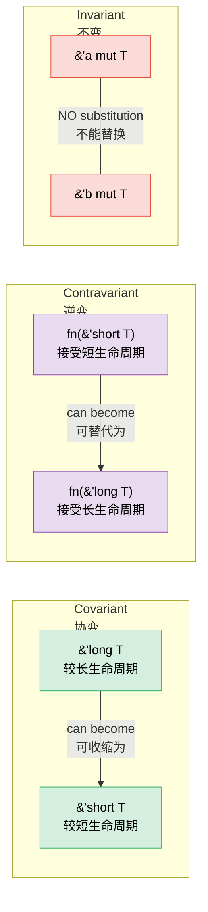

# 4. PhantomData — Types That Carry No Data 🔴<br><span class="zh-inline"># 4. PhantomData：不携带数据的类型 🔴</span>

> **What you'll learn:**<br><span class="zh-inline">**本章将学到什么：**</span>
> - Why `PhantomData<T>` exists and the three problems it solves<br><span class="zh-inline">为什么需要 `PhantomData&lt;T&gt;`，以及它主要解决的三个问题</span>
> - Lifetime branding for compile-time scope enforcement<br><span class="zh-inline">如何用生命周期品牌在编译期约束作用域</span>
> - The unit-of-measure pattern for dimension-safe arithmetic<br><span class="zh-inline">如何用单位模式实现量纲安全的运算</span>
> - Variance (covariant, contravariant, invariant) and how PhantomData controls it<br><span class="zh-inline">什么是变型（协变、逆变、不变），以及 PhantomData 如何控制它</span>

## What PhantomData Solves<br><span class="zh-inline">PhantomData 到底解决什么问题</span>

`PhantomData<T>` is a zero-sized type that tells the compiler "this struct is logically associated with `T`, even though it doesn't contain a `T`." It affects variance, drop checking, and auto-trait inference — without using any memory.<br><span class="zh-inline">`PhantomData&lt;T&gt;` 是一个零大小类型，它是在告诉编译器：“这个结构体在逻辑上和 `T` 相关，虽然它并没有真的存一个 `T`。” 它会影响变型、drop check 和自动 trait 推导，而且完全不占额外内存。</span>

```rust
use std::marker::PhantomData;

// Without PhantomData:
struct Slice<'a, T> {
    ptr: *const T,
    len: usize,
    // Problem: compiler doesn't know this struct borrows from 'a
    // or that it's associated with T for drop-check purposes
}

// With PhantomData:
struct Slice<'a, T> {
    ptr: *const T,
    len: usize,
    _marker: PhantomData<&'a T>,
    // Now the compiler knows:
    // 1. This struct borrows data with lifetime 'a
    // 2. It's covariant over 'a (lifetimes can shrink)
    // 3. Drop check considers T
}
```

**The three jobs of PhantomData**:<br><span class="zh-inline">**PhantomData 的三份本职工作：**</span>

| Job<br><span class="zh-inline">职责</span> | Example<br><span class="zh-inline">示例</span> | What It Does<br><span class="zh-inline">作用</span> |
|-----|---------|-------------|
| **Lifetime binding**<br><span class="zh-inline">**生命周期绑定**</span> | `PhantomData<&'a T>` | Struct is treated as borrowing `'a`<br><span class="zh-inline">让结构体被视为借用了 `'a`</span> |
| **Ownership simulation**<br><span class="zh-inline">**模拟所有权**</span> | `PhantomData<T>` | Drop check assumes struct owns a `T`<br><span class="zh-inline">让 drop check 认为结构体逻辑上拥有一个 `T`</span> |
| **Variance control**<br><span class="zh-inline">**控制变型**</span> | `PhantomData<fn(T)>` | Makes struct contravariant over `T`<br><span class="zh-inline">让结构体对 `T` 呈逆变</span> |

### Lifetime Branding<br><span class="zh-inline">生命周期品牌</span>

Use `PhantomData` to prevent mixing values from different "sessions" or "contexts":<br><span class="zh-inline">`PhantomData` 很适合用来防止不同“会话”或“上下文”里的值被混在一起使用：</span>

```rust
use std::marker::PhantomData;

/// A handle that's valid only within a specific arena's lifetime
struct ArenaHandle<'arena> {
    index: usize,
    _brand: PhantomData<&'arena ()>,
}

struct Arena {
    data: Vec<String>,
}

impl Arena {
    fn new() -> Self {
        Arena { data: Vec::new() }
    }

    /// Allocate a string and return a branded handle
    fn alloc<'a>(&'a mut self, value: String) -> ArenaHandle<'a> {
        let index = self.data.len();
        self.data.push(value);
        ArenaHandle { index, _brand: PhantomData }
    }

    /// Look up by handle — only accepts handles from THIS arena
    fn get<'a>(&'a self, handle: ArenaHandle<'a>) -> &'a str {
        &self.data[handle.index]
    }
}

fn main() {
    let mut arena1 = Arena::new();
    let handle1 = arena1.alloc("hello".to_string());

    // Can't use handle1 with a different arena — lifetimes won't match
    // let mut arena2 = Arena::new();
    // arena2.get(handle1); // ❌ Lifetime mismatch

    println!("{}", arena1.get(handle1)); // ✅
}
```

### Unit-of-Measure Pattern<br><span class="zh-inline">单位模式</span>

Prevent mixing incompatible units at compile time, with zero runtime cost:<br><span class="zh-inline">可以在编译期阻止不兼容单位被混用，而且运行时没有任何额外成本：</span>

```rust
use std::marker::PhantomData;
use std::ops::{Add, Mul};

// Unit marker types (zero-sized)
struct Meters;
struct Seconds;
struct MetersPerSecond;

#[derive(Debug, Clone, Copy)]
struct Quantity<Unit> {
    value: f64,
    _unit: PhantomData<Unit>,
}

impl<U> Quantity<U> {
    fn new(value: f64) -> Self {
        Quantity { value, _unit: PhantomData }
    }
}

// Can only add same units:
impl<U> Add for Quantity<U> {
    type Output = Quantity<U>;
    fn add(self, rhs: Self) -> Self::Output {
        Quantity::new(self.value + rhs.value)
    }
}

// Meters / Seconds = MetersPerSecond (custom trait)
impl std::ops::Div<Quantity<Seconds>> for Quantity<Meters> {
    type Output = Quantity<MetersPerSecond>;
    fn div(self, rhs: Quantity<Seconds>) -> Quantity<MetersPerSecond> {
        Quantity::new(self.value / rhs.value)
    }
}

fn main() {
    let dist = Quantity::<Meters>::new(100.0);
    let time = Quantity::<Seconds>::new(9.58);
    let speed = dist / time; // Quantity<MetersPerSecond>
    println!("Speed: {:.2} m/s", speed.value); // 10.44 m/s

    // let nonsense = dist + time; // ❌ Compile error: can't add Meters + Seconds
}
```

> **This is pure type-system magic** — `PhantomData<Meters>` is zero-sized, so `Quantity<Meters>` has the same layout as `f64`. No wrapper overhead at runtime, but full unit safety at compile time.<br><span class="zh-inline">**这就是纯纯的类型系统魔法**：`PhantomData&lt;Meters&gt;` 自身是零大小的，所以 `Quantity&lt;Meters&gt;` 的内存布局和 `f64` 一样。运行时没有包装器开销，但编译期就能拿到完整的单位安全性。</span>

### PhantomData and Drop Check<br><span class="zh-inline">PhantomData 与 Drop Check</span>

When the compiler checks whether a struct's destructor might access expired data, it uses `PhantomData` to decide:<br><span class="zh-inline">编译器检查一个结构体的析构过程是否可能访问已经失效的数据时，会参考 `PhantomData` 来做判断：</span>

```rust
use std::marker::PhantomData;

// PhantomData<T> — compiler assumes we MIGHT drop a T
// This means T must outlive our struct
struct OwningSemantic<T> {
    ptr: *const T,
    _marker: PhantomData<T>,  // "I logically own a T"
}

// PhantomData<*const T> — compiler assumes we DON'T own T
// More permissive — T doesn't need to outlive us
struct NonOwningSemantic<T> {
    ptr: *const T,
    _marker: PhantomData<*const T>,  // "I just point to T"
}
```

**Practical rule**: When wrapping raw pointers, choose PhantomData carefully:<br><span class="zh-inline">**实战规则**：给裸指针做包装时，`PhantomData` 的选型要格外小心：</span>
- Writing a container that owns its data? → `PhantomData<T>`<br><span class="zh-inline">如果写的是“拥有数据”的容器，就用 `PhantomData&lt;T&gt;`。</span>
- Writing a view/reference type? → `PhantomData<&'a T>` or `PhantomData<*const T>`<br><span class="zh-inline">如果写的是视图或引用类型，就用 `PhantomData&lt;&'a T&gt;` 或 `PhantomData&lt;*const T&gt;`。</span>

### Variance — Why PhantomData's Type Parameter Matters<br><span class="zh-inline">变型：为什么 PhantomData 的类型参数这么重要</span>

**Variance** determines whether a generic type can be substituted with a sub- or super-type; in Rust's lifetime world, that roughly means whether a longer-lived reference can stand in for a shorter-lived one. If variance is wrong, either correct code gets rejected or unsound code gets accepted.<br><span class="zh-inline">**变型** 决定了一个泛型类型能不能被它的子类型或父类型替换；在 Rust 的生命周期语境里，大体上就是“长寿命引用能不能顶替短寿命引用”。变型搞错了，要么本来安全的代码被拒掉，要么有问题的代码被错误放行。</span>



#### The Three Variances<br><span class="zh-inline">三种变型</span>

| Variance<br><span class="zh-inline">变型</span> | Meaning<br><span class="zh-inline">含义</span> | "Can I substitute…"<br><span class="zh-inline">“能不能替换……”</span> | Rust example<br><span class="zh-inline">Rust 示例</span> |
|----------|---------|---------------------|--------------|
| **Covariant**<br><span class="zh-inline">**协变**</span> | Subtype flows through<br><span class="zh-inline">子类型关系可以顺着传递</span> | `'long` where `'short` expected ✅<br><span class="zh-inline">在需要 `'short` 的地方传入 `'long` ✅</span> | `&'a T`, `Vec<T>`, `Box<T>` |
| **Contravariant**<br><span class="zh-inline">**逆变**</span> | Subtype flows *against*<br><span class="zh-inline">子类型关系反方向传递</span> | `'short` where `'long` expected ✅<br><span class="zh-inline">在需要 `'long` 的地方传入 `'short` ✅</span> | `fn(T)`（in parameter position）<br><span class="zh-inline">`fn(T)`（参数位置）</span> |
| **Invariant**<br><span class="zh-inline">**不变**</span> | No substitution allowed<br><span class="zh-inline">完全不允许替换</span> | Neither direction ✅<br><span class="zh-inline">两个方向都不行</span> | `&mut T`, `Cell<T>`, `UnsafeCell<T>` |

#### Why `&'a T` is Covariant Over `'a`<br><span class="zh-inline">为什么 `&'a T` 对 `'a` 是协变的</span>

```rust
fn print_str(s: &str) {
    println!("{s}");
}

fn main() {
    let owned = String::from("hello");
    // owned lives for the entire function ('long)
    // print_str expects &'_ str ('short — just for the call)
    print_str(&owned); // ✅ Covariance: 'long → 'short is safe
    // A longer-lived reference can always be used where a shorter one is needed.
}
```

Longer-lived shared references are always safe to use where a shorter borrow is required, so immutable references are covariant over their lifetime.<br><span class="zh-inline">共享引用活得更久，只会更安全，不会更危险。所以在需要较短借用的地方，传入较长生命周期的不可变引用完全没问题，这就是它协变的原因。</span>

#### Why `&mut T` is Invariant Over `T`<br><span class="zh-inline">为什么 `&mut T` 对 `T` 是不变的</span>

```rust
// If &mut T were covariant over T, this would compile:
fn evil(s: &mut &'static str) {
    // We could write a shorter-lived &str into a &'static str slot!
    let local = String::from("temporary");
    // *s = &local; // ← Would create a dangling &'static str
}

// Invariance prevents this: &'static str ≠ &'a str when mutating.
// The compiler rejects the substitution entirely.
```

Mutable access can write new values back into the slot, so Rust must forbid lifetime substitution here; otherwise a short-lived reference could be written into a long-lived location and create dangling data.<br><span class="zh-inline">可变引用意味着“这个槽位里还能写回新值”，所以 Rust 必须在这里禁止生命周期替换。否则就可能把一个短命引用塞进本该长期有效的位置，最后造出悬垂引用。</span>

#### How PhantomData Controls Variance<br><span class="zh-inline">PhantomData 如何控制变型</span>

`PhantomData<X>` gives your struct the **same variance as `X`**:<br><span class="zh-inline">`PhantomData&lt;X&gt;` 会让结构体获得和 `X` **相同的变型特征**：</span>

```rust
use std::marker::PhantomData;

// Covariant over 'a — a Ref<'long> can be used as Ref<'short>
struct Ref<'a, T> {
    ptr: *const T,
    _marker: PhantomData<&'a T>,  // Covariant over 'a, covariant over T
}

// Invariant over T — prevents unsound lifetime shortening of T
struct MutRef<'a, T> {
    ptr: *mut T,
    _marker: PhantomData<&'a mut T>,  // Covariant over 'a, INVARIANT over T
}

// Contravariant over T — useful for callback containers
struct CallbackSlot<T> {
    _marker: PhantomData<fn(T)>,  // Contravariant over T
}
```

**PhantomData variance cheat sheet**:<br><span class="zh-inline">**PhantomData 变型速查表：**</span>

| PhantomData type<br><span class="zh-inline">PhantomData 形式</span> | Variance over `T`<br><span class="zh-inline">对 `T` 的变型</span> | Variance over `'a`<br><span class="zh-inline">对 `'a` 的变型</span> | Use when<br><span class="zh-inline">适用场景</span> |
|------------------|--------------------|--------------------|-----------|
| `PhantomData<T>` | Covariant<br><span class="zh-inline">协变</span> | — | You logically own a `T`<br><span class="zh-inline">逻辑上拥有一个 `T`</span> |
| `PhantomData<&'a T>` | Covariant<br><span class="zh-inline">协变</span> | Covariant<br><span class="zh-inline">协变</span> | You borrow a `T` with lifetime `'a`<br><span class="zh-inline">借用了一个带 `'a` 生命周期的 `T`</span> |
| `PhantomData<&'a mut T>` | **Invariant**<br><span class="zh-inline">**不变**</span> | Covariant<br><span class="zh-inline">协变</span> | You mutably borrow `T`<br><span class="zh-inline">可变借用了 `T`</span> |
| `PhantomData<*const T>` | Covariant<br><span class="zh-inline">协变</span> | — | Non-owning pointer to `T`<br><span class="zh-inline">指向 `T` 的非拥有指针</span> |
| `PhantomData<*mut T>` | **Invariant**<br><span class="zh-inline">**不变**</span> | — | Non-owning mutable pointer<br><span class="zh-inline">非拥有的可变指针</span> |
| `PhantomData<fn(T)>` | **Contravariant**<br><span class="zh-inline">**逆变**</span> | — | `T` appears in argument position<br><span class="zh-inline">`T` 出现在参数位置</span> |
| `PhantomData<fn() -> T>` | Covariant<br><span class="zh-inline">协变</span> | — | `T` appears in return position<br><span class="zh-inline">`T` 出现在返回值位置</span> |
| `PhantomData<fn(T) -> T>` | **Invariant**<br><span class="zh-inline">**不变**</span> | — | `T` in both positions cancels out<br><span class="zh-inline">`T` 同时出现在参数和返回值里，效果相互抵消</span> |

#### Worked Example: Why This Matters in Practice<br><span class="zh-inline">完整示例：它为什么在实战里这么重要</span>

```rust
use std::marker::PhantomData;

// A token that brands values with a session lifetime.
// MUST be covariant over 'a — otherwise callers can't shorten
// the lifetime when passing to functions that need a shorter borrow.
struct SessionToken<'a> {
    id: u64,
    _brand: PhantomData<&'a ()>,  // ✅ Covariant — callers can shorten 'a
    // _brand: PhantomData<fn(&'a ())>,  // ❌ Contravariant — breaks ergonomics
    // _brand: PhantomData<&'a mut ()>;  // Still covariant over 'a (invariant over T, but T is fixed as ())
}

fn use_token(token: &SessionToken<'_>) {
    println!("Using token {}", token.id);
}

fn main() {
    let token = SessionToken { id: 42, _brand: PhantomData };
    use_token(&token); // ✅ Works because SessionToken is covariant over 'a
}
```

> **Decision rule**: Start with `PhantomData<&'a T>` (covariant). Switch to `PhantomData<&'a mut T>` (invariant) only if your abstraction hands out mutable access to `T`. Use `PhantomData<fn(T)>` (contravariant) almost never — it's only correct for callback-storage scenarios.<br><span class="zh-inline">**决策规则**：默认先从 `PhantomData&lt;&'a T&gt;` 开始，因为它是协变的；只有当抽象真的会把 `T` 的可变访问权交出去时，才切到 `PhantomData&lt;&'a mut T&gt;` 这个不变版本。至于 `PhantomData&lt;fn(T)&gt;` 这种逆变写法，平时几乎用不到，只有保存回调这类场景才真正合适。</span>

> **Key Takeaways — PhantomData**<br><span class="zh-inline">**本章要点 — PhantomData**</span>
> - `PhantomData<T>` carries type/lifetime information without runtime cost<br><span class="zh-inline">`PhantomData&lt;T&gt;` 可以携带类型和生命周期信息，而且没有运行时成本</span>
> - Use it for lifetime branding, variance control, and unit-of-measure patterns<br><span class="zh-inline">它最常见的用途是生命周期品牌、变型控制和单位模式</span>
> - Drop check: `PhantomData<T>` tells the compiler your type logically owns a `T`<br><span class="zh-inline">在 drop check 里，`PhantomData&lt;T&gt;` 的意思是“这个类型在逻辑上拥有一个 `T`”</span>

> **See also:** [Ch 3 — Newtype & Type-State](ch03-the-newtype-and-type-state-patterns.md) for type-state patterns that use PhantomData. [Ch 12 — Unsafe Rust](ch12-unsafe-rust-controlled-danger.md) for how PhantomData interacts with raw pointers.<br><span class="zh-inline">**延伸阅读：** 想看使用 PhantomData 的类型状态模式，可以继续读 [第 3 章：Newtype 与类型状态](ch03-the-newtype-and-type-state-patterns.md)；想看它和裸指针如何配合，可以看 [第 12 章：Unsafe Rust](ch12-unsafe-rust-controlled-danger.md)。</span>

---

### Exercise: Unit-of-Measure with PhantomData ★★ (~30 min)<br><span class="zh-inline">练习：用 PhantomData 实现单位模式 ★★（约 30 分钟）</span>

Extend the unit-of-measure pattern to support:<br><span class="zh-inline">把上面的单位模式扩展到支持以下能力：</span>
- `Meters`, `Seconds`, `Kilograms`<br><span class="zh-inline">`Meters`、`Seconds`、`Kilograms` 这三种单位</span>
- Addition of same units<br><span class="zh-inline">同类单位之间可以相加</span>
- Multiplication: `Meters * Meters = SquareMeters`<br><span class="zh-inline">乘法：`Meters * Meters = SquareMeters`</span>
- Division: `Meters / Seconds = MetersPerSecond`<br><span class="zh-inline">除法：`Meters / Seconds = MetersPerSecond`</span>

<details>
<summary>🔑 Solution<br><span class="zh-inline">🔑 参考答案</span></summary>

```rust
use std::marker::PhantomData;
use std::ops::{Add, Mul, Div};

#[derive(Clone, Copy)]
struct Meters;
#[derive(Clone, Copy)]
struct Seconds;
#[derive(Clone, Copy)]
struct Kilograms;
#[derive(Clone, Copy)]
struct SquareMeters;
#[derive(Clone, Copy)]
struct MetersPerSecond;

#[derive(Debug, Clone, Copy)]
struct Qty<U> {
    value: f64,
    _unit: PhantomData<U>,
}

impl<U> Qty<U> {
    fn new(v: f64) -> Self { Qty { value: v, _unit: PhantomData } }
}

impl<U> Add for Qty<U> {
    type Output = Qty<U>;
    fn add(self, rhs: Self) -> Self::Output { Qty::new(self.value + rhs.value) }
}

impl Mul<Qty<Meters>> for Qty<Meters> {
    type Output = Qty<SquareMeters>;
    fn mul(self, rhs: Qty<Meters>) -> Qty<SquareMeters> {
        Qty::new(self.value * rhs.value)
    }
}

impl Div<Qty<Seconds>> for Qty<Meters> {
    type Output = Qty<MetersPerSecond>;
    fn div(self, rhs: Qty<Seconds>) -> Qty<MetersPerSecond> {
        Qty::new(self.value / rhs.value)
    }
}

fn main() {
    let width = Qty::<Meters>::new(5.0);
    let height = Qty::<Meters>::new(3.0);
    let area = width * height; // Qty<SquareMeters>
    println!("Area: {:.1} m²", area.value);

    let dist = Qty::<Meters>::new(100.0);
    let time = Qty::<Seconds>::new(9.58);
    let speed = dist / time;
    println!("Speed: {:.2} m/s", speed.value);

    let sum = width + height; // Same unit ✅
    println!("Sum: {:.1} m", sum.value);

    // let bad = width + time; // ❌ Compile error: can't add Meters + Seconds
}
```

</details>

***
