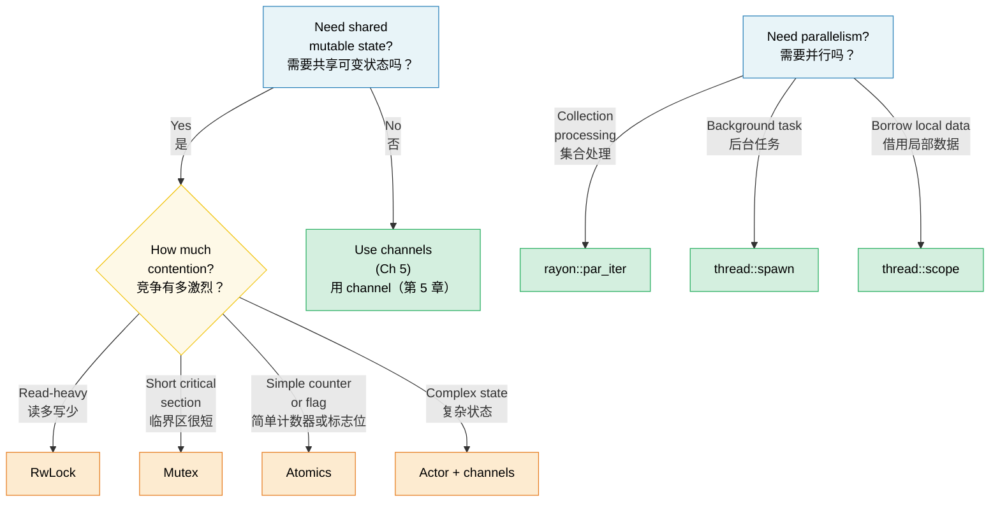

# 6. Concurrency vs Parallelism vs Threads 🟡<br><span class="zh-inline"># 6. 并发、并行与线程 🟡</span>

> **What you'll learn:**<br><span class="zh-inline">**本章将学到什么：**</span>
> - The precise distinction between concurrency and parallelism<br><span class="zh-inline">并发与并行的精确区别</span>
> - OS threads, scoped threads, and rayon for data parallelism<br><span class="zh-inline">操作系统线程、作用域线程，以及 `rayon` 的数据并行能力</span>
> - Shared state primitives: Arc, Mutex, RwLock, Atomics, Condvar<br><span class="zh-inline">共享状态原语：`Arc`、`Mutex`、`RwLock`、原子类型和 `Condvar`</span>
> - Lazy initialization with OnceLock/LazyLock and lock-free patterns<br><span class="zh-inline">如何用 `OnceLock`、`LazyLock` 做惰性初始化，以及常见的无锁模式</span>

## Terminology: Concurrency ≠ Parallelism<br><span class="zh-inline">术语澄清：并发不等于并行</span>

These terms are often confused. Here is the precise distinction:<br><span class="zh-inline">这两个词经常被混着用，但它们指的并不是一回事：</span>

| | Concurrency<br><span class="zh-inline">并发</span> | Parallelism<br><span class="zh-inline">并行</span> |
|---|---|---|
| **Definition**<br><span class="zh-inline">**定义**</span> | Managing multiple tasks that can make progress<br><span class="zh-inline">管理多个都能推进的任务</span> | Executing multiple tasks simultaneously<br><span class="zh-inline">让多个任务同时执行</span> |
| **Hardware requirement**<br><span class="zh-inline">**硬件要求**</span> | One core is enough<br><span class="zh-inline">单核就够</span> | Requires multiple cores<br><span class="zh-inline">需要多核</span> |
| **Analogy**<br><span class="zh-inline">**类比**</span> | One cook, multiple dishes (switching between them)<br><span class="zh-inline">一个厨师同时照看多道菜，来回切换</span> | Multiple cooks, each working on a dish<br><span class="zh-inline">多个厨师同时各做一道菜</span> |
| **Rust tools**<br><span class="zh-inline">**Rust 工具**</span> | `async/await`, channels, `select!` | `rayon`, `thread::spawn`, `par_iter()` |

```text
Concurrency (single core):           Parallelism (multi-core):
                                      
Task A: ██░░██░░██                   Task A: ██████████
Task B: ░░██░░██░░                   Task B: ██████████
─────────────────→ time              ─────────────────→ time
(interleaved on one core)           (simultaneous on two cores)
```

Concurrency is about structure: multiple tasks are in flight and can all make progress. Parallelism is about hardware execution: multiple tasks are literally running at the same time. A program can be concurrent without being parallel, especially on a single CPU core.<br><span class="zh-inline">并发强调的是程序结构：多个任务都处在进行中，都有机会继续推进；并行强调的是硬件执行：多个任务真的在同一时刻同时跑。程序完全可能“有并发但没并行”，尤其是在单核机器上。</span>

### std::thread — OS Threads<br><span class="zh-inline">`std::thread`：操作系统线程</span>

Rust threads map 1:1 to OS threads. Each gets its own stack, which is usually a few megabytes in size:<br><span class="zh-inline">Rust 标准库线程和操作系统线程是一对一映射。每个线程都有自己的栈，通常会分配几 MB 的空间：</span>

```rust
use std::thread;
use std::time::Duration;

fn main() {
    // Spawn a thread — takes a closure
    let handle = thread::spawn(|| {
        for i in 0..5 {
            println!("spawned thread: {i}");
            thread::sleep(Duration::from_millis(100));
        }
        42 // Return value
    });

    // Do work on the main thread simultaneously
    for i in 0..3 {
        println!("main thread: {i}");
        thread::sleep(Duration::from_millis(150));
    }

    // Wait for the thread to finish and get its return value
    let result = handle.join().unwrap(); // unwrap panics if thread panicked
    println!("Thread returned: {result}");
}
```

**`thread::spawn` type requirements**:<br><span class="zh-inline">**`thread::spawn` 的类型要求：**</span>

```rust
// The closure must be:
// 1. Send — can be transferred to another thread
// 2. 'static — can't borrow from the calling scope
// 3. FnOnce — takes ownership of captured variables

let data = vec![1, 2, 3];

// ❌ Borrows data — not 'static
// thread::spawn(|| println!("{data:?}"));

// ✅ Move ownership into the thread
thread::spawn(move || println!("{data:?}"));
// data is no longer accessible here
```

Spawning a thread is the blunt but reliable tool: great for long-running background work, but more expensive than lightweight async tasks because an OS thread owns stack memory and scheduling state.<br><span class="zh-inline">起线程属于那种简单粗暴但很稳的工具：拿来做长期后台任务很合适，但和轻量级 async 任务相比，它开销明显更大，因为 OS 线程本身就带着独立栈和调度状态。</span>

### Scoped Threads (`std::thread::scope`)<br><span class="zh-inline">作用域线程 `std::thread::scope`</span>

Since Rust 1.63, scoped threads solve the `'static` requirement — threads can borrow from the parent scope:<br><span class="zh-inline">从 Rust 1.63 开始，作用域线程解决了 `'static` 这个老大难问题，线程可以直接借用父作用域里的数据：</span>

```rust
use std::thread;

fn main() {
    let mut data = vec![1, 2, 3, 4, 5];

    thread::scope(|s| {
        // Thread 1: borrow shared reference
        s.spawn(|| {
            let sum: i32 = data.iter().sum();
            println!("Sum: {sum}");
        });

        // Thread 2: also borrow shared reference (multiple readers OK)
        s.spawn(|| {
            let max = data.iter().max().unwrap();
            println!("Max: {max}");
        });

        // ❌ Can't mutably borrow while shared borrows exist:
        // s.spawn(|| data.push(6));
    });
    // ALL scoped threads joined here — guaranteed before scope returns

    // Now safe to mutate — all threads have finished
    data.push(6);
    println!("Updated: {data:?}");
}
```

> **This is huge**: Before scoped threads, sharing local data with threads almost always meant wrapping everything in `Arc` and cloning it around. Now you can borrow directly, and the compiler proves all spawned threads finish before the scope exits.<br><span class="zh-inline">**这个改动很大**：以前要把局部数据分享给线程，基本都得 `Arc` 一把再四处 `clone`。现在可以直接借用，编译器会证明所有子线程都会在作用域结束前收尾完成。</span>

### `rayon` — Data Parallelism<br><span class="zh-inline">`rayon`：数据并行</span>

`rayon` provides parallel iterators that distribute work across a thread pool automatically:<br><span class="zh-inline">`rayon` 提供了并行迭代器，可以把工作自动分发到线程池里：</span>

```rust,ignore
// Cargo.toml: rayon = "1"
use rayon::prelude::*;

fn main() {
    let data: Vec<u64> = (0..1_000_000).collect();

    // Sequential:
    let sum_seq: u64 = data.iter().map(|x| x * x).sum();

    // Parallel — just change .iter() to .par_iter():
    let sum_par: u64 = data.par_iter().map(|x| x * x).sum();

    assert_eq!(sum_seq, sum_par);

    // Parallel sort:
    let mut numbers = vec![5, 2, 8, 1, 9, 3];
    numbers.par_sort();

    // Parallel processing with map/filter/collect:
    let results: Vec<_> = data
        .par_iter()
        .filter(|&&x| x % 2 == 0)
        .map(|&x| expensive_computation(x))
        .collect();
}

fn expensive_computation(x: u64) -> u64 {
    // Simulate CPU-heavy work
    (0..1000).fold(x, |acc, _| acc.wrapping_mul(7).wrapping_add(13))
}
```

**When to use `rayon` vs threads**:<br><span class="zh-inline">**`rayon` 和手动线程怎么选：**</span>

| Use<br><span class="zh-inline">选择</span> | When<br><span class="zh-inline">适用场景</span> |
|-----|------|
| `rayon::par_iter()` | Processing collections in parallel (map, filter, reduce)<br><span class="zh-inline">并行处理集合数据，比如 `map`、`filter`、`reduce`</span> |
| `thread::spawn` | Long-running background tasks, I/O workers<br><span class="zh-inline">长期后台任务、I/O worker</span> |
| `thread::scope` | Short-lived parallel tasks that borrow local data<br><span class="zh-inline">需要借用局部数据的短时并行任务</span> |
| `async` + `tokio` | I/O-bound concurrency (networking, file I/O)<br><span class="zh-inline">I/O 密集型并发，比如网络与文件 I/O</span> |

If the problem is “apply the same CPU-heavy work to a big collection,” `rayon` is usually the cleanest answer. If the problem is “run a background task with its own lifetime and coordination logic,” explicit threads are often clearer.<br><span class="zh-inline">如果问题是“对一大批数据做同一种 CPU 密集型处理”，`rayon` 往往是最干净的答案；如果问题是“跑一个有独立生命周期和协调逻辑的后台任务”，手写线程通常会更清楚。</span>

### Shared State: `Arc`, `Mutex`, `RwLock`, Atomics<br><span class="zh-inline">共享状态：`Arc`、`Mutex`、`RwLock` 与原子类型</span>

When threads need shared mutable state, Rust provides safe abstractions:<br><span class="zh-inline">当多个线程需要共享可变状态时，Rust 提供了一组相对安全的抽象：</span>

```rust
use std::sync::{Arc, Mutex, RwLock};
use std::sync::atomic::{AtomicU64, Ordering};
use std::thread;

// --- Arc<Mutex<T>>: Shared + Exclusive access ---
fn mutex_example() {
    let counter = Arc::new(Mutex::new(0u64));
    let mut handles = vec![];

    for _ in 0..10 {
        let counter = Arc::clone(&counter);
        handles.push(thread::spawn(move || {
            for _ in 0..1000 {
                let mut guard = counter.lock().unwrap();
                *guard += 1;
            } // Guard dropped → lock released
        }));
    }

    for h in handles { h.join().unwrap(); }
    println!("Counter: {}", counter.lock().unwrap()); // 10000
}

// --- Arc<RwLock<T>>: Multiple readers OR one writer ---
fn rwlock_example() {
    let config = Arc::new(RwLock::new(String::from("initial")));

    // Many readers — don't block each other
    let readers: Vec<_> = (0..5).map(|id| {
        let config = Arc::clone(&config);
        thread::spawn(move || {
            let guard = config.read().unwrap();
            println!("Reader {id}: {guard}");
        })
    }).collect();

    // Writer — blocks and waits for all readers to finish
    {
        let mut guard = config.write().unwrap();
        *guard = "updated".to_string();
    }

    for r in readers { r.join().unwrap(); }
}

// --- Atomics: Lock-free for simple values ---
fn atomic_example() {
    let counter = Arc::new(AtomicU64::new(0));
    let mut handles = vec![];

    for _ in 0..10 {
        let counter = Arc::clone(&counter);
        handles.push(thread::spawn(move || {
            for _ in 0..1000 {
                counter.fetch_add(1, Ordering::Relaxed);
                // No lock, no mutex — hardware atomic instruction
            }
        }));
    }

    for h in handles { h.join().unwrap(); }
    println!("Atomic counter: {}", counter.load(Ordering::Relaxed)); // 10000
}
```

### Quick Comparison<br><span class="zh-inline">快速对比</span>

| Primitive<br><span class="zh-inline">原语</span> | Use Case<br><span class="zh-inline">适用场景</span> | Cost<br><span class="zh-inline">成本</span> | Contention<br><span class="zh-inline">竞争表现</span> |
|-----------|----------|------|------------|
| `Mutex<T>` | Short critical sections<br><span class="zh-inline">短临界区</span> | Lock + unlock<br><span class="zh-inline">加锁与解锁</span> | Threads wait in line<br><span class="zh-inline">线程排队等待</span> |
| `RwLock<T>` | Read-heavy, rare writes<br><span class="zh-inline">读多写少</span> | Reader-writer lock<br><span class="zh-inline">读写锁开销</span> | Readers concurrent, writer exclusive<br><span class="zh-inline">多个读者可并行，写者独占</span> |
| `AtomicU64` etc. | Counters, flags<br><span class="zh-inline">计数器、标志位</span> | Hardware CAS<br><span class="zh-inline">硬件原子指令</span> | Lock-free — no waiting<br><span class="zh-inline">无锁，无需排队</span> |
| Channels | Message passing<br><span class="zh-inline">消息传递</span> | Queue ops<br><span class="zh-inline">队列操作</span> | Producer/consumer decouple<br><span class="zh-inline">生产者与消费者解耦</span> |

### Condition Variables (`Condvar`)<br><span class="zh-inline">条件变量 `Condvar`</span>

A `Condvar` lets a thread **wait** until another thread signals that a condition is true, without busy-looping. It is always paired with a `Mutex`:<br><span class="zh-inline">`Condvar` 允许一个线程安静地**等待**，直到另一个线程发出“条件成立”的信号，而不用在那儿空转。它总是和 `Mutex` 成对出现：</span>

```rust
use std::sync::{Arc, Mutex, Condvar};
use std::thread;

let pair = Arc::new((Mutex::new(false), Condvar::new()));
let pair2 = Arc::clone(&pair);

// Spawned thread: wait until ready == true
let handle = thread::spawn(move || {
    let (lock, cvar) = &*pair2;
    let mut ready = lock.lock().unwrap();
    while !*ready {
        ready = cvar.wait(ready).unwrap(); // atomically unlocks + sleeps
    }
    println!("Worker: condition met, proceeding");
});

// Main thread: set ready = true, then signal
{
    let (lock, cvar) = &*pair;
    let mut ready = lock.lock().unwrap();
    *ready = true;
    cvar.notify_one(); // wake one waiting thread (use notify_all for many)
}
handle.join().unwrap();
```

> **Pattern**: Always re-check the condition in a `while` loop after `wait()` returns — spurious wakeups are allowed by the OS.<br><span class="zh-inline">**固定写法**：`wait()` 返回后一定要用 `while` 再检查一次条件，因为操作系统允许伪唤醒。</span>

### Lazy Initialization: `OnceLock` and `LazyLock`<br><span class="zh-inline">惰性初始化：`OnceLock` 与 `LazyLock`</span>

Before Rust 1.80, initializing a global static that requires runtime computation usually meant `lazy_static!` or the `once_cell` crate. The standard library now covers these use cases natively:<br><span class="zh-inline">在 Rust 1.80 之前，只要全局静态值需要运行时计算，基本就得上 `lazy_static!` 或 `once_cell`。现在标准库已经原生覆盖了这些场景：</span>

```rust
use std::sync::{OnceLock, LazyLock};
use std::collections::HashMap;

// OnceLock — initialize on first use via `get_or_init`.
// Useful when the init value depends on runtime arguments.
static CONFIG: OnceLock<HashMap<String, String>> = OnceLock::new();

fn get_config() -> &'static HashMap<String, String> {
    CONFIG.get_or_init(|| {
        // Expensive: read & parse config file — happens exactly once.
        let mut m = HashMap::new();
        m.insert("log_level".into(), "info".into());
        m
    })
}

// LazyLock — initialize on first access, closure provided at definition site.
// Equivalent to lazy_static! but without a macro.
static REGEX: LazyLock<regex::Regex> = LazyLock::new(|| {
    regex::Regex::new(r"^[a-zA-Z0-9_]+$").unwrap()
});

fn is_valid_identifier(s: &str) -> bool {
    REGEX.is_match(s) // First call compiles the regex; subsequent calls reuse it.
}
```

| Type<br><span class="zh-inline">类型</span> | Stabilized<br><span class="zh-inline">稳定版本</span> | Init Timing<br><span class="zh-inline">初始化时机</span> | Use When<br><span class="zh-inline">适用场景</span> |
|------|-----------|-------------|----------|
| `OnceLock<T>` | Rust 1.70 | Call-site (`get_or_init`)<br><span class="zh-inline">调用点</span> | Init depends on runtime args<br><span class="zh-inline">初始化依赖运行时参数</span> |
| `LazyLock<T>` | Rust 1.80 | Definition-site (closure)<br><span class="zh-inline">定义点</span> | Init is self-contained<br><span class="zh-inline">初始化逻辑自包含</span> |
| `lazy_static!` | — | Definition-site (macro)<br><span class="zh-inline">定义点</span> | Pre-1.80 codebases (migrate away)<br><span class="zh-inline">老项目兼容，建议逐步迁移掉</span> |
| `const fn` + `static` | Always | Compile-time<br><span class="zh-inline">编译期</span> | Value is computable at compile time<br><span class="zh-inline">值可以在编译期算出来</span> |

> **Migration tip**: Replace `lazy_static! { static ref X: T = expr; }` with `static X: LazyLock<T> = LazyLock::new(|| expr);` — same semantics, no macro, no external dependency.<br><span class="zh-inline">**迁移建议**：把 `lazy_static! { static ref X: T = expr; }` 改成 `static X: LazyLock&lt;T&gt; = LazyLock::new(|| expr);`，语义基本一致，但不再需要宏和额外依赖。</span>

### Lock-Free Patterns<br><span class="zh-inline">无锁模式</span>

For high-performance code, you may want to avoid locks entirely:<br><span class="zh-inline">在某些高性能场景里，可能会想彻底绕开锁：</span>

```rust
use std::sync::atomic::{AtomicBool, AtomicUsize, Ordering};
use std::sync::Arc;

// Pattern 1: Spin lock (educational — prefer std::sync::Mutex)
// ⚠️ WARNING: This is a teaching example only. Real spinlocks need:
//   - A RAII guard (so a panic while holding doesn't deadlock forever)
//   - Fairness guarantees (this starves under contention)
//   - Backoff strategies (exponential backoff, yield to OS)
// Use std::sync::Mutex or parking_lot::Mutex in production.
struct SpinLock {
    locked: AtomicBool,
}

impl SpinLock {
    fn new() -> Self { SpinLock { locked: AtomicBool::new(false) } }

    fn lock(&self) {
        while self.locked
            .compare_exchange_weak(false, true, Ordering::Acquire, Ordering::Relaxed)
            .is_err()
        {
            std::hint::spin_loop(); // CPU hint: we're spinning
        }
    }

    fn unlock(&self) {
        self.locked.store(false, Ordering::Release);
    }
}

// Pattern 2: Lock-free SPSC (single producer, single consumer)
// Use crossbeam::queue::ArrayQueue or similar in production
// roll-your-own only for learning.

// Pattern 3: Sequence counter for wait-free reads
// ⚠️ Best for single-machine-word types (u64, f64); wider T may tear on read.
struct SeqLock<T: Copy> {
    seq: AtomicUsize,
    data: std::cell::UnsafeCell<T>,
}

unsafe impl<T: Copy + Send> Sync for SeqLock<T> {}

impl<T: Copy> SeqLock<T> {
    fn new(val: T) -> Self {
        SeqLock {
            seq: AtomicUsize::new(0),
            data: std::cell::UnsafeCell::new(val),
        }
    }

    fn read(&self) -> T {
        loop {
            let s1 = self.seq.load(Ordering::Acquire);
            if s1 & 1 != 0 { continue; } // Writer in progress, retry

            // SAFETY: We use ptr::read_volatile to prevent the compiler from
            // reordering or caching the read. The SeqLock protocol (checking
            // s1 == s2 after reading) ensures we retry if a writer was active.
            // This mirrors the C SeqLock pattern where the data read must use
            // volatile/relaxed semantics to avoid tearing under concurrency.
            let value = unsafe { core::ptr::read_volatile(self.data.get() as *const T) };

            // Acquire fence: ensures the data read above is ordered before
            // we re-check the sequence counter.
            std::sync::atomic::fence(Ordering::Acquire);
            let s2 = self.seq.load(Ordering::Relaxed);

            if s1 == s2 { return value; } // No writer intervened
            // else retry
        }
    }

    /// # Safety contract
    /// Only ONE thread may call `write()` at a time. If multiple writers
    /// are needed, wrap the `write()` call in an external `Mutex`.
    fn write(&self, val: T) {
        // Increment to odd (signals write in progress).
        // AcqRel: the Acquire side prevents the subsequent data write
        // from being reordered before this increment (readers must see
        // odd before they could observe a partial write). The Release
        // side is technically unnecessary for a single writer but
        // harmless and consistent.
        self.seq.fetch_add(1, Ordering::AcqRel);
        unsafe { *self.data.get() = val; }
        // Increment to even (signals write complete).
        // Release: ensure the data write is visible before readers see the even seq.
        self.seq.fetch_add(1, Ordering::Release);
    }
}
```

> **⚠️ Rust memory model caveat**: The non-atomic write through `UnsafeCell` in `write()` concurrent with the non-atomic `ptr::read_volatile` in `read()` is technically a data race under the Rust abstract machine, even though the SeqLock protocol forces readers to retry on stale observations. This pattern mirrors classic C kernel SeqLock code and works in practice for machine-word-sized values, but it lives in a sharp corner of unsafe Rust.<br><span class="zh-inline">**⚠️ Rust 内存模型提醒**：`write()` 里通过 `UnsafeCell` 做的非原子写，与 `read()` 里 `ptr::read_volatile` 做的非原子读，在 Rust 抽象机模型下严格说属于数据竞争，哪怕 SeqLock 协议会强迫读者在观察到陈旧值时重试。这个模式和 C 内核里的经典 SeqLock 很像，在机器字大小的数据上通常能工作，但它确实处在 unsafe Rust 很锋利的边角地带。</span>

> **Practical advice**: Lock-free code is hard to get right. Use `Mutex` or `RwLock` unless profiling shows lock contention is your real bottleneck. When lock-free really is necessary, proven crates are a far better starting point than a fresh home-grown implementation.<br><span class="zh-inline">**实战建议**：无锁代码非常难写对。除非分析结果明确表明锁竞争已经成了主要瓶颈，否则优先用 `Mutex` 或 `RwLock`。真要走无锁路线，也尽量先用成熟 crate，而不是当场手搓新轮子。</span>

> **Key Takeaways — Concurrency**<br><span class="zh-inline">**本章要点 — 并发**</span>
> - Scoped threads (`thread::scope`) let you borrow stack data without `Arc`<br><span class="zh-inline">作用域线程 `thread::scope` 允许直接借用栈上数据，而不必先 `Arc` 一层</span>
> - `rayon::par_iter()` parallelizes iterators with one method call<br><span class="zh-inline">`rayon::par_iter()` 用一个方法调用就能把迭代器并行化</span>
> - Use `OnceLock`/`LazyLock` instead of `lazy_static!`; use `Mutex` before reaching for atomics<br><span class="zh-inline">惰性初始化优先用 `OnceLock`、`LazyLock`；共享状态优先从 `Mutex` 开始，而不是一上来就堆原子操作</span>
> - Lock-free code is hard — prefer proven crates over hand-rolled implementations<br><span class="zh-inline">无锁代码很难写稳，成熟 crate 通常比手写实现更值得信赖</span>

> **See also:** [Ch 5 — Channels](ch05-channels-and-message-passing.md) for message-passing concurrency. [Ch 9 — Smart Pointers](ch09-smart-pointers-and-interior-mutability.md) for Arc/Rc details.<br><span class="zh-inline">**延伸阅读：** 想看消息传递风格的并发，可以接着读 [第 5 章：Channel](ch05-channels-and-message-passing.md)；想看 `Arc`、`Rc` 这些智能指针细节，可以看 [第 9 章：智能指针](ch09-smart-pointers-and-interior-mutability.md)。</span>



---

### Exercise: Parallel Map with Scoped Threads ★★ (~25 min)<br><span class="zh-inline">练习：使用作用域线程实现并行 `map` ★★（约 25 分钟）</span>

Write a function `parallel_map<T, R>(data: &[T], f: fn(&T) -> R, num_threads: usize) -> Vec<R>` that splits `data` into `num_threads` chunks and processes each in a scoped thread. Do not use `rayon`; use `std::thread::scope`.<br><span class="zh-inline">编写一个函数 `parallel_map&lt;T, R&gt;(data: &[T], f: fn(&T) -> R, num_threads: usize) -> Vec&lt;R&gt;`，把 `data` 切成 `num_threads` 份，并在作用域线程里分别处理。这里不要使用 `rayon`，而是使用 `std::thread::scope`。</span>

<details>
<summary>🔑 Solution<br><span class="zh-inline">🔑 参考答案</span></summary>

```rust
fn parallel_map<T: Sync, R: Send>(data: &[T], f: fn(&T) -> R, num_threads: usize) -> Vec<R> {
    let chunk_size = (data.len() + num_threads - 1) / num_threads;
    let mut results = Vec::with_capacity(data.len());

    std::thread::scope(|s| {
        let mut handles = Vec::new();
        for chunk in data.chunks(chunk_size) {
            handles.push(s.spawn(move || {
                chunk.iter().map(f).collect::<Vec<_>>()
            }));
        }
        for h in handles {
            results.extend(h.join().unwrap());
        }
    });

    results
}

fn main() {
    let data: Vec<u64> = (1..=20).collect();
    let squares = parallel_map(&data, |x| x * x, 4);
    assert_eq!(squares, (1..=20).map(|x: u64| x * x).collect::<Vec<_>>());
    println!("Parallel squares: {squares:?}");
}
```

</details>

***
