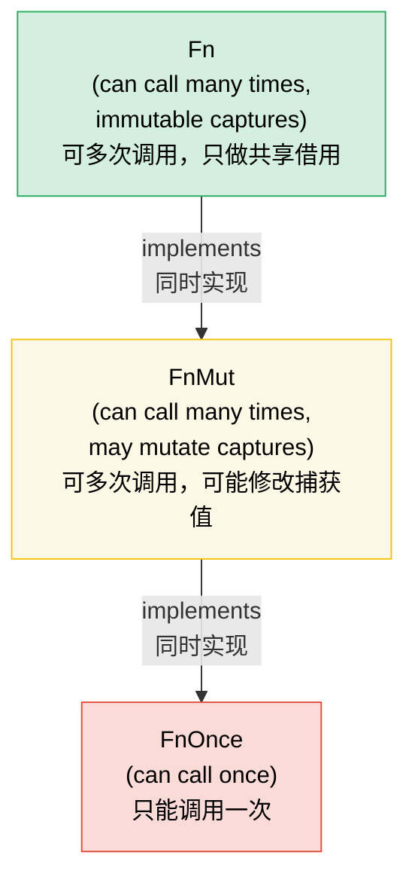

# 7. Closures and Higher-Order Functions 🟢<br><span class="zh-inline"># 7. 闭包与高阶函数 🟢</span>

> **What you'll learn:**<br><span class="zh-inline">**本章将学到什么：**</span>
> - The three closure traits (`Fn`, `FnMut`, `FnOnce`) and how capture works<br><span class="zh-inline">三个闭包 trait：`Fn`、`FnMut`、`FnOnce`，以及捕获机制如何运作</span>
> - Passing closures as parameters and returning them from functions<br><span class="zh-inline">如何把闭包当参数传递，以及如何从函数里返回闭包</span>
> - Combinator chains and iterator adapters for functional-style programming<br><span class="zh-inline">函数式风格里的组合器链和迭代器适配器</span>
> - Designing your own higher-order APIs with the right trait bounds<br><span class="zh-inline">如何给自己的高阶 API 选出合适的 trait 约束</span>

## Fn, FnMut, FnOnce — The Closure Traits<br><span class="zh-inline">`Fn`、`FnMut`、`FnOnce`：闭包的三个 Trait</span>

Every closure in Rust implements one or more of three traits, based on how it captures variables:<br><span class="zh-inline">Rust 里的每个闭包，都会根据它捕获变量的方式，实现这三个 trait 里的一个或多个：</span>

```rust
// FnOnce — consumes captured values (can only be called once)
let name = String::from("Alice");
let greet = move || {
    println!("Hello, {name}!"); // Takes ownership of `name`
    drop(name); // name is consumed
};
greet(); // ✅ First call
// greet(); // ❌ Can't call again — `name` was consumed

// FnMut — mutably borrows captured values (can be called many times)
let mut count = 0;
let mut increment = || {
    count += 1; // Mutably borrows `count`
};
increment(); // count == 1
increment(); // count == 2

// Fn — immutably borrows captured values (can be called many times, concurrently)
let prefix = "Result";
let display = |x: i32| {
    println!("{prefix}: {x}"); // Immutably borrows `prefix`
};
display(1);
display(2);
```

**The hierarchy**: `Fn` : `FnMut` : `FnOnce` — each is a subtrait of the next:<br><span class="zh-inline">**层级关系**：`Fn` : `FnMut` : `FnOnce`，前者是后者的子 trait：</span>

```text
FnOnce  ← everything can be called at least once
 ↑
FnMut   ← can be called repeatedly (may mutate state)
 ↑
Fn      ← can be called repeatedly and concurrently (no mutation)
```

If a closure implements `Fn`, it also implements `FnMut` and `FnOnce`.<br><span class="zh-inline">如果一个闭包实现了 `Fn`，那它也一定同时实现 `FnMut` 和 `FnOnce`。</span>

### Closures as Parameters and Return Values<br><span class="zh-inline">把闭包作为参数和返回值</span>

```rust
// --- Parameters ---

// Static dispatch (monomorphized — fastest)
fn apply_twice<F: Fn(i32) -> i32>(f: F, x: i32) -> i32 {
    f(f(x))
}

// Also written with impl Trait:
fn apply_twice_v2(f: impl Fn(i32) -> i32, x: i32) -> i32 {
    f(f(x))
}

// Dynamic dispatch (trait object — flexible, slight overhead)
fn apply_dyn(f: &dyn Fn(i32) -> i32, x: i32) -> i32 {
    f(x)
}

// --- Return Values ---

// Can't return closures by value without boxing (they have anonymous types):
fn make_adder(n: i32) -> Box<dyn Fn(i32) -> i32> {
    Box::new(move |x| x + n)
}

// With impl Trait (simpler, monomorphized, but can't be dynamic):
fn make_adder_v2(n: i32) -> impl Fn(i32) -> i32 {
    move |x| x + n
}

fn main() {
    let double = |x: i32| x * 2;
    println!("{}", apply_twice(double, 3)); // 12

    let add5 = make_adder(5);
    println!("{}", add5(10)); // 15
}
```

The main trade-off is the usual Rust one: monomorphized generics are fastest and most optimizable, while trait objects are more flexible when you need dynamic behavior or heterogeneous storage.<br><span class="zh-inline">这里的主要取舍还是 Rust 里那套老规律：单态化泛型最快、最容易被优化；trait object 更灵活，适合需要动态行为或异构存储的场景。</span>

### Combinator Chains and Iterator Adapters<br><span class="zh-inline">组合器链与迭代器适配器</span>

Higher-order functions shine with iterators — this is idiomatic Rust:<br><span class="zh-inline">高阶函数和迭代器组合在一起时特别顺手，这也是非常典型的 Rust 写法：</span>

```rust
// C-style loop (imperative):
let data = vec![1, 2, 3, 4, 5, 6, 7, 8, 9, 10];
let mut result = Vec::new();
for x in &data {
    if x % 2 == 0 {
        result.push(x * x);
    }
}

// Idiomatic Rust (functional combinator chain):
let result: Vec<i32> = data.iter()
    .filter(|&&x| x % 2 == 0)
    .map(|&x| x * x)
    .collect();

// Same performance — iterators are lazy and optimized by LLVM
assert_eq!(result, vec![4, 16, 36, 64, 100]);
```

**Common combinators cheat sheet**:<br><span class="zh-inline">**常见组合器速查：**</span>

| Combinator<br><span class="zh-inline">组合器</span> | What It Does<br><span class="zh-inline">作用</span> | Example<br><span class="zh-inline">示例</span> |
|-----------|-------------|---------|
| `.map(f)` | Transform each element<br><span class="zh-inline">变换每个元素</span> | `.map(|x| x * 2)` |
| `.filter(p)` | Keep elements where predicate is true<br><span class="zh-inline">保留满足条件的元素</span> | `.filter(|x| x > &5)` |
| `.filter_map(f)` | Map + filter in one step (returns `Option`)<br><span class="zh-inline">一步完成映射与过滤，返回 `Option`</span> | `.filter_map(|x| x.parse().ok())` |
| `.flat_map(f)` | Map then flatten nested iterators<br><span class="zh-inline">映射后再拍平嵌套迭代器</span> | `.flat_map(|s| s.chars())` |
| `.fold(init, f)` | Reduce to single value<br><span class="zh-inline">归约成单个值</span> | `.fold(0, |acc, x| acc + x)` |
| `.any(p)` / `.all(p)` | Short-circuit boolean check<br><span class="zh-inline">短路布尔判断</span> | `.any(|x| x > 100)` |
| `.enumerate()` | Add index<br><span class="zh-inline">附带索引</span> | `.enumerate().map(|(i, x)| ...)` |
| `.zip(other)` | Pair with another iterator<br><span class="zh-inline">与另一个迭代器配对</span> | `.zip(labels.iter())` |
| `.take(n)` / `.skip(n)` | First/skip N elements<br><span class="zh-inline">取前 N 个或跳过前 N 个</span> | `.take(10)` |
| `.chain(other)` | Concatenate two iterators<br><span class="zh-inline">连接两个迭代器</span> | `.chain(extra.iter())` |
| `.peekable()` | Look ahead without consuming<br><span class="zh-inline">提前查看下一个元素而不消费</span> | `.peek()` |
| `.collect()` | Gather into a collection<br><span class="zh-inline">收集进集合</span> | `.collect::<Vec<_>>()` |

### Implementing Your Own Higher-Order APIs<br><span class="zh-inline">自己设计高阶 API</span>

Design APIs that accept closures for customization:<br><span class="zh-inline">可以把闭包作为可配置逻辑的一部分塞进 API 里：</span>

```rust
/// Retry an operation with a configurable strategy
fn retry<T, E, F, S>(
    mut operation: F,
    mut should_retry: S,
    max_attempts: usize,
) -> Result<T, E>
where
    F: FnMut() -> Result<T, E>,
    S: FnMut(&E, usize) -> bool, // (error, attempt) → try again?
{
    for attempt in 1..=max_attempts {
        match operation() {
            Ok(val) => return Ok(val),
            Err(e) if attempt < max_attempts && should_retry(&e, attempt) => {
                continue;
            }
            Err(e) => return Err(e),
        }
    }
    unreachable!()
}

// Usage — caller controls retry logic:
```

```rust
# fn connect_to_database() -> Result<(), String> { Ok(()) }
# fn http_get(_url: &str) -> Result<String, String> { Ok(String::new()) }
# trait TransientError { fn is_transient(&self) -> bool; }
# impl TransientError for String { fn is_transient(&self) -> bool { true } }
# let url = "http://example.com";
let result = retry(
    || connect_to_database(),
    |err, attempt| {
        eprintln!("Attempt {attempt} failed: {err}");
        true // Always retry
    },
    3,
);

// Usage — retry only specific errors:
let result = retry(
    || http_get(url),
    |err, _| err.is_transient(), // Only retry transient errors
    5,
);
```

This style is powerful because the framework owns the control flow, while the caller injects just the variable behavior. It is one of the cleanest ways to build reusable policy-driven APIs in Rust.<br><span class="zh-inline">这种写法厉害的地方在于：控制流程由框架统一掌握，调用方只注入变化的那部分策略。拿它来做“可复用但可定制”的策略型 API，很顺手。</span>

### The `with` Pattern — Bracketed Resource Access<br><span class="zh-inline">`with` 模式：成对括起来的资源访问</span>

Sometimes a resource must be placed into a specific state for the duration of one operation and restored afterwards, even if the caller returns early or errors out. Instead of exposing the raw resource and hoping the caller remembers setup and teardown, a `with_*` API lends the resource through a closure:<br><span class="zh-inline">有时候一个资源必须先被设置到特定状态，执行完操作后再恢复回来，而且哪怕调用方中途返回、`?` 提前退出也一样要恢复。这时候与其把原始资源裸露给调用方、赌对方记得前后收尾，不如用 `with_*` 这种 API，通过闭包把资源“借”出去：</span>

```text
set up → call closure with resource → tear down
```

The caller never manages setup or teardown directly, so forgetting either side becomes impossible.<br><span class="zh-inline">这样一来，调用方根本碰不到 setup 和 teardown 本身，也就谈不上“忘了做其中一步”。</span>

#### Example: GPIO Pin Direction<br><span class="zh-inline">例子：GPIO 引脚方向</span>

A GPIO controller manages pins that support bidirectional I/O. Some callers need input mode, others need output mode. Instead of exposing raw pin access and trusting callers to set direction correctly, the controller provides `with_pin_input` and `with_pin_output`:<br><span class="zh-inline">GPIO 控制器里的引脚可能既能输入也能输出。有的调用方需要输入模式，有的需要输出模式。与其把底层引脚访问和方向设置全都暴露出去，不如直接给出 `with_pin_input` 和 `with_pin_output` 两套接口：</span>

```rust
/// GPIO pin direction — not public, callers never set this directly.
#[derive(Debug, Clone, Copy, PartialEq)]
enum Direction { In, Out }

/// A GPIO pin handle lent to the closure. Cannot be stored or cloned —
/// it exists only for the duration of the callback.
pub struct GpioPin<'a> {
    pin_number: u8,
    _controller: &'a GpioController,
}

impl GpioPin<'_> {
    pub fn read(&self) -> bool {
        // Read pin level from hardware register
        println!("  reading pin {}", self.pin_number);
        true // stub
    }

    pub fn write(&self, high: bool) {
        // Drive pin level via hardware register
        println!("  writing pin {} = {high}", self.pin_number);
    }
}

pub struct GpioController {
    current_direction: std::cell::Cell<Option<Direction>>,
}

impl GpioController {
    pub fn new() -> Self {
        GpioController {
            current_direction: std::cell::Cell::new(None),
        }
    }

    pub fn with_pin_input<R>(
        &self,
        pin: u8,
        mut f: impl FnMut(&GpioPin<'_>) -> R,
    ) -> R {
        let prev = self.current_direction.get();
        self.set_direction(pin, Direction::In);
        let handle = GpioPin { pin_number: pin, _controller: self };
        let result = f(&handle);
        if let Some(dir) = prev {
            self.set_direction(pin, dir);
        }
        result
    }

    pub fn with_pin_output<R>(
        &self,
        pin: u8,
        mut f: impl FnMut(&GpioPin<'_>) -> R,
    ) -> R {
        let prev = self.current_direction.get();
        self.set_direction(pin, Direction::Out);
        let handle = GpioPin { pin_number: pin, _controller: self };
        let result = f(&handle);
        if let Some(dir) = prev {
            self.set_direction(pin, dir);
        }
        result
    }

    fn set_direction(&self, pin: u8, dir: Direction) {
        println!("  [hw] pin {pin} → {dir:?}");
        self.current_direction.set(Some(dir));
    }
}
```

**What the `with` pattern guarantees**:<br><span class="zh-inline">**`with` 模式保证了什么：**</span>
- Direction is **always set before** the caller's code runs<br><span class="zh-inline">调用方代码运行前，引脚方向一定已经设置好</span>
- Direction is **always restored after**, even if the closure returns early<br><span class="zh-inline">闭包执行结束后方向一定会恢复，即使中途提前返回也一样</span>
- The `GpioPin` handle **cannot escape** the closure<br><span class="zh-inline">`GpioPin` 句柄无法逃出闭包作用域</span>
- Callers never import `Direction`, never call `set_direction`<br><span class="zh-inline">调用方不需要接触 `Direction`，也碰不到 `set_direction`</span>

#### Where This Pattern Appears<br><span class="zh-inline">这个模式通常出现在哪些地方</span>

| API | Setup<br><span class="zh-inline">准备阶段</span> | Callback<br><span class="zh-inline">回调阶段</span> | Teardown<br><span class="zh-inline">收尾阶段</span> |
|-----|-------|----------|----------|
| `std::thread::scope` | Create scope<br><span class="zh-inline">创建作用域</span> | `\|s\| { s.spawn(...) }` | Join all threads<br><span class="zh-inline">等待所有线程结束</span> |
| `Mutex::lock` | Acquire lock<br><span class="zh-inline">拿到锁</span> | Use `MutexGuard` | Release on drop<br><span class="zh-inline">离开作用域自动释放</span> |
| `tempfile::tempdir` | Create temp directory<br><span class="zh-inline">创建临时目录</span> | Use path<br><span class="zh-inline">使用路径</span> | Delete on drop<br><span class="zh-inline">离开时删除</span> |
| `std::io::BufWriter::new` | Buffer writes<br><span class="zh-inline">建立缓冲写入</span> | Write operations<br><span class="zh-inline">执行写入</span> | Flush on drop<br><span class="zh-inline">释放时刷新</span> |
| GPIO `with_pin_*` | Set direction<br><span class="zh-inline">设置方向</span> | Use pin handle<br><span class="zh-inline">使用引脚句柄</span> | Restore direction<br><span class="zh-inline">恢复方向</span> |

> **`with` vs RAII (Drop)**: Both ensure cleanup. Use RAII or `Drop` when the caller needs to hold the resource across multiple statements or function calls. Use `with` when the operation is tightly bracketed and the caller should not be able to break that bracket.<br><span class="zh-inline">**`with` 和 RAII 的区别**：两者都能保证收尾。调用方如果需要跨多个语句、多个函数长期持有资源，适合 RAII 或 `Drop`；如果整个操作天然就是“一次准备、一段工作、一次收尾”，而且不希望调用方打破这个边界，就更适合 `with`。</span>

> **`FnMut` vs `Fn` in API design**: `FnMut` is usually the default bound because callers can pass either `Fn` or `FnMut`. Only require `Fn` if the closure may be called concurrently, and only require `FnOnce` if the callback is consumed by a single call.<br><span class="zh-inline">**API 设计里 `FnMut` 和 `Fn` 怎么选**：`FnMut` 往往是默认选择，因为它既能接 `Fn` 闭包，也能接会修改捕获状态的 `FnMut` 闭包。只有在闭包可能被并发调用时，才需要把约束抬到 `Fn`；只有确定只调用一次时，才收紧到 `FnOnce`。</span>

> **Key Takeaways — Closures**<br><span class="zh-inline">**本章要点 — 闭包**</span>
> - `Fn` does shared borrowing, `FnMut` does mutable borrowing, `FnOnce` consumes captures; accept the weakest bound your API needs<br><span class="zh-inline">`Fn` 做共享借用，`FnMut` 做可变借用，`FnOnce` 会消费捕获值；API 设计时尽量接受“最弱但够用”的约束</span>
> - `impl Fn` is great for parameters and returns; `Box<dyn Fn>` is for dynamic storage<br><span class="zh-inline">参数和返回值里经常适合 `impl Fn`；需要动态存储时再用 `Box&lt;dyn Fn&gt;`</span>
> - Combinator chains compose cleanly and often optimize into tight loops<br><span class="zh-inline">组合器链写起来很整洁，而且通常会被优化成很紧凑的循环</span>
> - The `with` pattern guarantees setup/teardown and prevents resource escape<br><span class="zh-inline">`with` 模式可以把准备与收尾强行绑死，还能阻止资源逃逸</span>

> **See also:** [Ch 2 — Traits In Depth](ch02-traits-in-depth.md), [Ch 8 — Functional vs. Imperative](ch08-functional-vs-imperative-when-elegance-wins.md), and [Ch 15 — API Design](ch15-crate-architecture-and-api-design.md).<br><span class="zh-inline">**延伸阅读：** 相关内容还可以继续看 [第 2 章：Trait 深入解析](ch02-traits-in-depth.md)、[第 8 章：函数式与命令式](ch08-functional-vs-imperative-when-elegance-wins.md) 和 [第 15 章：API 设计](ch15-crate-architecture-and-api-design.md)。</span>



> Every `Fn` is also `FnMut`, and every `FnMut` is also `FnOnce`. Accept `FnMut` by default — it is usually the most flexible bound for callers.<br><span class="zh-inline">每个 `Fn` 也都是 `FnMut`，每个 `FnMut` 也都是 `FnOnce`。大多数时候，默认接受 `FnMut` 是最灵活的做法。</span>

---

### Exercise: Higher-Order Combinator Pipeline ★★ (~25 min)<br><span class="zh-inline">练习：高阶组合器流水线 ★★（约 25 分钟）</span>

Create a `Pipeline` struct that chains transformations. It should support `.pipe(f)` to add a transformation and `.execute(input)` to run the full chain.<br><span class="zh-inline">实现一个 `Pipeline` 结构体，用来串联多个变换步骤。它需要支持 `.pipe(f)` 添加变换函数，并通过 `.execute(input)` 运行整条流水线。</span>

<details>
<summary>🔑 Solution<br><span class="zh-inline">🔑 参考答案</span></summary>

```rust
struct Pipeline<T> {
    transforms: Vec<Box<dyn Fn(T) -> T>>,
}

impl<T: 'static> Pipeline<T> {
    fn new() -> Self {
        Pipeline { transforms: Vec::new() }
    }

    fn pipe(mut self, f: impl Fn(T) -> T + 'static) -> Self {
        self.transforms.push(Box::new(f));
        self
    }

    fn execute(self, input: T) -> T {
        self.transforms.into_iter().fold(input, |val, f| f(val))
    }
}

fn main() {
    let result = Pipeline::new()
        .pipe(|s: String| s.trim().to_string())
        .pipe(|s| s.to_uppercase())
        .pipe(|s| format!(">>> {s} <<<"))
        .execute("  hello world  ".to_string());

    println!("{result}"); // >>> HELLO WORLD <<<

    let result = Pipeline::new()
        .pipe(|x: i32| x * 2)
        .pipe(|x| x + 10)
        .pipe(|x| x * x)
        .execute(5);

    println!("{result}"); // (5*2 + 10)^2 = 400
}
```

</details>

***
