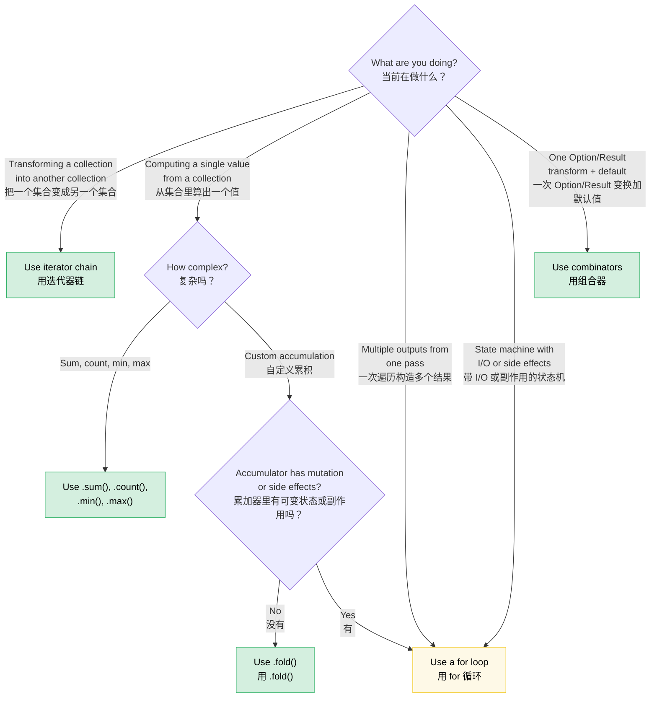

# Chapter 8 — Functional vs. Imperative: When Elegance Wins (and When It Doesn't)<br><span class="zh-inline"># 第 8 章：函数式与命令式，优雅何时胜出，何时不该硬上</span>

> **Difficulty:** 🟡 Intermediate | **Time:** 2–3 hours | **Prerequisites:** [Ch 7 — Closures](ch07-closures-and-higher-order-functions.md)<br><span class="zh-inline">**难度：** 🟡 中级 | **时间：** 2–3 小时 | **前置章节：** [第 7 章：闭包](ch07-closures-and-higher-order-functions.md)</span>

Rust gives you genuine parity between functional and imperative styles. Unlike Haskell, which pushes everything toward the functional side, or C, which defaults to imperative control flow, Rust lets both styles live comfortably. The right choice depends on what the code is trying to express.<br><span class="zh-inline">Rust 真的同时尊重函数式和命令式两种风格。它不像 Haskell 那样天然把问题往函数式方向推，也不像 C 那样默认什么都得靠命令式控制流来组织。在 Rust 里，两边都能写得自然，关键在于当前代码到底想表达什么。</span>

**The core principle:** Functional style shines when you're *transforming data through a pipeline*. Imperative style shines when you're *managing state transitions with side effects*. Most real code has both, and the real skill is knowing where the boundary belongs.<br><span class="zh-inline">**核心原则**：当代码本质上是在*沿着一条流水线变换数据*时，函数式风格通常更出彩；当代码本质上是在*带着副作用管理状态转移*时，命令式风格往往更合适。真实项目里两者几乎总是混着出现，真正的本事在于判断边界该划在哪儿。</span>

---

## 8.1 The Combinator You Didn't Know You Wanted<br><span class="zh-inline">8.1 那些本该早点用起来的组合器</span>

Many Rust developers write this:<br><span class="zh-inline">很多 Rust 开发者会这样写：</span>

```rust
let value = if let Some(x) = maybe_config() {
    x
} else {
    default_config()
};
process(value);
```

When they could write this:<br><span class="zh-inline">其实完全可以写成这样：</span>

```rust
process(maybe_config().unwrap_or_else(default_config));
```

Or this common pattern:<br><span class="zh-inline">再比如这种特别常见的模式：</span>

```rust
let display_name = if let Some(name) = user.nickname() {
    name.to_uppercase()
} else {
    "ANONYMOUS".to_string()
};
```

Which is:<br><span class="zh-inline">它更适合写成：</span>

```rust
let display_name = user.nickname()
    .map(|n| n.to_uppercase())
    .unwrap_or_else(|| "ANONYMOUS".to_string());
```

The functional version is not just shorter. More importantly, it exposes the structure of the operation: “transform if present, otherwise use a default.” The imperative version makes the reader walk through the branches before realizing both paths are just producing one final value.<br><span class="zh-inline">函数式写法的价值不只是更短，更关键的是它把“有值就变换、没值就给默认值”这件事的结构直接摊在读者面前。命令式写法则需要先把分支读完，才能反应过来这两条路最后只是为了生成一个结果。</span>

### The Option combinator family<br><span class="zh-inline">`Option` 组合器家族</span>

The right mental model is this: `Option<T>` can be treated like a collection that contains either one element or zero elements. Once这样想，很多组合器就顺手了。<br><span class="zh-inline">一个很有用的心智模型是：把 `Option&lt;T&gt;` 看成“要么有一个元素，要么一个都没有”的集合。只要这么理解，很多组合器立刻就顺手了。</span>

| You write...<br><span class="zh-inline">推荐写法</span> | Instead of...<br><span class="zh-inline">替代写法</span> | What it communicates<br><span class="zh-inline">表达的意图</span> |
|---|---|---|
| `opt.unwrap_or(default)` | `if let Some(x) = opt { x } else { default }` | "Use this value or fall back"<br><span class="zh-inline">“有就用，没有就回退”</span> |
| `opt.unwrap_or_else(\|\| expensive())` | `if let Some(x) = opt { x } else { expensive() }` | Lazy fallback<br><span class="zh-inline">懒执行默认值</span> |
| `opt.map(f)` | `match opt { Some(x) => Some(f(x)), None => None }` | Transform only the inside<br><span class="zh-inline">只变换内部的值</span> |
| `opt.and_then(f)` | `match opt { Some(x) => f(x), None => None }` | Chain fallible steps<br><span class="zh-inline">串联可能失败的步骤</span> |
| `opt.filter(\|x\| pred(x))` | `match opt { Some(x) if pred(&x) => Some(x), _ => None }` | Keep only if it passes<br><span class="zh-inline">符合条件才保留</span> |
| `opt.zip(other)` | `if let (Some(a), Some(b)) = (opt, other) { Some((a,b)) } else { None }` | "Both or neither"<br><span class="zh-inline">“两个都有才继续”</span> |
| `opt.or(fallback)` | `if opt.is_some() { opt } else { fallback }` | First available value<br><span class="zh-inline">取第一个可用值</span> |
| `opt.or_else(\|\| try_another())` | `if opt.is_some() { opt } else { try_another() }` | Try alternatives lazily<br><span class="zh-inline">懒执行备用方案</span> |
| `opt.map_or(default, f)` | `if let Some(x) = opt { f(x) } else { default }` | Transform or default<br><span class="zh-inline">变换，否则给默认值</span> |
| `opt.map_or_else(default_fn, f)` | `if let Some(x) = opt { f(x) } else { default_fn() }` | Both sides are lazy<br><span class="zh-inline">两边都用闭包延迟执行</span> |
| `opt?` | `match opt { Some(x) => x, None => return None }` | Propagate absence upward<br><span class="zh-inline">把“缺失”继续往上传播</span> |

### The Result combinator family<br><span class="zh-inline">`Result` 组合器家族</span>

The same idea carries over to `Result<T, E>`:<br><span class="zh-inline">同样的思路也可以直接搬到 `Result&lt;T, E&gt;` 身上：</span>

| You write...<br><span class="zh-inline">推荐写法</span> | Instead of...<br><span class="zh-inline">替代写法</span> | What it communicates<br><span class="zh-inline">表达的意图</span> |
|---|---|---|
| `res.map(f)` | `match res { Ok(x) => Ok(f(x)), Err(e) => Err(e) }` | Transform the success path<br><span class="zh-inline">只变换成功值</span> |
| `res.map_err(f)` | `match res { Ok(x) => Ok(x), Err(e) => Err(f(e)) }` | Transform the error path<br><span class="zh-inline">只变换错误值</span> |
| `res.and_then(f)` | `match res { Ok(x) => f(x), Err(e) => Err(e) }` | Chain fallible operations<br><span class="zh-inline">串联可能失败的步骤</span> |
| `res.unwrap_or_else(\|e\| default(e))` | `match res { Ok(x) => x, Err(e) => default(e) }` | Recover from error<br><span class="zh-inline">出错时恢复</span> |
| `res.ok()` | `match res { Ok(x) => Some(x), Err(_) => None }` | Discard the error<br><span class="zh-inline">丢掉错误，只保留成功值</span> |
| `res?` | `match res { Ok(x) => x, Err(e) => return Err(e.into()) }` | Propagate error upward<br><span class="zh-inline">把错误继续向上传播</span> |

### When `if let` IS better<br><span class="zh-inline">什么时候 `if let` 反而更好</span>

Combinators are not magic. They lose in a few specific situations:<br><span class="zh-inline">组合器不是万能药，下面这些情况它反而会输：</span>

- You need multiple statements in the `Some` branch.<br><span class="zh-inline">`Some` 分支里有好几条语句，不是一个简短表达式。</span>
- The control flow itself is the point.<br><span class="zh-inline">控制流本身就是重点，两个分支是真的在做不同事情。</span>
- Side effects dominate the branch bodies.<br><span class="zh-inline">分支里以 I/O、副作用、日志、告警这类动作为主。</span>

**Rule of thumb:** If both branches mainly produce the same output type and the logic is short, use a combinator. If the branches are behaviorally different, reach for `if let` or `match`.<br><span class="zh-inline">**经验法则**：如果两个分支本质上只是为了产出同一种结果，且逻辑很短，就用组合器；如果两个分支在行为上差异很大，那就老老实实用 `if let` 或 `match`。</span>

---

## 8.2 Bool Combinators: `.then()` and `.then_some()`<br><span class="zh-inline">8.2 布尔组合器：`.then()` 与 `.then_some()`</span>

Another overly common pattern is this:<br><span class="zh-inline">还有一种写法也常见得有点过头：</span>

```rust
let label = if is_admin {
    Some("ADMIN")
} else {
    None
};
```

Rust gives you this instead:<br><span class="zh-inline">Rust 其实早就给了更直接的写法：</span>

```rust
let label = is_admin.then_some("ADMIN");
```

Or with a computed value:<br><span class="zh-inline">如果值需要临时计算：</span>

```rust
let permissions = is_admin.then(|| compute_admin_permissions());
```

This becomes especially nice in small collection-building pipelines:<br><span class="zh-inline">在构建条件性小集合时，这个写法尤其舒服：</span>

```rust
let tags: Vec<&str> = [
    user.is_admin.then_some("admin"),
    user.is_verified.then_some("verified"),
    (user.score > 100).then_some("power-user"),
]
.into_iter()
.flatten()
.collect();
```

The functional version states the pattern directly: “build a list from several optional entries.” The imperative version works, but makes the reader re-check every `if` before seeing that all branches are just pushing tags.<br><span class="zh-inline">函数式版本把模式直接说出来了：就是“从几个可选项里组一个列表”。命令式版本当然也能跑，但读者得把每个 `if` 都重新扫一遍，才能确认它们其实都只是在往同一个地方塞标签。</span>

---

## 8.3 Iterator Chains vs. Loops: The Decision Framework<br><span class="zh-inline">8.3 迭代器链和循环怎么选</span>

Ch 7 covered the mechanics. This section is about judgment.<br><span class="zh-inline">第 7 章已经讲了机制，这里讲的是判断力。</span>

### When iterators win<br><span class="zh-inline">什么时候迭代器链更好</span>

**Data pipelines** are the natural home of iterator chains:<br><span class="zh-inline">**数据流水线** 是迭代器链最自然的主场：</span>

```rust
let results: Vec<_> = inventory.iter()
    .filter(|item| item.category == Category::Server)
    .filter_map(|item| item.last_temperature().map(|t| (item.id, t)))
    .filter(|(_, temp)| *temp > 80.0)
    .collect();
```

This style wins when each stage has one clear responsibility and the data only flows in one direction.<br><span class="zh-inline">只要每个阶段职责单一、数据也沿着一个方向向前流，这种写法就会非常顺眼。</span>

**Aggregation** is another strong fit:<br><span class="zh-inline">**聚合型计算** 也是迭代器链特别擅长的场景：</span>

```rust
let total: f64 = fleet.iter().map(|s| s.power_draw()).sum();
```

### When loops win<br><span class="zh-inline">什么时候循环更好</span>

Loops are better when the algorithm revolves around state transitions, multiple outputs, or side effects.<br><span class="zh-inline">如果算法的核心是状态迁移、多路输出或者副作用，循环通常更好。</span>

**Building multiple outputs simultaneously** is a classic example:<br><span class="zh-inline">**一次遍历里同时构造多个输出** 就是最典型的例子：</span>

```rust
let mut warnings = Vec::new();
let mut errors = Vec::new();
let mut stats = Stats::default();

for event in log_stream {
    match event.severity {
        Severity::Warn => {
            warnings.push(event.clone());
            stats.warn_count += 1;
        }
        Severity::Error => {
            errors.push(event.clone());
            stats.error_count += 1;
            if event.is_critical() {
                alert_oncall(&event);
            }
        }
        _ => stats.other_count += 1,
    }
}
```

Trying to force this into a giant `.fold()` usually just recreates the loop with worse syntax.<br><span class="zh-inline">硬把这种逻辑塞进一个巨大的 `.fold()` 里，通常只是把原来的循环换成了更难看的语法而已。</span>

**State machines with I/O** are also naturally imperative:<br><span class="zh-inline">**带 I/O 的状态机** 也天然更偏命令式：</span>

```rust
let mut state = ParseState::Start;
loop {
    let token = lexer.next_token()?;
    state = match state {
        ParseState::Start => match token {
            Token::Keyword(k) => ParseState::GotKeyword(k),
            Token::Eof => break,
            _ => return Err(ParseError::UnexpectedToken(token)),
        },
        ParseState::GotKeyword(k) => match token {
            Token::Ident(name) => ParseState::GotName(k, name),
            _ => return Err(ParseError::ExpectedIdentifier),
        },
    };
}
```

There is no elegant iterator chain hiding behind this. The loop *is* the algorithm.<br><span class="zh-inline">这种代码后面没有什么“被掩盖住的优雅迭代器链”。循环本身就是算法本体。</span>

### The decision flowchart<br><span class="zh-inline">判断流程图</span>



### Sidebar: Scoped mutability — imperative inside, functional outside<br><span class="zh-inline">旁注：作用域化可变性，里面命令式，外面函数式</span>

Rust blocks are expressions, which means mutation can be confined to a temporary inner scope while the outer binding remains immutable:<br><span class="zh-inline">Rust 里的代码块本身就是表达式，这意味着可以把可变性局限在一个很小的内部作用域里，而让外部绑定继续保持不可变：</span>

```rust
use rand::random;

let samples = {
    let mut buf = Vec::with_capacity(10);
    while buf.len() < 10 {
        let reading: f64 = random();
        buf.push(reading);
        if random::<u8>() % 3 == 0 { break; }
    }
    buf
};
```

This pattern is handy when construction naturally needs mutation, but the finished value should be frozen afterwards.<br><span class="zh-inline">这个模式特别适合那种“构造阶段天然需要可变操作，但构造完成后又希望结果被冻住”的场景。</span>

---

## 8.4 The `?` Operator: Where Functional Meets Imperative<br><span class="zh-inline">8.4 `?` 运算符：函数式和命令式真正握手的地方</span>

The `?` operator is essentially the point where Rust blends both worlds elegantly:<br><span class="zh-inline">`?` 运算符基本就是 Rust 把函数式和命令式揉到一起后最漂亮的成果之一：</span>

```rust
fn load_config() -> Result<Config, Error> {
    let contents = read_file("config.toml")?;
    let table = parse_toml(&contents)?;
    let valid = validate_config(table)?;
    Config::from_validated(valid)
}
```

It gives you functional-style error propagation without forcing you into long combinator chains.<br><span class="zh-inline">它保留了函数式风格里那种“自动向上传播错误”的优点，又不用把整段代码写成一长串 `.and_then()`。</span>

**When `.and_then()` is better than `?`**:<br><span class="zh-inline">**什么时候 `.and_then()` 比 `?` 更合适：**</span>

```rust
let port: Option<u16> = config.get("port")
    .and_then(|v| v.parse::<u16>().ok())
    .filter(|&p| p > 0 && p < 65535);
```

Here there is no enclosing function to return from, so `?` is not the right tool.<br><span class="zh-inline">这里没有一个外层函数可供提前返回，所以 `?` 根本不是最自然的工具。</span>

---

## 8.5 Collection Building: `collect()` vs. Push Loops<br><span class="zh-inline">8.5 构造集合：`collect()` 还是 `push` 循环</span>

`collect()` is stronger than many people first assume.<br><span class="zh-inline">很多人刚接触时会低估 `collect()` 的威力。</span>

### Collecting into a Result<br><span class="zh-inline">收集成 `Result`</span>

```rust
let numbers: Vec<i64> = input_strings.iter()
    .map(|s| s.parse::<i64>().map_err(|_| Error::BadInput(s.clone())))
    .collect::<Result<_, _>>()?;
```

This works because `Result` implements `FromIterator`, so collection will stop on the first error automatically.<br><span class="zh-inline">这招能成立，是因为 `Result` 实现了 `FromIterator`。因此一旦中途遇到第一个错误，整个收集过程就会自动短路停下。</span>

### Collecting into a HashMap<br><span class="zh-inline">收集成 `HashMap`</span>

```rust
let index: HashMap<_, _> = fleet.into_iter()
    .map(|s| (s.id.clone(), s))
    .collect();
```

### Collecting into a String<br><span class="zh-inline">收集成 `String`</span>

```rust
let csv = fields.join(",");
```

### When the loop version wins<br><span class="zh-inline">什么时候循环版更合适</span>

If the task is in-place mutation rather than building a fresh collection, a loop is often both clearer and cheaper:<br><span class="zh-inline">如果当前任务本质上是“原地修改已有集合”，而不是“构造一个新集合”，那循环版通常既更清楚也更省事：</span>

```rust
for server in &mut fleet {
    if server.needs_refresh() {
        server.refresh_telemetry()?;
    }
}
```

---

## 8.6 Pattern Matching as Function Dispatch<br><span class="zh-inline">8.6 把模式匹配看成函数分发</span>

`match` is often read imperatively, but it also has a very functional interpretation: mapping variants in one domain to results in another.<br><span class="zh-inline">`match` 经常被当命令式控制流来读，但它同样可以用一种很函数式的眼光来看：把一个域里的不同变体映射到另一个域里的结果。</span>

```rust
fn status_message(code: StatusCode) -> &'static str {
    match code {
        StatusCode::OK => "Success",
        StatusCode::NOT_FOUND => "Not found",
        StatusCode::INTERNAL => "Server error",
        _ => "Unknown",
    }
}
```

The real strength is not just neat syntax; it is exhaustiveness checking. Add a new enum variant and every incomplete `match` becomes a compiler error instead of silently falling through.<br><span class="zh-inline">它最强的地方不只是写法整洁，而是编译器会强制做穷尽性检查。枚举一旦新增变体，所有没处理到它的 `match` 都会立刻报错，而不是悄悄漏过去。</span>

---

## 8.7 Chaining Methods on Custom Types<br><span class="zh-inline">8.7 在自定义类型上连方法调用</span>

Builder patterns and fluent APIs are basically functional composition with prettier clothes:<br><span class="zh-inline">Builder 模式和 fluent API，本质上就是披着更顺眼语法外衣的函数式组合：</span>

```rust
let query = QueryBuilder::new("servers")
    .filter("status", Eq, "active")
    .filter("rack", In, &["A1", "A2", "B1"])
    .order_by("temperature", Desc)
    .limit(50)
    .build();
```

This works beautifully when each method is a clean transform. It falls apart when the chain mixes pure transformation with I/O and side effects.<br><span class="zh-inline">当每个方法都只是干净地变换一下状态时，这种写法会很漂亮；但一旦链条里开始混入 I/O、落盘、通知、网络调用之类副作用，整条链就容易变浑。</span>

---

## 8.8 Performance: They're the Same<br><span class="zh-inline">8.8 性能：大多数时候它们一样快</span>

One of the most persistent misconceptions is that functional-looking iterator code must be slower. In optimized Rust builds, iterator chains are usually compiled into the same tight loops you would have written by hand.<br><span class="zh-inline">一个流传很广的误解是：只要代码看起来更“函数式”，性能就一定更差。实际上在 Rust 的优化构建里，很多迭代器链最后会被编译成和手写循环几乎一样紧凑的机器码。</span>

```rust
let sum: i64 = (0..1000).filter(|n| n % 2 == 0).map(|n| n * n).sum();
```

The main place where extra cost *does* appear is unnecessary intermediate allocation, especially repeated `.collect()` calls that could have stayed in one adapter chain.<br><span class="zh-inline">真正容易多出额外成本的地方，往往是那些没必要的中间分配，尤其是本可以继续串在一条链上的逻辑，却硬生生多次 `.collect()` 生成中间集合。</span>

---

## 8.9 The Taste Test: A Catalog of Transformations<br><span class="zh-inline">8.9 口味测试：一组常见变换模式</span>

| Imperative pattern<br><span class="zh-inline">命令式模式</span> | Functional equivalent<br><span class="zh-inline">函数式等价写法</span> | When to prefer functional<br><span class="zh-inline">何时更适合函数式</span> |
|---|---|---|
| `if let Some(x) = opt { f(x) } else { default }` | `opt.map_or(default, f)` | Both sides are short expressions<br><span class="zh-inline">两边都是短表达式</span> |
| `if let Some(x) = opt { Some(g(x)) } else { None }` | `opt.map(g)` | Almost always<br><span class="zh-inline">几乎总是</span> |
| `if condition { Some(x) } else { None }` | `condition.then_some(x)` | Always<br><span class="zh-inline">基本总是</span> |
| `if condition { Some(compute()) } else { None }` | `condition.then(compute)` | Always<br><span class="zh-inline">基本总是</span> |
| `match opt { Some(x) if pred(x) => Some(x), _ => None }` | `opt.filter(pred)` | Always<br><span class="zh-inline">基本总是</span> |
| `for x in iter { if pred(x) { result.push(f(x)); } }` | `iter.filter(pred).map(f).collect()` | Pipeline fits in one screen<br><span class="zh-inline">流水线一屏内能讲清楚</span> |
| `if a.is_some() && b.is_some() { Some((a?, b?)) }` | `a.zip(b)` | Always<br><span class="zh-inline">基本总是</span> |
| `let mut v = vec; v.sort(); v` | `{ let mut v = vec; v.sort(); v }` | std 里没有 `.sorted()`<br><span class="zh-inline">标准库本身没有 `.sorted()`</span> |

---

## 8.10 The Anti-Patterns<br><span class="zh-inline">8.10 反模式</span>

### Over-functionalizing: the unreadable mega-chain<br><span class="zh-inline">过度函数式：谁都不想读的巨长链</span>

When a chain becomes a puzzle, elegance is already gone. Break it into named intermediate values or helper functions.<br><span class="zh-inline">当一条链已经长到像智力题，那优雅其实早就没了。这个时候就该拆成有名字的中间变量，或者干脆抽辅助函数。</span>

### Under-functionalizing: the loop that std already named<br><span class="zh-inline">过度命令式：标准库早就有名字的循环</span>

```rust
let found = list.iter().any(|item| item.is_expired());
let target = fleet.iter().find(|s| s.id == target_id);
let all_healthy = fleet.iter().all(|s| s.is_healthy());
```

If a loop is just spelling out `.any()`、`.find()`、`.all()` again, it is usually better to use the standard vocabulary directly.<br><span class="zh-inline">如果一个循环本质上只是把 `.any()`、`.find()`、`.all()` 重新手写了一遍，那通常就该直接用标准库自己的词汇表。</span>

---

## Key Takeaways<br><span class="zh-inline">本章要点</span>

> - **Option and Result behave like one-element collections** — their combinators replace a huge amount of boilerplate.<br><span class="zh-inline">**`Option` 和 `Result` 可以看成“一元素集合”**，它们的组合器能替代大量样板代码。</span>
> - **Use `bool::then_some()` and friends** for conditional optional values.<br><span class="zh-inline">**条件性地生成可选值时，优先想到 `bool::then_some()` 这类写法。**</span>
> - **Iterator chains win for one-way data pipelines** with little or no mutable state.<br><span class="zh-inline">**当数据沿单向流水线流动，且几乎没有可变状态时，迭代器链往往更好。**</span>
> - **Loops win for state machines, side effects, and multi-output passes.**<br><span class="zh-inline">**状态机、副作用逻辑、多路输出遍历，更适合循环。**</span>
> - **The `?` operator is where functional propagation meets imperative readability.**<br><span class="zh-inline">**`?` 运算符是函数式传播和命令式可读性的交汇点。**</span>
> - **Break long chains** before they turn into riddles.<br><span class="zh-inline">**链条太长就拆，不要让代码变成谜语。**</span>

> **See also:** [Ch 7](ch07-closures-and-higher-order-functions.md), [Ch 10](ch10-error-handling-patterns.md), and [Ch 15](ch15-crate-architecture-and-api-design.md).<br><span class="zh-inline">**延伸阅读：** 还可以继续看 [第 7 章](ch07-closures-and-higher-order-functions.md)、[第 10 章](ch10-error-handling-patterns.md) 和 [第 15 章](ch15-crate-architecture-and-api-design.md)。</span>

---

### Exercise: Refactoring Imperative to Functional ★★ (~30 min)<br><span class="zh-inline">练习：把命令式代码重构成函数式风格 ★★（约 30 分钟）</span>

Refactor the following function from imperative to functional style. Then identify one place where the functional version is *worse* and explain why.<br><span class="zh-inline">把下面这个函数从命令式写法改造成函数式风格。然后指出其中有一个地方，函数式版本其实**更差**，并解释原因。</span>

```rust
fn summarize_fleet(fleet: &[Server]) -> FleetSummary {
    let mut healthy = Vec::new();
    let mut degraded = Vec::new();
    let mut failed = Vec::new();
    let mut total_power = 0.0;
    let mut max_temp = f64::NEG_INFINITY;

    for server in fleet {
        match server.health_status() {
            Health::Healthy => healthy.push(server.id.clone()),
            Health::Degraded(reason) => degraded.push((server.id.clone(), reason)),
            Health::Failed(err) => failed.push((server.id.clone(), err)),
        }
        total_power += server.power_draw();
        if server.max_temperature() > max_temp {
            max_temp = server.max_temperature();
        }
    }

    FleetSummary {
        healthy,
        degraded,
        failed,
        avg_power: total_power / fleet.len() as f64,
        max_temp,
    }
}
```

<details>
<summary>🔑 Solution<br><span class="zh-inline">🔑 参考答案</span></summary>

```rust
fn summarize_fleet(fleet: &[Server]) -> FleetSummary {
    let avg_power: f64 = fleet.iter().map(|s| s.power_draw()).sum::<f64>()
        / fleet.len() as f64;

    let max_temp = fleet.iter()
        .map(|s| s.max_temperature())
        .fold(f64::NEG_INFINITY, f64::max);

    let mut healthy = Vec::new();
    let mut degraded = Vec::new();
    let mut failed = Vec::new();

    for server in fleet {
        match server.health_status() {
            Health::Healthy => healthy.push(server.id.clone()),
            Health::Degraded(reason) => degraded.push((server.id.clone(), reason)),
            Health::Failed(err) => failed.push((server.id.clone(), err)),
        }
    }

    FleetSummary { healthy, degraded, failed, avg_power, max_temp }
}
```

The totals are a clean functional rewrite, but the three-way partition is still better as a loop. Forcing that part into a giant fold would only make the code longer and uglier.<br><span class="zh-inline">总功耗和最高温度这两部分很适合改成函数式写法；但“三路分流”那段逻辑仍然更适合用循环。硬把它塞进一个大 `fold` 里，只会让代码更长、更难看。</span>

</details>

***
