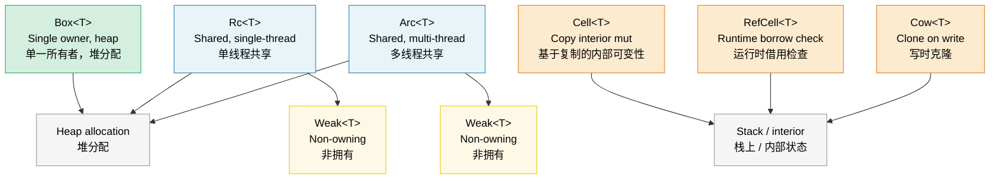

# 8. Smart Pointers and Interior Mutability 🟡<br><span class="zh-inline"># 9. 智能指针与内部可变性 🟡</span>

> **What you'll learn:**<br><span class="zh-inline">**本章将学到什么：**</span>
> - Box, Rc, Arc for heap allocation and shared ownership<br><span class="zh-inline">如何使用 `Box`、`Rc`、`Arc` 做堆分配与共享所有权</span>
> - Weak references for breaking Rc/Arc reference cycles<br><span class="zh-inline">如何用 `Weak` 打破 `Rc`、`Arc` 的引用环</span>
> - Cell, RefCell, and Cow for interior mutability patterns<br><span class="zh-inline">如何用 `Cell`、`RefCell` 和 `Cow` 组织内部可变性模式</span>
> - Pin for self-referential types and ManuallyDrop for lifecycle control<br><span class="zh-inline">如何用 `Pin` 处理自引用类型，以及如何用 `ManuallyDrop` 控制生命周期</span>

## Box, Rc, Arc — Heap Allocation and Sharing<br><span class="zh-inline">`Box`、`Rc`、`Arc`：堆分配与共享</span>

```rust
// --- Box<T>: Single owner, heap allocation ---
let boxed: Box<i32> = Box::new(42);
println!("{}", *boxed);

enum List<T> {
    Cons(T, Box<List<T>>),
    Nil,
}

let writer: Box<dyn std::io::Write> = Box::new(std::io::stdout());

// --- Rc<T>: Multiple owners, single-threaded ---
use std::rc::Rc;

let a = Rc::new(vec![1, 2, 3]);
let b = Rc::clone(&a);
let c = Rc::clone(&a);
println!("Ref count: {}", Rc::strong_count(&a));

// --- Arc<T>: Multiple owners, thread-safe ---
use std::sync::Arc;

let shared = Arc::new(String::from("shared data"));
let handles: Vec<_> = (0..5).map(|_| {
    let shared = Arc::clone(&shared);
    std::thread::spawn(move || println!("{shared}"))
}).collect();
for h in handles { h.join().unwrap(); }
```

`Box<T>` is the simplest smart pointer: one owner, heap storage, no reference counting. `Rc<T>` adds shared ownership inside a single thread. `Arc<T>` does the same thing with atomic reference counting so it is safe to share across threads.<br><span class="zh-inline">`Box&lt;T&gt;` 是最朴素的智能指针：单一所有者、数据放堆上、没有引用计数。`Rc&lt;T&gt;` 在单线程里提供共享所有权。`Arc&lt;T&gt;` 则把这个能力扩展到多线程，通过原子引用计数保证线程安全。</span>

### Weak References — Breaking Reference Cycles<br><span class="zh-inline">弱引用：打破引用环</span>

`Rc` and `Arc` rely on reference counting, so they cannot reclaim cycles by themselves. `Weak<T>` is the non-owning counterpart used for back-references, caches, and parent pointers.<br><span class="zh-inline">`Rc` 和 `Arc` 靠的是引用计数，所以它们没法自己回收环。`Weak&lt;T&gt;` 就是它们的非拥有版本，专门拿来做回指、缓存和父指针这类关系。</span>

```rust
use std::rc::{Rc, Weak};
use std::cell::RefCell;

struct Node {
    value: i32,
    parent: RefCell<Weak<Node>>,
    children: RefCell<Vec<Rc<Node>>>,
}
```

**Rule of thumb**: Ownership edges use `Rc` or `Arc`; back-edges and observational references use `Weak`.<br><span class="zh-inline">**经验法则**：真正拥有对象的边，用 `Rc` 或 `Arc`；回指关系、观察性引用和缓存句柄，用 `Weak`。</span>

### Cell and RefCell — Interior Mutability<br><span class="zh-inline">`Cell` 与 `RefCell`：内部可变性</span>

Sometimes code needs to mutate state through `&self`. Rust normally forbids that, so the standard library offers interior mutability wrappers that move the checking strategy from compile time to runtime or to simple copy-based operations.<br><span class="zh-inline">有时候代码确实需要在拿着 `&self` 的情况下修改状态。Rust 平常会禁止这种事，所以标准库专门提供了内部可变性包装器，把检查方式从纯编译期规则，切换成运行时检查或简单的拷贝式更新。</span>

```rust
use std::cell::{Cell, RefCell};

struct Counter {
    count: Cell<u32>,
}

impl Counter {
    fn new() -> Self { Counter { count: Cell::new(0) } }

    fn increment(&self) {
        self.count.set(self.count.get() + 1);
    }
}

struct Cache {
    data: RefCell<Vec<String>>,
}
```

`Cell<T>` works best for `Copy` data or swap-style updates. `RefCell<T>` works for any type, but borrow rules are enforced at runtime, which means violations become panics instead of compiler errors.<br><span class="zh-inline">`Cell&lt;T&gt;` 最适合 `Copy` 数据，或者那种整体替换值的场景。`RefCell&lt;T&gt;` 对任意类型都能用，但借用规则变成了运行时检查，因此一旦违反规则，代价就是 panic，而不是编译期报错。</span>

> **Cell vs RefCell**: `Cell` never panics from borrowing because it does not hand out references; it just copies or swaps values. `RefCell` can panic if immutable and mutable borrows overlap at runtime.<br><span class="zh-inline">**`Cell` 和 `RefCell` 的区别**：`Cell` 不会因为借用规则而 panic，因为它根本不把引用交出去，它只是在内部做复制或替换。`RefCell` 会把引用借出来，所以一旦可变借用和不可变借用在运行时冲突，就会 panic。</span>

### Cow — Clone on Write<br><span class="zh-inline">`Cow`：写时克隆</span>

`Cow` stores either borrowed data or owned data, and it only clones when mutation becomes necessary.<br><span class="zh-inline">`Cow` 可以存借来的数据，也可以存自己拥有的数据，而且只有在确实需要修改时才会触发克隆。</span>

```rust
use std::borrow::Cow;

fn normalize(input: &str) -> Cow<'_, str> {
    if input.contains('\t') {
        Cow::Owned(input.replace('\t', "    "))
    } else {
        Cow::Borrowed(input)
    }
}
```

This is great for hot paths where most inputs already satisfy the desired format, but a few need cleanup.<br><span class="zh-inline">它特别适合那种“绝大多数输入本来就合格，只有少量输入需要额外修正”的热点路径。</span>

#### `Cow<'_, [u8]>` for Binary Data<br><span class="zh-inline">二进制数据里的 `Cow&lt;'_, [u8]&gt;`</span>

The same idea works for byte buffers:<br><span class="zh-inline">同样的思路也很适合字节缓冲区：</span>

```rust
use std::borrow::Cow;

fn pad_frame(frame: &[u8], min_len: usize) -> Cow<'_, [u8]> {
    if frame.len() >= min_len {
        Cow::Borrowed(frame)
    } else {
        let mut padded = frame.to_vec();
        padded.resize(min_len, 0x00);
        Cow::Owned(padded)
    }
}
```

### When to Use Which Pointer<br><span class="zh-inline">各种指针什么时候用</span>

| Pointer<br><span class="zh-inline">指针</span> | Owner Count<br><span class="zh-inline">所有者数量</span> | Thread-Safe<br><span class="zh-inline">线程安全</span> | Mutability<br><span class="zh-inline">可变性</span> | Use When<br><span class="zh-inline">适用场景</span> |
|---------|:-----------:|:-----------:|:----------:|----------|
| `Box<T>` | 1 | ✅（if `T: Send`） | Via `&mut` | Heap allocation, trait objects, recursive types<br><span class="zh-inline">堆分配、trait object、递归类型</span> |
| `Rc<T>` | N | ❌ | None by itself | Shared ownership in one thread<br><span class="zh-inline">单线程共享所有权</span> |
| `Arc<T>` | N | ✅ | None by itself | Shared ownership across threads<br><span class="zh-inline">多线程共享所有权</span> |
| `Cell<T>` | — | ❌ | `.get()` / `.set()` | Interior mutability for `Copy` types<br><span class="zh-inline">`Copy` 类型的内部可变性</span> |
| `RefCell<T>` | — | ❌ | Runtime borrow checking | Interior mutability for arbitrary single-threaded data<br><span class="zh-inline">单线程任意类型的内部可变性</span> |
| `Cow<'_, T>` | 0 or 1 | ✅（if `T: Send`） | Clone on write | Avoid allocation when mutation is rare<br><span class="zh-inline">修改不常发生时减少分配</span> |

### Pin and Self-Referential Types<br><span class="zh-inline">`Pin` 与自引用类型</span>

`Pin<P>` exists to promise that a value will not be moved after it has been pinned. That is essential for self-referential structs and for async futures that may store references into their own state machines.<br><span class="zh-inline">`Pin&lt;P&gt;` 的意义是：一旦值被 pin 住，就承诺之后不再移动它。这对于自引用结构体，以及那些会把引用存进自身状态机里的 async future，都是关键前提。</span>

```rust
use std::pin::Pin;
use std::marker::PhantomPinned;

struct SelfRef {
    data: String,
    ptr: *const String,
    _pin: PhantomPinned,
}
```

**Key concepts**:<br><span class="zh-inline">**关键概念：**</span>

| Concept<br><span class="zh-inline">概念</span> | Meaning<br><span class="zh-inline">含义</span> |
|--------|--------|
| `Unpin` | Moving this type is safe<br><span class="zh-inline">移动它是安全的</span> |
| `!Unpin` / `PhantomPinned` | This type must stay put<br><span class="zh-inline">这个类型必须保持地址稳定</span> |
| `Pin<&mut T>` | Mutable access without moving<br><span class="zh-inline">可变访问，但不能移动</span> |
| `Pin<Box<T>>` | Heap-pinned owned value<br><span class="zh-inline">固定在堆上的拥有型值</span> |

Most application code does not touch `Pin` directly because async runtimes handle it. It mainly matters when implementing futures manually or designing low-level self-referential abstractions.<br><span class="zh-inline">多数业务代码其实碰不到 `Pin`，因为 async 运行时已经把这件事代劳了。它主要在手写 future，或者设计底层自引用抽象时才会真正跳到台前。</span>

### Pin Projections — Structural Pinning<br><span class="zh-inline">Pin 投影：结构性固定</span>

Once a whole struct is pinned, accessing its fields becomes subtle. Some fields are logically pinned and must stay in place; others are normal data and can be treated as ordinary mutable references. This is exactly what pin projection is about.<br><span class="zh-inline">一旦整个结构体被 pin 住，字段访问就会变得微妙。有些字段在逻辑上也必须跟着一起固定，有些字段则只是普通数据，依然可以按普通可变引用来处理。pin projection 解决的就是这件事。</span>

The `pin-project` crate is the practical answer for most codebases because it generates the projection boilerplate correctly and safely.<br><span class="zh-inline">对大多数代码库来说，`pin-project` 基本就是最实用的答案，因为它能把这些投影样板代码安全地自动生成出来。</span>

### Drop Ordering and ManuallyDrop<br><span class="zh-inline">析构顺序与 `ManuallyDrop`</span>

Rust's drop order is deterministic:
locals drop in reverse declaration order, while struct fields drop in declaration order.<br><span class="zh-inline">Rust 的析构顺序是确定的：局部变量按声明的逆序释放，结构体字段按声明顺序释放。</span>

`ManuallyDrop<T>` suppresses automatic destruction so that low-level code can decide the exact moment when cleanup runs.<br><span class="zh-inline">`ManuallyDrop&lt;T&gt;` 则是用来阻止自动析构，让底层代码自己决定资源到底在什么时候清理。</span>

```rust
use std::mem::ManuallyDrop;

struct TwoPhaseBuffer {
    data: ManuallyDrop<Vec<u8>>,
    committed: bool,
}
```

This is rarely needed in ordinary application code, but it becomes important in unions, unsafe abstractions, and custom lifecycle management.<br><span class="zh-inline">这玩意儿在普通业务代码里很少需要，但在 union、unsafe 抽象和需要手工控制生命周期的底层代码里就会变得很重要。</span>

> **Key Takeaways — Smart Pointers**<br><span class="zh-inline">**本章要点 — 智能指针**</span>
> - `Box` handles single-owner heap allocation; `Rc` and `Arc` handle shared ownership in single-threaded and multi-threaded settings.<br><span class="zh-inline">`Box` 负责单一所有者的堆分配；`Rc` 和 `Arc` 分别负责单线程和多线程下的共享所有权。</span>
> - `Weak` is how reference-counted graphs avoid memory leaks from cycles.<br><span class="zh-inline">`Weak` 是引用计数图结构避免环形泄漏的关键工具。</span>
> - `Cell` and `RefCell` provide interior mutability, but `RefCell` moves borrow checking to runtime.<br><span class="zh-inline">`Cell` 和 `RefCell` 提供内部可变性，而 `RefCell` 是把借用检查挪到了运行时。</span>
> - `Cow` helps avoid unnecessary allocation, `Pin` helps avoid invalid movement, and `ManuallyDrop` helps control destruction precisely.<br><span class="zh-inline">`Cow` 用来避免不必要分配，`Pin` 用来避免非法移动，`ManuallyDrop` 用来精确控制析构时机。</span>

> **See also:** [Ch 6 — Concurrency](ch06-concurrency-vs-parallelism-vs-threads.md) for `Arc + Mutex` patterns, and [Ch 4 — PhantomData](ch04-phantomdata-types-that-carry-no-data.md) for the relationship between phantom data and ownership semantics.<br><span class="zh-inline">**延伸阅读：** 想看 `Arc + Mutex` 的并发组合，可以看 [第 6 章：并发](ch06-concurrency-vs-parallelism-vs-threads.md)；想看 phantom data 和所有权语义的关系，可以看 [第 4 章：PhantomData](ch04-phantomdata-types-that-carry-no-data.md)。</span>



---

### Exercise: Reference-Counted Graph ★★ (~30 min)<br><span class="zh-inline">练习：引用计数图结构 ★★（约 30 分钟）</span>

Build a directed graph using `Rc<RefCell<Node>>` where each node has a name and a list of children. Create a cycle using `Weak` to break the back-edge, and verify with `Rc::strong_count` that the graph does not leak.<br><span class="zh-inline">使用 `Rc&lt;RefCell&lt;Node&gt;&gt;` 构造一个有向图。每个节点都有名字和子节点列表。用 `Weak` 构造回边并打破引用环，再通过 `Rc::strong_count` 验证没有泄漏。</span>

<details>
<summary>🔑 Solution<br><span class="zh-inline">🔑 参考答案</span></summary>

```rust
use std::cell::RefCell;
use std::rc::{Rc, Weak};

struct Node {
    name: String,
    children: Vec<Rc<RefCell<Node>>>,
    back_ref: Option<Weak<RefCell<Node>>>,
}

impl Node {
    fn new(name: &str) -> Rc<RefCell<Self>> {
        Rc::new(RefCell::new(Node {
            name: name.to_string(),
            children: Vec::new(),
            back_ref: None,
        }))
    }
}
```

</details>

***
