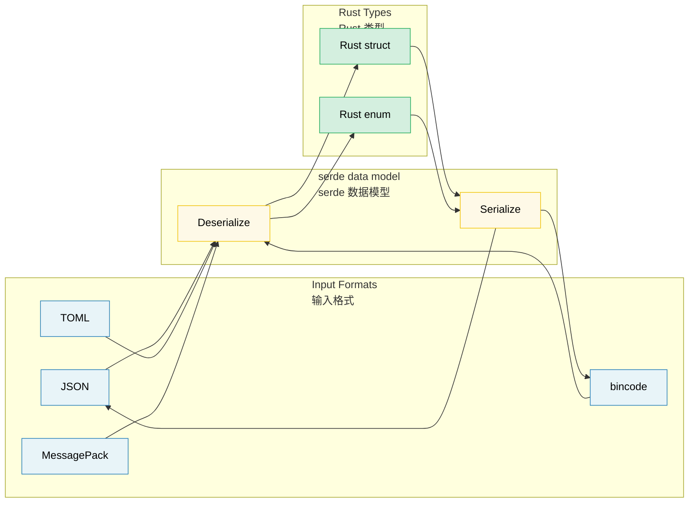

# 11. Serialization, Zero-Copy, and Binary Data 🟡<br><span class="zh-inline"># 11. 序列化、零拷贝与二进制数据 🟡</span>

> **What you'll learn:**<br><span class="zh-inline">**本章将学到什么：**</span>
> - serde fundamentals: derive macros, attributes, and enum representations<br><span class="zh-inline">`serde` 的基础：derive 宏、属性和枚举表示方式</span>
> - Zero-copy deserialization for high-performance read-heavy workloads<br><span class="zh-inline">面向高读负载场景的零拷贝反序列化</span>
> - The serde format ecosystem (JSON, TOML, bincode, MessagePack)<br><span class="zh-inline">`serde` 生态里的各种格式：JSON、TOML、bincode、MessagePack 等</span>
> - Binary data handling with `repr(C)`, `zerocopy`, and `bytes::Bytes`<br><span class="zh-inline">如何用 `repr(C)`、`zerocopy` 和 `bytes::Bytes` 处理二进制数据</span>

## serde Fundamentals<br><span class="zh-inline">`serde` 基础</span>

`serde` (SERialize/DEserialize) is the universal serialization framework for Rust. It separates the **data model** from the **format**:<br><span class="zh-inline">`serde` 是 Rust 世界里几乎通用的序列化框架。它把**数据模型**和**数据格式**这两件事拆开了：</span>

```rust,ignore
use serde::{Serialize, Deserialize};

#[derive(Debug, Serialize, Deserialize)]
struct ServerConfig {
    name: String,
    port: u16,
    #[serde(default)]
    max_connections: usize,
    #[serde(skip_serializing_if = "Option::is_none")]
    tls_cert_path: Option<String>,
}

fn main() -> Result<(), Box<dyn std::error::Error>> {
    let json_input = r#"{
        "name": "hw-diag",
        "port": 8080
    }"#;
    let config: ServerConfig = serde_json::from_str(json_input)?;
    println!("{config:?}");

    let output = serde_json::to_string_pretty(&config)?;
    println!("{output}");

    let toml_input = r#"
        name = "hw-diag"
        port = 8080
    "#;
    let config: ServerConfig = toml::from_str(toml_input)?;
    println!("{config:?}");

    Ok(())
}
```

> **Key insight**: Derive `Serialize` and `Deserialize` once, and the same struct immediately works with every serde-compatible format.<br><span class="zh-inline">**关键点**：一个结构体只要把 `Serialize` 和 `Deserialize` derive 上，立刻就能接入所有兼容 `serde` 的格式。</span>

### Common serde Attributes<br><span class="zh-inline">常见 `serde` 属性</span>

serde provides a lot of control through container and field attributes:<br><span class="zh-inline">`serde` 可以通过容器级和字段级属性做非常细的控制：</span>

```rust,ignore
use serde::{Serialize, Deserialize};

#[derive(Serialize, Deserialize)]
#[serde(rename_all = "camelCase")]
#[serde(deny_unknown_fields)]
struct DiagResult {
    test_name: String,
    pass_count: u32,
    fail_count: u32,
}

#[derive(Serialize, Deserialize)]
struct Sensor {
    #[serde(rename = "sensor_id")]
    id: u64,

    #[serde(default)]
    enabled: bool,

    #[serde(default = "default_threshold")]
    threshold: f64,

    #[serde(skip)]
    cached_value: Option<f64>,

    #[serde(skip_serializing_if = "Vec::is_empty")]
    tags: Vec<String>,

    #[serde(flatten)]
    metadata: Metadata,

    #[serde(with = "hex_bytes")]
    raw_data: Vec<u8>,
}

fn default_threshold() -> f64 { 1.0 }

#[derive(Serialize, Deserialize)]
struct Metadata {
    vendor: String,
    model: String,
}
```

**Most-used attributes cheat sheet**:<br><span class="zh-inline">**最常用属性速查：**</span>

| Attribute<br><span class="zh-inline">属性</span> | Level<br><span class="zh-inline">层级</span> | Effect<br><span class="zh-inline">作用</span> |
|-----------|-------|--------|
| `rename_all = "camelCase"` | Container<br><span class="zh-inline">容器级</span> | Rename all fields to a target naming convention<br><span class="zh-inline">统一改字段命名风格</span> |
| `deny_unknown_fields` | Container | Error on unexpected keys<br><span class="zh-inline">遇到额外字段直接报错</span> |
| `default` | Field<br><span class="zh-inline">字段级</span> | Use `Default::default()` when missing<br><span class="zh-inline">缺失时使用默认值</span> |
| `rename = "..."` | Field | Custom serialized name<br><span class="zh-inline">自定义字段名</span> |
| `skip` | Field | Exclude from ser/de entirely<br><span class="zh-inline">序列化和反序列化都跳过</span> |
| `skip_serializing_if = "fn"` | Field | Conditionally skip on serialize<br><span class="zh-inline">按条件跳过序列化</span> |
| `flatten` | Field | Inline nested fields<br><span class="zh-inline">把嵌套结构拍平</span> |
| `with = "module"` | Field | Use custom ser/de module<br><span class="zh-inline">指定自定义序列化模块</span> |
| `alias = "..."` | Field | Accept alternative names when deserializing<br><span class="zh-inline">反序列化时接受别名</span> |
| `untagged` | Enum | Match enum variants by shape<br><span class="zh-inline">按数据形状匹配枚举变体</span> |

### Enum Representations<br><span class="zh-inline">枚举表示方式</span>

serde provides four common enum representations in formats like JSON:<br><span class="zh-inline">在 JSON 这类格式里，`serde` 常见的枚举表示方式主要有四种：</span>

```rust,ignore
use serde::{Serialize, Deserialize};

#[derive(Serialize, Deserialize)]
enum Command {
    Reboot,
    RunDiag { test_name: String, timeout_secs: u64 },
    SetFanSpeed(u8),
}

#[derive(Serialize, Deserialize)]
#[serde(tag = "type")]
enum Event {
    Start { timestamp: u64 },
    Error { code: i32, message: String },
    End   { timestamp: u64, success: bool },
}

#[derive(Serialize, Deserialize)]
#[serde(tag = "t", content = "c")]
enum Payload {
    Text(String),
    Binary(Vec<u8>),
}

#[derive(Serialize, Deserialize)]
#[serde(untagged)]
enum StringOrNumber {
    Str(String),
    Num(f64),
}
```

> **Which representation to choose**: Internally tagged enums are usually the best default for JSON APIs. `untagged` is powerful, but it relies on variant matching order and can become ambiguous fast.<br><span class="zh-inline">**怎么选**：对 JSON API 来说，带内部标签的枚举通常是最稳妥的默认方案。`untagged` 虽然灵活，但它依赖变体匹配顺序，复杂一点就容易歪。</span>

### Zero-Copy Deserialization<br><span class="zh-inline">零拷贝反序列化</span>

serde can deserialize borrowed data directly from the input buffer, avoiding extra string allocations:<br><span class="zh-inline">`serde` 可以直接从输入缓冲区里借用数据做反序列化，省掉额外的字符串分配：</span>

```rust,ignore
use serde::Deserialize;

#[derive(Deserialize)]
struct OwnedRecord {
    name: String,
    value: String,
}

#[derive(Deserialize)]
struct BorrowedRecord<'a> {
    name: &'a str,
    value: &'a str,
}

fn main() {
    let input = r#"{"name": "cpu_temp", "value": "72.5"}"#;

    let owned: OwnedRecord = serde_json::from_str(input).unwrap();
    let borrowed: BorrowedRecord = serde_json::from_str(input).unwrap();

    println!("{}: {}", borrowed.name, borrowed.value);
}
```

**When to use zero-copy**:<br><span class="zh-inline">**什么时候该用零拷贝：**</span>
- Parsing large files where only part of the data is used<br><span class="zh-inline">解析大文件，但只关心其中一部分字段</span>
- High-throughput pipelines such as packets or log streams<br><span class="zh-inline">高吞吐数据管线，比如网络包、日志流</span>
- The input buffer is guaranteed to live long enough<br><span class="zh-inline">输入缓冲区的生命周期本身就够长</span>

**When not to use zero-copy**:<br><span class="zh-inline">**什么时候别硬上零拷贝：**</span>
- Input buffers are short-lived or will be reused immediately<br><span class="zh-inline">输入缓冲区寿命很短，或者很快会被复用</span>
- Results need to outlive the source buffer<br><span class="zh-inline">结果对象需要活得比源缓冲区更久</span>
- Fields need transformation or normalization<br><span class="zh-inline">字段需要额外变换、转义或规范化</span>

> **Practical tip**: `Cow<'a, str>` is often the sweet spot — borrow when possible, allocate when necessary.<br><span class="zh-inline">**实战建议**：`Cow&lt;'a, str&gt;` 经常是个折中神器，能借用时就借用，必须分配时再分配。</span>

### The Format Ecosystem<br><span class="zh-inline">格式生态</span>

| Format<br><span class="zh-inline">格式</span> | Crate | Human-Readable<br><span class="zh-inline">人类可读</span> | Size<br><span class="zh-inline">体积</span> | Speed<br><span class="zh-inline">速度</span> | Use Case<br><span class="zh-inline">适用场景</span> |
|--------|-------|:--------------:|:----:|:-----:|----------|
| JSON | `serde_json` | ✅ | Large<br><span class="zh-inline">偏大</span> | Good<br><span class="zh-inline">不错</span> | Config, REST, logging<br><span class="zh-inline">配置、REST、日志</span> |
| TOML | `toml` | ✅ | Medium | Good | Config files<br><span class="zh-inline">配置文件</span> |
| YAML | `serde_yaml` | ✅ | Medium | Good | Nested config<br><span class="zh-inline">复杂嵌套配置</span> |
| bincode | `bincode` | ❌ | Small | Fast | Rust-to-Rust IPC, cache<br><span class="zh-inline">Rust 内部 IPC、缓存</span> |
| postcard | `postcard` | ❌ | Tiny | Very fast | Embedded, `no_std`<br><span class="zh-inline">嵌入式、`no_std`</span> |
| MessagePack | `rmp-serde` | ❌ | Small | Fast | Cross-language binary protocol<br><span class="zh-inline">跨语言二进制协议</span> |
| CBOR | `ciborium` | ❌ | Small | Fast | IoT, constrained systems<br><span class="zh-inline">IoT、受限系统</span> |

```rust
#[derive(serde::Serialize, serde::Deserialize, Debug)]
struct DiagConfig {
    name: String,
    tests: Vec<String>,
    timeout_secs: u64,
}
```

> **Choose your format**: Human-edited config usually wants TOML or JSON. Rust-to-Rust binary traffic likes `bincode`. Cross-language binary protocols often prefer MessagePack or CBOR. Embedded systems lean toward `postcard`.<br><span class="zh-inline">**怎么选格式**：人类要手改配置，就优先 TOML 或 JSON；Rust 内部二进制通信，`bincode` 很顺手；跨语言二进制协议更适合 MessagePack 或 CBOR；嵌入式环境则常常偏向 `postcard`。</span>

### Binary Data and `repr(C)`<br><span class="zh-inline">二进制数据与 `repr(C)`</span>

Low-level diagnostics often deal with binary protocols and hardware register layouts. Rust gives a few important tools for that job:<br><span class="zh-inline">底层诊断程序经常要直接面对二进制协议和硬件寄存器布局。Rust 在这方面有几样特别关键的工具：</span>

```rust
#[repr(C)]
#[derive(Debug, Clone, Copy)]
struct IpmiHeader {
    rs_addr: u8,
    net_fn_lun: u8,
    checksum: u8,
    rq_addr: u8,
    rq_seq_lun: u8,
    cmd: u8,
}

impl IpmiHeader {
    fn from_bytes(data: &[u8]) -> Option<Self> {
        if data.len() < std::mem::size_of::<Self>() {
            return None;
        }
        Some(IpmiHeader {
            rs_addr:     data[0],
            net_fn_lun:  data[1],
            checksum:    data[2],
            rq_addr:     data[3],
            rq_seq_lun:  data[4],
            cmd:         data[5],
        })
    }
}

#[repr(C, packed)]
#[derive(Debug, Clone, Copy)]
struct PcieCapabilityHeader {
    cap_id: u8,
    next_cap: u8,
    cap_reg: u16,
}
```

`repr(C)` gives a predictable C-like layout. `repr(C, packed)` removes padding, but comes with alignment hazards, so field references must be handled very carefully.<br><span class="zh-inline">`repr(C)` 会给出更可预测、接近 C 的内存布局。`repr(C, packed)` 会进一步去掉填充，但也会带来对齐风险，所以字段引用必须非常小心。</span>

### `zerocopy` and `bytemuck` — Safe Transmutation Helpers<br><span class="zh-inline">`zerocopy` 和 `bytemuck`：更安全的位级转换帮手</span>

Instead of leaning on raw `unsafe` transmute, these crates prove more invariants at compile time:<br><span class="zh-inline">比起直接上生猛的 `unsafe transmute`，这些 crate 会在编译期多帮忙验证一些关键不变量：</span>

```rust
use zerocopy::{FromBytes, IntoBytes, KnownLayout, Immutable};

#[derive(FromBytes, IntoBytes, KnownLayout, Immutable, Debug)]
#[repr(C)]
struct SensorReading {
    sensor_id: u16,
    flags: u8,
    _reserved: u8,
    value: u32,
}

use bytemuck::{Pod, Zeroable};

#[derive(Pod, Zeroable, Clone, Copy, Debug)]
#[repr(C)]
struct GpuRegister {
    address: u32,
    value: u32,
}
```

| Approach<br><span class="zh-inline">方式</span> | Safety<br><span class="zh-inline">安全性</span> | Overhead<br><span class="zh-inline">开销</span> | Use When<br><span class="zh-inline">适用场景</span> |
|----------|:------:|:--------:|----------|
| Manual parsing<br><span class="zh-inline">手工按字段解析</span> | ✅ | Copy fields<br><span class="zh-inline">需要复制字段</span> | Small structs, odd layouts<br><span class="zh-inline">小结构体、复杂布局</span> |
| `zerocopy` | ✅ | Zero-copy | Big buffers, strict layout checks<br><span class="zh-inline">大缓冲区、严格布局检查</span> |
| `bytemuck` | ✅ | Zero-copy | Simple `Pod` types<br><span class="zh-inline">简单 `Pod` 类型</span> |
| `unsafe transmute` | ❌ | Zero-copy | Last resort only<br><span class="zh-inline">最后兜底，尽量别碰</span> |

### `bytes::Bytes` — Reference-Counted Buffers<br><span class="zh-inline">`bytes::Bytes`：引用计数缓冲区</span>

The `bytes` crate is popular in async and network stacks because it supports cheap cloning and zero-copy slicing:<br><span class="zh-inline">`bytes` crate 在异步和网络栈里特别常见，因为它支持廉价克隆和零拷贝切片：</span>

```rust
use bytes::{Bytes, BytesMut, Buf, BufMut};

fn main() {
    let mut buf = BytesMut::with_capacity(1024);
    buf.put_u8(0x01);
    buf.put_u16(0x1234);
    buf.put_slice(b"hello");

    let data: Bytes = buf.freeze();
    let data2 = data.clone();   // cheap clone
    let slice = data.slice(3..8); // zero-copy sub-slice

    let mut reader = &data[..];
    let byte = reader.get_u8();
    let short = reader.get_u16();

    let mut original = Bytes::from_static(b"HEADER\x00PAYLOAD");
    let header = original.split_to(6);

    println!("{:?} {:?} {:?}", byte, short, slice);
    println!("{:?} {:?}", &header[..], &original[..]);
}
```

| Feature<br><span class="zh-inline">能力</span> | `Vec<u8>` | `Bytes` |
|---------|-----------|---------|
| Clone cost<br><span class="zh-inline">克隆开销</span> | O(n) deep copy<br><span class="zh-inline">深拷贝</span> | O(1) refcount bump<br><span class="zh-inline">只加引用计数</span> |
| Sub-slicing<br><span class="zh-inline">子切片</span> | Borrowed slice<br><span class="zh-inline">借用切片</span> | Owned shared slice<br><span class="zh-inline">共享所有权切片</span> |
| Thread safety<br><span class="zh-inline">线程安全</span> | Needs extra wrapping<br><span class="zh-inline">通常还得包一层</span> | `Send + Sync` ready |
| Ecosystem fit<br><span class="zh-inline">生态适配</span> | Standard library | tokio / hyper / tonic / axum |

> **When to use `Bytes`**: It shines when one incoming buffer needs to be split, cloned, and handed to multiple components without copying the payload over and over again.<br><span class="zh-inline">**什么时候该用 `Bytes`**：最适合那种“收到一大块缓冲区后，要切成几段、克隆几份，再交给多个组件继续处理”的场景，因为它能避免一遍又一遍地复制载荷数据。</span>

> **Key Takeaways — Serialization & Binary Data**<br><span class="zh-inline">**本章要点 — 序列化与二进制数据**</span>
> - `serde` 的 derive 宏可以覆盖绝大多数日常场景，剩余细节再靠属性微调<br><span class="zh-inline">`serde` 的 derive 宏可以覆盖绝大多数日常场景，剩余细节再靠属性微调</span>
> - 零拷贝反序列化适合高读负载，但前提是输入缓冲区寿命足够长<br><span class="zh-inline">零拷贝反序列化适合高读负载，但前提是输入缓冲区寿命足够长</span>
> - `repr(C)`、`zerocopy`、`bytemuck` 适合低层二进制布局处理；`Bytes` 适合共享缓冲区<br><span class="zh-inline">`repr(C)`、`zerocopy`、`bytemuck` 适合低层二进制布局处理；`Bytes` 适合共享缓冲区</span>

> **See also:** [Ch 10 — Error Handling](ch10-error-handling-patterns.md) for integrating serde errors, and [Ch 12 — Unsafe Rust](ch12-unsafe-rust-controlled-danger.md) for `repr(C)` and low-level layout concerns.<br><span class="zh-inline">**延伸阅读：** 想看 `serde` 错误怎么整合进错误系统，可以看 [第 10 章：错误处理](ch10-error-handling-patterns.md)；想看 `repr(C)` 和底层布局的更多细节，可以看 [第 12 章：Unsafe Rust](ch12-unsafe-rust-controlled-danger.md)。</span>



---

### Exercise: Custom serde Deserialization ★★★ (~45 min)<br><span class="zh-inline">练习：自定义 `serde` 反序列化 ★★★（约 45 分钟）</span>

Design a `HumanDuration` wrapper that deserializes from strings like `"30s"`, `"5m"`, `"2h"` and serializes back to the same style.<br><span class="zh-inline">设计一个 `HumanDuration` 包装类型，让它能从 `"30s"`、`"5m"`、`"2h"` 这种字符串反序列化出来，并且还能再序列化回同样的格式。</span>

<details>
<summary>🔑 Solution<br><span class="zh-inline">🔑 参考答案</span></summary>

```rust,ignore
use serde::{Deserialize, Deserializer, Serialize, Serializer};
use std::fmt;

#[derive(Debug, Clone, PartialEq)]
struct HumanDuration(std::time::Duration);

impl HumanDuration {
    fn from_str(s: &str) -> Result<Self, String> {
        let s = s.trim();
        if s.is_empty() { return Err("empty duration string".into()); }

        let (num_str, suffix) = s.split_at(
            s.find(|c: char| !c.is_ascii_digit()).unwrap_or(s.len())
        );
        let value: u64 = num_str.parse()
            .map_err(|_| format!("invalid number: {num_str}"))?;

        let duration = match suffix {
            "s" | "sec"  => std::time::Duration::from_secs(value),
            "m" | "min"  => std::time::Duration::from_secs(value * 60),
            "h" | "hr"   => std::time::Duration::from_secs(value * 3600),
            "ms"         => std::time::Duration::from_millis(value),
            other        => return Err(format!("unknown suffix: {other}")),
        };
        Ok(HumanDuration(duration))
    }
}

impl fmt::Display for HumanDuration {
    fn fmt(&self, f: &mut fmt::Formatter<'_>) -> fmt::Result {
        let secs = self.0.as_secs();
        if secs == 0 {
            write!(f, "{}ms", self.0.as_millis())
        } else if secs % 3600 == 0 {
            write!(f, "{}h", secs / 3600)
        } else if secs % 60 == 0 {
            write!(f, "{}m", secs / 60)
        } else {
            write!(f, "{}s", secs)
        }
    }
}
```

</details>

***
