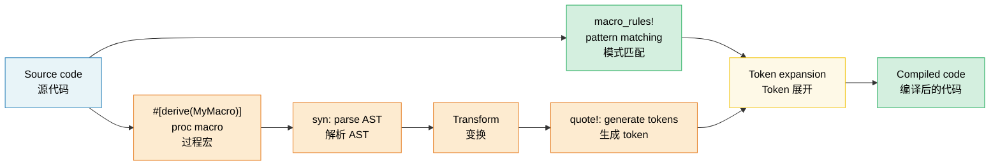

# 12. Macros — Code That Writes Code 🟡<br><span class="zh-inline"># 12. 宏：生成代码的代码 🟡</span>

> **What you'll learn:**<br><span class="zh-inline">**本章将学到什么：**</span>
> - Declarative macros (`macro_rules!`) with pattern matching and repetition<br><span class="zh-inline">如何使用 `macro_rules!` 编写带模式匹配和重复规则的声明式宏</span>
> - When macros are the right tool vs generics/traits<br><span class="zh-inline">什么时候该用宏，什么时候该用泛型或 trait</span>
> - Procedural macros: derive, attribute, and function-like<br><span class="zh-inline">过程宏的三种形态：derive、attribute 和函数式宏</span>
> - Writing a custom derive macro with `syn` and `quote`<br><span class="zh-inline">如何借助 `syn` 与 `quote` 编写自定义 derive 宏</span>

## Declarative Macros (`macro_rules!`)<br><span class="zh-inline">声明式宏 `macro_rules!`</span>

Macros match patterns on syntax and expand to code at compile time:<br><span class="zh-inline">宏会对语法模式做匹配，并在编译期把它们展开成代码：</span>

```rust
// A simple macro that creates a HashMap
macro_rules! hashmap {
    // Match: key => value pairs separated by commas
    ( $( $key:expr => $value:expr ),* $(,)? ) => {
        {
            let mut map = std::collections::HashMap::new();
            $( map.insert($key, $value); )*
            map
        }
    };
}

let scores = hashmap! {
    "Alice" => 95,
    "Bob" => 87,
    "Carol" => 92,
};
// Expands to:
// let mut map = HashMap::new();
// map.insert("Alice", 95);
// map.insert("Bob", 87);
// map.insert("Carol", 92);
// map
```

**Macro fragment types**:<br><span class="zh-inline">**宏片段类型：**</span>

| Fragment<br><span class="zh-inline">片段</span> | Matches<br><span class="zh-inline">匹配内容</span> | Example<br><span class="zh-inline">示例</span> |
|----------|---------|---------|
| `$x:expr` | Any expression<br><span class="zh-inline">任意表达式</span> | `42`, `a + b`, `foo()` |
| `$x:ty` | A type<br><span class="zh-inline">一个类型</span> | `i32`, `Vec<String>` |
| `$x:ident` | An identifier<br><span class="zh-inline">一个标识符</span> | `my_var`, `Config` |
| `$x:pat` | A pattern<br><span class="zh-inline">一个模式</span> | `Some(x)`, `_` |
| `$x:stmt` | A statement<br><span class="zh-inline">一条语句</span> | `let x = 5;` |
| `$x:tt` | A single token tree<br><span class="zh-inline">单个 token tree</span> | Anything (most flexible)<br><span class="zh-inline">几乎什么都行，最灵活</span> |
| `$x:literal` | A literal value<br><span class="zh-inline">字面量</span> | `42`, `"hello"`, `true` |

**Repetition**: `$( ... ),*` means "zero or more, comma-separated"<br><span class="zh-inline">**重复规则**：`$( ... ),*` 的意思是“零个或多个，用逗号分隔”。</span>

```rust
// Generate test functions automatically
macro_rules! test_cases {
    ( $( $name:ident: $input:expr => $expected:expr ),* $(,)? ) => {
        $(
            #[test]
            fn $name() {
                assert_eq!(process($input), $expected);
            }
        )*
    };
}

test_cases! {
    test_empty: "" => "",
    test_hello: "hello" => "HELLO",
    test_trim: "  spaces  " => "SPACES",
}
// Generates three separate #[test] functions
```

### When (Not) to Use Macros<br><span class="zh-inline">什么时候该用宏，什么时候别用</span>

**Use macros when**:<br><span class="zh-inline">**下面这些情况适合用宏：**</span>
- Reducing boilerplate that traits/generics can't handle (variadic arguments, DRY test generation)<br><span class="zh-inline">想消除 trait、泛型搞不定的样板代码，例如可变参数、批量生成测试</span>
- Creating DSLs (`html!`, `sql!`, `vec!`)<br><span class="zh-inline">要构造 DSL，比如 `html!`、`sql!`、`vec!`</span>
- Conditional code generation (`cfg!`, `compile_error!`)<br><span class="zh-inline">需要按条件生成代码，例如 `cfg!`、`compile_error!`</span>

**Don't use macros when**:<br><span class="zh-inline">**下面这些情况最好别用宏：**</span>
- A function or generic would work (macros are harder to debug, autocomplete doesn't help)<br><span class="zh-inline">函数或泛型就能搞定，因为宏更难调试，自动补全也帮不上太多忙</span>
- You need type checking inside the macro (macros operate on tokens, not types)<br><span class="zh-inline">宏内部需要类型检查，因为宏操作的是 token，不是类型系统</span>
- The pattern is used once or twice (not worth the abstraction cost)<br><span class="zh-inline">模式只出现一两次，抽象成本反而更高</span>

```rust
// ❌ Unnecessary macro — a function works fine:
macro_rules! double {
    ($x:expr) => { $x * 2 };
}

// ✅ Just use a function:
fn double(x: i32) -> i32 { x * 2 }

// ✅ Good macro use — variadic, can't be a function:
macro_rules! println {
    ($($arg:tt)*) => { /* format string + args */ };
}
```

The usual rule is simple: prefer functions and traits until syntax itself becomes the problem. Macros shine when the call-site shape matters more than the runtime behavior.<br><span class="zh-inline">经验规则很简单：先优先考虑函数和 trait，只有当“调用语法本身”成了问题时，再把宏搬出来。宏真正擅长的是塑造调用形式，而不是替代普通逻辑封装。</span>

### Procedural Macros Overview<br><span class="zh-inline">过程宏总览</span>

Procedural macros are Rust functions that transform token streams. They require a separate crate with `proc-macro = true`:<br><span class="zh-inline">过程宏本质上是“接收 token stream、再吐回 token stream”的 Rust 函数。它们必须放在单独的 crate 里，并开启 `proc-macro = true`：</span>

```rust
// Three types of proc macros:

// 1. Derive macros — #[derive(MyTrait)]
// Generate trait implementations from struct definitions
#[derive(Debug, Clone, Serialize, Deserialize)]
struct Config {
    name: String,
    port: u16,
}

// 2. Attribute macros — #[my_attribute]
// Transform the annotated item
#[route(GET, "/api/users")]
async fn list_users() -> Json<Vec<User>> { /* ... */ }

// 3. Function-like macros — my_macro!(...)
// Custom syntax
let query = sql!(SELECT * FROM users WHERE id = ?);
```

### Derive Macros in Practice<br><span class="zh-inline">Derive 宏在实战中的样子</span>

The most common proc macro type. Here's how `#[derive(Debug)]` works conceptually:<br><span class="zh-inline">最常见的过程宏就是 derive。下面用概念化的方式看看 `#[derive(Debug)]` 干了什么：</span>

```rust
// Input (your struct):
#[derive(Debug)]
struct Point {
    x: f64,
    y: f64,
}

// The derive macro generates:
impl std::fmt::Debug for Point {
    fn fmt(&self, f: &mut std::fmt::Formatter<'_>) -> std::fmt::Result {
        f.debug_struct("Point")
            .field("x", &self.x)
            .field("y", &self.y)
            .finish()
    }
}
```

**Commonly used derive macros**:<br><span class="zh-inline">**常见 derive 宏：**</span>

| Derive | Crate | What It Generates<br><span class="zh-inline">生成内容</span> |
|--------|-------|-------------------|
| `Debug` | std | `fmt::Debug` impl (debug printing)<br><span class="zh-inline">调试打印实现</span> |
| `Clone`, `Copy` | std | Value duplication<br><span class="zh-inline">值复制能力</span> |
| `PartialEq`, `Eq` | std | Equality comparison<br><span class="zh-inline">相等性比较</span> |
| `Hash` | std | Hashing for HashMap keys<br><span class="zh-inline">为 `HashMap` 键提供哈希能力</span> |
| `Serialize`, `Deserialize` | serde | JSON/YAML/etc. encoding<br><span class="zh-inline">JSON、YAML 等序列化能力</span> |
| `Error` | thiserror | `std::error::Error` + `Display` |
| `Parser` | `clap` | CLI argument parsing<br><span class="zh-inline">命令行参数解析</span> |
| `Builder` | derive_builder | Builder pattern<br><span class="zh-inline">Builder 模式</span> |

> **Practical advice**: Use derive macros liberally — they remove a lot of error-prone boilerplate. Writing custom proc macros is an advanced topic, so it usually makes sense to rely on mature libraries such as `serde`, `thiserror`, and `clap` before inventing your own.<br><span class="zh-inline">**实战建议**：derive 宏可以放心多用，它们能消掉大量容易写错的样板代码。至于自定义过程宏，那就属于进阶内容了；在自己造轮子之前，通常先把 `serde`、`thiserror`、`clap` 这些成熟库吃透更划算。</span>

### Macro Hygiene and `$crate`<br><span class="zh-inline">宏卫生与 `$crate`</span>

**Hygiene** means identifiers created inside a macro do not accidentally collide with names in the caller's scope. Rust's `macro_rules!` is partially hygienic:<br><span class="zh-inline">**宏卫生** 指的是：宏内部生成的标识符，别莫名其妙和调用方作用域里的名字撞在一起。Rust 的 `macro_rules!` 属于“部分卫生”：</span>

```rust
macro_rules! make_var {
    () => {
        let x = 42; // This 'x' is in the MACRO's scope
    };
}

fn main() {
    let x = 10;
    make_var!();   // Creates a different 'x' (hygienic)
    println!("{x}"); // Prints 10, not 42 — macro's x doesn't leak
}
```

**`$crate`**: When writing macros in a library, use `$crate` to refer to your own crate. It resolves correctly regardless of how downstream users rename the dependency:<br><span class="zh-inline">**`$crate`**：在库里写宏时，要用 `$crate` 引用当前 crate。这样无论下游用户怎么给依赖改名，它都能解析正确：</span>

```rust
// In my_diagnostics crate:

pub fn log_result(msg: &str) {
    println!("[diag] {msg}");
}

#[macro_export]
macro_rules! diag_log {
    ($($arg:tt)*) => {
        // ✅ $crate always resolves to my_diagnostics, even if the user
        // renamed the crate in their Cargo.toml
        $crate::log_result(&format!($($arg)*))
    };
}

// ❌ Without $crate:
// my_diagnostics::log_result(...)  ← breaks if user writes:
//   [dependencies]
//   diag = { package = "my_diagnostics", version = "1" }
```

> **Rule**: Always use `$crate::` inside `#[macro_export]` macros. Never hard-code your crate name there.<br><span class="zh-inline">**规则**：凡是 `#[macro_export]` 导出的宏，内部引用本 crate 时一律写 `$crate::`，别把 crate 名字硬编码进去。</span>

### Recursive Macros and `tt` Munching<br><span class="zh-inline">递归宏与 `tt` munching</span>

Recursive macros can process input one token tree at a time; this technique is often called **`tt` munching**:<br><span class="zh-inline">递归宏可以一次吃掉一部分 token tree，再继续递归处理剩下的输入。这套技巧通常就叫 **`tt` munching**：</span>

```rust
// Count the number of expressions passed to the macro
macro_rules! count {
    // Base case: no tokens left
    () => { 0usize };
    // Recursive case: consume one expression, count the rest
    ($head:expr $(, $tail:expr)* $(,)?) => {
        1usize + count!($($tail),*)
    };
}

fn main() {
    let n = count!("a", "b", "c", "d");
    assert_eq!(n, 4);

    // Works at compile time too:
    const N: usize = count!(1, 2, 3);
    assert_eq!(N, 3);
}
```

```rust
// Build a heterogeneous tuple from a list of expressions:
macro_rules! tuple_from {
    // Base: single element
    ($single:expr $(,)?) => { ($single,) };
    // Recursive: first element + rest
    ($head:expr, $($tail:expr),+ $(,)?) => {
        ($head, tuple_from!($($tail),+))
    };
}

let t = tuple_from!(1, "hello", 3.14, true);
// Expands to: (1, ("hello", (3.14, (true,))))
```

**Fragment specifier subtleties**:<br><span class="zh-inline">**片段说明符里的细节坑：**</span>

| Fragment<br><span class="zh-inline">片段</span> | Gotcha<br><span class="zh-inline">注意点</span> |
|----------|--------|
| `$x:expr` | Greedily parses — `1 + 2` is ONE expression, not three tokens<br><span class="zh-inline">会贪婪匹配，`1 + 2` 会被当成一个表达式，而不是三个 token</span> |
| `$x:ty` | Greedily parses — `Vec<String>` is one type; can't be followed by `+` or `<`<br><span class="zh-inline">同样会贪婪匹配，`Vec&lt;String&gt;` 算一个完整类型，后面不能随便再接 `+` 或 `<`</span> |
| `$x:tt` | Matches exactly ONE token tree — most flexible, least checked<br><span class="zh-inline">精确匹配一个 token tree，最灵活，但约束也最少</span> |
| `$x:ident` | Only plain identifiers — not paths like `std::io`<br><span class="zh-inline">只匹配纯标识符，像 `std::io` 这种路径不算</span> |
| `$x:pat` | In Rust 2021, matches `A \| B` patterns; use `$x:pat_param` for single patterns<br><span class="zh-inline">在 Rust 2021 里会匹配 `A \| B` 这种模式；如果只想要单个模式，改用 `$x:pat_param`</span> |

> **When to use `tt`**: Reach for `tt` when tokens need to be forwarded to another macro without being constrained by the parser. `$($args:tt)*` is the classic “accept anything” pattern used by macros such as `println!`, `format!`, and `vec!`.<br><span class="zh-inline">**什么时候该用 `tt`**：当 token 需要原封不动转交给另一个宏，而又不想提前被解析器限制时，就该上 `tt`。`$($args:tt)*` 就是那种经典的“来啥都接”写法，`println!`、`format!`、`vec!` 都常这么干。</span>

### Writing a Derive Macro with `syn` and `quote`<br><span class="zh-inline">用 `syn` 与 `quote` 写一个 derive 宏</span>

Derive macros live in a separate crate (`proc-macro = true`) and usually follow a pipeline of parsing with `syn` and generating code with `quote`:<br><span class="zh-inline">derive 宏必须放在单独的 `proc-macro` crate 里，典型流程是：先用 `syn` 解析，再用 `quote` 生成代码：</span>

```toml
# my_derive/Cargo.toml
[lib]
proc-macro = true

[dependencies]
syn = { version = "2", features = ["full"] }
quote = "1"
proc-macro2 = "1"
```

```rust
// my_derive/src/lib.rs
use proc_macro::TokenStream;
use quote::quote;
use syn::{parse_macro_input, DeriveInput};

/// Derive macro that generates a `describe()` method
/// returning the struct name and field names.
#[proc_macro_derive(Describe)]
pub fn derive_describe(input: TokenStream) -> TokenStream {
    let input = parse_macro_input!(input as DeriveInput);
    let name = &input.ident;
    let name_str = name.to_string();

    // Extract field names (only for structs with named fields)
    let fields = match &input.data {
        syn::Data::Struct(data) => {
            data.fields.iter()
                .filter_map(|f| f.ident.as_ref())
                .map(|id| id.to_string())
                .collect::<Vec<_>>()
        }
        _ => vec![],
    };

    let field_list = fields.join(", ");

    let expanded = quote! {
        impl #name {
            pub fn describe() -> String {
                format!("{} {{ {} }}", #name_str, #field_list)
            }
        }
    };

    TokenStream::from(expanded)
}
```

```rust
// In the application crate:
use my_derive::Describe;

#[derive(Describe)]
struct SensorReading {
    sensor_id: u16,
    value: f64,
    timestamp: u64,
}

fn main() {
    println!("{}", SensorReading::describe());
    // "SensorReading { sensor_id, value, timestamp }"
}
```

**The workflow**: `TokenStream` → `syn::parse` → inspect/transform → `quote!` → `TokenStream` back to the compiler.<br><span class="zh-inline">**工作流**：`TokenStream` 原始 token → `syn::parse` 解析成 AST → 检查或变换 → `quote!` 重新生成 token → 再交回编译器。</span>

| Crate | Role<br><span class="zh-inline">角色</span> | Key types<br><span class="zh-inline">关键类型</span> |
|-------|------|-----------|
| `proc-macro` | Compiler interface<br><span class="zh-inline">编译器接口</span> | `TokenStream` |
| `syn` | Parse Rust source into AST<br><span class="zh-inline">把 Rust 源码解析成 AST</span> | `DeriveInput`, `ItemFn`, `Type` |
| `quote` | Generate Rust tokens from templates<br><span class="zh-inline">从模板生成 Rust token</span> | `quote!{}`, `#variable` interpolation |
| `proc-macro2` | Bridge between syn/quote and proc-macro<br><span class="zh-inline">在 `syn`、`quote` 与 `proc-macro` 之间做桥接</span> | `TokenStream`, `Span` |

> **Practical tip**: Before writing a custom derive, read the source of a simple crate such as `thiserror` or `derive_more`. Also keep `cargo expand` handy — it shows the exact expansion result and saves a huge amount of guessing.<br><span class="zh-inline">**实战提示**：在真正自己写 derive 宏之前，先看看 `thiserror`、`derive_more` 这类相对简单的实现源码。再配上 `cargo expand` 一起用，能直接看到宏展开结果，省掉一大堆瞎猜。</span>

> **Key Takeaways — Macros**<br><span class="zh-inline">**本章要点 — 宏**</span>
> - `macro_rules!` for straightforward code generation; proc macros (`syn` + `quote`) for more complex transforms<br><span class="zh-inline">简单代码生成适合 `macro_rules!`；复杂变换则交给过程宏加 `syn`、`quote`</span>
> - Prefer generics and traits when they solve the problem cleanly — macros are harder to debug and maintain<br><span class="zh-inline">如果泛型和 trait 已经能优雅解决问题，就优先用它们；宏的调试和维护成本更高</span>
> - `$crate` keeps exported macros robust, and `tt` munching is the core recursive trick<br><span class="zh-inline">`$crate` 能让导出宏更稳，`tt` munching 则是递归宏的核心技巧</span>

> **See also:** [Ch 2 — Traits](ch02-traits-in-depth.md) for when traits and generics beat macros. [Ch 13 — Testing](ch13-testing-and-benchmarking-patterns.md) for testing code generated by macros.<br><span class="zh-inline">**延伸阅读：** 想判断 trait、泛型何时比宏更合适，可以看 [第 2 章：Trait](ch02-traits-in-depth.md)；想看宏生成代码怎么测，可以看 [第 13 章：测试](ch13-testing-and-benchmarking-patterns.md)。</span>



---

### Exercise: Declarative Macro — `map!` ★ (~15 min)<br><span class="zh-inline">练习：声明式宏 `map!` ★（约 15 分钟）</span>

Write a `map!` macro that creates a `HashMap` from key-value pairs:<br><span class="zh-inline">写一个 `map!` 宏，用键值对创建 `HashMap`：</span>

```rust,ignore
let m = map! {
    "host" => "localhost",
    "port" => "8080",
};
assert_eq!(m.get("host"), Some(&"localhost"));
```

Requirements: support trailing comma and empty invocation `map!{}`.<br><span class="zh-inline">要求：支持结尾逗号，并支持空调用 `map!{}`。</span>

<details>
<summary>🔑 Solution<br><span class="zh-inline">🔑 参考答案</span></summary>

```rust
macro_rules! map {
    () => { std::collections::HashMap::new() };
    ( $( $key:expr => $val:expr ),+ $(,)? ) => {{
        let mut m = std::collections::HashMap::new();
        $( m.insert($key, $val); )+
        m
    }};
}

fn main() {
    let config = map! {
        "host" => "localhost",
        "port" => "8080",
        "timeout" => "30",
    };
    assert_eq!(config.len(), 3);
    assert_eq!(config["host"], "localhost");

    let empty: std::collections::HashMap<String, String> = map!();
    assert!(empty.is_empty());

    let scores = map! { 1 => 100, 2 => 200 };
    assert_eq!(scores[&1], 100);
}
```

</details>

***
