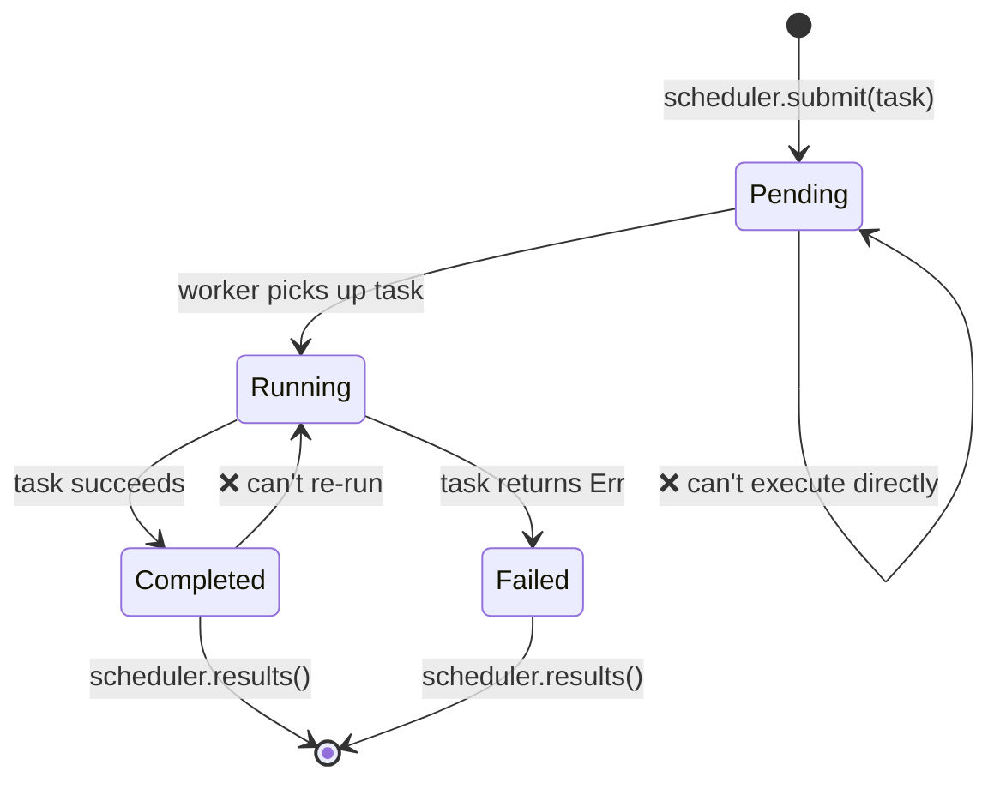

# Capstone Project: Type-Safe Task Scheduler<br><span class="zh-inline">综合项目：类型安全的任务调度器</span>

This project integrates patterns from across the book into a single, production-style system. You'll build a **type-safe, concurrent task scheduler** that uses generics, traits, typestate, channels, error handling, and testing.<br><span class="zh-inline">这个项目会把整本书里前面讲过的模式串成一个更接近生产风格的系统。目标是做出一个**类型安全、支持并发的任务调度器**，把泛型、trait、typestate、channel、错误处理和测试一次性揉进来。</span>

**Estimated time**: 4–6 hours | **Difficulty**: ★★★<br><span class="zh-inline">**预估耗时：** 4 到 6 小时 | **难度：** ★★★</span>

> **What you'll practice:**<br><span class="zh-inline">**这一章会练到的内容：**</span>
> - Generics and trait bounds (Ch 1–2)<br><span class="zh-inline">泛型与 trait 约束（第 1 到 2 章）</span>
> - Typestate pattern for task lifecycle (Ch 3)<br><span class="zh-inline">任务生命周期对应的 typestate 模式（第 3 章）</span>
> - PhantomData for zero-cost state markers (Ch 4)<br><span class="zh-inline">用 `PhantomData` 表达零成本状态标记（第 4 章）</span>
> - Channels for worker communication (Ch 5)<br><span class="zh-inline">worker 之间的 channel 通信（第 5 章）</span>
> - Concurrency with scoped threads (Ch 6)<br><span class="zh-inline">基于 scoped thread 的并发（第 6 章）</span>
> - Error handling with `thiserror` (Ch 9)<br><span class="zh-inline">用 `thiserror` 组织错误处理（第 9 章）</span>
> - Testing with property-based tests (Ch 13)<br><span class="zh-inline">基于性质的测试（第 13 章）</span>
> - API design with `TryFrom` and validated types (Ch 14)<br><span class="zh-inline">通过 `TryFrom` 和校验类型组织 API（第 14 章）</span>

## The Problem<br><span class="zh-inline">问题定义</span>

Build a task scheduler where:<br><span class="zh-inline">要构建一个任务调度器，满足下面这些条件：</span>

1. **Tasks** have a typed lifecycle: `Pending → Running → Completed` (or `Failed`)<br><span class="zh-inline">1. **任务** 拥有带类型的生命周期：`Pending → Running → Completed`，或者失败进入 `Failed`。</span>
2. **Workers** pull tasks from a channel, execute them, and report results<br><span class="zh-inline">2. **worker** 从 channel 拉任务、执行任务、再回报结果。</span>
3. The **scheduler** manages task submission, worker coordination, and result collection<br><span class="zh-inline">3. **scheduler** 负责提交任务、协调 worker，以及收集结果。</span>
4. Invalid state transitions are **compile-time errors**<br><span class="zh-inline">4. 非法状态转换必须在**编译期**报错。</span>



这张图其实已经把整个项目的灵魂画出来了：调度器不只是“把任务丢给线程跑一跑”，而是要把任务生命周期本身建模成类型系统能看懂的东西。<br><span class="zh-inline">也就是说，设计重点不只是并发执行，更在于让“错误状态转换根本写不出来”。</span>

## Step 1: Define the Task Types<br><span class="zh-inline">步骤 1：先把任务类型定义出来</span>

Start with the typestate markers and a generic `Task`:<br><span class="zh-inline">先从 typestate 标记和一个泛型 `Task` 类型开始：</span>

```rust
use std::marker::PhantomData;

// --- State markers (zero-sized) ---
struct Pending;
struct Running;
struct Completed;
struct Failed;

// --- Task ID (newtype for type safety) ---
#[derive(Debug, Clone, Copy, PartialEq, Eq, Hash)]
struct TaskId(u64);

// --- The Task struct, parameterized by lifecycle state ---
struct Task<State, R> {
    id: TaskId,
    name: String,
    _state: PhantomData<State>,
    _result: PhantomData<R>,
}
```

**Your job**: Implement state transitions so that:<br><span class="zh-inline">**练习目标：** 把状态转换实现出来，让它满足下面这些规则：</span>

- `Task<Pending, R>` can transition to `Task<Running, R>` (via `start()`)<br><span class="zh-inline">`Task<Pending, R>` 可以通过 `start()` 变成 `Task<Running, R>`。</span>
- `Task<Running, R>` can transition to `Task<Completed, R>` or `Task<Failed, R>`<br><span class="zh-inline">`Task<Running, R>` 可以变成 `Task<Completed, R>` 或 `Task<Failed, R>`。</span>
- No other transitions compile<br><span class="zh-inline">其他非法转换一律不允许通过编译。</span>

<details>
<summary>💡 Hint <span class="zh-inline">💡 提示</span></summary>

Each transition method should consume `self` and return the new state:<br><span class="zh-inline">每个状态转换方法都应该消费当前的 `self`，并返回新状态：</span>

```rust
impl<R> Task<Pending, R> {
    fn start(self) -> Task<Running, R> {
        Task {
            id: self.id,
            name: self.name,
            _state: PhantomData,
            _result: PhantomData,
        }
    }
}
```

</details>

这一部分是整个项目的类型系统骨架。先把骨架搭牢，后面 worker、channel、错误处理才有地方挂。<br><span class="zh-inline">如果这一步只是图省事搞成普通状态字段，后面的“类型安全调度器”基本就只剩个名头了。</span>

## Step 2: Define the Work Function<br><span class="zh-inline">步骤 2：定义任务执行体</span>

Tasks need a function to execute. Use a boxed closure:<br><span class="zh-inline">任务总得有点活要干，所以需要定义一个可执行函数体。这里用装箱闭包来表示：</span>

```rust
struct WorkItem<R: Send + 'static> {
    id: TaskId,
    name: String,
    work: Box<dyn FnOnce() -> Result<R, String> + Send>,
}
```

**Your job**: Implement `WorkItem::new()` that accepts a task name and closure. Add a `TaskId` generator (simple atomic counter or mutex-protected counter).<br><span class="zh-inline">**练习目标：** 实现 `WorkItem::new()`，让它能接收任务名和闭包；再补一个 `TaskId` 生成器，简单原子计数器或者带互斥的计数器都可以。</span>

这里的 `FnOnce()` 不是随便挑的。因为很多任务闭包会把自己捕获的值直接消耗掉，执行完就没了，用 `FnOnce` 正合适。<br><span class="zh-inline">另外 `Send + 'static` 也别嫌烦，这些约束是后面把任务安全送进 worker 线程池的前提。</span>

## Step 3: Error Handling<br><span class="zh-inline">步骤 3：错误处理</span>

Define the scheduler's error types using `thiserror`:<br><span class="zh-inline">给调度器定义一套像样的错误类型，推荐直接上 `thiserror`：</span>

```rust,ignore
use thiserror::Error;

#[derive(Error, Debug)]
pub enum SchedulerError {
    #[error("scheduler is shut down")]
    ShutDown,

    #[error("task {0:?} failed: {1}")]
    TaskFailed(TaskId, String),

    #[error("channel send error")]
    ChannelError(#[from] std::sync::mpsc::SendError<()>),

    #[error("worker panicked")]
    WorkerPanic,
}
```

这里别偷懒直接拿字符串糊一层。调度器一旦变成系统核心，错误就必须有结构。<br><span class="zh-inline">否则后面无论是日志、测试、监控还是调用方恢复策略，都会变得很别扭。</span>

## Step 4: The Scheduler<br><span class="zh-inline">步骤 4：实现调度器本体</span>

Build the scheduler using channels (Ch 5) and scoped threads (Ch 6):<br><span class="zh-inline">接下来用 channel 和 scoped thread 把调度器真正搭起来：</span>

```rust
use std::sync::mpsc;

struct Scheduler<R: Send + 'static> {
    sender: Option<mpsc::Sender<WorkItem<R>>>,
    results: mpsc::Receiver<TaskResult<R>>,
    num_workers: usize,
}

struct TaskResult<R> {
    id: TaskId,
    name: String,
    outcome: Result<R, String>,
}
```

**Your job**: Implement:<br><span class="zh-inline">**练习目标：** 把下面这些方法补齐：</span>

- `Scheduler::new(num_workers: usize) -> Self` — creates channels and spawns workers<br><span class="zh-inline">`Scheduler::new(num_workers: usize) -> Self`：创建 channel 并拉起 worker。</span>
- `Scheduler::submit(&self, item: WorkItem<R>) -> Result<TaskId, SchedulerError>`<br><span class="zh-inline">`Scheduler::submit(&self, item: WorkItem<R>) -> Result<TaskId, SchedulerError>`：提交任务。</span>
- `Scheduler::shutdown(self) -> Vec<TaskResult<R>>` — drops the sender, joins workers, collects results<br><span class="zh-inline">`Scheduler::shutdown(self) -> Vec<TaskResult<R>>`：关闭发送端、等待 worker 退出，并收集结果。</span>

<details>
<summary>💡 Hint — Worker loop <span class="zh-inline">💡 提示：worker 循环</span></summary>

```rust
fn worker_loop<R: Send + 'static>(
    rx: std::sync::Arc<std::sync::Mutex<mpsc::Receiver<WorkItem<R>>>>,
    result_tx: mpsc::Sender<TaskResult<R>>,
    worker_id: usize,
) {
    loop {
        let item = {
            let rx = rx.lock().unwrap();
            rx.recv()
        };
        match item {
            Ok(work_item) => {
                let outcome = (work_item.work)();
                let _ = result_tx.send(TaskResult {
                    id: work_item.id,
                    name: work_item.name,
                    outcome,
                });
            }
            Err(_) => break, // Channel closed
        }
    }
}
```

</details>

这里真正体现调度器设计水平的地方有两个：一是并发模型够不够清楚，二是停机过程够不够干净。<br><span class="zh-inline">任务投递、worker 取活、结果回传，这三条线如果没有明确边界，后面一测就容易爆出各种死锁和悬空状态。</span>

## Step 5: Integration Test<br><span class="zh-inline">步骤 5：集成测试</span>

Write tests that verify:<br><span class="zh-inline">写测试时，至少覆盖下面这些情况：</span>

1. **Happy path**: Submit 10 tasks, shut down, verify all 10 results are `Ok`<br><span class="zh-inline">1. **正常路径**：提交 10 个任务，关闭调度器后确认 10 个结果全是 `Ok`。</span>
2. **Error handling**: Submit tasks that fail, verify `TaskResult.outcome` is `Err`<br><span class="zh-inline">2. **错误处理**：提交会失败的任务，确认 `TaskResult.outcome` 里确实是 `Err`。</span>
3. **Empty scheduler**: Create and immediately shut down — no panics<br><span class="zh-inline">3. **空调度器**：创建后立刻关闭，不应该 panic。</span>
4. **Property test** (bonus): Use `proptest` to verify that for any N tasks (1..100), the scheduler always returns exactly N results<br><span class="zh-inline">4. **性质测试**（加分项）：用 `proptest` 验证对任意 1 到 100 个任务，调度器最终返回的结果数总是精确等于提交数。</span>

```rust
#[cfg(test)]
mod tests {
    use super::*;

    #[test]
    fn happy_path() {
        let scheduler = Scheduler::<String>::new(4);

        for i in 0..10 {
            let item = WorkItem::new(
                format!("task-{i}"),
                move || Ok(format!("result-{i}")),
            );
            scheduler.submit(item).unwrap();
        }

        let results = scheduler.shutdown();
        assert_eq!(results.len(), 10);
        for r in &results {
            assert!(r.outcome.is_ok());
        }
    }

    #[test]
    fn handles_failures() {
        let scheduler = Scheduler::<String>::new(2);

        scheduler.submit(WorkItem::new("good", || Ok("ok".into()))).unwrap();
        scheduler.submit(WorkItem::new("bad", || Err("boom".into()))).unwrap();

        let results = scheduler.shutdown();
        assert_eq!(results.len(), 2);

        let failures: Vec<_> = results.iter()
            .filter(|r| r.outcome.is_err())
            .collect();
        assert_eq!(failures.len(), 1);
    }
}
```

调度器这种东西，不测试基本等于没写完。因为它的问题常常不是“编译不过”，而是“并发时偶尔出错”“关闭时少收一个结果”“失败任务吞了没报”。<br><span class="zh-inline">这些毛病光靠肉眼看代码不一定能看全，测试必须补上。</span>

## Step 6: Put It All Together<br><span class="zh-inline">步骤 6：把系统真正跑起来</span>

Here's the `main()` that demonstrates the full system:<br><span class="zh-inline">最后用一个完整的 `main()` 把整个系统串起来：</span>

```rust,ignore
fn main() {
    let scheduler = Scheduler::<String>::new(4);

    // Submit tasks with varying workloads
    for i in 0..20 {
        let item = WorkItem::new(
            format!("compute-{i}"),
            move || {
                // Simulate work
                std::thread::sleep(std::time::Duration::from_millis(10));
                if i % 7 == 0 {
                    Err(format!("task {i} hit a simulated error"))
                } else {
                    Ok(format!("task {i} completed with value {}", i * i))
                }
            },
        );
        scheduler.submit(item).unwrap();
    }

    println!("All tasks submitted. Shutting down...");
    let results = scheduler.shutdown();

    let (ok, err): (Vec<_>, Vec<_>) = results.iter()
        .partition(|r| r.outcome.is_ok());

    println!("\n✅ Succeeded: {}", ok.len());
    for r in &ok {
        println!("  {} → {}", r.name, r.outcome.as_ref().unwrap());
    }

    println!("\n❌ Failed: {}", err.len());
    for r in &err {
        println!("  {} → {}", r.name, r.outcome.as_ref().unwrap_err());
    }
}
```

这段 `main()` 的意义，不只是演示“能跑”，而是把调度器从类型设计、任务投递、并发执行到结果分类全走一遍。<br><span class="zh-inline">做到这一步，这个项目就已经不是课堂玩具了，而是一套很像真实系统骨架的并发组件。</span>

## Evaluation Criteria<br><span class="zh-inline">评估标准</span>

| Criterion<br><span class="zh-inline">维度</span> | Target<br><span class="zh-inline">目标</span> |
|-----------|--------|
| Type safety<br><span class="zh-inline">类型安全</span> | Invalid state transitions don't compile<br><span class="zh-inline">非法状态转换不能通过编译</span> |
| Concurrency<br><span class="zh-inline">并发性</span> | Workers run in parallel, no data races<br><span class="zh-inline">worker 能并行工作，且没有数据竞争</span> |
| Error handling<br><span class="zh-inline">错误处理</span> | All failures captured in `TaskResult`, no panics<br><span class="zh-inline">所有失败都能落进 `TaskResult`，不能靠 panic 糊弄</span> |
| Testing<br><span class="zh-inline">测试</span> | At least 3 tests; bonus for proptest<br><span class="zh-inline">至少 3 条测试；用了 `proptest` 更好</span> |
| Code organization<br><span class="zh-inline">代码组织</span> | Clean module structure, public API uses validated types<br><span class="zh-inline">模块结构清晰，公开 API 使用校验过的类型</span> |
| Documentation<br><span class="zh-inline">文档</span> | Key types have doc comments explaining invariants<br><span class="zh-inline">关键类型有说明不变量的文档注释</span> |

## Extension Ideas<br><span class="zh-inline">扩展方向</span>

Once the basic scheduler works, try these enhancements:<br><span class="zh-inline">基础调度器跑起来之后，可以继续挑战下面这些增强项：</span>

1. **Priority queue**: Add a `Priority` newtype (1–10) and process higher-priority tasks first<br><span class="zh-inline">1. **优先级队列**：加一个 `Priority` newtype，让高优先级任务先执行。</span>
2. **Retry policy**: Failed tasks retry up to N times before being marked permanently failed<br><span class="zh-inline">2. **重试策略**：失败任务最多重试 N 次，再标记为最终失败。</span>
3. **Cancellation**: Add a `cancel(TaskId)` method that removes pending tasks<br><span class="zh-inline">3. **取消机制**：增加 `cancel(TaskId)`，把还没执行的任务移出队列。</span>
4. **Async version**: Port to `tokio::spawn` with `tokio::sync::mpsc` channels (Ch 15)<br><span class="zh-inline">4. **异步版本**：迁移到 `tokio::spawn` 和 `tokio::sync::mpsc`。</span>
5. **Metrics**: Track per-worker task counts, average execution time, and failure rates<br><span class="zh-inline">5. **指标统计**：记录每个 worker 的任务数、平均耗时和失败率。</span>

这一章本质上就是整本书的收官练兵。泛型、状态机、并发通信、错误模型、测试和 API 设计，全都得一起上。<br><span class="zh-inline">能把这个项目做顺，前面那些模式就算是真进脑子里了，而不是只停留在看例子时觉得“好像懂了”。</span>

***
