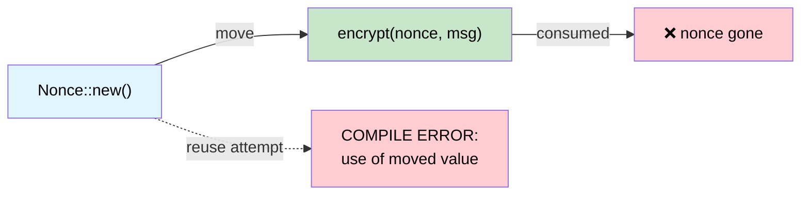

# Single-Use Types — Cryptographic Guarantees via Ownership 🟡

> **What you'll learn:** How Rust's move semantics act as a linear type system, making nonce reuse, double key-agreement, and accidental fuse re-programming impossible at compile time.
>
> **Cross-references:** [ch01](ch01-the-philosophy-why-types-beat-tests.md) (philosophy), [ch04](ch04-capability-tokens-zero-cost-proof-of-aut.md) (capability tokens), [ch05](ch05-protocol-state-machines-type-state-for-r.md) (type-state), [ch14](ch14-testing-type-level-guarantees.md) (testing compile-fail)

## The Nonce Reuse Catastrophe

In authenticated encryption (AES-GCM, ChaCha20-Poly1305), reusing a nonce with the
same key is **catastrophic** — it leaks the XOR of two plaintexts and often the
authentication key itself. This isn't a theoretical concern:

- **2016**: Forbidden Attack on AES-GCM in TLS — nonce reuse allowed plaintext recovery
- **2020**: Multiple IoT firmware update systems found reusing nonces due to poor RNG

In C/C++, a nonce is just a `uint8_t[12]`. Nothing prevents you from using it twice.

```c
// C — nothing stops nonce reuse
uint8_t nonce[12];
generate_nonce(nonce);
encrypt(key, nonce, msg1, out1);   // ✅ first use
encrypt(key, nonce, msg2, out2);   // 🐛 CATASTROPHIC: same nonce
```

## Move Semantics as Linear Types

Rust's ownership system is effectively a **linear type system** — a value can be used
exactly once (moved) unless it implements `Copy`. The `ring` crate exploits this:

```rust,ignore
// ring::aead::Nonce is:
// - NOT Clone
// - NOT Copy
// - Consumed by value when used
pub struct Nonce(/* private */);

impl Nonce {
    pub fn try_assume_unique_for_key(value: &[u8]) -> Result<Self, Unspecified> {
        // ...
    }
    // No Clone, no Copy — can only be used once
}
```

When you pass a `Nonce` to `seal_in_place()`, **it moves**:

```rust,ignore
// Pseudocode mirroring ring's API shape
fn seal_in_place(
    key: &SealingKey,
    nonce: Nonce,       // ← moved, not borrowed
    data: &mut Vec<u8>,
) -> Result<(), Error> {
    // ... encrypt data in place ...
    // nonce is consumed — cannot be used again
    Ok(())
}
```

Attempting to reuse it:

```rust,ignore
fn bad_encrypt(key: &SealingKey, data1: &mut Vec<u8>, data2: &mut Vec<u8>) {
    // .unwrap() is safe — a 12-byte array is always a valid nonce.
    let nonce = Nonce::try_assume_unique_for_key(&[0u8; 12]).unwrap();
    seal_in_place(key, nonce, data1).unwrap();  // ✅ nonce moved here
    // seal_in_place(key, nonce, data2).unwrap();
    //                    ^^^^^ ERROR: use of moved value ❌
}
```

The compiler **proves** that each nonce is used exactly once. No test required.

## Case Study: ring's Nonce

The `ring` crate goes further with `NonceSequence` — a trait that **generates**
nonces and is also non-cloneable:

```rust,ignore
/// A sequence of unique nonces.
/// Not Clone — once bound to a key, cannot be duplicated.
pub trait NonceSequence {
    fn advance(&mut self) -> Result<Nonce, Unspecified>;
}

/// SealingKey wraps a NonceSequence — each seal() auto-advances.
pub struct SealingKey<N: NonceSequence> {
    key: UnboundKey,   // consumed during construction
    nonce_seq: N,
}

impl<N: NonceSequence> SealingKey<N> {
    pub fn new(key: UnboundKey, nonce_seq: N) -> Self {
        // UnboundKey is moved — can't be used for both sealing AND opening
        SealingKey { key, nonce_seq }
    }

    pub fn seal_in_place_append_tag(
        &mut self,       // &mut — exclusive access
        aad: Aad<&[u8]>,
        in_out: &mut Vec<u8>,
    ) -> Result<(), Unspecified> {
        let nonce = self.nonce_seq.advance()?; // auto-generate unique nonce
        // ... encrypt with nonce ...
        Ok(())
    }
}
# pub struct UnboundKey;
# pub struct Aad<T>(T);
# pub struct Unspecified;
```

The ownership chain prevents:
1. **Nonce reuse** — `Nonce` is not `Clone`, consumed on each call
2. **Key duplication** — `UnboundKey` is moved into `SealingKey`, can't also make an `OpeningKey`
3. **Sequence duplication** — `NonceSequence` is not `Clone`, so no two keys share a counter

**None of these require runtime checks.** The compiler enforces all three.

## Case Study: Ephemeral Key Agreement

Ephemeral Diffie-Hellman keys must be used **exactly once** (that's what "ephemeral" means).
`ring` enforces this:

```rust,ignore
/// An ephemeral private key. Not Clone, not Copy.
/// Consumed by agree_ephemeral().
pub struct EphemeralPrivateKey { /* ... */ }

/// Compute shared secret — consumes the private key.
pub fn agree_ephemeral(
    my_private_key: EphemeralPrivateKey,  // ← moved
    peer_public_key: &UnparsedPublicKey,
    error_value: Unspecified,
    kdf: impl FnOnce(&[u8]) -> Result<SharedSecret, Unspecified>,
) -> Result<SharedSecret, Unspecified> {
    // ... DH computation ...
    // my_private_key is consumed — can never be reused
    # kdf(&[])
}
# pub struct UnparsedPublicKey;
# pub struct SharedSecret;
# pub struct Unspecified;
```

After calling `agree_ephemeral()`, the private key **no longer exists in memory**
(it's been dropped). A C++ developer would need to remember to `memset(key, 0, len)`
and hope the compiler doesn't optimise it away. In Rust, the key is simply gone.

## Hardware Application: One-Time Fuse Programming

Server platforms have **OTP (one-time programmable) fuses** for security keys,
board serial numbers, and feature bits. Writing a fuse is irreversible — doing it
twice with different data bricks the board. This is a perfect fit for move semantics:

```rust,ignore
use std::io;

/// A fuse write payload. Not Clone, not Copy.
/// Consumed when the fuse is programmed.
pub struct FusePayload {
    address: u32,
    data: Vec<u8>,
    // private constructor — only created via validated builder
}

/// Proof that the fuse programmer is in the correct state.
pub struct FuseController {
    /* hardware handle */
}

impl FuseController {
    /// Program a fuse — consumes the payload, preventing double-write.
    pub fn program(
        &mut self,
        payload: FusePayload,  // ← moved — can't be used twice
    ) -> io::Result<()> {
        // ... write to OTP hardware ...
        // payload is consumed — trying to program again with the same
        // payload is a compile error
        Ok(())
    }
}

/// Builder with validation — only way to create a FusePayload.
pub struct FusePayloadBuilder {
    address: Option<u32>,
    data: Option<Vec<u8>>,
}

impl FusePayloadBuilder {
    pub fn new() -> Self {
        FusePayloadBuilder { address: None, data: None }
    }

    pub fn address(mut self, addr: u32) -> Self {
        self.address = Some(addr);
        self
    }

    pub fn data(mut self, data: Vec<u8>) -> Self {
        self.data = Some(data);
        self
    }

    pub fn build(self) -> Result<FusePayload, &'static str> {
        let address = self.address.ok_or("address required")?;
        let data = self.data.ok_or("data required")?;
        if data.len() > 32 { return Err("fuse data too long"); }
        Ok(FusePayload { address, data })
    }
}

// Usage:
fn program_board_serial(ctrl: &mut FuseController) -> io::Result<()> {
    let payload = FusePayloadBuilder::new()
        .address(0x100)
        .data(b"SN12345678".to_vec())
        .build()
        .map_err(|e| io::Error::new(io::ErrorKind::InvalidInput, e))?;

    ctrl.program(payload)?;      // ✅ payload consumed

    // ctrl.program(payload);    // ❌ ERROR: use of moved value
    //              ^^^^^^^ value used after move

    Ok(())
}
```

## Hardware Application: Single-Use Calibration Token

Some sensors require a calibration step that must happen **exactly once** per power
cycle. A calibration token enforces this:

```rust,ignore
/// Issued once at power-on. Not Clone, not Copy.
pub struct CalibrationToken {
    _private: (),
}

pub struct SensorController {
    calibrated: bool,
}

impl SensorController {
    /// Called once at power-on — returns a calibration token.
    pub fn power_on() -> (Self, CalibrationToken) {
        (
            SensorController { calibrated: false },
            CalibrationToken { _private: () },
        )
    }

    /// Calibrate the sensor — consumes the token.
    pub fn calibrate(&mut self, _token: CalibrationToken) -> io::Result<()> {
        // ... run calibration sequence ...
        self.calibrated = true;
        Ok(())
    }

    /// Read a sensor — only meaningful after calibration.
    ///
    /// **Limitation:** The move-semantics guarantee is *partial*. The caller
    /// can `drop(cal_token)` without calling `calibrate()` — the token will
    /// be destroyed but calibration won't run. The `#[must_use]` annotation
    /// (see below) generates a warning but not a hard error.
    ///
    /// The runtime `self.calibrated` check here is the **safety net** for
    /// that gap. For a fully compile-time solution, see the type-state
    /// pattern in ch05 where `send_command()` only exists on `IpmiSession<Active>`.
    pub fn read(&self) -> io::Result<f64> {
        if !self.calibrated {
            return Err(io::Error::new(io::ErrorKind::Other, "not calibrated"));
        }
        Ok(25.0) // stub
    }
}

fn sensor_workflow() -> io::Result<()> {
    let (mut ctrl, cal_token) = SensorController::power_on();

    // Must use cal_token somewhere — it's not Copy, so dropping it
    // without consuming it generates a warning (or error with #[must_use])
    ctrl.calibrate(cal_token)?;

    // Now reads work:
    let temp = ctrl.read()?;
    println!("Temperature: {temp}°C");

    // Can't calibrate again — token was consumed:
    // ctrl.calibrate(cal_token);  // ❌ use of moved value

    Ok(())
}
```

### When to Use Single-Use Types

| Scenario | Use single-use (move) semantics? |
|----------|:------:|
| Cryptographic nonces | ✅ Always — nonce reuse is catastrophic |
| Ephemeral keys (DH, ECDH) | ✅ Always — reuse weakens forward secrecy |
| OTP fuse writes | ✅ Always — double-write bricks hardware |
| License activation codes | ✅ Usually — prevent double-activation |
| Calibration tokens | ✅ Usually — enforce once-per-session |
| File write handles | ⚠️ Sometimes — depends on protocol |
| Database transaction handles | ⚠️ Sometimes — commit/rollback is single-use |
| General data buffers | ❌ These need reuse — use `&mut [u8]` |

## Single-Use Ownership Flow



## Exercise: Single-Use Firmware Signing Token

Design a `SigningToken` that can be used exactly once to sign a firmware image:
- `SigningToken::issue(key_id: &str) -> SigningToken` (not Clone, not Copy)
- `sign(token: SigningToken, image: &[u8]) -> SignedImage` (consumes the token)
- Attempting to sign twice should be a compile error.

<details>
<summary>Solution</summary>

```rust,ignore
pub struct SigningToken {
    key_id: String,
    // NOT Clone, NOT Copy
}

pub struct SignedImage {
    pub signature: Vec<u8>,
    pub key_id: String,
}

impl SigningToken {
    pub fn issue(key_id: &str) -> Self {
        SigningToken { key_id: key_id.to_string() }
    }
}

pub fn sign(token: SigningToken, _image: &[u8]) -> SignedImage {
    // Token consumed by move — can't be reused
    SignedImage {
        signature: vec![0xDE, 0xAD],  // stub
        key_id: token.key_id,
    }
}

// ✅ Compiles:
// let tok = SigningToken::issue("release-key");
// let signed = sign(tok, &firmware_bytes);
//
// ❌ Compile error:
// let signed2 = sign(tok, &other_bytes);  // ERROR: use of moved value
```

</details>

## Key Takeaways

1. **Move = linear use** — a non-Clone, non-Copy type can be consumed exactly once; the compiler enforces this.
2. **Nonce reuse is catastrophic** — Rust's ownership system prevents it structurally, not by discipline.
3. **Pattern applies beyond crypto** — OTP fuses, calibration tokens, audit entries — anything that must happen at most once.
4. **Ephemeral keys get forward secrecy for free** — the key agreement value is moved into the derived secret and vanishes.
5. **When in doubt, remove `Clone`** — you can always add it later; removing it from a published API is a breaking change.

---

