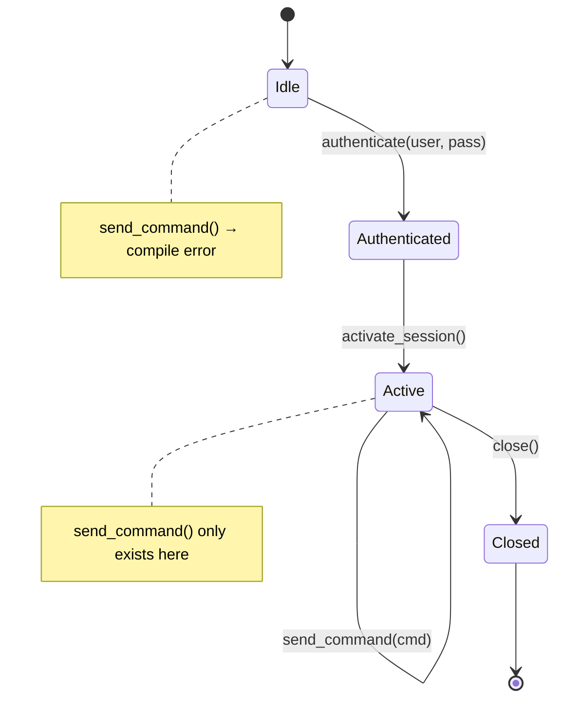
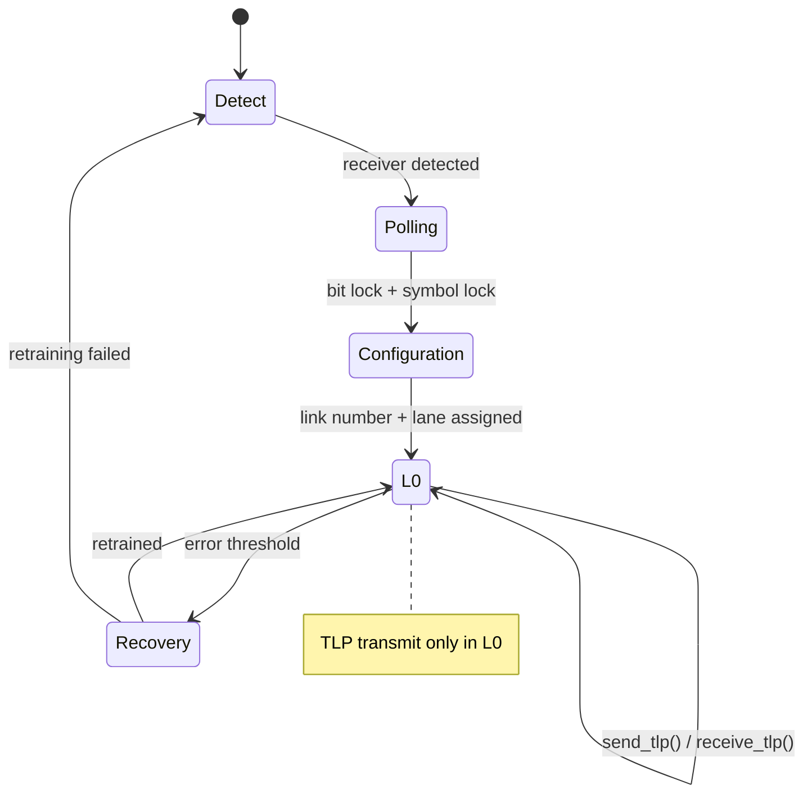
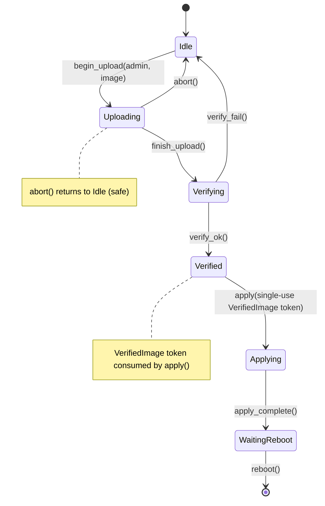

# Protocol State Machines — Type-State for Real Hardware 🔴

> **What you'll learn:** How type-state encoding makes protocol violations (wrong-order commands, use-after-close) into compile errors, applied to IPMI session lifecycles and PCIe link training.
>
> **Cross-references:** [ch01](ch01-the-philosophy-why-types-beat-tests.md) (level 2 — state correctness), [ch04](ch04-capability-tokens-zero-cost-proof-of-aut.md) (tokens), [ch09](ch09-phantom-types-for-resource-tracking.md) (phantom types), [ch11](ch11-fourteen-tricks-from-the-trenches.md) (trick 4 — typestate builder, trick 8 — async type-state)

## The Problem: Protocol Violations

Hardware protocols have **strict state machines**. An IPMI session has states:
Unauthenticated → Authenticated → Active → Closed. PCIe link training goes through
Detect → Polling → Configuration → L0. Sending a command in the wrong state
corrupts the session or hangs the bus.

**IPMI session state machine:**



**PCIe Link Training State Machine (LTSSM):**



In C/C++, state is tracked with an enum and runtime checks:

```c
typedef enum { IDLE, AUTHENTICATED, ACTIVE, CLOSED } session_state_t;

typedef struct {
    session_state_t state;
    uint32_t session_id;
    // ...
} ipmi_session_t;

int ipmi_send_command(ipmi_session_t *s, uint8_t cmd, uint8_t *data, int len) {
    if (s->state != ACTIVE) {        // runtime check — easy to forget
        return -EINVAL;
    }
    // ... send command ...
    return 0;
}
```

## Type-State Pattern

With type-state, each protocol state is a **distinct type**. Transitions are methods
that consume one state and return another. The compiler prevents calling methods in
the wrong state because **those methods don't exist on that type**.

```rust,ignore
use std::marker::PhantomData;

// States — zero-sized marker types
pub struct Idle;
## Case Study: IPMI Session Lifecycle

pub struct Authenticated;
pub struct Active;
pub struct Closed;

/// IPMI session parameterised by its current state.
/// The state exists ONLY in the type system (PhantomData is zero-sized).
pub struct IpmiSession<State> {
    transport: String,     // e.g., "192.168.1.100"
    session_id: Option<u32>,
    _state: PhantomData<State>,
}

// Transition: Idle → Authenticated
impl IpmiSession<Idle> {
    pub fn new(host: &str) -> Self {
        IpmiSession {
            transport: host.to_string(),
            session_id: None,
            _state: PhantomData,
        }
    }

    pub fn authenticate(
        self,              // ← consumes Idle session
        user: &str,
        pass: &str,
    ) -> Result<IpmiSession<Authenticated>, String> {
        println!("Authenticating {user} on {}", self.transport);
        Ok(IpmiSession {
            transport: self.transport,
            session_id: Some(42),
            _state: PhantomData,
        })
    }
}

// Transition: Authenticated → Active
impl IpmiSession<Authenticated> {
    pub fn activate(self) -> Result<IpmiSession<Active>, String> {
        // session_id is guaranteed Some by the type-state transition path.
        println!("Activating session {}", self.session_id.unwrap());
        Ok(IpmiSession {
            transport: self.transport,
            session_id: self.session_id,
            _state: PhantomData,
        })
    }
}

// Operations available ONLY in Active state
impl IpmiSession<Active> {
    pub fn send_command(&mut self, netfn: u8, cmd: u8, data: &[u8]) -> Vec<u8> {
        // session_id is guaranteed Some in Active state.
        println!("Sending cmd 0x{cmd:02X} on session {}", self.session_id.unwrap());
        vec![0x00] // stub: completion code OK
    }

    pub fn close(self) -> IpmiSession<Closed> {
        // session_id is guaranteed Some in Active state.
        println!("Closing session {}", self.session_id.unwrap());
        IpmiSession {
            transport: self.transport,
            session_id: None,
            _state: PhantomData,
        }
    }
}

fn ipmi_workflow() -> Result<(), String> {
    let session = IpmiSession::new("192.168.1.100");

    // session.send_command(0x04, 0x2D, &[]);
    //  ^^^^^^ ERROR: no method `send_command` on IpmiSession<Idle> ❌

    let session = session.authenticate("admin", "password")?;

    // session.send_command(0x04, 0x2D, &[]);
    //  ^^^^^^ ERROR: no method `send_command` on IpmiSession<Authenticated> ❌

    let mut session = session.activate()?;

    // ✅ NOW send_command exists:
    let response = session.send_command(0x04, 0x2D, &[1]);

    let _closed = session.close();

    // _closed.send_command(0x04, 0x2D, &[]);
    //  ^^^^^^ ERROR: no method `send_command` on IpmiSession<Closed> ❌

    Ok(())
}
```

**No runtime state checks anywhere.** The compiler enforces:
- Authentication before activation
- Activation before sending commands
- No commands after close

## PCIe Link Training State Machine

PCIe link training is a multi-phase protocol defined in the PCIe specification.
Type-state prevents sending data before the link is ready:

```rust,ignore
use std::marker::PhantomData;

// PCIe LTSSM states (simplified)
pub struct Detect;
pub struct Polling;
pub struct Configuration;
pub struct L0;         // fully operational
pub struct Recovery;

pub struct PcieLink<State> {
    slot: u32,
    width: u8,          // negotiated width (x1, x4, x8, x16)
    speed: u8,          // Gen1=1, Gen2=2, Gen3=3, Gen4=4, Gen5=5
    _state: PhantomData<State>,
}

impl PcieLink<Detect> {
    pub fn new(slot: u32) -> Self {
        PcieLink {
            slot, width: 0, speed: 0,
            _state: PhantomData,
        }
    }

    pub fn detect_receiver(self) -> Result<PcieLink<Polling>, String> {
        println!("Slot {}: receiver detected", self.slot);
        Ok(PcieLink {
            slot: self.slot, width: 0, speed: 0,
            _state: PhantomData,
        })
    }
}

impl PcieLink<Polling> {
    pub fn poll_compliance(self) -> Result<PcieLink<Configuration>, String> {
        println!("Slot {}: polling complete, entering configuration", self.slot);
        Ok(PcieLink {
            slot: self.slot, width: 0, speed: 0,
            _state: PhantomData,
        })
    }
}

impl PcieLink<Configuration> {
    pub fn negotiate(self, width: u8, speed: u8) -> Result<PcieLink<L0>, String> {
        println!("Slot {}: negotiated x{width} Gen{speed}", self.slot);
        Ok(PcieLink {
            slot: self.slot, width, speed,
            _state: PhantomData,
        })
    }
}

impl PcieLink<L0> {
    /// Send a TLP — only possible when the link is fully trained (L0).
    pub fn send_tlp(&mut self, tlp: &[u8]) -> Vec<u8> {
        println!("Slot {}: sending {} byte TLP", self.slot, tlp.len());
        vec![0x00] // stub
    }

    /// Enter recovery — returns to Recovery state.
    pub fn enter_recovery(self) -> PcieLink<Recovery> {
        PcieLink {
            slot: self.slot, width: self.width, speed: self.speed,
            _state: PhantomData,
        }
    }

    pub fn link_info(&self) -> String {
        format!("x{} Gen{}", self.width, self.speed)
    }
}

impl PcieLink<Recovery> {
    pub fn retrain(self, speed: u8) -> Result<PcieLink<L0>, String> {
        println!("Slot {}: retrained at Gen{speed}", self.slot);
        Ok(PcieLink {
            slot: self.slot, width: self.width, speed,
            _state: PhantomData,
        })
    }
}

fn pcie_workflow() -> Result<(), String> {
    let link = PcieLink::new(0);

    // link.send_tlp(&[0x01]);  // ❌ no method `send_tlp` on PcieLink<Detect>

    let link = link.detect_receiver()?;
    let link = link.poll_compliance()?;
    let mut link = link.negotiate(16, 5)?; // x16 Gen5

    // ✅ NOW we can send TLPs:
    let _resp = link.send_tlp(&[0x00, 0x01, 0x02]);
    println!("Link: {}", link.link_info());

    // Recovery and retrain:
    let recovery = link.enter_recovery();
    let mut link = recovery.retrain(4)?;  // downgrade to Gen4
    let _resp = link.send_tlp(&[0x03]);

    Ok(())
}
```

## Combining Type-State with Capability Tokens

Type-state and capability tokens compose naturally. A diagnostic that requires
an active IPMI session AND admin privileges:

```rust,ignore
# use std::marker::PhantomData;
# pub struct Active;
# pub struct AdminToken { _p: () }
# pub struct IpmiSession<S> { _s: PhantomData<S> }
# impl IpmiSession<Active> {
#     pub fn send_command(&mut self, _nf: u8, _cmd: u8, _d: &[u8]) -> Vec<u8> { vec![] }
# }

/// Run a firmware update — requires:
/// 1. Active IPMI session (type-state)
/// 2. Admin privileges (capability token)
pub fn firmware_update(
    session: &mut IpmiSession<Active>,   // proves session is active
    _admin: &AdminToken,                 // proves caller is admin
    image: &[u8],
) -> Result<(), String> {
    // No runtime checks needed — the signature IS the check
    session.send_command(0x2C, 0x01, image);
    Ok(())
}
```

The caller must:
1. Create a session (`Idle`)
2. Authenticate it (`Authenticated`)
3. Activate it (`Active`)
4. Obtain an `AdminToken`
5. Then and only then call `firmware_update()`

All enforced at compile time, zero runtime cost.

## Beat 3: Firmware Update — Multi-Phase FSM with Composition

A firmware update lifecycle has more states than a session and composition with
both capability tokens AND single-use types (ch03). This is the most complex
type-state example in the book — if you're comfortable with it, you've mastered
the pattern.



```rust,ignore
use std::marker::PhantomData;

// ── States ──
pub struct Idle;
pub struct Uploading;
pub struct Verifying;
pub struct Verified;
pub struct Applying;
pub struct WaitingReboot;

// ── Single-use proof that image passed verification (ch03) ──
pub struct VerifiedImage {
    _private: (),
    pub digest: [u8; 32],
}

// ── Capability token: only admins can initiate (ch04) ──
pub struct FirmwareAdminToken { _private: () }

pub struct FwUpdate<S> {
    version: String,
    _state: PhantomData<S>,
}

impl FwUpdate<Idle> {
    pub fn new() -> Self {
        FwUpdate { version: String::new(), _state: PhantomData }
    }

    /// Begin upload — requires admin privilege.
    pub fn begin_upload(
        self,
        _admin: &FirmwareAdminToken,
        version: &str,
    ) -> FwUpdate<Uploading> {
        println!("Uploading firmware v{version}...");
        FwUpdate { version: version.to_string(), _state: PhantomData }
    }
}

impl FwUpdate<Uploading> {
    pub fn finish_upload(self) -> FwUpdate<Verifying> {
        println!("Upload complete, verifying v{}...", self.version);
        FwUpdate { version: self.version, _state: PhantomData }
    }

    /// Abort returns to Idle — safe at any point during upload.
    pub fn abort(self) -> FwUpdate<Idle> {
        println!("Upload aborted.");
        FwUpdate { version: String::new(), _state: PhantomData }
    }
}

impl FwUpdate<Verifying> {
    /// On success, produces a single-use VerifiedImage token.
    pub fn verify_ok(self, digest: [u8; 32]) -> (FwUpdate<Verified>, VerifiedImage) {
        println!("Verification passed for v{}", self.version);
        (
            FwUpdate { version: self.version, _state: PhantomData },
            VerifiedImage { _private: (), digest },
        )
    }

    pub fn verify_fail(self) -> FwUpdate<Idle> {
        println!("Verification failed — returning to idle.");
        FwUpdate { version: String::new(), _state: PhantomData }
    }
}

impl FwUpdate<Verified> {
    /// Apply CONSUMES the VerifiedImage token — can't apply twice.
    pub fn apply(self, proof: VerifiedImage) -> FwUpdate<Applying> {
        println!("Applying v{} (digest: {:02x?})", self.version, &proof.digest[..4]);
        // proof is moved — can't be reused
        FwUpdate { version: self.version, _state: PhantomData }
    }
}

impl FwUpdate<Applying> {
    pub fn apply_complete(self) -> FwUpdate<WaitingReboot> {
        println!("Apply complete — waiting for reboot.");
        FwUpdate { version: self.version, _state: PhantomData }
    }
}

impl FwUpdate<WaitingReboot> {
    pub fn reboot(self) {
        println!("Rebooting into v{}...", self.version);
    }
}

// ── Usage ──

fn firmware_workflow() {
    let fw = FwUpdate::new();

    // fw.finish_upload();  // ❌ no method `finish_upload` on FwUpdate<Idle>

    let admin = FirmwareAdminToken { _private: () }; // from auth system
    let fw = fw.begin_upload(&admin, "2.10.1");
    let fw = fw.finish_upload();

    let digest = [0xAB; 32]; // computed during verification
    let (fw, token) = fw.verify_ok(digest);

    let fw = fw.apply(token);
    // fw.apply(token);  // ❌ use of moved value: `token`

    let fw = fw.apply_complete();
    fw.reboot();
}
```

**What the three beats illustrate together:**

| Beat | Protocol | States | Composition |
|:----:|----------|:------:|-------------|
| 1 | IPMI session | 4 | Pure type-state |
| 2 | PCIe LTSSM | 5 | Type-state + recovery branch |
| 3 | Firmware update | 6 | Type-state + capability tokens (ch04) + single-use proof (ch03) |

Each beat adds a layer of complexity. By beat 3, the compiler enforces state
ordering, admin privilege, AND one-time application — three bug classes
eliminated in a single FSM.

### When to Use Type-State

| Protocol | Type-State worthwhile? |
|----------|:------:|
| IPMI session lifecycle | ✅ Yes — authenticate → activate → command → close |
| PCIe link training | ✅ Yes — detect → poll → configure → L0 |
| TLS handshake | ✅ Yes — ClientHello → ServerHello → Finished |
| USB enumeration | ✅ Yes — Attached → Powered → Default → Addressed → Configured |
| Simple request/response | ⚠️ Probably not — only 2 states |
| Fire-and-forget messages | ❌ No — no state to track |

## Exercise: USB Device Enumeration Type-State

Model a USB device that must go through: `Attached` → `Powered` → `Default` → `Addressed` → `Configured`. Each transition should consume the previous state and produce the next. `send_data()` should only be available in `Configured`.

<details>
<summary>Solution</summary>

```rust,ignore
use std::marker::PhantomData;

pub struct Attached;
pub struct Powered;
pub struct Default;
pub struct Addressed;
pub struct Configured;

pub struct UsbDevice<State> {
    address: u8,
    _state: PhantomData<State>,
}

impl UsbDevice<Attached> {
    pub fn new() -> Self {
        UsbDevice { address: 0, _state: PhantomData }
    }
    pub fn power_on(self) -> UsbDevice<Powered> {
        UsbDevice { address: self.address, _state: PhantomData }
    }
}

impl UsbDevice<Powered> {
    pub fn reset(self) -> UsbDevice<Default> {
        UsbDevice { address: self.address, _state: PhantomData }
    }
}

impl UsbDevice<Default> {
    pub fn set_address(self, addr: u8) -> UsbDevice<Addressed> {
        UsbDevice { address: addr, _state: PhantomData }
    }
}

impl UsbDevice<Addressed> {
    pub fn configure(self) -> UsbDevice<Configured> {
        UsbDevice { address: self.address, _state: PhantomData }
    }
}

impl UsbDevice<Configured> {
    pub fn send_data(&self, _data: &[u8]) {
        // Only available in Configured state
    }
}
```

</details>

## Key Takeaways

1. **Type-state makes wrong-order calls impossible** — methods only exist on the state where they're valid.
2. **Each transition consumes `self`** — you can't hold onto an old state after transitioning.
3. **Combine with capability tokens** — `firmware_update()` requires *both* `Session<Active>` and `AdminToken`.
4. **Three beats, increasing complexity** — IPMI (pure FSM), PCIe LTSSM (recovery branches), and firmware update (FSM + tokens + single-use proofs) show the pattern scales from simple to richly composed.
5. **Don't over-apply** — two-state request/response protocols are simpler without type-state.
6. **The pattern extends to full Redfish workflows** — ch17 applies type-state to Redfish session lifecycles, and ch18 uses builder type-state for response construction.

---

