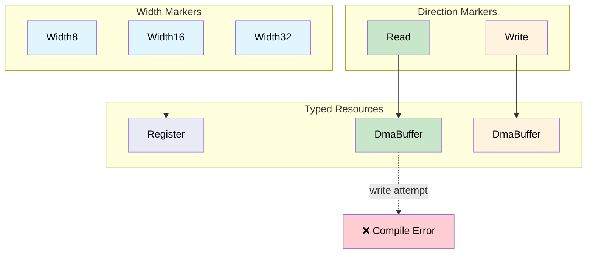

# Phantom Types for Resource Tracking 🟡

> **What you'll learn:** How `PhantomData` markers encode register width, DMA direction, and file-descriptor state at the type level — preventing an entire class of resource-mismatch bugs at zero runtime cost.
>
> **Cross-references:** [ch05](ch05-protocol-state-machines-type-state-for-r.md) (type-state), [ch06](ch06-dimensional-analysis-making-the-compiler.md) (dimensional types), [ch08](ch08-capability-mixins-compile-time-hardware-.md) (mixins), [ch10](ch10-putting-it-all-together-a-complete-diagn.md) (integration)

## The Problem: Mixing Up Resources

Hardware resources look alike in code but aren't interchangeable:

- A 32-bit register and a 16-bit register are both "registers"
- A DMA buffer for read and a DMA buffer for write both look like `*mut u8`
- An open file descriptor and a closed one are both `i32`

In C:

```c
// C — all registers look the same
uint32_t read_reg32(volatile void *base, uint32_t offset);
uint16_t read_reg16(volatile void *base, uint32_t offset);

// Bug: reading a 16-bit register with the 32-bit function
uint32_t status = read_reg32(pcie_bar, LINK_STATUS_REG);  // should be reg16!
```

## Phantom Type Parameters

A **phantom type** is a type parameter that appears in the struct definition but
not in any field. It exists purely to carry type-level information:

```rust,ignore
use std::marker::PhantomData;

// Register width markers — zero-sized
pub struct Width8;
pub struct Width16;
pub struct Width32;
pub struct Width64;

/// A register handle parameterised by its width.
/// PhantomData<W> costs zero bytes — it's a compile-time-only marker.
pub struct Register<W> {
    base: usize,
    offset: usize,
    _width: PhantomData<W>,
}

impl Register<Width8> {
    pub fn read(&self) -> u8 {
        // ... read 1 byte from base + offset ...
        0 // stub
    }
    pub fn write(&self, _value: u8) {
        // ... write 1 byte ...
    }
}

impl Register<Width16> {
    pub fn read(&self) -> u16 {
        // ... read 2 bytes from base + offset ...
        0 // stub
    }
    pub fn write(&self, _value: u16) {
        // ... write 2 bytes ...
    }
}

impl Register<Width32> {
    pub fn read(&self) -> u32 {
        // ... read 4 bytes from base + offset ...
        0 // stub
    }
    pub fn write(&self, _value: u32) {
        // ... write 4 bytes ...
    }
}

/// PCIe config space register definitions.
pub struct PcieConfig {
    base: usize,
}

impl PcieConfig {
    pub fn vendor_id(&self) -> Register<Width16> {
        Register { base: self.base, offset: 0x00, _width: PhantomData }
    }

    pub fn device_id(&self) -> Register<Width16> {
        Register { base: self.base, offset: 0x02, _width: PhantomData }
    }

    pub fn command(&self) -> Register<Width16> {
        Register { base: self.base, offset: 0x04, _width: PhantomData }
    }

    pub fn status(&self) -> Register<Width16> {
        Register { base: self.base, offset: 0x06, _width: PhantomData }
    }

    pub fn bar0(&self) -> Register<Width32> {
        Register { base: self.base, offset: 0x10, _width: PhantomData }
    }
}

fn pcie_example() {
    let cfg = PcieConfig { base: 0xFE00_0000 };

    let vid: u16 = cfg.vendor_id().read();    // returns u16 ✅
    let bar: u32 = cfg.bar0().read();         // returns u32 ✅

    // Can't mix them up:
    // let bad: u32 = cfg.vendor_id().read(); // ❌ ERROR: expected u16
    // cfg.bar0().write(0u16);                // ❌ ERROR: expected u32
}
```

## DMA Buffer Access Control

DMA buffers have direction: some are for **device-to-host** (read), others for
**host-to-device** (write). Using the wrong direction corrupts data or causes
bus errors:

```rust,ignore
use std::marker::PhantomData;

// Direction markers
pub struct ToDevice;     // host writes, device reads
pub struct FromDevice;   // device writes, host reads

/// A DMA buffer with direction enforcement.
pub struct DmaBuffer<Dir> {
    ptr: *mut u8,
    len: usize,
    dma_addr: u64,  // physical address for the device
    _dir: PhantomData<Dir>,
}

impl DmaBuffer<ToDevice> {
    /// Fill the buffer with data to send to the device.
    pub fn write_data(&mut self, data: &[u8]) {
        assert!(data.len() <= self.len);
        // SAFETY: ptr is valid for self.len bytes (allocated at construction),
        // and data.len() <= self.len (asserted above).
        unsafe { std::ptr::copy_nonoverlapping(data.as_ptr(), self.ptr, data.len()) }
    }

    /// Get the DMA address for the device to read from.
    pub fn device_addr(&self) -> u64 {
        self.dma_addr
    }
}

impl DmaBuffer<FromDevice> {
    /// Read data that the device wrote into the buffer.
    pub fn read_data(&self) -> &[u8] {
        // SAFETY: ptr is valid for self.len bytes, and the device
        // has finished writing (caller ensures DMA transfer is complete).
        unsafe { std::slice::from_raw_parts(self.ptr, self.len) }
    }

    /// Get the DMA address for the device to write to.
    pub fn device_addr(&self) -> u64 {
        self.dma_addr
    }
}

// Can't write to a FromDevice buffer:
// fn oops(buf: &mut DmaBuffer<FromDevice>) {
//     buf.write_data(&[1, 2, 3]);  // ❌ no method `write_data` on DmaBuffer<FromDevice>
// }

// Can't read from a ToDevice buffer:
// fn oops2(buf: &DmaBuffer<ToDevice>) {
//     let data = buf.read_data();  // ❌ no method `read_data` on DmaBuffer<ToDevice>
// }
```

## File Descriptor Ownership

A common bug: using a file descriptor after it's been closed. Phantom types can
track open/closed state:

```rust,ignore
use std::marker::PhantomData;

pub struct Open;
pub struct Closed;

/// A file descriptor with state tracking.
pub struct Fd<State> {
    raw: i32,
    _state: PhantomData<State>,
}

impl Fd<Open> {
    pub fn open(path: &str) -> Result<Self, String> {
        // ... open the file ...
        Ok(Fd { raw: 3, _state: PhantomData }) // stub
    }

    pub fn read(&self, buf: &mut [u8]) -> Result<usize, String> {
        // ... read from fd ...
        Ok(0) // stub
    }

    pub fn write(&self, data: &[u8]) -> Result<usize, String> {
        // ... write to fd ...
        Ok(data.len()) // stub
    }

    /// Close the fd — returns a Closed handle.
    /// The Open handle is consumed, preventing use-after-close.
    pub fn close(self) -> Fd<Closed> {
        // ... close the fd ...
        Fd { raw: self.raw, _state: PhantomData }
    }
}

impl Fd<Closed> {
    // No read() or write() methods — they don't exist on Fd<Closed>.
    // This makes use-after-close a compile error.

    pub fn raw_fd(&self) -> i32 {
        self.raw
    }
}

fn fd_example() -> Result<(), String> {
    let fd = Fd::open("/dev/ipmi0")?;
    let mut buf = [0u8; 256];
    fd.read(&mut buf)?;

    let closed = fd.close();

    // closed.read(&mut buf)?;  // ❌ no method `read` on Fd<Closed>
    // closed.write(&[1])?;     // ❌ no method `write` on Fd<Closed>

    Ok(())
}
```

## Combining Phantom Types with Earlier Patterns

Phantom types compose with everything we've seen:

```rust,ignore
# use std::marker::PhantomData;
# pub struct Width32;
# pub struct Width16;
# pub struct Register<W> { _w: PhantomData<W> }
# impl Register<Width16> { pub fn read(&self) -> u16 { 0 } }
# impl Register<Width32> { pub fn read(&self) -> u32 { 0 } }
# #[derive(Debug, Clone, Copy, PartialEq, PartialOrd)]
# pub struct Celsius(pub f64);

/// Combine phantom types (register width) with dimensional types (Celsius).
fn read_temp_sensor(reg: &Register<Width16>) -> Celsius {
    let raw = reg.read();  // guaranteed u16 by phantom type
    Celsius(raw as f64 * 0.0625)  // guaranteed Celsius by return type
}

// The compiler enforces:
// 1. The register is 16-bit (phantom type)
// 2. The result is Celsius (newtype)
// Both at zero runtime cost.
```

### When to Use Phantom Types

| Scenario | Use phantom parameter? |
|----------|:------:|
| Register width encoding | ✅ Always — prevents width mismatch |
| DMA buffer direction | ✅ Always — prevents data corruption |
| File descriptor state | ✅ Always — prevents use-after-close |
| Memory region permissions (R/W/X) | ✅ Always — enforces access control |
| Generic container (Vec, HashMap) | ❌ No — use concrete type parameters |
| Runtime-variable attributes | ❌ No — phantom types are compile-time only |

## Phantom Type Resource Matrix



## Exercise: Memory Region Permissions

Design phantom types for memory regions with read, write, and execute permissions:
- `MemRegion<ReadOnly>` has `fn read(&self, offset: usize) -> u8`
- `MemRegion<ReadWrite>` has both `read` and `write`
- `MemRegion<Executable>` has `read` and `fn execute(&self)`
- Writing to `ReadOnly` or executing `ReadWrite` should not compile.

<details>
<summary>Solution</summary>

```rust,ignore
use std::marker::PhantomData;

pub struct ReadOnly;
pub struct ReadWrite;
pub struct Executable;

pub struct MemRegion<Perm> {
    base: *mut u8,
    len: usize,
    _perm: PhantomData<Perm>,
}

// Read available on all permission types
impl<P> MemRegion<P> {
    pub fn read(&self, offset: usize) -> u8 {
        assert!(offset < self.len);
        // SAFETY: offset < self.len (asserted above), base is valid for len bytes.
        unsafe { *self.base.add(offset) }
    }
}

impl MemRegion<ReadWrite> {
    pub fn write(&mut self, offset: usize, val: u8) {
        assert!(offset < self.len);
        // SAFETY: offset < self.len (asserted above), base is valid for len bytes,
        // and &mut self ensures exclusive access.
        unsafe { *self.base.add(offset) = val; }
    }
}

impl MemRegion<Executable> {
    pub fn execute(&self) {
        // Jump to base address (conceptual)
    }
}

// ❌ region_ro.write(0, 0xFF);  // Compile error: no method `write`
// ❌ region_rw.execute();       // Compile error: no method `execute`
```

</details>

## Key Takeaways

1. **PhantomData carries type-level information at zero size** — the marker exists only for the compiler.
2. **Register width mismatches become compile errors** — `Register<Width16>` returns `u16`, not `u32`.
3. **DMA direction is enforced structurally** — `DmaBuffer<Read>` has no `write()` method.
4. **Combine with dimensional types (ch06)** — `Register<Width16>` can return `Celsius` via the parse step.
5. **Phantom types are compile-time only** — they don't work for runtime-variable attributes; use enums for those.

---

