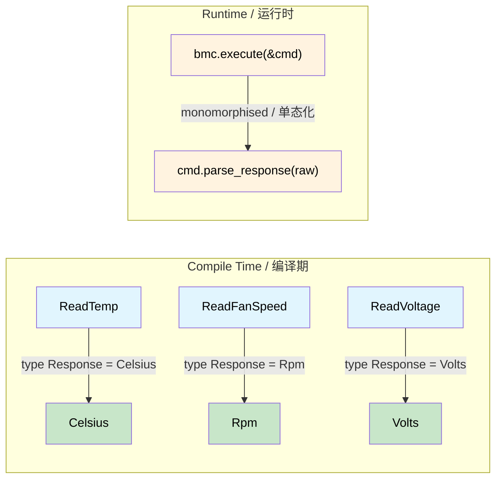

# Typed Command Interfaces — Request Determines Response 🟡<br><span class="zh-inline">类型化命令接口：请求决定响应 🟡</span>

> **What you'll learn:** How associated types on a command trait create a compile-time binding between request and response, eliminating mismatched parsing, unit confusion, and silent type coercion across IPMI, Redfish, and NVMe protocols.<br><span class="zh-inline">**本章将学到什么：** 如何通过命令 trait 上的关联类型，在编译期把“请求”和“响应”绑定起来，从而消除 IPMI、Redfish、NVMe 这类协议里常见的解析错配、单位混淆和静默类型转换问题。</span>
>
> **Cross-references:** [ch01](ch01-the-philosophy-why-types-beat-tests.md) (philosophy), [ch06](ch06-dimensional-analysis-making-the-compiler.md) (dimensional types), [ch07](ch07-validated-boundaries-parse-dont-validate.md) (validated boundaries), [ch10](ch10-putting-it-all-together-a-complete-diagn.md) (integration)<br><span class="zh-inline">**交叉阅读：** [ch01](ch01-the-philosophy-why-types-beat-tests.md) 讲理念，[ch06](ch06-dimensional-analysis-making-the-compiler.md) 讲量纲类型，[ch07](ch07-validated-boundaries-parse-dont-validate.md) 讲已验证边界，[ch10](ch10-putting-it-all-together-a-complete-diagn.md) 讲系统集成。</span>

## The Untyped Swamp<br><span class="zh-inline">无类型泥潭</span>

Most hardware management stacks — IPMI, Redfish, NVMe Admin, PLDM — start life as `raw bytes in → raw bytes out`. This creates a category of bugs that tests can only partially find:<br><span class="zh-inline">大多数硬件管理栈，比如 IPMI、Redfish、NVMe Admin、PLDM，一开始的形态都很像：`原始字节进 → 原始字节出`。这种写法会制造出一类测试只能部分覆盖的错误。</span>

```rust,ignore
use std::io;

struct BmcRaw { /* ipmitool handle */ }

impl BmcRaw {
    fn raw_command(&self, net_fn: u8, cmd: u8, data: &[u8]) -> io::Result<Vec<u8>> {
        // ... shells out to ipmitool ...
        Ok(vec![0x00, 0x19, 0x00]) // stub
    }
}

fn diagnose_thermal(bmc: &BmcRaw) -> io::Result<()> {
    let raw = bmc.raw_command(0x04, 0x2D, &[0x20])?;
    let cpu_temp = raw[0] as f64;        // 🤞 is byte 0 the reading?

    let raw = bmc.raw_command(0x04, 0x2D, &[0x30])?;
    let fan_rpm = raw[0] as u32;         // 🐛 fan speed is 2 bytes LE

    let raw = bmc.raw_command(0x04, 0x2D, &[0x40])?;
    let voltage = raw[0] as f64;         // 🐛 need to divide by 1000

    if cpu_temp > fan_rpm as f64 {       // 🐛 comparing °C to RPM
        println!("uh oh");
    }

    log_temp(voltage);                   // 🐛 passing Volts as temperature
    Ok(())
}

fn log_temp(t: f64) { println!("Temp: {t}°C"); }
```

| # | Bug<br><span class="zh-inline">错误</span> | Discovered<br><span class="zh-inline">发现时机</span> |
|---|-----|------------|
| 1 | Fan RPM parsed as 1 byte instead of 2<br><span class="zh-inline">风扇转速本该按 2 字节解析，却只读了 1 字节</span> | Production, 3 AM<br><span class="zh-inline">生产环境，凌晨 3 点</span> |
| 2 | Voltage not scaled<br><span class="zh-inline">电压没有做缩放</span> | Every PSU flagged as overvoltage<br><span class="zh-inline">所有电源都被误报过压</span> |
| 3 | Comparing °C to RPM<br><span class="zh-inline">把摄氏度和 RPM 拿来比较</span> | Maybe never<br><span class="zh-inline">也许永远都发现不了</span> |
| 4 | Volts passed to temp logger<br><span class="zh-inline">把电压值传给了温度日志函数</span> | 6 months later, reading historical data<br><span class="zh-inline">6 个月后，翻历史数据时才看出来</span> |

**Root cause:** Everything is `Vec<u8>` → `f64` → pray.<br><span class="zh-inline">**根本原因：** 所有东西都被拍扁成 `Vec&lt;u8&gt;`，然后再变成 `f64`，最后只能靠运气。</span>

## The Typed Command Pattern<br><span class="zh-inline">类型化命令模式</span>

### Step 1 — Domain newtypes<br><span class="zh-inline">第 1 步：领域新类型</span>

```rust,ignore
#[derive(Debug, Clone, Copy, PartialEq, PartialOrd)]
pub struct Celsius(pub f64);

#[derive(Debug, Clone, Copy, PartialEq, PartialOrd)]
pub struct Rpm(pub u32);  // u32: raw IPMI sensor value (integer RPM)

#[derive(Debug, Clone, Copy, PartialEq, PartialOrd)]
pub struct Volts(pub f64);

#[derive(Debug, Clone, Copy, PartialEq, PartialOrd)]
pub struct Watts(pub f64);
```

> **Note on `Rpm(u32)` vs `Rpm(f64)`:** In this chapter the inner type is `u32`
> because IPMI sensor readings are integer values. In ch06 (Dimensional Analysis),
> `Rpm` uses `f64` to support arithmetic operations (averaging, scaling). Both
> are valid — the newtype prevents cross-unit confusion regardless of inner type.<br><span class="zh-inline">**关于 `Rpm(u32)` 和 `Rpm(f64)`：** 本章里内部类型选 `u32`，因为 IPMI 传感器读数本来就是整数。到第 6 章讲量纲分析时，`Rpm` 会改用 `f64`，方便做平均、缩放之类的运算。这两种设计都成立，关键点在于 newtype 已经把“不同单位不能混用”这件事卡住了，内部到底包 `u32` 还是 `f64` 只是实现细节。</span>

### Step 2 — The command trait (type-indexed dispatch)<br><span class="zh-inline">第 2 步：命令 trait（按类型索引的分发）</span>

The associated type `Response` is the key — it binds each command struct to its return type. Each implementing struct pins `Response` to a specific domain type, so `execute()` always returns exactly the right type:<br><span class="zh-inline">这里的关键就是关联类型 `Response`。它把每个命令结构体和它的返回类型绑死在一起。每个实现都会把 `Response` 指向某个具体领域类型，所以 `execute()` 永远返回正确的那个类型。</span>

```rust,ignore
pub trait IpmiCmd {
    /// The "type index" — determines what execute() returns.
    type Response;

    fn net_fn(&self) -> u8;
    fn cmd_byte(&self) -> u8;
    fn payload(&self) -> Vec<u8>;

    /// Parsing encapsulated here — each command knows its own byte layout.
    fn parse_response(&self, raw: &[u8]) -> io::Result<Self::Response>;
}
```

### Step 3 — One struct per command<br><span class="zh-inline">第 3 步：一个命令一个结构体</span>

```rust,ignore
pub struct ReadTemp { pub sensor_id: u8 }
impl IpmiCmd for ReadTemp {
    type Response = Celsius;
    fn net_fn(&self) -> u8 { 0x04 }
    fn cmd_byte(&self) -> u8 { 0x2D }
    fn payload(&self) -> Vec<u8> { vec![self.sensor_id] }
    fn parse_response(&self, raw: &[u8]) -> io::Result<Celsius> {
        if raw.is_empty() {
            return Err(io::Error::new(io::ErrorKind::InvalidData, "empty response"));
        }
        // Note: ch01's untyped example uses `raw[0] as i8 as f64` (signed)
        // because that function was demonstrating generic parsing without
        // SDR metadata. Here we use unsigned (`as f64`) because the SDR
        // linearization formula in IPMI spec §35.5 converts the unsigned
        // raw reading to a calibrated value. In production, apply the
        // full SDR formula: result = (M × raw + B) × 10^(R_exp).
        Ok(Celsius(raw[0] as f64))  // unsigned raw byte, converted per SDR formula
    }
}

pub struct ReadFanSpeed { pub fan_id: u8 }
impl IpmiCmd for ReadFanSpeed {
    type Response = Rpm;
    fn net_fn(&self) -> u8 { 0x04 }
    fn cmd_byte(&self) -> u8 { 0x2D }
    fn payload(&self) -> Vec<u8> { vec![self.fan_id] }
    fn parse_response(&self, raw: &[u8]) -> io::Result<Rpm> {
        if raw.len() < 2 {
            return Err(io::Error::new(io::ErrorKind::InvalidData,
                format!("fan speed needs 2 bytes, got {}", raw.len())));
        }
        Ok(Rpm(u16::from_le_bytes([raw[0], raw[1]]) as u32))
    }
}

pub struct ReadVoltage { pub rail: u8 }
impl IpmiCmd for ReadVoltage {
    type Response = Volts;
    fn net_fn(&self) -> u8 { 0x04 }
    fn cmd_byte(&self) -> u8 { 0x2D }
    fn payload(&self) -> Vec<u8> { vec![self.rail] }
    fn parse_response(&self, raw: &[u8]) -> io::Result<Volts> {
        if raw.len() < 2 {
            return Err(io::Error::new(io::ErrorKind::InvalidData,
                format!("voltage needs 2 bytes, got {}", raw.len())));
        }
        Ok(Volts(u16::from_le_bytes([raw[0], raw[1]]) as f64 / 1000.0))
    }
}
```

### Step 4 — The executor (zero `dyn`, monomorphised)<br><span class="zh-inline">第 4 步：执行器（零 `dyn`，单态化）</span>

```rust,ignore
pub struct BmcConnection { pub timeout_secs: u32 }

impl BmcConnection {
    pub fn execute<C: IpmiCmd>(&self, cmd: &C) -> io::Result<C::Response> {
        let raw = self.raw_send(cmd.net_fn(), cmd.cmd_byte(), &cmd.payload())?;
        cmd.parse_response(&raw)
    }

    fn raw_send(&self, _nf: u8, _cmd: u8, _data: &[u8]) -> io::Result<Vec<u8>> {
        Ok(vec![0x19, 0x00]) // stub
    }
}
```

### Step 5 — All four bugs become compile errors<br><span class="zh-inline">第 5 步：前面那四类错误全部变成编译错误</span>

```rust,ignore
fn diagnose_thermal_typed(bmc: &BmcConnection) -> io::Result<()> {
    let cpu_temp: Celsius = bmc.execute(&ReadTemp { sensor_id: 0x20 })?;
    let fan_rpm:  Rpm     = bmc.execute(&ReadFanSpeed { fan_id: 0x30 })?;
    let voltage:  Volts   = bmc.execute(&ReadVoltage { rail: 0x40 })?;

    // Bug #1 — IMPOSSIBLE: parsing lives in ReadFanSpeed::parse_response
    // Bug #2 — IMPOSSIBLE: unit scaling lives in ReadVoltage::parse_response

    // Bug #3 — COMPILE ERROR:
    // if cpu_temp > fan_rpm { }
    //    ^^^^^^^^   ^^^^^^^ Celsius vs Rpm → "mismatched types" ❌

    // Bug #4 — COMPILE ERROR:
    // log_temperature(voltage);
    //                 ^^^^^^^ Volts, expected Celsius ❌

    if cpu_temp > Celsius(85.0) { println!("CPU overheating: {:?}", cpu_temp); }
    if fan_rpm < Rpm(4000)      { println!("Fan too slow: {:?}", fan_rpm); }

    Ok(())
}

fn log_temperature(t: Celsius) { println!("Temp: {:?}", t); }
fn log_voltage(v: Volts)       { println!("Voltage: {:?}", v); }
```

## IPMI: Sensor Reads That Can't Be Confused<br><span class="zh-inline">IPMI：不会再搞混的传感器读取</span>

Adding a new sensor is one struct + one impl — no scattered parsing:<br><span class="zh-inline">新增一个传感器，只需要再写一个结构体和一个 impl，解析逻辑不再散落到各个调用点。</span>

```rust,ignore
pub struct ReadPowerDraw { pub domain: u8 }
impl IpmiCmd for ReadPowerDraw {
    type Response = Watts;
    fn net_fn(&self) -> u8 { 0x04 }
    fn cmd_byte(&self) -> u8 { 0x2D }
    fn payload(&self) -> Vec<u8> { vec![self.domain] }
    fn parse_response(&self, raw: &[u8]) -> io::Result<Watts> {
        if raw.len() < 2 {
            return Err(io::Error::new(io::ErrorKind::InvalidData,
                format!("power draw needs 2 bytes, got {}", raw.len())));
        }
        Ok(Watts(u16::from_le_bytes([raw[0], raw[1]]) as f64))
    }
}

// Every caller that uses bmc.execute(&ReadPowerDraw { domain: 0 })
// automatically gets Watts back — no parsing code elsewhere
```

### Testing Each Command in Isolation<br><span class="zh-inline">为每个命令单独写测试</span>

```rust,ignore
#[cfg(test)]
mod tests {
    use super::*;

    struct StubBmc {
        responses: std::collections::HashMap<u8, Vec<u8>>,
    }

    impl StubBmc {
        fn execute<C: IpmiCmd>(&self, cmd: &C) -> io::Result<C::Response> {
            let key = cmd.payload()[0];
            let raw = self.responses.get(&key)
                .ok_or_else(|| io::Error::new(io::ErrorKind::NotFound, "no stub"))?;
            cmd.parse_response(raw)
        }
    }

    #[test]
    fn read_temp_parses_raw_byte() {
        let bmc = StubBmc {
            responses: [(0x20, vec![0x19])].into(), // 25 decimal = 0x19
        };
        let temp = bmc.execute(&ReadTemp { sensor_id: 0x20 }).unwrap();
        assert_eq!(temp, Celsius(25.0));
    }

    #[test]
    fn read_fan_parses_two_byte_le() {
        let bmc = StubBmc {
            responses: [(0x30, vec![0x00, 0x19])].into(), // 0x1900 = 6400
        };
        let rpm = bmc.execute(&ReadFanSpeed { fan_id: 0x30 }).unwrap();
        assert_eq!(rpm, Rpm(6400));
    }

    #[test]
    fn read_voltage_scales_millivolts() {
        let bmc = StubBmc {
            responses: [(0x40, vec![0xE8, 0x2E])].into(), // 0x2EE8 = 12008 mV
        };
        let v = bmc.execute(&ReadVoltage { rail: 0x40 }).unwrap();
        assert!((v.0 - 12.008).abs() < 0.001);
    }
}
```

## Redfish: Schema-Typed REST Endpoints<br><span class="zh-inline">Redfish：按 Schema 建模的 REST 端点</span>

Redfish is an even better fit — each endpoint returns a DMTF-defined JSON schema:<br><span class="zh-inline">Redfish 和这个模式更搭。因为每个端点本来就对应一份 DMTF 定义好的 JSON Schema。</span>

```rust,ignore
use serde::Deserialize;

#[derive(Debug, Deserialize)]
pub struct ThermalResponse {
    #[serde(rename = "Temperatures")]
    pub temperatures: Vec<RedfishTemp>,
    #[serde(rename = "Fans")]
    pub fans: Vec<RedfishFan>,
}

#[derive(Debug, Deserialize)]
pub struct RedfishTemp {
    #[serde(rename = "Name")]
    pub name: String,
    #[serde(rename = "ReadingCelsius")]
    pub reading: f64,
    #[serde(rename = "UpperThresholdCritical")]
    pub critical_hi: Option<f64>,
    #[serde(rename = "Status")]
    pub status: RedfishHealth,
}

#[derive(Debug, Deserialize)]
pub struct RedfishFan {
    #[serde(rename = "Name")]
    pub name: String,
    #[serde(rename = "Reading")]
    pub rpm: u32,
    #[serde(rename = "Status")]
    pub status: RedfishHealth,
}

#[derive(Debug, Deserialize)]
pub struct PowerResponse {
    #[serde(rename = "Voltages")]
    pub voltages: Vec<RedfishVoltage>,
    #[serde(rename = "PowerSupplies")]
    pub psus: Vec<RedfishPsu>,
}

#[derive(Debug, Deserialize)]
pub struct RedfishVoltage {
    #[serde(rename = "Name")]
    pub name: String,
    #[serde(rename = "ReadingVolts")]
    pub reading: f64,
    #[serde(rename = "Status")]
    pub status: RedfishHealth,
}

#[derive(Debug, Deserialize)]
pub struct RedfishPsu {
    #[serde(rename = "Name")]
    pub name: String,
    #[serde(rename = "PowerOutputWatts")]
    pub output_watts: Option<f64>,
    #[serde(rename = "Status")]
    pub status: RedfishHealth,
}

#[derive(Debug, Deserialize)]
pub struct ProcessorResponse {
    #[serde(rename = "Model")]
    pub model: String,
    #[serde(rename = "TotalCores")]
    pub cores: u32,
    #[serde(rename = "Status")]
    pub status: RedfishHealth,
}

#[derive(Debug, Deserialize)]
pub struct RedfishHealth {
    #[serde(rename = "State")]
    pub state: String,
    #[serde(rename = "Health")]
    pub health: Option<String>,
}

/// Typed Redfish endpoint — each knows its response type.
pub trait RedfishEndpoint {
    type Response: serde::de::DeserializeOwned;
    fn method(&self) -> &'static str;
    fn path(&self) -> String;
}

pub struct GetThermal { pub chassis_id: String }
impl RedfishEndpoint for GetThermal {
    type Response = ThermalResponse;
    fn method(&self) -> &'static str { "GET" }
    fn path(&self) -> String {
        format!("/redfish/v1/Chassis/{}/Thermal", self.chassis_id)
    }
}

pub struct GetPower { pub chassis_id: String }
impl RedfishEndpoint for GetPower {
    type Response = PowerResponse;
    fn method(&self) -> &'static str { "GET" }
    fn path(&self) -> String {
        format!("/redfish/v1/Chassis/{}/Power", self.chassis_id)
    }
}

pub struct GetProcessor { pub system_id: String, pub proc_id: String }
impl RedfishEndpoint for GetProcessor {
    type Response = ProcessorResponse;
    fn method(&self) -> &'static str { "GET" }
    fn path(&self) -> String {
        format!("/redfish/v1/Systems/{}/Processors/{}", self.system_id, self.proc_id)
    }
}

pub struct RedfishClient {
    pub base_url: String,
    pub auth_token: String,
}

impl RedfishClient {
    pub fn execute<E: RedfishEndpoint>(&self, endpoint: &E) -> io::Result<E::Response> {
        let url = format!("{}{}", self.base_url, endpoint.path());
        let json_bytes = self.http_request(endpoint.method(), &url)?;
        serde_json::from_slice(&json_bytes)
            .map_err(|e| io::Error::new(io::ErrorKind::InvalidData, e))
    }

    fn http_request(&self, _method: &str, _url: &str) -> io::Result<Vec<u8>> {
        Ok(vec![]) // stub — real impl uses reqwest/hyper
    }
}

// Usage — fully typed, self-documenting
fn redfish_pre_flight(client: &RedfishClient) -> io::Result<()> {
    let thermal: ThermalResponse = client.execute(&GetThermal {
        chassis_id: "1".into(),
    })?;
    let power: PowerResponse = client.execute(&GetPower {
        chassis_id: "1".into(),
    })?;

    // ❌ Compile error — can't pass PowerResponse to a thermal check:
    // check_thermals(&power);  → "expected ThermalResponse, found PowerResponse"

    for temp in &thermal.temperatures {
        if let Some(crit) = temp.critical_hi {
            if temp.reading > crit {
                println!("CRITICAL: {} at {}°C (threshold: {}°C)",
                    temp.name, temp.reading, crit);
            }
        }
    }
    Ok(())
}
```

## NVMe Admin: Identify Doesn't Return Log Pages<br><span class="zh-inline">NVMe Admin：`Identify` 不会再被当成日志页来解析</span>

NVMe admin commands follow the same shape. The controller distinguishes command opcodes, but in C the caller must know which struct to overlay on the 4 KB completion buffer. The typed-command pattern makes this impossible to get wrong:<br><span class="zh-inline">NVMe admin 命令也完全适用这个套路。控制器当然知道不同 opcode 的区别，但在 C 里，调用方必须自己记住该把哪种结构体套到那块 4 KB 的完成缓冲区上。用类型化命令模式以后，这种事根本写不歪。</span>

```rust,ignore
use std::io;

/// The NVMe Admin command trait — same shape as IpmiCmd.
pub trait NvmeAdminCmd {
    type Response;
    fn opcode(&self) -> u8;
    fn parse_completion(&self, data: &[u8]) -> io::Result<Self::Response>;
}

// ── Identify (opcode 0x06) ──

#[derive(Debug, Clone)]
pub struct IdentifyResponse {
    pub model_number: String,   // bytes 24–63
    pub serial_number: String,  // bytes 4–23
    pub firmware_rev: String,   // bytes 64–71
    pub total_capacity_gb: u64,
}

pub struct Identify {
    pub nsid: u32, // 0 = controller, >0 = namespace
}

impl NvmeAdminCmd for Identify {
    type Response = IdentifyResponse;
    fn opcode(&self) -> u8 { 0x06 }
    fn parse_completion(&self, data: &[u8]) -> io::Result<IdentifyResponse> {
        if data.len() < 4096 {
            return Err(io::Error::new(io::ErrorKind::InvalidData, "short identify"));
        }
        Ok(IdentifyResponse {
            serial_number: String::from_utf8_lossy(&data[4..24]).trim().to_string(),
            model_number: String::from_utf8_lossy(&data[24..64]).trim().to_string(),
            firmware_rev: String::from_utf8_lossy(&data[64..72]).trim().to_string(),
            total_capacity_gb: u64::from_le_bytes(
                data[280..288].try_into().unwrap()
            ) / (1024 * 1024 * 1024),
        })
    }
}

// ── Get Log Page (opcode 0x02) ──

#[derive(Debug, Clone)]
pub struct SmartLog {
    pub critical_warning: u8,
    pub temperature_kelvin: u16,
    pub available_spare_pct: u8,
    pub data_units_read: u128,
}

pub struct GetLogPage {
    pub log_id: u8, // 0x02 = SMART/Health
}

impl NvmeAdminCmd for GetLogPage {
    type Response = SmartLog;
    fn opcode(&self) -> u8 { 0x02 }
    fn parse_completion(&self, data: &[u8]) -> io::Result<SmartLog> {
        if data.len() < 512 {
            return Err(io::Error::new(io::ErrorKind::InvalidData, "short log page"));
        }
        Ok(SmartLog {
            critical_warning: data[0],
            temperature_kelvin: u16::from_le_bytes([data[1], data[2]]),
            available_spare_pct: data[3],
            data_units_read: u128::from_le_bytes(data[32..48].try_into().unwrap()),
        })
    }
}

// ── Executor ──

pub struct NvmeController { /* fd, BAR, etc. */ }

impl NvmeController {
    pub fn admin_cmd<C: NvmeAdminCmd>(&self, cmd: &C) -> io::Result<C::Response> {
        let raw = self.submit_and_wait(cmd.opcode())?;
        cmd.parse_completion(&raw)
    }

    fn submit_and_wait(&self, _opcode: u8) -> io::Result<Vec<u8>> {
        Ok(vec![0u8; 4096]) // stub — real impl issues doorbell + waits for CQ entry
    }
}

// ── Usage ──

fn nvme_health_check(ctrl: &NvmeController) -> io::Result<()> {
    let id: IdentifyResponse = ctrl.admin_cmd(&Identify { nsid: 0 })?;
    let smart: SmartLog = ctrl.admin_cmd(&GetLogPage { log_id: 0x02 })?;

    // ❌ Compile error — Identify returns IdentifyResponse, not SmartLog:
    // let smart: SmartLog = ctrl.admin_cmd(&Identify { nsid: 0 })?;

    println!("{} (FW {}): {}°C, {}% spare",
        id.model_number, id.firmware_rev,
        smart.temperature_kelvin.saturating_sub(273),
        smart.available_spare_pct);

    Ok(())
}
```

The three-protocol progression now follows a **graduated arc** (the same technique ch07 uses for validated boundaries):<br><span class="zh-inline">这样一来，这三个协议就形成了一条**层层递进的学习曲线**。这和第 7 章讲“已验证边界”时用的递进式讲法是一个思路。</span>

| Beat<br><span class="zh-inline">阶段</span> | Protocol<br><span class="zh-inline">协议</span> | Complexity<br><span class="zh-inline">复杂度</span> | What it adds<br><span class="zh-inline">新增内容</span> |
|:----:|----------|-----------|--------------|
| 1 | IPMI<br><span class="zh-inline">IPMI</span> | Simple: sensor ID → reading<br><span class="zh-inline">简单：传感器 ID → 读数</span> | Core pattern: `trait + associated type`<br><span class="zh-inline">核心模式：`trait + 关联类型`</span> |
| 2 | Redfish<br><span class="zh-inline">Redfish</span> | REST: endpoint → typed JSON<br><span class="zh-inline">REST：端点 → 类型化 JSON</span> | Serde integration, schema-typed responses<br><span class="zh-inline">引入 Serde，响应按 Schema 建模</span> |
| 3 | NVMe<br><span class="zh-inline">NVMe</span> | Binary: opcode → 4 KB struct overlay<br><span class="zh-inline">二进制：opcode → 4 KB 结构体映射</span> | Raw buffer parsing, multi-struct completion data<br><span class="zh-inline">原始缓冲区解析，以及更复杂的完成数据结构</span> |

## Extension: Macro DSL for Command Scripts<br><span class="zh-inline">扩展：给命令脚本做一个宏 DSL</span>

```rust,ignore
/// Execute a series of typed IPMI commands, returning a tuple of results.
macro_rules! diag_script {
    ($bmc:expr; $($cmd:expr),+ $(,)?) => {{
        ( $( $bmc.execute(&$cmd)?, )+ )
    }};
}

fn full_pre_flight(bmc: &BmcConnection) -> io::Result<()> {
    let (temp, rpm, volts) = diag_script!(bmc;
        ReadTemp     { sensor_id: 0x20 },
        ReadFanSpeed { fan_id:    0x30 },
        ReadVoltage  { rail:      0x40 },
    );
    // Type: (Celsius, Rpm, Volts) — fully inferred, swap = compile error
    assert!(temp  < Celsius(95.0), "CPU too hot");
    assert!(rpm   > Rpm(3000),     "Fan too slow");
    assert!(volts > Volts(11.4),   "12V rail sagging");
    Ok(())
}
```

## Extension: Enum Dispatch for Dynamic Scripts<br><span class="zh-inline">扩展：给动态脚本做枚举分发</span>

When commands come from JSON config at runtime:<br><span class="zh-inline">如果命令是在运行时从 JSON 配置里读出来的，可以改用枚举分发：</span>

```rust,ignore
pub enum AnyReading {
    Temp(Celsius),
    Rpm(Rpm),
    Volt(Volts),
    Watt(Watts),
}

pub enum AnyCmd {
    Temp(ReadTemp),
    Fan(ReadFanSpeed),
    Voltage(ReadVoltage),
    Power(ReadPowerDraw),
}

impl AnyCmd {
    pub fn execute(&self, bmc: &BmcConnection) -> io::Result<AnyReading> {
        match self {
            AnyCmd::Temp(c)    => Ok(AnyReading::Temp(bmc.execute(c)?)),
            AnyCmd::Fan(c)     => Ok(AnyReading::Rpm(bmc.execute(c)?)),
            AnyCmd::Voltage(c) => Ok(AnyReading::Volt(bmc.execute(c)?)),
            AnyCmd::Power(c)   => Ok(AnyReading::Watt(bmc.execute(c)?)),
        }
    }
}

fn run_dynamic_script(bmc: &BmcConnection, script: &[AnyCmd]) -> io::Result<Vec<AnyReading>> {
    script.iter().map(|cmd| cmd.execute(bmc)).collect()
}
```

## The Pattern Family<br><span class="zh-inline">这一整类模式</span>

This pattern applies to **every** hardware management protocol:<br><span class="zh-inline">这套模式几乎可以套进所有硬件管理协议里：</span>

| Protocol<br><span class="zh-inline">协议</span> | Request Type<br><span class="zh-inline">请求类型</span> | Response Type<br><span class="zh-inline">响应类型</span> |
|----------|-------------|---------------|
| IPMI Sensor Reading<br><span class="zh-inline">IPMI 传感器读取</span> | `ReadTemp` | `Celsius` |
| Redfish REST<br><span class="zh-inline">Redfish REST</span> | `GetThermal` | `ThermalResponse` |
| NVMe Admin<br><span class="zh-inline">NVMe Admin</span> | `Identify` | `IdentifyResponse` |
| PLDM | `GetFwParams` | `FwParamsResponse` |
| MCTP | `GetEid` | `EidResponse` |
| PCIe Config Space<br><span class="zh-inline">PCIe 配置空间</span> | `ReadCapability` | `CapabilityHeader` |
| SMBIOS/DMI | `ReadType17` | `MemoryDeviceInfo` |

The request type **determines** the response type — the compiler enforces it everywhere.<br><span class="zh-inline">请求类型会**决定**响应类型，这条关系由编译器在所有地方统一强制执行。</span>

## Typed Command Flow<br><span class="zh-inline">类型化命令的流转过程</span>



## Exercise: PLDM Typed Commands<br><span class="zh-inline">练习：PLDM 类型化命令</span>

Design a `PldmCmd` trait (same shape as `IpmiCmd`) for two PLDM commands:<br><span class="zh-inline">为两个 PLDM 命令设计一个 `PldmCmd` trait，整体结构和 `IpmiCmd` 保持一致：</span>
- `GetFwParams` → `FwParamsResponse { active_version: String, pending_version: Option<String> }`<br><span class="zh-inline">`GetFwParams` → `FwParamsResponse { active_version: String, pending_version: Option&lt;String&gt; }`</span>
- `QueryDeviceIds` → `DeviceIdResponse { descriptors: Vec<Descriptor> }`<br><span class="zh-inline">`QueryDeviceIds` → `DeviceIdResponse { descriptors: Vec&lt;Descriptor&gt; }`</span>

Requirements: static dispatch, `parse_response` returns `io::Result<Self::Response>`.<br><span class="zh-inline">要求：使用静态分发，并且 `parse_response` 返回 `io::Result&lt;Self::Response&gt;`。</span>

<details>
<summary>Solution<br><span class="zh-inline">参考答案</span></summary>

```rust,ignore
use std::io;

pub trait PldmCmd {
    type Response;
    fn pldm_type(&self) -> u8;
    fn command_code(&self) -> u8;
    fn parse_response(&self, raw: &[u8]) -> io::Result<Self::Response>;
}

#[derive(Debug, Clone)]
pub struct FwParamsResponse {
    pub active_version: String,
    pub pending_version: Option<String>,
}

pub struct GetFwParams;
impl PldmCmd for GetFwParams {
    type Response = FwParamsResponse;
    fn pldm_type(&self) -> u8 { 0x05 } // Firmware Update
    fn command_code(&self) -> u8 { 0x02 }
    fn parse_response(&self, raw: &[u8]) -> io::Result<FwParamsResponse> {
        // Simplified — real impl decodes PLDM FW Update spec fields
        if raw.len() < 4 {
            return Err(io::Error::new(io::ErrorKind::InvalidData, "too short"));
        }
        Ok(FwParamsResponse {
            active_version: String::from_utf8_lossy(&raw[..4]).to_string(),
            pending_version: None,
        })
    }
}

#[derive(Debug, Clone)]
pub struct Descriptor { pub descriptor_type: u16, pub data: Vec<u8> }

#[derive(Debug, Clone)]
pub struct DeviceIdResponse { pub descriptors: Vec<Descriptor> }

pub struct QueryDeviceIds;
impl PldmCmd for QueryDeviceIds {
    type Response = DeviceIdResponse;
    fn pldm_type(&self) -> u8 { 0x05 }
    fn command_code(&self) -> u8 { 0x04 }
    fn parse_response(&self, raw: &[u8]) -> io::Result<DeviceIdResponse> {
        Ok(DeviceIdResponse { descriptors: vec![] }) // stub
    }
}
```

</details>

## Key Takeaways<br><span class="zh-inline">本章要点</span>

1. **Associated type = compile-time contract** — `type Response` on the command trait locks each request to exactly one response type.<br><span class="zh-inline">**关联类型 = 编译期契约**：命令 trait 上的 `type Response` 会把每个请求锁定到唯一的响应类型。</span>
2. **Parsing is encapsulated** — byte-layout knowledge lives in `parse_response`, not scattered across callers.<br><span class="zh-inline">**解析逻辑被封装起来**：字节布局知识集中在 `parse_response` 里，而不是散落在各个调用方。</span>
3. **Zero-cost dispatch** — generic `execute<C: IpmiCmd>` monomorphises to direct calls with no vtable.<br><span class="zh-inline">**零成本分发**：泛型形式的 `execute&lt;C: IpmiCmd&gt;` 会单态化成直接调用，没有 vtable 成本。</span>
4. **One pattern, many protocols** — IPMI, Redfish, NVMe, PLDM, MCTP all fit the same `trait Cmd { type Response; }` shape.<br><span class="zh-inline">**一套模式，多种协议**：IPMI、Redfish、NVMe、PLDM、MCTP 都能套进同一个 `trait Cmd { type Response; }` 结构里。</span>
5. **Enum dispatch bridges static and dynamic** — wrap typed commands in an enum for runtime-driven scripts without losing type safety inside each arm.<br><span class="zh-inline">**枚举分发能把静态和动态接起来**：把类型化命令包进枚举以后，就能支持运行时驱动的脚本，同时保住每个分支内部的类型安全。</span>
6. **Graduated complexity strengthens intuition** — IPMI (sensor ID → reading), Redfish (endpoint → JSON schema), and NVMe (opcode → 4 KB struct overlay) all use the same trait shape, but each beat adds a layer of parsing complexity.<br><span class="zh-inline">**递进式复杂度有助于建立直觉**：IPMI 是“传感器 ID → 读数”，Redfish 是“端点 → JSON Schema”，NVMe 是“opcode → 4 KB 结构体映射”。三者 trait 形态一样，但每一层都增加了一档解析复杂度。</span>

---
