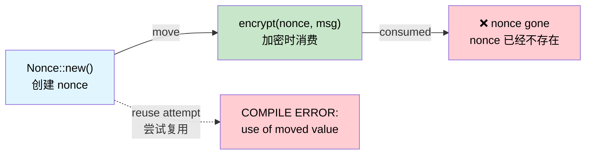

# Single-Use Types — Cryptographic Guarantees via Ownership 🟡<br><span class="zh-inline">单次使用类型：通过所有权获得密码学保证 🟡</span>

> **What you'll learn:** How Rust's move semantics act as a linear type system, making nonce reuse, double key-agreement, and accidental fuse re-programming impossible at compile time.<br><span class="zh-inline">**本章将学到什么：** Rust 的移动语义怎样像线性类型系统一样工作，从而在编译期杜绝 nonce 复用、重复密钥协商，以及误重复烧录 fuse 这类问题。</span>
>
> **Cross-references:** [ch01](ch01-the-philosophy-why-types-beat-tests.md) (philosophy), [ch04](ch04-capability-tokens-zero-cost-proof-of-aut.md) (capability tokens), [ch05](ch05-protocol-state-machines-type-state-for-r.md) (type-state), [ch14](ch14-testing-type-level-guarantees.md) (testing compile-fail)<br><span class="zh-inline">**交叉阅读：** [ch01](ch01-the-philosophy-why-types-beat-tests.md) 讲理念，[ch04](ch04-capability-tokens-zero-cost-proof-of-aut.md) 讲能力令牌，[ch05](ch05-protocol-state-machines-type-state-for-r.md) 讲类型状态，[ch14](ch14-testing-type-level-guarantees.md) 讲 compile-fail 测试。</span>

## The Nonce Reuse Catastrophe<br><span class="zh-inline">Nonce 复用灾难</span>

In authenticated encryption (AES-GCM, ChaCha20-Poly1305), reusing a nonce with the same key is **catastrophic** — it leaks the XOR of two plaintexts and often the authentication key itself. This isn't a theoretical concern:<br><span class="zh-inline">在认证加密算法里，比如 AES-GCM、ChaCha20-Poly1305，如果同一把密钥重复使用同一个 nonce，后果是**灾难性的**。它会泄露两份明文的异或结果，很多情况下连认证密钥本身都会被拖出来。这不是纸上谈兵：</span>

- **2016**: Forbidden Attack on AES-GCM in TLS — nonce reuse allowed plaintext recovery<br><span class="zh-inline">**2016 年**：TLS 里的 AES-GCM 遭到 Forbidden Attack，nonce 复用导致明文可恢复</span>
- **2020**: Multiple IoT firmware update systems found reusing nonces due to poor RNG<br><span class="zh-inline">**2020 年**：多个 IoT 固件升级系统因为随机数生成器太烂，出现了 nonce 重复使用</span>

In C/C++, a nonce is just a `uint8_t[12]`. Nothing prevents you from using it twice.<br><span class="zh-inline">在 C/C++ 里，nonce 本质上就是一个 `uint8_t[12]`。语言本身完全拦不住第二次使用。</span>

```c
// C — nothing stops nonce reuse
uint8_t nonce[12];
generate_nonce(nonce);
encrypt(key, nonce, msg1, out1);   // ✅ first use
encrypt(key, nonce, msg2, out2);   // 🐛 CATASTROPHIC: same nonce
```

## Move Semantics as Linear Types<br><span class="zh-inline">把移动语义看成线性类型</span>

Rust's ownership system is effectively a **linear type system** — a value can be used exactly once (moved) unless it implements `Copy`. The `ring` crate exploits this:<br><span class="zh-inline">Rust 的所有权系统，本质上就很像一个**线性类型系统**。除非一个值实现了 `Copy`，否则它默认只能被使用一次，也就是被 move 一次。`ring` 这个库就把这一点用得很狠：</span>

```rust,ignore
// ring::aead::Nonce is:
// - NOT Clone
// - NOT Copy
// - Consumed by value when used
pub struct Nonce(/* private */);

impl Nonce {
    pub fn try_assume_unique_for_key(value: &[u8]) -> Result<Self, Unspecified> {
        // ...
    }
    // No Clone, no Copy — can only be used once
}
```

When you pass a `Nonce` to `seal_in_place()`, **it moves**:<br><span class="zh-inline">当 `Nonce` 被传给 `seal_in_place()` 时，它会被**移动**进去：</span>

```rust,ignore
// Pseudocode mirroring ring's API shape
fn seal_in_place(
    key: &SealingKey,
    nonce: Nonce,       // ← moved, not borrowed
    data: &mut Vec<u8>,
) -> Result<(), Error> {
    // ... encrypt data in place ...
    // nonce is consumed — cannot be used again
    Ok(())
}
```

Attempting to reuse it:<br><span class="zh-inline">如果还想再用一次：</span>

```rust,ignore
fn bad_encrypt(key: &SealingKey, data1: &mut Vec<u8>, data2: &mut Vec<u8>) {
    let nonce = Nonce::try_assume_unique_for_key(&[0u8; 12]).unwrap();
    seal_in_place(key, nonce, data1).unwrap();  // ✅ nonce moved here
    // seal_in_place(key, nonce, data2).unwrap();
    //                    ^^^^^ ERROR: use of moved value ❌
}
```

The compiler **proves** that each nonce is used exactly once. No test required.<br><span class="zh-inline">编译器会**证明**每个 nonce 只会被使用一次。根本用不着写测试来碰运气。</span>

## Case Study: ring's Nonce<br><span class="zh-inline">案例：`ring` 里的 Nonce 设计</span>

The `ring` crate goes further with `NonceSequence` — a trait that **generates** nonces and is also non-cloneable:<br><span class="zh-inline">`ring` 更进一步，又引入了 `NonceSequence`。这个 trait 负责**生成** nonce，而且自己同样不能被克隆：</span>

```rust,ignore
/// A sequence of unique nonces.
/// Not Clone — once bound to a key, cannot be duplicated.
pub trait NonceSequence {
    fn advance(&mut self) -> Result<Nonce, Unspecified>;
}

/// SealingKey wraps a NonceSequence — each seal() auto-advances.
pub struct SealingKey<N: NonceSequence> {
    key: UnboundKey,   // consumed during construction
    nonce_seq: N,
}

impl<N: NonceSequence> SealingKey<N> {
    pub fn new(key: UnboundKey, nonce_seq: N) -> Self {
        // UnboundKey is moved — can't be used for both sealing AND opening
        SealingKey { key, nonce_seq }
    }

    pub fn seal_in_place_append_tag(
        &mut self,       // &mut — exclusive access
        aad: Aad<&[u8]>,
        in_out: &mut Vec<u8>,
    ) -> Result<(), Unspecified> {
        let nonce = self.nonce_seq.advance()?; // auto-generate unique nonce
        // ... encrypt with nonce ...
        Ok(())
    }
}
# pub struct UnboundKey;
# pub struct Aad<T>(T);
# pub struct Unspecified;
```

The ownership chain prevents:<br><span class="zh-inline">这一整条所有权链可以同时防住：</span>
1. **Nonce reuse** — `Nonce` is not `Clone`, consumed on each call<br><span class="zh-inline">**Nonce 复用**：`Nonce` 不能 `Clone`，每次调用都会被消费掉</span>
2. **Key duplication** — `UnboundKey` is moved into `SealingKey`, can't also make an `OpeningKey`<br><span class="zh-inline">**密钥复制**：`UnboundKey` 会被 move 进 `SealingKey`，因此不能再同时拿去构造 `OpeningKey`</span>
3. **Sequence duplication** — `NonceSequence` is not `Clone`, so no two keys share a counter<br><span class="zh-inline">**序列复制**：`NonceSequence` 不能 `Clone`，所以不会出现两把 key 共享同一个计数器</span>

**None of these require runtime checks.** The compiler enforces all three.<br><span class="zh-inline">**这三件事都不需要运行时检查。** 编译器已经提前把它们卡死了。</span>

## Case Study: Ephemeral Key Agreement<br><span class="zh-inline">案例：一次性密钥协商</span>

Ephemeral Diffie-Hellman keys must be used **exactly once** (that's what "ephemeral" means). `ring` enforces this:<br><span class="zh-inline">临时 Diffie-Hellman 私钥必须**只使用一次**，这就是 “ephemeral” 的含义。`ring` 也是这么做的：</span>

```rust,ignore
/// An ephemeral private key. Not Clone, not Copy.
/// Consumed by agree_ephemeral().
pub struct EphemeralPrivateKey { /* ... */ }

/// Compute shared secret — consumes the private key.
pub fn agree_ephemeral(
    my_private_key: EphemeralPrivateKey,  // ← moved
    peer_public_key: &UnparsedPublicKey,
    error_value: Unspecified,
    kdf: impl FnOnce(&[u8]) -> Result<SharedSecret, Unspecified>,
) -> Result<SharedSecret, Unspecified> {
    // ... DH computation ...
    // my_private_key is consumed — can never be reused
    # kdf(&[])
}
# pub struct UnparsedPublicKey;
# pub struct SharedSecret;
# pub struct Unspecified;
```

After calling `agree_ephemeral()`, the private key **no longer exists in memory** (it's been dropped). A C++ developer would need to remember to `memset(key, 0, len)` and hope the compiler doesn't optimise it away. In Rust, the key is simply gone.<br><span class="zh-inline">调用 `agree_ephemeral()` 之后，这把私钥在逻辑上就**不再存在**了，它已经被 drop 掉。C++ 开发者通常还得惦记着 `memset(key, 0, len)`，然后再担心编译器会不会把这段清零优化掉。Rust 这边更干脆，值本身直接没了。</span>

## Hardware Application: One-Time Fuse Programming<br><span class="zh-inline">硬件场景：一次性 Fuse 烧录</span>

Server platforms have **OTP (one-time programmable) fuses** for security keys, board serial numbers, and feature bits. Writing a fuse is irreversible — doing it twice with different data bricks the board. This is a perfect fit for move semantics:<br><span class="zh-inline">服务器平台里常见 **OTP（一次性可编程）fuse**，用来存安全密钥、板卡序列号、功能位。一旦写进去就回不了头。要是拿不同数据重复写，板子基本就废了。这种场景和移动语义简直是绝配。</span>

```rust,ignore
use std::io;

/// A fuse write payload. Not Clone, not Copy.
/// Consumed when the fuse is programmed.
pub struct FusePayload {
    address: u32,
    data: Vec<u8>,
    // private constructor — only created via validated builder
}

/// Proof that the fuse programmer is in the correct state.
pub struct FuseController {
    /* hardware handle */
}

impl FuseController {
    /// Program a fuse — consumes the payload, preventing double-write.
    pub fn program(
        &mut self,
        payload: FusePayload,  // ← moved — can't be used twice
    ) -> io::Result<()> {
        // ... write to OTP hardware ...
        // payload is consumed — trying to program again with the same
        // payload is a compile error
        Ok(())
    }
}

/// Builder with validation — only way to create a FusePayload.
pub struct FusePayloadBuilder {
    address: Option<u32>,
    data: Option<Vec<u8>>,
}

impl FusePayloadBuilder {
    pub fn new() -> Self {
        FusePayloadBuilder { address: None, data: None }
    }

    pub fn address(mut self, addr: u32) -> Self {
        self.address = Some(addr);
        self
    }

    pub fn data(mut self, data: Vec<u8>) -> Self {
        self.data = Some(data);
        self
    }

    pub fn build(self) -> Result<FusePayload, &'static str> {
        let address = self.address.ok_or("address required")?;
        let data = self.data.ok_or("data required")?;
        if data.len() > 32 { return Err("fuse data too long"); }
        Ok(FusePayload { address, data })
    }
}

// Usage:
fn program_board_serial(ctrl: &mut FuseController) -> io::Result<()> {
    let payload = FusePayloadBuilder::new()
        .address(0x100)
        .data(b"SN12345678".to_vec())
        .build()
        .map_err(|e| io::Error::new(io::ErrorKind::InvalidInput, e))?;

    ctrl.program(payload)?;      // ✅ payload consumed

    // ctrl.program(payload);    // ❌ ERROR: use of moved value
    //              ^^^^^^^ value used after move

    Ok(())
}
```

## Hardware Application: Single-Use Calibration Token<br><span class="zh-inline">硬件场景：一次性校准令牌</span>

Some sensors require a calibration step that must happen **exactly once** per power cycle. A calibration token enforces this:<br><span class="zh-inline">有些传感器要求每次上电之后必须做**且只能做一次**校准。这个时候就可以用一个校准令牌把流程卡住：</span>

```rust,ignore
/// Issued once at power-on. Not Clone, not Copy.
pub struct CalibrationToken {
    _private: (),
}

pub struct SensorController {
    calibrated: bool,
}

impl SensorController {
    /// Called once at power-on — returns a calibration token.
    pub fn power_on() -> (Self, CalibrationToken) {
        (
            SensorController { calibrated: false },
            CalibrationToken { _private: () },
        )
    }

    /// Calibrate the sensor — consumes the token.
    pub fn calibrate(&mut self, _token: CalibrationToken) -> io::Result<()> {
        // ... run calibration sequence ...
        self.calibrated = true;
        Ok(())
    }

    /// Read a sensor — only meaningful after calibration.
    ///
    /// **Limitation:** The move-semantics guarantee is *partial*. The caller
    /// can `drop(cal_token)` without calling `calibrate()` — the token will
    /// be destroyed but calibration won't run. The `#[must_use]` annotation
    /// (see below) generates a warning but not a hard error.
    ///
    /// The runtime `self.calibrated` check here is the **safety net** for
    /// that gap. For a fully compile-time solution, see the type-state
    /// pattern in ch05 where `send_command()` only exists on `IpmiSession<Active>`.
    pub fn read(&self) -> io::Result<f64> {
        if !self.calibrated {
            return Err(io::Error::new(io::ErrorKind::Other, "not calibrated"));
        }
        Ok(25.0) // stub
    }
}

fn sensor_workflow() -> io::Result<()> {
    let (mut ctrl, cal_token) = SensorController::power_on();

    // Must use cal_token somewhere — it's not Copy, so dropping it
    // without consuming it generates a warning (or error with #[must_use])
    ctrl.calibrate(cal_token)?;

    // Now reads work:
    let temp = ctrl.read()?;
    println!("Temperature: {temp}°C");

    // Can't calibrate again — token was consumed:
    // ctrl.calibrate(cal_token);  // ❌ use of moved value

    Ok(())
}
```

### When to Use Single-Use Types<br><span class="zh-inline">什么时候适合用单次使用类型</span>

| Scenario<br><span class="zh-inline">场景</span> | Use single-use (move) semantics?<br><span class="zh-inline">是否适合用单次使用的 move 语义</span> |
|----------|:------:|
| Cryptographic nonces<br><span class="zh-inline">密码学 nonce</span> | ✅ Always — nonce reuse is catastrophic<br><span class="zh-inline">✅ 永远要用，nonce 复用后果极其严重</span> |
| Ephemeral keys (DH, ECDH)<br><span class="zh-inline">临时密钥（DH、ECDH）</span> | ✅ Always — reuse weakens forward secrecy<br><span class="zh-inline">✅ 永远要用，重复使用会削弱前向安全</span> |
| OTP fuse writes<br><span class="zh-inline">OTP fuse 烧录</span> | ✅ Always — double-write bricks hardware<br><span class="zh-inline">✅ 永远要用，重复写可能直接把硬件写废</span> |
| License activation codes<br><span class="zh-inline">许可证激活码</span> | ✅ Usually — prevent double-activation<br><span class="zh-inline">✅ 通常适合，用来防重复激活</span> |
| Calibration tokens<br><span class="zh-inline">校准令牌</span> | ✅ Usually — enforce once-per-session<br><span class="zh-inline">✅ 通常适合，用来约束每个会话只做一次</span> |
| File write handles<br><span class="zh-inline">文件写句柄</span> | ⚠️ Sometimes — depends on protocol<br><span class="zh-inline">⚠️ 有时适合，要看具体协议</span> |
| Database transaction handles<br><span class="zh-inline">数据库事务句柄</span> | ⚠️ Sometimes — commit/rollback is single-use<br><span class="zh-inline">⚠️ 有时适合，因为 commit/rollback 本身就是单次行为</span> |
| General data buffers<br><span class="zh-inline">普通数据缓冲区</span> | ❌ These need reuse — use `&mut [u8]`<br><span class="zh-inline">❌ 这类东西通常要反复使用，应该改用 `&mut [u8]`</span> |

## Single-Use Ownership Flow<br><span class="zh-inline">单次使用所有权流转图</span>



## Exercise: Single-Use Firmware Signing Token<br><span class="zh-inline">练习：单次使用的固件签名令牌</span>

Design a `SigningToken` that can be used exactly once to sign a firmware image:<br><span class="zh-inline">设计一个 `SigningToken`，它只能被使用一次，用来给固件镜像签名：</span>
- `SigningToken::issue(key_id: &str) -> SigningToken` (not Clone, not Copy)<br><span class="zh-inline">`SigningToken::issue(key_id: &str) -> SigningToken`，且它不能 `Clone`，也不能 `Copy`</span>
- `sign(token: SigningToken, image: &[u8]) -> SignedImage` (consumes the token)<br><span class="zh-inline">`sign(token: SigningToken, image: &[u8]) -> SignedImage`，签名时会消费掉 token</span>
- Attempting to sign twice should be a compile error.<br><span class="zh-inline">如果尝试签两次，应该在编译期报错。</span>

<details>
<summary>Solution<br><span class="zh-inline">参考答案</span></summary>

```rust,ignore
pub struct SigningToken {
    key_id: String,
    // NOT Clone, NOT Copy
}

pub struct SignedImage {
    pub signature: Vec<u8>,
    pub key_id: String,
}

impl SigningToken {
    pub fn issue(key_id: &str) -> Self {
        SigningToken { key_id: key_id.to_string() }
    }
}

pub fn sign(token: SigningToken, _image: &[u8]) -> SignedImage {
    // Token consumed by move — can't be reused
    SignedImage {
        signature: vec![0xDE, 0xAD],  // stub
        key_id: token.key_id,
    }
}

// ✅ Compiles:
// let tok = SigningToken::issue("release-key");
// let signed = sign(tok, &firmware_bytes);
//
// ❌ Compile error:
// let signed2 = sign(tok, &other_bytes);  // ERROR: use of moved value
```

</details>

## Key Takeaways<br><span class="zh-inline">本章要点</span>

1. **Move = linear use** — a non-Clone, non-Copy type can be consumed exactly once; the compiler enforces this.<br><span class="zh-inline">**Move = 线性使用**：一个既不 `Clone` 也不 `Copy` 的类型，天然就只能被消费一次，这一点由编译器保证。</span>
2. **Nonce reuse is catastrophic** — Rust's ownership system prevents it structurally, not by discipline.<br><span class="zh-inline">**Nonce 复用后果极其严重**：Rust 通过所有权结构本身防住它，而不是靠人自觉。</span>
3. **Pattern applies beyond crypto** — OTP fuses, calibration tokens, audit entries — anything that must happen at most once.<br><span class="zh-inline">**这套模式不只适用于密码学**：OTP fuse、校准令牌、审计记录，凡是“最多只能发生一次”的东西都能套进去。</span>
4. **Ephemeral keys get forward secrecy for free** — the key agreement value is moved into the derived secret and vanishes.<br><span class="zh-inline">**临时密钥天然有前向安全优势**：密钥协商值被 move 进派生出的 secret 之后，就直接消失了。</span>
5. **When in doubt, remove `Clone`** — you can always add it later; removing it from a published API is a breaking change.<br><span class="zh-inline">**拿不准时，先别给 `Clone`**：后面要加很容易，等 API 发布以后再删掉 `Clone` 就成破坏性变更了。</span>

---
