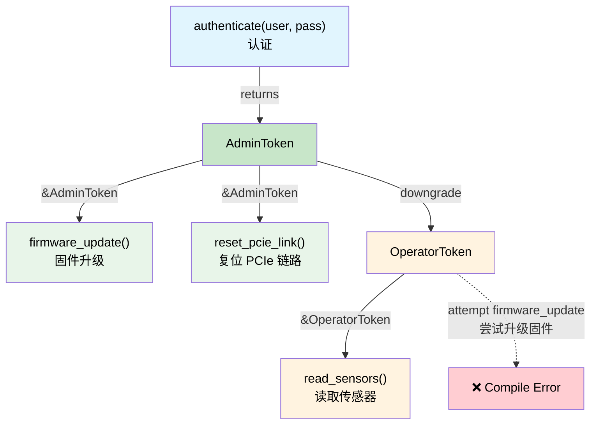

# Capability Tokens — Zero-Cost Proof of Authority 🟡<br><span class="zh-inline">能力令牌：零成本的授权证明 🟡</span>

> **What you'll learn:** How zero-sized types (ZSTs) act as compile-time proof tokens, enforcing privilege hierarchies, power sequencing, and revocable authority — all at zero runtime cost.<br><span class="zh-inline">**本章将学到什么：** 零尺寸类型（ZST）怎样充当编译期的证明令牌，用来表达权限层级、电源时序和可撤销授权，而且运行时成本为零。</span>
>
> **Cross-references:** [ch03](ch03-single-use-types-cryptographic-guarantee.md) (single-use types), [ch05](ch05-protocol-state-machines-type-state-for-r.md) (type-state), [ch08](ch08-capability-mixins-compile-time-hardware-.md) (mixins), [ch10](ch10-putting-it-all-together-a-complete-diagn.md) (integration)<br><span class="zh-inline">**交叉阅读：** [ch03](ch03-single-use-types-cryptographic-guarantee.md) 讲单次使用类型，[ch05](ch05-protocol-state-machines-type-state-for-r.md) 讲类型状态，[ch08](ch08-capability-mixins-compile-time-hardware-.md) 讲 mixin，[ch10](ch10-putting-it-all-together-a-complete-diagn.md) 讲整体集成。</span>

## The Problem: Who Is Allowed to Do What?<br><span class="zh-inline">问题：到底谁有资格做什么</span>

In hardware diagnostics, some operations are **dangerous**:<br><span class="zh-inline">在硬件诊断场景里，有些操作天生就很危险：</span>

- Programming BMC firmware<br><span class="zh-inline">烧录 BMC 固件</span>
- Resetting PCIe links<br><span class="zh-inline">复位 PCIe 链路</span>
- Writing OTP fuses<br><span class="zh-inline">写入 OTP fuse</span>
- Enabling high-voltage test modes<br><span class="zh-inline">开启高压测试模式</span>

In C/C++, these are guarded by runtime checks:<br><span class="zh-inline">在 C/C++ 里，这类操作通常只能靠运行时判断来守：</span>

```c
// C — runtime permission check
int reset_pcie_link(bmc_handle_t bmc, int slot) {
    if (!bmc->is_admin) {        // runtime check
        return -EPERM;
    }
    if (!bmc->link_trained) {    // another runtime check
        return -EINVAL;
    }
    // ... do the dangerous thing ...
    return 0;
}
```

Every function that does something dangerous must repeat these checks. Forget one, and you have a privilege escalation bug.<br><span class="zh-inline">每个危险函数都得把这些判断重复写一遍。只要漏掉一个地方，权限提升漏洞就来了。</span>

## Zero-Sized Types as Proof Tokens<br><span class="zh-inline">把零尺寸类型当成证明令牌</span>

A **capability token** is a zero-sized type (ZST) that proves the caller has the authority to perform an action. It costs **zero bytes** at runtime — it exists only in the type system:<br><span class="zh-inline">所谓**能力令牌**，就是一个零尺寸类型（ZST），它用来证明调用方有权执行某个动作。它在运行时的开销是 **0 字节**，存在意义完全在类型系统里。</span>

```rust,ignore
use std::marker::PhantomData;

/// Proof that the caller has admin privileges.
/// Zero-sized — compiles away completely.
/// Not Clone, not Copy — must be explicitly passed.
pub struct AdminToken {
    _private: (),   // prevents construction outside this module
}

/// Proof that the PCIe link is trained and ready.
pub struct LinkTrainedToken {
    _private: (),
}

pub struct BmcController { /* ... */ }

impl BmcController {
    /// Authenticate as admin — returns a capability token.
    /// This is the ONLY way to create an AdminToken.
    pub fn authenticate_admin(
        &mut self,
        credentials: &[u8],
    ) -> Result<AdminToken, &'static str> {
        // ... validate credentials ...
        # let valid = true;
        if valid {
            Ok(AdminToken { _private: () })
        } else {
            Err("authentication failed")
        }
    }

    /// Train the PCIe link — returns proof that it's trained.
    pub fn train_link(&mut self) -> Result<LinkTrainedToken, &'static str> {
        // ... perform link training ...
        Ok(LinkTrainedToken { _private: () })
    }

    /// Reset a PCIe link — requires BOTH admin + link-trained proof.
    /// No runtime checks needed — the tokens ARE the proof.
    pub fn reset_pcie_link(
        &mut self,
        _admin: &AdminToken,         // zero-cost proof of authority
        _trained: &LinkTrainedToken,  // zero-cost proof of state
        slot: u32,
    ) -> Result<(), &'static str> {
        println!("Resetting PCIe link on slot {slot}");
        Ok(())
    }
}
```

Usage — the type system enforces the workflow:<br><span class="zh-inline">调用时，流程会直接被类型系统约束住：</span>

```rust,ignore
fn maintenance_workflow(bmc: &mut BmcController) -> Result<(), &'static str> {
    // Step 1: Authenticate — get admin proof
    let admin = bmc.authenticate_admin(b"secret")?;

    // Step 2: Train link — get trained proof
    let trained = bmc.train_link()?;

    // Step 3: Reset — compiler requires both tokens
    bmc.reset_pcie_link(&admin, &trained, 0)?;

    Ok(())
}

// This WON'T compile:
fn unprivileged_attempt(bmc: &mut BmcController) -> Result<(), &'static str> {
    let trained = bmc.train_link()?;
    // bmc.reset_pcie_link(???, &trained, 0)?;
    //                     ^^^ no AdminToken — can't call this
    Ok(())
}
```

The `AdminToken` and `LinkTrainedToken` are **zero bytes** in the compiled binary. They exist only during type-checking. The function signature `fn reset_pcie_link(&mut self, _admin: &AdminToken, ...)` is a **proof obligation** — "you may only call this if you can produce an `AdminToken`" — and the only way to produce one is through `authenticate_admin()`.<br><span class="zh-inline">`AdminToken` 和 `LinkTrainedToken` 在最终二进制里都是 **0 字节**。它们只在类型检查阶段发挥作用。`fn reset_pcie_link(&mut self, _admin: &AdminToken, ...)` 这样的签名，本质上就是一个**证明义务**：只有拿得出 `AdminToken` 才能调用。而能拿到这个 token 的唯一途径，就是 `authenticate_admin()`。</span>

## Power Sequencing Authority<br><span class="zh-inline">电源时序权限</span>

Server power sequencing has strict ordering: standby → auxiliary → main → CPU. Reversing the sequence can damage hardware. Capability tokens enforce ordering:<br><span class="zh-inline">服务器上电时序有严格顺序：standby → auxiliary → main → CPU。顺序错了，硬件真能被整坏。能力令牌正好可以把这个顺序卡住。</span>

```rust,ignore
/// State tokens — each one proves the previous step completed.
pub struct StandbyOn { _p: () }
pub struct AuxiliaryOn { _p: () }
pub struct MainOn { _p: () }
pub struct CpuPowered { _p: () }

pub struct PowerController { /* ... */ }

impl PowerController {
    /// Step 1: Enable standby power. No precondition.
    pub fn enable_standby(&mut self) -> Result<StandbyOn, &'static str> {
        println!("Standby power ON");
        Ok(StandbyOn { _p: () })
    }

    /// Step 2: Enable auxiliary — requires standby proof.
    pub fn enable_auxiliary(
        &mut self,
        _standby: &StandbyOn,
    ) -> Result<AuxiliaryOn, &'static str> {
        println!("Auxiliary power ON");
        Ok(AuxiliaryOn { _p: () })
    }

    /// Step 3: Enable main — requires auxiliary proof.
    pub fn enable_main(
        &mut self,
        _aux: &AuxiliaryOn,
    ) -> Result<MainOn, &'static str> {
        println!("Main power ON");
        Ok(MainOn { _p: () })
    }

    /// Step 4: Power CPU — requires main proof.
    pub fn power_cpu(
        &mut self,
        _main: &MainOn,
    ) -> Result<CpuPowered, &'static str> {
        println!("CPU powered ON");
        Ok(CpuPowered { _p: () })
    }
}

fn power_on_sequence(ctrl: &mut PowerController) -> Result<CpuPowered, &'static str> {
    let standby = ctrl.enable_standby()?;
    let aux = ctrl.enable_auxiliary(&standby)?;
    let main = ctrl.enable_main(&aux)?;
    let cpu = ctrl.power_cpu(&main)?;
    Ok(cpu)
}

// Trying to skip a step:
// fn wrong_order(ctrl: &mut PowerController) {
//     ctrl.power_cpu(???);  // ❌ can't produce MainOn without enable_main()
// }
```

## Hierarchical Capabilities<br><span class="zh-inline">分层能力模型</span>

Real systems have **hierarchies** — an admin can do everything a user can do, plus more. Model this with a trait hierarchy:<br><span class="zh-inline">真实系统往往存在**层级关系**。管理员能做普通用户能做的所有事，还能做更多事。这个模型可以直接用 trait 层级来表达。</span>

```rust,ignore
/// Base capability — anyone who is authenticated.
pub trait Authenticated {
    fn token_id(&self) -> u64;
}

/// Operator can read sensors and run non-destructive diagnostics.
pub trait Operator: Authenticated {}

/// Admin can do everything an operator can, plus destructive operations.
pub trait Admin: Operator {}

// Concrete tokens:
pub struct UserToken { id: u64 }
pub struct OperatorToken { id: u64 }
pub struct AdminCapToken { id: u64 }

impl Authenticated for UserToken { fn token_id(&self) -> u64 { self.id } }
impl Authenticated for OperatorToken { fn token_id(&self) -> u64 { self.id } }
impl Operator for OperatorToken {}
impl Authenticated for AdminCapToken { fn token_id(&self) -> u64 { self.id } }
impl Operator for AdminCapToken {}
impl Admin for AdminCapToken {}

pub struct Bmc { /* ... */ }

impl Bmc {
    /// Anyone authenticated can read sensors.
    pub fn read_sensor(&self, _who: &impl Authenticated, id: u32) -> f64 {
        42.0 // stub
    }

    /// Only operators and above can run diagnostics.
    pub fn run_diag(&mut self, _who: &impl Operator, test: &str) -> bool {
        true // stub
    }

    /// Only admins can flash firmware.
    pub fn flash_firmware(&mut self, _who: &impl Admin, image: &[u8]) -> Result<(), &'static str> {
        Ok(()) // stub
    }
}
```

An `AdminCapToken` can be passed to any function — it satisfies `Authenticated`, `Operator`, and `Admin`. A `UserToken` can only call `read_sensor()`. The compiler enforces the entire privilege model **at zero runtime cost**.<br><span class="zh-inline">`AdminCapToken` 可以传给所有这些函数，因为它同时满足 `Authenticated`、`Operator` 和 `Admin`。而 `UserToken` 只能调用 `read_sensor()`。整个权限模型都由编译器负责执行，而且**没有任何运行时开销**。</span>

## Lifetime-Bounded Capability Tokens<br><span class="zh-inline">带生命周期边界的能力令牌</span>

Sometimes a capability should be **scoped** — valid only within a certain lifetime. Rust's borrow checker handles this naturally:<br><span class="zh-inline">有时候，一个能力应该是**有作用域的**，只在某个生命周期内有效。Rust 的借用检查器正好天生擅长这个。</span>

```rust,ignore
/// A scoped admin session. The token borrows the session,
/// so it cannot outlive it.
pub struct AdminSession {
    _active: bool,
}

pub struct ScopedAdminToken<'session> {
    _session: &'session AdminSession,
}

impl AdminSession {
    pub fn begin(credentials: &[u8]) -> Result<Self, &'static str> {
        // ... authenticate ...
        Ok(AdminSession { _active: true })
    }

    /// Create a scoped token — lives only as long as the session.
    pub fn token(&self) -> ScopedAdminToken<'_> {
        ScopedAdminToken { _session: self }
    }
}

fn scoped_example() -> Result<(), &'static str> {
    let session = AdminSession::begin(b"credentials")?;
    let token = session.token();

    // Use token within this scope...
    // When session drops, token is invalidated by the borrow checker.
    // No need for runtime expiry checks.

    // drop(session);
    // ❌ ERROR: cannot move out of `session` because it is borrowed
    //    (by `token`, which holds &session)
    //
    // Even if we skip drop() and just try to use `token` after
    // session goes out of scope — same error: lifetime mismatch.

    Ok(())
}
```

### When to Use Capability Tokens<br><span class="zh-inline">什么时候适合用能力令牌</span>

| Scenario<br><span class="zh-inline">场景</span> | Pattern<br><span class="zh-inline">适合的模式</span> |
|----------|---------|
| Privileged hardware operations<br><span class="zh-inline">特权硬件操作</span> | ZST proof token (AdminToken)<br><span class="zh-inline">ZST 证明令牌，比如 `AdminToken`</span> |
| Multi-step sequencing<br><span class="zh-inline">多步骤顺序约束</span> | Chain of state tokens (StandbyOn → AuxiliaryOn → ...)<br><span class="zh-inline">一串状态令牌，比如 `StandbyOn → AuxiliaryOn → ...`</span> |
| Role-based access control<br><span class="zh-inline">基于角色的访问控制</span> | Trait hierarchy (Authenticated → Operator → Admin)<br><span class="zh-inline">trait 层级，比如 `Authenticated → Operator → Admin`</span> |
| Time-limited privileges<br><span class="zh-inline">限时权限</span> | Lifetime-bounded tokens (`ScopedAdminToken<'a>`)<br><span class="zh-inline">带生命周期边界的令牌，比如 `ScopedAdminToken&lt;'a&gt;`</span> |
| Cross-module authority<br><span class="zh-inline">跨模块授权</span> | Public token type, private constructor<br><span class="zh-inline">公开 token 类型，私有构造函数</span> |

### Cost Summary<br><span class="zh-inline">成本总结</span>

| What<br><span class="zh-inline">项目</span> | Runtime cost<br><span class="zh-inline">运行时成本</span> |
|------|:------:|
| ZST token in memory<br><span class="zh-inline">内存里的 ZST 令牌</span> | 0 bytes<br><span class="zh-inline">0 字节</span> |
| Token parameter passing<br><span class="zh-inline">令牌参数传递</span> | Optimised away by LLVM<br><span class="zh-inline">会被 LLVM 优化掉</span> |
| Trait hierarchy dispatch<br><span class="zh-inline">trait 层级分发</span> | Static dispatch (monomorphised)<br><span class="zh-inline">静态分发（单态化）</span> |
| Lifetime enforcement<br><span class="zh-inline">生命周期约束</span> | Compile-time only<br><span class="zh-inline">只发生在编译期</span> |

**Total runtime overhead: zero.** The privilege model exists only in the type system.<br><span class="zh-inline">**总运行时开销：零。** 整套权限模型只存在于类型系统中。</span>

## Capability Token Hierarchy<br><span class="zh-inline">能力令牌层级图</span>



## Exercise: Tiered Diagnostic Permissions<br><span class="zh-inline">练习：分层的诊断权限系统</span>

Design a three-tier capability system: `ViewerToken`, `TechToken`, `EngineerToken`.<br><span class="zh-inline">设计一个三层能力系统：`ViewerToken`、`TechToken`、`EngineerToken`。</span>
- Viewers can call `read_status()`<br><span class="zh-inline">Viewer 可以调用 `read_status()`</span>
- Techs can also call `run_quick_diag()`<br><span class="zh-inline">Tech 还可以调用 `run_quick_diag()`</span>
- Engineers can also call `flash_firmware()`<br><span class="zh-inline">Engineer 还可以调用 `flash_firmware()`</span>
- Higher tiers can do everything lower tiers can (use trait bounds or token conversion).<br><span class="zh-inline">更高层级可以做更低层级能做的所有事，可以用 trait 约束或者 token 转换实现。</span>

<details>
<summary>Solution<br><span class="zh-inline">参考答案</span></summary>

```rust,ignore
// Tokens — zero-sized, private constructors
pub struct ViewerToken { _private: () }
pub struct TechToken { _private: () }
pub struct EngineerToken { _private: () }

// Capability traits — hierarchical
pub trait CanView {}
pub trait CanDiag: CanView {}
pub trait CanFlash: CanDiag {}

impl CanView for ViewerToken {}
impl CanView for TechToken {}
impl CanView for EngineerToken {}
impl CanDiag for TechToken {}
impl CanDiag for EngineerToken {}
impl CanFlash for EngineerToken {}

pub fn read_status(_tok: &impl CanView) -> String {
    "status: OK".into()
}

pub fn run_quick_diag(_tok: &impl CanDiag) -> String {
    "diag: PASS".into()
}

pub fn flash_firmware(_tok: &impl CanFlash, _image: &[u8]) {
    // Only engineers reach here
}
```

</details>

## Key Takeaways<br><span class="zh-inline">本章要点</span>

1. **ZST tokens cost zero bytes** — they exist only in the type system; LLVM optimises them away completely.<br><span class="zh-inline">**ZST 令牌不占字节**：它们只存在于类型系统里，LLVM 会把它们彻底优化掉。</span>
2. **Private constructors = unforgeable** — only your module's `authenticate()` can mint a token.<br><span class="zh-inline">**私有构造函数 = 不可伪造**：只有模块内部的 `authenticate()` 之类函数才能铸造 token。</span>
3. **Trait hierarchies model permission levels** — `CanFlash: CanDiag: CanView` mirrors real RBAC.<br><span class="zh-inline">**trait 层级可以表达权限等级**：`CanFlash: CanDiag: CanView` 这种关系和真实 RBAC 很贴。</span>
4. **Lifetime-bounded tokens revoke automatically** — `ScopedAdminToken<'session>` can't outlive the session.<br><span class="zh-inline">**带生命周期边界的 token 会自动失效**：`ScopedAdminToken&lt;'session&gt;` 无法活得比会话更久。</span>
5. **Combine with type-state (ch05)** for protocols that require authentication *and* sequenced operations.<br><span class="zh-inline">**和类型状态一起用**：对于既要求认证、又要求严格顺序的协议，可以和第 5 章的 type-state 组合使用。</span>

---
