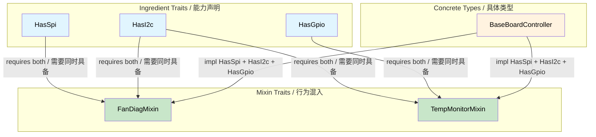

# Capability Mixins — Compile-Time Hardware Contracts 🟡<br><span class="zh-inline">Capability Mixins：编译期硬件契约 🟡</span>

> **What you'll learn:** How ingredient traits (bus capabilities) combined with mixin traits and blanket impls eliminate diagnostic code duplication while guaranteeing every hardware dependency is satisfied at compile time.<br><span class="zh-inline">**本章将学到什么：** ingredient trait，也就是总线能力声明，怎样和 mixin trait、blanket impl 配合起来，一边消除诊断代码复制，一边保证所有硬件依赖都在编译期被满足。</span>
>
> **Cross-references:** [ch04](ch04-capability-tokens-zero-cost-proof-of-aut.md) (capability tokens), [ch09](ch09-phantom-types-for-resource-tracking.md) (phantom types), [ch10](ch10-putting-it-all-together-a-complete-diagn.md) (integration)<br><span class="zh-inline">**交叉阅读：** [ch04](ch04-capability-tokens-zero-cost-proof-of-aut.md) 讲 capability token，[ch09](ch09-phantom-types-for-resource-tracking.md) 讲 phantom type，[ch10](ch10-putting-it-all-together-a-complete-diagn.md) 讲整体集成。</span>

## The Problem: Diagnostic Code Duplication<br><span class="zh-inline">问题：诊断代码反复复制</span>

Server platforms share diagnostic patterns across subsystems. Fan diagnostics, temperature monitoring, and power sequencing all follow similar workflows but operate on different hardware buses. Without abstraction, you get copy-paste:<br><span class="zh-inline">服务器平台上，不同子系统的诊断逻辑往往有大量共性。风扇诊断、温度监控、电源时序检查，流程其实都差不多，只是落在不同硬件总线上。没有抽象时，代码就会一路复制粘贴下去。</span>

```c
// C — duplicated logic across subsystems
int run_fan_diag(spi_bus_t *spi, i2c_bus_t *i2c) {
    // ... 50 lines of SPI sensor read ...
    // ... 30 lines of I2C register check ...
    // ... 20 lines of threshold comparison (same as CPU diag) ...
}

int run_cpu_temp_diag(i2c_bus_t *i2c, gpio_t *gpio) {
    // ... 30 lines of I2C register check (same as fan diag) ...
    // ... 15 lines of GPIO alert check ...
    // ... 20 lines of threshold comparison (same as fan diag) ...
}
```

The threshold comparison logic is identical, but you can't extract it because the bus types differ. With capability mixins, each hardware bus is an **ingredient trait**, and diagnostic behaviors are automatically provided when the right ingredients are present.<br><span class="zh-inline">阈值比较那部分明明是同一套逻辑，但因为周围依赖的总线类型不同，抽起来总觉得别扭。capability mixin 的做法是：把每条硬件总线拆成一个**ingredient trait**，只要一个类型具备了对应 ingredient，相关诊断行为就能自动挂上去。</span>

## Ingredient Traits (Hardware Capabilities)<br><span class="zh-inline">Ingredient Traits，也就是硬件能力声明</span>

Each bus or peripheral is an associated type on a trait. A diagnostic controller declares which buses it has:<br><span class="zh-inline">每条总线、每种外设能力，都通过 trait 上的关联类型来表达。诊断控制器要做的事，只是把自己“拥有哪些总线”这件事声明出来。</span>

```rust,ignore
/// SPI bus capability.
pub trait HasSpi {
    type Spi: SpiBus;
    fn spi(&self) -> &Self::Spi;
}

/// I2C bus capability.
pub trait HasI2c {
    type I2c: I2cBus;
    fn i2c(&self) -> &Self::I2c;
}

/// GPIO pin access capability.
pub trait HasGpio {
    type Gpio: GpioController;
    fn gpio(&self) -> &Self::Gpio;
}

/// IPMI access capability.
pub trait HasIpmi {
    type Ipmi: IpmiClient;
    fn ipmi(&self) -> &Self::Ipmi;
}

// Bus trait definitions:
pub trait SpiBus {
    fn transfer(&self, data: &[u8]) -> Vec<u8>;
}

pub trait I2cBus {
    fn read_register(&self, addr: u8, reg: u8) -> u8;
    fn write_register(&self, addr: u8, reg: u8, value: u8);
}

pub trait GpioController {
    fn read_pin(&self, pin: u32) -> bool;
    fn set_pin(&self, pin: u32, value: bool);
}

pub trait IpmiClient {
    fn send_raw(&self, netfn: u8, cmd: u8, data: &[u8]) -> Vec<u8>;
}
```

## Mixin Traits (Diagnostic Behaviors)<br><span class="zh-inline">Mixin Traits，也就是诊断行为</span>

A mixin provides behavior **automatically** to any type that has the required capabilities:<br><span class="zh-inline">mixin trait 的意思就是：只要一个类型满足所需能力，这些行为就会**自动**附着上去。</span>

```rust,ignore
# pub trait SpiBus { fn transfer(&self, data: &[u8]) -> Vec<u8>; }
# pub trait I2cBus {
#     fn read_register(&self, addr: u8, reg: u8) -> u8;
#     fn write_register(&self, addr: u8, reg: u8, value: u8);
# }
# pub trait GpioController { fn read_pin(&self, pin: u32) -> bool; }
# pub trait IpmiClient { fn send_raw(&self, netfn: u8, cmd: u8, data: &[u8]) -> Vec<u8>; }
# pub trait HasSpi { type Spi: SpiBus; fn spi(&self) -> &Self::Spi; }
# pub trait HasI2c { type I2c: I2cBus; fn i2c(&self) -> &Self::I2c; }
# pub trait HasGpio { type Gpio: GpioController; fn gpio(&self) -> &Self::Gpio; }
# pub trait HasIpmi { type Ipmi: IpmiClient; fn ipmi(&self) -> &Self::Ipmi; }

/// Fan diagnostic mixin — auto-implemented for anything with SPI + I2C.
pub trait FanDiagMixin: HasSpi + HasI2c {
    fn read_fan_speed(&self, fan_id: u8) -> u32 {
        // Read tachometer via SPI
        let cmd = [0x80 | fan_id, 0x00];
        let response = self.spi().transfer(&cmd);
        u32::from_be_bytes([0, 0, response[0], response[1]])
    }

    fn set_fan_pwm(&self, fan_id: u8, duty_percent: u8) {
        // Set PWM via I2C controller
        self.i2c().write_register(0x2E, fan_id, duty_percent);
    }

    fn run_fan_diagnostic(&self) -> bool {
        // Full diagnostic: read all fans, check thresholds
        for fan_id in 0..6 {
            let speed = self.read_fan_speed(fan_id);
            if speed < 1000 || speed > 20000 {
                println!("Fan {fan_id}: FAIL ({speed} RPM)");
                return false;
            }
        }
        true
    }
}

// Blanket implementation — ANY type with SPI + I2C gets FanDiagMixin for free
impl<T: HasSpi + HasI2c> FanDiagMixin for T {}

/// Temperature monitoring mixin — requires I2C + GPIO.
pub trait TempMonitorMixin: HasI2c + HasGpio {
    fn read_temperature(&self, sensor_addr: u8) -> f64 {
        let raw = self.i2c().read_register(sensor_addr, 0x00);
        raw as f64 * 0.5  // 0.5°C per LSB
    }

    fn check_thermal_alert(&self, alert_pin: u32) -> bool {
        self.gpio().read_pin(alert_pin)
    }

    fn run_thermal_diagnostic(&self) -> bool {
        for addr in [0x48, 0x49, 0x4A] {
            let temp = self.read_temperature(addr);
            if temp > 95.0 {
                println!("Sensor 0x{addr:02X}: CRITICAL ({temp}°C)");
                return false;
            }
            if self.check_thermal_alert(addr as u32) {
                println!("Sensor 0x{addr:02X}: ALERT pin asserted");
                return false;
            }
        }
        true
    }
}

impl<T: HasI2c + HasGpio> TempMonitorMixin for T {}

/// Power sequencing mixin — requires I2C + IPMI.
pub trait PowerSeqMixin: HasI2c + HasIpmi {
    fn read_voltage_rail(&self, rail: u8) -> f64 {
        let raw = self.i2c().read_register(0x40, rail);
        raw as f64 * 0.01  // 10mV per LSB
    }

    fn check_power_good(&self) -> bool {
        let resp = self.ipmi().send_raw(0x04, 0x2D, &[0x01]);
        !resp.is_empty() && resp[0] == 0x00
    }
}

impl<T: HasI2c + HasIpmi> PowerSeqMixin for T {}
```

## Concrete Controller — Mix and Match<br><span class="zh-inline">具体控制器：按能力自由拼装</span>

A concrete diagnostic controller declares its capabilities, and **automatically inherits** all matching mixins:<br><span class="zh-inline">一个具体的诊断控制器只要把自己具备的能力声明出来，就会**自动继承**所有匹配的 mixin。</span>

```rust,ignore
# pub trait SpiBus { fn transfer(&self, data: &[u8]) -> Vec<u8>; }
# pub trait I2cBus {
#     fn read_register(&self, addr: u8, reg: u8) -> u8;
#     fn write_register(&self, addr: u8, reg: u8, value: u8);
# }
# pub trait GpioController {
#     fn read_pin(&self, pin: u32) -> bool;
#     fn set_pin(&self, pin: u32, value: bool);
# }
# pub trait IpmiClient { fn send_raw(&self, netfn: u8, cmd: u8, data: &[u8]) -> Vec<u8>; }
# pub trait HasSpi { type Spi: SpiBus; fn spi(&self) -> &Self::Spi; }
# pub trait HasI2c { type I2c: I2cBus; fn i2c(&self) -> &Self::I2c; }
# pub trait HasGpio { type Gpio: GpioController; fn gpio(&self) -> &Self::Gpio; }
# pub trait HasIpmi { type Ipmi: IpmiClient; fn ipmi(&self) -> &Self::Ipmi; }
# pub trait FanDiagMixin: HasSpi + HasI2c {}
# impl<T: HasSpi + HasI2c> FanDiagMixin for T {}
# pub trait TempMonitorMixin: HasI2c + HasGpio {}
# impl<T: HasI2c + HasGpio> TempMonitorMixin for T {}
# pub trait PowerSeqMixin: HasI2c + HasIpmi {}
# impl<T: HasI2c + HasIpmi> PowerSeqMixin for T {}

// Concrete bus implementations (stubs for illustration)
pub struct LinuxSpi { bus: u8 }
impl SpiBus for LinuxSpi {
    fn transfer(&self, data: &[u8]) -> Vec<u8> { vec![0; data.len()] }
}

pub struct LinuxI2c { bus: u8 }
impl I2cBus for LinuxI2c {
    fn read_register(&self, _addr: u8, _reg: u8) -> u8 { 42 }
    fn write_register(&self, _addr: u8, _reg: u8, _value: u8) {}
}

pub struct LinuxGpio;
impl GpioController for LinuxGpio {
    fn read_pin(&self, _pin: u32) -> bool { false }
    fn set_pin(&self, _pin: u32, _value: bool) {}
}

pub struct IpmiToolClient;
impl IpmiClient for IpmiToolClient {
    fn send_raw(&self, _netfn: u8, _cmd: u8, _data: &[u8]) -> Vec<u8> { vec![0x00] }
}

/// BaseBoardController has ALL buses → gets ALL mixins.
pub struct BaseBoardController {
    spi: LinuxSpi,
    i2c: LinuxI2c,
    gpio: LinuxGpio,
    ipmi: IpmiToolClient,
}

impl HasSpi for BaseBoardController {
    type Spi = LinuxSpi;
    fn spi(&self) -> &LinuxSpi { &self.spi }
}

impl HasI2c for BaseBoardController {
    type I2c = LinuxI2c;
    fn i2c(&self) -> &LinuxI2c { &self.i2c }
}

impl HasGpio for BaseBoardController {
    type Gpio = LinuxGpio;
    fn gpio(&self) -> &LinuxGpio { &self.gpio }
}

impl HasIpmi for BaseBoardController {
    type Ipmi = IpmiToolClient;
    fn ipmi(&self) -> &IpmiToolClient { &self.ipmi }
}

// BaseBoardController now automatically has:
// - FanDiagMixin    (because it HasSpi + HasI2c)
// - TempMonitorMixin (because it HasI2c + HasGpio)
// - PowerSeqMixin   (because it HasI2c + HasIpmi)
// No manual implementation needed — blanket impls do it all.
```

## Correct-by-Construction Aspect<br><span class="zh-inline">为什么说这是构造即正确</span>

The mixin pattern is correct-by-construction because:<br><span class="zh-inline">这种 mixin 模式之所以符合“构造即正确”，原因就在这里：</span>

1. **You can't call `read_fan_speed()` without SPI** — the method only exists on types that implement `HasSpi + HasI2c`<br><span class="zh-inline">**没有 SPI 就调不了 `read_fan_speed()`**：这个方法只会出现在实现了 `HasSpi + HasI2c` 的类型上</span>
2. **You can't forget a bus** — if you remove `HasSpi` from `BaseBoardController`, `FanDiagMixin` methods disappear at compile time<br><span class="zh-inline">**总线能力不可能忘记补**：如果从 `BaseBoardController` 里删掉 `HasSpi`，`FanDiagMixin` 的方法会在编译期整体消失</span>
3. **Mock testing is automatic** — replace `LinuxSpi` with `MockSpi` and all mixin logic works with the mock<br><span class="zh-inline">**Mock 测试天然成立**：把 `LinuxSpi` 换成 `MockSpi`，所有 mixin 逻辑都能直接复用</span>
4. **New platforms just declare capabilities** — a GPU daughter card with only I2C gets `TempMonitorMixin` (if it also has GPIO) but not `FanDiagMixin` (no SPI)<br><span class="zh-inline">**新平台只需要声明能力**：如果某块 GPU 子板只有 I2C，再加上 GPIO，它就能拿到 `TempMonitorMixin`，但因为没有 SPI，自然拿不到 `FanDiagMixin`</span>

### When to Use Capability Mixins<br><span class="zh-inline">什么时候适合用 Capability Mixins</span>

| Scenario<br><span class="zh-inline">场景</span> | Use mixins?<br><span class="zh-inline">适不适合用 mixin</span> |
|----------|:------:|
| Cross-cutting diagnostic behaviors<br><span class="zh-inline">横切多个模块的诊断行为</span> | ✅ Yes — prevent copy-paste<br><span class="zh-inline">✅ 适合，能减少复制粘贴</span> |
| Multi-bus hardware controllers<br><span class="zh-inline">多总线硬件控制器</span> | ✅ Yes — declare capabilities, get behaviors<br><span class="zh-inline">✅ 适合，声明能力后自动获得行为</span> |
| Platform-specific test harnesses<br><span class="zh-inline">平台相关的测试桩或测试夹具</span> | ✅ Yes — mock capabilities for testing<br><span class="zh-inline">✅ 适合，能力可以直接 mock</span> |
| Single-bus simple peripherals<br><span class="zh-inline">只有一条总线的简单外设</span> | ⚠️ Overhead may not be worth it<br><span class="zh-inline">⚠️ 未必划算，抽象成本可能比收益大</span> |
| Pure business logic (no hardware)<br><span class="zh-inline">纯业务逻辑，没有硬件依赖</span> | ❌ Simpler patterns suffice<br><span class="zh-inline">❌ 没必要，普通抽象就够了</span> |

## Mixin Trait Architecture<br><span class="zh-inline">Mixin Trait 架构图</span>



## Exercise: Network Diagnostic Mixins<br><span class="zh-inline">练习：网络诊断 Mixins</span>

Design a mixin system for network diagnostics:<br><span class="zh-inline">设计一套用于网络诊断的 mixin 系统：</span>
- Ingredient traits: `HasEthernet`, `HasIpmi`<br><span class="zh-inline">ingredient traits 包括：`HasEthernet`、`HasIpmi`</span>
- Mixin: `LinkHealthMixin` (requires `HasEthernet`) with `check_link_status(&self)`<br><span class="zh-inline">mixin 一：`LinkHealthMixin`，要求 `HasEthernet`，并提供 `check_link_status(&self)`</span>
- Mixin: `RemoteDiagMixin` (requires `HasEthernet + HasIpmi`) with `remote_health_check(&self)`<br><span class="zh-inline">mixin 二：`RemoteDiagMixin`，要求 `HasEthernet + HasIpmi`，并提供 `remote_health_check(&self)`</span>
- Concrete type: `NicController` that implements both ingredients.<br><span class="zh-inline">具体类型为 `NicController`，它要同时实现这两个 ingredient。</span>

<details>
<summary>Solution<br><span class="zh-inline">参考答案</span></summary>

```rust,ignore
pub trait HasEthernet {
    fn eth_link_up(&self) -> bool;
}

pub trait HasIpmi {
    fn ipmi_ping(&self) -> bool;
}

pub trait LinkHealthMixin: HasEthernet {
    fn check_link_status(&self) -> &'static str {
        if self.eth_link_up() { "link: UP" } else { "link: DOWN" }
    }
}
impl<T: HasEthernet> LinkHealthMixin for T {}

pub trait RemoteDiagMixin: HasEthernet + HasIpmi {
    fn remote_health_check(&self) -> &'static str {
        if self.eth_link_up() && self.ipmi_ping() {
            "remote: HEALTHY"
        } else {
            "remote: DEGRADED"
        }
    }
}
impl<T: HasEthernet + HasIpmi> RemoteDiagMixin for T {}

pub struct NicController;
impl HasEthernet for NicController {
    fn eth_link_up(&self) -> bool { true }
}
impl HasIpmi for NicController {
    fn ipmi_ping(&self) -> bool { true }
}
// NicController automatically gets both mixin methods
```

</details>

## Key Takeaways<br><span class="zh-inline">本章要点</span>

1. **Ingredient traits declare hardware capabilities** — `HasSpi`, `HasI2c`, `HasGpio` are associated-type traits.<br><span class="zh-inline">**ingredient trait 用来声明硬件能力**：像 `HasSpi`、`HasI2c`、`HasGpio` 这些，都是基于关联类型的能力 trait。</span>
2. **Mixin traits provide behaviour via blanket impls** — `impl<T: HasSpi + HasI2c> FanDiagMixin for T {}`.<br><span class="zh-inline">**mixin trait 通过 blanket impl 提供行为**：比如 `impl&lt;T: HasSpi + HasI2c&gt; FanDiagMixin for T {}`。</span>
3. **Adding a new platform = listing its capabilities** — the compiler provides all matching mixin methods.<br><span class="zh-inline">**新增平台，本质上就是列出它具备的能力**：剩下匹配到的 mixin 方法由编译器自动补齐。</span>
4. **Removing a bus = compile errors everywhere it's used** — you can't forget to update downstream code.<br><span class="zh-inline">**移除某条总线，就会在所有依赖它的地方触发编译错误**：下游代码不可能悄悄漏改。</span>
5. **Mock testing is free** — swap `LinuxSpi` for `MockSpi`; all mixin logic works unchanged.<br><span class="zh-inline">**Mock 测试几乎是白送的**：把 `LinuxSpi` 换成 `MockSpi`，mixin 逻辑基本一行都不用改。</span>

---
