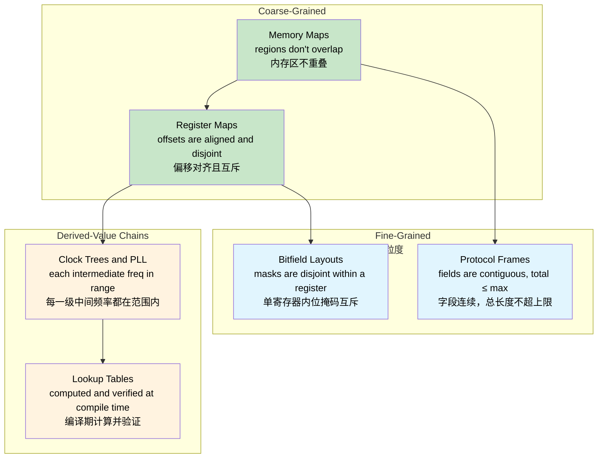
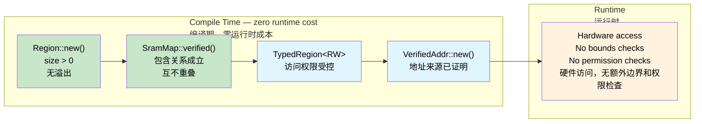

# Const Fn — Compile-Time Correctness Proofs 🟠<br><span class="zh-inline">Const Fn：编译期正确性证明 🟠</span>

> **What you'll learn:** How `const fn` and `assert!` turn the compiler into a proof engine — verifying SRAM memory maps, register layouts, protocol frames, bitfield masks, clock trees, and lookup tables at compile time with zero runtime cost.<br><span class="zh-inline">**本章将学到什么：** `const fn` 和 `assert!` 怎样把编译器变成一台证明机器，在编译期验证 SRAM 内存布局、寄存器布局、协议帧、位域掩码、时钟树和查找表，而且运行时成本仍然为零。</span>
>
> **Cross-references:** [ch04](ch04-capability-tokens-zero-cost-proof-of-aut.md) (capability tokens), [ch06](ch06-dimensional-analysis-making-the-compiler.md) (dimensional analysis), [ch09](ch09-phantom-types-for-resource-tracking.md) (phantom types)<br><span class="zh-inline">**交叉阅读：** [ch04](ch04-capability-tokens-zero-cost-proof-of-aut.md) 里的 capability token，[ch06](ch06-dimensional-analysis-making-the-compiler.md) 里的量纲分析，以及 [ch09](ch09-phantom-types-for-resource-tracking.md) 里的 phantom type。</span>

## The Problem: Memory Maps That Lie<br><span class="zh-inline">问题：会撒谎的内存映射</span>

In embedded and systems programming, memory maps are the foundation of everything — they define where bootloaders, firmware, data sections, and stacks live. Get a boundary wrong, and two subsystems silently corrupt each other. In C, these maps are typically `#define` constants with no structural relationship:<br><span class="zh-inline">在嵌入式和系统编程里，内存映射几乎是一切的地基。bootloader 放哪，固件放哪，数据段和栈放哪，全都靠它。一旦边界算错了，两个子系统就会悄悄互相踩内存。在 C 里，这种映射通常就是一堆彼此没有结构关系的 `#define` 常量。</span>

```c
/* STM32F4 SRAM layout — 256 KB at 0x20000000 */
#define SRAM_BASE       0x20000000
#define SRAM_SIZE       (256 * 1024)

#define BOOT_BASE       0x20000000
#define BOOT_SIZE       (16 * 1024)

#define FW_BASE         0x20004000
#define FW_SIZE         (128 * 1024)

#define DATA_BASE       0x20024000
#define DATA_SIZE       (80 * 1024)     /* Someone bumped this from 64K to 80K */

#define STACK_BASE      0x20038000
#define STACK_SIZE      (48 * 1024)     /* 0x20038000 + 48K = 0x20044000 — past SRAM end! */
```

The bug: `16 + 128 + 80 + 48 = 272 KB`, but SRAM is only 256 KB. The stack extends 16 KB past the end of physical memory. No compiler warning, no linker error, no runtime check — just silent corruption when the stack grows into unmapped space.<br><span class="zh-inline">问题就在这儿：`16 + 128 + 80 + 48 = 272 KB`，可 SRAM 总共只有 256 KB。栈直接越过了物理内存末尾 16 KB。编译器不会警告，链接器也不会报错，运行时更不会主动拦，最后就是栈往上长的时候悄悄踩进未映射空间。</span>

**Every failure mode is discovered after deployment** — potentially as a mysterious crash that only happens under heavy stack usage, weeks after the data section was resized.<br><span class="zh-inline">**这类故障几乎都是部署之后才暴露**：比如数据段改大几周以后，某天在线上高栈压力场景下突然崩一次，查起来还特别邪门。</span>

## Const Fn: Turning the Compiler into a Proof Engine<br><span class="zh-inline">Const Fn：把编译器变成证明机器</span>

Rust's `const fn` functions can run at compile time. When a `const fn` panics during compile-time evaluation, the panic becomes a **compile error**. Combined with `assert!`, this turns the compiler into a theorem prover for your invariants:<br><span class="zh-inline">Rust 的 `const fn` 可以在编译期执行。如果某个 `const fn` 在编译期求值时 panic，这个 panic 会直接变成**编译错误**。再配上 `assert!`，编译器就能替一组不变量做证明。</span>

```rust
pub const fn checked_add(a: u32, b: u32) -> u32 {
    let sum = a as u64 + b as u64;
    assert!(sum <= u32::MAX as u64, "overflow");
    sum as u32
}

// ✅ Compiles — 100 + 200 fits in u32
const X: u32 = checked_add(100, 200);

// ❌ Compile error: "overflow"
// const Y: u32 = checked_add(u32::MAX, 1);

fn main() {
    println!("{X}");
}
```

> **The key insight:** `const fn` + `assert!` = a proof obligation. Each assertion is a theorem that the compiler must verify. If the proof fails, the program does not compile. No test suite needed, no code review catch — the compiler itself is the auditor.<br><span class="zh-inline">**关键点：** `const fn` 加 `assert!`，本质上就是一条证明义务。每一个断言，都是一条必须由编译器验证通过的定理。证明失败，程序就别编了。用不着测试兜底，也不用等代码审查人眼去抓，编译器自己就是审计员。</span>

## Building a Verified SRAM Memory Map<br><span class="zh-inline">构建一个经过验证的 SRAM 内存映射</span>

### The Region Type<br><span class="zh-inline">`Region` 类型</span>

A `Region` represents a contiguous block of memory. Its constructor is a `const fn` that enforces basic validity:<br><span class="zh-inline">`Region` 表示一段连续内存。它的构造函数本身就是一个 `const fn`，会顺手把最基础的合法性约束一起验证掉。</span>

```rust
#[derive(Debug, Clone, Copy)]
pub struct Region {
    pub base: u32,
    pub size: u32,
}

impl Region {
    /// Create a region. Panics at compile time if invariants fail.
    pub const fn new(base: u32, size: u32) -> Self {
        assert!(size > 0, "region size must be non-zero");
        assert!(
            base as u64 + size as u64 <= u32::MAX as u64,
            "region overflows 32-bit address space"
        );
        Self { base, size }
    }

    pub const fn end(&self) -> u32 {
        self.base + self.size
    }

    /// True if `inner` fits entirely within `self`.
    pub const fn contains(&self, inner: &Region) -> bool {
        inner.base >= self.base && inner.end() <= self.end()
    }

    /// True if two regions share any addresses.
    pub const fn overlaps(&self, other: &Region) -> bool {
        self.base < other.end() && other.base < self.end()
    }

    /// True if `addr` falls within this region.
    pub const fn contains_addr(&self, addr: u32) -> bool {
        addr >= self.base && addr < self.end()
    }
}

// Every Region is born valid — you cannot construct an invalid one
const R: Region = Region::new(0x2000_0000, 1024);

fn main() {
    println!("Region: {:#010X}..{:#010X}", R.base, R.end());
}
```

Every `Region` is born valid. You simply cannot construct an instance that already violates the most basic invariants.<br><span class="zh-inline">每一个 `Region` 从出生起就是合法的。最基本的约束都过不去的实例，根本造不出来。</span>

### The Verified Memory Map<br><span class="zh-inline">经过验证的内存映射</span>

Now we compose regions into a full SRAM map. The constructor proves six overlap-freedom invariants and four containment invariants — all at compile time:<br><span class="zh-inline">接下来把若干 `Region` 组合成完整的 SRAM 映射。这个构造函数会在编译期证明 6 条“互不重叠”约束和 4 条“必须被总内存包含”约束。</span>

```rust
# #[derive(Debug, Clone, Copy)]
# pub struct Region { pub base: u32, pub size: u32 }
# impl Region {
#     pub const fn new(base: u32, size: u32) -> Self {
#         assert!(size > 0, "region size must be non-zero");
#         assert!(base as u64 + size as u64 <= u32::MAX as u64, "overflow");
#         Self { base, size }
#     }
#     pub const fn end(&self) -> u32 { self.base + self.size }
#     pub const fn contains(&self, inner: &Region) -> bool {
#         inner.base >= self.base && inner.end() <= self.end()
#     }
#     pub const fn overlaps(&self, other: &Region) -> bool {
#         self.base < other.end() && other.base < self.end()
#     }
# }
pub struct SramMap {
    pub total:      Region,
    pub bootloader: Region,
    pub firmware:   Region,
    pub data:       Region,
    pub stack:      Region,
}

impl SramMap {
    pub const fn verified(
        total: Region,
        bootloader: Region,
        firmware: Region,
        data: Region,
        stack: Region,
    ) -> Self {
        // ── Containment: every sub-region fits within total SRAM ──
        assert!(total.contains(&bootloader), "bootloader exceeds SRAM");
        assert!(total.contains(&firmware),   "firmware exceeds SRAM");
        assert!(total.contains(&data),       "data section exceeds SRAM");
        assert!(total.contains(&stack),      "stack exceeds SRAM");

        // ── Overlap freedom: no pair of sub-regions shares an address ──
        assert!(!bootloader.overlaps(&firmware), "bootloader/firmware overlap");
        assert!(!bootloader.overlaps(&data),     "bootloader/data overlap");
        assert!(!bootloader.overlaps(&stack),    "bootloader/stack overlap");
        assert!(!firmware.overlaps(&data),       "firmware/data overlap");
        assert!(!firmware.overlaps(&stack),      "firmware/stack overlap");
        assert!(!data.overlaps(&stack),          "data/stack overlap");

        Self { total, bootloader, firmware, data, stack }
    }
}

// ✅ All 10 invariants verified at compile time — zero runtime cost
const SRAM: SramMap = SramMap::verified(
    Region::new(0x2000_0000, 256 * 1024),   // 256 KB total SRAM
    Region::new(0x2000_0000,  16 * 1024),   // bootloader: 16 KB
    Region::new(0x2000_4000, 128 * 1024),   // firmware:  128 KB
    Region::new(0x2002_4000,  64 * 1024),   // data:       64 KB
    Region::new(0x2003_4000,  48 * 1024),   // stack:      48 KB
);

fn main() {
    println!("SRAM:  {:#010X} — {} KB", SRAM.total.base, SRAM.total.size / 1024);
    println!("Boot:  {:#010X} — {} KB", SRAM.bootloader.base, SRAM.bootloader.size / 1024);
    println!("FW:    {:#010X} — {} KB", SRAM.firmware.base, SRAM.firmware.size / 1024);
    println!("Data:  {:#010X} — {} KB", SRAM.data.base, SRAM.data.size / 1024);
    println!("Stack: {:#010X} — {} KB", SRAM.stack.base, SRAM.stack.size / 1024);
}
```

Ten compile-time checks, zero runtime instructions. The binary contains only the verified constants.<br><span class="zh-inline">10 条检查都发生在编译期，运行时一条额外指令都没有。二进制里最终留下的只是那组已经验证通过的常量。</span>

### Breaking the Map<br><span class="zh-inline">把映射故意弄坏会怎样</span>

Suppose someone increases the data section from 64 KB to 80 KB without adjusting anything else:<br><span class="zh-inline">假设有人把数据段从 64 KB 改成了 80 KB，却没同步调整其他区域：</span>

```rust,ignore
// ❌ Does not compile
const BAD_SRAM: SramMap = SramMap::verified(
    Region::new(0x2000_0000, 256 * 1024),
    Region::new(0x2000_0000,  16 * 1024),
    Region::new(0x2000_4000, 128 * 1024),
    Region::new(0x2002_4000,  80 * 1024),   // 80 KB — 16 KB too large
    Region::new(0x2003_8000,  48 * 1024),   // stack pushed past SRAM end
);
```

The compiler reports:<br><span class="zh-inline">编译器会直接报：</span>

```text
error[E0080]: evaluation of constant value failed
  --> src/main.rs:38:9
   |
38 |         assert!(total.contains(&stack), "stack exceeds SRAM");
   |         ^^^^^^^^^^^^^^^^^^^^^^^^^^^^^^^^^^^^^^^^^^^^^^^^^^^^^
   |         the evaluated program panicked at 'stack exceeds SRAM'
```

> **The bug that would have been a mysterious field failure is now a compile error.** No unit test needed, no code review catch — the compiler proves it impossible. Compare this to C, where the same bug would ship silently and surface as a stack corruption months later in the field.<br><span class="zh-inline">**原本会在线上变成神秘现场故障的 bug，现在直接变成编译错误。** 不用等单元测试，不用靠代码审查去碰运气，编译器直接证明它不成立。要是换成 C，这种问题往往会悄悄出货，几个月后在线上以栈损坏的形式才冒出来。</span>

## Layering Access Control with Phantom Types<br><span class="zh-inline">用 Phantom Types 叠加访问控制</span>

Combine `const fn` verification with phantom-typed access permissions to enforce read/write constraints at the type level:<br><span class="zh-inline">把 `const fn` 的值验证和 phantom type 的访问权限控制叠在一起，就能在类型层面约束读写权限。</span>

```rust
use std::marker::PhantomData;

pub struct ReadOnly;
pub struct ReadWrite;

pub struct TypedRegion<Access> {
    base: u32,
    size: u32,
    _access: PhantomData<Access>,
}

impl<A> TypedRegion<A> {
    pub const fn new(base: u32, size: u32) -> Self {
        assert!(size > 0, "region size must be non-zero");
        Self { base, size, _access: PhantomData }
    }
}

// Read is available for any access level
fn read_word<A>(region: &TypedRegion<A>, offset: u32) -> u32 {
    assert!(offset + 4 <= region.size, "read out of bounds");
    // In real firmware: unsafe { core::ptr::read_volatile((region.base + offset) as *const u32) }
    0 // stub
}

// Write requires ReadWrite — the function signature enforces it
fn write_word(region: &TypedRegion<ReadWrite>, offset: u32, value: u32) {
    assert!(offset + 4 <= region.size, "write out of bounds");
    // In real firmware: unsafe { core::ptr::write_volatile(...) }
    let _ = value; // stub
}

const BOOTLOADER: TypedRegion<ReadOnly>  = TypedRegion::new(0x2000_0000, 16 * 1024);
const DATA:       TypedRegion<ReadWrite> = TypedRegion::new(0x2002_4000, 64 * 1024);

fn main() {
    read_word(&BOOTLOADER, 0);      // ✅ read from read-only region
    read_word(&DATA, 0);            // ✅ read from read-write region
    write_word(&DATA, 0, 42);       // ✅ write to read-write region
    // write_word(&BOOTLOADER, 0, 42); // ❌ Compile error: expected ReadWrite, found ReadOnly
}
```

The bootloader region is physically writeable, but the type system forbids accidental writes. That difference between **hardware capability** and **software permission** is exactly the kind of correctness boundary this book cares about.<br><span class="zh-inline">bootloader 那块物理上也许仍然是可写的，但类型系统会禁止误写。这种 **硬件能力** 和 **软件许可** 之间的区分，正是本书一直在强调的正确性边界。</span>

## Pointer Provenance: Proving Addresses Belong to Regions<br><span class="zh-inline">指针来源证明：证明地址确实属于某个区域</span>

Going one step further, we can create verified addresses — values that are statically proven to lie within a specific region:<br><span class="zh-inline">再往前走一步，还可以构造“经过验证的地址”类型，也就是那些在编译期就已经被证明落在某个特定区域里的地址值。</span>

```rust
# #[derive(Debug, Clone, Copy)]
# pub struct Region { pub base: u32, pub size: u32 }
# impl Region {
#     pub const fn new(base: u32, size: u32) -> Self {
#         assert!(size > 0);
#         assert!(base as u64 + size as u64 <= u32::MAX as u64);
#         Self { base, size }
#     }
#     pub const fn end(&self) -> u32 { self.base + self.size }
#     pub const fn contains_addr(&self, addr: u32) -> bool {
#         addr >= self.base && addr < self.end()
#     }
# }
/// An address proven at compile time to lie within a Region.
pub struct VerifiedAddr {
    addr: u32, // private — can only be created through the checked constructor
}

impl VerifiedAddr {
    /// Panics at compile time if `addr` is outside `region`.
    pub const fn new(region: &Region, addr: u32) -> Self {
        assert!(region.contains_addr(addr), "address outside region");
        Self { addr }
    }

    pub const fn raw(&self) -> u32 {
        self.addr
    }
}

const DATA: Region = Region::new(0x2002_4000, 64 * 1024);

// ✅ Proven at compile time to be inside the data region
const STATUS_WORD: VerifiedAddr = VerifiedAddr::new(&DATA, 0x2002_4000);
const CONFIG_WORD: VerifiedAddr = VerifiedAddr::new(&DATA, 0x2002_5000);

// ❌ Would not compile: address is in the bootloader region, not data
// const BAD_ADDR: VerifiedAddr = VerifiedAddr::new(&DATA, 0x2000_0000);

fn main() {
    println!("Status register at {:#010X}", STATUS_WORD.raw());
    println!("Config register at {:#010X}", CONFIG_WORD.raw());
}
```

**Provenance established at compile time** means no repeated runtime bounds check when touching those addresses. Because the constructor is private, a `VerifiedAddr` can only exist if the compiler already proved it valid.<br><span class="zh-inline">**来源关系在编译期就已经证明完毕**，意味着后续访问这些地址时不必重复做运行时边界检查。又因为构造函数是私有受控的，`VerifiedAddr` 只会在编译器已经证明它合法的情况下存在。</span>

## Beyond Memory Maps<br><span class="zh-inline">不止内存映射</span>

The `const fn` proof pattern applies wherever you have compile-time-known values with structural invariants. The SRAM example proved inter-region properties such as containment and non-overlap. The same technique scales into progressively finer-grained domains:<br><span class="zh-inline">只要场景里存在“编译期已知的值”以及它们之间的结构性不变量，`const fn` 证明模式就能派上用场。前面的 SRAM 例子验证的是区域之间的包含关系和互不重叠关系，而同样的做法还能一路推广到更细的层级。</span>



Each subsection below follows the same pattern: define a type whose `const fn` constructor encodes the invariants, then trigger verification through a `const` binding or a `const _: () = { ... }` block.<br><span class="zh-inline">下面每个小节都沿用同一套路：先定义一个类型，让它的 `const fn` 构造函数把不变量写进去，然后再通过 `const` 绑定或 `const _: () = { ... }` 这样的块把验证真正触发起来。</span>

### Register Maps<br><span class="zh-inline">寄存器映射</span>

Hardware register blocks have fixed offsets and widths. A misaligned or overlapping register definition is always a bug:<br><span class="zh-inline">硬件寄存器块有固定偏移和固定宽度。只要出现错位对齐或者互相重叠，基本百分之百就是 bug。</span>

```rust
#[derive(Debug, Clone, Copy)]
pub struct Register {
    pub offset: u32,
    pub width: u32,
}

impl Register {
    pub const fn new(offset: u32, width: u32) -> Self {
        assert!(
            width == 1 || width == 2 || width == 4,
            "register width must be 1, 2, or 4 bytes"
        );
        assert!(offset % width == 0, "register must be naturally aligned");
        Self { offset, width }
    }

    pub const fn end(&self) -> u32 {
        self.offset + self.width
    }
}

const fn disjoint(a: &Register, b: &Register) -> bool {
    a.end() <= b.offset || b.end() <= a.offset
}

// UART peripheral registers
const DATA:   Register = Register::new(0x00, 4);
const STATUS: Register = Register::new(0x04, 4);
const CTRL:   Register = Register::new(0x08, 4);
const BAUD:   Register = Register::new(0x0C, 4);

// Compile-time proof: no register overlaps another
const _: () = {
    assert!(disjoint(&DATA,   &STATUS));
    assert!(disjoint(&DATA,   &CTRL));
    assert!(disjoint(&DATA,   &BAUD));
    assert!(disjoint(&STATUS, &CTRL));
    assert!(disjoint(&STATUS, &BAUD));
    assert!(disjoint(&CTRL,   &BAUD));
};

fn main() {
    println!("UART DATA:   offset={:#04X}, width={}", DATA.offset, DATA.width);
    println!("UART STATUS: offset={:#04X}, width={}", STATUS.offset, STATUS.width);
}
```

Notice the `const _: () = { ... };` idiom. It is an unnamed constant whose only job is to run compile-time assertions and stop compilation if one fails.<br><span class="zh-inline">注意这里的 `const _: () = { ... };` 写法。它本质上就是一个匿名常量，唯一使命就是在编译期执行这些断言，只要其中有一条失败，整个编译就会停下。</span>

#### Mini-Exercise: SPI Register Bank<br><span class="zh-inline">小练习：SPI 寄存器组</span>

Given these SPI controller registers, add const-fn assertions proving:<br><span class="zh-inline">针对一组 SPI 控制器寄存器，补上 `const fn` 断言，证明下面三件事：</span>
1. Every register is naturally aligned<br><span class="zh-inline">每个寄存器都满足自然对齐</span>
2. No two registers overlap<br><span class="zh-inline">任意两个寄存器都不重叠</span>
3. All registers fit within a 64-byte register block<br><span class="zh-inline">所有寄存器都落在 64 字节寄存器块范围内</span>

<details>
<summary>Hint <span class="zh-inline">提示</span></summary>

Reuse the `Register` and `disjoint` helpers from the UART example. Define three or four `const Register` values and assert the three properties.<br><span class="zh-inline">直接复用 UART 例子里的 `Register` 和 `disjoint` 辅助函数就行。定义三四个 `const Register` 值，然后分别断言这三条性质。</span>

</details>

### Protocol Frame Layouts<br><span class="zh-inline">协议帧布局</span>

Network or bus protocol frames have fields at specific offsets. The `then()` method makes contiguity structural — gaps and overlaps are impossible by construction:<br><span class="zh-inline">网络协议帧或总线协议帧里的字段都处在固定偏移位置上。`then()` 这个方法把“字段连续”变成了结构本身的性质，于是空洞和重叠都会在构造阶段被挡住。</span>

```rust
#[derive(Debug, Clone, Copy)]
pub struct Field {
    pub offset: usize,
    pub size: usize,
}

impl Field {
    pub const fn new(offset: usize, size: usize) -> Self {
        assert!(size > 0, "field size must be non-zero");
        Self { offset, size }
    }

    pub const fn end(&self) -> usize {
        self.offset + self.size
    }

    /// Create the next field immediately after this one.
    pub const fn then(&self, size: usize) -> Field {
        Field::new(self.end(), size)
    }
}

const MAX_FRAME: usize = 256;

const HEADER:  Field = Field::new(0, 4);
const SEQ_NUM: Field = HEADER.then(2);
const PAYLOAD: Field = SEQ_NUM.then(246);
const CRC:     Field = PAYLOAD.then(4);

// Compile-time proof: frame fits within maximum size
const _: () = assert!(CRC.end() <= MAX_FRAME, "frame exceeds maximum size");

fn main() {
    println!("Header:  [{}..{})", HEADER.offset, HEADER.end());
    println!("SeqNum:  [{}..{})", SEQ_NUM.offset, SEQ_NUM.end());
    println!("Payload: [{}..{})", PAYLOAD.offset, PAYLOAD.end());
    println!("CRC:     [{}..{})", CRC.offset, CRC.end());
    println!("Total:   {}/{} bytes", CRC.end(), MAX_FRAME);
}
```

Fields are contiguous by construction — each one starts exactly where the previous one ends. The final assertion proves the whole frame still fits within the protocol's maximum size.<br><span class="zh-inline">字段天然连续，因为每个新字段都从前一个字段的末尾开始。最后那条断言则证明整张帧仍然没有超过协议允许的最大尺寸。</span>

### Inline Const Blocks for Generic Validation<br><span class="zh-inline">用内联 `const` 块验证泛型参数</span>

Since Rust 1.79, `const { ... }` blocks can validate const-generic parameters right at the point of use. This is especially convenient for DMA buffer sizes or alignment rules:<br><span class="zh-inline">从 Rust 1.79 开始，`const { ... }` 代码块可以直接在使用点验证 const generic 参数。这种写法特别适合 DMA 缓冲区大小、对齐规则之类的约束。</span>

```rust,ignore
fn dma_transfer<const N: usize>(buf: &[u8; N]) {
    const { assert!(N % 4 == 0, "DMA buffer must be 4-byte aligned in size") };
    const { assert!(N <= 65536, "DMA transfer exceeds maximum size") };
    // ... initiate transfer ...
}

dma_transfer(&[0u8; 1024]);   // ✅ 1024 is divisible by 4 and ≤ 65536
// dma_transfer(&[0u8; 1023]); // ❌ Compile error: not 4-byte aligned
```

Those assertions run when the function is monomorphised, so each concrete `N` gets its own compile-time check.<br><span class="zh-inline">这些断言会在函数单态化时执行，所以每一个具体的 `N` 都会触发自己那一份编译期检查。</span>

### Bitfield Layouts Within a Register<br><span class="zh-inline">单个寄存器内部的位域布局</span>

Register maps prove that registers don't overlap each other. But what about the bits inside a single register? If two bitfields share the same bit position, read/write logic silently corrupts itself. A `const fn` can prove that each field's mask is disjoint from the others:<br><span class="zh-inline">寄存器映射能证明寄存器和寄存器之间不重叠，但单个寄存器内部的位怎么办？如果两个位域抢了同一位，读写逻辑就会悄悄互相覆盖。`const fn` 同样可以证明这些字段掩码彼此互斥。</span>

```rust
#[derive(Debug, Clone, Copy)]
pub struct BitField {
    pub mask: u32,
    pub shift: u8,
}

impl BitField {
    pub const fn new(shift: u8, width: u8) -> Self {
        assert!(width > 0, "bit field width must be non-zero");
        assert!(shift as u32 + width as u32 <= 32, "bit field exceeds 32-bit register");
        // Build mask: `width` ones starting at bit `shift`
        let mask = ((1u64 << width as u64) - 1) as u32;
        Self { mask: mask << shift as u32, shift }
    }

    pub const fn positioned_mask(&self) -> u32 {
        self.mask
    }

    pub const fn encode(&self, value: u32) -> u32 {
        assert!(value & !( self.mask >> self.shift as u32 ) == 0, "value exceeds field width");
        value << self.shift as u32
    }
}

const fn fields_disjoint(a: &BitField, b: &BitField) -> bool {
    a.positioned_mask() & b.positioned_mask() == 0
}

// SPI Control Register fields: enable[0], mode[1:2], clock_div[4:7], irq_en[8]
const SPI_EN:     BitField = BitField::new(0, 1);   // bit 0
const SPI_MODE:   BitField = BitField::new(1, 2);   // bits 1–2
const SPI_CLKDIV: BitField = BitField::new(4, 4);   // bits 4–7
const SPI_IRQ:    BitField = BitField::new(8, 1);   // bit 8

// Compile-time proof: no field shares a bit position
const _: () = {
    assert!(fields_disjoint(&SPI_EN,   &SPI_MODE));
    assert!(fields_disjoint(&SPI_EN,   &SPI_CLKDIV));
    assert!(fields_disjoint(&SPI_EN,   &SPI_IRQ));
    assert!(fields_disjoint(&SPI_MODE, &SPI_CLKDIV));
    assert!(fields_disjoint(&SPI_MODE, &SPI_IRQ));
    assert!(fields_disjoint(&SPI_CLKDIV, &SPI_IRQ));
};

fn main() {
    let ctrl = SPI_EN.encode(1)
             | SPI_MODE.encode(0b10)
             | SPI_CLKDIV.encode(0b0110)
             | SPI_IRQ.encode(1);
    println!("SPI_CTRL = {:#010b} ({:#06X})", ctrl, ctrl);
}
```

This complements the register-map proof: register maps handle inter-register disjointness, while bitfield layouts handle intra-register disjointness.<br><span class="zh-inline">这和前面的寄存器映射证明正好互补：寄存器映射证明的是寄存器与寄存器之间互斥，位域布局证明的是单个寄存器内部各字段彼此互斥。</span>

### Clock Tree / PLL Configuration<br><span class="zh-inline">时钟树与 PLL 配置</span>

Microcontrollers derive clocks through multiplier/divider chains. A PLL may compute `f_vco = f_in × N / M`, and each intermediate frequency has to stay within hardware limits. These constraints are perfect for `const fn`:<br><span class="zh-inline">微控制器的时钟通常来自一串乘法器和除法器。PLL 可能会算出 `f_vco = f_in × N / M`，而且每一级中间频率都必须落在硬件允许范围内。这种链式约束简直就是 `const fn` 的主场。</span>

```rust
#[derive(Debug, Clone, Copy)]
pub struct PllConfig {
    pub input_khz: u32,     // external oscillator
    pub m: u32,             // input divider
    pub n: u32,             // VCO multiplier
    pub p: u32,             // system clock divider
}

impl PllConfig {
    pub const fn verified(input_khz: u32, m: u32, n: u32, p: u32) -> Self {
        // Input divider produces the PLL input frequency
        let pll_input = input_khz / m;
        assert!(pll_input >= 1_000 && pll_input <= 2_000,
            "PLL input must be 1–2 MHz");

        // VCO frequency must be within hardware limits
        let vco = pll_input as u64 * n as u64;
        assert!(vco >= 192_000 && vco <= 432_000,
            "VCO must be 192–432 MHz");

        // System clock divider must be even (hardware constraint)
        assert!(p == 2 || p == 4 || p == 6 || p == 8,
            "P must be 2, 4, 6, or 8");

        // Final system clock
        let sysclk = vco / p as u64;
        assert!(sysclk <= 168_000,
            "system clock exceeds 168 MHz maximum");

        Self { input_khz, m, n, p }
    }

    pub const fn vco_khz(&self) -> u32 {
        (self.input_khz / self.m) * self.n
    }

    pub const fn sysclk_khz(&self) -> u32 {
        self.vco_khz() / self.p
    }
}

// STM32F4 with 8 MHz HSE crystal → 168 MHz system clock
const PLL: PllConfig = PllConfig::verified(8_000, 8, 336, 2);

// ❌ Would not compile: VCO = 480 MHz exceeds 432 MHz limit
// const BAD: PllConfig = PllConfig::verified(8_000, 8, 480, 2);

fn main() {
    println!("VCO:    {} MHz", PLL.vco_khz() / 1_000);
    println!("SYSCLK: {} MHz", PLL.sysclk_khz() / 1_000);
}
```

If the parameters violate a limit, the compiler points directly at the broken assertion in the chain.<br><span class="zh-inline">只要参数越界，编译器就会直接指向那条失败的约束。不是等最终时钟结果错了才知道，而是在链条中间哪一步破了，错误就停在哪一步。</span>

```text
error[E0080]: evaluation of constant value failed
  --> src/main.rs:18:9
   |
18 |         assert!(vco >= 192_000 && vco <= 432_000,
   |         ^^^^^^^^^^^^^^^^^^^^^^^^^^^^^^^^^^^^^^^^^
   |         the evaluated program panicked at 'VCO must be 192–432 MHz'
```

> **Derived-value constraint chains turn a single `const fn` into a multi-stage proof.** Changing one parameter immediately exposes whichever downstream stage now violates hardware limits.<br><span class="zh-inline">**派生值约束链会把一个 `const fn` 变成多阶段证明。** 只要改动其中一个参数，后面哪一级越界，编译器就会立刻把它掀出来。</span>

### Compile-Time Lookup Tables<br><span class="zh-inline">编译期查找表</span>

`const fn` can compute entire lookup tables during compilation and place them in `.rodata` with zero startup cost. This is useful for CRC tables, trigonometric tables, encoding maps, and error-correction logic:<br><span class="zh-inline">`const fn` 还能在编译期直接把整张查找表算出来，并把结果塞进 `.rodata`，启动成本为零。CRC 表、三角函数表、编码映射、纠错表之类的东西都特别适合这样干。</span>

```rust
const fn crc32_table() -> [u32; 256] {
    let mut table = [0u32; 256];
    let mut i: usize = 0;
    while i < 256 {
        let mut crc = i as u32;
        let mut j = 0;
        while j < 8 {
            if crc & 1 != 0 {
                crc = (crc >> 1) ^ 0xEDB8_8320; // standard CRC-32 polynomial
            } else {
                crc >>= 1;
            }
            j += 1;
        }
        table[i] = crc;
        i += 1;
    }
    table
}

/// Full CRC-32 table — computed at compile time, placed in .rodata
const CRC32_TABLE: [u32; 256] = crc32_table();

/// Compute CRC-32 over a byte slice at runtime using the precomputed table.
fn crc32(data: &[u8]) -> u32 {
    let mut crc: u32 = !0;
    for &byte in data {
        let index = ((crc ^ byte as u32) & 0xFF) as usize;
        crc = (crc >> 8) ^ CRC32_TABLE[index];
    }
    !crc
}

// Smoke-test: well-known CRC-32 of "123456789"
const _: () = {
    // Verify a single table entry at compile time
    assert!(CRC32_TABLE[0] == 0x0000_0000);
    assert!(CRC32_TABLE[1] == 0x7707_3096);
};

fn main() {
    let check = crc32(b"123456789");
    // Known CRC-32 of "123456789" is 0xCBF43926
    assert_eq!(check, 0xCBF4_3926);
    println!("CRC-32 of '123456789' = {:#010X} ✓", check);
    println!("Table size: {} entries × 4 bytes = {} bytes in .rodata",
        CRC32_TABLE.len(), CRC32_TABLE.len() * 4);
}
```

The whole table is computed before the program ever starts. Compared with a C approach that relies on startup initialization or external code generation, this keeps the table verified, baked in, and free of runtime setup work.<br><span class="zh-inline">整张表在程序启动之前就已经算好了。相比某些 C 项目依赖启动阶段初始化或者外部代码生成脚本的做法，这种方式既把结果直接烘进二进制，又让验证过程留在编译期完成，运行时完全不用额外准备。</span>

## When to Use Const Fn Proofs<br><span class="zh-inline">什么时候适合用 Const Fn 证明</span>

| Scenario<br><span class="zh-inline">场景</span> | Recommendation<br><span class="zh-inline">建议</span> |
|----------|:---:|
| Memory maps, register offsets, partition tables<br><span class="zh-inline">内存映射、寄存器偏移、分区表</span> | ✅ Always<br><span class="zh-inline">✅ 基本都该用</span> |
| Protocol frame layouts with fixed fields<br><span class="zh-inline">固定字段协议帧布局</span> | ✅ Always<br><span class="zh-inline">✅ 基本都该用</span> |
| Bitfield masks within a register<br><span class="zh-inline">寄存器内位域掩码</span> | ✅ Always<br><span class="zh-inline">✅ 基本都该用</span> |
| Clock tree / PLL parameter chains<br><span class="zh-inline">时钟树和 PLL 参数链</span> | ✅ Always<br><span class="zh-inline">✅ 基本都该用</span> |
| Lookup tables (CRC, trig, encoding)<br><span class="zh-inline">查找表，如 CRC、三角函数、编码表</span> | ✅ Always — zero startup cost<br><span class="zh-inline">✅ 很适合，而且启动成本为零</span> |
| Constants with cross-value invariants<br><span class="zh-inline">常量之间存在交叉约束</span> | ✅ Always<br><span class="zh-inline">✅ 很适合</span> |
| Configuration values known at compile time<br><span class="zh-inline">编译期已知的配置值</span> | ✅ When possible<br><span class="zh-inline">✅ 能用就用</span> |
| Values computed from user input or files<br><span class="zh-inline">来自用户输入或文件的数据</span> | ❌ Use runtime validation<br><span class="zh-inline">❌ 改用运行时校验</span> |
| Highly dynamic structures<br><span class="zh-inline">高度动态的数据结构</span> | ❌ Use property-based testing<br><span class="zh-inline">❌ 改用性质测试之类的方法</span> |
| Single-value range checks<br><span class="zh-inline">单值范围检查</span> | ⚠️ Consider newtype + `From`<br><span class="zh-inline">⚠️ 可以考虑 newtype 加 `From`</span> |

### Cost Summary<br><span class="zh-inline">成本汇总</span>

| What<br><span class="zh-inline">内容</span> | Runtime cost<br><span class="zh-inline">运行时成本</span> |
|------|:------:|
| `const fn` assertions (`assert!`, `panic!`)<br><span class="zh-inline">`const fn` 里的断言</span> | Compile time only — 0 instructions<br><span class="zh-inline">只发生在编译期，运行时零指令</span> |
| `const _: () = { ... }` validation blocks<br><span class="zh-inline">匿名 `const` 校验块</span> | Compile time only — not in binary<br><span class="zh-inline">只存在于编译期，不进最终二进制</span> |
| `Region`, `Register`, `Field` structs<br><span class="zh-inline">`Region`、`Register`、`Field` 这些结构</span> | Plain data — same as raw integers<br><span class="zh-inline">只是普通数据，布局和原始整数差不多</span> |
| Inline `const { }` generic validation<br><span class="zh-inline">内联 `const { }` 泛型校验</span> | Monomorphised at compile time — 0 cost<br><span class="zh-inline">单态化时完成，运行时零成本</span> |
| Lookup tables like `crc32_table()`<br><span class="zh-inline">查找表</span> | Computed at compile time — placed in `.rodata`<br><span class="zh-inline">编译期算好，直接放进 `.rodata`</span> |
| Phantom-typed access markers<br><span class="zh-inline">phantom type 访问标记</span> | Zero-sized — optimised away<br><span class="zh-inline">零尺寸，会被优化掉</span> |

Every row above is zero runtime cost. The proofs live only during compilation; the binary only carries the already-verified values.<br><span class="zh-inline">上面这些手段的共同点就是：证明过程全部发生在编译期，运行时不背额外负担。最终二进制只带着那些已经验证过的值往前跑。</span>

## Exercise: Flash Partition Map<br><span class="zh-inline">练习：Flash 分区映射</span>

Design a verified flash partition map for a 1 MB NOR flash starting at `0x0800_0000`. Requirements:<br><span class="zh-inline">为一块起始地址为 `0x0800_0000` 的 1 MB NOR Flash 设计一张经过验证的分区映射。要求如下：</span>

1. Four partitions: **bootloader** (64 KB), **application** (640 KB), **config** (64 KB), **OTA staging** (256 KB)<br><span class="zh-inline">四个分区：**bootloader** 64 KB，**application** 640 KB，**config** 64 KB，**OTA staging** 256 KB</span>
2. Every partition must be **4 KB aligned**<br><span class="zh-inline">每个分区都必须按 **4 KB** 对齐</span>
3. No partition may overlap another<br><span class="zh-inline">任意两个分区都不能重叠</span>
4. All partitions must fit within flash<br><span class="zh-inline">所有分区都必须落在整块 Flash 范围内</span>
5. Add a `const fn total_used()` and assert it equals 1 MB<br><span class="zh-inline">补一个 `const fn total_used()`，并断言总使用量刚好等于 1 MB</span>

<details>
<summary>Solution <span class="zh-inline">参考答案</span></summary>

```rust
#[derive(Debug, Clone, Copy)]
pub struct FlashRegion {
    pub base: u32,
    pub size: u32,
}

impl FlashRegion {
    pub const fn new(base: u32, size: u32) -> Self {
        assert!(size > 0, "partition size must be non-zero");
        assert!(base % 4096 == 0, "partition base must be 4 KB aligned");
        assert!(size % 4096 == 0, "partition size must be 4 KB aligned");
        assert!(
            base as u64 + size as u64 <= u32::MAX as u64,
            "partition overflows address space"
        );
        Self { base, size }
    }

    pub const fn end(&self) -> u32 { self.base + self.size }

    pub const fn contains(&self, inner: &FlashRegion) -> bool {
        inner.base >= self.base && inner.end() <= self.end()
    }

    pub const fn overlaps(&self, other: &FlashRegion) -> bool {
        self.base < other.end() && other.base < self.end()
    }
}

pub struct FlashMap {
    pub total:  FlashRegion,
    pub boot:   FlashRegion,
    pub app:    FlashRegion,
    pub config: FlashRegion,
    pub ota:    FlashRegion,
}

impl FlashMap {
    pub const fn verified(
        total: FlashRegion,
        boot: FlashRegion,
        app: FlashRegion,
        config: FlashRegion,
        ota: FlashRegion,
    ) -> Self {
        assert!(total.contains(&boot),   "bootloader exceeds flash");
        assert!(total.contains(&app),    "application exceeds flash");
        assert!(total.contains(&config), "config exceeds flash");
        assert!(total.contains(&ota),    "OTA staging exceeds flash");

        assert!(!boot.overlaps(&app),    "boot/app overlap");
        assert!(!boot.overlaps(&config), "boot/config overlap");
        assert!(!boot.overlaps(&ota),    "boot/ota overlap");
        assert!(!app.overlaps(&config),  "app/config overlap");
        assert!(!app.overlaps(&ota),     "app/ota overlap");
        assert!(!config.overlaps(&ota),  "config/ota overlap");

        Self { total, boot, app, config, ota }
    }

    pub const fn total_used(&self) -> u32 {
        self.boot.size + self.app.size + self.config.size + self.ota.size
    }
}

const FLASH: FlashMap = FlashMap::verified(
    FlashRegion::new(0x0800_0000, 1024 * 1024),  // 1 MB total
    FlashRegion::new(0x0800_0000,   64 * 1024),   // bootloader: 64 KB
    FlashRegion::new(0x0801_0000,  640 * 1024),   // application: 640 KB
    FlashRegion::new(0x080B_0000,   64 * 1024),   // config: 64 KB
    FlashRegion::new(0x080C_0000,  256 * 1024),   // OTA staging: 256 KB
);

// Every byte of flash is accounted for
const _: () = assert!(
    FLASH.total_used() == 1024 * 1024,
    "partitions must exactly fill flash"
);

fn main() {
    println!("Flash map: {} KB used / {} KB total",
        FLASH.total_used() / 1024,
        FLASH.total.size / 1024);
}
```

</details>



## Key Takeaways<br><span class="zh-inline">本章要点</span>

1. **`const fn` + `assert!` = compile-time proof obligation**.<br><span class="zh-inline">**`const fn` 加 `assert!` 就是一条编译期证明义务**。</span>
2. **Memory maps are ideal candidates** — containment, overlap freedom, total-size limits, and alignment all fit naturally.<br><span class="zh-inline">**内存映射特别适合这套方法**：包含关系、互不重叠、总尺寸限制、对齐约束都能自然表达。</span>
3. **Phantom types layer on top** — value verification and permission verification can be combined.<br><span class="zh-inline">**phantom type 可以继续往上叠**：值合法性验证和权限合法性验证能一起做。</span>
4. **Provenance can be established at compile time** — `VerifiedAddr` is a concrete example.<br><span class="zh-inline">**地址来源关系也能在编译期建立**：`VerifiedAddr` 就是现成例子。</span>
5. **The pattern generalises well** — register maps, bitfields, protocol frames, PLL chains, DMA parameters all fit.<br><span class="zh-inline">**这套模式的泛化能力很强**：寄存器映射、位域、协议帧、PLL 链、DMA 参数都能套进来。</span>
6. **Lookup tables become compile-time assets** — no generator, no startup init, no runtime overhead.<br><span class="zh-inline">**查找表也能变成编译期资产**：不需要生成脚本，不需要启动初始化，也没有运行时开销。</span>
7. **Inline `const { }` blocks are great for const generics**.<br><span class="zh-inline">**内联 `const { }` 块非常适合校验 const generics**。</span>

***
