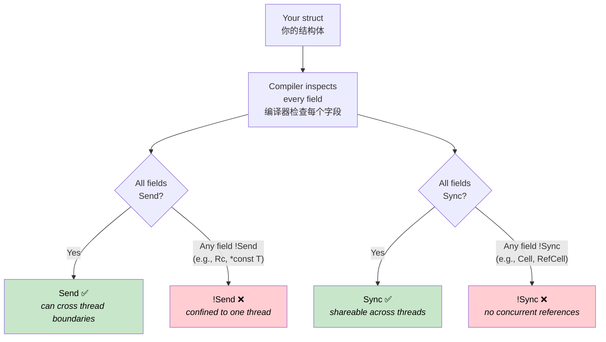
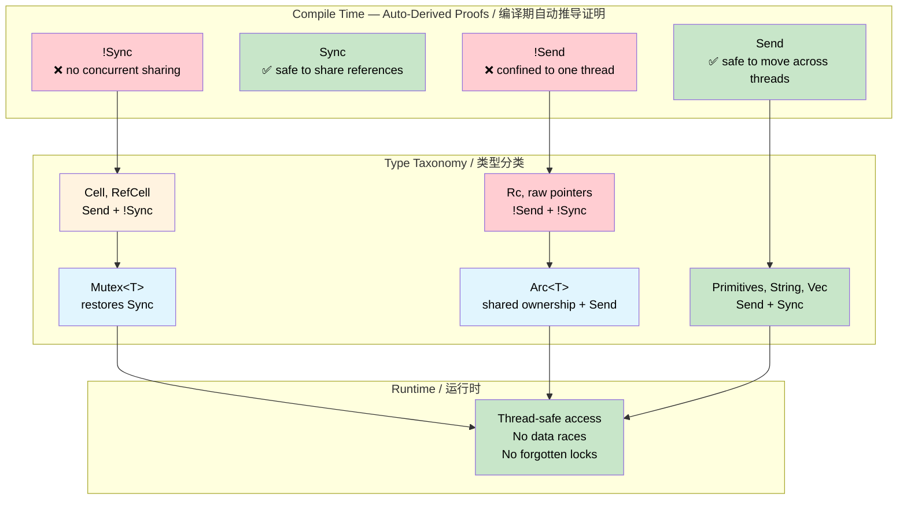

# Send & Sync — Compile-Time Concurrency Proofs 🟠<br><span class="zh-inline">Send 与 Sync：编译期并发证明 🟠</span>

> **What you'll learn:** How Rust's `Send` and `Sync` auto-traits turn the compiler into a concurrency auditor — proving at compile time which types can cross thread boundaries and which can be shared, with zero runtime cost.<br><span class="zh-inline">**本章将学到什么：** Rust 的 `Send` 和 `Sync` 自动 trait，怎样把编译器变成并发审计员，在编译期证明哪些类型可以跨线程移动、哪些类型可以被共享，而且运行时没有额外成本。</span>
>
> **Cross-references:** [ch04](ch04-capability-tokens-zero-cost-proof-of-aut.md) (capability tokens), [ch09](ch09-phantom-types-for-resource-tracking.md) (phantom types), [ch15](ch15-const-fn-compile-time-correctness-proofs.md) (const fn proofs)<br><span class="zh-inline">**交叉阅读：** [ch04](ch04-capability-tokens-zero-cost-proof-of-aut.md) 讲 capability token，[ch09](ch09-phantom-types-for-resource-tracking.md) 讲 phantom type，[ch15](ch15-const-fn-compile-time-correctness-proofs.md) 讲 const fn 证明。</span>

## The Problem: Concurrent Access Without a Safety Net<br><span class="zh-inline">问题：没有安全网的并发访问</span>

In systems programming, peripherals, shared buffers, and global state are accessed from multiple contexts — main loops, interrupt handlers, DMA callbacks, and worker threads. In C, the compiler offers no enforcement whatsoever:<br><span class="zh-inline">在系统编程里，外设、共享缓冲区和全局状态经常会被多个上下文同时访问，比如主循环、中断处理函数、DMA 回调和工作线程。放在 C 里，编译器对这件事基本完全不管：</span>

```c
/* Shared sensor buffer — accessed from main loop and ISR */
volatile uint32_t sensor_buf[64];
volatile uint32_t buf_index = 0;

void SENSOR_IRQHandler(void) {
    sensor_buf[buf_index++] = read_sensor();  /* Race: buf_index read + write */
}

void process_sensors(void) {
    for (uint32_t i = 0; i < buf_index; i++) {  /* buf_index changes mid-loop */
        process(sensor_buf[i]);                   /* Data overwritten mid-read */
    }
    buf_index = 0;                                /* ISR fires between these lines */
}
```

The `volatile` keyword prevents the compiler from optimizing away the reads, but it does **nothing** about data races. Two contexts can read and write `buf_index` simultaneously, producing torn values, lost updates, or buffer overruns. The same problem appears with `pthread_mutex_t` — the compiler will happily let you forget to lock:<br><span class="zh-inline">`volatile` 只能阻止编译器把读写优化掉，但它对数据竞争 **毫无帮助**。两个上下文依然可以同时读写 `buf_index`，结果就是撕裂值、更新丢失，或者直接把缓冲区顶爆。`pthread_mutex_t` 也是一样，编译器根本不会拦着忘记加锁这种事：</span>

```c
pthread_mutex_t lock;
int shared_counter;

void increment(void) {
    shared_counter++;  /* Oops — forgot pthread_mutex_lock(&lock) */
}
```

**Every concurrent bug is discovered at runtime** — typically under load, in production, and intermittently.<br><span class="zh-inline">**所有并发 bug 都只能在运行时暴露**，而且往往是在高负载、生产环境、偶发时机下才炸，最烦的那种。</span>

## What Send and Sync Prove<br><span class="zh-inline">Send 和 Sync 到底证明了什么</span>

Rust defines two marker traits that the compiler derives automatically:<br><span class="zh-inline">Rust 定义了两个由编译器自动推导的标记 trait：</span>

| Trait | Proof<br><span class="zh-inline">证明内容</span> | Informal meaning<br><span class="zh-inline">直白理解</span> |
|-------|-------|-------------------|
| `Send` | A value of type `T` can be safely **moved** to another thread<br><span class="zh-inline">类型 `T` 的值可以被安全地**移动**到另一个线程</span> | "This can cross a thread boundary"<br><span class="zh-inline">“这个东西可以跨线程边界”</span> |
| `Sync` | A **shared reference** `&T` can be safely used by multiple threads<br><span class="zh-inline">共享引用 `&T` 可以被多个线程安全地同时使用</span> | "This can be read from multiple threads"<br><span class="zh-inline">“这个东西可以被多线程共享读取”</span> |

These are **auto-traits** — the compiler derives them by inspecting every field. A struct is `Send` if all its fields are `Send`. A struct is `Sync` if all its fields are `Sync`. If any field opts out, the entire struct opts out. No annotation needed, no runtime overhead — the proof is structural.<br><span class="zh-inline">它们属于 **auto-trait**。编译器会通过检查每一个字段来自动推导。一个结构体想成为 `Send`，它的所有字段都得是 `Send`；想成为 `Sync`，它的所有字段都得是 `Sync`。只要有一个字段退出，整个结构体就跟着退出。整个证明过程完全基于结构本身，不需要手写标注，也没有运行时开销。</span>



> **The compiler is the auditor.** In C, thread-safety annotations live in comments and header documentation — advisory, never enforced. In Rust, `Send` and `Sync` are derived from the structure of the type itself. Adding a single `Cell<f32>` field automatically makes the containing struct `!Sync`. No programmer action required, no way to forget.<br><span class="zh-inline">**编译器才是审计员。** 在 C 里，线程安全说明通常只存在于注释和头文件文档里，最多算建议，从来不会被强制执行。Rust 则不一样，`Send` 和 `Sync` 是直接从类型结构里推导出来的。只要往结构体里塞一个 `Cell<f32>`，整个类型就会自动变成 `!Sync`。不需要开发者额外做事，也不存在“忘了声明”的空间。</span>

The two traits are linked by a key identity:<br><span class="zh-inline">这两个 trait 之间有一条非常关键的等价关系：</span>

> **`T` is `Sync` if and only if `&T` is `Send`.**<br><span class="zh-inline">**当且仅当 `&T` 是 `Send` 时，`T` 才是 `Sync`。**</span>

This makes intuitive sense: if a shared reference can be safely sent to another thread, then the underlying type is safe for concurrent reads.<br><span class="zh-inline">这条关系其实很直观：如果一个共享引用可以安全地发到另一个线程，那就说明底层类型本身适合被并发读取。</span>

### Types That Opt Out<br><span class="zh-inline">主动退出的类型</span>

Certain types are deliberately `!Send` or `!Sync`:<br><span class="zh-inline">有些类型会故意退出 `Send` 或 `Sync`：</span>

| Type | Send | Sync | Why<br><span class="zh-inline">原因</span> |
|------|:----:|:----:|-----|
| `u32`, `String`, `Vec<T>` | ✅ | ✅ | No interior mutability, no raw pointers<br><span class="zh-inline">没有无同步内部可变性，也没有裸指针</span> |
| `Cell<T>`, `RefCell<T>` | ✅ | ❌ | Interior mutability without synchronization<br><span class="zh-inline">内部可变，但没有同步手段</span> |
| `Rc<T>` | ❌ | ❌ | Reference count is not atomic<br><span class="zh-inline">引用计数不是原子的</span> |
| `*const T`, `*mut T` | ❌ | ❌ | Raw pointers have no safety guarantees<br><span class="zh-inline">裸指针不带安全保证</span> |
| `Arc<T>` (where `T: Send + Sync`) | ✅ | ✅ | Atomic reference count<br><span class="zh-inline">原子引用计数</span> |
| `Mutex<T>` (where `T: Send`) | ✅ | ✅ | Lock serializes all access<br><span class="zh-inline">锁会把访问串行化</span> |

Every ❌ in this table is a **compile-time invariant**. You cannot accidentally send an `Rc` to another thread — the compiler rejects it.<br><span class="zh-inline">表里每一个 ❌ 都是**编译期不变量**。比如 `Rc`，根本不存在“手滑发到另一个线程”这种可能，编译器会当场把它打回去。</span>

## !Send Peripheral Handles<br><span class="zh-inline">`!Send` 的外设句柄</span>

In embedded systems, a peripheral register block lives at a fixed memory address and should only be accessed from a single execution context. Raw pointers are inherently `!Send` and `!Sync`, so wrapping one automatically opts the containing type out of both traits:<br><span class="zh-inline">在嵌入式系统里，外设寄存器块通常固定在某个内存地址上，而且就该只在单一执行上下文里访问。裸指针天然就是 `!Send` 和 `!Sync`，所以只要把它包进一个类型里，这个类型就会自动退出这两个 trait。</span>

```rust
/// A handle to a memory-mapped UART peripheral.
/// The raw pointer makes this automatically !Send and !Sync.
pub struct Uart {
    regs: *const u32,
}

impl Uart {
    pub fn new(base: usize) -> Self {
        Self { regs: base as *const u32 }
    }

    pub fn write_byte(&self, byte: u8) {
        // In real firmware: unsafe { write_volatile(self.regs.add(DATA_OFFSET), byte as u32) }
        println!("UART TX: {:#04X}", byte);
    }
}

fn main() {
    let uart = Uart::new(0x4000_1000);
    uart.write_byte(b'A');  // ✅ Use on the creating thread

    // ❌ Would not compile: Uart is !Send
    // std::thread::spawn(move || {
    //     uart.write_byte(b'B');
    // });
}
```

The commented-out `thread::spawn` would produce:<br><span class="zh-inline">上面注释掉的 `thread::spawn` 会报出这样的错误：</span>

```text
error[E0277]: `*const u32` cannot be sent between threads safely
   |
   |     std::thread::spawn(move || {
   |     ^^^^^^^^^^^^^^^^^^ within `Uart`, the trait `Send` is not
   |                        implemented for `*const u32`
```

**No raw pointer? Use `PhantomData`.** Sometimes a type has no raw pointer but should still be confined to one thread — for example, a file descriptor index or a handle obtained from a C library:<br><span class="zh-inline">**没有裸指针怎么办？那就用 `PhantomData`。** 有些类型虽然内部没有裸指针，但语义上仍然应该被限制在单线程里，比如某个文件描述符索引，或者从 C 库拿回来的句柄：</span>

```rust
use std::marker::PhantomData;

/// An opaque handle from a C library. PhantomData<*const ()> makes it
/// !Send + !Sync even though the inner fd is just a plain integer.
pub struct LibHandle {
    fd: i32,
    _not_send: PhantomData<*const ()>,
}

impl LibHandle {
    pub fn open(path: &str) -> Self {
        let _ = path;
        Self { fd: 42, _not_send: PhantomData }
    }

    pub fn fd(&self) -> i32 { self.fd }
}

fn main() {
    let handle = LibHandle::open("/dev/sensor0");
    println!("fd = {}", handle.fd());

    // ❌ Would not compile: LibHandle is !Send
    // std::thread::spawn(move || { let _ = handle.fd(); });
}
```

This is the compile-time equivalent of C's "please read the documentation that says this handle isn't thread-safe." In Rust, the compiler enforces it.<br><span class="zh-inline">这就是 C 里那种“请仔细阅读文档，本句柄不是线程安全的”的编译期版本。区别是，Rust 不靠文档吓唬人，而是直接让编译器执行这条规则。</span>

## Mutex Transforms !Sync into Sync<br><span class="zh-inline">`Mutex` 怎样把 `!Sync` 变成 `Sync`</span>

`Cell<T>` and `RefCell<T>` provide interior mutability without any synchronization — so they're `!Sync`. But sometimes you genuinely need to share mutable state across threads. `Mutex<T>` adds the missing synchronization, and the compiler recognizes this:<br><span class="zh-inline">`Cell<T>` 和 `RefCell<T>` 提供了内部可变性，但没有任何同步手段，所以它们是 `!Sync`。可现实里又经常需要跨线程共享可变状态。这个时候 `Mutex<T>` 会把缺失的同步补上，而编译器也认这个账：</span>

> **If `T: Send`, then `Mutex<T>: Send + Sync`.**<br><span class="zh-inline">**如果 `T: Send`，那么 `Mutex<T>` 就会是 `Send + Sync`。**</span>

The lock serializes all access, so the `!Sync` inner type becomes safe to share. The compiler proves this structurally — no runtime check for "did the programmer remember to lock":<br><span class="zh-inline">锁把所有访问串行化以后，原本 `!Sync` 的内部类型也就变得可以安全共享了。这个结论也是编译器按结构推出来的，而不是运行时再去检查“程序员到底记没记得加锁”。</span>

```rust
use std::sync::{Arc, Mutex};
use std::cell::Cell;

/// A sensor cache using Cell for interior mutability.
/// Cell<u32> is !Sync — can't be shared across threads directly.
struct SensorCache {
    last_reading: Cell<u32>,
    reading_count: Cell<u32>,
}

fn main() {
    // Mutex makes SensorCache safe to share — compiler proves it
    let cache = Arc::new(Mutex::new(SensorCache {
        last_reading: Cell::new(0),
        reading_count: Cell::new(0),
    }));

    let handles: Vec<_> = (0..4).map(|i| {
        let c = Arc::clone(&cache);
        std::thread::spawn(move || {
            let guard = c.lock().unwrap();  // Must lock before access
            guard.last_reading.set(i * 10);
            guard.reading_count.set(guard.reading_count.get() + 1);
        })
    }).collect();

    for h in handles { h.join().unwrap(); }

    let guard = cache.lock().unwrap();
    println!("Last reading: {}", guard.last_reading.get());
    println!("Total reads:  {}", guard.reading_count.get());
}
```

Compare to the C version: `pthread_mutex_lock` is a runtime call that the programmer can forget. Here, the type system makes it impossible to access `SensorCache` without going through the `Mutex`. The proof is structural — the only runtime cost is the lock itself.<br><span class="zh-inline">和 C 版本比一下就明白了。`pthread_mutex_lock` 只是一个运行时调用，人可以忘。这里的类型系统则直接把路堵死了：想碰 `SensorCache`，就必须先穿过 `Mutex`。整个证明是结构性的，唯一的运行时成本就是那把锁本身。</span>

> **`Mutex` doesn't just synchronize — it proves synchronization.** `Mutex::lock()` returns a `MutexGuard` that `Deref`s to `&T`. There is no way to obtain a reference to the inner data without going through the lock. The API makes "forgot to lock" structurally unrepresentable.<br><span class="zh-inline">**`Mutex` 不只是提供同步，它还证明了同步已经发生。** `Mutex::lock()` 会返回一个 `MutexGuard`，后者再通过 `Deref` 暴露 `&T`。也就是说，根本没有捷径能绕开锁直接拿到内部引用。“忘记加锁”这件事，在 API 结构上就变成了不可表达。</span>

## Function Bounds as Theorems<br><span class="zh-inline">把函数约束当成定理</span>

`std::thread::spawn` has this signature:<br><span class="zh-inline">`std::thread::spawn` 的签名是这样的：</span>

```rust,ignore
pub fn spawn<F, T>(f: F) -> JoinHandle<T>
where
    F: FnOnce() -> T + Send + 'static,
    T: Send + 'static,
```

The `Send + 'static` bound isn't just an implementation detail — it's a **theorem**:<br><span class="zh-inline">这里的 `Send + 'static` 约束，不只是实现细节，它本身就是一个**定理**：</span>

> "Any closure and return value passed to `spawn` is proven at compile time to be safe to run on another thread, with no dangling references."<br><span class="zh-inline">“凡是传给 `spawn` 的闭包和返回值，都已经在编译期被证明：它们可以安全地运行在另一个线程里，而且不会留下悬垂引用。”</span>

You can apply the same pattern to your own APIs:<br><span class="zh-inline">同样的套路，也可以原样用到自己的 API 上：</span>

```rust
use std::sync::mpsc;

/// Run a task on a background thread and return its result.
/// The bounds prove: the closure and its result are thread-safe.
fn run_on_background<F, T>(task: F) -> T
where
    F: FnOnce() -> T + Send + 'static,
    T: Send + 'static,
{
    let (tx, rx) = mpsc::channel();
    std::thread::spawn(move || {
        let _ = tx.send(task());
    });
    rx.recv().expect("background task panicked")
}

fn main() {
    // ✅ u32 is Send, closure captures nothing non-Send
    let result = run_on_background(|| 6 * 7);
    println!("Result: {result}");

    // ✅ String is Send
    let greeting = run_on_background(|| String::from("hello from background"));
    println!("{greeting}");

    // ❌ Would not compile: Rc is !Send
    // use std::rc::Rc;
    // let data = Rc::new(42);
    // run_on_background(move || *data);
}
```

Uncommenting the `Rc` example produces a precise diagnostic:<br><span class="zh-inline">如果把 `Rc` 那段放开，编译器会给出非常精准的报错：</span>

```text
error[E0277]: `Rc<i32>` cannot be sent between threads safely
   --> src/main.rs
    |
    |     run_on_background(move || *data);
    |     ^^^^^^^^^^^^^^^^^^ `Rc<i32>` cannot be sent between threads safely
    |
note: required by a bound in `run_on_background`
    |
    |     F: FnOnce() -> T + Send + 'static,
    |                        ^^^^ required by this bound
```

The compiler traces the violation back to the exact bound — and tells the programmer *why*. Compare to C's `pthread_create`:<br><span class="zh-inline">编译器会一路把问题追溯到那个精确的约束上，并且明明白白说出*为什么*不行。对比一下 C 里的 `pthread_create`：</span>

```c
int pthread_create(pthread_t *thread, const pthread_attr_t *attr,
                   void *(*start_routine)(void *), void *arg);
```

The `void *arg` accepts anything — thread-safe or not. The C compiler can't distinguish a non-atomic refcount from a plain integer. Rust's trait bounds make the distinction at the type level.<br><span class="zh-inline">`void *arg` 什么都能塞进去，线程安全也好，不安全也好，统统一样。C 编译器当然也分不出“一个非原子引用计数”跟“一个普通整数”到底有什么本质区别。Rust 的 trait bound 则是从类型层面就把它们拆开了。</span>

## When to Use Send/Sync Proofs<br><span class="zh-inline">什么时候该依赖 Send/Sync 证明</span>

| Scenario<br><span class="zh-inline">场景</span> | Approach<br><span class="zh-inline">做法</span> |
|----------|----------|
| Peripheral handle wrapping a raw pointer<br><span class="zh-inline">包着裸指针的外设句柄</span> | Automatic `!Send + !Sync` — nothing to do<br><span class="zh-inline">天然就是 `!Send + !Sync`，基本不用额外操作</span> |
| Handle from C library (integer fd/handle)<br><span class="zh-inline">来自 C 库的句柄，比如整数 fd</span> | Add `PhantomData<*const ()>` for `!Send + !Sync`<br><span class="zh-inline">加一个 `PhantomData<*const ()>`，显式退出 `Send/Sync`</span> |
| Shared config behind a lock<br><span class="zh-inline">放在锁后面的共享配置</span> | `Arc<Mutex<T>>` — compiler proves access is safe<br><span class="zh-inline">用 `Arc<Mutex<T>>`，让编译器证明访问安全</span> |
| Cross-thread message passing<br><span class="zh-inline">跨线程消息传递</span> | `mpsc::channel` — `Send` bound enforced automatically<br><span class="zh-inline">用 `mpsc::channel`，`Send` 约束会自动生效</span> |
| Task spawner or thread pool API<br><span class="zh-inline">任务调度器或线程池 API</span> | Require `F: Send + 'static` in signature<br><span class="zh-inline">在签名里显式要求 `F: Send + 'static`</span> |
| Single-threaded resource (e.g., GPU context)<br><span class="zh-inline">必须单线程使用的资源，比如 GPU context</span> | `PhantomData<*const ()>` to prevent sharing<br><span class="zh-inline">用 `PhantomData<*const ()>` 阻止跨线程共享</span> |
| Type should be `Send` but contains a raw pointer<br><span class="zh-inline">类型内部有裸指针，但整体语义上又应该是 `Send`</span> | `unsafe impl Send` with documented safety justification<br><span class="zh-inline">写 `unsafe impl Send`，并且把安全理由写清楚</span> |

### Cost Summary<br><span class="zh-inline">成本总结</span>

| What<br><span class="zh-inline">项目</span> | Runtime cost<br><span class="zh-inline">运行时成本</span> |
|------|:------:|
| `Send` / `Sync` auto-derivation<br><span class="zh-inline">`Send` / `Sync` 自动推导</span> | Compile time only — 0 bytes<br><span class="zh-inline">只发生在编译期，0 字节</span> |
| `PhantomData<*const ()>` field<br><span class="zh-inline">`PhantomData<*const ()>` 字段</span> | Zero-sized — optimised away<br><span class="zh-inline">零尺寸，会被优化掉</span> |
| `!Send` / `!Sync` enforcement<br><span class="zh-inline">`!Send` / `!Sync` 约束执行</span> | Compile time only — no runtime check<br><span class="zh-inline">只发生在编译期，没有运行时检查</span> |
| `F: Send + 'static` function bounds<br><span class="zh-inline">`F: Send + 'static` 这类函数约束</span> | Monomorphised — static dispatch, no boxing<br><span class="zh-inline">单态化，静态分发，不需要装箱</span> |
| `Mutex<T>` lock<br><span class="zh-inline">`Mutex<T>` 的锁</span> | Runtime lock (unavoidable for shared mutation)<br><span class="zh-inline">运行时锁开销，但这是共享可变状态绕不过去的成本</span> |
| `Arc<T>` reference counting<br><span class="zh-inline">`Arc<T>` 的引用计数</span> | Atomic increment/decrement (unavoidable for shared ownership)<br><span class="zh-inline">原子增减计数，这也是共享所有权不可避免的成本</span> |

The first four rows are **zero-cost** — they exist only in the type system and vanish after compilation. `Mutex` and `Arc` carry unavoidable runtime costs, but those costs are the *minimum* any correct concurrent program must pay — Rust just makes sure you pay them.<br><span class="zh-inline">前四项都属于**零成本**，因为它们只活在类型系统里，编译后就没了。`Mutex` 和 `Arc` 确实有运行时成本，但那本来就是任何正确并发程序都必须付出的最低代价。Rust 做的事情只是确保这笔成本真的被付了，而不是假装没事。</span>

## Exercise: DMA Transfer Guard<br><span class="zh-inline">练习：DMA 传输守卫</span>

Design a `DmaTransfer<T>` that holds a buffer while a DMA transfer is in flight. Requirements:<br><span class="zh-inline">设计一个 `DmaTransfer<T>`，在 DMA 传输进行时持有缓冲区。要求如下：</span>

1. `DmaTransfer` must be `!Send` — the DMA controller uses physical addresses tied to this core's memory bus<br><span class="zh-inline">`DmaTransfer` 必须是 `!Send`，因为 DMA 控制器使用的是绑定到当前核心内存总线的物理地址</span>
2. `DmaTransfer` must be `!Sync` — concurrent reads while DMA is writing would see torn data<br><span class="zh-inline">`DmaTransfer` 也必须是 `!Sync`，因为 DMA 正在写的时候并发读取会看到撕裂数据</span>
3. Provide a `wait()` method that **consumes** the guard and returns the buffer — ownership proves the transfer is complete<br><span class="zh-inline">提供一个 `wait()` 方法，它要**消费**这个 guard 并把缓冲区还回来，也就是通过所有权来证明传输已经完成</span>
4. The buffer type `T` must implement a `DmaSafe` marker trait<br><span class="zh-inline">缓冲区类型 `T` 必须实现 `DmaSafe` 标记 trait</span>

<details>
<summary>Solution<br><span class="zh-inline">参考答案</span></summary>

```rust
use std::marker::PhantomData;

/// Marker trait for types that can be used as DMA buffers.
/// In real firmware: type must be repr(C) with no padding.
trait DmaSafe {}

impl DmaSafe for [u8; 64] {}
impl DmaSafe for [u8; 256] {}

/// A guard representing an in-flight DMA transfer.
/// !Send + !Sync: can't be sent to another thread or shared.
pub struct DmaTransfer<T: DmaSafe> {
    buffer: T,
    channel: u8,
    _no_send_sync: PhantomData<*const ()>,
}

impl<T: DmaSafe> DmaTransfer<T> {
    /// Start a DMA transfer. The buffer is consumed — no one else can touch it.
    pub fn start(buffer: T, channel: u8) -> Self {
        // In real firmware: configure DMA channel, set source/dest, start transfer
        println!("DMA channel {} started", channel);
        Self {
            buffer,
            channel,
            _no_send_sync: PhantomData,
        }
    }

    /// Wait for the transfer to complete and return the buffer.
    /// Consumes self — the guard no longer exists after this.
    pub fn wait(self) -> T {
        // In real firmware: poll DMA status register until complete
        println!("DMA channel {} complete", self.channel);
        self.buffer
    }
}

fn main() {
    let buf = [0u8; 64];

    // Start transfer — buf is moved into the guard
    let transfer = DmaTransfer::start(buf, 2);

    // ❌ buf is no longer accessible — ownership prevents use-during-DMA
    // println!("{:?}", buf);

    // ❌ Would not compile: DmaTransfer is !Send
    // std::thread::spawn(move || { transfer.wait(); });

    // ✅ Wait on the original thread, get the buffer back
    let buf = transfer.wait();
    println!("Buffer recovered: {} bytes", buf.len());
}
```

</details>



## Key Takeaways<br><span class="zh-inline">本章要点</span>

1. **`Send` and `Sync` are compile-time proofs about concurrency safety** — the compiler derives them structurally by inspecting every field. No annotation, no runtime cost, no opt-in needed.<br><span class="zh-inline">**`Send` 和 `Sync` 是并发安全的编译期证明**：编译器会通过检查每个字段的结构自动推导出来，不需要额外标注，也没有运行时成本，更不需要手工 opt-in。</span>
2. **Raw pointers automatically opt out** — any type containing `*const T` or `*mut T` becomes `!Send + !Sync`. This makes peripheral handles naturally thread-confined.<br><span class="zh-inline">**裸指针会自动退出**：任何包含 `*const T` 或 `*mut T` 的类型，都会变成 `!Send + !Sync`，这让外设句柄天然被限制在单线程上下文里。</span>
3. **`PhantomData<*const ()>` is the explicit opt-out** — when a type has no raw pointer but should still be thread-confined (C library handles, GPU contexts), a phantom field does the job.<br><span class="zh-inline">**`PhantomData<*const ()>` 是显式退出的手段**：如果某个类型内部没有裸指针，但语义上仍然该限制在线程内，比如 C 库句柄、GPU context，那就用 phantom 字段把它钉住。</span>
4. **`Mutex<T>` restores `Sync` with proof** — the compiler structurally proves that all access goes through the lock. Unlike C's `pthread_mutex_t`, you cannot forget to lock.<br><span class="zh-inline">**`Mutex<T>` 可以带着证明恢复 `Sync`**：编译器会按结构证明，所有访问都必须经过这把锁。和 C 的 `pthread_mutex_t` 不一样，这里根本不存在“忘记加锁”的通道。</span>
5. **Function bounds are theorems** — `F: Send + 'static` in a spawner's signature is a compile-time proof obligation: every call site must prove its closure is thread-safe. Compare to C's `void *arg` which accepts anything.<br><span class="zh-inline">**函数约束本身就是定理**：在线程调度器签名里写 `F: Send + 'static`，本质上就是要求每个调用点都证明自己的闭包线程安全。相比之下，C 里的 `void *arg` 是什么都敢接。</span>
6. **The pattern complements all other correctness techniques** — typestate proves protocol sequencing, phantom types prove permissions, `const fn` proves value invariants, and `Send`/`Sync` prove concurrency safety. Together they cover the full correctness surface.<br><span class="zh-inline">**这套模式和其他正确性技术是互补关系**：typestate 证明协议顺序，phantom type 证明权限，`const fn` 证明值不变量，`Send`/`Sync` 证明并发安全。它们拼在一起，基本就把“正确性表面”全包住了。</span>

---
