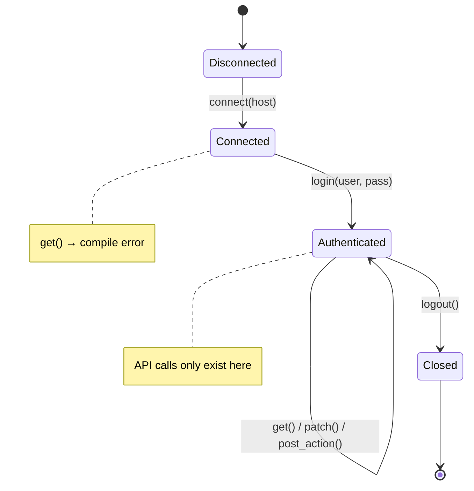
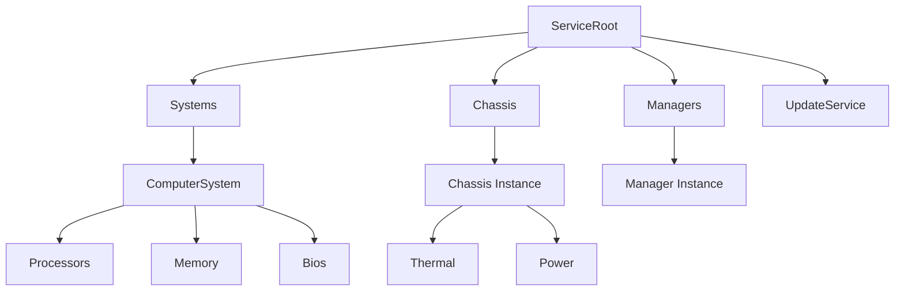
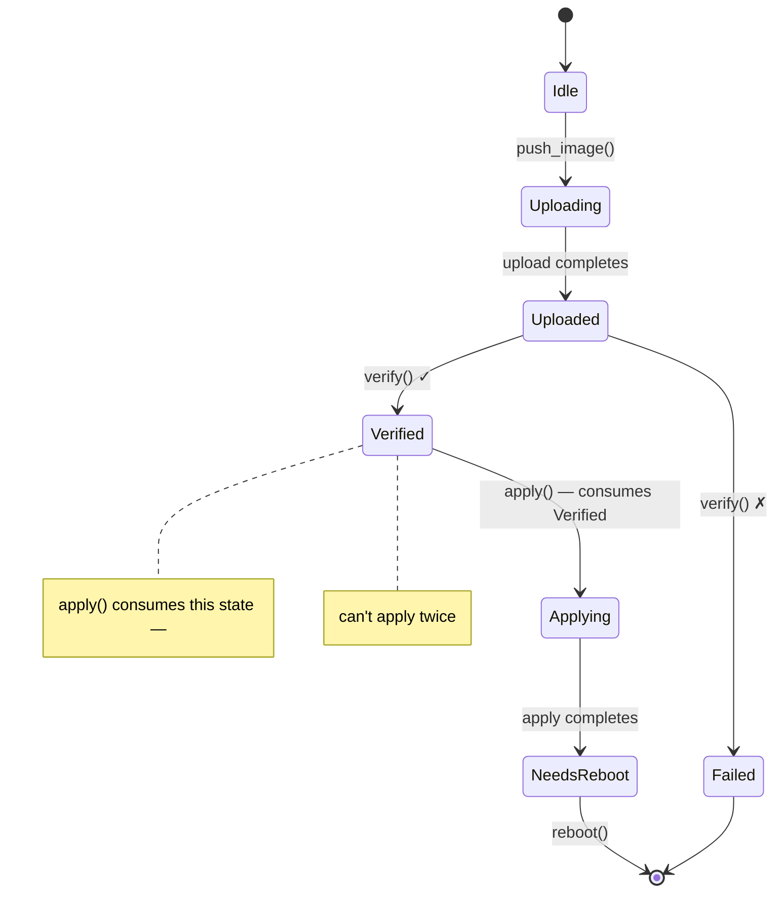

# Applied Walkthrough — Type-Safe Redfish Client 🟡<br><span class="zh-inline">实战演练：类型安全的 Redfish 客户端 🟡</span>

> **What you'll learn:** How to compose type-state sessions, capability tokens, phantom-typed resource navigation, dimensional analysis, validated boundaries, builder type-state, and single-use types into a complete, zero-overhead Redfish client — where every protocol violation is a compile error.<br><span class="zh-inline">**本章将学到什么：** 如何把 type-state 会话、capability token、带 phantom type 的资源导航、量纲分析、边界校验、builder type-state 和一次性类型组合成一个完整且零额外开销的 Redfish 客户端，让协议违规在编译期就直接报错。</span>
>
> **Cross-references:** [ch02](ch02-typed-command-interfaces-request-determi.md) (typed commands), [ch03](ch03-single-use-types-cryptographic-guarantee.md) (single-use types), [ch04](ch04-capability-tokens-zero-cost-proof-of-aut.md) (capability tokens), [ch05](ch05-protocol-state-machines-type-state-for-r.md) (type-state), [ch06](ch06-dimensional-analysis-making-the-compiler.md) (dimensional types), [ch07](ch07-validated-boundaries-parse-dont-validate.md) (validated boundaries), [ch09](ch09-phantom-types-for-resource-tracking.md) (phantom types), [ch10](ch10-putting-it-all-together-a-complete-diagn.md) (IPMI integration), [ch11](ch11-fourteen-tricks-from-the-trenches.md) (trick 4 — builder type-state)<br><span class="zh-inline">**交叉阅读：** [ch02](ch02-typed-command-interfaces-request-determi.md) 的 typed command，[ch03](ch03-single-use-types-cryptographic-guarantee.md) 的一次性类型，[ch04](ch04-capability-tokens-zero-cost-proof-of-aut.md) 的 capability token，[ch05](ch05-protocol-state-machines-type-state-for-r.md) 的 type-state，[ch06](ch06-dimensional-analysis-making-the-compiler.md) 的量纲类型，[ch07](ch07-validated-boundaries-parse-dont-validate.md) 的边界校验，[ch09](ch09-phantom-types-for-resource-tracking.md) 的 phantom type，[ch10](ch10-putting-it-all-together-a-complete-diagn.md) 的 IPMI 集成，以及 [ch11](ch11-fourteen-tricks-from-the-trenches.md) 里的 builder type-state。</span>

## Why Redfish Deserves Its Own Chapter<br><span class="zh-inline">为什么 Redfish 值得单独拿一章来讲</span>

Chapter 10 composes the core patterns around IPMI — a byte-level protocol. But
most BMC platforms now expose a **Redfish** REST API alongside (or instead of)
IPMI, and Redfish introduces its own category of correctness hazards:
<br><span class="zh-inline">第 10 章围绕 IPMI 这个字节级协议串起了核心模式。但现在大多数 BMC 平台都会额外提供，甚至直接改用 **Redfish** REST API。Redfish 带来的正确性问题，和 IPMI 不是一个味道，所以值得单独拎出来讲。</span>

| Hazard<br><span class="zh-inline">隐患</span> | Example<br><span class="zh-inline">例子</span> | Consequence<br><span class="zh-inline">后果</span> |
|--------|---------|-------------|
| Malformed URI<br><span class="zh-inline">URI 写错</span> | `GET /redfish/v1/Chassis/1/Processors` (wrong parent)<br><span class="zh-inline">父资源写错</span> | 404 or wrong data silently returned<br><span class="zh-inline">要么 404，要么悄悄拿到错误数据</span> |
| Action on wrong power state<br><span class="zh-inline">在错误电源状态下执行动作</span> | `Reset(ForceOff)` on an already-off system<br><span class="zh-inline">对已经关机的系统做 `ForceOff`</span> | BMC returns error, or worse, races with another operation<br><span class="zh-inline">BMC 报错，或者更糟，和别的操作发生竞争</span> |
| Missing privilege<br><span class="zh-inline">权限不足</span> | Operator-level code calls `Manager.ResetToDefaults`<br><span class="zh-inline">操作员级代码调用 `Manager.ResetToDefaults`</span> | 403 in production, security audit finding<br><span class="zh-inline">线上 403，安全审计还会点名</span> |
| Incomplete PATCH<br><span class="zh-inline">PATCH 不完整</span> | Omit a required BIOS attribute from a PATCH body<br><span class="zh-inline">PATCH 体里漏了必填 BIOS 字段</span> | Silent no-op or partial config corruption<br><span class="zh-inline">要么静默无效，要么只改一半把配置弄脏</span> |
| Unverified firmware apply<br><span class="zh-inline">固件未校验就应用</span> | `SimpleUpdate` invoked before image integrity check<br><span class="zh-inline">镜像完整性还没验完就调用 `SimpleUpdate`</span> | Bricked BMC<br><span class="zh-inline">直接把 BMC 刷成砖</span> |
| Schema version mismatch<br><span class="zh-inline">Schema 版本不匹配</span> | Access `LastResetTime` on a v1.5 BMC (added in v1.13)<br><span class="zh-inline">在 v1.5 BMC 上访问 v1.13 才有的 `LastResetTime`</span> | `null` field → runtime panic<br><span class="zh-inline">字段是 `null`，运行时直接 panic</span> |
| Unit confusion in telemetry<br><span class="zh-inline">遥测量纲混淆</span> | Compare inlet temperature (°C) to power draw (W)<br><span class="zh-inline">把进风温度和功耗拿来比较</span> | Nonsensical threshold decisions<br><span class="zh-inline">阈值判断彻底没意义</span> |

In C, Python, or untyped Rust, every one of these is prevented by discipline and
testing alone. This chapter makes them **compile errors**.
<br><span class="zh-inline">在 C、Python 或者没建模的 Rust 里，这些问题全靠纪律和测试硬扛；这一章的目标，是把它们改造成 **编译错误**。</span>

## The Untyped Redfish Client<br><span class="zh-inline">未加类型约束的 Redfish 客户端</span>

A typical Redfish client looks like this:<br><span class="zh-inline">一个常见的 Redfish 客户端，大概就是下面这个模样。</span>

```rust,ignore
use std::collections::HashMap;

struct RedfishClient {
    base_url: String,
    token: Option<String>,
}

impl RedfishClient {
    fn get(&self, path: &str) -> Result<serde_json::Value, String> {
        // ... HTTP GET ...
        Ok(serde_json::json!({})) // stub
    }

    fn patch(&self, path: &str, body: &serde_json::Value) -> Result<(), String> {
        // ... HTTP PATCH ...
        Ok(()) // stub
    }

    fn post_action(&self, path: &str, body: &serde_json::Value) -> Result<(), String> {
        // ... HTTP POST ...
        Ok(()) // stub
    }
}

fn check_thermal(client: &RedfishClient) -> Result<(), String> {
    let resp = client.get("/redfish/v1/Chassis/1/Thermal")?;

    // 🐛 Is this field always present? What if the BMC returns null?
    let cpu_temp = resp["Temperatures"][0]["ReadingCelsius"]
        .as_f64().unwrap();

    let fan_rpm = resp["Fans"][0]["Reading"]
        .as_f64().unwrap();

    // 🐛 Comparing °C to RPM — both are f64
    if cpu_temp > fan_rpm {
        println!("thermal issue");
    }

    // 🐛 Is this the right path? No compile-time check.
    client.post_action(
        "/redfish/v1/Systems/1/Actions/ComputerSystem.Reset",
        &serde_json::json!({"ResetType": "ForceOff"})
    )?;

    Ok(())
}
```

This "works" — until it doesn't. Every `unwrap()` is a potential panic, every
string path is an unchecked assumption, and unit confusion is invisible.
<br><span class="zh-inline">这玩意儿表面上能跑，但只是“暂时没炸”。每个 `unwrap()` 都埋着 panic，每条字符串路径都是没经过检查的假设，量纲混淆更是完全看不出来。</span>

---

## Section 1 — Session Lifecycle (Type-State, ch05)<br><span class="zh-inline">第 1 节：会话生命周期</span>

A Redfish session has a strict lifecycle: connect → authenticate → use → close.
Encode each state as a distinct type.<br><span class="zh-inline">Redfish 会话的生命周期很严：connect → authenticate → use → close。把每个阶段编码成不同类型以后，错误状态下能做的事会自然消失。</span>



```rust,ignore
use std::marker::PhantomData;

// ──── Session States ────

pub struct Disconnected;
pub struct Connected;
pub struct Authenticated;

pub struct RedfishSession<S> {
    base_url: String,
    auth_token: Option<String>,
    _state: PhantomData<S>,
}

impl RedfishSession<Disconnected> {
    pub fn new(host: &str) -> Self {
        RedfishSession {
            base_url: format!("https://{}", host),
            auth_token: None,
            _state: PhantomData,
        }
    }

    /// Transition: Disconnected → Connected.
    /// Verifies the service root is reachable.
    pub fn connect(self) -> Result<RedfishSession<Connected>, RedfishError> {
        // GET /redfish/v1 — verify service root
        println!("Connecting to {}/redfish/v1", self.base_url);
        Ok(RedfishSession {
            base_url: self.base_url,
            auth_token: None,
            _state: PhantomData,
        })
    }
}

impl RedfishSession<Connected> {
    /// Transition: Connected → Authenticated.
    /// Creates a session via POST /redfish/v1/SessionService/Sessions.
    pub fn login(
        self,
        user: &str,
        _pass: &str,
    ) -> Result<(RedfishSession<Authenticated>, LoginToken), RedfishError> {
        // POST /redfish/v1/SessionService/Sessions
        println!("Authenticated as {}", user);
        let token = "X-Auth-Token-abc123".to_string();
        Ok((
            RedfishSession {
                base_url: self.base_url,
                auth_token: Some(token),
                _state: PhantomData,
            },
            LoginToken { _private: () },
        ))
    }
}

impl RedfishSession<Authenticated> {
    /// Only available on Authenticated sessions.
    fn http_get(&self, path: &str) -> Result<serde_json::Value, RedfishError> {
        let _url = format!("{}{}", self.base_url, path);
        // ... HTTP GET with auth_token header ...
        Ok(serde_json::json!({})) // stub
    }

    fn http_patch(
        &self,
        path: &str,
        body: &serde_json::Value,
    ) -> Result<serde_json::Value, RedfishError> {
        let _url = format!("{}{}", self.base_url, path);
        let _ = body;
        Ok(serde_json::json!({})) // stub
    }

    fn http_post(
        &self,
        path: &str,
        body: &serde_json::Value,
    ) -> Result<serde_json::Value, RedfishError> {
        let _url = format!("{}{}", self.base_url, path);
        let _ = body;
        Ok(serde_json::json!({})) // stub
    }

    /// Transition: Authenticated → Closed (session consumed).
    pub fn logout(self) {
        // DELETE /redfish/v1/SessionService/Sessions/{id}
        println!("Session closed");
        // self is consumed — can't use the session after logout
    }
}

// Attempting to call http_get on a non-Authenticated session:
//
//   let session = RedfishSession::new("bmc01").connect()?;
//   session.http_get("/redfish/v1/Systems");
//   ❌ ERROR: method `http_get` not found for `RedfishSession<Connected>`

#[derive(Debug)]
pub enum RedfishError {
    ConnectionFailed(String),
    AuthenticationFailed(String),
    HttpError { status: u16, message: String },
    ValidationError(String),
}

impl std::fmt::Display for RedfishError {
    fn fmt(&self, f: &mut std::fmt::Formatter<'_>) -> std::fmt::Result {
        match self {
            Self::ConnectionFailed(msg) => write!(f, "connection failed: {msg}"),
            Self::AuthenticationFailed(msg) => write!(f, "auth failed: {msg}"),
            Self::HttpError { status, message } =>
                write!(f, "HTTP {status}: {message}"),
            Self::ValidationError(msg) => write!(f, "validation: {msg}"),
        }
    }
}
```

**Bug class eliminated:** sending requests on a disconnected or unauthenticated
session. The method simply doesn't exist — no runtime check to forget.<br><span class="zh-inline">**消灭的 bug：** 在断开连接或未认证状态下发请求。因为方法本身就不存在，所以根本没有“忘写运行时检查”这回事。</span>

---

## Section 2 — Privilege Tokens (Capability Tokens, ch04)<br><span class="zh-inline">第 2 节：权限令牌</span>

Redfish defines four privilege levels: `Login`, `ConfigureComponents`,
`ConfigureManager`, `ConfigureSelf`. Rather than checking permissions at
runtime, encode them as zero-sized proof tokens.
<br><span class="zh-inline">Redfish 定义了 `Login`、`ConfigureComponents`、`ConfigureManager`、`ConfigureSelf` 这几类权限。与其在运行时到处判断，不如把权限直接编码成零大小证明令牌。</span>

```rust,ignore
// ──── Privilege Tokens (zero-sized) ────

/// Proof the caller has Login privilege.
/// Returned by successful login — the only way to obtain one.
pub struct LoginToken { _private: () }

/// Proof the caller has ConfigureComponents privilege.
/// Only obtainable by admin-level authentication.
pub struct ConfigureComponentsToken { _private: () }

/// Proof the caller has ConfigureManager privilege (firmware updates, etc.).
pub struct ConfigureManagerToken { _private: () }

// Extend login to return privilege tokens based on role:

impl RedfishSession<Connected> {
    /// Admin login — returns all privilege tokens.
    pub fn login_admin(
        self,
        user: &str,
        pass: &str,
    ) -> Result<(
        RedfishSession<Authenticated>,
        LoginToken,
        ConfigureComponentsToken,
        ConfigureManagerToken,
    ), RedfishError> {
        let (session, login_tok) = self.login(user, pass)?;
        Ok((
            session,
            login_tok,
            ConfigureComponentsToken { _private: () },
            ConfigureManagerToken { _private: () },
        ))
    }

    /// Operator login — returns Login + ConfigureComponents only.
    pub fn login_operator(
        self,
        user: &str,
        pass: &str,
    ) -> Result<(
        RedfishSession<Authenticated>,
        LoginToken,
        ConfigureComponentsToken,
    ), RedfishError> {
        let (session, login_tok) = self.login(user, pass)?;
        Ok((
            session,
            login_tok,
            ConfigureComponentsToken { _private: () },
        ))
    }

    /// Read-only login — returns Login token only.
    pub fn login_readonly(
        self,
        user: &str,
        pass: &str,
    ) -> Result<(RedfishSession<Authenticated>, LoginToken), RedfishError> {
        self.login(user, pass)
    }
}
```

Now privilege requirements are part of the function signature:<br><span class="zh-inline">这样一来，权限要求本身就进了函数签名。</span>

```rust,ignore
# use std::marker::PhantomData;
# pub struct Authenticated;
# pub struct RedfishSession<S> { base_url: String, auth_token: Option<String>, _state: PhantomData<S> }
# pub struct LoginToken { _private: () }
# pub struct ConfigureComponentsToken { _private: () }
# pub struct ConfigureManagerToken { _private: () }
# #[derive(Debug)] pub enum RedfishError { HttpError { status: u16, message: String } }

/// Anyone with Login can read thermal data.
fn get_thermal(
    session: &RedfishSession<Authenticated>,
    _proof: &LoginToken,
) -> Result<serde_json::Value, RedfishError> {
    // GET /redfish/v1/Chassis/1/Thermal
    Ok(serde_json::json!({})) // stub
}

/// Changing boot order requires ConfigureComponents.
fn set_boot_order(
    session: &RedfishSession<Authenticated>,
    _proof: &ConfigureComponentsToken,
    order: &[&str],
) -> Result<(), RedfishError> {
    let _ = order;
    // PATCH /redfish/v1/Systems/1
    Ok(())
}

/// Factory reset requires ConfigureManager.
fn reset_to_defaults(
    session: &RedfishSession<Authenticated>,
    _proof: &ConfigureManagerToken,
) -> Result<(), RedfishError> {
    // POST .../Actions/Manager.ResetToDefaults
    Ok(())
}

// Operator code calling reset_to_defaults:
//
//   let (session, login, configure) = session.login_operator("op", "pass")?;
//   reset_to_defaults(&session, &???);
//   ❌ ERROR: no ConfigureManagerToken available — operator can't do this
```

**Bug class eliminated:** privilege escalation. An operator-level login physically
cannot produce a `ConfigureManagerToken` — the compiler won't let the code reference
one. Zero runtime cost: for the compiled binary, these tokens don't exist.<br><span class="zh-inline">**消灭的 bug：** 权限越权。操作员登录根本拿不到 `ConfigureManagerToken`，所以相关代码连引用它都做不到。运行时开销仍然是零，因为这些 token 在编译后的产物里会被完全消掉。</span>

---

## Section 3 — Typed Resource Navigation (Phantom Types, ch09)<br><span class="zh-inline">第 3 节：带类型的资源导航</span>

Redfish resources form a tree. Encoding the hierarchy as types prevents constructing
illegal URIs:
<br><span class="zh-inline">Redfish 资源天然是一棵树。把这棵树的父子层级塞进类型以后，非法 URI 就很难手搓出来了。</span>



```rust,ignore
use std::marker::PhantomData;

// ──── Resource Type Markers ────

pub struct ServiceRoot;
pub struct SystemsCollection;
pub struct ComputerSystem;
pub struct ChassisCollection;
pub struct ChassisInstance;
pub struct ThermalResource;
pub struct PowerResource;
pub struct BiosResource;
pub struct ManagersCollection;
pub struct ManagerInstance;
pub struct UpdateServiceResource;

// ──── Typed Resource Path ────

pub struct RedfishPath<R> {
    uri: String,
    _resource: PhantomData<R>,
}

impl RedfishPath<ServiceRoot> {
    pub fn root() -> Self {
        RedfishPath {
            uri: "/redfish/v1".to_string(),
            _resource: PhantomData,
        }
    }

    pub fn systems(&self) -> RedfishPath<SystemsCollection> {
        RedfishPath {
            uri: format!("{}/Systems", self.uri),
            _resource: PhantomData,
        }
    }

    pub fn chassis(&self) -> RedfishPath<ChassisCollection> {
        RedfishPath {
            uri: format!("{}/Chassis", self.uri),
            _resource: PhantomData,
        }
    }

    pub fn managers(&self) -> RedfishPath<ManagersCollection> {
        RedfishPath {
            uri: format!("{}/Managers", self.uri),
            _resource: PhantomData,
        }
    }

    pub fn update_service(&self) -> RedfishPath<UpdateServiceResource> {
        RedfishPath {
            uri: format!("{}/UpdateService", self.uri),
            _resource: PhantomData,
        }
    }
}

impl RedfishPath<SystemsCollection> {
    pub fn system(&self, id: &str) -> RedfishPath<ComputerSystem> {
        RedfishPath {
            uri: format!("{}/{}", self.uri, id),
            _resource: PhantomData,
        }
    }
}

impl RedfishPath<ComputerSystem> {
    pub fn bios(&self) -> RedfishPath<BiosResource> {
        RedfishPath {
            uri: format!("{}/Bios", self.uri),
            _resource: PhantomData,
        }
    }
}

impl RedfishPath<ChassisCollection> {
    pub fn instance(&self, id: &str) -> RedfishPath<ChassisInstance> {
        RedfishPath {
            uri: format!("{}/{}", self.uri, id),
            _resource: PhantomData,
        }
    }
}

impl RedfishPath<ChassisInstance> {
    pub fn thermal(&self) -> RedfishPath<ThermalResource> {
        RedfishPath {
            uri: format!("{}/Thermal", self.uri),
            _resource: PhantomData,
        }
    }

    pub fn power(&self) -> RedfishPath<PowerResource> {
        RedfishPath {
            uri: format!("{}/Power", self.uri),
            _resource: PhantomData,
        }
    }
}

impl RedfishPath<ManagersCollection> {
    pub fn manager(&self, id: &str) -> RedfishPath<ManagerInstance> {
        RedfishPath {
            uri: format!("{}/{}", self.uri, id),
            _resource: PhantomData,
        }
    }
}

impl<R> RedfishPath<R> {
    pub fn uri(&self) -> &str {
        &self.uri
    }
}

// ── Usage ──

fn build_paths() {
    let root = RedfishPath::root();

    // ✅ Valid navigation
    let thermal = root.chassis().instance("1").thermal();
    assert_eq!(thermal.uri(), "/redfish/v1/Chassis/1/Thermal");

    let bios = root.systems().system("1").bios();
    assert_eq!(bios.uri(), "/redfish/v1/Systems/1/Bios");

    // ❌ Compile error: ServiceRoot has no .thermal() method
    // root.thermal();

    // ❌ Compile error: SystemsCollection has no .bios() method
    // root.systems().bios();

    // ❌ Compile error: ChassisInstance has no .bios() method
    // root.chassis().instance("1").bios();
}
```

**Bug class eliminated:** malformed URIs, navigating to a child resource that
doesn't exist under the given parent. The hierarchy is enforced structurally —
you can only reach `Thermal` through `Chassis → Instance → Thermal`.<br><span class="zh-inline">**消灭的 bug：** URI 拼错、从错误父节点跳到不存在的子资源。层级关系已经由类型结构强制表达出来，`Thermal` 只能沿着 `Chassis → Instance → Thermal` 这条路走到。</span>

---

## Section 4 — Typed Telemetry Reads (Typed Commands + Dimensional Analysis, ch02 + ch06)<br><span class="zh-inline">第 4 节：带类型的遥测读取</span>

Combine typed resource paths with dimensional return types so the compiler knows
what unit every reading carries:
<br><span class="zh-inline">把带类型的资源路径和量纲返回类型绑在一起，编译器就会知道每个读数到底是什么单位。</span>

```rust,ignore
use std::marker::PhantomData;

// ──── Dimensional Types (ch06) ────

#[derive(Debug, Clone, Copy, PartialEq, PartialOrd)]
pub struct Celsius(pub f64);

#[derive(Debug, Clone, Copy, PartialEq, PartialOrd)]
pub struct Rpm(pub u32);

#[derive(Debug, Clone, Copy, PartialEq, PartialOrd)]
pub struct Watts(pub f64);

#[derive(Debug, Clone, Copy, PartialEq, PartialOrd)]
pub struct Volts(pub f64);

// ──── Typed Redfish GET (ch02 pattern applied to REST) ────

/// A Redfish resource type determines its parsed response.
pub trait RedfishResource {
    type Response;
    fn parse(json: &serde_json::Value) -> Result<Self::Response, RedfishError>;
}

// ──── Validated Thermal Response (ch07) ────

#[derive(Debug)]
pub struct ValidThermalResponse {
    pub temperatures: Vec<TemperatureReading>,
    pub fans: Vec<FanReading>,
}

#[derive(Debug)]
pub struct TemperatureReading {
    pub name: String,
    pub reading: Celsius,           // ← dimensional type, not f64
    pub upper_critical: Celsius,
    pub status: HealthStatus,
}

#[derive(Debug)]
pub struct FanReading {
    pub name: String,
    pub reading: Rpm,               // ← dimensional type, not u32
    pub status: HealthStatus,
}

#[derive(Debug, Clone, Copy, PartialEq)]
pub enum HealthStatus { Ok, Warning, Critical }

impl RedfishResource for ThermalResource {
    type Response = ValidThermalResponse;

    fn parse(json: &serde_json::Value) -> Result<ValidThermalResponse, RedfishError> {
        // Parse and validate in one pass — boundary validation (ch07)
        let temps = json["Temperatures"]
            .as_array()
            .ok_or_else(|| RedfishError::ValidationError(
                "missing Temperatures array".into(),
            ))?
            .iter()
            .map(|t| {
                Ok(TemperatureReading {
                    name: t["Name"]
                        .as_str()
                        .ok_or_else(|| RedfishError::ValidationError(
                            "missing Name".into(),
                        ))?
                        .to_string(),
                    reading: Celsius(
                        t["ReadingCelsius"]
                            .as_f64()
                            .ok_or_else(|| RedfishError::ValidationError(
                                "missing ReadingCelsius".into(),
                            ))?,
                    ),
                    upper_critical: Celsius(
                        t["UpperThresholdCritical"]
                            .as_f64()
                            .unwrap_or(105.0), // safe default for missing threshold
                    ),
                    status: parse_health(
                        t["Status"]["Health"]
                            .as_str()
                            .unwrap_or("OK"),
                    ),
                })
            })
            .collect::<Result<Vec<_>, _>>()?;

        let fans = json["Fans"]
            .as_array()
            .ok_or_else(|| RedfishError::ValidationError(
                "missing Fans array".into(),
            ))?
            .iter()
            .map(|f| {
                Ok(FanReading {
                    name: f["Name"]
                        .as_str()
                        .ok_or_else(|| RedfishError::ValidationError(
                            "missing Name".into(),
                        ))?
                        .to_string(),
                    reading: Rpm(
                        f["Reading"]
                            .as_u64()
                            .ok_or_else(|| RedfishError::ValidationError(
                                "missing Reading".into(),
                            ))? as u32,
                    ),
                    status: parse_health(
                        f["Status"]["Health"]
                            .as_str()
                            .unwrap_or("OK"),
                    ),
                })
            })
            .collect::<Result<Vec<_>, _>>()?;

        Ok(ValidThermalResponse { temperatures: temps, fans })
    }
}

fn parse_health(s: &str) -> HealthStatus {
    match s {
        "OK" => HealthStatus::Ok,
        "Warning" => HealthStatus::Warning,
        _ => HealthStatus::Critical,
    }
}

// ──── Typed GET on Authenticated Session ────

impl RedfishSession<Authenticated> {
    pub fn get_resource<R: RedfishResource>(
        &self,
        path: &RedfishPath<R>,
    ) -> Result<R::Response, RedfishError> {
        let json = self.http_get(path.uri())?;
        R::parse(&json)
    }
}

// ── Usage ──

fn read_thermal(
    session: &RedfishSession<Authenticated>,
    _proof: &LoginToken,
) -> Result<(), RedfishError> {
    let path = RedfishPath::root().chassis().instance("1").thermal();

    // Response type is inferred: ValidThermalResponse
    let thermal = session.get_resource(&path)?;

    for t in &thermal.temperatures {
        // t.reading is Celsius — can only compare with Celsius
        if t.reading > t.upper_critical {
            println!("CRITICAL: {} at {:?}", t.name, t.reading);
        }

        // ❌ Compile error: cannot compare Celsius with Rpm
        // if t.reading > thermal.fans[0].reading { }

        // ❌ Compile error: cannot compare Celsius with Watts
        // if t.reading > Watts(350.0) { }
    }

    Ok(())
}
```

**Bug classes eliminated:**<br><span class="zh-inline">**消灭的 bug：**</span>
- **Unit confusion:** `Celsius` ≠ `Rpm` ≠ `Watts` — the compiler rejects comparisons.<br><span class="zh-inline">**量纲混淆：** `Celsius`、`Rpm`、`Watts` 互相就是不同类型，编译器会直接拒绝比较。</span>
- **Missing field panics:** `parse()` validates at the boundary; `ValidThermalResponse`
  guarantees all fields are present.<br><span class="zh-inline">**字段缺失导致 panic：** `parse()` 在边界做校验，`ValidThermalResponse` 一旦构造成功，就代表关键字段已经齐了。</span>
- **Wrong response type:** `get_resource(&thermal_path)` returns `ValidThermalResponse`,
  not raw JSON. The resource type determines the response type at compile time.<br><span class="zh-inline">**响应类型拿错：** `get_resource(&thermal_path)` 返回的是 `ValidThermalResponse`，不是裸 JSON。资源类型在编译期就决定了响应类型。</span>

---

## Section 5 — PATCH with Builder Type-State (ch11, Trick 4)<br><span class="zh-inline">第 5 节：用 Builder Type-State 构造 PATCH</span>

Redfish PATCH payloads must contain specific fields. A builder that gates
`.apply()` on required fields being set prevents incomplete or empty patches:
<br><span class="zh-inline">Redfish 的 PATCH 体往往有明确必填字段。把 `.apply()` 挂在“所有必填字段都已设置”的状态上，就能把空 PATCH 和残缺 PATCH 挡在编译期。</span>

```rust,ignore
use std::marker::PhantomData;

// ──── Type-level booleans for required fields ────

pub struct FieldUnset;
pub struct FieldSet;

// ──── BIOS Settings PATCH Builder ────

pub struct BiosPatchBuilder<BootOrder, TpmState> {
    boot_order: Option<Vec<String>>,
    tpm_enabled: Option<bool>,
    _markers: PhantomData<(BootOrder, TpmState)>,
}

impl BiosPatchBuilder<FieldUnset, FieldUnset> {
    pub fn new() -> Self {
        BiosPatchBuilder {
            boot_order: None,
            tpm_enabled: None,
            _markers: PhantomData,
        }
    }
}

impl<T> BiosPatchBuilder<FieldUnset, T> {
    /// Set boot order — transitions the BootOrder marker to FieldSet.
    pub fn boot_order(self, order: Vec<String>) -> BiosPatchBuilder<FieldSet, T> {
        BiosPatchBuilder {
            boot_order: Some(order),
            tpm_enabled: self.tpm_enabled,
            _markers: PhantomData,
        }
    }
}

impl<B> BiosPatchBuilder<B, FieldUnset> {
    /// Set TPM state — transitions the TpmState marker to FieldSet.
    pub fn tpm_enabled(self, enabled: bool) -> BiosPatchBuilder<B, FieldSet> {
        BiosPatchBuilder {
            boot_order: self.boot_order,
            tpm_enabled: Some(enabled),
            _markers: PhantomData,
        }
    }
}

impl BiosPatchBuilder<FieldSet, FieldSet> {
    /// .apply() only exists when ALL required fields are set.
    pub fn apply(
        self,
        session: &RedfishSession<Authenticated>,
        _proof: &ConfigureComponentsToken,
        system: &RedfishPath<ComputerSystem>,
    ) -> Result<(), RedfishError> {
        let body = serde_json::json!({
            "Boot": {
                "BootOrder": self.boot_order.unwrap(),
            },
            "Oem": {
                "TpmEnabled": self.tpm_enabled.unwrap(),
            }
        });
        session.http_patch(
            &format!("{}/Bios/Settings", system.uri()),
            &body,
        )?;
        Ok(())
    }
}

// ── Usage ──

fn configure_bios(
    session: &RedfishSession<Authenticated>,
    configure: &ConfigureComponentsToken,
) -> Result<(), RedfishError> {
    let system = RedfishPath::root().systems().system("1");

    // ✅ Both required fields set — .apply() is available
    BiosPatchBuilder::new()
        .boot_order(vec!["Pxe".into(), "Hdd".into()])
        .tpm_enabled(true)
        .apply(session, configure, &system)?;

    // ❌ Compile error: .apply() not found on BiosPatchBuilder<FieldSet, FieldUnset>
    // BiosPatchBuilder::new()
    //     .boot_order(vec!["Pxe".into()])
    //     .apply(session, configure, &system)?;

    // ❌ Compile error: .apply() not found on BiosPatchBuilder<FieldUnset, FieldUnset>
    // BiosPatchBuilder::new()
    //     .apply(session, configure, &system)?;

    Ok(())
}
```

**Bug classes eliminated:**<br><span class="zh-inline">**消灭的 bug：**</span>
- **Empty PATCH:** Can't call `.apply()` without setting every required field.<br><span class="zh-inline">**空 PATCH：** 必填字段没配齐，就调不到 `.apply()`。</span>
- **Missing privilege:** `.apply()` requires `&ConfigureComponentsToken`.<br><span class="zh-inline">**权限不足：** `.apply()` 明确要求 `&ConfigureComponentsToken`。</span>
- **Wrong resource:** Takes a `&RedfishPath<ComputerSystem>`, not a raw string.<br><span class="zh-inline">**资源目标写错：** 它接收的是 `&RedfishPath<ComputerSystem>`，不是随手拼的字符串。</span>

---

## Section 6 — Firmware Update Lifecycle (Single-Use + Type-State, ch03 + ch05)<br><span class="zh-inline">第 6 节：固件更新生命周期</span>

The Redfish `UpdateService` has a strict sequence: push image → verify →
apply → reboot. Each phase must happen exactly once, in order.
<br><span class="zh-inline">Redfish 的 `UpdateService` 有非常严格的顺序：上传镜像 → 校验 → 应用 → 重启。每个阶段都只能按顺序发生，而且通常只能发生一次。</span>



```rust,ignore
use std::marker::PhantomData;

// ──── Firmware Update States ────

pub struct FwIdle;
pub struct FwUploaded;
pub struct FwVerified;
pub struct FwApplying;
pub struct FwNeedsReboot;

pub struct FirmwareUpdate<S> {
    task_uri: String,
    image_hash: String,
    _phase: PhantomData<S>,
}

impl FirmwareUpdate<FwIdle> {
    pub fn push_image(
        session: &RedfishSession<Authenticated>,
        _proof: &ConfigureManagerToken,
        image: &[u8],
    ) -> Result<FirmwareUpdate<FwUploaded>, RedfishError> {
        // POST /redfish/v1/UpdateService/Actions/UpdateService.SimpleUpdate
        // or multipart push to /redfish/v1/UpdateService/upload
        let _ = image;
        println!("Image uploaded ({} bytes)", image.len());
        Ok(FirmwareUpdate {
            task_uri: "/redfish/v1/TaskService/Tasks/1".to_string(),
            image_hash: "sha256:abc123".to_string(),
            _phase: PhantomData,
        })
    }
}

impl FirmwareUpdate<FwUploaded> {
    /// Verify image integrity. Returns FwVerified on success.
    pub fn verify(self) -> Result<FirmwareUpdate<FwVerified>, RedfishError> {
        // Poll task until verification complete
        println!("Image verified: {}", self.image_hash);
        Ok(FirmwareUpdate {
            task_uri: self.task_uri,
            image_hash: self.image_hash,
            _phase: PhantomData,
        })
    }
}

impl FirmwareUpdate<FwVerified> {
    /// Apply the update. Consumes self — can't apply twice.
    /// This is the single-use pattern from ch03.
    pub fn apply(self) -> Result<FirmwareUpdate<FwNeedsReboot>, RedfishError> {
        // PATCH /redfish/v1/UpdateService — set ApplyTime
        println!("Firmware applied from {}", self.task_uri);
        // self is moved — calling apply() again is a compile error
        Ok(FirmwareUpdate {
            task_uri: self.task_uri,
            image_hash: self.image_hash,
            _phase: PhantomData,
        })
    }
}

impl FirmwareUpdate<FwNeedsReboot> {
    /// Reboot to activate the new firmware.
    pub fn reboot(
        self,
        session: &RedfishSession<Authenticated>,
        _proof: &ConfigureManagerToken,
    ) -> Result<(), RedfishError> {
        // POST .../Actions/Manager.Reset {"ResetType": "GracefulRestart"}
        let _ = session;
        println!("BMC rebooting to activate firmware");
        Ok(())
    }
}

// ── Usage ──

fn update_bmc_firmware(
    session: &RedfishSession<Authenticated>,
    manager_proof: &ConfigureManagerToken,
    image: &[u8],
) -> Result<(), RedfishError> {
    // Each step returns the next state — the old state is consumed
    let uploaded = FirmwareUpdate::push_image(session, manager_proof, image)?;
    let verified = uploaded.verify()?;
    let needs_reboot = verified.apply()?;
    needs_reboot.reboot(session, manager_proof)?;

    // ❌ Compile error: use of moved value `verified`
    // verified.apply()?;

    // ❌ Compile error: FirmwareUpdate<FwUploaded> has no .apply() method
    // uploaded.apply()?;      // must verify first!

    // ❌ Compile error: push_image requires &ConfigureManagerToken
    // FirmwareUpdate::push_image(session, &login_token, image)?;

    Ok(())
}
```

**Bug classes eliminated:**<br><span class="zh-inline">**消灭的 bug：**</span>
- **Applying unverified firmware:** `.apply()` only exists on `FwVerified`.<br><span class="zh-inline">**未校验固件就应用：** `.apply()` 只存在于 `FwVerified` 上。</span>
- **Double apply:** `apply()` consumes `self` — moved value can't be reused.<br><span class="zh-inline">**重复应用：** `apply()` 会消费 `self`，被移动的值不能再次使用。</span>
- **Skipping reboot:** `FwNeedsReboot` is a distinct type; you can't accidentally
  continue normal operations while firmware is staged.<br><span class="zh-inline">**跳过重启：** `FwNeedsReboot` 是独立状态类型，固件已经进入待激活状态时，流程不会装作一切正常继续往下跑。</span>
- **Unauthorized update:** `push_image()` requires `&ConfigureManagerToken`.<br><span class="zh-inline">**无权更新：** `push_image()` 明确要求 `&ConfigureManagerToken`。</span>

---

## Section 7 — Putting It All Together<br><span class="zh-inline">第 7 节：把所有模式串起来</span>

Here's the full diagnostic workflow composing all six sections:<br><span class="zh-inline">下面是一条把前面六节全部串起来的完整诊断工作流。</span>

```rust,ignore
fn full_redfish_diagnostic() -> Result<(), RedfishError> {
    // ── 1. Session lifecycle (Section 1) ──
    let session = RedfishSession::new("bmc01.lab.local");
    let session = session.connect()?;

    // ── 2. Privilege tokens (Section 2) ──
    // Admin login — receives all capability tokens
    let (session, _login, configure, manager) =
        session.login_admin("admin", "p@ssw0rd")?;

    // ── 3. Typed navigation (Section 3) ──
    let thermal_path = RedfishPath::root()
        .chassis()
        .instance("1")
        .thermal();

    // ── 4. Typed telemetry read (Section 4) ──
    let thermal: ValidThermalResponse = session.get_resource(&thermal_path)?;

    for t in &thermal.temperatures {
        // Celsius can only compare with Celsius — dimensional safety
        if t.reading > t.upper_critical {
            println!("🔥 {} is critical: {:?}", t.name, t.reading);
        }
    }

    for f in &thermal.fans {
        if f.reading < Rpm(1000) {
            println!("⚠ {} below threshold: {:?}", f.name, f.reading);
        }
    }

    // ── 5. Type-safe PATCH (Section 5) ──
    let system_path = RedfishPath::root().systems().system("1");

    BiosPatchBuilder::new()
        .boot_order(vec!["Pxe".into(), "Hdd".into()])
        .tpm_enabled(true)
        .apply(&session, &configure, &system_path)?;

    // ── 6. Firmware update lifecycle (Section 6) ──
    let firmware_image = include_bytes!("bmc_firmware.bin");
    let uploaded = FirmwareUpdate::push_image(&session, &manager, firmware_image)?;
    let verified = uploaded.verify()?;
    let needs_reboot = verified.apply()?;

    // ── 7. Clean shutdown ──
    needs_reboot.reboot(&session, &manager)?;
    session.logout();

    Ok(())
}
```

### What the Compiler Proves<br><span class="zh-inline">编译器实际证明了什么</span>

| # | Bug class<br><span class="zh-inline">bug 类型</span> | How it's prevented<br><span class="zh-inline">如何被阻止</span> | Pattern (Section)<br><span class="zh-inline">对应模式</span> |
|---|-----------|-------------------|-------------------|
| 1 | Request on unauthenticated session<br><span class="zh-inline">未认证会话发请求</span> | `http_get()` only exists on `Session<Authenticated>`<br><span class="zh-inline">`http_get()` 只存在于 `Session<Authenticated>`</span> | Type-state (§1)<br><span class="zh-inline">Type-state（第 1 节）</span> |
| 2 | Privilege escalation<br><span class="zh-inline">权限越权</span> | `ConfigureManagerToken` not returned by operator login<br><span class="zh-inline">操作员登录拿不到 `ConfigureManagerToken`</span> | Capability tokens (§2)<br><span class="zh-inline">Capability token（第 2 节）</span> |
| 3 | Malformed Redfish URI<br><span class="zh-inline">Redfish URI 拼错</span> | Navigation methods enforce parent→child hierarchy<br><span class="zh-inline">导航方法强制父子层级</span> | Phantom types (§3)<br><span class="zh-inline">Phantom type（第 3 节）</span> |
| 4 | Unit confusion (°C vs RPM vs W)<br><span class="zh-inline">量纲混淆</span> | `Celsius`, `Rpm`, `Watts` are distinct types<br><span class="zh-inline">`Celsius`、`Rpm`、`Watts` 是不同类型</span> | Dimensional analysis (§4)<br><span class="zh-inline">量纲分析（第 4 节）</span> |
| 5 | Missing JSON field → panic<br><span class="zh-inline">JSON 字段缺失导致 panic</span> | `ValidThermalResponse` validates at parse boundary<br><span class="zh-inline">`ValidThermalResponse` 在解析边界完成校验</span> | Validated boundaries (§4)<br><span class="zh-inline">边界校验（第 4 节）</span> |
| 6 | Wrong response type<br><span class="zh-inline">响应类型拿错</span> | `RedfishResource::Response` is fixed per resource<br><span class="zh-inline">每个资源的 `Response` 类型被固定住</span> | Typed commands (§4)<br><span class="zh-inline">Typed command（第 4 节）</span> |
| 7 | Incomplete PATCH payload<br><span class="zh-inline">PATCH 体不完整</span> | `.apply()` only exists when all fields are `FieldSet`<br><span class="zh-inline">只有字段都为 `FieldSet` 时才有 `.apply()`</span> | Builder type-state (§5)<br><span class="zh-inline">Builder type-state（第 5 节）</span> |
| 8 | Missing privilege for PATCH<br><span class="zh-inline">PATCH 权限不足</span> | `.apply()` requires `&ConfigureComponentsToken`<br><span class="zh-inline">`.apply()` 要求 `&ConfigureComponentsToken`</span> | Capability tokens (§5)<br><span class="zh-inline">Capability token（第 5 节）</span> |
| 9 | Applying unverified firmware<br><span class="zh-inline">未校验固件就应用</span> | `.apply()` only exists on `FwVerified`<br><span class="zh-inline">`.apply()` 只存在于 `FwVerified`</span> | Type-state (§6)<br><span class="zh-inline">Type-state（第 6 节）</span> |
| 10 | Double firmware apply<br><span class="zh-inline">固件重复应用</span> | `apply()` consumes `self` — value is moved<br><span class="zh-inline">`apply()` 会消费 `self`，值被移动后不能复用</span> | Single-use types (§6)<br><span class="zh-inline">一次性类型（第 6 节）</span> |
| 11 | Firmware update without authority<br><span class="zh-inline">无权限固件更新</span> | `push_image()` requires `&ConfigureManagerToken`<br><span class="zh-inline">`push_image()` 要求 `&ConfigureManagerToken`</span> | Capability tokens (§6)<br><span class="zh-inline">Capability token（第 6 节）</span> |
| 12 | Use-after-logout<br><span class="zh-inline">登出后继续使用会话</span> | `logout()` consumes the session<br><span class="zh-inline">`logout()` 会消费整个会话</span> | Ownership (§1)<br><span class="zh-inline">所有权（第 1 节）</span> |

**Total runtime overhead of ALL twelve guarantees: zero.**<br><span class="zh-inline">**以上 12 条保证的总运行时额外开销：零。**</span>

The generated binary makes the same HTTP calls as the untyped version — but the
untyped version can have 12 classes of bugs. This version can't.
<br><span class="zh-inline">最终生成的二进制发出的 HTTP 请求，和未加类型约束版本并没有本质区别；差别在于，未约束版本可能带着 12 类 bug 上线，而这个版本不会。</span>

---

## Comparison: IPMI Integration (ch10) vs. Redfish Integration<br><span class="zh-inline">对比：IPMI 集成 与 Redfish 集成</span>

| Dimension<br><span class="zh-inline">维度</span> | ch10 (IPMI)<br><span class="zh-inline">第 10 章（IPMI）</span> | This chapter (Redfish)<br><span class="zh-inline">本章（Redfish）</span> |
|-----------|-------------|----------------------|
| Transport<br><span class="zh-inline">传输形式</span> | Raw bytes over KCS/LAN<br><span class="zh-inline">KCS/LAN 上的原始字节</span> | JSON over HTTPS<br><span class="zh-inline">HTTPS 上的 JSON</span> |
| Navigation<br><span class="zh-inline">导航方式</span> | Flat command codes (NetFn/Cmd)<br><span class="zh-inline">扁平命令码</span> | Hierarchical URI tree<br><span class="zh-inline">分层 URI 树</span> |
| Response binding<br><span class="zh-inline">响应绑定</span> | `IpmiCmd::Response` | `RedfishResource::Response` |
| Privilege model<br><span class="zh-inline">权限模型</span> | Single `AdminToken`<br><span class="zh-inline">单一 `AdminToken`</span> | Role-based multi-token<br><span class="zh-inline">按角色划分的多 token</span> |
| Payload construction<br><span class="zh-inline">载荷构造</span> | Byte arrays<br><span class="zh-inline">字节数组</span> | Builder type-state for JSON<br><span class="zh-inline">面向 JSON 的 builder type-state</span> |
| Update lifecycle<br><span class="zh-inline">更新生命周期</span> | Not covered<br><span class="zh-inline">没有覆盖</span> | Full type-state chain<br><span class="zh-inline">完整 type-state 链</span> |
| Patterns exercised<br><span class="zh-inline">使用的模式数</span> | 7 | 8 (adds builder type-state)<br><span class="zh-inline">8 个，额外加入 builder type-state</span> |

The two chapters are complementary: ch10 shows the patterns work at the byte level,
this chapter shows they work identically at the REST/JSON level. The type system
doesn't care about the transport — it proves correctness either way.
<br><span class="zh-inline">这两章是互补关系：第 10 章证明这些模式能在字节级协议上成立，这一章则证明它们在 REST/JSON 层同样成立。类型系统并不在乎底层传输是字节还是 JSON，它照样能证明正确性。</span>

## Key Takeaways<br><span class="zh-inline">本章要点</span>

1. **Eight patterns compose into one Redfish client** — session type-state, capability
   tokens, phantom-typed URIs, typed commands, dimensional analysis, validated
   boundaries, builder type-state, and single-use firmware apply.<br><span class="zh-inline">**8 种模式可以拼成一个完整 Redfish 客户端**：会话 type-state、capability token、带 phantom type 的 URI、typed command、量纲分析、边界校验、builder type-state，以及一次性固件应用流程。</span>
2. **Twelve bug classes become compile errors** — see the table above.<br><span class="zh-inline">**12 类 bug 变成编译错误**：上面的总表已经把对应关系列清楚了。</span>
3. **Zero runtime overhead** — every proof token, phantom type, and type-state
   marker compiles away. The binary is identical to hand-rolled untyped code.<br><span class="zh-inline">**运行时额外开销为零**：proof token、phantom type 和 type-state 标记最后都会被编译器抹掉，二进制和手搓的无类型版本在运行时形态上没有负担。</span>
4. **REST APIs benefit as much as byte protocols** — the patterns from ch02–ch09
   apply equally to JSON-over-HTTPS (Redfish) and bytes-over-KCS (IPMI).<br><span class="zh-inline">**REST API 和字节协议一样受益**：第 2 到第 9 章的模式，既适用于 HTTPS 上的 JSON，也适用于 KCS 上的原始字节。</span>
5. **Privilege enforcement is structural, not procedural** — the function signature
   declares what's required; the compiler enforces it.<br><span class="zh-inline">**权限控制是结构性的，不是流程性的**：函数签名先声明要求，编译器再负责强制执行。</span>
6. **This is a design template** — adapt the resource type markers, capability
   tokens, and builder for your specific Redfish schema and organizational
   role hierarchy.<br><span class="zh-inline">**这一整章可以当设计模板用**：把资源类型标记、权限 token 和 builder 替换成自家 Redfish schema 与组织权限层级即可。</span>

---
