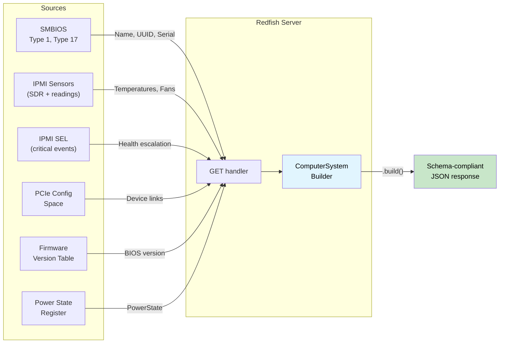

# Applied Walkthrough — Type-Safe Redfish Server 🟡<br><span class="zh-inline">实战演练：类型安全的 Redfish 服务端 🟡</span>

> **What you'll learn:** How to compose response builder type-state, source-availability tokens, dimensional serialization, health rollup, schema versioning, and typed action dispatch into a Redfish server that **cannot produce a schema-non-compliant response** — the mirror of the client walkthrough in [ch17](ch17-redfish-applied-walkthrough.md).<br><span class="zh-inline">**本章将学到什么：** 如何把响应 builder type-state、数据源可用性 token、量纲化序列化、健康汇总、schema 版本控制和带类型的 action 分发组合进一个 **不可能产出 schema 不合规响应** 的 Redfish 服务端。这一章正好和 [ch17](ch17-redfish-applied-walkthrough.md) 的客户端演练形成镜像。</span>
>
> **Cross-references:** [ch02](ch02-typed-command-interfaces-request-determi.md) (typed commands — inverted for action dispatch), [ch04](ch04-capability-tokens-zero-cost-proof-of-aut.md) (capability tokens — source availability), [ch06](ch06-dimensional-analysis-making-the-compiler.md) (dimensional types — serialization side), [ch07](ch07-validated-boundaries-parse-dont-validate.md) (validated boundaries — inverted: "construct, don't serialize"), [ch09](ch09-phantom-types-for-resource-tracking.md) (phantom types — schema versioning), [ch11](ch11-fourteen-tricks-from-the-trenches.md) (trick 3 — `#[non_exhaustive]`, trick 4 — builder type-state), [ch17](ch17-redfish-applied-walkthrough.md) (client counterpart)<br><span class="zh-inline">**交叉阅读：** [ch02](ch02-typed-command-interfaces-request-determi.md) 的 typed command（在这里反过来用于 action 分发），[ch04](ch04-capability-tokens-zero-cost-proof-of-aut.md) 的 capability token（这里变成数据源可用性证明），[ch06](ch06-dimensional-analysis-making-the-compiler.md) 的量纲类型（用于序列化侧），[ch07](ch07-validated-boundaries-parse-dont-validate.md) 的边界校验（这里反过来变成 “construct, don't serialize”），[ch09](ch09-phantom-types-for-resource-tracking.md) 的 phantom type（用于 schema 版本控制），[ch11](ch11-fourteen-tricks-from-the-trenches.md) 里的 `#[non_exhaustive]` 与 builder type-state，以及 [ch17](ch17-redfish-applied-walkthrough.md) 的客户端对应章节。</span>

## The Mirror Problem<br><span class="zh-inline">镜像问题</span>

Chapter 17 asks: *"How do I consume Redfish correctly?"* This chapter asks the
mirror question: *"How do I produce Redfish correctly?"*
<br><span class="zh-inline">第 17 章问的是：*“怎样正确消费 Redfish？”* 这一章反过来问：*“怎样正确生产 Redfish？”*</span>

On the client side, the danger is **trusting** bad data. On the server side, the
danger is **emitting** bad data — and every client in the fleet trusts what you
send.
<br><span class="zh-inline">客户端一侧最怕的是 **相信了错误数据**；服务端一侧最怕的是 **发出了错误数据**。更糟的是，整个机群里的客户端都会老老实实相信服务端发出来的东西。</span>

A single `GET /redfish/v1/Systems/1` response must fuse data from many sources:<br><span class="zh-inline">一条 `GET /redfish/v1/Systems/1` 响应，背后往往要把很多数据源的内容揉在一起。</span>



In C, this is a 500-line handler that calls into six subsystems, manually builds
a JSON tree with `json_object_set()`, and hopes every required field was populated.
Forget one? The response violates the Redfish schema. Get the unit wrong? Every
client sees corrupted telemetry.
<br><span class="zh-inline">在 C 里，这通常会变成一个五百行起步的 handler：调六个子系统，手搓 `json_object_set()`，然后祈祷所有必填字段都填上了。漏一个？响应立刻违反 Redfish schema。单位写错？所有客户端都跟着看到脏遥测数据。</span>

```c
// C — the assembly problem
json_t *get_computer_system(const char *id) {
    json_t *obj = json_object();
    json_object_set_new(obj, "@odata.type",
        json_string("#ComputerSystem.v1_13_0.ComputerSystem"));

    // 🐛 Forgot to set "Name" — schema requires it
    // 🐛 Forgot to set "UUID" — schema requires it

    smbios_type1_t *t1 = smbios_get_type1();
    if (t1) {
        json_object_set_new(obj, "Manufacturer",
            json_string(t1->manufacturer));
    }

    json_object_set_new(obj, "PowerState",
        json_string(get_power_state()));  // at least this one is always available

    // 🐛 Reading is in raw ADC counts, not Celsius — no type to catch it
    double cpu_temp = read_sensor(SENSOR_CPU_TEMP);
    // This number ends up in a Thermal response somewhere else...
    // but nothing ties it to "Celsius" at the type level

    // 🐛 Health is manually computed — forgot to include PSU status
    json_object_set_new(obj, "Status",
        build_status("Enabled", "OK")); // should be "Critical" — PSU is failing

    return obj; // missing 2 required fields, wrong health, raw units
}
```

Four bugs in one handler. On the client side, each bug affects **one** client.
On the server side, each bug affects **every** client that queries this BMC.<br><span class="zh-inline">一个 handler 里塞四个 bug。在客户端场景里，一个 bug 往往只坑一个调用方；在服务端场景里，一个 bug 会坑所有来查这个 BMC 的客户端。</span>

---

## Section 1 — Response Builder Type-State: "Construct, Don't Serialize" (ch07 Inverted)<br><span class="zh-inline">第 1 节：响应 Builder Type-State</span>

Chapter 7 teaches "parse, don't validate" — validate inbound data once, carry the
proof in a type. The server-side mirror is **"construct, don't serialize"** — build
the outbound response through a builder that gates `.build()` on all required fields
being present.
<br><span class="zh-inline">第 7 章讲的是 “parse, don't validate”：入站数据在边界校验一次，然后把证明留在类型里。服务端这一侧的镜像做法是 **“construct, don't serialize”**：通过 builder 去构造出站响应，并让 `.build()` 只在所有必填字段都齐了以后才出现。</span>

```rust,ignore
use std::marker::PhantomData;

// ──── Type-level field tracking ────

pub struct HasField;
pub struct MissingField;

// ──── Response Builder ────

/// Builder for a ComputerSystem Redfish resource.
/// Type parameters track which REQUIRED fields have been supplied.
/// Optional fields don't need type-level tracking.
pub struct ComputerSystemBuilder<Name, Uuid, PowerState, Status> {
    // Required fields — tracked at the type level
    name: Option<String>,
    uuid: Option<String>,
    power_state: Option<PowerStateValue>,
    status: Option<ResourceStatus>,
    // Optional fields — not tracked (always settable)
    manufacturer: Option<String>,
    model: Option<String>,
    serial_number: Option<String>,
    bios_version: Option<String>,
    processor_summary: Option<ProcessorSummary>,
    memory_summary: Option<MemorySummary>,
    _markers: PhantomData<(Name, Uuid, PowerState, Status)>,
}

#[derive(Debug, Clone, serde::Serialize)]
pub enum PowerStateValue { On, Off, PoweringOn, PoweringOff }

#[derive(Debug, Clone, serde::Serialize)]
pub struct ResourceStatus {
    #[serde(rename = "State")]
    pub state: StatusState,
    #[serde(rename = "Health")]
    pub health: HealthValue,
    #[serde(rename = "HealthRollup", skip_serializing_if = "Option::is_none")]
    pub health_rollup: Option<HealthValue>,
}

#[derive(Debug, Clone, Copy, serde::Serialize)]
pub enum StatusState { Enabled, Disabled, Absent, StandbyOffline, Starting }

#[derive(Debug, Clone, Copy, PartialEq, Eq, PartialOrd, Ord, serde::Serialize)]
pub enum HealthValue { OK, Warning, Critical }

#[derive(Debug, Clone, serde::Serialize)]
pub struct ProcessorSummary {
    #[serde(rename = "Count")]
    pub count: u32,
    #[serde(rename = "Status")]
    pub status: ResourceStatus,
}

#[derive(Debug, Clone, serde::Serialize)]
pub struct MemorySummary {
    #[serde(rename = "TotalSystemMemoryGiB")]
    pub total_gib: f64,
    #[serde(rename = "Status")]
    pub status: ResourceStatus,
}

// ──── Constructor: all fields start MissingField ────

impl ComputerSystemBuilder<MissingField, MissingField, MissingField, MissingField> {
    pub fn new() -> Self {
        ComputerSystemBuilder {
            name: None, uuid: None, power_state: None, status: None,
            manufacturer: None, model: None, serial_number: None,
            bios_version: None, processor_summary: None, memory_summary: None,
            _markers: PhantomData,
        }
    }
}

// ──── Required field setters — each transitions one type parameter ────

impl<U, P, S> ComputerSystemBuilder<MissingField, U, P, S> {
    pub fn name(self, name: String) -> ComputerSystemBuilder<HasField, U, P, S> {
        ComputerSystemBuilder {
            name: Some(name), uuid: self.uuid,
            power_state: self.power_state, status: self.status,
            manufacturer: self.manufacturer, model: self.model,
            serial_number: self.serial_number, bios_version: self.bios_version,
            processor_summary: self.processor_summary,
            memory_summary: self.memory_summary, _markers: PhantomData,
        }
    }
}

impl<N, P, S> ComputerSystemBuilder<N, MissingField, P, S> {
    pub fn uuid(self, uuid: String) -> ComputerSystemBuilder<N, HasField, P, S> {
        ComputerSystemBuilder {
            name: self.name, uuid: Some(uuid),
            power_state: self.power_state, status: self.status,
            manufacturer: self.manufacturer, model: self.model,
            serial_number: self.serial_number, bios_version: self.bios_version,
            processor_summary: self.processor_summary,
            memory_summary: self.memory_summary, _markers: PhantomData,
        }
    }
}

impl<N, U, S> ComputerSystemBuilder<N, U, MissingField, S> {
    pub fn power_state(self, ps: PowerStateValue)
        -> ComputerSystemBuilder<N, U, HasField, S>
    {
        ComputerSystemBuilder {
            name: self.name, uuid: self.uuid,
            power_state: Some(ps), status: self.status,
            manufacturer: self.manufacturer, model: self.model,
            serial_number: self.serial_number, bios_version: self.bios_version,
            processor_summary: self.processor_summary,
            memory_summary: self.memory_summary, _markers: PhantomData,
        }
    }
}

impl<N, U, P> ComputerSystemBuilder<N, U, P, MissingField> {
    pub fn status(self, status: ResourceStatus)
        -> ComputerSystemBuilder<N, U, P, HasField>
    {
        ComputerSystemBuilder {
            name: self.name, uuid: self.uuid,
            power_state: self.power_state, status: Some(status),
            manufacturer: self.manufacturer, model: self.model,
            serial_number: self.serial_number, bios_version: self.bios_version,
            processor_summary: self.processor_summary,
            memory_summary: self.memory_summary, _markers: PhantomData,
        }
    }
}

// ──── Optional field setters — available in any state ────

impl<N, U, P, S> ComputerSystemBuilder<N, U, P, S> {
    pub fn manufacturer(mut self, m: String) -> Self {
        self.manufacturer = Some(m); self
    }
    pub fn model(mut self, m: String) -> Self {
        self.model = Some(m); self
    }
    pub fn serial_number(mut self, s: String) -> Self {
        self.serial_number = Some(s); self
    }
    pub fn bios_version(mut self, v: String) -> Self {
        self.bios_version = Some(v); self
    }
    pub fn processor_summary(mut self, ps: ProcessorSummary) -> Self {
        self.processor_summary = Some(ps); self
    }
    pub fn memory_summary(mut self, ms: MemorySummary) -> Self {
        self.memory_summary = Some(ms); self
    }
}

// ──── .build() ONLY exists when all required fields are HasField ────

impl ComputerSystemBuilder<HasField, HasField, HasField, HasField> {
    pub fn build(self, id: &str) -> serde_json::Value {
        let mut obj = serde_json::json!({
            "@odata.id": format!("/redfish/v1/Systems/{id}"),
            "@odata.type": "#ComputerSystem.v1_13_0.ComputerSystem",
            "Id": id,
            "Name": self.name.unwrap(),
            "UUID": self.uuid.unwrap(),
            "PowerState": self.power_state.unwrap(),
            "Status": self.status.unwrap(),
        });

        // Optional fields — included only if present
        if let Some(m) = self.manufacturer {
            obj["Manufacturer"] = serde_json::json!(m);
        }
        if let Some(m) = self.model {
            obj["Model"] = serde_json::json!(m);
        }
        if let Some(s) = self.serial_number {
            obj["SerialNumber"] = serde_json::json!(s);
        }
        if let Some(v) = self.bios_version {
            obj["BiosVersion"] = serde_json::json!(v);
        }
        if let Some(ps) = self.processor_summary {
            obj["ProcessorSummary"] = serde_json::to_value(ps).unwrap();
        }
        if let Some(ms) = self.memory_summary {
            obj["MemorySummary"] = serde_json::to_value(ms).unwrap();
        }

        obj
    }
}

//
// ── The Compiler Enforces Completeness ──
//
// ✅ All required fields set — .build() is available:
// ComputerSystemBuilder::new()
//     .name("PowerEdge R750".into())
//     .uuid("4c4c4544-...".into())
//     .power_state(PowerStateValue::On)
//     .status(ResourceStatus { ... })
//     .manufacturer("Dell".into())        // optional — fine to include
//     .build("1")
//
// ❌ Missing "Name" — compile error:
// ComputerSystemBuilder::new()
//     .uuid("4c4c4544-...".into())
//     .power_state(PowerStateValue::On)
//     .status(ResourceStatus { ... })
//     .build("1")
//   ERROR: method `build` not found for
//   `ComputerSystemBuilder<MissingField, HasField, HasField, HasField>`
```

**Bug class eliminated:** schema-non-compliant responses. The handler physically
cannot serialize a `ComputerSystem` without supplying every required field. The
compiler error message even tells you *which* field is missing — it's right there
in the type parameter: `MissingField` in the `Name` position.<br><span class="zh-inline">**消灭的 bug：** 不符合 schema 的响应。只要没把必填字段补齐，handler 就根本构不出 `ComputerSystem`。编译错误甚至会把缺的是哪个字段直接写脸上，例如类型参数里 `Name` 位置还是 `MissingField`。</span>

---

## Section 2 — Source-Availability Tokens (Capability Tokens, ch04 — New Twist)<br><span class="zh-inline">第 2 节：数据源可用性令牌</span>

In ch04 and ch17, capability tokens prove **authorization** — "the caller is
allowed to do this." On the server side, the same pattern proves **availability** —
"this data source was successfully initialized."
<br><span class="zh-inline">在第 4 章和第 17 章里，capability token 证明的是 **授权**，也就是“调用方有资格做这件事”。到了服务端这一侧，同一套模式可以改用来证明 **可用性**，也就是“这个数据源已经成功初始化了”。</span>

Each subsystem the BMC queries can fail independently. SMBIOS tables might be
corrupt. The sensor subsystem might still be initializing. PCIe bus scan might
have timed out. Encode each as a proof token:
<br><span class="zh-inline">BMC 要查询的每个子系统都可能独立失败。SMBIOS 表可能损坏，传感器子系统可能还在初始化，PCIe 总线扫描也可能超时。把这些状态分别编码成证明 token，就能少掉很多含糊的空指针判断。</span>

```rust,ignore
/// Proof that SMBIOS tables were successfully parsed.
/// Only produced by the SMBIOS init function.
pub struct SmbiosReady {
    _private: (),
}

/// Proof that IPMI sensor subsystem is responsive.
pub struct SensorsReady {
    _private: (),
}

/// Proof that PCIe bus scan completed.
pub struct PcieReady {
    _private: (),
}

/// Proof that the SEL was successfully read.
pub struct SelReady {
    _private: (),
}

// ──── Data source initialization ────

pub struct SmbiosTables {
    pub product_name: String,
    pub manufacturer: String,
    pub serial_number: String,
    pub uuid: String,
}

pub struct SensorCache {
    pub cpu_temp: Celsius,
    pub inlet_temp: Celsius,
    pub fan_readings: Vec<(String, Rpm)>,
    pub psu_power: Vec<(String, Watts)>,
}

/// Rich SEL summary — per-subsystem health derived from typed events.
/// Built by the consumer pipeline in ch07's SEL section.
/// Replaces the lossy `has_critical_events: bool` with typed granularity.
pub struct TypedSelSummary {
    pub total_entries: u32,
    pub processor_health: HealthValue,
    pub memory_health: HealthValue,
    pub power_health: HealthValue,
    pub thermal_health: HealthValue,
    pub fan_health: HealthValue,
    pub storage_health: HealthValue,
    pub security_health: HealthValue,
}

pub fn init_smbios() -> Option<(SmbiosReady, SmbiosTables)> {
    // Read SMBIOS entry point, parse tables...
    // Returns None if tables are absent or corrupt
    Some((
        SmbiosReady { _private: () },
        SmbiosTables {
            product_name: "PowerEdge R750".into(),
            manufacturer: "Dell Inc.".into(),
            serial_number: "SVC1234567".into(),
            uuid: "4c4c4544-004d-5610-804c-b2c04f435031".into(),
        },
    ))
}

pub fn init_sensors() -> Option<(SensorsReady, SensorCache)> {
    // Initialize SDR repository, read all sensors...
    // Returns None if IPMI subsystem is not responsive
    Some((
        SensorsReady { _private: () },
        SensorCache {
            cpu_temp: Celsius(68.0),
            inlet_temp: Celsius(24.0),
            fan_readings: vec![
                ("Fan1".into(), Rpm(8400)),
                ("Fan2".into(), Rpm(8200)),
            ],
            psu_power: vec![
                ("PSU1".into(), Watts(285.0)),
                ("PSU2".into(), Watts(290.0)),
            ],
        },
    ))
}

pub fn init_sel() -> Option<(SelReady, TypedSelSummary)> {
    // In production: read SEL entries, parse via ch07's TryFrom,
    // classify via classify_event_health(), aggregate via summarize_sel().
    Some((
        SelReady { _private: () },
        TypedSelSummary {
            total_entries: 42,
            processor_health: HealthValue::OK,
            memory_health: HealthValue::OK,
            power_health: HealthValue::OK,
            thermal_health: HealthValue::OK,
            fan_health: HealthValue::OK,
            storage_health: HealthValue::OK,
            security_health: HealthValue::OK,
        },
    ))
}
```

Now, functions that populate builder fields from a data source **require the
corresponding proof token**:

```rust,ignore
/// Populate SMBIOS-sourced fields. Requires proof SMBIOS is available.
fn populate_from_smbios<P, S>(
    builder: ComputerSystemBuilder<MissingField, MissingField, P, S>,
    _proof: &SmbiosReady,
    tables: &SmbiosTables,
) -> ComputerSystemBuilder<HasField, HasField, P, S> {
    builder
        .name(tables.product_name.clone())
        .uuid(tables.uuid.clone())
        .manufacturer(tables.manufacturer.clone())
        .serial_number(tables.serial_number.clone())
}

/// Fallback when SMBIOS is unavailable — supplies required fields
/// with safe defaults.
fn populate_smbios_fallback<P, S>(
    builder: ComputerSystemBuilder<MissingField, MissingField, P, S>,
) -> ComputerSystemBuilder<HasField, HasField, P, S> {
    builder
        .name("Unknown System".into())
        .uuid("00000000-0000-0000-0000-000000000000".into())
}
```

The handler chooses the path based on which tokens are available:

```rust,ignore
fn build_computer_system(
    smbios: &Option<(SmbiosReady, SmbiosTables)>,
    power_state: PowerStateValue,
    health: ResourceStatus,
) -> serde_json::Value {
    let builder = ComputerSystemBuilder::new()
        .power_state(power_state)
        .status(health);

    let builder = match smbios {
        Some((proof, tables)) => populate_from_smbios(builder, proof, tables),
        None => populate_smbios_fallback(builder),
    };

    // Both paths produce HasField for Name and UUID.
    // .build() is available either way.
    builder.build("1")
}
```

**Bug class eliminated:** calling into a subsystem that failed initialization.
If SMBIOS didn't parse, you don't have a `SmbiosReady` token — the compiler forces
you through the fallback path. No runtime `if (smbios != NULL)` to forget.<br><span class="zh-inline">**消灭的 bug：** 调用了一个初始化失败的子系统。如果 SMBIOS 没解析成功，就不会有 `SmbiosReady` token，于是编译器会把流程硬推到 fallback 分支。那种容易忘写的 `if (smbios != NULL)` 也就没必要了。</span>

### Combining Source Tokens with Capability Mixins (ch08)<br><span class="zh-inline">把数据源令牌和 Capability Mixin 结合起来</span>

With multiple Redfish resource types to serve (ComputerSystem, Chassis, Manager,
Thermal, Power), source-population logic repeats across handlers. The **mixin**
pattern from ch08 eliminates this duplication. Declare what sources a handler has,
and blanket impls provide the population methods automatically:
<br><span class="zh-inline">当服务端要同时处理 ComputerSystem、Chassis、Manager、Thermal、Power 这些不同资源时，数据填充逻辑很容易在各个 handler 里重复。第 8 章的 **mixin** 模式正好可以拿来消这种重复：先声明 handler 拥有哪些数据源，再通过 blanket impl 自动补上对应填充方法。</span>

```rust,ignore
/// ── Ingredient Traits (ch08) for data sources ──

pub trait HasSmbios {
    fn smbios(&self) -> &(SmbiosReady, SmbiosTables);
}

pub trait HasSensors {
    fn sensors(&self) -> &(SensorsReady, SensorCache);
}

pub trait HasSel {
    fn sel(&self) -> &(SelReady, TypedSelSummary);
}

/// ── Mixin: any handler with SMBIOS + Sensors gets identity population ──

pub trait IdentityMixin: HasSmbios {
    fn populate_identity<P, S>(
        &self,
        builder: ComputerSystemBuilder<MissingField, MissingField, P, S>,
    ) -> ComputerSystemBuilder<HasField, HasField, P, S> {
        let (_, tables) = self.smbios();
        builder
            .name(tables.product_name.clone())
            .uuid(tables.uuid.clone())
            .manufacturer(tables.manufacturer.clone())
            .serial_number(tables.serial_number.clone())
    }
}

/// Auto-implement for any type that has SMBIOS capability.
impl<T: HasSmbios> IdentityMixin for T {}

/// ── Mixin: any handler with Sensors + SEL gets health rollup ──

pub trait HealthMixin: HasSensors + HasSel {
    fn compute_health(&self) -> ResourceStatus {
        let (_, cache) = self.sensors();
        let (_, sel_summary) = self.sel();
        compute_system_health(
            Some(&(SensorsReady { _private: () }, cache.clone())).as_ref(),
            Some(&(SelReady { _private: () }, sel_summary.clone())).as_ref(),
        )
    }
}

impl<T: HasSensors + HasSel> HealthMixin for T {}

/// ── Concrete handler owns available sources ──

struct FullPlatformHandler {
    smbios: (SmbiosReady, SmbiosTables),
    sensors: (SensorsReady, SensorCache),
    sel: (SelReady, TypedSelSummary),
}

impl HasSmbios  for FullPlatformHandler {
    fn smbios(&self) -> &(SmbiosReady, SmbiosTables) { &self.smbios }
}
impl HasSensors for FullPlatformHandler {
    fn sensors(&self) -> &(SensorsReady, SensorCache) { &self.sensors }
}
impl HasSel     for FullPlatformHandler {
    fn sel(&self) -> &(SelReady, TypedSelSummary) { &self.sel }
}

// FullPlatformHandler automatically gets:
//   IdentityMixin::populate_identity()   (via HasSmbios)
//   HealthMixin::compute_health()        (via HasSensors + HasSel)
//
// A SensorsOnlyHandler that impls HasSensors but NOT HasSel
// would get IdentityMixin (if it has SMBIOS) but NOT HealthMixin.
// Calling .compute_health() on it → compile error.
```

This directly mirrors ch08's `BaseBoardController` pattern: ingredient traits
declare what you have, mixin traits provide behavior via blanket impls, and
the compiler gates each mixin on its prerequisites. Adding a new data
source (e.g., `HasNvme`) plus a mixin (e.g., `StorageMixin: HasNvme + HasSel`)
gives health rollup for storage to every handler that has both — automatically.
<br><span class="zh-inline">这和第 8 章里的 `BaseBoardController` 模式完全一脉相承：ingredient trait 负责声明“手上有什么”，mixin trait 通过 blanket impl 提供行为，而编译器负责检查前置条件。以后再加一个数据源，比如 `HasNvme`，再配一个 `StorageMixin: HasNvme + HasSel`，所有同时具备这两个条件的 handler 就会自动得到存储健康汇总能力。</span>

---

## Section 3 — Dimensional Types at the Serialization Boundary (ch06)<br><span class="zh-inline">第 3 节：序列化边界上的量纲类型</span>

On the client side (ch17 §4), dimensional types prevent **reading** °C as RPM.
On the server side, they prevent **writing** RPM into a Celsius JSON field. This
is arguably more dangerous — a wrong value on the server propagates to every client.
<br><span class="zh-inline">在客户端一侧，第 17 章第 4 节用量纲类型防止把温度读成 RPM；在服务端一侧，它们防止把 RPM 写进 Celsius 字段。后者其实更危险，因为服务端一旦写错，所有客户端都会一起吃错值。</span>

```rust,ignore
use serde::Serialize;

// ──── Dimensional types from ch06, with Serialize ────

#[derive(Debug, Clone, Copy, PartialEq, PartialOrd, Serialize)]
pub struct Celsius(pub f64);

#[derive(Debug, Clone, Copy, PartialEq, PartialOrd, Serialize)]
pub struct Rpm(pub u32);

#[derive(Debug, Clone, Copy, PartialEq, PartialOrd, Serialize)]
pub struct Watts(pub f64);

// ──── Redfish Thermal response members ────
// Field types enforce which unit belongs in which JSON property.

#[derive(Serialize)]
#[serde(rename_all = "PascalCase")]
pub struct TemperatureMember {
    pub member_id: String,
    pub name: String,
    pub reading_celsius: Celsius,           // ← must be Celsius
    #[serde(skip_serializing_if = "Option::is_none")]
    pub upper_threshold_critical: Option<Celsius>,
    #[serde(skip_serializing_if = "Option::is_none")]
    pub upper_threshold_fatal: Option<Celsius>,
    pub status: ResourceStatus,
}

#[derive(Serialize)]
#[serde(rename_all = "PascalCase")]
pub struct FanMember {
    pub member_id: String,
    pub name: String,
    pub reading: Rpm,                       // ← must be Rpm
    pub reading_units: &'static str,        // always "RPM"
    pub status: ResourceStatus,
}

#[derive(Serialize)]
#[serde(rename_all = "PascalCase")]
pub struct PowerControlMember {
    pub member_id: String,
    pub name: String,
    pub power_consumed_watts: Watts,        // ← must be Watts
    #[serde(skip_serializing_if = "Option::is_none")]
    pub power_capacity_watts: Option<Watts>,
    pub status: ResourceStatus,
}

// ──── Building a Thermal response from sensor cache ────

fn build_thermal_response(
    _proof: &SensorsReady,
    cache: &SensorCache,
) -> serde_json::Value {
    let temps = vec![
        TemperatureMember {
            member_id: "0".into(),
            name: "CPU Temp".into(),
            reading_celsius: cache.cpu_temp,     // Celsius → Celsius ✅
            upper_threshold_critical: Some(Celsius(95.0)),
            upper_threshold_fatal: Some(Celsius(105.0)),
            status: ResourceStatus {
                state: StatusState::Enabled,
                health: if cache.cpu_temp < Celsius(95.0) {
                    HealthValue::OK
                } else {
                    HealthValue::Critical
                },
                health_rollup: None,
            },
        },
        TemperatureMember {
            member_id: "1".into(),
            name: "Inlet Temp".into(),
            reading_celsius: cache.inlet_temp,   // Celsius → Celsius ✅
            upper_threshold_critical: Some(Celsius(42.0)),
            upper_threshold_fatal: None,
            status: ResourceStatus {
                state: StatusState::Enabled,
                health: HealthValue::OK,
                health_rollup: None,
            },
        },

        // ❌ Compile error — can't put Rpm in a Celsius field:
        // TemperatureMember {
        //     reading_celsius: cache.fan_readings[0].1,  // Rpm ≠ Celsius
        //     ...
        // }
    ];

    let fans: Vec<FanMember> = cache.fan_readings.iter().enumerate().map(|(i, (name, rpm))| {
        FanMember {
            member_id: i.to_string(),
            name: name.clone(),
            reading: *rpm,                       // Rpm → Rpm ✅
            reading_units: "RPM",
            status: ResourceStatus {
                state: StatusState::Enabled,
                health: if *rpm > Rpm(1000) { HealthValue::OK } else { HealthValue::Critical },
                health_rollup: None,
            },
        }
    }).collect();

    serde_json::json!({
        "@odata.type": "#Thermal.v1_7_0.Thermal",
        "Temperatures": temps,
        "Fans": fans,
    })
}
```

**Bug class eliminated:** unit confusion at serialization. The Redfish schema says
`ReadingCelsius` is in °C. The Rust type system says `reading_celsius` must be
`Celsius`. If a developer accidentally passes `Rpm(8400)` or `Watts(285.0)`, the
compiler catches it before the value ever reaches JSON.<br><span class="zh-inline">**消灭的 bug：** 序列化阶段的量纲混淆。Redfish schema 规定 `ReadingCelsius` 就该是摄氏度，Rust 类型系统则进一步把 `reading_celsius` 锁死为 `Celsius`。一旦有人手滑塞进 `Rpm(8400)` 或 `Watts(285.0)`，还没到 JSON 层编译器就先拦住了。</span>

---

## Section 4 — Health Rollup as a Typed Fold<br><span class="zh-inline">第 4 节：把健康汇总做成带类型的折叠</span>

Redfish `Status.Health` is a *rollup* — the worst health of all sub-components.
In C, this is typically a series of `if` checks that inevitably misses a source.
With typed enums and `Ord`, the rollup is a one-line fold — and the compiler
ensures every source contributes:
<br><span class="zh-inline">Redfish 的 `Status.Health` 本质上是一个 *rollup*，也就是所有子组件里“最差”的那个健康状态。在 C 里，这通常会退化成一串总会漏东西的 `if` 判断；而用带类型的枚举加上 `Ord` 以后，汇总就能变成一条 fold，同时还能让编译器盯着每个数据源都参与计算。</span>

```rust,ignore
/// Roll up health from multiple sources.
/// Ord on HealthValue: OK < Warning < Critical.
/// Returns the worst (max) value.
fn rollup(sources: &[HealthValue]) -> HealthValue {
    sources.iter().copied().max().unwrap_or(HealthValue::OK)
}

/// Compute system-level health from all sub-components.
/// Takes explicit references to every source — the caller must provide ALL of them.
fn compute_system_health(
    sensors: Option<&(SensorsReady, SensorCache)>,
    sel: Option<&(SelReady, TypedSelSummary)>,
) -> ResourceStatus {
    let mut inputs = Vec::new();

    // ── Live sensor readings ──
    if let Some((_proof, cache)) = sensors {
        // Temperature health (dimensional: Celsius comparison)
        if cache.cpu_temp > Celsius(95.0) {
            inputs.push(HealthValue::Critical);
        } else if cache.cpu_temp > Celsius(85.0) {
            inputs.push(HealthValue::Warning);
        } else {
            inputs.push(HealthValue::OK);
        }

        // Fan health (dimensional: Rpm comparison)
        for (_name, rpm) in &cache.fan_readings {
            if *rpm < Rpm(500) {
                inputs.push(HealthValue::Critical);
            } else if *rpm < Rpm(1000) {
                inputs.push(HealthValue::Warning);
            } else {
                inputs.push(HealthValue::OK);
            }
        }

        // PSU health (dimensional: Watts comparison)
        for (_name, watts) in &cache.psu_power {
            if *watts > Watts(800.0) {
                inputs.push(HealthValue::Critical);
            } else {
                inputs.push(HealthValue::OK);
            }
        }
    }

    // ── SEL per-subsystem health (from ch07's TypedSelSummary) ──
    // Each subsystem's health was derived by exhaustive matching over
    // every sensor type and event variant. No information was lost.
    if let Some((_proof, sel_summary)) = sel {
        inputs.push(sel_summary.processor_health);
        inputs.push(sel_summary.memory_health);
        inputs.push(sel_summary.power_health);
        inputs.push(sel_summary.thermal_health);
        inputs.push(sel_summary.fan_health);
        inputs.push(sel_summary.storage_health);
        inputs.push(sel_summary.security_health);
    }

    let health = rollup(&inputs);

    ResourceStatus {
        state: StatusState::Enabled,
        health,
        health_rollup: Some(health),
    }
}
```

**Bug class eliminated:** incomplete health rollup. In C, forgetting to include PSU
status in the health calculation is a silent bug — the system reports "OK" while a
PSU is failing. Here, `compute_system_health` takes explicit references to every
data source. The SEL contribution is no longer a lossy `bool` — it's seven
per-subsystem `HealthValue` fields derived by exhaustive matching in ch07's consumer
pipeline. Adding a new SEL sensor type forces the classifier to handle it; adding a
new subsystem field forces the rollup to include it.<br><span class="zh-inline">**消灭的 bug：** 健康汇总不完整。C 代码里漏掉 PSU 状态是典型静默错误，系统明明有电源故障，结果却还在报 “OK”。这里的 `compute_system_health` 明确要求所有数据源引用，SEL 贡献也不再是一个丢信息的 `bool`，而是来自第 7 章消费链路、按子系统拆开的 7 个 `HealthValue`。新增一种 SEL 传感器类型会强迫分类器处理，新增一个子系统字段也会强迫 rollup 把它算进去。</span>

---

## Section 5 — Schema Versioning with Phantom Types (ch09)<br><span class="zh-inline">第 5 节：用 Phantom Type 做 Schema 版本控制</span>

If the BMC advertises `ComputerSystem.v1_13_0`, the response **must** include
properties introduced in that schema version (`LastResetTime`, `BootProgress`).
Advertising v1.13 without those fields is a Redfish Interop Validator failure.
Phantom version markers make this a compile-time contract:
<br><span class="zh-inline">如果 BMC 宣称自己暴露的是 `ComputerSystem.v1_13_0`，那响应里 **就必须** 带上这个版本才引入的字段，比如 `LastResetTime`、`BootProgress`。光喊自己是 v1.13 却不给这些字段，Redfish Interop Validator 会狠狠干碎。phantom 版本标记能把这件事改造成编译期契约。</span>

```rust,ignore
use std::marker::PhantomData;

// ──── Schema Version Markers ────

pub struct V1_5;
pub struct V1_13;

// ──── Version-Aware Response ────

pub struct ComputerSystemResponse<V> {
    pub base: ComputerSystemBase,
    _version: PhantomData<V>,
}

pub struct ComputerSystemBase {
    pub id: String,
    pub name: String,
    pub uuid: String,
    pub power_state: PowerStateValue,
    pub status: ResourceStatus,
    pub manufacturer: Option<String>,
    pub serial_number: Option<String>,
    pub bios_version: Option<String>,
}

// Methods available on ALL versions:
impl<V> ComputerSystemResponse<V> {
    pub fn base_json(&self) -> serde_json::Value {
        serde_json::json!({
            "Id": self.base.id,
            "Name": self.base.name,
            "UUID": self.base.uuid,
            "PowerState": self.base.power_state,
            "Status": self.base.status,
        })
    }
}

// ──── v1.13-specific fields ────

/// Date and time of the last system reset.
pub struct LastResetTime(pub String);

/// Boot progress information.
pub struct BootProgress {
    pub last_state: String,
    pub last_state_time: String,
}

impl ComputerSystemResponse<V1_13> {
    /// LastResetTime — REQUIRED in v1.13+.
    /// This method only exists on V1_13. If the BMC advertises v1.13
    /// and the handler doesn't call this, the field is missing.
    pub fn last_reset_time(&self) -> LastResetTime {
        // Read from RTC or boot timestamp register
        LastResetTime("2026-03-16T08:30:00Z".to_string())
    }

    /// BootProgress — REQUIRED in v1.13+.
    pub fn boot_progress(&self) -> BootProgress {
        BootProgress {
            last_state: "OSRunning".to_string(),
            last_state_time: "2026-03-16T08:32:00Z".to_string(),
        }
    }

    /// Build the full v1.13 JSON response, including version-specific fields.
    pub fn to_json(&self) -> serde_json::Value {
        let mut obj = self.base_json();
        obj["@odata.type"] =
            serde_json::json!("#ComputerSystem.v1_13_0.ComputerSystem");

        let reset_time = self.last_reset_time();
        obj["LastResetTime"] = serde_json::json!(reset_time.0);

        let boot = self.boot_progress();
        obj["BootProgress"] = serde_json::json!({
            "LastState": boot.last_state,
            "LastStateTime": boot.last_state_time,
        });

        obj
    }
}

impl ComputerSystemResponse<V1_5> {
    /// v1.5 JSON — no LastResetTime, no BootProgress.
    pub fn to_json(&self) -> serde_json::Value {
        let mut obj = self.base_json();
        obj["@odata.type"] =
            serde_json::json!("#ComputerSystem.v1_5_0.ComputerSystem");
        obj
    }

    // last_reset_time() doesn't exist here.
    // Calling it → compile error:
    //   let resp: ComputerSystemResponse<V1_5> = ...;
    //   resp.last_reset_time();
    //   ❌ ERROR: method `last_reset_time` not found for
    //            `ComputerSystemResponse<V1_5>`
}
```

**Bug class eliminated:** schema version mismatch. If the BMC is configured to
advertise v1.13, use `ComputerSystemResponse<V1_13>` and the compiler ensures
every v1.13-required field is produced. Downgrade to v1.5? Change the type
parameter — the v1.13 methods vanish, and no dead fields leak into the response.<br><span class="zh-inline">**消灭的 bug：** schema 版本不匹配。只要 BMC 被配置为宣告 v1.13，就使用 `ComputerSystemResponse<V1_13>`，编译器会保证所有 v1.13 必填字段都真的被生成。要降回 v1.5？直接改类型参数，v1.13 专属方法会原地消失，也不会把多余字段漏进响应里。</span>

---

## Section 6 — Typed Action Dispatch (ch02 Inverted)<br><span class="zh-inline">第 6 节：带类型的 Action 分发</span>

In ch02, the typed command pattern binds `Request → Response` on the **client**
side. On the **server** side, the same pattern validates incoming action payloads
and dispatches them type-safely — the inverse direction.
<br><span class="zh-inline">第 2 章里，typed command 模式是在 **客户端** 把 `Request → Response` 绑定起来；到了 **服务端**，同一套思路可以反过来用：先校验传入的 action payload，再按类型安全的方式分发执行。</span>

```rust,ignore
use serde::Deserialize;

// ──── Action Trait (mirror of ch02's IpmiCmd trait) ────

/// A Redfish action: the framework deserializes Params from the POST body,
/// then calls execute(). If the JSON doesn't match Params, deserialization
/// fails — execute() is never called with bad input.
pub trait RedfishAction {
    /// The expected JSON body structure.
    type Params: serde::de::DeserializeOwned;
    /// The result of executing the action.
    type Result: serde::Serialize;

    fn execute(&self, params: Self::Params) -> Result<Self::Result, RedfishError>;
}

#[derive(Debug)]
pub enum RedfishError {
    InvalidPayload(String),
    ActionFailed(String),
}

// ──── ComputerSystem.Reset ────

pub struct ComputerSystemReset;

#[derive(Debug, Deserialize)]
pub enum ResetType {
    On,
    ForceOff,
    GracefulShutdown,
    GracefulRestart,
    ForceRestart,
    ForceOn,
    PushPowerButton,
}

#[derive(Debug, Deserialize)]
#[serde(rename_all = "PascalCase")]
pub struct ResetParams {
    pub reset_type: ResetType,
}

impl RedfishAction for ComputerSystemReset {
    type Params = ResetParams;
    type Result = ();

    fn execute(&self, params: ResetParams) -> Result<(), RedfishError> {
        match params.reset_type {
            ResetType::GracefulShutdown => {
                // Send ACPI shutdown to host
                println!("Initiating ACPI shutdown");
                Ok(())
            }
            ResetType::ForceOff => {
                // Assert power-off to host
                println!("Forcing power off");
                Ok(())
            }
            ResetType::On | ResetType::ForceOn => {
                println!("Powering on");
                Ok(())
            }
            ResetType::GracefulRestart => {
                println!("ACPI restart");
                Ok(())
            }
            ResetType::ForceRestart => {
                println!("Forced restart");
                Ok(())
            }
            ResetType::PushPowerButton => {
                println!("Simulating power button press");
                Ok(())
            }
            // Exhaustive — compiler catches missing variants
        }
    }
}

// ──── Manager.ResetToDefaults ────

pub struct ManagerResetToDefaults;

#[derive(Debug, Deserialize)]
pub enum ResetToDefaultsType {
    ResetAll,
    PreserveNetworkAndUsers,
    PreserveNetwork,
}

#[derive(Debug, Deserialize)]
#[serde(rename_all = "PascalCase")]
pub struct ResetToDefaultsParams {
    pub reset_to_defaults_type: ResetToDefaultsType,
}

impl RedfishAction for ManagerResetToDefaults {
    type Params = ResetToDefaultsParams;
    type Result = ();

    fn execute(&self, params: ResetToDefaultsParams) -> Result<(), RedfishError> {
        match params.reset_to_defaults_type {
            ResetToDefaultsType::ResetAll => {
                println!("Full factory reset");
                Ok(())
            }
            ResetToDefaultsType::PreserveNetworkAndUsers => {
                println!("Reset preserving network + users");
                Ok(())
            }
            ResetToDefaultsType::PreserveNetwork => {
                println!("Reset preserving network config");
                Ok(())
            }
        }
    }
}

// ──── Generic Action Dispatcher ────

fn dispatch_action<A: RedfishAction>(
    action: &A,
    raw_body: &str,
) -> Result<A::Result, RedfishError> {
    // Deserialization validates the payload structure.
    // If the JSON doesn't match A::Params, this fails
    // and execute() is never called.
    let params: A::Params = serde_json::from_str(raw_body)
        .map_err(|e| RedfishError::InvalidPayload(e.to_string()))?;

    action.execute(params)
}

// ── Usage ──

fn handle_reset_action(body: &str) -> Result<(), RedfishError> {
    // Type-safe: ResetParams is validated by serde before execute()
    dispatch_action(&ComputerSystemReset, body)?;
    Ok(())

    // Invalid JSON: {"ResetType": "Explode"}
    // → serde error: "unknown variant `Explode`"
    // → execute() never called

    // Missing field: {}
    // → serde error: "missing field `ResetType`"
    // → execute() never called
}
```

**Bug classes eliminated:**<br><span class="zh-inline">**消灭的 bug：**</span>
- **Invalid action payload:** serde rejects unknown enum variants and missing fields
  before `execute()` is called. No manual `if (body["ResetType"] == ...)` chains.<br><span class="zh-inline">**非法 action 载荷：** serde 会在 `execute()` 调用前拒绝未知枚举值和缺失字段，不需要再写那种又臭又长的 `if (body["ResetType"] == ...)` 判断链。</span>
- **Missing variant handling:** `match params.reset_type` is exhaustive — adding a
  new `ResetType` variant forces every action handler to be updated.<br><span class="zh-inline">**遗漏枚举分支：** `match params.reset_type` 是穷举匹配。只要 `ResetType` 新增一个变体，所有相关 handler 都会被强迫补齐。</span>
- **Type confusion:** `ComputerSystemReset` expects `ResetParams`;
  `ManagerResetToDefaults` expects `ResetToDefaultsParams`. The trait system prevents
  passing one action's params to another action's handler.<br><span class="zh-inline">**参数类型混淆：** `ComputerSystemReset` 只接受 `ResetParams`，`ManagerResetToDefaults` 只接受 `ResetToDefaultsParams`。trait 系统会阻止把一类 action 的参数拿去喂另一类 handler。</span>

---

## Section 7 — Putting It All Together: The GET Handler<br><span class="zh-inline">第 7 节：把所有模式收束到一个 GET Handler</span>

Here's the complete handler that composes all six sections into a single
schema-compliant response:<br><span class="zh-inline">下面这个完整 handler，把前面六节的模式全部装进一条 schema 合规响应里。</span>

```rust,ignore
/// Complete GET /redfish/v1/Systems/1 handler.
///
/// Every required field is enforced by the builder type-state.
/// Every data source is gated by availability tokens.
/// Every unit is locked to its dimensional type.
/// Every health input feeds the typed rollup.
fn handle_get_computer_system(
    smbios: &Option<(SmbiosReady, SmbiosTables)>,
    sensors: &Option<(SensorsReady, SensorCache)>,
    sel: &Option<(SelReady, TypedSelSummary)>,
    power_state: PowerStateValue,
    bios_version: Option<String>,
) -> serde_json::Value {
    // ── 1. Health rollup (Section 4) ──
    // Folds health from sensors + SEL into a single typed status
    let health = compute_system_health(
        sensors.as_ref(),
        sel.as_ref(),
    );

    // ── 2. Builder type-state (Section 1) ──
    let builder = ComputerSystemBuilder::new()
        .power_state(power_state)
        .status(health);

    // ── 3. Source-availability tokens (Section 2) ──
    let builder = match smbios {
        Some((proof, tables)) => {
            // SMBIOS available — populate from hardware
            populate_from_smbios(builder, proof, tables)
        }
        None => {
            // SMBIOS unavailable — safe defaults
            populate_smbios_fallback(builder)
        }
    };

    // ── 4. Optional enrichment from sensors (Section 3) ──
    let builder = if let Some((_proof, cache)) = sensors {
        builder
            .processor_summary(ProcessorSummary {
                count: 2,
                status: ResourceStatus {
                    state: StatusState::Enabled,
                    health: if cache.cpu_temp < Celsius(95.0) {
                        HealthValue::OK
                    } else {
                        HealthValue::Critical
                    },
                    health_rollup: None,
                },
            })
    } else {
        builder
    };

    let builder = match bios_version {
        Some(v) => builder.bios_version(v),
        None => builder,
    };

    // ── 5. Build (Section 1) ──
    // .build() is available because both paths (SMBIOS present / absent)
    // produce HasField for Name and UUID. The compiler verified this.
    builder.build("1")
}

// ──── Server Startup ────

fn main() {
    // Initialize all data sources — each returns an availability token
    let smbios = init_smbios();
    let sensors = init_sensors();
    let sel = init_sel();

    // Simulate handler call
    let response = handle_get_computer_system(
        &smbios,
        &sensors,
        &sel,
        PowerStateValue::On,
        Some("2.10.1".into()),
    );

    println!("{}", serde_json::to_string_pretty(&response).unwrap());
}
```

**Expected output:**<br><span class="zh-inline">**期望输出：**</span>

```json
{
  "@odata.id": "/redfish/v1/Systems/1",
  "@odata.type": "#ComputerSystem.v1_13_0.ComputerSystem",
  "Id": "1",
  "Name": "PowerEdge R750",
  "UUID": "4c4c4544-004d-5610-804c-b2c04f435031",
  "PowerState": "On",
  "Status": {
    "State": "Enabled",
    "Health": "OK",
    "HealthRollup": "OK"
  },
  "Manufacturer": "Dell Inc.",
  "SerialNumber": "SVC1234567",
  "BiosVersion": "2.10.1",
  "ProcessorSummary": {
    "Count": 2,
    "Status": {
      "State": "Enabled",
      "Health": "OK"
    }
  }
}
```

### What the Compiler Proves (Server Side)<br><span class="zh-inline">编译器在服务端证明了什么</span>

| # | Bug class<br><span class="zh-inline">bug 类型</span> | How it's prevented<br><span class="zh-inline">如何被阻止</span> | Pattern (Section)<br><span class="zh-inline">对应模式</span> |
|---|-----------|-------------------|-------------------|
| 1 | Missing required field in response<br><span class="zh-inline">响应里漏必填字段</span> | `.build()` requires all type-state markers to be `HasField`<br><span class="zh-inline">`.build()` 要求所有 type-state 标记都变成 `HasField`</span> | Builder type-state (§1)<br><span class="zh-inline">Builder type-state（第 1 节）</span> |
| 2 | Calling into failed subsystem<br><span class="zh-inline">调用初始化失败的子系统</span> | Source-availability tokens gate data access<br><span class="zh-inline">数据访问受可用性 token 约束</span> | Capability tokens (§2)<br><span class="zh-inline">Capability token（第 2 节）</span> |
| 3 | No fallback for unavailable source<br><span class="zh-inline">缺失数据源没有 fallback</span> | Both `match` arms (present/absent) must produce `HasField`<br><span class="zh-inline">`match` 的两个分支都必须产出 `HasField`</span> | Type-state + exhaustive match (§2)<br><span class="zh-inline">Type-state + 穷举匹配（第 2 节）</span> |
| 4 | Wrong unit in JSON field<br><span class="zh-inline">JSON 字段单位写错</span> | `reading_celsius: Celsius` ≠ `Rpm` ≠ `Watts`<br><span class="zh-inline">`reading_celsius: Celsius` 和 `Rpm`、`Watts` 都不是一回事</span> | Dimensional types (§3)<br><span class="zh-inline">量纲类型（第 3 节）</span> |
| 5 | Incomplete health rollup<br><span class="zh-inline">健康汇总不完整</span> | `compute_system_health` takes explicit source refs; SEL provides per-subsystem `HealthValue` via ch07's `TypedSelSummary`<br><span class="zh-inline">`compute_system_health` 明确接收各数据源引用，SEL 则通过 `TypedSelSummary` 提供按子系统拆分的 `HealthValue`</span> | Typed function signature + exhaustive matching (§4)<br><span class="zh-inline">带类型函数签名 + 穷举匹配（第 4 节）</span> |
| 6 | Schema version mismatch<br><span class="zh-inline">schema 版本不匹配</span> | `ComputerSystemResponse<V1_13>` has `last_reset_time()`; `V1_5` doesn't<br><span class="zh-inline">`ComputerSystemResponse<V1_13>` 才有 `last_reset_time()`，`V1_5` 没有</span> | Phantom types (§5)<br><span class="zh-inline">Phantom type（第 5 节）</span> |
| 7 | Invalid action payload accepted<br><span class="zh-inline">非法 action 载荷被接收</span> | serde rejects unknown/missing fields before `execute()`<br><span class="zh-inline">serde 会在 `execute()` 前拒绝未知字段和缺失字段</span> | Typed action dispatch (§6)<br><span class="zh-inline">带类型 action 分发（第 6 节）</span> |
| 8 | Missing action variant handling<br><span class="zh-inline">遗漏 action 枚举分支</span> | `match params.reset_type` is exhaustive<br><span class="zh-inline">`match params.reset_type` 是穷举匹配</span> | Enum exhaustiveness (§6)<br><span class="zh-inline">枚举穷举性（第 6 节）</span> |
| 9 | Wrong action params to wrong handler<br><span class="zh-inline">把错误参数传给错误 handler</span> | `RedfishAction::Params` is an associated type<br><span class="zh-inline">`RedfishAction::Params` 是关联类型</span> | Typed commands inverted (§6)<br><span class="zh-inline">反向使用的 typed command（第 6 节）</span> |

**Total runtime overhead: zero.** The builder markers, availability tokens, phantom
version types, and dimensional newtypes all compile away. The JSON produced is
identical to the hand-rolled C version — minus nine classes of bugs.<br><span class="zh-inline">**总运行时额外开销：零。** builder 标记、可用性 token、phantom 版本类型和量纲 newtype 最终都会被编译器消掉。产出的 JSON 和手写 C 版本在表面上没差，只是少了 9 类 bug。</span>

---

## The Mirror: Client vs. Server Pattern Map<br><span class="zh-inline">镜像关系：客户端与服务端的模式映射</span>

| Concern<br><span class="zh-inline">关注点</span> | Client (ch17)<br><span class="zh-inline">客户端（第 17 章）</span> | Server (this chapter)<br><span class="zh-inline">服务端（本章）</span> |
|---------|---------------|----------------------|
| **Boundary direction**<br><span class="zh-inline">边界方向</span> | Inbound: JSON → typed values<br><span class="zh-inline">入站：JSON → 强类型值</span> | Outbound: typed values → JSON<br><span class="zh-inline">出站：强类型值 → JSON</span> |
| **Core principle**<br><span class="zh-inline">核心原则</span> | "Parse, don't validate" | "Construct, don't serialize" |
| **Field completeness**<br><span class="zh-inline">字段完整性</span> | `TryFrom` validates required fields are present<br><span class="zh-inline">`TryFrom` 负责校验必填字段是否存在</span> | Builder type-state gates `.build()` on required fields<br><span class="zh-inline">Builder type-state 把 `.build()` 挂在必填字段齐全之后</span> |
| **Unit safety**<br><span class="zh-inline">单位安全</span> | `Celsius` ≠ `Rpm` when reading<br><span class="zh-inline">读取时 `Celsius` 不等于 `Rpm`</span> | `Celsius` ≠ `Rpm` when writing<br><span class="zh-inline">写出时 `Celsius` 也不等于 `Rpm`</span> |
| **Privilege / availability**<br><span class="zh-inline">权限 / 可用性</span> | Capability tokens gate requests<br><span class="zh-inline">capability token 约束请求资格</span> | Availability tokens gate data source access<br><span class="zh-inline">availability token 约束数据源访问</span> |
| **Data sources**<br><span class="zh-inline">数据源</span> | Single source (BMC)<br><span class="zh-inline">单一来源（BMC）</span> | Multiple sources (SMBIOS, sensors, SEL, PCIe, ...)<br><span class="zh-inline">多来源（SMBIOS、传感器、SEL、PCIe 等）</span> |
| **Schema version**<br><span class="zh-inline">Schema 版本</span> | Phantom types prevent accessing unsupported fields<br><span class="zh-inline">phantom type 防止访问未支持字段</span> | Phantom types enforce providing version-required fields<br><span class="zh-inline">phantom type 强制提供特定版本要求的字段</span> |
| **Actions**<br><span class="zh-inline">动作接口</span> | Client sends typed action POST<br><span class="zh-inline">客户端发出带类型的 action POST</span> | Server validates + dispatches via `RedfishAction` trait<br><span class="zh-inline">服务端通过 `RedfishAction` trait 校验并分发</span> |
| **Health**<br><span class="zh-inline">健康状态</span> | Read and trust `Status.Health`<br><span class="zh-inline">读取并相信 `Status.Health`</span> | Compute `Status.Health` via typed rollup<br><span class="zh-inline">通过带类型 rollup 计算 `Status.Health`</span> |
| **Failure propagation**<br><span class="zh-inline">失败传播</span> | One bad parse → one client error<br><span class="zh-inline">一次坏解析影响一个客户端</span> | One bad serialization → every client sees wrong data<br><span class="zh-inline">一次坏序列化会把错误广播给所有客户端</span> |

The two chapters form a complete story. Ch17: *"Every response I consume is
type-checked."* This chapter: *"Every response I produce is type-checked."* The
same patterns flow in both directions — the type system doesn't know or care
which end of the wire you're on.
<br><span class="zh-inline">这两章合起来才是一整套故事。第 17 章说：*“我消费的每个响应都经过类型检查。”* 这一章说：*“我生产的每个响应也经过类型检查。”* 同样的模式在链路两端来回流动，类型系统并不关心自己站在网线哪一边。</span>

## Key Takeaways<br><span class="zh-inline">本章要点</span>

1. **"Construct, don't serialize"** is the server-side mirror of "parse, don't
   validate" — use builder type-state so `.build()` only exists when all required
   fields are present.<br><span class="zh-inline">**“Construct, don't serialize”** 是 “parse, don't validate” 的服务端镜像。通过 builder type-state 让 `.build()` 只在所有必填字段都齐了以后才可用。</span>
2. **Source-availability tokens prove initialization** — the same capability token
   pattern from ch04, repurposed to prove a data source is ready.<br><span class="zh-inline">**数据源可用性 token 用来证明初始化成功**：第 4 章里的 capability token 模式，在这里被改造成“数据源已经就绪”的证明。</span>
3. **Dimensional types protect producers and consumers** — putting `Rpm` in a
   `ReadingCelsius` field is a compile error, not a customer-reported bug.<br><span class="zh-inline">**量纲类型同时保护生产者和消费者**：把 `Rpm` 塞进 `ReadingCelsius` 字段，会直接变成编译错误，而不是上线后等客户报 bug。</span>
4. **Health rollup is a typed fold** — `Ord` on `HealthValue` plus explicit source
   references mean the compiler catches "forgot to include PSU status."<br><span class="zh-inline">**健康汇总本质上是一个带类型的 fold**：`HealthValue` 上的 `Ord` 加上显式数据源引用，能让编译器抓住“忘了把 PSU 状态算进去”这类问题。</span>
5. **Schema versioning at the type level** — phantom type parameters make
   version-specific fields appear and disappear at compile time.<br><span class="zh-inline">**schema 版本控制进入类型层**：phantom 类型参数会让版本特定字段在编译期出现或消失。</span>
6. **Action dispatch inverts ch02** — `serde` deserializes the payload into a
   typed `Params` struct, and exhaustive matching on enum variants means adding a
   new `ResetType` forces every handler to be updated.<br><span class="zh-inline">**action 分发是第 2 章的反向应用**：`serde` 先把载荷反序列化成带类型的 `Params`，再通过穷举匹配处理枚举变体。只要新增一个 `ResetType`，所有 handler 都得同步更新。</span>
7. **Server-side bugs propagate to every client** — that's why compile-time
   correctness on the producer side is even more critical than on the consumer side.<br><span class="zh-inline">**服务端 bug 会扩散给所有客户端**：所以生产者一侧的编译期正确性，往往比消费者一侧还更要命。</span>

---
